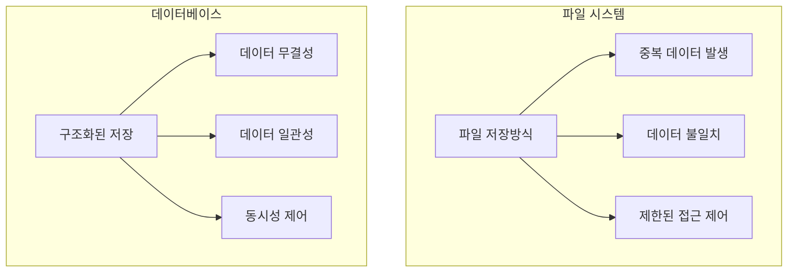
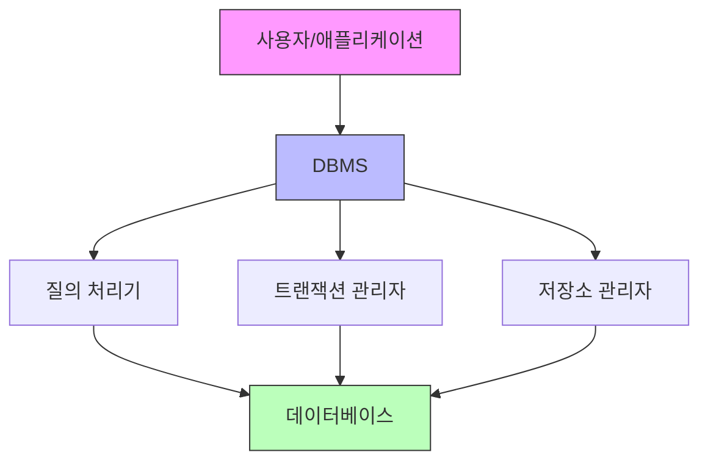
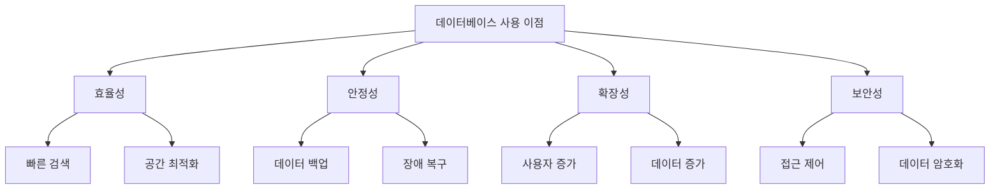
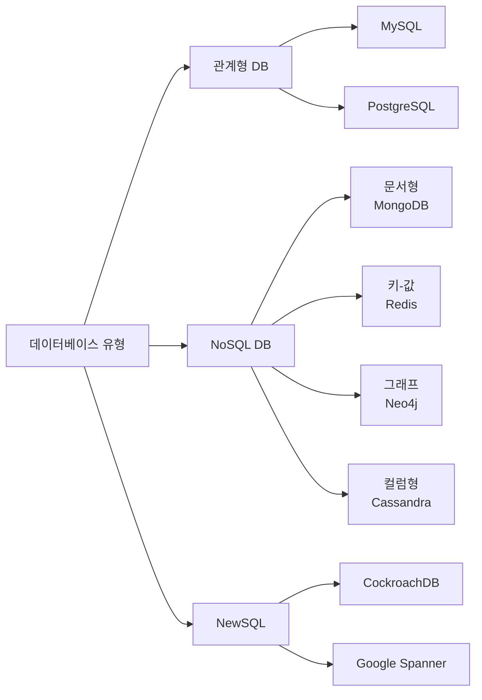
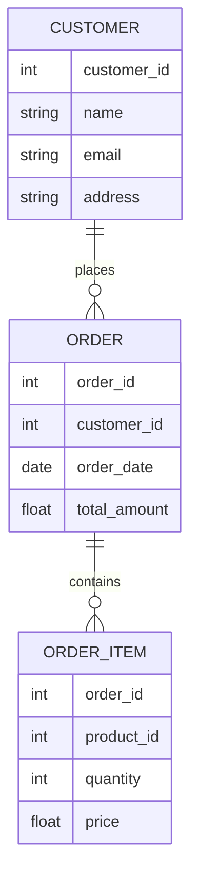

# 데이터베이스 입문

## 1. 데이터베이스란?

데이터베이스는 **체계적으로 구조화된 데이터의 조직화된 집합**입니다. 이는 단순한 데이터 저장소를 넘어서, 데이터의 효율적인 관리, 검색, 갱신을 가능하게 하는 통합 시스템입니다.

### 1.1 주요 특징

1. **구조적 데이터 저장**
  - 미리 정의된 구조(스키마)에 따라 데이터 저장
  - 일관된 형식으로 데이터 관리
  - 효율적인 검색과 갱신 지원

2. **데이터 무결성**
  - 데이터의 정확성과 일관성 보장
  - 중복 데이터 간의 관계 유지
  - 데이터 간의 관계 유지

3. **동시성 제어**
  - 다수 사용자의 동시 접근 관리
  - 데이터 일관성 유지
  - 충돌 방지 메커니즘 제공

### 1.2 데이터베이스 vs 파일 시스템

데이터베이스와 일반 파일 시스템의 주요 차이점을 이해하는 것은 매우 중요합니다.

**주요 차이점**

| 특징      | 파일 시스템      | 데이터베이스    |
|----------|---------------|-------------|
| 데이터 구조 | 단순 파일 구조 | 구조화된 형식 |
| 데이터 중복 | 높음 | 최소화 |
| 데이터 독립성 | 낮음 | 높음 |
| 동시 접근 | 제한적 | 지원 |
| 데이터 일관성 | 보장 어려움 | 보장 |
| 보안 | 파일 수준 | 다중 수준 |

---

## 2. DBMS란?

DBMS(Database Management System)은 **데이터베이스를 관리하고 운영하는 소프트웨어 시스템**입니다. 사용자와 데이터베이스 사이에서 중개자 역할을 수행하며, 데이터의 조작, 관리, 접근 제어 등을 담당합니다.

### 2.1 DBMS의 주요 기능

#### 2.1.1 데이터 조작(CRUD)
- Create(생성): 새로운 데이터 추가
- Read(읽기): 저장된 데이터 조회
- Update(수정): 기존 데이터 갱신
- Delete(삭제): 데이터 삭제

#### 2.1.2 트랜잭션 관리
- 데이터 처리의 논리적 단위 관리
- 장애 발생 시 복구 가능
- ACID 속성 보장

#### 2.1.3 보안 및 권한 관리
- 사용자 인증 및 권한 제어
- 데이터 암호화
- 접근 로깅 및 감사

### 2.2 RDBMS vs NoSQL

| 특징 | RDBMS | NoSQL |
|-----|-------------|-------------|
| 데이터 모델 | 정형화된 테이블 | 다양한 데이터 모델 |
| 스키마 | 고정 스키마 | 유연한 스키마 |
| 확장성 | 수직적 확장 | 수평적 확장 |
| 트랜잭션 | ACID 보장 | 일반적으로 BASE 원칙 |
| 사용 사례 | 복잡한 트랜잭션이 필요한 비즈니스 애플리케이션 | 대용량 데이터, 실시간 처리 |
| 대표제품 | MySQL, PosgreSQL, Oracle | MongoDB, Cassandra, Redis |

---

## 3. 왜 데이터베이스를 사용해야 하는가?

데이터베이스는 현대 애플리케이션에서 필수적인 요소이며, 다음과 같은 중요한 이점을 제공합니다.

### 3.1 데이터 저장 및 검색의 효율성

#### 3.1.1 빠른 데이터 접근
- 인덱싱을 통한 고속 검색
- 최적화된 쿼리 실행 계획
- 대용량 데이터 처리 능력

#### 3.1.2 구조화된 저장 방식
- 체계적인 데이터 구조화
- 관계를 통한 데이터 연결
- 효율적인 저장 공간 활용

### 3.2 데이터 무결성과 일관성

#### 3.2.1 데이터 중복 방지
- 정규화를 통한 중복 최소화
- 일관된 데이터 유지
- 저장 공간 절약

#### 3.2.2 데이터 일관성 보장
- 트랜잭션 관리
- 제약 조건 적용
- 동시성 제어

### 3.3 확장성과 보안

#### 3.3.1 확장 가능한 아키텍처
- 수직적/수평적 확장 지원
- 분산 데이터베이스 구성
- 고가용성 지원

#### 3.3.2 강력한 보안 기능
- 사용자 인증 및 권한 관리
- 데이터 암호화
- 감사 추적(Audit Trail)

### 3.4 비즈니스 이점

#### 3.4.1 데이터 기반 의사결정
- 정확한 데이터 분석
- 실시간 리포팅
- 비즈니스 인텔리전스

#### 3.4.2 규정 준수
- 데이터 보호 규정 준수
- 감사 대응
- 법적 요구사항 충족

---

## 4. 데이터베이스의 역사

데이터베이스 시스템은 데이터 관리의 필요성과 함께 진화해왔습니다. 주요 발전 단계를 살펴보겠습니다.

### 4.1 데이터베이스 시스템의 발전

#### 4.1.1 1960년대: 파일 시스템과 계층형 데이터베이스
- 단순 파일 기반 데이터 저장
- IBM의 IMS(Information Management System) 등장
- 트리 구조의 계층형 데이터베이스 출현

#### 4.1.2 1970년대: 관계형 데이터베이스의 탄생
- 1970년 E.F.Codd의 관계형 모델 제안
- SQL 언어의 개발
- Oracle, DB2등 상용 RDBMS 출시

#### 4.1.3 1980~90년대: RDBMS의 성장
- SQL 표준화(ANSI SQL)
- 클라이언트-서버 아키텍처 도입
- MySQL, PostgreSQL 등 오픈소스 DBMS 등장

### 4.2 주요 혁신 기술

#### 4.2.1 SQL 표준의 발전
- SQL-86: 첫 번째 ANSI 표준
- SQL-92: 가장 널리 구현된 표준
- SQL:1999: 객체-관계형 기능 추가
- SQL:2003: XML 지원 추가

#### 4.2.2 분산 데이터베이스
- 데이터 분산 처리 기술
- 클러스터링과 리플리케이션
- 글로벌 트랜잭션 관리

#### 4.2.3 클라우드 기반 데이터베이스
- DBaaS(Database as a Service)
- 자동 확장/축소
- 서버리스 데이터베이스

#### 4.2.4 최신 트랜드
- NewSQL: 분산 SQL 데이터베이스
- 블록체인 기반 데이터베이스
- AI/ML 통합 데이터베이스

---

## 5. 데이터베이스 유형

현대의 데이터베이스는 다양한 사용 사례와 요구사항을 충족하기 위해 여러 유형으로 발전해왔습니다.

### 5.1 관계형 데이터베이스 (RDBMS)

1. **주요 특징**
  - 테이블 기반의 데이터 구조
  - SQL을 통한 데이터 조작
  - ACID 트랜잭션 보장

2. **대표적인 제품**
  - Oracle
  - MySQL
  - PostgreSQL
  - Microsoft SQL Server

### 5.2 NoSQL 데이터베이스

1. **문서형 데이터베이스**
  - JSON/BSON 형태의 문서 저장
  - 스키마 유연성
  - 예: MongoDB, CouchDB

2. **키-값 저장소**
  - 단순한 키-값 구조
  - 고성능, 높은 확장성
  - 예: Redis, Amazon Dynamo DB

3. **그래프 데이터베이스**
  - 노드와 관계 중심 구조
  - 복잡한 관계 분석에 최적화
  - 예: Neo4j, Amazon Neptune

4. **컬럼형 데이터베이스**
  - 컬럼 기반 저장 구조
  - 대규모 분석에 적합
  - 예: Cassandra, Hbase

### 5.3 특수 목적 데이터베이스

1. **시계열 데이터베이스**
  - 시간 기반 데이터 처리
  - 예: InfluxDB, TimescaleDB

2. **인메모리 데이터베이스**
  - 메모리 기반 고속 처리
  - 예: Redis, Memcached

3. **검색 엔진 데이터베이스**
  - 전문 검색 최적화
  - 예: Elasticsearch, Solr

---

## 6. 데이터베이스의 핵심 개념

데이터베이스를 이해하고 효율적으로 사용하기 위해서는 다음과 같은 핵심 개념들을 이해해야 합니다.

### 6.1 테이블, 레코드, 필드

1. **테이블(Table)**
  - 데이터를 저장하는 기본 구조
  - 행(Row)과 열(Column)로 구성
  - 하나의 엔티티(Entity) 표현

2. **레코드(Record)**
  - 테이블의 행(Row)
  - 하나의 데이터 항목 집합
  - 개별 엔티티의 인스턴스

3. **필드(Field)**
  - 테이블의 열(Column)
  - 데이터의 속성을 정의
  - 특정 데이터 타입을 가짐

### 6.2 키(Key)와 관계(Relation)

1. **키의 종류**
  - 기본 키(Primary Key): 레코드 식별자
  - 외래 키(Foreign Key): 다른 테이블과의 관계
  - 후보 키(Candidate Key): 기본 키가 될 수 있는 키
  - 복합 키(Composite Key): 여러 필드로 구성된 키

2. **관계의 유형**
  - 일대일(1:1) 관계
  - 일대다(1:N) 관계
  - 다대다(N:M) 관계

### 6.3 스키마와 데이터 모델링

1. **스키마(Schema)**
  - 데이터베이스 구조 정의
  - 테이블, 필드, 관계 등을 포함
  - 데이터 무결성 규칙 정의

2. **데이터 모델링 단계**
  - 개념적 모델링
  - 논리적 모델링
  - 물리적 모델링

3. **정규화(Normalization)**
  - 데이터 중복 최소화
  - 데이터 일관성 보장
  - 제1정규형-제5정규형