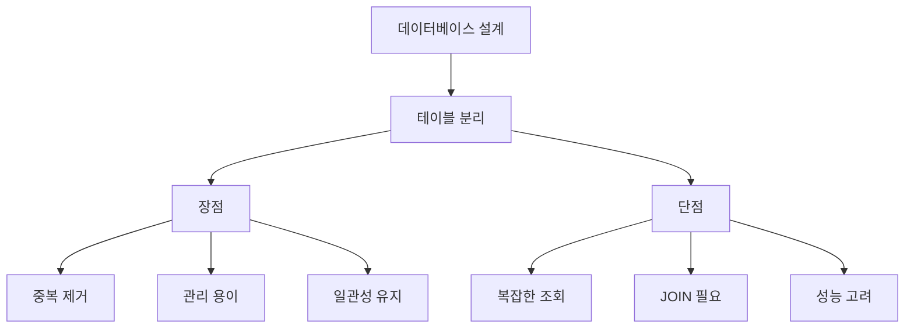
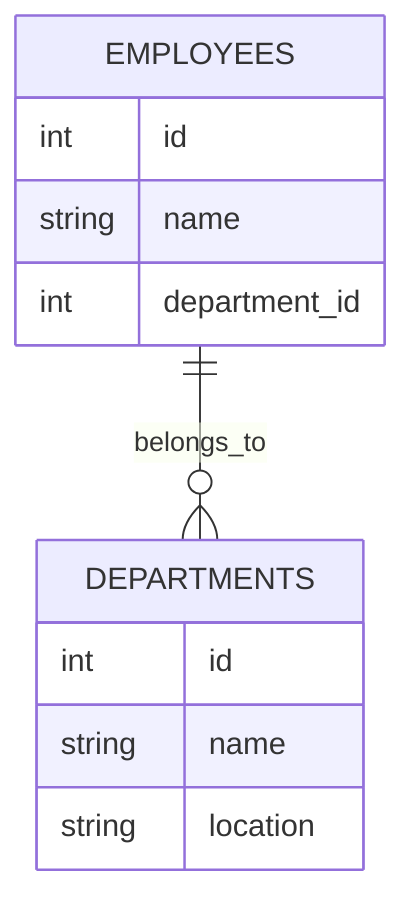
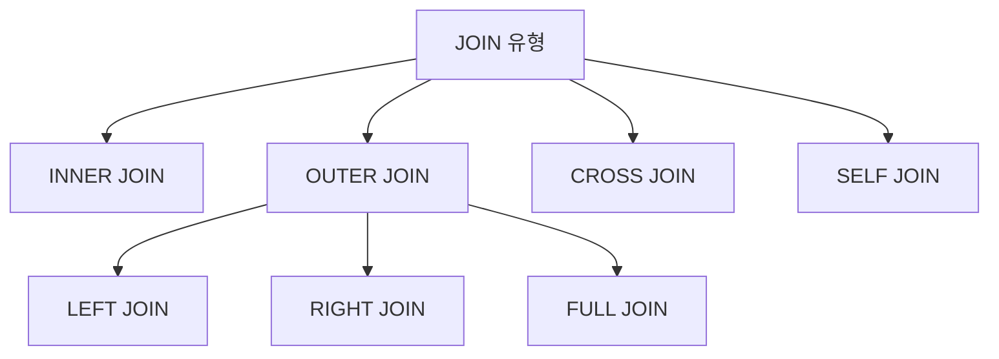
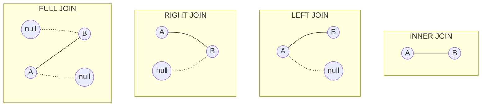
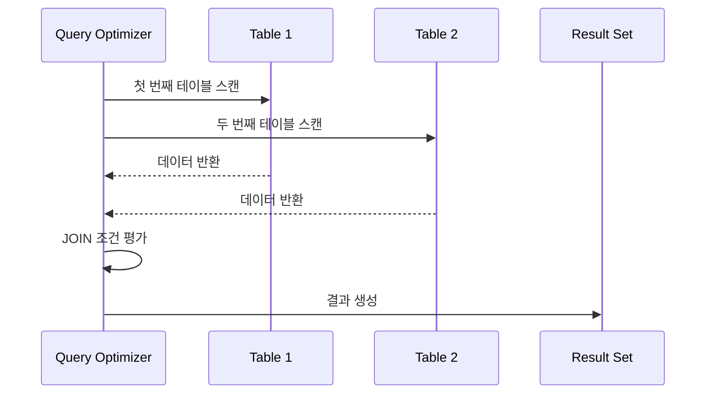
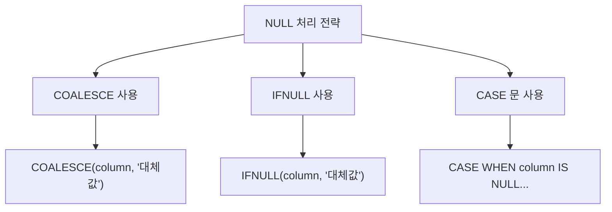
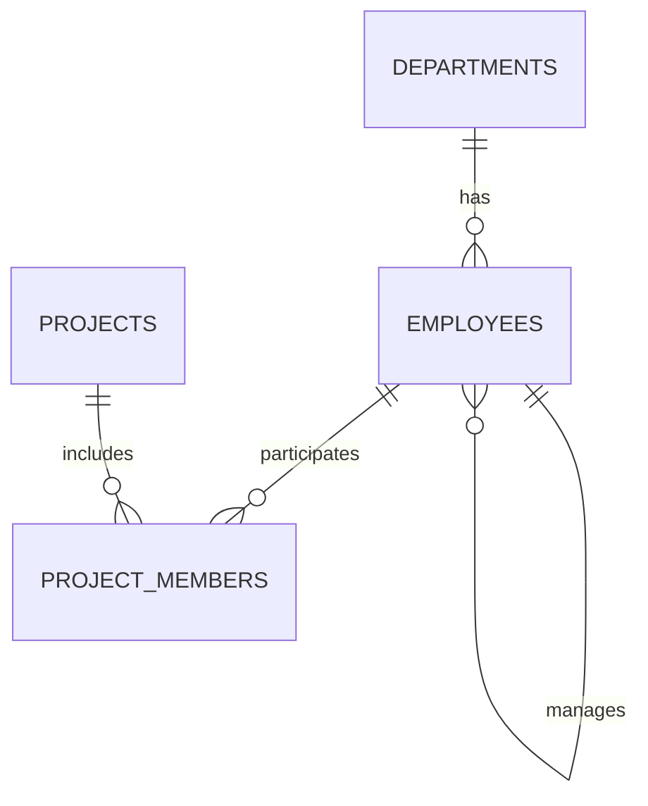
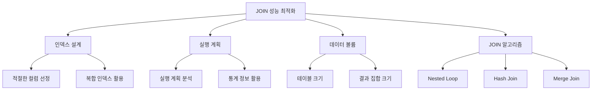
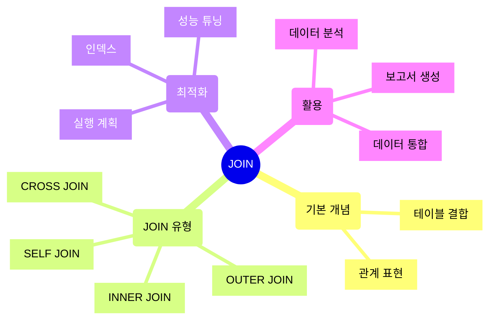

# 데이터베이스 JOIN

## 1. JOIN이란?

JOIN은 **관계형 데이터베이스에서 두 개 이상의 테이블을 연결하여 데이터를 결합하는 연산**입니다. 이를 통해 서로 다른 테이블에 분산된 데이터를 하나의 결과로 조회할 수 있습니다.

### 1.1 JOIN의 필요성

데이터베이스 설계에서 데이터는 효율적인 관리를 위해 여러 테이블로 나누어 저장됩니다. 예를 들어:

1. **데이터 중복 방지**
   - 각 정보를 적절한 테이블로 분리하여 저장
   - 정규화를 통한 데이터 일관성 유지
   - 저장 공간의 효율적 사용

2. **데이터 관리 용이성**
   - 관련 데이터를 논리적 단위로 그룹화
   - 데이터 갱신과 삭제가 용이
   - 참조 무결성 유지 가능



### 1.2 JOIN의 중요성

#### 1.2.1 데이터 분석 측면
- 연관된 데이터의 통합 분석 가능
- 복잡한 비즈니스 질문에 대한 답변 도출
- 데이터 간의 관계성 파악

#### 1.2.2 데이터베이스 설계 측면
- 정규화된 데이터 모델 구현
- 효율적인 데이터 구조 설계
- 데이터 일관성과 무결성 유지

### 1.3 JOIN 사용 예시

다음은 직원 정보와 부서 정보를 결합하는 간단한 예시입니다:

```sql
-- 기본 테이블 구조
CREATE TABLE employees (
    id INT PRIMARY KEY,
    name VARCHAR(100),
    department_id INT
);

CREATE TABLE departments (
    id INT PRIMARY KEY,
    name VARCHAR(50),
    location VARCHAR(100)
);

-- JOIN을 사용한 데이터 조회
SELECT e.name AS employee_name,
       d.name AS department_name,
       d.location
FROM employees e
JOIN departments d ON e.department_id = d.id;
```

이러한 JOIN은 다음과 같은 상황에서 특히 유용합니다:

| 시나리오 | JOIN 활용 |
|-----|-------------|
| 주문 시스템 | 주문-고객-제품 정보 연결 |
| 인사 관리 | 직원-부서-급여 정보 통합 |
| 재고 관리 | 제품-창고-재고 데이터 결합 |
| 학사 시스템 | 학생-과목-성적 정보 연동 |



### 1.4 JOIN 사용 시 고려사항

1. **성능**
  - 테이블 크기와 결합 조건 고려
  - 적절한 인덱스 설계 필요
  - 실행 계획 분석

2. **데이터 정합성**
  - NULL 값 처리 방식 결정
  - 중복 데이터 처리 전략
  - 데이터 일관성 유지

3. **가독성**
  - 명확한 별칭(alias) 사용
  - 조인 조건의 명확한 명시
  - 복잡한 조인의 단계적 구성

---

## 2. JOIN의 종류

SQL에서는 데이터를 결합하는 다양한 방식의 JOIN을 제공합니다. 각 JOIN은 서로 다른 결합 규칙을 가지고 있어 상황에 따라 적절한 JOIN을 선택해야 합니다.

### 2.1 JOIN의 기본 유형



#### 2.1.1 INNER JOIN
- 두 테이블에서 조인 조건을 만족하는 행만 반환
- 가장 일반적으로 사용되는 조인 방식
- NULL 값이나 매칭되지 않는 행은 결과에서 제외
```sql
SELECT employees.name, departments.name
FROM employees
INNER JOIN departments 
    ON employees.department_id = departments.id;
```

#### 2.1.2 OUTER JOIN

1. **LEFT OUTER JOIN**
  - 왼쪽 테이블의 모든 행을 포함
  - 오른쪽 테이블에서 매칭되는 행이 없으면 NULL 반환
  ```sql
  SELECT e.name, d.name
  FROM employees e
  LEFT JOIN departments d
      ON e.department_id = d.id;
  ```

2. **RIGHT OUTER JOIN**
  - 오른쪽 테이블의 모든 행을 포함
  - 왼쪽 테이블에서 매칭되는 행이 없으면 NULL 반환
  ```sql
  SELECT e.name, d.name
  FROM employees e
  RIGHT JOIN departments d
      ON e.department_id = d.id;
  ```

3. **FULL OUTER JOIN**
  - 양쪽 테이블의 모든 행을 포함
  - 매칭되지 않는 경우 NULL 반환
  ```sql
  SELECT e.name, d.name
  FROM employees e
  FULL OUTER JOIN departments d
      ON e.department_id = d.id;
  ```

### 2.2 특수한 JOIN 유형

#### 2.2.1 CROSS JOIN
- 두 테이블의 모든 가능한 조합을 생성
- 카테시안 곱(Cartesian Product) 생성
- 주의: 결과 행의 수는 두 테이블 행 수의 곱
```sql
SELECT e.name, d.name
FROM employees e
CROSS JOIN departments d;
```

#### 2.2.2 SELF JOIN
- 동일한 테이블을 자기 자신과 조인
- 조직도, 계층 구조 표현에 유용
- 별칭(alias) 사용이 필수
```sql
-- 관리자-직원 관계를 표현하는 SELF JOIN
SELECT e1.name AS employee,
       e2.name AS manager
FROM employees e1
LEFT JOIN employees e2
    ON e1.manager_id = e2.id;
```

### 2.3 JOIN 유형 비교

| JOIN 유형 | 결과 포함 범위 | 주요 사용 사례 | NULL 처리 |
|----------|-------------|-------------|-------------|
| INNER JOIN | 매칭되는 행만 | 필수 관계 데이터 조회 | 제외 |
| LEFT JOIN | 왼쪽 테이블 전체 | 옵션 관계 데이터 조회 | 포함 |
| RIGHT JOIN | 오른쪽 테이블 전체 | LEFT JOIN의 대체 | 포함 |
| FULL JOIN | 양쪽 테이블 전체 | 완전한 데이터셋 필요 시 | 포함 |
| CROSS JOIN | 모든 조합 | 가능한 모든 조합 필요 시 | 해당없음 |
| SELF JOIN | 자기 참조 관계 | 계층구조 표현 | 선택적 |

### 2.4 Visual JOIN 설명


### 2.5 JOIN 선택 가이드라인

1. **INNER JOIN 사용 시기**
  - 두 테이블 간 필수 관계가 있는 경우
  - NULL 값을 제외하고 싶은 경우
  - 데이터 정합성이 중요한 경우

2. **OUTER JOIN 사용 시기**
  - 누락된 데이터 확인이 필요한 경우
  - 옵션 관계를 표현해야 하는 경우
  - 데이터 감사나 검증이 필요한 경우

3. **CROSS JOIN 사용 시기**
  - 가능한 모든 조합이 필요한 경우
  - 제품 옵션 조합 생성
  - 통계적 분석이 필요한 경우

4. **SELF JOIN 사용 시기**
  - 계층 구조 표현
  - 순환 참조 관계 표현
  - 같은 테이블 내 레코드 비교

---

## 3. JOIN의 동작 원리

JOIN은 데이터베이스에서 복잡한 쿼리 처리 과정을 거치며, 이를 이해하는 것은 효율적인 쿼리 작성과 최적화에 매우 중요합니다.

### 3.1 기본 동작 프로세스



#### 3.1.1 JOIN 처리 단계

1. **테이블 접근**
  - 드라이빙(기준) 테이블 선택
  - 각 테이블의 데이터 읽기

2. **결합 조건 평가**
  - ON 절의 조건 검사
  - 매칭되는 레코드 찾기

3. **결과 집합 생성**
  - 조건을 만족하는 레코드 결합
  - 필요한 컬럼 선택

### 3.2 JOIN과 WHERE 절의 관계

#### 3.2.1 실행 순서
```sql
SELECT e.name, d.department_name
FROM employees e
JOIN departments d ON e.department_id = d.id
WHERE e.salary > 50000 AND d.location = 'Seoul';
```

1. **FROM 절 처리**
  - 기본 테이블 식별
  - 접근 경로 결정

2. **JOIN 처리**
  - ON 절 조건으로 레코드 결합
  - 임시 결과 집합 생성

3. **WHERE 절 처리**
  - 결합된 데이터 필터링
  - 최종 결과 집합 생성

### 3.3 ON절과 WHERE절의 차이
```sql
-- ON 절 사용 (JOIN 조건)
SELECT e.name, d.name
FROM employees e
LEFT JOIN departments d
    ON e.department_id = d.id 
    AND d.location = 'Seoul';

-- WHERE 절 사용 (필터링)
SELECT e.name, d.name
FROM employees e
LEFT JOIN departments d
    ON e.department_id = d.id
WHERE d.location = 'Seoul';
```

| 구분 | ON 절 | WHERE 절 |
|-----|-------------|-------------|
| 실행 시점 | JOIN 수행 중 | JOIN 후 |
| 영향 범위 | JOIN 결과 | 최종 결과 |
| OUTER JOIN 시 | NULL 보존 | NULL 제거 가능 |
| 주요 용도 | 결합 조건 정의 | 데이터 필터링 |

### 3.4 NULL 값 처리

#### 3.4.1 INNER JOIN에서의 NULL
```sql
-- NULL 값은 결과에서 제외됨
SELECT e.name, d.name
FROM employees e
INNER JOIN departments d
    ON e.department_id = d.id;
```

#### 3.4.2 OUTER JOIN에서의 NULL
```sql
-- NULL 값이 결과에 포함됨
SELECT e.name, COALESCE(d.name, '부서 미지정')
FROM employees e
LEFT JOIN departments d
    ON e.department_id = d.id;
```


### 3.5 JOIN 실행 계획 이해

#### 3.5.1 실행 계획 요소

1. **테이블 접근 방식**
  - 테이블 스캔
  - 인덱스 사용
  - 임시 테이블 사용

2. **조인 알고리즘**
  - Nested Loop Join
  - Hash Join
  - Merge Join

#### 3.5.2 실행 계획 예시
```sql
EXPLAIN
SELECT e.name, d.name
FROM employees e
JOIN departments d ON e.department_id = d.id
WHERE e.salary > 50000;
```

### 3.6 JOIN 처리 최적화

1. **인덱스 활용**
  - JOIN 컬럼에 적절한 인덱스 생성
  - 복합 인덱스 고려
  - 인덱스 선택성 확인

2. **테이블 순서 최적화**
  - 작은 테이블을 드라이빙 테이블로 선택
  - 조건절로 결과를 줄일 수 있는 테이블 우선 처리
  - 데이터 분포도 고려

3. **임시 테이블 사용**
  - 대용량 데이터 처리 시 임시 테이블 활용
  - 중간 결과 저장으로 성능 향상
  - 메모리 사용량 고려

---

## 4. JOIN 예제 코드

실제 비즈니스 시나리오를 바탕으로 다양한 JOIN 활용 예제를 살펴보겠습니다.

### 4.1 기본 예제 데이터베이스 구조

먼저 예제에서 사용할 테이블 구조를 정의합니다:

```sql
-- 부서 테이블
CREATE TABLE departments (
    id INT PRIMARY KEY,
    name VARCHAR(50),
    location VARCHAR(100),
    budget DECIMAL(15,2)
);

-- 직원 테이블
CREATE TABLE employees (
    id INT PRIMARY KEY,
    name VARCHAR(100),
    department_id INT,
    salary DECIMAL(10,2),
    manager_id INT
);

-- 프로젝트 테이블
CREATE TABLE projects (
    id INT PRIMARY KEY,
    name VARCHAR(100),
    start_date DATE,
    end_date DATE
);

-- 프로젝트 참여 테이블
CREATE TABLE project_members (
    project_id INT,
    employee_id INT,
    role VARCHAR(50),
    PRIMARY KEY (project_id, employee_id)
);
```


### 4.2 기본 JOIN 예제

#### 4.2.1 INNER JOIN
```sql
-- 직원과 부서 정보 결합
SELECT 
    e.name AS employee_name,
    d.name AS department_name,
    d.location
FROM employees e
INNER JOIN departments d ON e.department_id = d.id
WHERE d.location = 'Seoul'
ORDER BY e.name;
```

#### 4.2.2 LEFT JOIN
```sql
-- 부서가 없는 직원도 포함하여 조회
SELECT 
    e.name AS employee_name,
    COALESCE(d.name, '미배정') AS department_name
FROM employees e
LEFT JOIN departments d ON e.department_id = d.id
ORDER BY e.name;
```

### 4.3 복합 조건 JOIN

#### 4.3.1 다중 조건 JOIN
```sql
-- 특정 위치의 부서에서 일정 급여 이상 받는 직원
SELECT 
    e.name,
    d.name AS department,
    e.salary
FROM employees e
INNER JOIN departments d 
    ON e.department_id = d.id
    AND d.location IN ('Seoul', 'Busan')
    AND e.salary >= 50000;
```

#### 4.3.2 날짜 조건 JOIN
```sql
-- 현재 진행 중인 프로젝트 참여 직원
SELECT 
    e.name AS employee,
    p.name AS project,
    pm.role
FROM employees e
JOIN project_members pm ON e.id = pm.employee_id
JOIN projects p ON pm.project_id = p.id
WHERE p.start_date <= CURRENT_DATE 
AND (p.end_date >= CURRENT_DATE OR p.end_date IS NULL);
```

### 4.4 다중 테이블 JOIN

#### 4.4.1 3개 이상 테이블 JOIN
```sql
-- 직원, 부서, 프로젝트 정보 통합 조회
SELECT 
    e.name AS employee,
    d.name AS department,
    p.name AS project,
    pm.role
FROM employees e
JOIN departments d ON e.department_id = d.id
LEFT JOIN project_members pm ON e.id = pm.employee_id
LEFT JOIN projects p ON pm.project_id = p.id;
```

#### 4.4.2 집계 함수와 JOIN
```sql
-- 부서별 프로젝트 참여 현황
SELECT 
    d.name AS department,
    COUNT(DISTINCT p.id) AS project_count,
    COUNT(DISTINCT pm.employee_id) AS member_count
FROM departments d
LEFT JOIN employees e ON d.id = e.department_id
LEFT JOIN project_members pm ON e.id = pm.employee_id
LEFT JOIN projects p ON pm.project_id = p.id
GROUP BY d.id, d.name
ORDER BY project_count DESC;
```

### 4.5 SELF JOIN 활용

#### 4.5.1 관리자-직원 관계
```sql
-- 직원과 관리자 정보 조회
SELECT 
    e1.name AS employee,
    e2.name AS manager,
    d.name AS department
FROM employees e1
LEFT JOIN employees e2 ON e1.manager_id = e2.id
JOIN departments d ON e1.department_id = d.id
ORDER BY d.name, e1.name;
```

#### 4.5.2 조직 계층 구조
```sql
-- 조직 계층 구조 표현
WITH RECURSIVE org_hierarchy AS (
    -- 최상위 관리자
    SELECT 
        id,
        name,
        manager_id,
        1 AS level,
        name AS path
    FROM employees
    WHERE manager_id IS NULL
    
    UNION ALL
    
    -- 하위 직원
    SELECT 
        e.id,
        e.name,
        e.manager_id,
        oh.level + 1,
        oh.path || ' > ' || e.name
    FROM employees e
    JOIN org_hierarchy oh ON e.manager_id = oh.id
)
SELECT path, level
FROM org_hierarchy
ORDER BY path;
```

### 4.6 고급 JOIN 테크닉

#### 4.6.1 서브쿼리와 JOIN
```sql
-- 부서별 평균 급여보다 높은 급여를 받는 직원
SELECT 
    e.name,
    e.salary,
    d.name AS department,
    dept_avg.avg_salary
FROM employees e
JOIN departments d ON e.department_id = d.id
JOIN (
    SELECT 
        department_id,
        AVG(salary) AS avg_salary
    FROM employees
    GROUP BY department_id
) dept_avg ON e.department_id = dept_avg.department_id
WHERE e.salary > dept_avg.avg_salary;
```

#### 4.6.2 조건부 JOIN
```sql
-- 부서 예산에 따른 조건부 직원 조회
SELECT 
    e.name,
    d.name AS department,
    d.budget,
    CASE
        WHEN d.budget > 1000000 THEN 'High Budget'
        WHEN d.budget > 500000 THEN 'Medium Budget'
        ELSE 'Low Budget'
    END AS budget_category
FROM employees e
JOIN departments d ON e.department_id = d.id
WHERE CASE
    WHEN d.budget > 1000000 THEN e.salary > 70000
    WHEN d.budget > 500000 THEN e.salary > 50000
    ELSE e.salary > 30000
END;
```

---

## 5. JOIN의 성능 최적화

JOIN 연산은 데이터베이스의 성능에 큰 영향을 미칠 수 있으므로, 효율적인 최적화 전략이 필요합니다.

### 5.1 JOIN 성능의 주요 고려사항



### 5.2 JOIN 알고리즘 이해

#### 5.2.1 Nested Loop Join
- 중첩 반복문과 유사한 방식으로 동작
- 작은 데이터셋에 효과적
- 인덱스가 있을 때 유용
```sql
-- Nested Loop Join에 적합한 쿼리 예시
SELECT e.name, d.name
FROM employees e
JOIN departments d ON e.department_id = d.id
WHERE e.salary > 50000
AND d.location = 'Seoul';
```

#### 5.2.2 Hash Join
- 해시 테이블을 사용하여 조인
- 대용량 데이터에 효과적
- 동등 조인(equi-join)에만 사용 가능
```sql
-- Hash Join에 적합한 쿼리 예시
SELECT e.name, d.name
FROM employees e
JOIN departments d ON e.department_id = d.id
WHERE e.hire_date >= '2023-01-01';
```

#### 5.2.3 Merge Join
- 정렬된 데이터를 병합하는 방식
- 정렬된 인덱스가 있을 때 효과적
- 범위 조건에 유용
```sql
-- Merge Join에 적합한 쿼리 예시
SELECT e.name, s.amount
FROM employees e
JOIN salaries s ON e.id = s.employee_id
WHERE s.payment_date BETWEEN '2023-01-01' AND '2023-12-31';
```

### 5.3 인덱스 최적화

#### 5.3.1 JOIN 컬럼 인덱스
```sql
-- JOIN 컬럼에 대한 인덱스 생성
CREATE INDEX idx_employees_dept 
ON employees(department_id);

CREATE INDEX idx_dept_location 
ON departments(location);
```

#### 5.3.2 복합 인덱스 설계
```sql
-- 자주 사용되는 조건을 포함한 복합 인덱스
CREATE INDEX idx_emp_dept_salary 
ON employees(department_id, salary);

-- 커버링 인덱스
CREATE INDEX idx_emp_covering 
ON employees(department_id, name, salary);
```

### 5.4 실행 계획 최적화

#### 5.4.1 실행 계획 분석
```sql
EXPLAIN ANALYZE
SELECT e.name, d.name, d.location
FROM employees e
JOIN departments d ON e.department_id = d.id
WHERE e.salary > 50000;
```
| 최적화 포인트 | 체크 항목 | 개선 방안 |
|-----------|-------------|-------------|
| 테이블 접근 | 테이블 스캔 여부 | 인덱스 추가 |
| JOIN 방식 | 사용된 알고리즘 | 적절한 알고리즘 선택 |
| 중간 결과 | 임시 테이블 사용 | 인덱스 또는 쿼리 수정 |
| 필터링 | WHERE 조건 처리 시점 | 인덱스 활용 개선 |

#### 5.4.2 통계 정보 관리
```sql
-- 통계 정보 갱신
ANALYZE employees;
ANALYZE departments;

-- 특정 테이블의 통계 정보 확인
SELECT * FROM pg_stats 
WHERE tablename = 'employees';
```

### 5.5 대용량 데이터 처리 전략

#### 5.5.1 배치 처리
```sql
-- 구간을 나누어 처리
WITH RECURSIVE batch_ranges AS (
    SELECT MIN(id) AS start_id, 
           MIN(id) + 999 AS end_id
    FROM employees
    UNION ALL
    SELECT end_id + 1,
           LEAST(end_id + 1000, (SELECT MAX(id) FROM employees))
    FROM batch_ranges
    WHERE end_id < (SELECT MAX(id) FROM employees)
)
SELECT e.name, d.name
FROM batch_ranges br
JOIN employees e ON e.id BETWEEN br.start_id AND br.end_id
JOIN departments d ON e.department_id = d.id;
```

#### 5.5.2 파티셔닝 활용
```sql
-- 파티션 테이블 생성 예시
CREATE TABLE employees_partitioned (
    id INT,
    name VARCHAR(100),
    department_id INT,
    salary DECIMAL(10,2)
) PARTITION BY RANGE (department_id);

-- 파티션 생성
CREATE TABLE emp_dept_1_10 
PARTITION OF employees_partitioned
FOR VALUES FROM (1) TO (11);

CREATE TABLE emp_dept_11_20 
PARTITION OF employees_partitioned
FOR VALUES FROM (11) TO (21);
```

### 5.6 성능 모니터링 및 튜닝

#### 5.6.1 성능 메트릭 수집
```sql
-- 쿼리 실행 시간 측정
\timing
SELECT e.name, d.name
FROM employees e
JOIN departments d ON e.department_id = d.id;

-- 특정 쿼리의 실행 통계 수집
EXPLAIN (ANALYZE, BUFFERS)
SELECT e.name, d.name
FROM employees e
JOIN departments d ON e.department_id = d.id;
```

#### 5.6.2 성능 튜닝 체크리스트

1. **인덱스 상태 확인**
  - 적절한 인덱스 존재 여부
  - 인덱스 사용 여부
  - 인덱스 단편화 정도

2. **실행 계획 검토**
  - JOIN 순서 최적화
  - 테이블 접근 방식
  - 필터 적용 시점

3. **데이터 분포도 확인**
  - 컬럼 값의 분포
  - NULL 값의 비율
  - 데이터 편향성

---

## 6. 참고 자료 및 결론

### 6.1 주요 내용 요약

#### 6.1.1 JOIN의 핵심 개념


#### 6.1.2 핵심 포인트 정리

1. **JOIN의 기본 원리**
  - 테이블 간 관계를 기반으로 데이터 결합
  - 다양한 JOIN 유형을 통한 유연한 데이터 조회
  - NULL 값 처리와 데이터 정합성 고려

2. **성능 최적화**
  - 적절한 인덱스 설계와 활용
  - 실행 계획 분석과 최적화
  - 대용량 데이터 처리 전략

3. **실무 활용**
  - 복잡한 비즈니스 요구사항 구현
  - 데이터 분석과 리포팅
  - 시스템 통합과 데이터 마이그레이션

### 6.2 모범 사례 및 안티 패턴

#### 6.2.1 권장 사례
```sql
-- 명시적 JOIN 구문 사용
SELECT p.name, c.name
FROM products p
JOIN categories c ON p.category_id = c.id;

-- 적절한 인덱스 활용
CREATE INDEX idx_category_id ON products(category_id);

-- 명확한 별칭 사용
SELECT 
    emp.name AS employee_name,
    dept.name AS department_name
FROM employees emp
JOIN departments dept ON emp.department_id = dept.id;
```

#### 6.2.2 피해야 할 사례
```sql
-- 암시적 JOIN 구문 (피해야 함)
SELECT p.name, c.name
FROM products p, categories c
WHERE p.category_id = c.id;

-- 불필요한 JOIN (피해야 함)
SELECT p.name
FROM products p
JOIN categories c ON p.category_id = c.id
WHERE p.id = 1;

-- 모호한 컬럼 참조 (피해야 함)
SELECT name, id
FROM products
JOIN categories ON category_id = id;
```

### 6.3 마무리

JOIN은 관계형 데이터베이스의 핵심 기능으로, 데이터 모델링과 쿼리 작성에서 중요한 역할을 합니다. 효율적인 JOIN의 사용을 위해서는:

1. **기본 원리의 이해**
  - 각 JOIN 유형의 특성 파악
  - 데이터 결합 방식의 이해
  - NULL 값 처리 방법 숙지

2. **성능 최적화**
  - 적절한 인덱스 설계
  - 실행 계획 분석 능력
  - 대용량 데이터 처리 전략

3. **지속적인 학습과 실습**
  - 다양한 시나리오 실습
  - 성능 모니터링과 튜닝
  - 새로운 기술과 패턴 학습