# 데이터베이스 트랜잭션 (Database Transactions)

## 1. 트랜잭션이란?

트랜잭션은 **데이터베이스의 상태를 변환시키는 하나의 논리적 작업 단위**를 구성하는 연산들의 모임입니다. 
트랜잭션은 데이터베이스의 일관성을 보장하기 위한 핵심 메커니즘입니다.

### 1.1 기본 개념

트랜잭션은 다음과 같은 특성을 가진 작업 단위입니다:

1. **원자성 보장**
   - 모든 작업이 성공하거나 모두 실패
   - 부분적 실행 방지
   - 데이터 일관성 유지

2. **논리적 단위**
   - 업무적으로 의미 있는 작업의 묶음
   - 하나의 목적을 위한 연속된 작업들
   - 작업 간의 연관성 유지

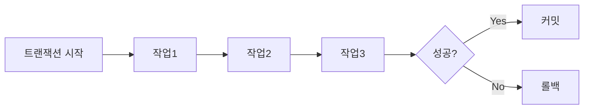

### 1.2 트랜잭션의 역할과 중요성

#### 1.2.1 데이터 무결성 보장
- 데이터의 정확성과 일관성 유지
- 비즈니스 규칙과 제약조건 준수
- 시스템 장애로부터 데이터 보호

#### 1.2.2 동시성 제어
- 다중 사용자 환경에서 데이터 일관성 유지
- 데이터 접근 충돌 방지
- 안전한 데이터 조작 보장

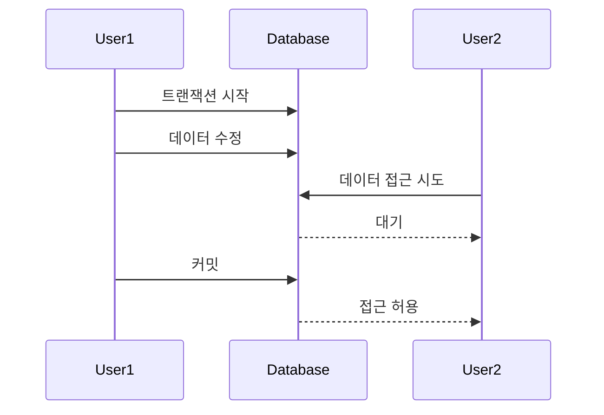

### 1.3 데이터베이스 안정성과 무결성

#### 1.3.1 시스템 장애 대응

1. **하드웨어 장애**
  - 전원 공급 중단
  - 저장 장치 오류
  - 네트워크 문제

2. **소프트웨어 장애**
  - 프로그램 오류
  - 시스템 충돌
  - 운영체제 문제

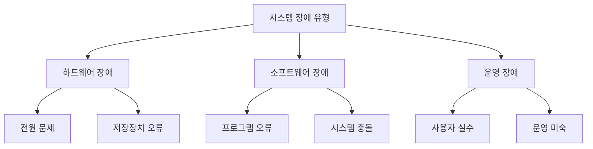

#### 1.3.2 데이터 복구 메커니즘
- 트랜잭션 로그 기반 복구
- 체크포인트 활용
- 백업 및 복원 전략

**트랜잭션은 이러한 다양한 장애 상황에서도 데이터베이스의 일관성과 신뢰성을 보장하는 핵심 메커니즘으로 작동합니다.**

---

## 2. 트랜잭션의 특징

트랜잭션의 가장 중요한 특징은 **ACID**라고 하는 4가지 핵심 속성입니다. 
이는 데이터베이스 트랜잭션이 안전하게 수행된다는 것을 보장하는 성질입니다.

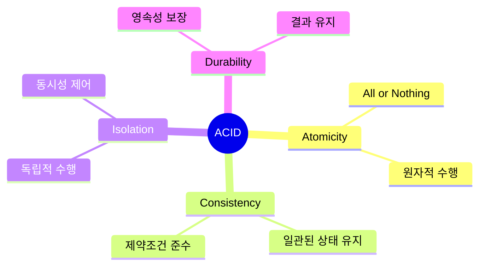

### 2.1 원자성 (Atomicity)

원자성은 트랜잭션의 연산들이 **모두 성공하거나 실패**하는 성질을 의미합니다.

#### 2.1.1 원자성의 특징
- 부분적 실행 불가능
- 중간 상태 없음
- 완료 또는 철회만 존재

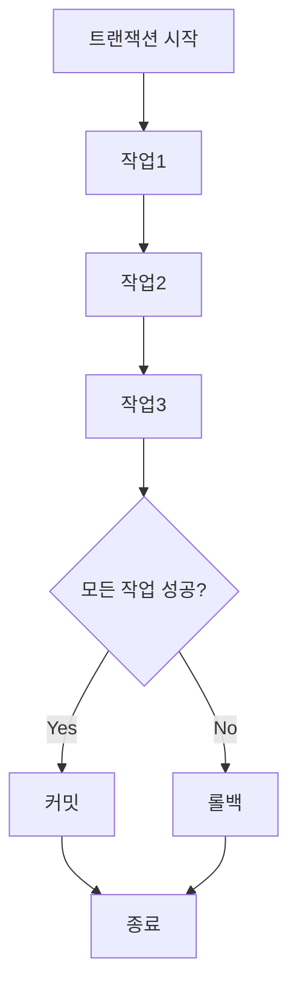

#### 2.1.2 원자성 보장 방법

1. **로깅 메커니즘**
  - 변경사항 기록
  - 복구 정보 유지
  - 장애 대비

2. **롤백 처리**
  - 실패 시 이전 상태로 복원
  - 부분 실행 취소
  - 데이터 일관성 유지

### 2.2 일관성 (Consistency)

일관성은 트랜잭션 실행 전과 후에 데이터베이스가 **일관된 상태**를 유지하는 성질입니다.

#### 2.2.1 일관성의 의미
- 데이터베이스 제약조건 준수
- 비즈니스 규칙 유지
- 참조 무결성 보장

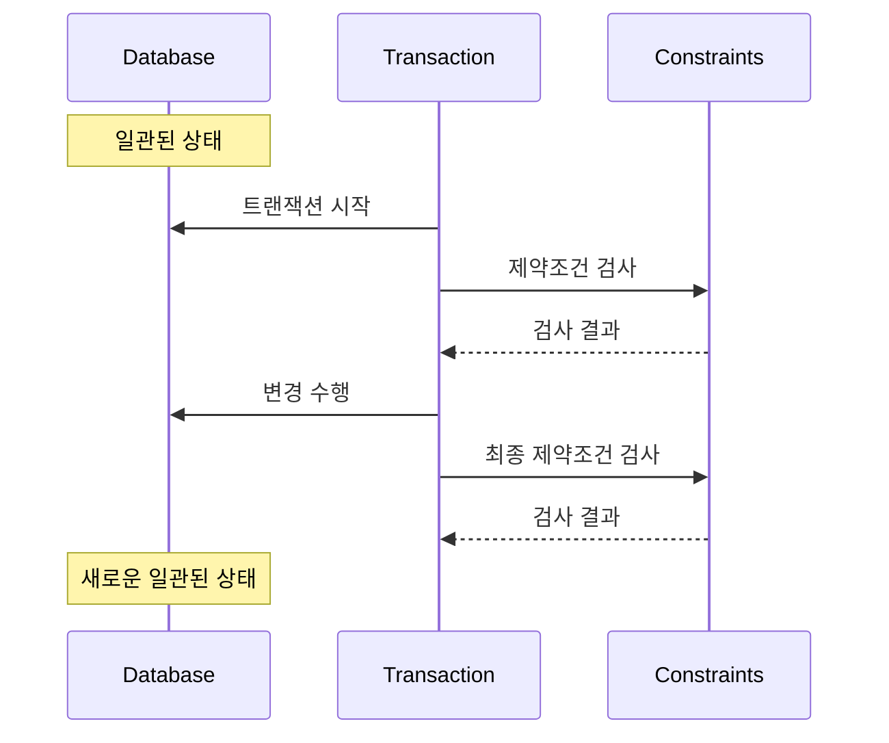

#### 2.2.2 일관성 유지 방법

1. **제야조건 정의**
  - PRIMARY KEY
  - FOREIGN KEY
  - CHECK 제약조건

2. **업무 규칙 구현**
  - 트리거
  - 저장 프로시저
  - 애플리케이션 로직

### 2.3 격리성 (Isolation)

격리성은 동시에 실행되는 트랜잭션들이 **서로 영향을 미치지 않도록** 보장하는 성질입니다.

#### 2.3.1 격리성의 중요성
- 동시성 제어
- 데이터 일관성 유지
- 트랜잭션 간 독립성 보장

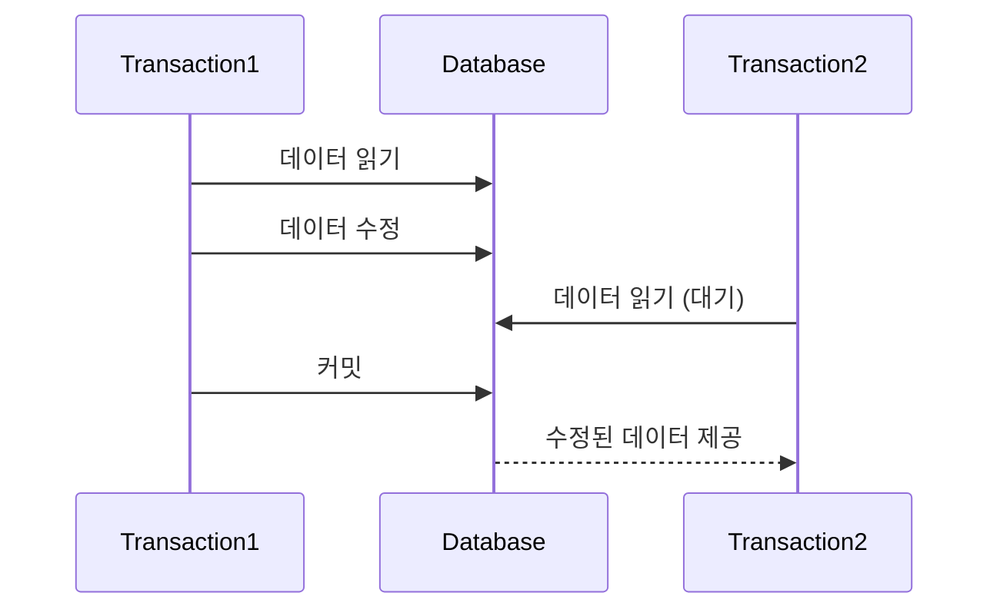

#### 2.3.2 격리성 구현 방법

1. **잠금(Lock) 메커니즘**
  - 공유 잠금(Shared Lock)
  - 베타적 잠금(Exclusive Lock)
  - 데드락 방지

2. **버전 관리**
  - MVCC(Multi-Version Concurrency Control)
  - 읽기 일관성 보장
  - 동시성 향상

### 2.4 지속성 (Durability)

지속성은 성공적으로 완료된 트랜잭션의 결과가 **영구적으로 반영**되는 성질입니다.

#### 2.4.1 지속성의 보장
- 커밋된 트랜잭션 결과 유지
- 시스템 장애 복구 후에도 유지
- 영구 저장소에 기록

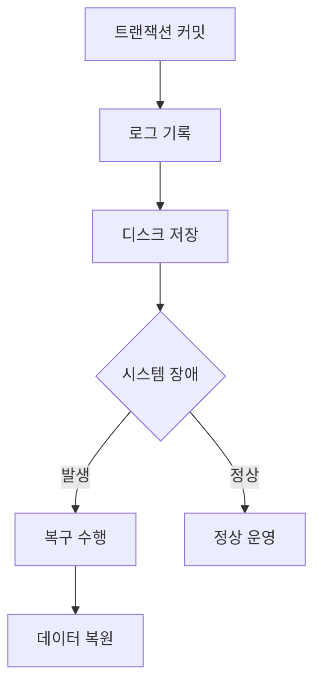

#### 2.4.2 지속성 구현 방법

1. **로그 기반 복구**
  - WAL(Write-Ahead-Logging)
  - 리두(Redo) 로그
  - 언두(Undo) 로그

2. **백업 및 복구**
  - 정기적 백업
  - 장애 복구 계획
  - 데이터 보호

---

## 3. 트랜잭션 격리 수준

트랜잭션 격리 수준은 동시에 실행되는 트랜잭션들 간의 **상호작용을 제어**하는 단계별 규칙을 정의합니다.
각 수준은 데이터 일관성과 동시성 간의 균형을 조정합니다.

### 3.1 격리 수준의 종류

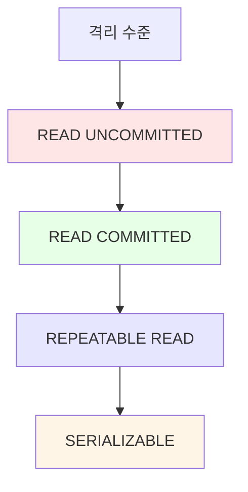

#### 3.1.1 READ UNCOMMITTED (레벨 0)
- 가장 낮은 격리 수준
- 커밋되지 않은 데이터 읽기 가능
- **Dirty Read** 발생 가능

```sql
-- READ UNCOMMITTED 설정
SET TRANSACTION ISOLATION LEVEL READ UNCOMMITTED;
BEGIN;
    SELECT * FROM accounts WHERE user_id = 1;
COMMIT;
```

#### 3.1.2 READ COMMITTED (레벨 1)
- 커밋된 데이터만 읽기 가능
- **Non-Repeatable Read** 발생 가능
- 대부분의 DBMS의 기본 격리 수준

```sql
-- READ COMMITTED 설정
SET TRANSACTION ISOLATION LEVEL READ COMMITTED;
BEGIN;
    SELECT * FROM accounts WHERE user_id = 1;
    -- 다른 트랜잭션의 커밋된 변경사항이 보임
    SELECT * FROM accounts WHERE user_id = 1;
COMMIT;
```

#### 3.1.3 REPEATABLE READ (레벨 2)
- 트랜잭션 내에서 일관된 읽기 보장
- **Phantom Read** 발생 가능
- MySQL InnoDB의 기본 격리 수준

```sql
-- REPEATABLE READ 설정
SET TRANSACTION ISOLATION LEVEL REPEATABLE READ;
BEGIN;
    SELECT * FROM accounts WHERE balance > 1000;
    -- 동일한 결과 보장
    SELECT * FROM accounts WHERE balance > 1000;
COMMIT;
```

#### 3.1.4 SERIALIZABLE (레벨 3)
- 가장 높은 격리 수준
- 완벽한 일관성 보장
- 성능 저하 가능성 높음

```sql
-- SERIALIZABLE 설정
SET TRANSACTION ISOLATION LEVEL SERIALIZABLE;
BEGIN;
    SELECT * FROM accounts WHERE user_id = 1;
    -- 완벽한 격리 보장
COMMIT;
```

### 3.2 격리 수준과 발생 가능한 문제

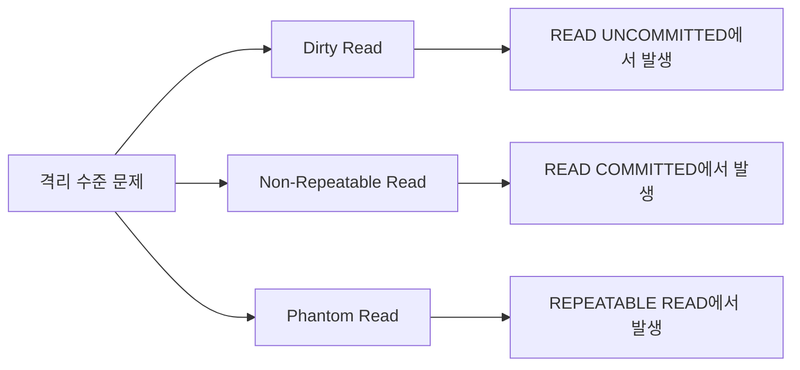

#### 3.2.1 Dirty Read
- 커밋되지 않은 데이터 읽기
- 데이터 정합성 문제 발생
- **READ UNCOMMITTED**에서 발생
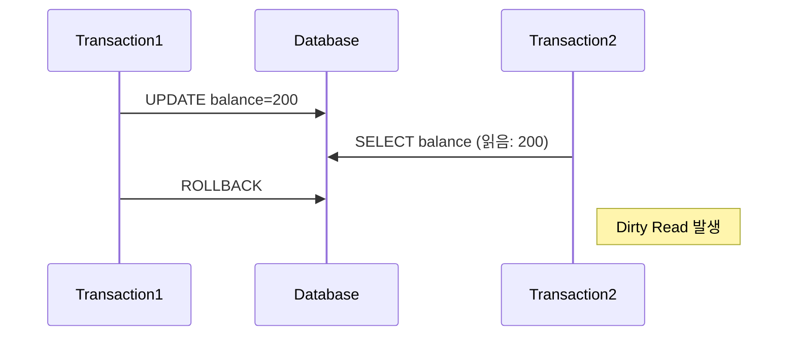

#### 3.2.2 Non-Repeatable Read
- 동일 쿼리의 결과가 다름
- 트랜잭션 도중 데이터 변경
- **READ COMMITTED**에서 발생
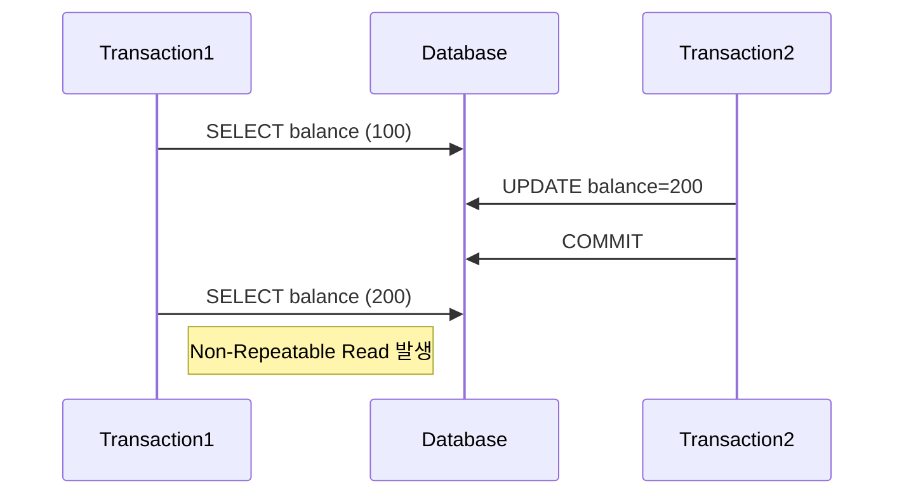

#### 3.2.3 Phantom Read
- 결과 집합의 행이 변경됨
- 트랜잭션 도중 새로운 행 추가/삭제
- **REPEATABLE READ**에서 발생
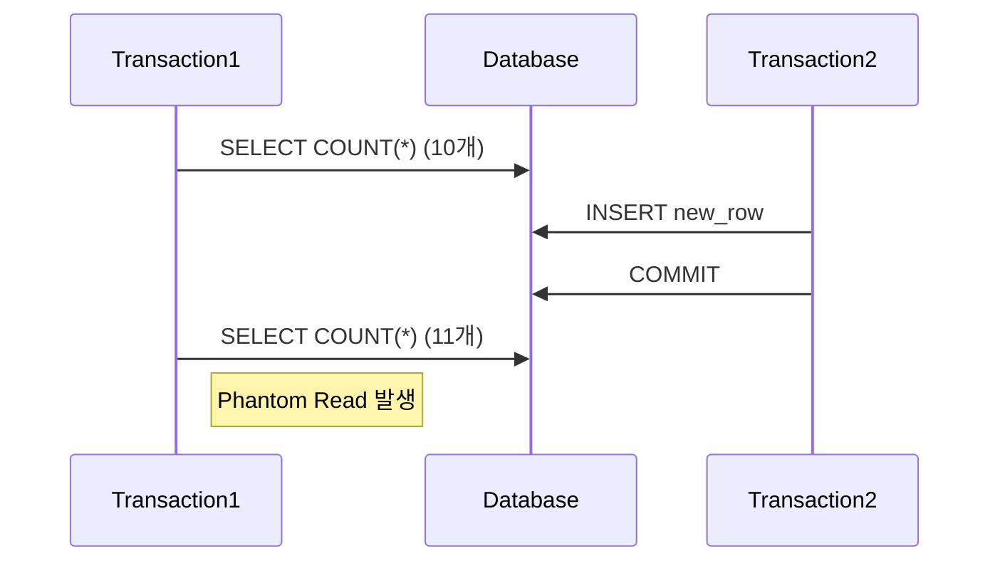

### 3.3 격리 수준 선택 기준

#### 3.3.1 고려 사항

1. **데이터 일관성 요구사항**
  - 업무의 중요도
  - 데이터 정확성 필요성
  - 법적/규제 요구사항

2. **성능 요구사항**
  - 동시 처리량
  - 응답 시간
  - 시스템 자원

3. **애플리케이션 특징**
  - 동시 사용자 수
  - 데이터 갱신 빈도
  - 읽기/쓰기 비율

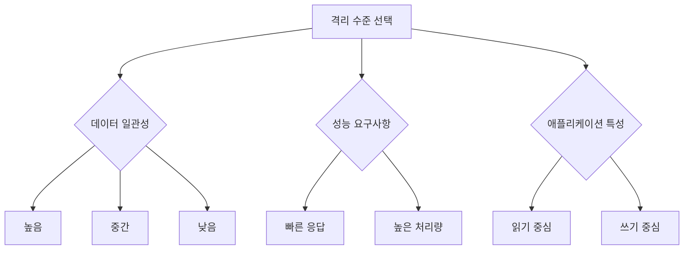

#### 3.3.2 격리 수준 비교표
| 격리 수준 | Dirty Read | Non-Repeatable Read | Phantom Read | 성능 영향 |
|------------|-------------|-------------|-------------|-------------|
| READ UNCOMMITTED | 발생 | 발생 | 발생 | 최소 |
| READ COMMITTED | 없음 | 발생 | 발생 | 적음 |
| REPEATABLE READ | 없음 | 없음 | 발생 | 중간 |
| SERIALIZABLE | 없음 | 없음 | 없음 | 최대 |

---

## 4. 트랜잭션의 주요 명령어

트랜잭션을 제어하기 위한 TCL(Transaction Control Language) 명령어들을 살펴보겠습니다.
이러한 명령어들은 트랜잭션의 시작, 종료, 취소 등을 관리합니다.

### 4.1 트랜잭션 제어 명령어

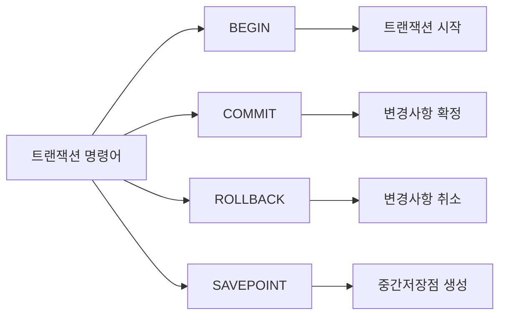

#### 4.1.1 BEGIN / START TRANSACTION
- 트랜잭션 시작을 명시
- 이후의 모든 명령문을 하나의 작업 단위로 묶음
- DBMS에 따라 문법이 다를 수 있음
```sql
-- MySQL, PostgreSQL
BEGIN;
-- 또는
START TRANSACTION;

-- 트랜잭션 시작 후 작업 수행
UPDATE accounts SET balance = balance - 1000 WHERE id = 1;
UPDATE accounts SET balance = balance + 1000 WHERE id = 2;
```

#### 4.1.2 COMMIT
- 트랜잭션의 변경사항을 영구적으로 저장
- 다른 사용자에게 변경사항 공개
- 트랜잭션 종료
```sql
BEGIN;
    INSERT INTO orders (user_id, product_id, quantity)
    VALUES (1, 100, 5);
    
    UPDATE inventory
    SET stock = stock - 5
    WHERE product_id = 100;
COMMIT;
```

#### 4.1.3 ROLLBACK
- 트랜잭션의 모든 변경사항을 취소
- 트랜잭션 시작 지점으로 복구
- 오류 발생 시 사용
```sql
BEGIN;
    -- 잘못된 계좌로 송금
    UPDATE accounts SET balance = balance - 1000 WHERE id = 1;
    UPDATE accounts SET balance = balance + 1000 WHERE id = 3;
    
    -- 실수를 발견하고 롤백
    ROLLBACK;
```

### 4.2 SAVEPOINT와 부분 롤백
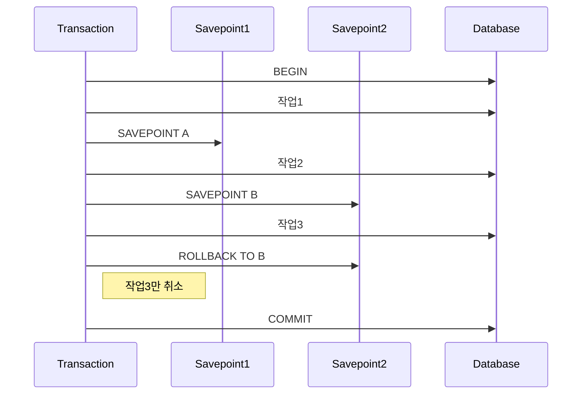

#### 4.2.1 SAVEPOINT
- 트랜잭션 내의 중간 저장점
- 부분 롤백을 위한 지점 지정
- 복잡한 트랜잭션 관리에 유용
```sql
BEGIN;
    -- 첫 번째 작업
    INSERT INTO orders (user_id, product_id, quantity)
    VALUES (1, 100, 5);
    
    SAVEPOINT order_created;
    
    -- 두 번째 작업
    UPDATE inventory
    SET stock = stock - 5
    WHERE product_id = 100;
    
    -- 재고 부족 시 주문만 롤백
    ROLLBACK TO order_created;
COMMIT;
```

#### 4.2.2 ROLLBACK TO SAVEPOINT
- 특정 SAVEPOINT까지만 롤백
- 트랜잭션은 계속 유지
- 선택적 복구 가능
```sql
BEGIN;
    -- 고객 정보 입력
    INSERT INTO customers (name, email) VALUES ('John Doe', 'john@example.com');
    SAVEPOINT customer_created;
    
    -- 주문 정보 입력
    INSERT INTO orders (customer_id, product_id) VALUES (LAST_INSERT_ID(), 100);
    SAVEPOINT order_created;
    
    -- 결제 처리
    INSERT INTO payments (order_id, amount) VALUES (LAST_INSERT_ID(), 500);
    
    -- 결제 실패 시
    ROLLBACK TO order_created;
    
    -- 다른 결제 방법 시도
    INSERT INTO payments (order_id, amount, method) VALUES (LAST_INSERT_ID(), 500, 'CARD');
COMMIT;
```

### 4.3 자동 커밋 설정

#### 4.3.1 AUTOCOMMIT
- 각 SQL문을 자동으로 커밋
- 기본값은 DBMS에 따라 다름
- 트랜잭션 관리에 영향
```sql
-- MySQL에서 자동 커밋 설정 확인
SHOW VARIABLES LIKE 'autocommit';

-- 자동 커밋 비활성화
SET autocommit = 0;

-- 자동 커밋 활성화
SET autocommit = 1;
```

#### 4.3.2 명시적 트랜잭션 vs 자동 커밋
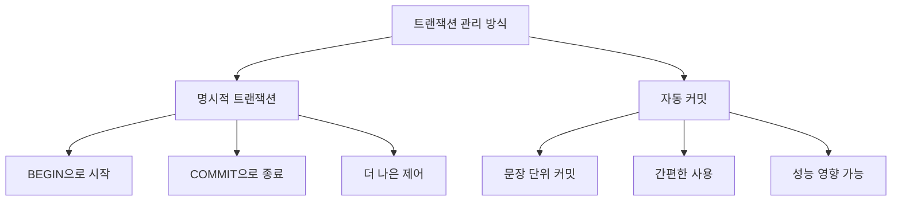
| 특징 | 명시적 트랜잭션 | 자동 커밋 |
|-----|-------------|-------------|
| 제어 수준 | 높음 | 낮음 |
| 사용 복잡도 | 복잡함 | 단순함 |
| 실수 가능성 | 낮음 | 높음 |
| 성능 영향 | 최적화 가능 | 오버헤드 가능성 |

---

## 5. 트랜잭션 실습

실제 비즈니스 시나리오를 바탕으로 트랜잭션의 활용 방법을 살펴보겠습니다.
다양한 상황에서 트랜잭션을 어떻게 활용하는지 실습을 통해 학습합니다.

### 5.1 기본적인 트랜잭션 실행

#### 5.1.1 계좌 이체 시나리오
```sql
-- 테이블 생성
CREATE TABLE accounts (
    id INT PRIMARY KEY,
    user_name VARCHAR(100),
    balance DECIMAL(10,2) CHECK (balance >= 0)
);

-- 초기 데이터 설정
INSERT INTO accounts (id, user_name, balance) VALUES
(1, 'Alice', 1000.00),
(2, 'Bob', 500.00);

-- 계좌 이체 트랜잭션
BEGIN;
    -- Alice -> Bob으로 300원 이체
    UPDATE accounts 
    SET balance = balance - 300
    WHERE id = 1;
    
    UPDATE accounts 
    SET balance = balance + 300
    WHERE id = 2;
    
    -- 잔액 확인
    SELECT * FROM accounts;
COMMIT;
```
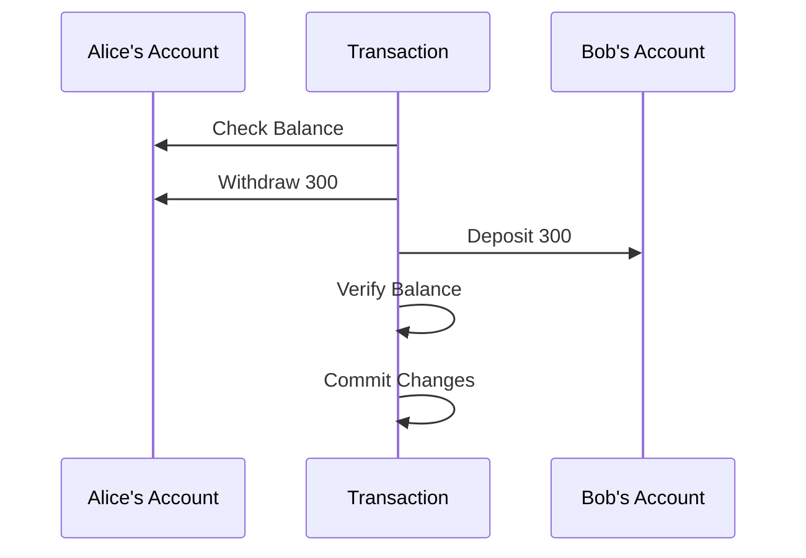

### 5.2 다양한 시나리오 실습

#### 5.2.1 주문 처리 시스템
```sql
-- 테이블 구조
CREATE TABLE orders (
    id INT PRIMARY KEY AUTO_INCREMENT,
    user_id INT,
    total_amount DECIMAL(10,2),
    status VARCHAR(20)
);

CREATE TABLE inventory (
    product_id INT PRIMARY KEY,
    quantity INT CHECK (quantity >= 0)
);

-- 주문 처리 트랜잭션
BEGIN;
    -- 재고 확인
    SELECT quantity FROM inventory 
    WHERE product_id = 100 FOR UPDATE;
    
    -- 재고 차감
    UPDATE inventory 
    SET quantity = quantity - 1
    WHERE product_id = 100;
    
    -- 주문 생성
    INSERT INTO orders (user_id, total_amount, status)
    VALUES (1, 500.00, 'PENDING');
    
    -- 결제 처리
    -- ... 결제 로직 ...
    
    -- 주문 상태 업데이트
    UPDATE orders 
    SET status = 'COMPLETED'
    WHERE id = LAST_INSERT_ID();
COMMIT;
```

#### 5.2.2 재고 관리 시스템
```sql
-- 동시성 제어를 위한 재고 관리
BEGIN;
    -- 재고 확보
    SELECT quantity 
    FROM inventory 
    WHERE product_id = 100 
    FOR UPDATE;
    
    SAVEPOINT stock_checked;
    
    -- 재고 업데이트
    UPDATE inventory
    SET quantity = quantity - 10
    WHERE product_id = 100;
    
    -- 재고 부족 시 롤백
    IF (SELECT quantity FROM inventory WHERE product_id = 100) < 0 THEN
        ROLLBACK TO stock_checked;
        -- 재고 부족 처리
    END IF;
COMMIT;
```
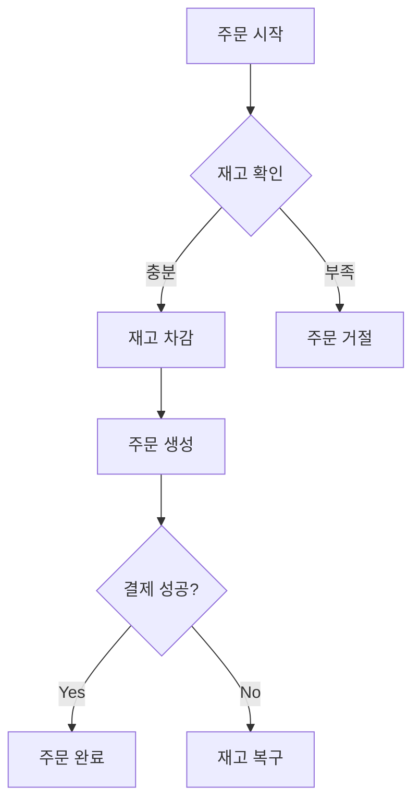

### 5.3 장애 상황 처리

#### 5.3.1 네트워크 장애 시나리오
```sql
BEGIN;
    -- 중요 데이터 처리
    UPDATE users SET status = 'ACTIVE' WHERE id = 1;
    
    SAVEPOINT user_activated;
    
    -- 외부 API 호출 시뮬레이션
    -- ... 네트워크 요청 ...
    
    -- 실패 시 부분 롤백
    ROLLBACK TO user_activated;
    
    -- 대체 처리 로직
    INSERT INTO notification_queue (user_id, message)
    VALUES (1, 'Activation pending due to network error');
COMMIT;
```

#### 5.3.2 데드락 처리
```sql
-- 데드락 방지를 위한 순차적 잠금
BEGIN;
    -- 항상 작은 ID부터 잠금
    SELECT * FROM accounts 
    WHERE id IN (1, 2)
    ORDER BY id
    FOR UPDATE;
    
    -- 데이터 처리
    UPDATE accounts SET balance = balance - 100 WHERE id = 1;
    UPDATE accounts SET balance = balance + 100 WHERE id = 2;
COMMIT;
```
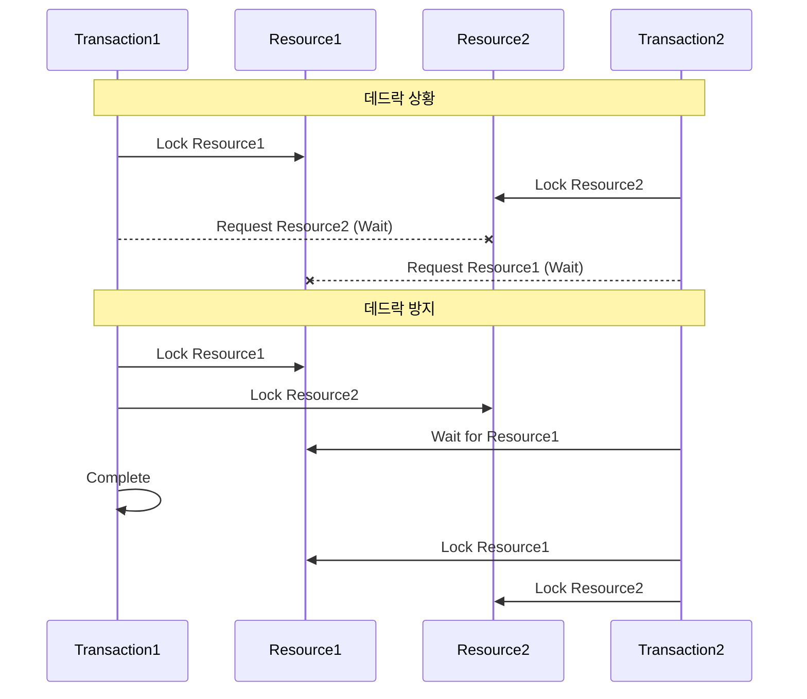

### 5.4 복구 및 데이터 무결성 유지

#### 5.4.1 데이터 복구 시나리오
```sql
BEGIN;
    -- 백업 테이블 생성
    CREATE TABLE accounts_backup AS 
    SELECT * FROM accounts;
    
    -- 데이터 수정
    UPDATE accounts SET balance = balance * 1.1;
    
    -- 검증
    IF EXISTS (SELECT 1 FROM accounts WHERE balance < 0) THEN
        -- 문제 발생 시 복구
        TRUNCATE TABLE accounts;
        INSERT INTO accounts 
        SELECT * FROM accounts_backup;
        
        ROLLBACK;
    ELSE
        COMMIT;
    END IF;
```

#### 5.4.2 무결성 검사 및 복구
```sql
-- 무결성 검사 프로시저
DELIMITER //
CREATE PROCEDURE validate_transactions()
BEGIN
    DECLARE EXIT HANDLER FOR SQLEXCEPTION
    BEGIN
        ROLLBACK;
        SIGNAL SQLSTATE '45000'
        SET MESSAGE_TEXT = 'Transaction validation failed';
    END;
    
    START TRANSACTION;
        -- 잔액 검증
        IF EXISTS (SELECT 1 FROM accounts WHERE balance < 0) THEN
            SIGNAL SQLSTATE '45000'
            SET MESSAGE_TEXT = 'Negative balance detected';
        END IF;
        
        -- 거래 내역 검증
        IF EXISTS (
            SELECT 1 FROM transactions t
            LEFT JOIN accounts a ON t.account_id = a.id
            WHERE a.id IS NULL
        ) THEN
            SIGNAL SQLSTATE '45000'
            SET MESSAGE_TEXT = 'Orphaned transactions detected';
        END IF;
    COMMIT;
END //
DELIMITER ;
```

---

## 6. 성능 최적화와 주의점

트랜잭션의 성능을 최적화하고 잠재적인 문제를 방지하기 위한 전략과 주의사항을 살펴보겠습니다.

### 6.1 트랜잭션 성능에 영향을 미치는 요인

```mermaid
graph TD
    A[성능 영향 요인] --> B[트랜잭션 길이]
    A --> C[잠금 범위]
    A --> D[동시성 수준]
    
    B --> B1[실행 시간]
    B --> B2[처리 작업 수]
    
    C --> C1[테이블 잠금]
    C --> C2[행 잠금]
    
    D --> D1[사용자 수]
    D --> D2[격리 수준]
```

#### 6.1.1 잠금(Lock)과 교착 상태(DeadLock)
```sql
-- 잠금 최소화를 위한 인덱스 활용
CREATE INDEX idx_accounts_user_id ON accounts(user_id);

-- 교착 상태 방지를 위한 순차적 접근
BEGIN;
    -- 낮은 ID부터 순차적으로 잠금
    SELECT * FROM accounts 
    WHERE id BETWEEN 1 AND 10
    ORDER BY id
    FOR UPDATE;
    
    -- 데이터 처리
    UPDATE accounts SET status = 'ACTIVE'
    WHERE id BETWEEN 1 AND 10;
COMMIT;
```

#### 6.1.2 트랜잭션 길이와 성능
```mermaid
graph LR
    A[트랜잭션 길이] --> B[짧은 트랜잭션]
    A --> C[긴 트랜잭션]
    
    B --> B1[빠른 커밋]
    B --> B2[적은 자원 사용]
    B --> B3[높은 동시성]
    
    C --> C1[긴 잠금 시간]
    C --> C2[많은 자원 사용]
    C --> C3[낮은 동시성]
```

### 6.2 최적화 전략

#### 6.2.1 트랜잭션 범위 최소화
```sql
-- 잘못된 예
BEGIN;
    -- 불필요한 조회 포함
    SELECT * FROM users;
    
    -- 실제 필요한 업데이트
    UPDATE accounts SET balance = balance - 100
    WHERE id = 1;
COMMIT;

-- 올바른 예
BEGIN;
    -- 필요한 작업만 포함
    UPDATE accounts SET balance = balance - 100
    WHERE id = 1;
COMMIT;
```

#### 6.2.2 배치 처리 활용
```sql
-- 대량 데이터 처리 시 배치 단위로 처리
BEGIN;
    DECLARE @batch_size INT = 1000;
    DECLARE @offset INT = 0;
    
    WHILE EXISTS (
        SELECT 1 FROM large_table
        LIMIT 1 OFFSET @offset
    ) DO
        UPDATE large_table
        SET status = 'PROCESSED'
        LIMIT @batch_size OFFSET @offset;
        
        SET @offset = @offset + @batch_size;
        
        -- 중간 커밋
        COMMIT;
        BEGIN;
    END WHILE;
COMMIT;
```

### 6.3 주의사항과 모범 사례

#### 6.3.1 트랜잭션 설계 지침
```mermaid
graph TD
    A[트랜잭션 설계] --> B[명확한 경계]
    A --> C[적절한 격리 수준]
    A --> D[오류 처리]
    A --> E[리소스 관리]
    
    B --> B1[시작과 종료 지점]
    B --> B2[작업 단위 정의]
    
    C --> C1[데이터 일관성]
    C --> C2[성능 균형]
    
    D --> D1[예외 처리]
    D --> D2[롤백 전략]
    
    E --> E1[커넥션 관리]
    E --> E2[잠금 해제]
```

#### 6.3.2 성능 모니터링
```sql
-- 트랜잭션 모니터링 쿼리
SELECT 
    trx_id,
    trx_state,
    trx_started,
    trx_rows_locked,
    trx_rows_modified,
    trx_isolation_level
FROM information_schema.innodb_trx;

-- 잠금 상태 확인
SELECT 
    wait_started,
    wait_age,
    locked_table,
    locked_type,
    waiting_query
FROM sys.innodb_lock_waits;
```

### 6.4 대규모 트랜잭션 처리 전략

#### 6.4.1 분할 처리
```sql
-- 대규모 데이터 처리를 위한 분할 처리
CREATE PROCEDURE process_large_dataset()
BEGIN
    DECLARE done INT DEFAULT FALSE;
    DECLARE batch_start INT;
    DECLARE cur CURSOR FOR 
        SELECT id FROM large_table
        WHERE processed = FALSE
        ORDER BY id;
    
    DECLARE CONTINUE HANDLER FOR NOT FOUND SET done = TRUE;
    
    OPEN cur;
    
    read_loop: LOOP
        BEGIN
            DECLARE EXIT HANDLER FOR SQLEXCEPTION
            BEGIN
                ROLLBACK;
                -- 오류 로깅
            END;
            
            START TRANSACTION;
            -- 배치 처리 로직
            COMMIT;
        END;
        
        IF done THEN
            LEAVE read_loop;
        END IF;
    END LOOP;
    
    CLOSE cur;
END;
```

#### 6.4.2 성능 최적화 체크리스트

1. **트랜잭션 설계**
  - [ ] 최소한의 작업만 포함
  - [ ] 명확한 경계 설정
  - [ ] 적절한 격리 수준 선택

2. **리소스 관리**
  - [ ] 커넥션 풀 설정
  - [ ] 잠금 시간 최소화
  - [ ] 메모리 사용량 모니터링

3. **오류 처리**
  - [ ] 예외 처리 구현
  - [ ] 롤백 전략 수립
  - [ ] 복구 절차 준비

```mermaid
graph TB
    A[성능 최적화] --> B[설계 단계]
    A --> C[구현 단계]
    A --> D[운영 단계]
    
    B --> B1[트랜잭션 범위 정의]
    B --> B2[격리 수준 선택]
    
    C --> C1[코드 최적화]
    C --> C2[인덱스 설계]
    
    D --> D1[모니터링]
    D --> D2[튜닝]
```

### 6.5 추가 권장사항

1. **트랜잭션 타임아웃 설정**
```sql
-- MySQL에서 타임아웃 설정
SET innodb_lock_wait_timeout = 50;

-- 트랜잭션 시작 시 타임아웃 지정
BEGIN;
    SET LOCAL lock_timeout = '10s';
    -- 트랜잭션 로직
COMMIT;
```

2. **데드락 방지**
```sql
-- 데드락 방지를 위한 순차적 접근
BEGIN;
    -- 테이블 접근 순서 일관성 유지
    SELECT * FROM table_a WHERE id = 1 FOR UPDATE;
    SELECT * FROM table_b WHERE id = 1 FOR UPDATE;
    SELECT * FROM table_c WHERE id = 1 FOR UPDATE;
    
    -- 데이터 처리
COMMIT;
```

3. **리소스 관리**
```sql
-- 커넥션 및 트랜잭션 상태 모니터링
SELECT * FROM performance_schema.events_transactions_current;

-- 잠금 경합 모니터링
SELECT * FROM performance_schema.data_locks;
```