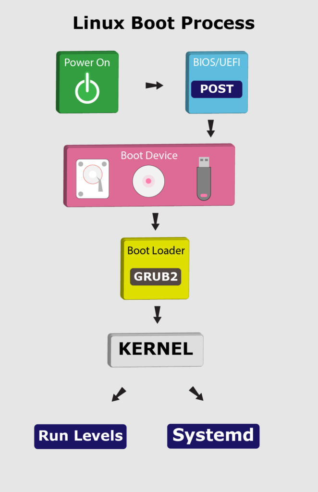
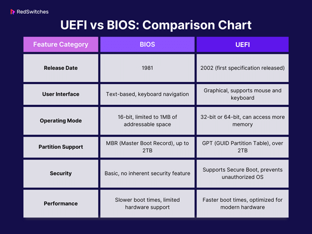
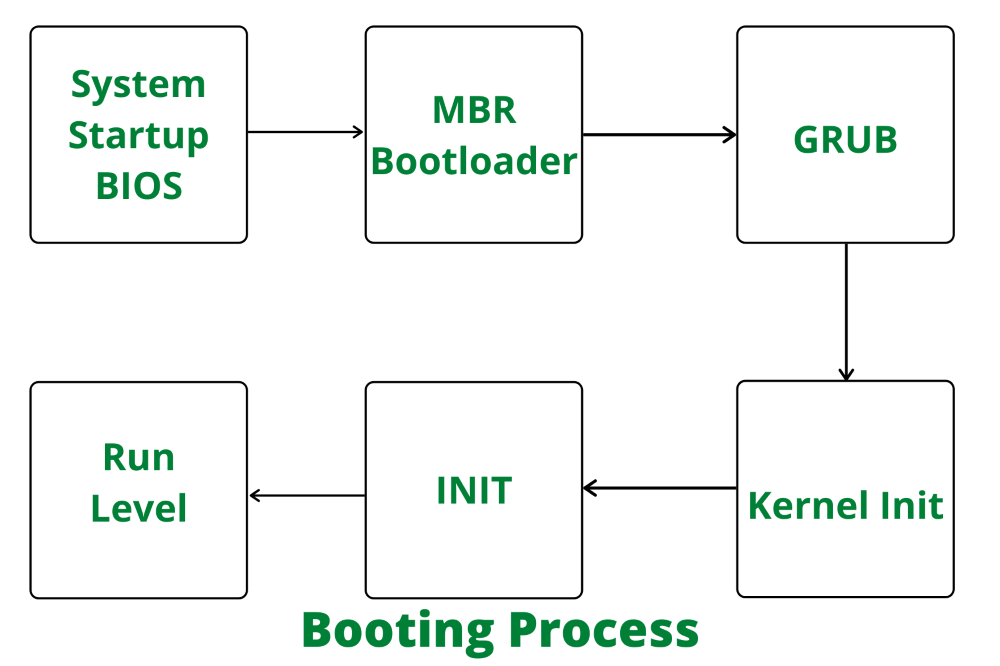

# 컴퓨터 부팅 과정 (Boot Process)

컴퓨터가 전원을 켠 후 운영체제가 실행되기까지의 과정을 설명합니다. 하드웨어 초기화부터 커널이 메모리에 로드되어 실행되기까지의 전체 부팅 시퀀스를 이해하는 것이 목적입니다.

## A. 부팅 과정 개요

### 1. 부팅이란?

부팅(Booting)은 컴퓨터의 전원이 켜진 후, 하드웨어를 초기화하고 운영체제를 메모리에 적재하여 실행 가능한 상태로 준비하는 전체 과정을 의미합니다. 이는 다음과 같은 주요 단계들로 구성됩니다:

1. 하드웨어 전원 공급 및 POST(Power-On Self-Test) 수행
2. 펌웨어(BIOS 또는 UEFI) 실행
3. 부트로더 로딩 및 실행
4. 운영체제 커널 로딩
5. 커널 초기화 및 시스템 서비스 시작

### 2. 부트 시퀀스의 전체 흐름

부팅 과정은 하드웨어에서 시작하여 단계적으로 소프트웨어 계층으로 이동합니다:

```text
전원 ON → POST → BIOS/UEFI → 부트로더 → 커널 로딩 → 커널 초기화 → init/systemd
```



각 단계는 이전 단계의 초기화가 완료된 후에만 진행될 수 있으며, 모든 단계가 성공적으로 완료되어야 운영체제가 정상적으로 실행됩니다.

---

## B. BIOS vs UEFI

컴퓨터의 펌웨어 인터페이스는 크게 전통적인 BIOS 방식과 현대적인 UEFI 방식으로 나눌 수 있습니다.

### 1. BIOS (Basic Input/Output System)

BIOS는 1980년대부터 사용된 전통적인 펌웨어 인터페이스입니다.

**주요 특징:**
- 16비트 리얼 모드에서 동작
- MBR(Master Boot Record) 파티션 테이블 사용
- 최대 2TB 디스크 크기 제한
- 부트 과정이 상대적으로 단순하나 제한적

**동작 과정:**
1. POST(Power-On Self-Test) 수행
2. 부팅 가능한 저장 장치 검색
3. MBR(첫 512바이트) 읽기
4. 부트로더로 제어권 이전

**제한사항:**
- 1MB 메모리 접근 제한 (리얼 모드)
- 느린 부팅 속도
- 제한적인 하드웨어 지원
- 보안 기능 부재

### 2. UEFI (Unified Extensible Firmware Interface)

UEFI는 BIOS의 한계를 극복하기 위해 개발된 현대적인 펌웨어 인터페이스입니다.

**주요 특징:**
- 32비트/64비트 환경 지원
- GPT(GUID Partition Table) 사용
- Secure Boot 지원
- 그래픽 인터페이스 및 네트워크 부팅 가능
- 풍부한 하드웨어 드라이버

**동작 과정:**
1. UEFI 펌웨어 초기화
2. EFI 시스템 파티션(ESP) 검색
3. ESP에서 부트로더(.efi 파일) 로딩
4. UEFI 부트 매니저가 부팅 과정 제어

**향상된 기능:**
- 빠른 부팅 속도
- 대용량 디스크 지원 (8ZB 이상)
- UEFI 셸 환경 제공
- 보안 부팅으로 악성코드 차단
- 네트워크 및 그래픽 기능

### 3. 부팅 방식의 차이



| 특징 | BIOS | UEFI |
|------|------|------|
| 부팅 모드 | 16비트 리얼 모드 | 32/64비트 보호 모드 |
| 파티션 형식 | MBR | GPT |
| 부트로더 위치 | 첫 섹터(MBR) | EFI 시스템 파티션 |
| 최대 파티션 크기 | 2TB | 9.4ZB |
| 초기화 방식 | 순차적 | 병렬 가능 |
| 확장성 | 제한적 | 모듈식 드라이버 |

---

## C. 부트로더(Boot Loader)

부트로더는 운영체제의 커널을 메모리에 적재하고 실행하는 역할을 담당하는 프로그램입니다.

### 1. 부트로더의 역할

부트로더는 다음과 같은 핵심 기능을 수행합니다:

- 커널 이미지를 디스크에서 메모리로 로딩
- 커널이 필요로 하는 초기 RAM 디스크(initrd/initramfs) 로딩
- 커널 실행에 필요한 파라미터 전달
- CPU를 보호 모드(또는 장방향 모드)로 전환
- 메모리 맵 정보 수집 및 전달
- 커널로 제어권 이전

### 2. 대표적인 부트로더

**GRUB 2 (GRand Unified Bootloader)**
- 리눅스에서 가장 널리 사용되는 부트로더
- 다양한 파일 시스템 지원
- 동적 모듈 로딩
- 멀티부트 프로토콜 지원
- 쉘 환경 제공

**기타 부트로더**
- LILO(Linux Loader): 레거시 리눅스 부트로더
- systemd-boot: 경량화된 UEFI 부트로더
- U-Boot: 임베디드 시스템용 부트로더
- rEFInd: macOS와 리눅스 멀티부팅용

### 3. 부트로더의 단계별 실행

부트로더는 일반적으로 여러 단계로 나뉘어 실행됩니다:

**1단계 (Primary/First-Stage)**
```text
- MBR/VBR에 위치 (512바이트 제한)
- 최소한의 하드웨어 초기화
- 2단계 부트로더 로딩
```

**2단계 (Secondary/Second-Stage)**
```text
- 파일 시스템 인식
- 설정 파일 로딩 (예: grub.cfg)
- 커널 이미지 위치 확인
- 부팅 메뉴 제공
```

### 4. GRUB 2의 부팅 과정

**1. GRUB 2 Stage 1**
- MBR/ESP에서 core.img 로딩
- 기본 파일시스템 드라이버 포함

**2. GRUB 2 Stage 1.5**
- 추가 파일시스템 드라이버 로딩
- Stage 2 로딩 준비

**3. GRUB 2 Stage 2**
- `/boot/grub/grub.cfg`설정 파일 읽기
- 부팅 메뉴 표시
- 선택된 커널과 initrd 로딩
- 커널 파라미터 준비

---

## D. 커널 로딩 & 초기화 개요

부트로더가 커널을 메모리에 적재한 후, 실제 운영체제 커널이 실행되기까지의 과정을 설명합니다.

### 1. 커널 이미지 구조

**리눅스 커널 이미지 (bzImage)**
- 압축된 형태의 커널 실행 파일
- 일반적으로 `/boot` 디렉토리에 위치
- 아키텍처별 시작 지점 포함 (x86_64의 경우 `startup_64`)

**주요 구성 요소:**
- 설정 정보 (CONFIG_*)
- 아키텍처 의존적인 코드
- 디바이스 드라이버
- 파일시스템 코드
- 메모리 관리자

### 2. 커널 초기화 순서

1. **초기 진입점**
```text
- 아키텍처별 시작 코드 실행 (arch/x86/boot/header.S)
- CPU 모드 전환 (리얼 모드 → 보호 모드 → 장방향 모드)
- 기본 페이징 설정
```

2. **하드웨어 초기화**
```text
- CPU 초기화 및 기능 검사
- 메모리 맵 검증
- 페이지 테이블 설정
- 필수 하드웨어 초기화
```

3. **커널 본체 시작**
```text
- start_kernel() 함수 호출
- 인터럽트 벡터 초기화
- 메모리 관리자 초기화
- 프로세스 관리자 초기화
- 디바이스 드라이버 초기화
```

4. **Init 프로세스 실행**
```text
- PID 1 프로세스 생성
- initramfs 마운트 (필요한 경우)
- 루트 파일시스템 마운트
- systemd 또는 init 데몬 시작
```

### 3. 커널 매개변수

부트로더는 커널에 다양한 매개변수를 전달할 수 있습니다:

```text
- root=/dev/sda1  # 루트 파일시스템 위치
- init=/sbin/init # 초기 프로세스 지정
- quiet splash    # 부팅 메시지 숨김
- nomodeset       # 그래픽 모드 설정 비활성화
```

### 4. 초기 RAM 디스크 (initrd/initramfs)
- 임시 루트 파일시스템 역할
- 필수 드라이버와 모듈 포함
- 실제 루트 파일시스템 마운트 전에 사용
- 다양한 하드웨어 지원을 위한 모듈 로딩



---

## E. 하드웨어 초기화 사항

### 1. CPU 초기화 및 시스템 설정

**CPU 레지스터 초기화**
- 제어 레지스터(CR0, CR4 등) 설정
- 세그먼트 레지스터 초기화
- MSR(Model Specific Registers) 설정
- EFLAGS 레지스터 초기화

**메모리 관리 초기화**
- 페이지 테이블 구성
- 커널 페이징 활성화
- 물리 메모리 맵 검증
- NUMA 노드 설정 (해당하는 경우)

**인터럽트 시스템 구성**
- IDT(Interrupt Descriptor Table) 설정
- 로컬 APIC 초기화
- I/O APIC 구성
- 인터럽트 벡터 할당

### 2. 멀티부트(Multiboot) 정보 구조

부트로더가 커널에 전달하는 주요 시스템 정보:

```text
- 사용 가능한 물리 메모리 맵
- BIOS/UEFI 서비스 정보
- 커맨드 라인 파라미터
- 모듈 정보 (initrd 등)
- ACPI 테이블 위치
```

---

## F. 결론 및 요약

### 1. 부팅 과정의 핵심 포인트

1. **단계적 권한 이전**
- 하드웨어 -> 펌웨어 -> 부트로더 -> 커널
- 각 단계마다 시스템 제어권이 상위 계층으로 이동

2. **하드웨어 추상화**
- BIOS/UEFI가 제공하는 기본 추상화
- 커널의 하드웨어 독립적 실행 환경 구성

3. **초기화 순서의 중요성**
- 의존성을 고려한 순차적 초기화
- 하드웨어 -> 메모리 -> 프로세스 -> 파일시스템

### 2. 더 자세한 내용

다음 주제들은 별도의 문서에서 상세히 다룹니다:

- UEFI 세부 사항 -> uefi_acpi.md
- 부트로더 구현 예제 -> bootloader_example/
- 커널 초기화 상세 -> 03_KernelInternals/

### 3. 참고자료
- OSDev Wiki - Boot Process
- Linux Inside - Kernel Boot Process
- UEFI Specification
- GNU GRUB Manual

이 문서에서는 컴퓨터 부팅의 전체 과정을 개괄적으로 살펴보았습니다. 각 단계의 세부적인 내용은 관련 문서들을 참조하시기 바랍니다. 특히 실제 부트로더를 구현해보고 싶다면 bootloader_example/ 디렉토리의 예제를 살펴보시기 바랍니다.