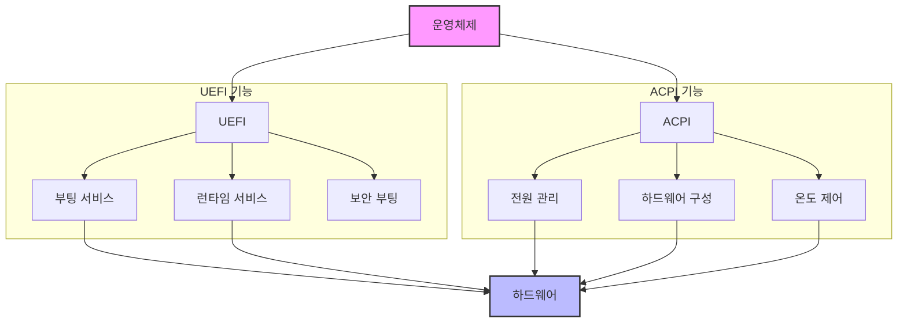
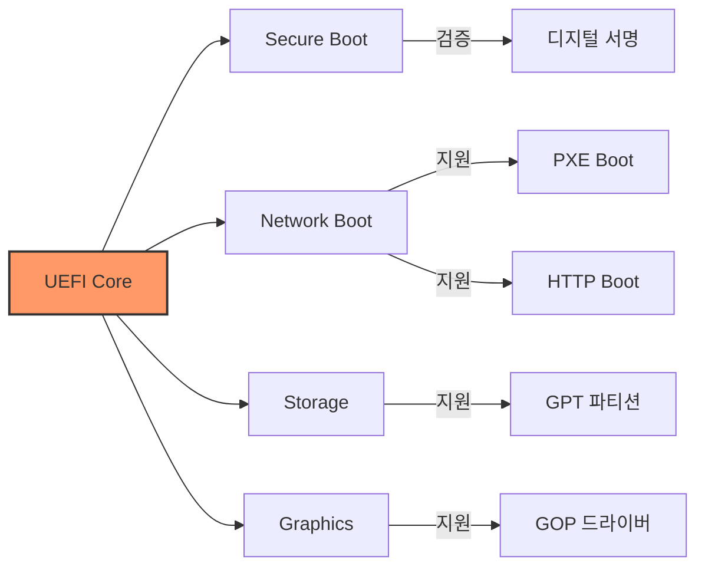
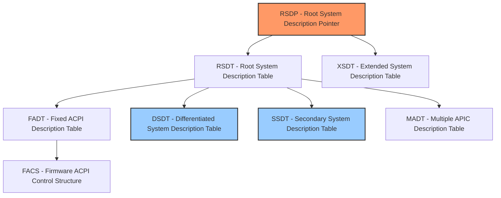
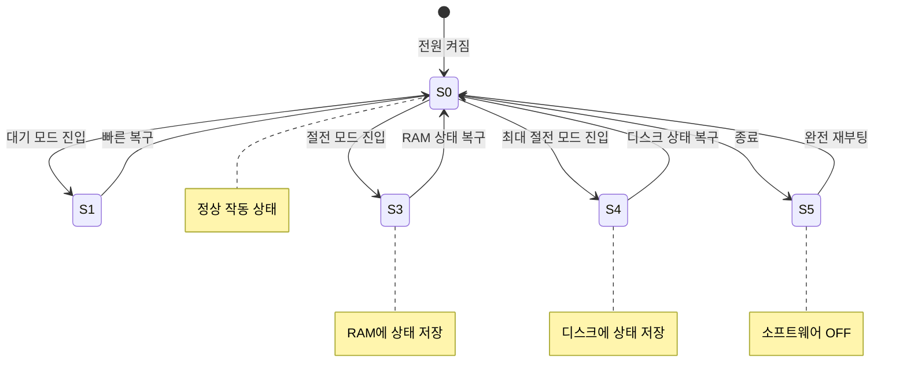

# UEFI와 ACPI: 현대적 펌웨어 인터페이스와 전원 관리

## A. 서론: UEFI와 ACPI란 무엇인가?

현대 컴퓨터 시스템에서 UEFI와 ACPI는 운영체제가 하드웨어와 효율적으로 상호작용할 수 있게 해주는 핵심 인터페이스입니다.

### 1. UEFI (Unified Extensible Firmware Interface)

UEFI는 전통적인 BIOS를 대체하는 현대적인 펌웨어 인터페이스로, 다음과 같은 특징을 가집니다:

**주요 특징:**
- 64비트 CPU 모드 지원
- 대용량 저장 장치와 GPT 파티션 테이블 지원
- 그래픽 기반 사용자 인터페이스
- 네트워크 부팅 기능
- 보안 부팅(Secure Boot) 지원
- 모듈식 드라이버 아키텍처

**핵심 장점:**
- 빠른 부팅 속도
- 향상된 보안성
- 확장 가능한 드라이버 모델
- 플랫폼 독립적인 설계

### 2. ACPI (Advanced Configuration and Power Interface)

ACPI는 하드웨어 구성과 전원 관리를 위한 개방형 표준으로, OS가 하드웨어 자원을 효율적으로 제어할 수 있게 합니다.

**주요 기능:**
- 시스템 전원 상태 관리
- 하드웨어 구성 정보 제공
- 전력 소비 최적화
- 온도 관리 및 쿨링 제어
- 플러그 앤 플레이 지원

**전원 관리 상태:**
```text
글로벌 상태 (G-States):
- G0: 작동 중
- G1: 절전 모드
- G2: 소프트 오프
- G3: 기계적 오프

시스템 상태 (S-States):
- S0: 정상 작동
- S1-S2: 저전력 대기
- S3: 대기 모드 (RAM에 상태 저장)
- S4: 최대 절전 모드 (디스크에 상태 저장)
- S5: 소프트 오프
```

### 3. UEFI와 ACPI의 중요성

현대 운영체제에서 UEFI와 ACPI는 다음과 같은 이유로 필수적입니다:

1. **하드웨어 추상화**
   - OS와 하드웨어 간의 표준화된 인터페이스 제공
   - 플랫폼 독립적인 하드웨어 관리 가능

2. **전원 효율성**
   - 지능적인 전원 관리로 배터리 수명 연장
   - 동적 성능 조절 지원

3. **확장성**
   - 새로운 하드웨어 기능 지원이 용이
   - 드라이버와 펌웨어 업데이트 단순화



---

## B. UEFI의 구조와 역할

### 1. UEFI의 주요 구성 요소

**EFI 시스템 파티션 (ESP)**
- FAT32/FAT16 파일시스템으로 포맷된 특별한 파티션
- 부트로더(.efi 파일들)와 드라이버 저장
- 일반적으로 100-500MB 크기
- 표준 경로 구조 (`/EFI/BOOT/BOOTX64.EFI` 등)

**UEFI 펌웨어 서비스**
1. **부트 서비스 (Boot Services)**
   - 부팅 과정 중에만 사용 가능
   - 메모리 관리, 프로토콜 핸들링
   - 타이머 서비스, 드라이버 로딩

2. **런타임 서비스 (Runtime Services)**
   - OS 실행 중에도 계속 사용 가능
   - 시스템 시간, NVRAM 변수 관리
   - 전원 관리, 시스템 리셋

### 2. UEFI의 주요 기능


**GPT(GUID Partition Table)**
```text
- 2TB 이상의 대용량 디스크 지원
- 128개의 기본 파티션 허용
- 파티션 데이터 중복 저장으로 신뢰성 향상
- CRC32 체크섬으로 데이터 무결성 검증
```

**Secure Boot**
```text
- 디지털 서명된 부트로더만 실행 허용
- 부트킷과 루트킷 방지
- 신뢰할 수 있는 인증서로 코드 서명 검증
- 사용자 정의 키 등록 가능
```

**네트워키 부팅**
```text
- PXE(Preboot eXecution Environment) 지원
- HTTP 부팅 프로토콜
- IPv4/IPv6 네트워크 스택
- TLS 보안 통신
```

### 3. UEFI 프로토콜 계층
```text
+------------------------+
|     UEFI Applications  |
+------------------------+
|    UEFI Drivers       |
+------------------------+
|    UEFI Protocols     |
+------------------------+
|    UEFI Core          |
+------------------------+
|    Platform Hardware  |
+------------------------+
```

**프로토콜 특징:**
- 모듈식 설계로 확장 용이
- 드라이버 모델 표준화
- 플랫폼 독립적 구현
- 동적 프로토콜 설치/제거

### 4. UEFI Shell 환경

UEFI Shell은 펌웨어 수준의 명령줄 인터페이스를 제공합니다:

```shell
# 기본적인 UEFI Shell 명령어
map -r                  # 디바이스 맵 새로고침
ls fs0:                 # EFI 파티션 내용 보기
bcfg boot dump         # 부트 설정 확인
drivers                # 로드된 드라이버 목록
devices                # 인식된 디바이스 목록
```

**주요기능:**
- 파일 시스템 탐색
- 부트 설정 관리
- 드라이버 로드/언로드
- 시스템 정보 확인
- 스크립트 실행 지원

---

## C. ACPI의 구조와 역할

### 1. ACPI 테이블 구조

ACPI는 계층적인 테이블 구조를 통해 시스템 정보를 관리합니다:


**주요 테이블 정의:**

1. **RSDP (Root System Description Pointer)**
  - ACPI 테이블의 시작점
  - 물리 메모리에서 고정된 위치에 존재
  - RSDT/XSDT의 물리 주소 포함

2. **FADT (Fixed ACPI Description Table)**
  - 하드웨어 설정 정보
  - 전원 관리 제어 레지스터
  - ACPI 이벤트 레지스터

3. **DSDT (Differentiated System Description Table)**
  - 디바이스 설정 정보
  - AML(ACPI Machine Language) 코드 포함
  - 하드웨어 제어 메서드 정의

4. **SSDT (Secondary System Description Table)**
  - DSDT를 보완하는 추가 정보
  - 동적으로 로드/언로드 기능
  - CPU/디바이스 설정 포함


### 2. ACPI 전원 상태 관리

**시스템 전원 상태(S-States):**


**디바이스 전원 상태(D-States):**
- D0: 완전 작동 상태
- D1/D2: 중간 절전 상태
- D3hot: 소프트웨어로 복구 가능한 OFF 상태
- D3cold: 하드웨어 재초기화가 필요한 OFF 상태

### 3. ACPI 이벤트 처리

ACPI는 두 가지 타입의 이벤트를 처리합니다:

1. **고정 이벤트 (Fixed Events)**
  - 전원 버튼 누름
  - 절전 버튼 누름
  - RTC 알람
  - 온도 경고

2. **일반 이벤트 (General Purpose Events)**
  - 하드웨어 인터럽트
  - 디바이스 상태 변경
  - 배터리 상태 변경
  - 도킹/언도킹 이벤트