# 리눅스 장치 드라이버 모델

리눅스 커널에서 장치 드라이버는 하드웨어와 소프트웨어 간의 인터페이스를 제공하는 핵심 구성요소입니다. 2.6 버전 이후 도입된 통합 장치 드라이버 모델은 하드웨어 장치의 검색, 초기화, 관리를 체계적으로 수행할 수 있는 프레임워크를 제공합니다. 이 문서에서는 리눅스 장치 드라이버 모델의 구조, 동작 원리, 그리고 실제 구현 방법에 대해 상세히 설명합니다.

## A. 리눅스 장치 드라이버의 기본 구조와 원리

리눅스 장치 드라이버 모델은 하드웨어 장치와 운영체제 간의 상호작용을 체계적으로 관리하기 위한 프레임워크입니다. 이 모델은 device, driver, bus라는 세 가지 핵심 구성요소를 중심으로 설계되어 있습니다.

### 1. 장치 드라이버 모델의 발전과 목적

리눅스 커널 2.6 버전 이전에는 각각의 서브시스템이 독자적인 방식으로 장치를 관리했습니다. 이로 인해 코드의 중복이 발생하고, 일관된 장치 관리가 어려웠으며, 전원 관리와 같은 범용 기능의 구현이 복잡했습니다. 이러한 문제를 해결하기 위해 도입된 통합 장치 드라이버 모델은 다음과 같은 핵심 목적을 가지고 설계되었습니다:

장치 드라이버 모델은 다음과 같은 주요 목적을 가지고 있습니다:

첫째, 하드웨어 추상화 계층을 제공합니다. 이를 통해 드라이버 개발자는 하드웨어의 세부사항에 집중할 수 있으며, 상위 계층은 표준화된 인터페이스를 통해 하드웨어에 접근할 수 있습니다.

둘째, 전원 관리 기능을 통합적으로 구현합니다. 개별 드라이버가 전원 관리 로직을 직접 구현하는 대신, 커널의 전원 관리 프레임워크를 활용할 수 있습니다. 이를 통해 시스템 수준의 전원 관리가 가능해지고, 에너지 효율성이 향상됩니다.

셋째, 장치 검색과 열거(enumeration) 메커니즘을 표준화합니다. PCI, USB, SCSI 등 다양한 버스 시스템에서 일관된 방식으로 장치를 검색하고 식별할 수 있습니다.

넷째, 사용자 공간과의 효율적인 통신을 지원합니다. sysfs를 통해 장치의 속성과 상태를 확인하고 제어할 수 있으며, udev를 통해 동적인 장치 관리가 가능합니다.

다섯째, 드라이버 코드의 재사용성을 높입니다. 공통 기능을 코어 계층에서 제공함으로써, 드라이버 개발자는 장치별 특화 기능 구현에 집중할 수 있습니다.

### 2. 핵심 구성요소와 상호작용

리눅스 장치 드라이버 모델은 세 가지 핵심 구성요소(장치, 드라이버, 버스)를 중심으로 구성되어 있습니다. 이들의 관계는 다음과 같습니다:

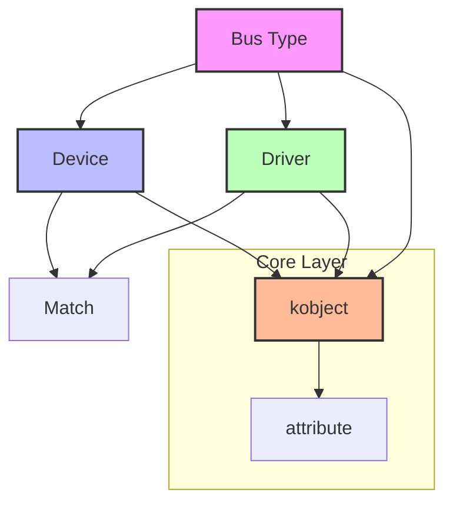

각 구성요소는 다음과 같은 특징과 역할을 가집니다:

#### 2.1 장치(Device)
장치는 시스템에 연결된 물리적 또는 가상의 하드웨어를 표현하는 소프트웨어 객체입니다.

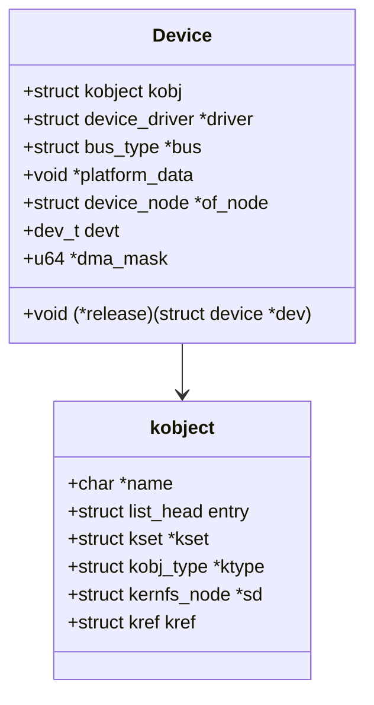

주요 특징:
- 고유한 식별자(device ID)를 가짐
- 특정 버스 타입에 속함
- 하나의 드라이버에 의해 제어됨
- sysfs를 통해 사용자 공간에 노출
- 장치별 속성(attributes) 보유

#### 2.2 드라이버(Driver)
드라이버는 특정 유형의 장치를 제어하는 소프트웨어 컴포넌트입니다.

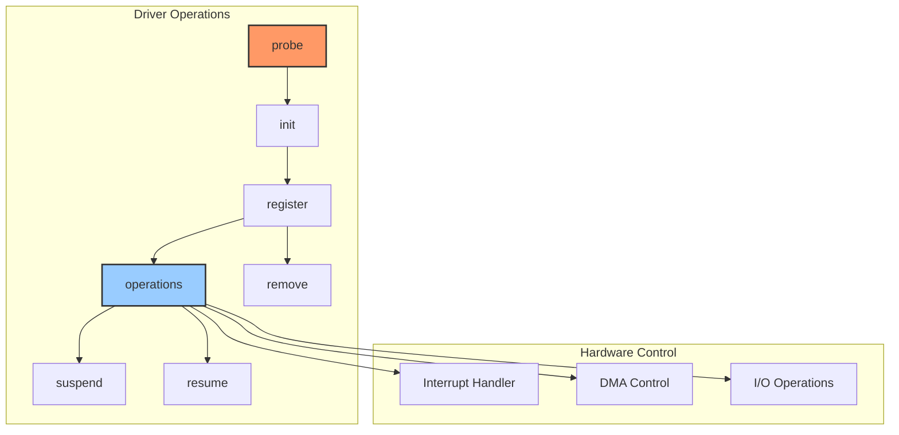

주요 기능:
- 장치 초기화 및 종료 처리
- 하드웨어 제어 및 상태 관리
- 인터럽트 처리 및 동기화
- DMA 설정 및 관리
- 사용자 공간과의 통신 인터페이스 구현

#### 2.3 버스(Bus)
버스는 장치와 드라이버를 연결하는 중개자 역할을 합니다.

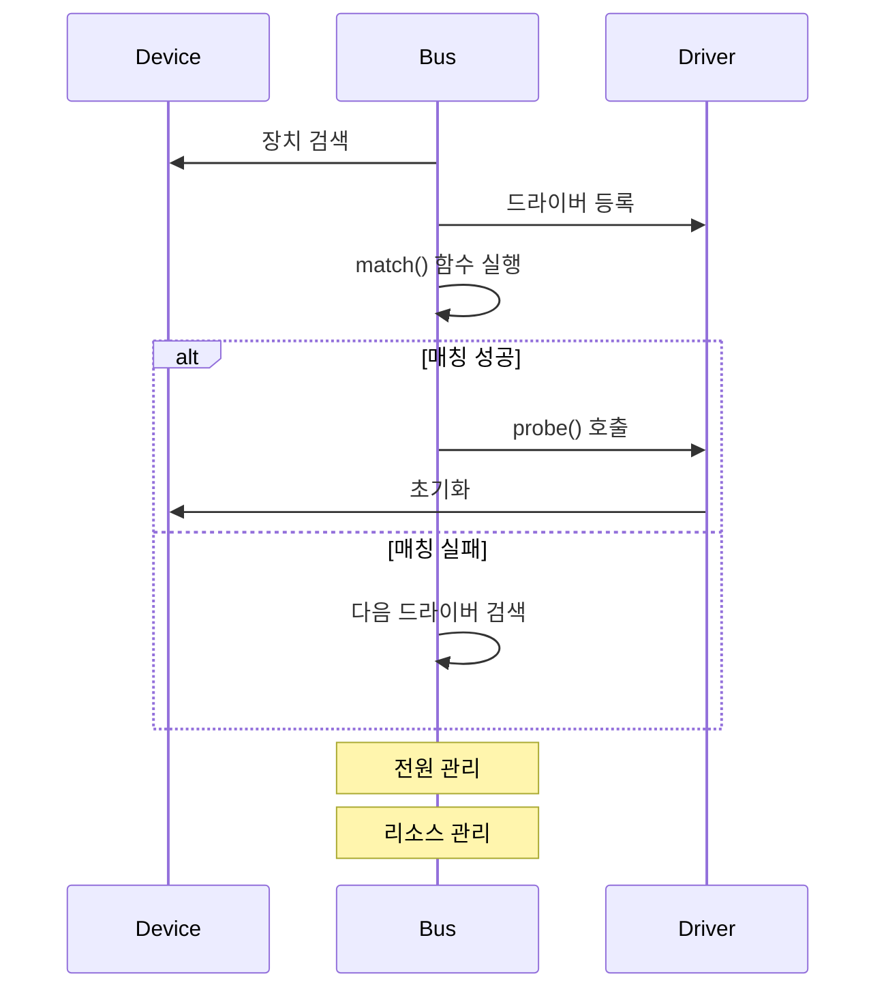

주요 역할:
- 장치 검색 및 열거
- 장치-드라이버 매칭
- 전원 관리 조정
- 버스 특화 작업 처리
- 리소스 할당 관리

## B. 장치 등록 및 초기화 과정

### 1. 장치 검색 메커니즘의 동작 원리

리눅스 시스템에서 장치 검색은 정적 검색과 동적 검색이라는 두 가지 주요 방식으로 이루어집니다. 다음 다이어그램은 전체적인 장치 검색 프로세스를 보여줍니다:

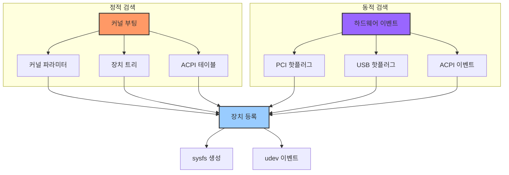

#### 1.1 정적 장치 검색
시스템 부팅 시점에 이루어지는 정적 장치 검색은 다음과 같은 주요 정보원을 활용합니다:

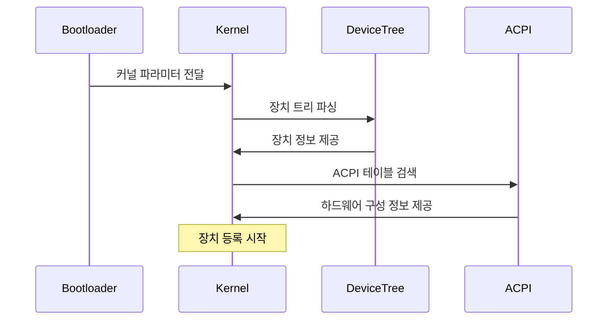

#### 1.2 동적 장치 검색
실행 시간에 이루어지는 동적 장치 검색은 다음과 같은 이벤트 기반 구조로 동작합니다:

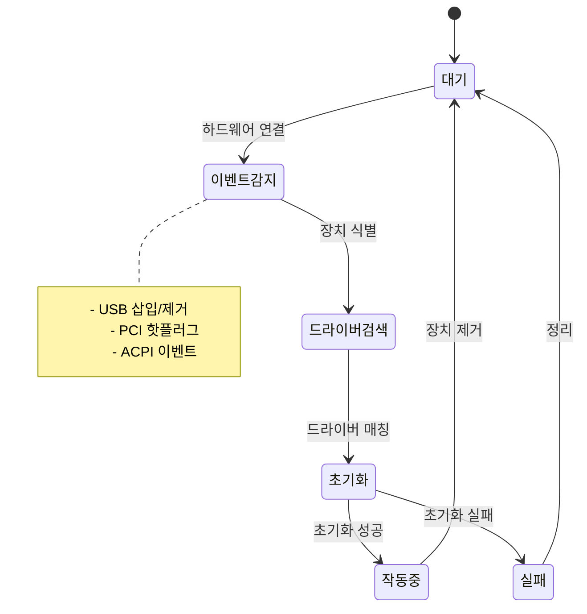

### 2. 드라이버 바인딩 프로세스의 상세 구조

드라이버와 장치의 바인딩은 복잡한 매칭 과정을 통해 이루어집니다. 다음은 전체 바인딩 프로세스를 보여줍니다:

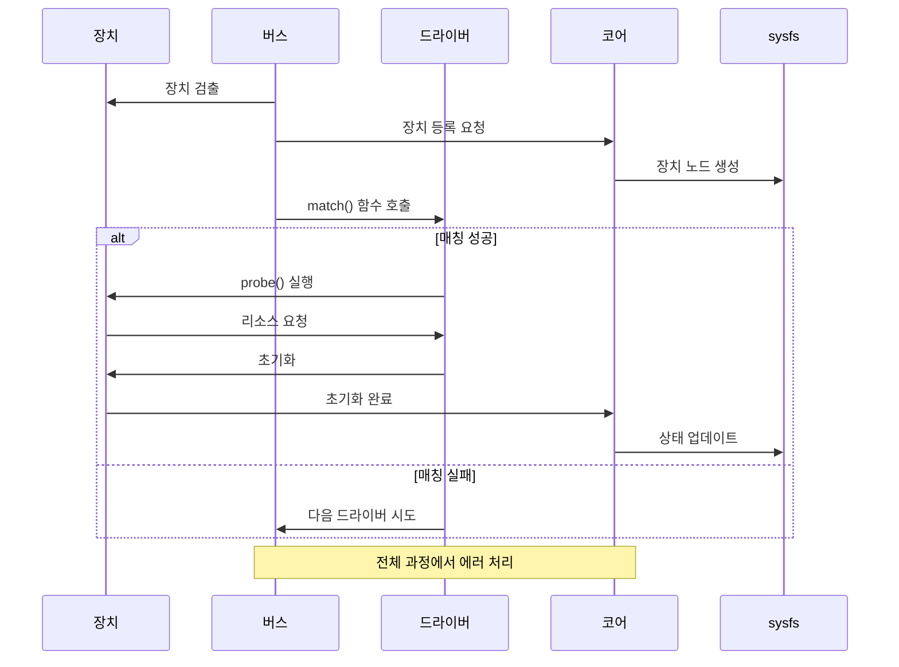

바인딩 프로세스에서 가장 중요한 것은 match() 함수와 probe() 함수입니다. 이 두 함수의 구현이 성공적인 장치-드라이버 바인딩을 결정합니다.

### 3. 리소스 관리 시스템

장치 드라이버는 다양한 시스템 리소스를 관리해야 합니다. 다음 다이어그램은 주요 리소스 관리 구조를 보여줍니다:

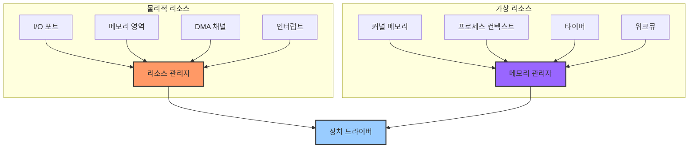

리소스 관리는 다음과 같은 주요 작업을 포함합니다:

1. 메모리 관리
   - I/O 메모리 영역 매핑
   - DMA 버퍼 할당 및 관리
   - 캐시 정책 설정

2. 인터럽트 관리
   - IRQ 라인 요청 및 해제
   - 인터럽트 핸들러 등록
   - 인터럽트 컨텍스트 처리

3. 전원 관리
   - 전원 상태 전이
   - 클록 게이팅
   - 전압 조정

## C. Sysfs와 장치 관리 시스템

### 1. Sysfs의 아키텍처와 구조

Sysfs는 리눅스 커널의 장치 드라이버 모델을 사용자 공간에 노출하는 가상 파일시스템입니다. 이는 단순한 파일과 디렉터리 구조를 통해 시스템의 하드웨어 구성과 드라이버 상태를 표현합니다.

```mermaid
graph TD
    subgraph "Sysfs 기본 구조"
        root[/sys/] --> devices[/devices/]
        root --> bus[/bus/]
        root --> class[/class/]
        root --> block[/block/]
        root --> firmware[/firmware/]
        
        devices --> pci[PCI 장치들]
        devices --> usb[USB 장치들]
        devices --> platform[플랫폼 장치들]
        
        bus --> pci_bus[pci/]
        bus --> usb_bus[usb/]
        
        class --> net[net/]
        class --> input[input/]
        class --> sound[sound/]
    end
    
    style root fill:#f96,stroke:#333,stroke-width:2px
    style devices fill:#9cf,stroke:#333,stroke-width:2px
    style bus fill:#9cf,stroke:#333,stroke-width:2px
    style class fill:#9cf,stroke:#333,stroke-width:2px
```

각 디렉터리의 역할과 의미는 다음과 같습니다:

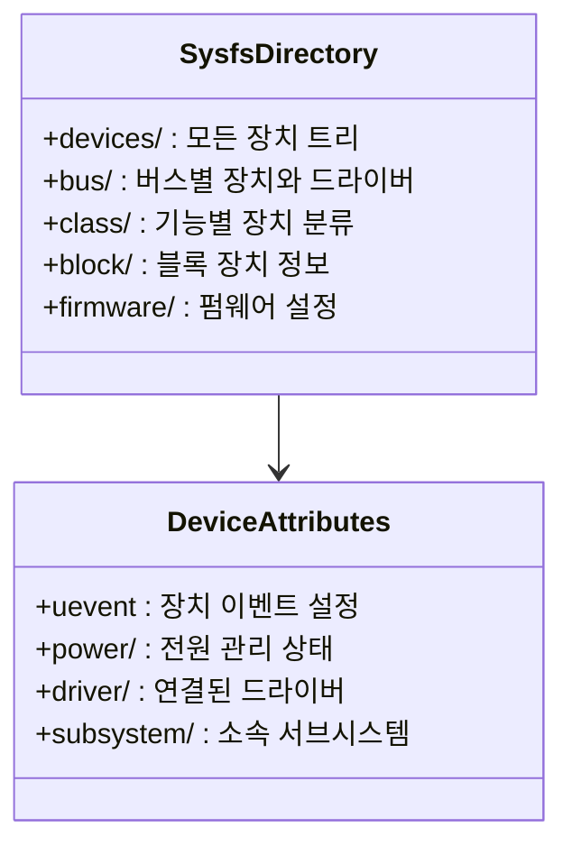

### 2. Sysfs 속성 시스템

Sysfs의 각 객체는 속성(attribute)을 통해 상태를 노출하고 제어할 수 있습니다. 다음은 속성 시스템의 구현 구조입니다:

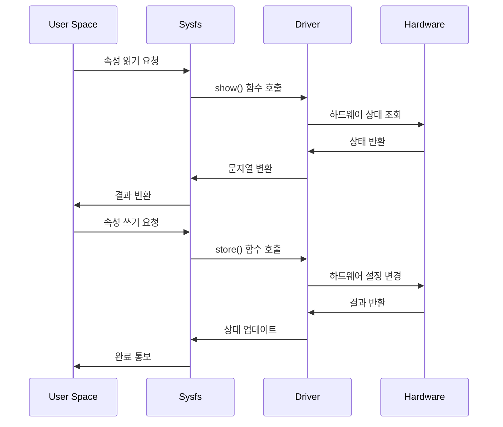

속성 구현의 예시 코드:

```c
static ssize_t show_state(struct device *dev, 
                         struct device_attribute *attr, 
                         char *buf)
{
    struct my_device *mydev = dev_get_drvdata(dev);
    return sprintf(buf, "%d\n", mydev->state);
}

static ssize_t store_state(struct device *dev,
                          struct device_attribute *attr,
                          const char *buf, size_t count)
{
    struct my_device *mydev = dev_get_drvdata(dev);
    int ret, new_state;
    
    ret = kstrtoint(buf, 10, &new_state);
    if (ret < 0)
        return ret;
        
    mydev->state = new_state;
    return count;
}

static DEVICE_ATTR(state, S_IRUGO | S_IWUSR, 
                  show_state, store_state);
```

### 3. Udev 시스템과의 연동

Udev는 사용자 공간에서 동작하는 장치 관리자로, Sysfs의 변경을 모니터링하고 그에 따른 작업을 수행합니다.

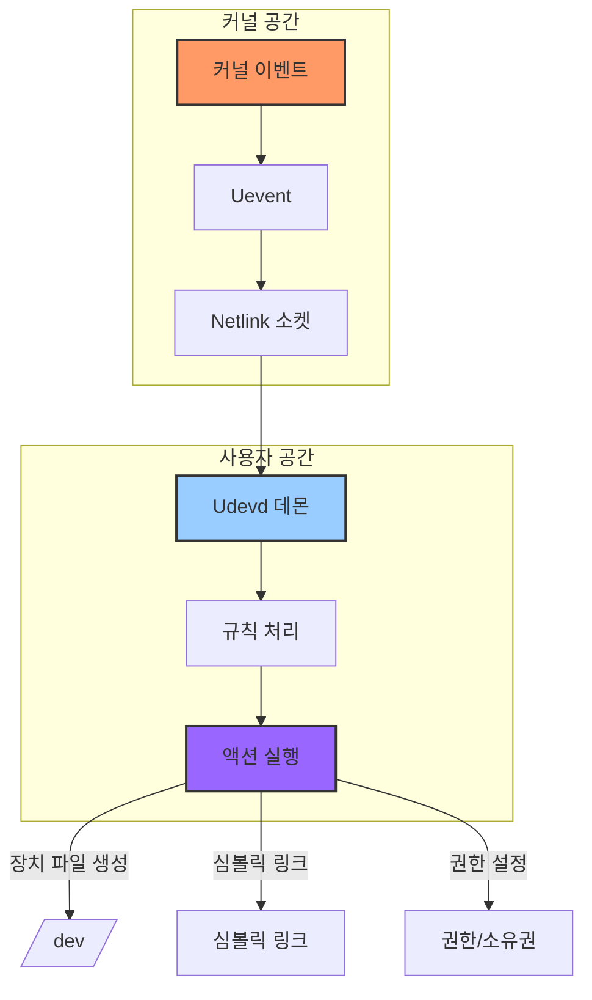

Udev 규칙의 예시:

```bash
# /etc/udev/rules.d/99-custom.rules
SUBSYSTEM=="usb", ATTR{idVendor}=="0483", ATTR{idProduct}=="5740", \
    MODE="0666", GROUP="plugdev", SYMLINK+="mydevice"
```

### 4. 장치 속성 관리 시스템

장치의 속성은 계층적으로 관리되며, 각 수준에서 특정 기능을 담당합니다:

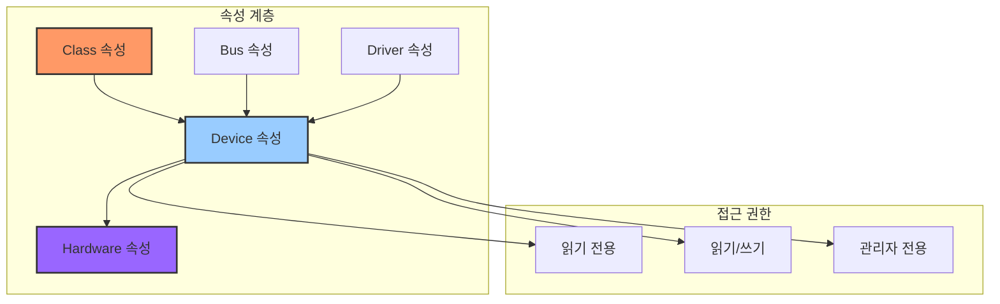

각 속성은 다음과 같은 특성을 가질 수 있습니다:

1. 접근 권한 수준
   - S_IRUGO: 모든 사용자가 읽기 가능
   - S_IWUSR: 소유자만 쓰기 가능
   - S_IWGRP: 그룹 쓰기 권한

2. 데이터 표현 방식
   - 텍스트 형식 (사람이 읽을 수 있는 형태)
   - 바이너리 형식 (효율적인 데이터 전송용)
   - 특별한 표현 형식 (예: JSON, XML)

## D. 드라이버 개발 사례와 최적화

### 1. 문자 장치 드라이버의 구현

문자 장치 드라이버는 가장 기본적인 형태의 리눅스 드라이버입니다. 다음은 전체적인 구현 구조를 보여줍니다:

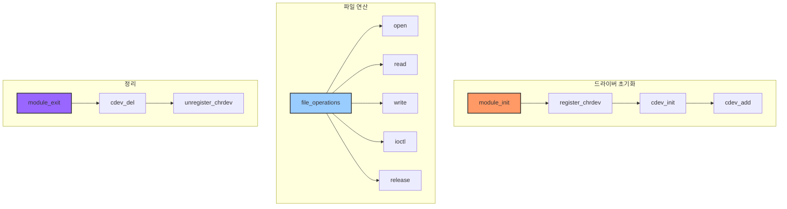

완전한 문자 장치 드라이버 구현 예제:

```c
#include <linux/module.h>
#include <linux/fs.h>
#include <linux/cdev.h>
#include <linux/device.h>
#include <linux/uaccess.h>

#define DEVICE_NAME "mychardev"
#define CLASS_NAME "mychar"

static struct class *mychardev_class = NULL;
static struct cdev mycdev;
static dev_t mydev;

// 디바이스 특화 구조체
struct mychar_device_data {
    unsigned char *buffer;
    unsigned long size;
    struct mutex mutex;
};

static struct mychar_device_data device_data;

// 파일 연산 구현
static int mychardev_open(struct inode *inode, struct file *file)
{
    struct mychar_device_data *data = container_of(inode->i_cdev,
                                                 struct mychar_device_data,
                                                 mycdev);
    file->private_data = data;
    return 0;
}

static ssize_t mychardev_read(struct file *file, char __user *buf,
                            size_t count, loff_t *offset)
{
    struct mychar_device_data *data = file->private_data;
    ssize_t retval = 0;

    if (mutex_lock_interruptible(&data->mutex))
        return -ERESTARTSYS;

    if (*offset >= data->size)
        goto out;

    if (*offset + count > data->size)
        count = data->size - *offset;

    if (copy_to_user(buf, data->buffer + *offset, count)) {
        retval = -EFAULT;
        goto out;
    }

    *offset += count;
    retval = count;

out:
    mutex_unlock(&data->mutex);
    return retval;
}

// 파일 연산 구조체
static const struct file_operations mychardev_fops = {
    .owner = THIS_MODULE,
    .open = mychardev_open,
    .read = mychardev_read,
};

```

### 2. 인터럽트 처리와 동시성 제어

인터럽트 처리는 드라이버 개발에서 가장 중요한 부분 중 하나입니다. 다음은 인터럽트 처리의 흐름을 보여줍니다:

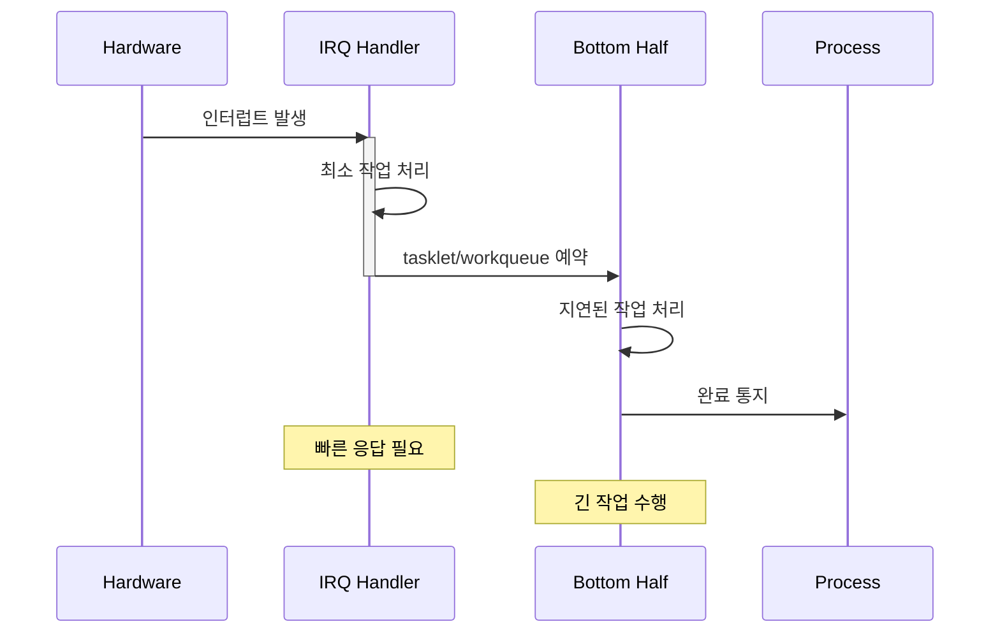

인터럽트 처리 코드 예제:

```c
// 인터럽트 핸들러
static irqreturn_t mydev_interrupt(int irq, void *dev_id)
{
    struct mydev_data *data = dev_id;
    
    // 인터럽트 확인 및 처리
    if (!is_my_interrupt(data))
        return IRQ_NONE;
        
    // 최소한의 하드웨어 처리
    disable_device_interrupt(data);
    
    // Bottom half 스케줄링
    tasklet_schedule(&data->tasklet);
    
    return IRQ_HANDLED;
}

// Tasklet 함수
static void mydev_tasklet_func(unsigned long d)
{
    struct mydev_data *data = (struct mydev_data *)d;
    
    // 지연된 처리 작업 수행
    process_received_data(data);
    
    // 인터럽트 재활성화
    enable_device_interrupt(data);
}
```

### 3. DMA 처리와 메모리 관리

DMA(Direct Memory Access) 처리는 고성능 장치 드라이버에서 필수적입니다. 다음은 DMA 설정과 처리 과정을 보여줍니다:

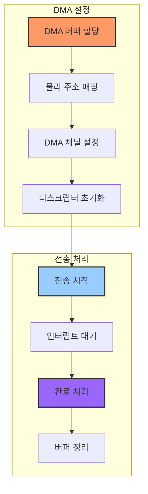

DMA 설정 코드 예제:

```c
static int mydev_setup_dma(struct mydev_data *data)
{
    // DMA 버퍼 할당
    data->dma_buf = dma_alloc_coherent(data->dev,
                                      DMA_BUF_SIZE,
                                      &data->dma_handle,
                                      GFP_KERNEL);
    if (!data->dma_buf)
        return -ENOMEM;
        
    // DMA 채널 요청
    data->dma_chan = dma_request_channel(mask, filter, data);
    if (!data->dma_chan) {
        dma_free_coherent(data->dev, DMA_BUF_SIZE,
                         data->dma_buf, data->dma_handle);
        return -ENODEV;
    }
    
    // 디스크립터 설정
    data->desc = dmaengine_prep_slave_single(data->dma_chan,
                                           data->dma_handle,
                                           DMA_BUF_SIZE,
                                           DMA_DEV_TO_MEM,
                                           DMA_PREP_INTERRUPT);
                                           
    return 0;
}
```

### 4. 성능 최적화 기법

드라이버 성능 최적화를 위한 주요 기법들을 살펴보겠습니다:

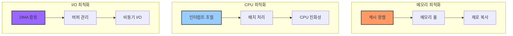

성능 최적화 코드 예제:

```c
// 메모리 풀 사용 예제
static struct kmem_cache *mydev_cache;

static int __init mydev_init(void)
{
    // 메모리 풀 생성
    mydev_cache = kmem_cache_create("mydev_cache",
                                  sizeof(struct mydev_data),
                                  0,
                                  SLAB_HWCACHE_ALIGN,
                                  NULL);
    if (!mydev_cache)
        return -ENOMEM;
        
    return 0;
}

// 캐시 친화적 메모리 할당
static struct mydev_data *mydev_alloc(void)
{
    struct mydev_data *data;
    
    data = kmem_cache_alloc(mydev_cache, GFP_KERNEL);
    if (!data)
        return NULL;
        
    return data;
}
```

이러한 최적화 기법들은 실제 드라이버 성능에 큰 영향을 미칠 수 있으며, 시스템 요구사항에 따라 적절히 선택하여 적용해야 합니다.

## E. 드라이버 디버깅과 문제 해결

### 1. 커널 디버깅 도구와 기법

커널 드라이버 디버깅은 사용자 공간 프로그램 디버깅과는 다른 특별한 접근이 필요합니다. 다음은 주요 디버깅 도구와 그 활용 방법을 보여줍니다:

```mermaid
graph TD
    subgraph "정적 분석"
        A[Sparse] --> B[Coccinelle]
        B --> C[Checkpatch]
    end
    
    subgraph "동적 분석"
        D[KGDB] --> E[ftrace]
        E --> F[kprobes]
        F --> G[SystemTap]
    end
    
    subgraph "모니터링"
        H[/proc] --> I[/sys]
        I --> J[tracing]
    end
    
    style A fill:#f96,stroke:#333,stroke-width:2px
    style D fill:#9cf,stroke:#333,stroke-width:2px
    style H fill:#96f,stroke:#333,stroke-width:2px
```

#### 1.1 printk와 동적 디버그

커널 로깅 시스템의 효과적인 사용 방법:

```c
// 커널 로그 레벨 정의
#define pr_fmt(fmt) KBUILD_MODNAME ": " fmt

#define DEBUG 1  // 컴파일 시 디버그 활성화

#if defined(DEBUG)
#define dev_dbg(dev, fmt, ...) \
    printk(KERN_DEBUG pr_fmt(fmt), ##__VA_ARGS__)
#else
#define dev_dbg(dev, fmt, ...) \
    no_printk(KERN_DEBUG pr_fmt(fmt), ##__VA_ARGS__)
#endif

// 사용 예시
static int mydev_probe(struct platform_device *pdev)
{
    dev_dbg(&pdev->dev, "probe called for device %s\n",
            dev_name(&pdev->dev));
    // ...
}
```

#### 1.2 ftrace 활용

ftrace를 사용한 함수 호출 추적:

```bash
# ftrace 설정
cd /sys/kernel/debug/tracing
echo function > current_tracer
echo 1 > tracing_on
echo "mydev*" > set_ftrace_filter

# 결과 확인
cat trace
```

실시간 함수 호출 흐름 분석:

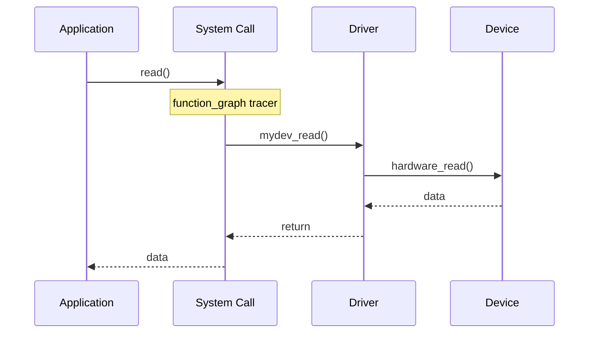

### 2. 일반적인 문제와 해결 방법

드라이버 개발 시 자주 발생하는 문제들과 그 해결 방법을 살펴보겠습니다:

```mermaid
graph TD
    subgraph "메모리 문제"
        A[메모리 누수] --> B[해결: KASAN]
        C[버퍼 오버플로우] --> D[해결: KUBSAN]
        E[페이지 폴트] --> F[해결: KFENCE]
    end
    
    subgraph "동기화 문제"
        G[경쟁 상태] --> H[해결: LOCKDEP]
        I[교착 상태] --> J[해결: DEBUG_MUTEXES]
    end
    
    subgraph "성능 문제"
        K[인터럽트 지연] --> L[해결: latencytop]
        M[CPU 병목] --> N[해결: perf]
    end
    
    style A fill:#f96,stroke:#333,stroke-width:2px
    style G fill:#9cf,stroke:#333,stroke-width:2px
    style K fill:#96f,stroke:#333,stroke-width:2px
```

#### 2.1 메모리 관련 문제 해결

KASAN(Kernel Address Sanitizer)을 사용한 메모리 문제 탐지:

```c
// KASAN 설정이 활성화된 커널 설정
CONFIG_KASAN=y
CONFIG_KASAN_INLINE=y

// 테스트 코드
static void memory_bug_test(void)
{
    char *ptr = kmalloc(64, GFP_KERNEL);
    
    // 의도적인 버그: 경계를 넘어선 쓰기
    ptr[64] = 'A';  // KASAN이 이 문제를 탐지
    
    kfree(ptr);
}
```

#### 2.2 동기화 문제 해결

LOCKDEP을 사용한 교착 상태 탐지:

```c
struct mutex lock_a, lock_b;

static void deadlock_test(void)
{
    mutex_lock(&lock_a);
    // 잠재적 교착 상태 가능성
    mutex_lock(&lock_b);
    
    // 작업 수행
    
    mutex_unlock(&lock_b);
    mutex_unlock(&lock_a);
}
```

### 3. 성능 프로파일링과 최적화

성능 문제를 식별하고 해결하기 위한 도구와 방법:

```mermaid
graph LR
    subgraph "프로파일링 도구"
        A[perf] --> B[ftrace]
        B --> C[eBPF]
    end
    
    subgraph "분석 대상"
        D[CPU 사용량]
        E[메모리 접근]
        F[I/O 패턴]
        G[캐시 활용]
    end
    
    A --> D & E
    B --> E & F
    C --> F & G
    
    style A fill:#f96,stroke:#333,stroke-width:2px
    style D fill:#9cf,stroke:#333,stroke-width:2px
```

perf를 사용한 성능 프로파일링 예시:

```bash
# CPU 프로파일링
perf record -a -g sleep 10
perf report

# 특정 함수 프로파일링
perf probe --add mydev_read
perf record -e probe:mydev_read -aR sleep 10
```

### 4. 드라이버 테스트와 검증

체계적인 드라이버 테스트 방법론:

```mermaid
graph TD
    subgraph "단위 테스트"
        A[kunit] --> B[모듈 테스트]
    end
    
    subgraph "통합 테스트"
        C[LTP] --> D[실제 하드웨어]
        D --> E[스트레스 테스트]
    end
    
    subgraph "자동화"
        F[CI/CD] --> G[커버리지]
        G --> H[정적 분석]
    end
    
    style A fill:#f96,stroke:#333,stroke-width:2px
    style C fill:#9cf,stroke:#333,stroke-width:2px
    style F fill:#96f,stroke:#333,stroke-width:2px
```

KUnit을 사용한 테스트 코드 예시:

```c
#include <kunit/test.h>

static void mydev_test_init(struct kunit *test)
{
    struct mydev_data *data;
    
    data = mydev_init();
    KUNIT_ASSERT_NOT_ERR_OR_NULL(test, data);
    
    // 추가 검증
    KUNIT_EXPECT_EQ(test, data->state, MYDEV_STATE_READY);
}

static struct kunit_case mydev_test_cases[] = {
    KUNIT_CASE(mydev_test_init),
    {}
};

static struct kunit_suite mydev_test_suite = {
    .name = "mydev_test",
    .test_cases = mydev_test_cases,
};

kunit_test_suite(mydev_test_suite);
```

이러한 디버깅 및 테스트 도구들을 효과적으로 활용하면, 안정적이고 성능이 우수한 드라이버를 개발할 수 있습니다.

## F. 결론 및 향후 전망

### 1. 리눅스 장치 드라이버 모델의 발전 방향

리눅스 장치 드라이버 모델은 지속적으로 발전하고 있으며, 다음과 같은 방향으로 진화하고 있습니다:

```mermaid
graph TD
    subgraph "현재"
        A[통합 드라이버 모델]
        B[사용자 공간 드라이버]
        C[동적 디바이스 트리]
    end
    
    subgraph "발전 방향"
        D[자동화된 드라이버 생성]
        E[AI 기반 최적화]
        F[보안 강화]
    end
    
    A --> D
    B --> E
    C --> F
    
    style A fill:#f96,stroke:#333,stroke-width:2px
    style D fill:#9cf,stroke:#333,stroke-width:2px
    style F fill:#96f,stroke:#333,stroke-width:2px
```

### 2. 드라이버 개발의 모범 사례

성공적인 드라이버 개발을 위한 핵심 원칙들을 종합하면 다음과 같습니다:

```mermaid
mindmap
    root((드라이버 개발))
        코드 품질
            명확한 구조화
            에러 처리
            문서화
        보안
            권한 검사
            입력 검증
            메모리 보호
        성능
            리소스 최적화
            동시성 제어
            캐시 활용
        유지보수성
            모듈화
            테스트 가능성
            디버그 용이성
```

### 3. 종합 정리

리눅스 장치 드라이버 모델은 하드웨어와 소프트웨어 간의 효율적인 인터페이스를 제공하는 핵심 프레임워크입니다. 본 문서에서 다룬 주요 내용을 정리하면 다음과 같습니다:

```mermaid
graph TD
    subgraph "기본 구조"
        A[장치] --> B[버스]
        C[드라이버] --> B
    end
    
    subgraph "주요 기능"
        B --> D[장치 관리]
        B --> E[리소스 관리]
        B --> F[전원 관리]
    end
    
    subgraph "개발 도구"
        G[디버깅]
        H[테스트]
        I[최적화]
    end
    
    D --> G
    E --> H
    F --> I
    
    style A fill:#f96,stroke:#333,stroke-width:2px
    style B fill:#9cf,stroke:#333,stroke-width:2px
    style G fill:#96f,stroke:#333,stroke-width:2px
```

### 4. 향후 고려사항

장치 드라이버 개발자들이 주목해야 할 향후 과제와 기회는 다음과 같습니다:

1. **보안 강화**
   - 드라이버 수준의 보안 검증 메커니즘 도입
   - 하드웨어 보안 기능의 효과적 활용
   - 제로 트러스트 아키텍처 적용

2. **자동화와 효율성**
   - 자동화된 드라이버 생성 도구 개발
   - CI/CD 파이프라인 통합
   - 자동화된 테스트 프레임워크 구축

3. **신기술 대응**
   - 새로운 하드웨어 아키텍처 지원
   - 실시간 요구사항 처리
   - 에너지 효율성 최적화

4. **개발 생산성**
   - 재사용 가능한 드라이버 컴포넌트
   - 표준화된 디버깅 인터페이스
   - 개선된 개발자 도구

이러한 발전 방향을 고려하여 드라이버를 개발할 때는 확장성과 유지보수성을 항상 염두에 두어야 합니다. 또한, 커널 커뮤니티의 코딩 표준과 가이드라인을 준수하면서도 혁신적인 해결책을 찾아나가는 균형 잡힌 접근이 필요합니다.

### 5. 마무리

리눅스 장치 드라이버 개발은 하드웨어와 소프트웨어의 경계에서 이루어지는 도전적인 작업입니다. 이 문서에서 다룬 내용들이 드라이버 개발자들에게 유용한 가이드가 되기를 바랍니다. 지속적인 학습과 커뮤니티 참여를 통해, 더 나은 드라이버 생태계를 만들어나갈 수 있을 것입니다.

## 결론

리눅스 장치 드라이버 모델은 하드웨어 추상화와 효율적인 리소스 관리를 제공하는 강력한 프레임워크입니다. 이 모델을 통해 개발자는 일관된 방식으로 드라이버를 구현할 수 있으며, 사용자는 통일된 인터페이스로 장치를 제어할 수 있습니다.