# 커널 구조와 서브시스템 개요

## A. 서론: 커널이란 무엇인가?

### 1. 커널의 정의

운영체제의 핵심 구성요소인 **커널(Kernel)**은 컴퓨터의 하드웨어와 소프트웨어 사이에서 중재자 역할을 수행하는 핵심 소프트웨어입니다. 커널은 다음과 같은 특징을 가집니다:

- 컴퓨터가 부팅될 때 메모리에 가장 먼저 로드되는 프로그램
- 시스템의 모든 하드웨어와 소프트웨어 자원을 관리
- 최고 권한(ring 0/커널 모드)에서 실행되는 신뢰할 수 있는 코드
- 사용자 프로그램과 하드웨어 사이의 안전하고 제어된 상호작용을 보장

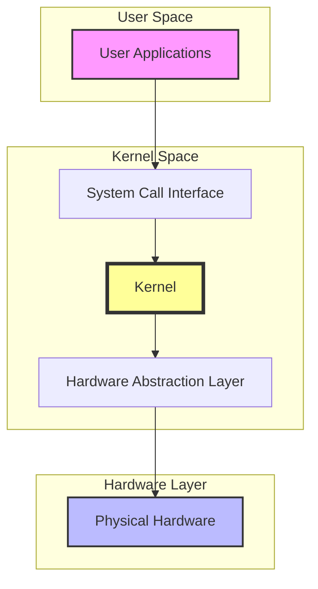

### 2. 커널의 역할

현대적인 커널은 다음과 같은 핵심적인 역할들을 수행합니다:

**프로세스 관리**
- 프로세스 생성, 실행, 일시 중지, 재개, 종료
- CPU 시간의 공정한 분배(스케줄링)
- 프로세스 간 통신(IPC) 메커니즘 제공

**메모리 관리**
- 물리 메모리의 효율적인 할당과 회수
- 가상 메모리 시스템을 통한 메모리 보호
- 페이지 교체 알고리즘을 통한 메모리 효율화

**파일 시스템 관리**
- 파일의 생성, 읽기, 쓰기, 삭제 연산 처리
- 다양한 파일 시스템 지원(VFS 계층)
- 디스크 공간의 효율적인 관리

**네트워크 스택**
- TCP/IP 프로토콜 스택 구현
- 네트워크 인터페이스 처리
- 패킷의 송수신 처리

**보안 및 보호**
- 사용자 권한 관리
- 시스템 리소스 접근 제어
- 메모리 보호와 프로세스 격리

이러한 역할들은 서로 긴밀하게 연결되어 있으며, 커널은 이들을 효율적으로 조율하면서 시스템의 안정성과 성능을 보장합니다.

---

## B. 커널 아키텍처

### 1. 커널 아키텍처 유형

현대 운영체제에서 사용되는 주요 커널 아키텍처는 크게 세 가지로 분류됩니다:

#### 모놀리식 커널 (Monolithic Kernel)
- 모든 시스템 서비스가 하나의 커다란 커널 공간에서 동작
- 커널 컴포넌트들이 같은 메모리 공간을 공유
- 장점:
  - 컴포넌트 간 직접 통신으로 높은 성능
  - 하드웨어 자원에 대한 빠른 접근
- 단점:
  - 한 모듈의 버그가 전체 시스템에 영향
  - 크고 복잡한 코드베이스
- 대표 예: Linux, BSD 계열

#### 마이크로커널 (Microkernel)
- 최소한의 기능만 커널에 포함
- 대부분의 서비스는 사용자 공간에서 서버 프로세스로 동작
- 장점:
  - 높은 안정성과 유지보수성
  - 모듈화가 용이
- 단점:
  - 잦은 컨텍스트 스위칭으로 인한 성능 저하
  - 복잡한 통신 메커니즘 필요
- 대표 예: MINIX, QNX

#### 하이브리드 커널 (Hybrid Kernel)
- 모놀리식과 마이크로커널의 특징을 혼합
- 성능이 중요한 서비스는 커널에, 그 외는 사용자 공간에 배치
- 장점:
  - 적절한 성능과 안정성 균형
  - 유연한 설계 가능
- 단점:
  - 설계 복잡도 증가
  - 성능과 모듈성 사이의 타협 필요
- 대표 예: Windows NT, macOS XNU

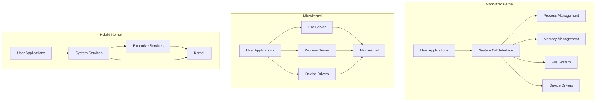

### 2. 커널 유형 비교

| 특성 | 모놀리식 커널 | 마이크로커널 | 하이브리드 커널 |
|------|----------|------|------|
| 성능 | 매우 높음 | 상대적으로 낮음 | 높음 |
| 안정성 | 낮음 | | 매우 높음 | 높음 |
| 복잡도 | 높음 | | 낮음 | 중간 |
| 확장성 | 모듈로 확장 가능 | 매우 높음 | 높음 |
| 유지보수 | 어려움 | 쉬움 | 중간 |
| 메모리 사용 | 많음 | 적음 | 중간 |
| 대표 OS | Linux | MINIX, QNX | Windows NT, macOS |

### 3. 리눅스 커널 구조

리눅스는 모놀리식 커널이지만, 로드 가능한 커널 모듈(LKM)을 통해 동적으로 기능을 확장할 수 있는 기능을 가지고 있습니다.

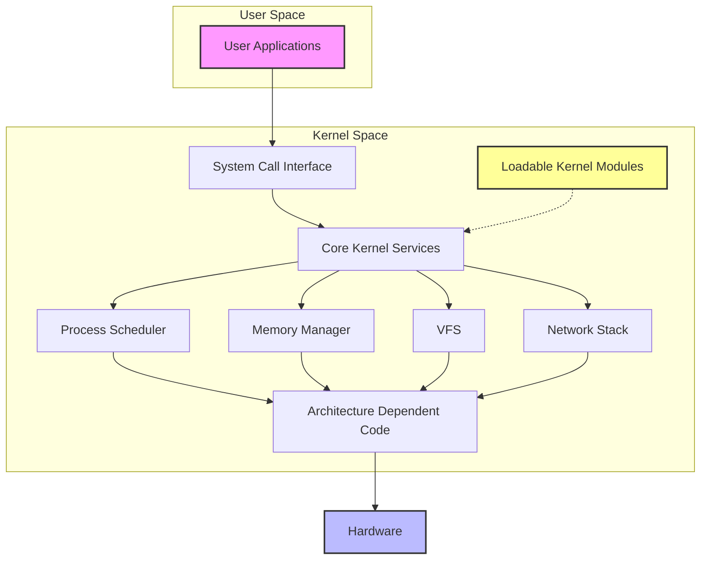

**리눅스 커널의 주요 특징:**
- 모듈식 설계로 필요한 기능만 동적으로 로드 가능
- 하드웨어 추상화 계층을 통한 다양한 아키텍처 지원
- 효율적인 프로세스 스케줄링과 메모리 관리
- 확장 가능한 가상 파일시스템(VFS) 계층
- 모듈화된 네트워크 스택

---

## C. 주요 서브시스템 개요

### 1. 프로세스 관리

프로세스 관리 서브시스템은 CPU 자원을 효율적으로 관리하고 프로세스/스레드의 생명주기를 제어합니다.

#### 핵심 구성 요소
- **task_struct**: 프로세스 디스크립터
  - 프로세스 ID, 상태, 우선순위
  - 메모리 관리 정보
  - 파일 디스크립터 테이블
  - 시그널 핸들링 정보
  
#### 주요 기능
- 프로세스 생성/종료 (`fork`, `exec`, `exit`)
- 스케줄링 (CFS - Completely Fair Scheduler)
- 문맥 교환 (Context Switch)
- 프로세스 간 통신 (IPC)

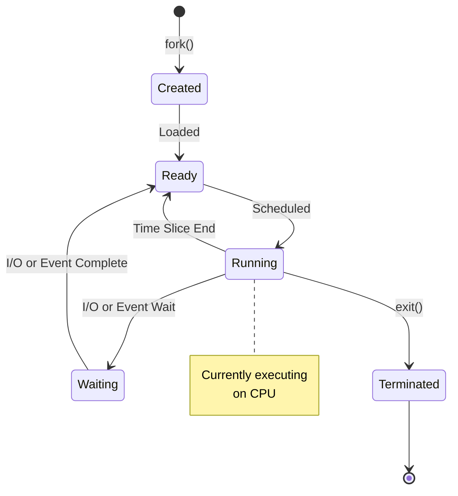

### 2. 메모리 관리

메모리 관리 서브시스템은 물리적 메모리를 추상화하고 효율적으로 할당/회수합니다.

**핵심 구성 요소**
- `mm_struct`: 메모리 디스크럽터
- `vm_area_struct`: 가상 메모리 영역
- 페이지 테이블: 가상 주소와 물리 주소 매핑

**주요 기능**
- 가상 메모리 관리
- 페이지 할당/해제
- 페이지 교체 (Page Replacement)
- 메모리 보호

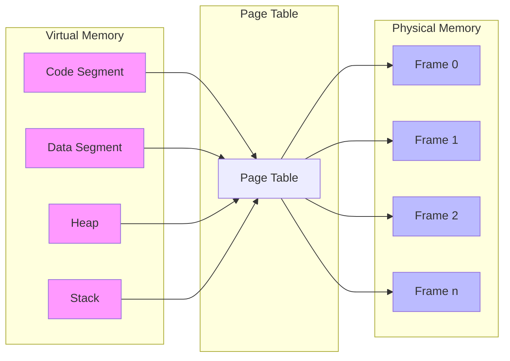

### 3. 파일 시스템 관리

파일 시스템 관리는 저장 장치의 데이터를 추상화하고 일관된 인터페이스를 제공합니다.

**핵심 구성 요소**
- VFS(Virtual File System)
  - 슈퍼블록 객체
  - 아이노드 객체
  - 덴트리 객체
  - 파일 객체

**주요 기능**
- 파일 생성/삭제/읽기/쓰기
- 디렉토리 관리
- 파일 시스템 마운트
- 버퍼/캐시 관리

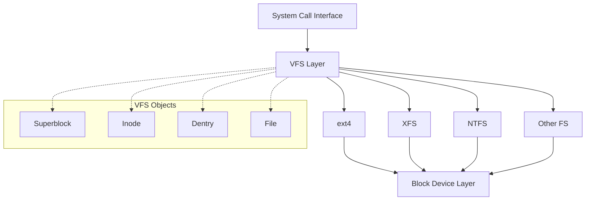

### 4. 네트워크 스택

네트워크 스택은 네트워크 통신을 위한 프로토콜 구현과 인터페이스를 제공합니다.

**핵심 구성 요소**
- 소켓 인터페이스
- 프로토콜 스택(TCP/IP)
- 네트워크 디바이스 드라이버

**주요 기능**
- 패킷 송수신
- 프로토콜 처리
- 라우팅
- 네트워크 보안

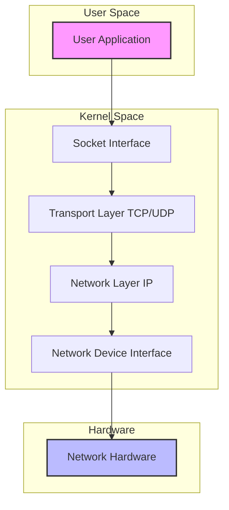

### 5. 디바이스 관리

디바이스 관리는 하드웨어 장치와의 통신을 추상화하고 일관된 인터페이스를 제공합니다.

**핵심 구성 요소**
- 디바이스 드라이버
- 디바이스 클래스
- 버스 시스템
- Udev/Sysfs

**주요 기능**
- 장치 검출 및 초기화
- 인터럽트 처리
- DMA 관리
- 전원 관리

---

## D. 커널 모듈과 동적 로딩

### 1. 커널 모듈(Kernel Module)의 정의

커널 모듈은 필요할 때 커널에 동적으로 로드하거나 언로드할 수 있는 코드 조각입니다. 이를 통해 커널의 기능을 실행 시간에 확장할 수 있으며, 기본 커널의 크기를 최소화할 수 있습니다.

#### 특징
- 커널 공간에서 실행
- 커널과 동일한 권한 보유
- 동적 로드/언로드 가능
- 다른 모듈과 의존성 가능

#### 주요 명령어
- `insmod`: 모듈 삽입
- `rmmod`: 모듈 제거
- `modprobe`: 의존성을 고려한 모듈 관리
- `lsmod`: 로드된 모듈 목록 확인

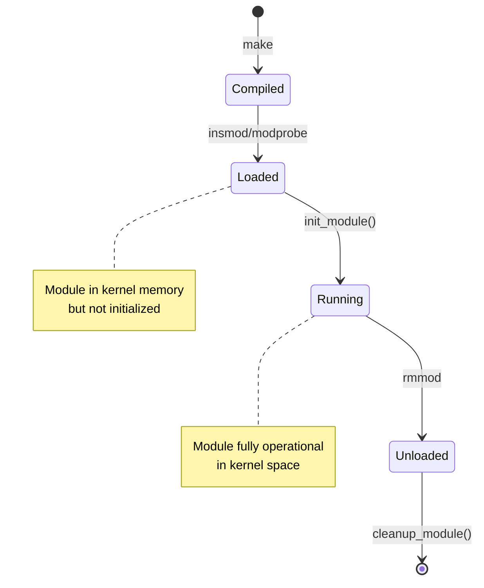

### 2. 모듈 작성 간단 예시

다음은 가장 기본적인 "Hello, Kernel" 모듈의 예시입니다:

```c
#include <linux/module.h>
#include <linux/kernel.h>
#include <linux/init.h>

// 모듈 정보
MODULE_LICENSE("GPL");
MODULE_AUTHOR("Your Name");
MODULE_DESCRIPTION("A simple Hello World module");

// 모듈 초기화 함수
static int __init hello_init(void)
{
    printk(KERN_INFO "Hello, Kernel!\n");
    return 0;
}

// 모듈 정리 함수
static void __exit hello_exit(void)
{
    printk(KERN_INFO "Goodbye, Kernel!\n");
}

// 함수 등록
module_init(hello_init);
module_exit(hello_exit);
```

**이 모듈을 위한 Makefile**
```makefile
obj-m += hello.o

all:
	make -C /lib/modules/$(shell uname -r)/build M=$(PWD) modules

clean:
	make -C /lib/modules/$(shell uname -r)/build M=$(PWD) clean
```

### 3. 커널 모듈의 장점과 한계

**장점**

1. **유연성**
  - 필요한 기능만 동적으로 로드
  - 실행 중인 커널의 기능 확장 가능
  - 디바이스 드라이버 동적 관리

2. **자원 효율성**
  - 기본 커널 이미지 크기 최소화
  - 필요한 경우에만 메모리 사용
  - 불필요한 기능 제거 가능

3. **개발 및 디버깅 용이성**
  - 전체 커널 리빌드 없이 개발 가능
  - 빠른 개발-테스트 사이클
  - 모듈 단위 디버깅 가능

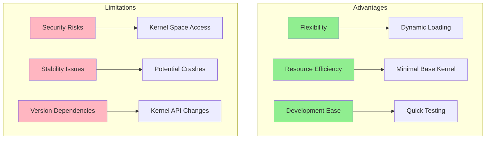

**한계**

1. **안정성 위험**
  - 모듈의 버그가 전체 시스템에 영향
  - 커널 패닉 유발 가능성
  - 메모리 누수 위험

2. **보안 고려사항**
  - 커널 권한으로 실행되어 보안 위험 존재
  - 악의적인 모듈의 시스템 장악 가능성
  - 검증되지 않은 모듈 사용의 위험

3. **의존성 문제**
  - 커널 버전 의존성
  - API/ABI 호환성 이슈
  - 다른 모듈과의 의존성 관리 필요

---

## E. 주요 다이어그램

### 1. 커널 아키텍처 비교

다음 다이어그램은 세 가지 주요 커널 아키텍처의 구조적 차이를 보여줍니다.

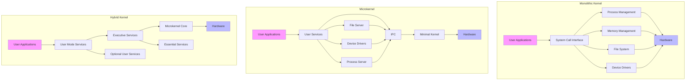

### 2. 리눅스 커널 구조

다음은 리눅스 커널의 주요 서브시스템과 그들 간의 상호작용을 보여주는 상세 구조도입니다.

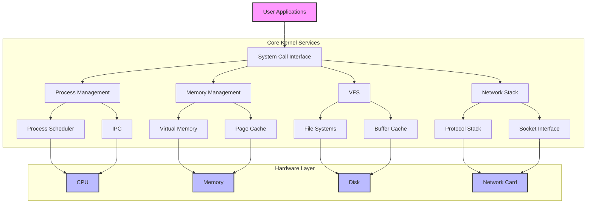

### 3. 서브시스템 간 관게

다음 다이어그램은 커널의 주요 서브시스템들이 어떻게 상호작용하는지 보여줍니다.

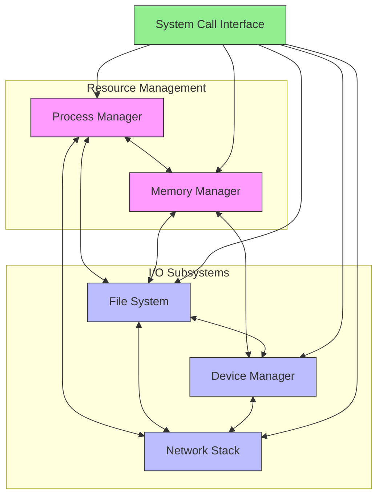