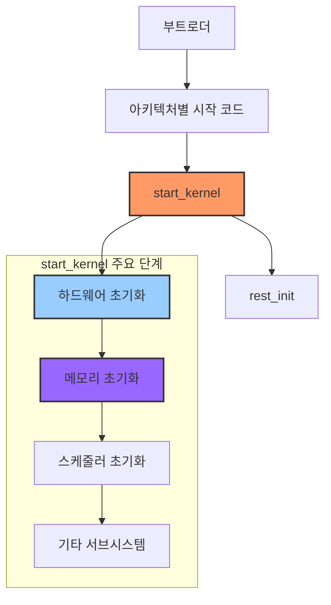
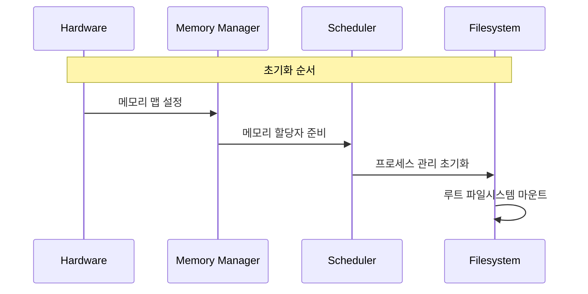
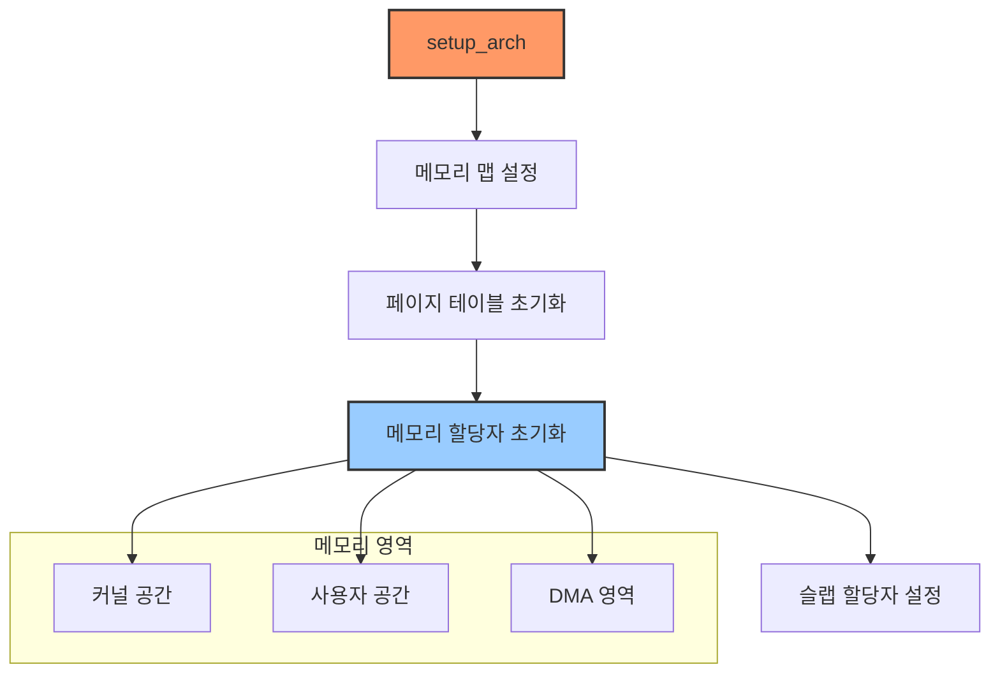
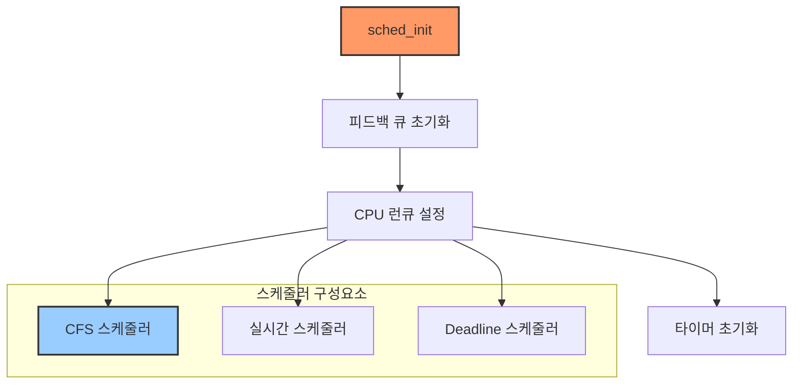
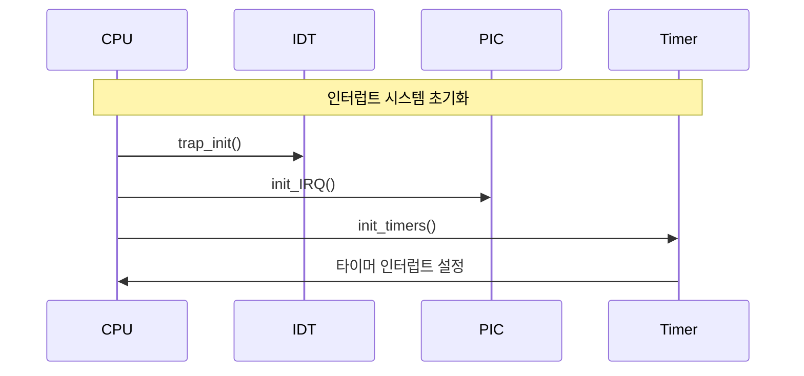
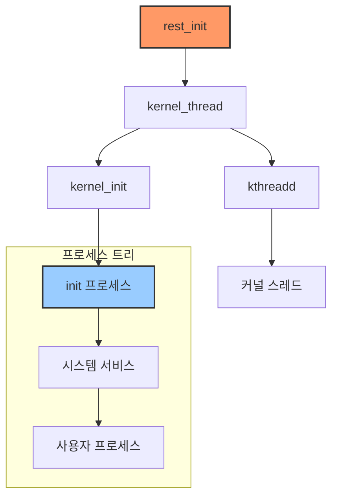
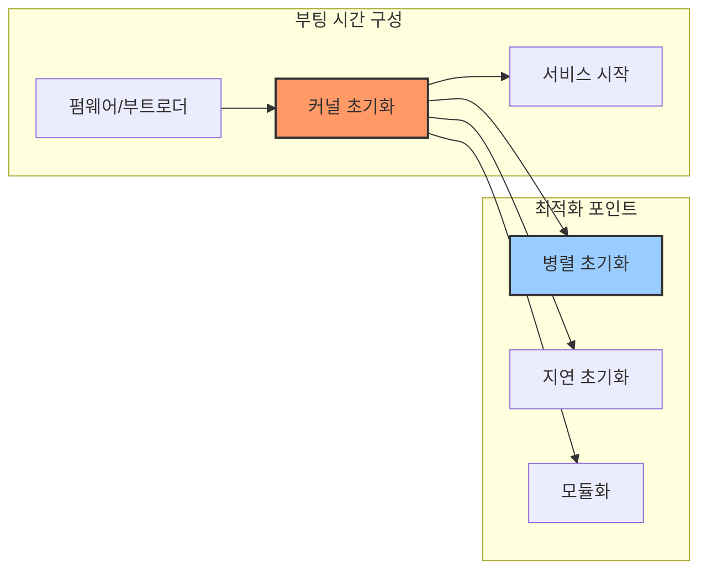

# 리눅스 커널 start_kernel() 함수 분석

리눅스 커널의 start_kernel() 함수는 커널의 실제 시작점으로, 시스템의 모든 주요 서브시스템을 초기화하는 핵심 함수입니다. 이 문서에서는 start_kernel() 함수의 실행 흐름과 각 단계별 초기화 과정을 상세히 분석합니다.

## A. start_kernel() 함수 개요

start_kernel() 함수는 init/main.c 파일에 위치하며, 부트로더가 커널을 메모리에 로드하고 실행을 시작한 후 가장 먼저 호출되는 C 함수입니다.



### 1. 초기화 순서의 중요성

start_kernel() 함수 내의 초기화 순서는 매우 중요합니다. 각 서브시스템은 다른 서브시스템에 대한 의존성을 가지고 있어, 올바른 순서로 초기화되어야 합니다.



## B. 주요 초기화 단계 분석

### 1. 초기 하드웨어 설정

start_kernel() 함수는 가장 먼저 기본적인 하드웨어 초기화를 수행합니다:

```c
void __init start_kernel(void)
{
    // CPU 식별 및 초기화
    boot_cpu_init();
    
    // 페이지 주소 초기화
    page_address_init();
    
    // 커맨드 라인 파싱
    parse_early_param();
    
    // 아키텍처 특화 설정
    setup_arch(&command_line);
}
```

### 2. 메모리 관리 초기화

메모리 관리 서브시스템의 초기화는 여러 단계로 이루어집니다:



주요 메모리 초기화 함수들:

```c
// 메모리 초기화 관련 주요 함수들
setup_arch(&command_line);
mm_init();
setup_per_cpu_areas();
smp_prepare_boot_cpu();
build_all_zonelists();
page_alloc_init();
```

### 3. 스케줄러 초기화

프로세스 관리와 스케줄러 초기화는 다음과 같은 순서로 진행됩니다:



### 4. 인터럽트 및 타이머 초기화

시스템의 인터럽트 처리와 타이밍 메커니즘 초기화:



### 5. 파일시스템 초기화

VFS(Virtual File System)와 초기 파일시스템 설정:

```c
// 파일시스템 초기화 과정
vfs_caches_init_early();
vfs_caches_init();
signals_init();
page_writeback_init();
proc_root_init();
```

## C. rest_init() 함수와 Init 프로세스

start_kernel() 함수의 마지막 부분에서는 rest_init() 함수를 호출하여 첫 번째 사용자 프로세스를 생성합니다:



### 1. Init 프로세스 생성

```c
static noinline void __init_refok rest_init(void)
{
    // 커널 스레드 생성
    pid = kernel_thread(kernel_init, NULL, CLONE_FS);
    
    // kthreadd 스레드 생성
    pid = kernel_thread(kthreadd, NULL, CLONE_FS | CLONE_FILES);
    
    // CPU 유휴 프로세스로 전환
    cpu_idle();
}
```

### 2. 시스템 초기화 완료

Init 프로세스가 시작되면 다음과 같은 작업이 수행됩니다:

1. 시스템 초기화 스크립트 실행
2. 기본 시스템 서비스 시작
3. 사용자 공간 초기화
4. 로그인 프롬프트 제공

## D. 성능과 디버깅 고려사항

### 1. 부팅 시간 최적화

start_kernel() 함수의 실행 시간은 시스템의 부팅 시간에 직접적인 영향을 미칩니다:



### 2. 디버깅 기법

초기화 과정에서의 문제를 디버깅하기 위한 방법들:

1. 초기 printk 메시지 활용
2. 부팅 파라미터를 통한 디버그 레벨 조정
3. 커널 크래시 덤프 분석
4. KGDB를 통한 원격 디버깅

## E. 결론

start_kernel() 함수는 리눅스 커널의 초기화 과정에서 가장 중요한 함수입니다. 이 함수의 동작을 이해하는 것은 다음과 같은 이점이 있습니다:

1. 커널 개발 및 디버깅 능력 향상
2. 시스템 초기화 문제 해결 능력 강화
3. 커널 수정 및 최적화 작업 시 필요한 통찰력 확보
4. 새로운 하드웨어 플랫폼 지원 추가 시 참조점 제공

이러한 이해를 바탕으로, 커널 개발자는 더 효율적이고 안정적인 시스템을 구축할 수 있습니다.