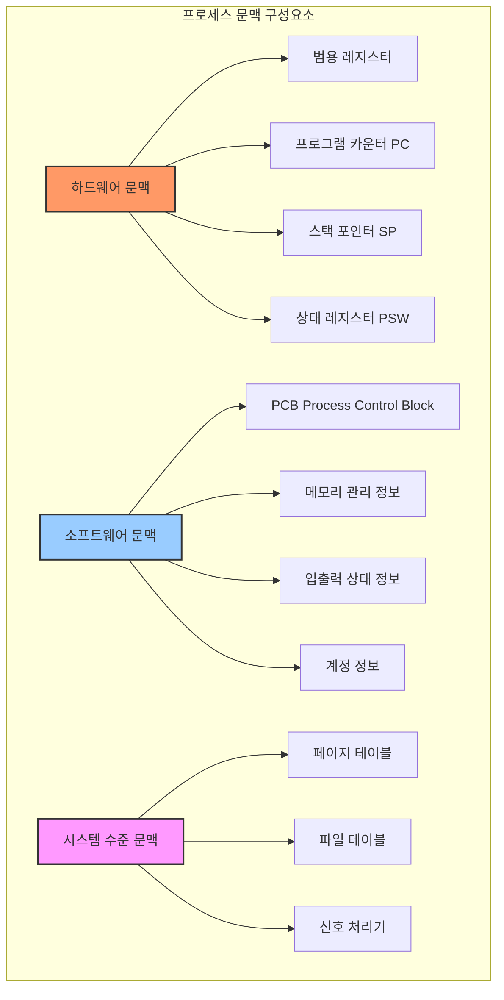
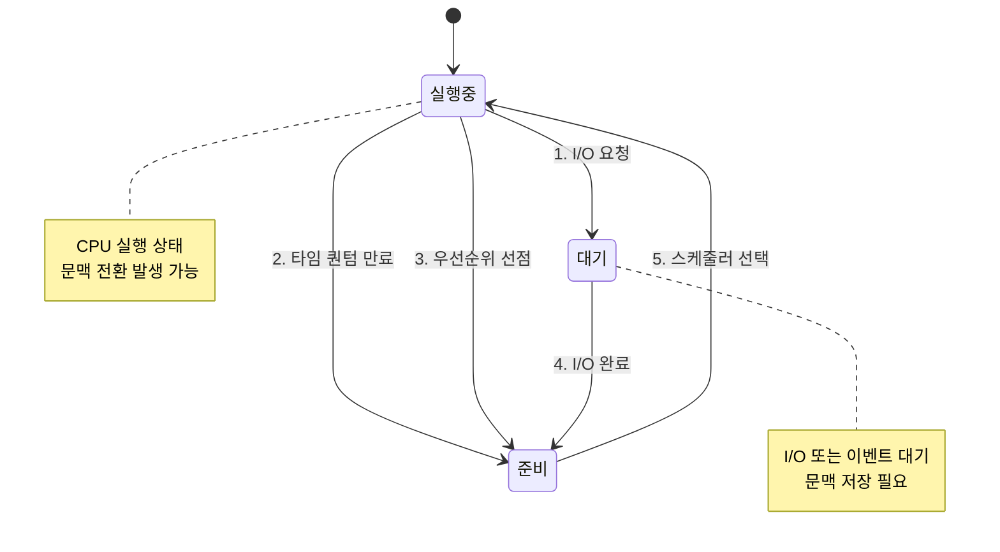
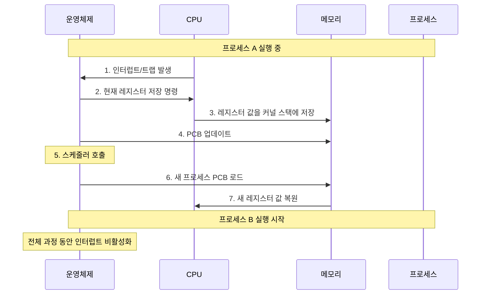
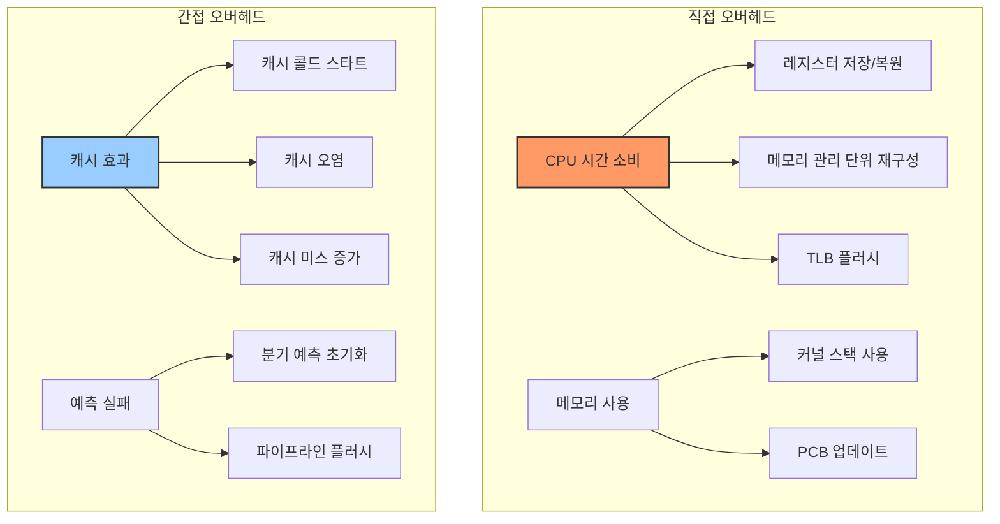
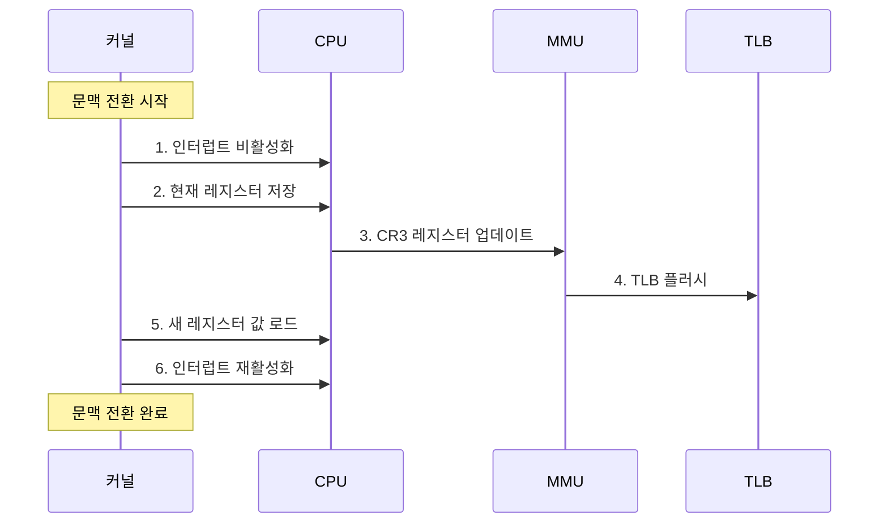
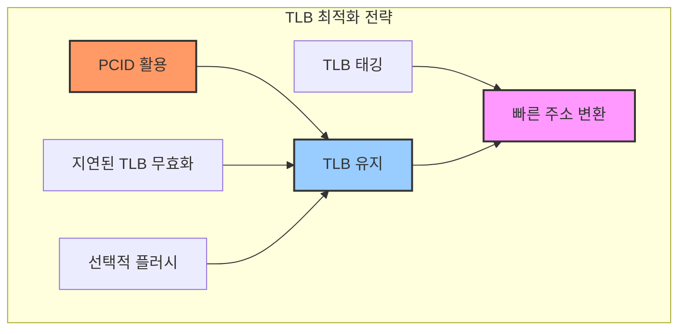
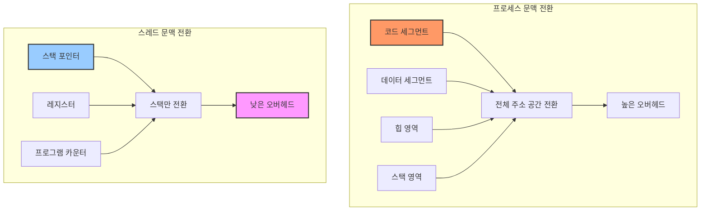
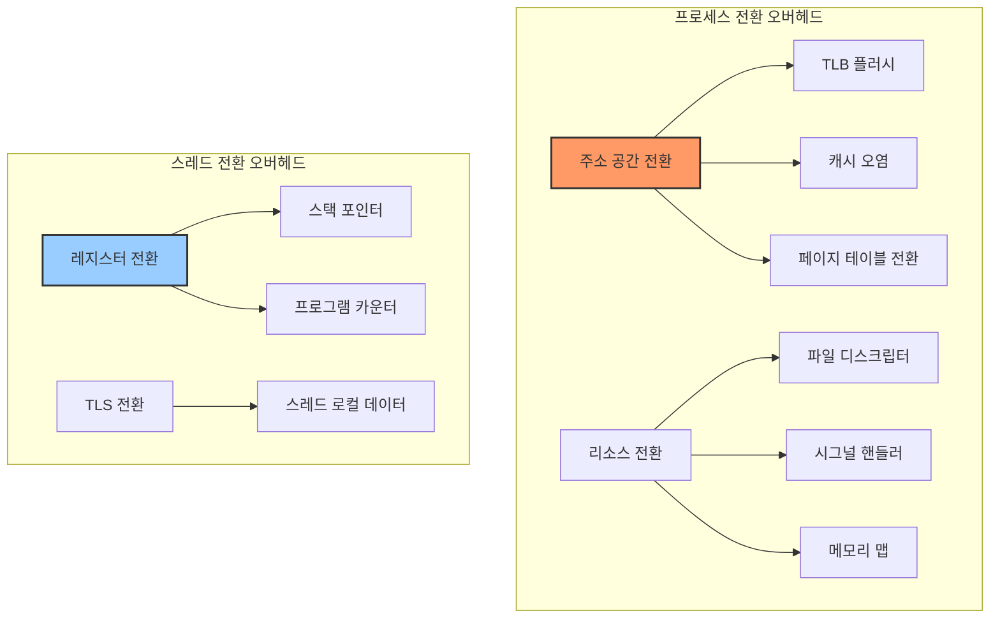
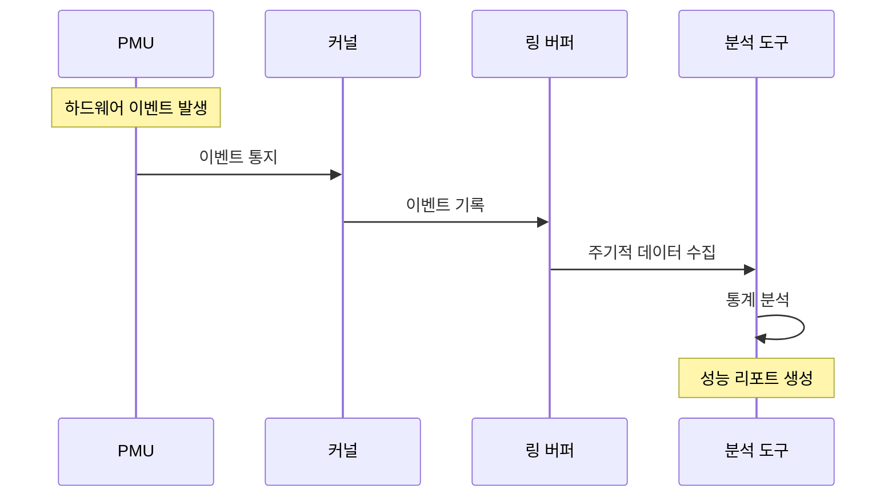
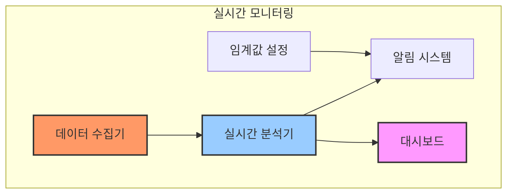

# A. 문맥 전환의 기본 개념

문맥 전환은 운영체제의 핵심 기능으로, 하나의 프로세스나 스레드에서 다른 프로세스나 스레드로 CPU의 제어권이 이동하는 과정을 의미합니다. 이 과정에서 운영체제는 현재 실행 중인 프로세스의 상태를 저장하고, 다음에 실행할 프로세스의 상태를 복원합니다.

## 1. 문맥(Context)의 구성 요소

문맥은 프로세스나 스레드가 나중에 실행을 재개할 때 필요한 모든 정보를 포함합니다.



### 1.1 하드웨어 문맥

하드웨어 문맥은 CPU 레지스터에 저장된 값들로 구성됩니다:

1. 범용 레지스터
   - 산술 및 논리 연산에 사용되는 데이터
   - 임시 결과값 저장
   - x86_64의 경우 RAX, RBX, RCX, RDX 등

2. 프로그램 카운터 (PC)
   - 다음에 실행할 명령어의 주소
   - 인스트럭션 포인터(IP)라고도 함
   - x86_64의 경우 RIP 레지스터

3. 스택 포인터 (SP)
   - 현재 스택의 최상단 주소
   - 함수 호출 정보와 지역 변수 관리
   - x86_64의 경우 RSP 레지스터

4. 프로그램 상태 워드 (PSW)
   - 현재 CPU 실행 상태 정보
   - 인터럽트 활성화/비활성화 상태
   - 특권 레벨(ring level)
   - 조건 코드(Zero, Carry, Overflow 등)

### 1.2 문맥 전환 트리거 상황



문맥 전환이 발생하는 주요 상황들:

1. **인터럽트 기반 전환**
   - 하드웨어 인터럽트 (타이머, I/O 등)
   - 소프트웨어 인터럽트 (시스템 콜)
   - 예외 상황 (페이지 폴트, 제로 나눗셈 등)

2. **스케줄링 기반 전환**
   - 타임 슬라이스 소진
   - 우선순위 기반 선점
   - 실시간 프로세스 도착

3. **I/O 기반 전환**
   - 블로킹 I/O 요청
   - DMA 완료
   - 네트워크 패킷 도착

4. **동기화 기반 전환**
   - 뮤텍스/세마포어 대기
   - 조건 변수 대기
   - 프로세스 간 통신

### 1.3 문맥 전환의 단계별 과정



문맥 전환의 세부 단계:

1. **현재 프로세스 상태 저장**
   - CPU 레지스터 값 저장
   - 프로그램 카운터 저장
   - 메모리 관리 정보 저장
   - PCB 업데이트

2. **새 프로세스 선택**
   - 스케줄러 실행
   - 우선순위 계산
   - 다음 실행 프로세스 결정

3. **새 프로세스 문맥 복원**
   - PCB에서 정보 로드
   - 메모리 매핑 재설정
   - CPU 레지스터 복원
   - 프로그램 카운터 설정

4. **실행 재개**
   - 새 프로세스로 제어권 이전
   - 인터럽트 활성화
   - 사용자 모드로 전환

### 1.4 문맥 전환의 오버헤드

문맥 전환은 상당한 시스템 오버헤드를 발생시킵니다:



---

# B. 문맥 전환의 구현

문맥 전환의 실제 구현은 하드웨어 아키텍처와 운영체제에 따라 다양한 방식으로 이루어집니다. 여기서는 x86_64 아키텍처를 중심으로 상세한 구현 방식을 살펴보겠습니다.

## 1. 프로세스 문맥의 저장 구조

### 1.1 태스크 구조체 (task_struct)

리눅스 커널에서 프로세스의 문맥은 task_struct라는 구조체에 저장됩니다:

```c
struct task_struct {
    // 프로세스 식별자
    pid_t pid;
    pid_t tgid;
    
    // 프로세스 상태
    volatile long state;    // -1: 종료, 0: 실행가능, >0: 중지됨
    
    // 스케줄링 정보
    int prio;
    int static_prio;
    unsigned int policy;
    struct sched_entity se;
    
    // 메모리 관리
    struct mm_struct *mm;
    struct mm_struct *active_mm;
    
    // 스레드 정보
    struct thread_struct thread;
    
    // 파일 시스템 정보
    struct fs_struct *fs;
    struct files_struct *files;
    
    // 시그널 처리
    struct signal_struct *signal;
    struct sighand_struct *sighand;
    sigset_t blocked;
    sigset_t real_blocked;
    
    // 타이밍 정보
    u64 utime;
    u64 stime;
    
    // 리소스 사용 정보
    struct task_cputime cputime_expires;
    struct list_head tasks;
    
    // 문맥 전환 통계
    unsigned long nvcsw;    // 자발적 문맥 전환 횟수
    unsigned long nivcsw;   // 비자발적 문맥 전환 횟수
};
```

### 1.2 스레드 정보 구조체

CPU 아키텍처별 특정 정보는 thread_struct에 저장됩니다:

```c
struct thread_struct {
    // 기본 CPU 문맥
    unsigned long sp;           // 스택 포인터
    unsigned long ip;           // 명령어 포인터
    unsigned long fs;           // FS 세그먼트 베이스
    unsigned long gs;           // GS 세그먼트 베이스
    
    // FPU/SSE 상태
    struct fpu fpu;
    
    // 디버그 레지스터
    unsigned long debugreg6;
    unsigned long debugreg7;
    
    // 시스템 콜 정보
    unsigned long syscall_ret;
    
    // IO 비트맵
    unsigned long *io_bitmap_ptr;
    
    // 특권 레벨 전환 스택
    unsigned long sp0;          // 커널 스택 포인터
    unsigned long sp1;          // 중간 특권 레벨 스택 포인터
    unsigned long sp2;          // 사용자 스택 포인터
};
```

## 2. 문맥 전환 메커니즘

### 2.1 CPU 레벨 문맥 전환



### 2.2 x86_64 아키텍처의 문맥 전환 구현

실제 문맥 전환을 수행하는 어셈블리 코드의 핵심 부분입니다:

```nasm
; switch_to 매크로 구현
ENTRY(__switch_to)
    # 현재 레지스터 저장
    pushq   %rbp
    pushq   %rbx
    pushq   %r12
    pushq   %r13
    pushq   %r14
    pushq   %r15
    
    # FPU 상태 저장
    movq    %rsp, THREAD_RSP(%rdi)
    
    # 세그먼트 레지스터 저장
    movq    %fs, THREAD_FS(%rdi)
    movq    %gs, THREAD_GS(%rdi)
    
    # 새 프로세스의 레지스터 복원
    movq    THREAD_RSP(%rsi), %rsp
    movq    THREAD_FS(%rsi), %fs
    movq    THREAD_GS(%rsi), %gs
    
    # 저장된 레지스터 복원
    popq    %r15
    popq    %r14
    popq    %r13
    popq    %r12
    popq    %rbx
    popq    %rbp
    
    ret
END(__switch_to)
```

### 2.3 메모리 관리 단위(MMU) 전환

문맥 전환 시 메모리 관리 정보도 함께 업데이트해야 합니다:

```c
void switch_mm_irqs_off(struct mm_struct *prev, struct mm_struct *next,
                       struct task_struct *tsk)
{
    unsigned cpu = smp_processor_id();
    
    // 동일한 주소 공간이면 건너뛰기
    if (prev == next)
        return;
    
    // CR3 레지스터 업데이트 (페이지 테이블 베이스 주소)
    load_new_mm_cr3(next->pgd, (next->context.asid & ASID_MASK));
    
    // 현재 CPU의 active mm 업데이트
    this_cpu_write(cpu_tlbstate.ctxid, next->context.asid);
    this_cpu_write(cpu_tlbstate.active_mm, next);
    
    // TLB 플러시가 필요한 경우
    if (need_flush_tlb(next))
        __flush_tlb_all();
}
```

---

## 3. 문맥 전환 최적화 기법

### 3.1 TLB 최적화



PCID(Process Context Identifier) 활용 코드:

```c
void switch_mm_with_pcid(struct mm_struct *prev, struct mm_struct *next,
                        struct task_struct *tsk)
{
    u64 next_tlb_gen = atomic64_read(&next->context.tlb_gen);
    unsigned cpu = smp_processor_id();
    
    if (prev != next) {
        // PCID 할당 및 관리
        u16 new_pcid = next->context.pcid;
        if (new_pcid == 0) {
            new_pcid = this_cpu_alloc_pcid();
            next->context.pcid = new_pcid;
        }
        
        // PCID를 포함한 CR3 업데이트
        write_cr3(__pa(next->pgd) | new_pcid);
        
        // PCID 캐시 관리
        this_cpu_write(cpu_tlbstate.ctxid, next->context.asid);
        this_cpu_write(cpu_tlbstate.active_mm, next);
    }
}
```

### 3.2 캐시 최적화

캐시 효율성을 높이기 위한 정렬과 패딩 기법:

```c
// 캐시 라인 크기에 맞춘 구조체 정렬
struct task_struct {
    // 자주 접근하는 필드들을 캐시 라인 경계에 맞춤
    struct thread_info thread_info __aligned(L1_CACHE_BYTES);
    unsigned int flags;
    int prio;
    
    // 덜 자주 접근하는 필드들
    struct mm_struct *mm;
    struct files_struct *files;
    
    // 패딩을 통한 false sharing 방지
    char pad[CONFIG_CACHE_LINE_SIZE];
} ____cacheline_aligned;
```

### 3.3 하드웨어 기능 활용

최신 CPU 기능을 활용한 최적화:

```c
void optimize_context_switch(struct task_struct *prev,
                           struct task_struct *next)
{
    // XSAVE 확장 사용 (FPU/SSE/AVX 상태 저장)
    if (use_xsave()) {
        xsave_state(&prev->thread.fpu.state);
        xrstor_state(&next->thread.fpu.state);
    }
    
    // 메모리 프리페치 힌트 사용
    prefetch_range(next->mm->pgd, PAGE_SIZE);
    prefetch_range(next->thread.sp0, THREAD_SIZE);
    
    // 스펙터/멜트다운 완화
    if (static_cpu_has(X86_FEATURE_USER_PCID))
        switch_mm_with_pcid(prev->mm, next->mm, next);
    else
        switch_mm_irqs_off(prev->mm, next->mm, next);
}
```

### 3.4 프로파일링과 모니터링

문맥 전환 성능 모니터링을 위한 코드:

```c
struct context_switch_stats {
    // 문맥 전환 통계
    atomic64_t total_switches;
    atomic64_t voluntary_switches;
    atomic64_t involuntary_switches;
    
    // 시간 측정
    u64 total_time_ns;
    u64 max_time_ns;
    u64 min_time_ns;
    
    // 캐시 관련 통계
    u64 cache_misses;
    u64 tlb_misses;
} ____cacheline_aligned;

void account_context_switch(struct task_struct *prev,
                          struct task_struct *next,
                          u64 switch_time)
{
    struct context_switch_stats *stats = this_cpu_ptr(&cs_stats);
    
    // 통계 업데이트
    atomic64_inc(&stats->total_switches);
    if (prev->state == TASK_RUNNING)
        atomic64_inc(&stats->involuntary_switches);
    else
        atomic64_inc(&stats->voluntary_switches);
    
    // 시간 측정 업데이트
    stats->total_time_ns += switch_time;
    stats->max_time_ns = max(stats->max_time_ns, switch_time);
    stats->min_time_ns = min(stats->min_time_ns, switch_time);
    
    // 성능 카운터 읽기
    if (static_cpu_has(X86_FEATURE_PMC)) {
        u64 cache_misses, tlb_misses;
        read_pmc_cache_misses(&cache_misses);
        read_pmc_tlb_misses(&tlb_misses);
        stats->cache_misses += cache_misses;
        stats->tlb_misses += tlb_misses;
    }
}
```

이러한 구현 세부사항은 운영체제의 성능과 안정성에 직접적인 영향을 미치며, 하드웨어의 특성을 최대한 활용하면서도 오버헤드를 최소화하는 것이 중요합니다.

---

# C. 스레드 vs 프로세스 문맥 전환

## 1. 기본 구조 비교

### 1.1 메모리 구조 차이



### 1.2 리소스 공유 구조

```c
// 프로세스별 고유 리소스
struct process_resources {
    struct mm_struct *mm;           // 메모리 관리 구조체
    struct fs_struct *fs;           // 파일시스템 정보
    struct files_struct *files;     // 열린 파일 정보
    struct signal_struct *signal;   // 시그널 처리 정보
};

// 스레드별 고유 리소스
struct thread_resources {
    unsigned long stack_ptr;        // 스택 포인터
    unsigned long program_counter;  // 프로그램 카운터
    struct cpu_context cpu_context; // CPU 레지스터 상태
    pid_t tid;                     // 스레드 ID
};

// 스레드 간 공유되는 리소스
struct shared_resources {
    struct mm_struct *mm;          // 메모리 맵
    struct fs_struct *fs;          // 파일시스템 정보
    struct files_struct *files;    // 파일 디스크립터
    struct signal_struct *signal;  // 시그널 핸들러
    pid_t tgid;                   // 스레드 그룹 ID
};
```

## 2. 문맥 전환 메커니즘 차이

### 2.1 프로세스 문맥 전환 구현

```c
void switch_process_context(struct task_struct *prev, struct task_struct *next)
{
    struct mm_struct *prev_mm, *next_mm;
    
    // 메모리 관리 구조체 전환
    prev_mm = prev->mm;
    next_mm = next->mm;
    
    if (prev_mm != next_mm) {
        // CR3 레지스터 업데이트 (페이지 테이블 베이스 변경)
        load_cr3(next_mm->pgd);
        
        // TLB 플러시 필요
        if (need_flush_tlb(next_mm))
            flush_tlb_all();
            
        // 메모리 컨텍스트 전환
        switch_mm_context(prev_mm, next_mm);
    }
    
    // 파일 시스템 컨텍스트 전환
    if (prev->fs != next->fs)
        switch_fs_context(prev, next);
        
    // 파일 디스크립터 컨텍스트 전환
    if (prev->files != next->files)
        switch_files_context(prev, next);
        
    // 시그널 핸들링 컨텍스트 전환
    if (prev->signal != next->signal)
        switch_signal_context(prev, next);
}
```

### 2.2 스레드 문맥 전환 구현

```c
void switch_thread_context(struct task_struct *prev, struct task_struct *next)
{
    // 스레드 로컬 스토리지 (TLS) 전환
    switch_tls(prev, next);
    
    // CPU 컨텍스트 저장 및 복원
    struct cpu_context *prev_ctx = &prev->thread.cpu_context;
    struct cpu_context *next_ctx = &next->thread.cpu_context;
    
    // FPU 상태 처리 (필요한 경우에만)
    if (test_thread_flag(TIF_NEED_FPU_LOAD)) {
        save_fpu_state(prev_ctx);
        restore_fpu_state(next_ctx);
    }
    
    // 스택 포인터 및 프로그램 카운터 전환
    __switch_to_asm(prev_ctx, next_ctx);
}
```

## 3. 성능 특성 비교

### 3.1 오버헤드 분석



### 3.2 성능 측정 및 모니터링

```c
struct context_switch_metrics {
    // 시간 측정
    struct {
        u64 total_switch_time;
        u64 address_space_switch_time;
        u64 register_save_time;
        u64 register_restore_time;
        u64 cache_reload_time;
    } timing;
    
    // 캐시 관련 메트릭
    struct {
        u64 tlb_misses;
        u64 cache_misses;
        u64 page_faults;
    } cache_metrics;
    
    // 전환 횟수
    struct {
        unsigned long process_switches;
        unsigned long thread_switches;
        unsigned long voluntary_switches;
        unsigned long involuntary_switches;
    } switch_count;
};

void measure_context_switch(struct task_struct *prev,
                          struct task_struct *next,
                          struct context_switch_metrics *metrics)
{
    u64 start_time, end_time;
    
    start_time = rdtsc();
    
    if (is_process_switch(prev, next)) {
        // 프로세스 전환 메트릭 수집
        metrics->switch_count.process_switches++;
        collect_process_switch_metrics(prev, next, metrics);
    } else {
        // 스레드 전환 메트릭 수집
        metrics->switch_count.thread_switches++;
        collect_thread_switch_metrics(prev, next, metrics);
    }
    
    end_time = rdtsc();
    metrics->timing.total_switch_time += end_time - start_time;
}
```

## 4. 최적화 기법

### 4.1 스레드 풀을 통한 문맥 전환 최소화

```c
struct thread_pool {
    // 작업 큐
    struct list_head work_queue;
    spinlock_t queue_lock;
    
    // 스레드 관리
    struct task_struct **worker_threads;
    int num_threads;
    
    // 동기화
    struct completion done;
    atomic_t active_threads;
    bool stopping;
};

static struct thread_pool *create_thread_pool(int num_threads)
{
    struct thread_pool *pool;
    int i;
    
    pool = kzalloc(sizeof(*pool), GFP_KERNEL);
    if (!pool)
        return NULL;
        
    pool->num_threads = num_threads;
    pool->worker_threads = kzalloc(
        sizeof(struct task_struct *) * num_threads,
        GFP_KERNEL
    );
    
    // 작업자 스레드 생성
    for (i = 0; i < num_threads; i++) {
        pool->worker_threads[i] = kthread_create(
            worker_thread_fn,
            pool,
            "worker-%d",
            i
        );
        
        if (IS_ERR(pool->worker_threads[i])) {
            destroy_thread_pool(pool);
            return NULL;
        }
        
        wake_up_process(pool->worker_threads[i]);
    }
    
    return pool;
}
```

### 4.2 NUMA 인지 스레드 배치

```c
struct numa_thread_policy {
    int preferred_node;
    unsigned long node_mask;
    int migration_cost;
    bool strict_node_affinity;
};

void optimize_thread_placement(struct task_struct *thread,
                             struct numa_thread_policy *policy)
{
    int current_node, target_node;
    unsigned long supported_nodes;
    
    // 현재 NUMA 노드 확인
    current_node = task_node(thread);
    
    // 지원되는 NUMA 노드 마스크 획득
    supported_nodes = numa_get_supported_nodes();
    
    // 정책에 따른 최적의 노드 선택
    if (policy->strict_node_affinity) {
        target_node = policy->preferred_node;
    } else {
        target_node = find_best_numa_node(
            thread,
            supported_nodes & policy->node_mask,
            policy->migration_cost
        );
    }
    
    // 필요한 경우 스레드 마이그레이션
    if (current_node != target_node &&
        should_migrate_thread(thread, current_node, target_node)) {
        migrate_thread_to_node(thread, target_node);
    }
}
```

## 5. 고급 문맥 전환 시나리오

### 5.1 실시간 스레드 문맥 전환

실시간 시스템에서의 특수한 문맥 전환 처리:

```c
struct rt_context_switch {
    // 실시간 제약 조건
    struct {
        u64 deadline;
        u64 period;
        u64 computation_time;
    } timing_constraints;
    
    // 우선순위 정보
    int rt_priority;
    int rt_policy;
    
    // 선점 관련 정보
    bool preemptible;
    u64 worst_case_switch_time;
};

void handle_rt_context_switch(struct task_struct *prev,
                            struct task_struct *next,
                            struct rt_context_switch *rt_ctx)
{
    // 실시간 제약 조건 검사
    if (!can_meet_deadline(next, rt_ctx->timing_constraints)) {
        handle_deadline_miss(next);
        return;
    }
    
    // 우선순위 기반 선점 처리
    if (rt_ctx->preemptible &&
        task_has_rt_policy(next) &&
        next->rt_priority > prev->rt_priority) {
        // 선점 수행
        preempt_task(prev, next);
    }
    
    // 문맥 전환 수행
    perform_rt_context_switch(prev, next, rt_ctx);
}
```

### 5.2 하이브리드 스레드 모델

커널 스레드와 사용자 스레드를 혼합하여 사용하는 경우의 처리:

```c
struct hybrid_thread_model {
    // 사용자 수준 스레드 정보
    struct {
        void *uthread_stack;
        void *uthread_context;
        int uthread_state;
    } user_thread;
    
    // 커널 수준 스레드 정보
    struct {
        struct task_struct *kthread;
        void *kthread_data;
        int kthread_state;
    } kernel_thread;
    
    // 매핑 정보
    int mapping_type;  // 1:1, N:1, M:N
    struct list_head thread_map;
};

void switch_hybrid_thread_context(struct hybrid_thread_model *prev,
                                struct hybrid_thread_model *next)
{
    // 매핑 타입에 따른 처리
    switch (next->mapping_type) {
        case THREAD_MAPPING_ONE_TO_ONE:
            // 1:1 매핑 - 직접 커널 스레드 전환
            switch_kernel_thread(
                prev->kernel_thread.kthread,
                next->kernel_thread.kthread
            );
            break;
            
        case THREAD_MAPPING_MANY_TO_ONE:
            // N:1 매핑 - 사용자 수준 스케줄링
            switch_user_thread(
                prev->user_thread.uthread_context,
                next->user_thread.uthread_context
            );
            break;
            
        case THREAD_MAPPING_MANY_TO_MANY:
            // M:N 매핑 - 하이브리드 스케줄링
            switch_hybrid_thread(prev, next);
            break;
    }
}
```

이러한 구현의 차이점을 이해하고 적절히 활용하면, 애플리케이션의 요구사항에 따라 최적의 성능을 얻을 수 있습니다.

# D. 성능 모니터링과 분석

## 1. 하드웨어 성능 카운터 활용

### 1.1 PMU(Performance Monitoring Unit) 기반 모니터링

x86_64 아키텍처의 성능 카운터를 활용한 상세 모니터링 구현:

```c
struct pmu_context_switch_events {
    // 기본 이벤트
    u64 cpu_cycles;          // CPU 사이클 수
    u64 instructions;        // 실행된 명령어 수
    u64 cache_misses;        // 캐시 미스 횟수
    u64 cache_references;    // 캐시 참조 횟수
    
    // 메모리 관련 이벤트
    u64 tlb_misses;         // TLB 미스 횟수
    u64 page_faults;        // 페이지 폴트 횟수
    u64 memory_accesses;    // 메모리 접근 횟수
    
    // 분기 예측 관련
    u64 branch_misses;      // 분기 예측 실패 횟수
    u64 branch_instructions; // 분기 명령어 수
};

void setup_pmu_monitoring(void)
{
    struct perf_event_attr attr = {
        .type = PERF_TYPE_HARDWARE,
        .config = PERF_COUNT_HW_CPU_CYCLES,
        .disabled = 1,
        .exclude_kernel = 0,
        .exclude_hv = 1
    };
    
    // PMU 이벤트 설정
    for_each_online_cpu(cpu) {
        struct pmu_context_switch_events *events;
        events = per_cpu_ptr(&cs_pmu_events, cpu);
        
        // CPU 사이클 모니터링
        events->cpu_cycles_event = perf_event_create_kernel_counter(
            &attr, cpu, NULL, NULL, NULL);
            
        // 캐시 미스 모니터링
        attr.config = PERF_COUNT_HW_CACHE_MISSES;
        events->cache_misses_event = perf_event_create_kernel_counter(
            &attr, cpu, NULL, NULL, NULL);
            
        // TLB 미스 모니터링
        attr.config = PERF_COUNT_HW_CACHE_MISSES;
        attr.config1 = PERF_COUNT_HW_CACHE_DTLB;
        events->tlb_misses_event = perf_event_create_kernel_counter(
            &attr, cpu, NULL, NULL, NULL);
    }
}
```

### 1.2 성능 데이터 수집



## 2. 커널 트레이싱 시스템

### 2.1 ftrace 기반 문맥 전환 추적

```c
struct cs_trace_event {
    u64 timestamp;
    pid_t prev_pid;
    pid_t next_pid;
    char prev_comm[TASK_COMM_LEN];
    char next_comm[TASK_COMM_LEN];
    u32 prev_prio;
    u32 next_prio;
    u64 switch_time;
};

static void probe_sched_switch(void *ignore,
                             struct task_struct *prev,
                             struct task_struct *next)
{
    struct cs_trace_event event;
    u64 ts = local_clock();
    
    // 이벤트 정보 기록
    event.timestamp = ts;
    event.prev_pid = prev->pid;
    event.next_pid = next->pid;
    memcpy(event.prev_comm, prev->comm, TASK_COMM_LEN);
    memcpy(event.next_comm, next->comm, TASK_COMM_LEN);
    event.prev_prio = prev->prio;
    event.next_prio = next->prio;
    
    // 트레이스 버퍼에 기록
    trace_buffer_write(&event, sizeof(event));
}

// 트레이스 이벤트 등록
static int register_cs_tracepoints(void)
{
    return register_trace_sched_switch(probe_sched_switch, NULL);
}
```

### 2.2 eBPF 기반 상세 모니터링

```c
SEC("tracepoint/sched/sched_switch")
int trace_context_switch(struct trace_event_raw_sched_switch *ctx)
{
    struct event_data_t event = {};
    u64 ts = bpf_ktime_get_ns();
    
    // 기본 정보 수집
    event.timestamp = ts;
    event.prev_pid = ctx->prev_pid;
    event.next_pid = ctx->next_pid;
    
    // CPU 사용 정보 수집
    struct task_struct *task = (struct task_struct *)bpf_get_current_task();
    event.cpu_id = bpf_get_smp_processor_id();
    event.cpu_usage = task->se.sum_exec_runtime;
    
    // 스택 트레이스 수집
    if (ctx->prev_state == TASK_RUNNING) {
        bpf_get_stack(ctx, event.kernel_stack, sizeof(event.kernel_stack),
                     BPF_F_KERNEL_STACK);
    }
    
    // 이벤트 맵에 데이터 저장
    bpf_map_update_elem(&events, &ts, &event, BPF_ANY);
    
    return 0;
}
```

## 3. 성능 분석 도구

### 3.1 실시간 모니터링 시스템



실시간 모니터링 구현:

```c
struct realtime_monitor {
    // 성능 임계값 설정
    struct {
        u64 max_switch_latency;
        u32 max_switches_per_sec;
        u32 max_cache_miss_rate;
        u32 max_tlb_miss_rate;
    } thresholds;
    
    // 모니터링 상태
    struct {
        atomic_t total_switches;
        atomic_t cache_misses;
        atomic_t tlb_misses;
        u64 last_switch_ts;
    } stats;
    
    // 알림 설정
    struct {
        void (*alert_handler)(const char *msg);
        bool alerts_enabled;
        struct rcu_head rcu;
    } notification;
};

void monitor_context_switch(struct task_struct *prev,
                          struct task_struct *next,
                          struct realtime_monitor *monitor)
{
    u64 switch_time;
    u64 current_ts = local_clock();
    
    // 문맥 전환 시간 측정
    switch_time = current_ts - monitor->stats.last_switch_ts;
    monitor->stats.last_switch_ts = current_ts;
    
    // 임계값 검사
    if (switch_time > monitor->thresholds.max_switch_latency) {
        char alert_msg[256];
        snprintf(alert_msg, sizeof(alert_msg),
                "High context switch latency detected: %llu ns",
                switch_time);
        send_alert(monitor, alert_msg);
    }
    
    // 통계 업데이트
    atomic_inc(&monitor->stats.total_switches);
    update_moving_average(&monitor->stats);
}
```

### 3.2 성능 데이터 분석 시스템

```c
struct cs_analyzer {
    // 통계 데이터
    struct {
        u64 *switch_times;
        u32 sample_count;
        u32 window_size;
    } statistics;
    
    // 분석 결과
    struct {
        double avg_switch_time;
        double std_deviation;
        double percentiles[5];  // 50th, 75th, 90th, 95th, 99th
        u32 outlier_count;
    } results;
    
    // 분석 설정
    struct {
        u32 min_samples;
        double outlier_threshold;
        bool exclude_outliers;
    } config;
};

void analyze_context_switch_performance(struct cs_analyzer *analyzer)
{
    u32 i;
    double sum = 0, sum_sq = 0;
    
    // 기본 통계 계산
    for (i = 0; i < analyzer->statistics.sample_count; i++) {
        u64 time = analyzer->statistics.switch_times[i];
        sum += time;
        sum_sq += time * time;
    }
    
    // 평균 계산
    analyzer->results.avg_switch_time = 
        sum / analyzer->statistics.sample_count;
    
    // 표준 편차 계산
    double variance = (sum_sq / analyzer->statistics.sample_count) -
                     (analyzer->results.avg_switch_time * 
                      analyzer->results.avg_switch_time);
    analyzer->results.std_deviation = sqrt(variance);
    
    // 백분위수 계산
    calculate_percentiles(analyzer);
    
    // 이상치 탐지
    detect_outliers(analyzer);
}
```

## 4. 성능 최적화 의사 결정 시스템

### 4.1 자동 최적화 시스템


```c
struct auto_optimizer {
    // 성능 지표
    struct {
        u64 baseline_switch_time;
        u64 target_switch_time;
        u32 acceptable_deviation;
    } metrics;
    
    // 최적화 파라미터
    struct {
        u32 sched_latency;
        u32 min_granularity;
        u32 wakeup_granularity;
        bool preempt_enable;
    } parameters;
    
    // 최적화 상태
    struct {
        bool optimization_active;
        u32 adjustment_count;
        u64 last_adjustment_time;
    } state;
};

void optimize_context_switch_parameters(struct auto_optimizer *optimizer)
{
    u64 current_avg_time = measure_average_switch_time();
    
    // 현재 성능이 목표에 미치지 못하는 경우
    if (current_avg_time > optimizer->metrics.target_switch_time) {
        // 스케줄링 지연 시간 조정
        if (optimizer->parameters.sched_latency > MIN_SCHED_LATENCY) {
            optimizer->parameters.sched_latency =
                max(optimizer->parameters.sched_latency / 2,
                    MIN_SCHED_LATENCY);
        }
        
        // 최소 세밀도 조정
        if (optimizer->parameters.min_granularity > MIN_GRANULARITY) {
            optimizer->parameters.min_granularity =
                max(optimizer->parameters.min_granularity / 2,
                    MIN_GRANULARITY);
        }
        
        // 변경사항 적용
        apply_scheduling_parameters(optimizer->parameters);
        
        // 최적화 상태 업데이트
        optimizer->state.adjustment_count++;
        optimizer->state.last_adjustment_time = local_clock();
    }
}
```

### 4.2 성능 리포팅 시스템

```c
struct performance_report {
    // 기본 통계
    struct {
        u64 total_switches;
        u64 total_time;
        double avg_switch_time;
        double std_deviation;
    } basic_stats;
    
    // 상세 분석
    struct {
        u32 cache_miss_rate;
        u32 tlb_miss_rate;
        u32 page_fault_rate;
        u32 cpu_migration_count;
    } detailed_stats;
    
    // 추천 사항
    struct {
        char recommendations[5][256];
        u32 recommendation_count;
        u32 priority_levels[5];
    } recommendations;
};

void generate_performance_report(struct performance_report *report)
{
    // 기본 통계 수집
    collect_basic_statistics(report);
    
    // 상세 분석 수행
    analyze_detailed_metrics(report);
    
    // 성능 추천사항 생성
    if (report->detailed_stats.cache_miss_rate > CACHE_MISS_THRESHOLD) {
        add_recommendation(report,
            "Consider adjusting process/thread affinity to improve cache locality",
            PRIORITY_HIGH);
    }
    
    if (report->detailed_stats.tlb_miss_rate > TLB_MISS_THRESHOLD) {
        add_recommendation(report,
            "Consider increasing huge pages usage to reduce TLB misses",
            PRIORITY_MEDIUM);
    }
    
    if (report->detailed_stats.cpu_migration_count > CPU_MIGRATION_THRESHOLD) {
        add_recommendation(report,
            "Review CPU affinity settings to reduce inter-CPU migrations",
            PRIORITY_HIGH);
    }
    
    // 성능 보고서 포맷팅
    format_performance_report(report);
}

// 성능 리포트 출력 함수
void print_performance_report(const struct performance_report *report)
{
    printk(KERN_INFO "=== Context Switch Performance Report ===\n");
    
    // 기본 통계 출력
    printk(KERN_INFO "Basic Statistics:\n");
    printk(KERN_INFO "  Total Switches: %llu\n", report->basic_stats.total_switches);
    printk(KERN_INFO "  Average Switch Time: %.2f ns\n", report->basic_stats.avg_switch_time);
    printk(KERN_INFO "  Standard Deviation: %.2f ns\n", report->basic_stats.std_deviation);
    
    // 상세 분석 결과 출력
    printk(KERN_INFO "\nDetailed Analysis:\n");
    printk(KERN_INFO "  Cache Miss Rate: %u%%\n", report->detailed_stats.cache_miss_rate);
    printk(KERN_INFO "  TLB Miss Rate: %u%%\n", report->detailed_stats.tlb_miss_rate);
    printk(KERN_INFO "  Page Fault Rate: %u per second\n", report->detailed_stats.page_fault_rate);
    printk(KERN_INFO "  CPU Migration Count: %u\n", report->detailed_stats.cpu_migration_count);
    
    // 추천 사항 출력
    printk(KERN_INFO "\nRecommendations:\n");
    for (int i = 0; i < report->recommendation_count; i++) {
        printk(KERN_INFO "  [P%d] %s\n", 
               report->priority_levels[i],
               report->recommendations[i]);
    }
}

// HTML 형식의 보고서 생성
void generate_html_report(const struct performance_report *report,
                         char *buffer,
                         size_t buffer_size)
{
    struct html_builder {
        char *buffer;
        size_t size;
        size_t position;
    } builder = {
        .buffer = buffer,
        .size = buffer_size,
        .position = 0
    };
    
    // HTML 헤더
    append_html(&builder,
        "<!DOCTYPE html>\n"
        "<html>\n"
        "<head>\n"
        "  <title>Context Switch Performance Report</title>\n"
        "  <style>\n"
        "    body { font-family: Arial, sans-serif; }\n"
        "    .stats { margin: 20px; padding: 10px; }\n"
        "    .high-priority { color: red; }\n"
        "    .medium-priority { color: orange; }\n"
        "    .low-priority { color: green; }\n"
        "  </style>\n"
        "</head>\n"
        "<body>\n"
    );
    
    // 기본 통계 섹션
    append_html(&builder,
        "<div class='stats'>\n"
        "  <h2>Basic Statistics</h2>\n"
        "  <table>\n"
    );
    
    append_stat_row(&builder, "Total Switches",
                   "%llu", report->basic_stats.total_switches);
    append_stat_row(&builder, "Average Switch Time",
                   "%.2f ns", report->basic_stats.avg_switch_time);
    append_stat_row(&builder, "Standard Deviation",
                   "%.2f ns", report->basic_stats.std_deviation);
    
    append_html(&builder, "  </table>\n</div>\n");
    
    // 상세 분석 섹션
    append_html(&builder,
        "<div class='stats'>\n"
        "  <h2>Detailed Analysis</h2>\n"
        "  <table>\n"
    );
    
    append_stat_row(&builder, "Cache Miss Rate",
                   "%u%%", report->detailed_stats.cache_miss_rate);
    append_stat_row(&builder, "TLB Miss Rate",
                   "%u%%", report->detailed_stats.tlb_miss_rate);
    append_stat_row(&builder, "Page Fault Rate",
                   "%u/sec", report->detailed_stats.page_fault_rate);
    append_stat_row(&builder, "CPU Migration Count",
                   "%u", report->detailed_stats.cpu_migration_count);
    
    append_html(&builder, "  </table>\n</div>\n");
    
    // 추천 사항 섹션
    append_html(&builder,
        "<div class='stats'>\n"
        "  <h2>Recommendations</h2>\n"
        "  <ul>\n"
    );
    
    for (int i = 0; i < report->recommendation_count; i++) {
        const char *priority_class = 
            report->priority_levels[i] == PRIORITY_HIGH ? "high-priority" :
            report->priority_levels[i] == PRIORITY_MEDIUM ? "medium-priority" :
                                                          "low-priority";
        
        append_html(&builder,
            "    <li class='%s'>%s</li>\n",
            priority_class,
            report->recommendations[i]
        );
    }
    
    append_html(&builder,
        "  </ul>\n"
        "</div>\n"
        "</body>\n"
        "</html>\n"
    );
}

// JSON 형식의 보고서 생성
void generate_json_report(const struct performance_report *report,
                         char *buffer,
                         size_t buffer_size)
{
    struct json_builder {
        char *buffer;
        size_t size;
        size_t position;
    } builder = {
        .buffer = buffer,
        .size = buffer_size,
        .position = 0
    };
    
    // JSON 객체 시작
    append_json(&builder, "{\n");
    
    // 기본 통계
    append_json(&builder, "  \"basic_statistics\": {\n");
    append_json(&builder, "    \"total_switches\": %llu,\n",
               report->basic_stats.total_switches);
    append_json(&builder, "    \"average_switch_time\": %.2f,\n",
               report->basic_stats.avg_switch_time);
    append_json(&builder, "    \"standard_deviation\": %.2f\n  },\n",
               report->basic_stats.std_deviation);
    
    // 상세 분석
    append_json(&builder, "  \"detailed_analysis\": {\n");
    append_json(&builder, "    \"cache_miss_rate\": %u,\n",
               report->detailed_stats.cache_miss_rate);
    append_json(&builder, "    \"tlb_miss_rate\": %u,\n",
               report->detailed_stats.tlb_miss_rate);
    append_json(&builder, "    \"page_fault_rate\": %u,\n",
               report->detailed_stats.page_fault_rate);
    append_json(&builder, "    \"cpu_migration_count\": %u\n  },\n",
               report->detailed_stats.cpu_migration_count);
    
    // 추천 사항
    append_json(&builder, "  \"recommendations\": [\n");
    for (int i = 0; i < report->recommendation_count; i++) {
        append_json(&builder, "    {\n");
        append_json(&builder, "      \"priority\": %d,\n",
                   report->priority_levels[i]);
        append_json(&builder, "      \"message\": \"%s\"\n    }%s\n",
                   report->recommendations[i],
                   i < report->recommendation_count - 1 ? "," : "");
    }
    append_json(&builder, "  ]\n}\n");
}
```

---

# E. 문맥 전환 최적화 전략

## 1. 하드웨어 수준 최적화

### 1.1 캐시 지역성 최적화

캐시 지역성을 향상시키기 위한 CPU 친화도(CPU Affinity) 관리 시스템 구현:

```c
struct cpu_affinity_manager {
    // CPU 토폴로지 정보
    struct {
        int num_physical_cpus;
        int num_cores_per_cpu;
        int num_threads_per_core;
        cpumask_t *cpu_masks;
    } topology;
    
    // 캐시 정보
    struct {
        size_t l1_size;
        size_t l2_size;
        size_t l3_size;
        int l1_line_size;
        int cache_levels;
    } cache_info;
    
    // 프로세스/스레드 할당 정보
    struct {
        struct list_head *cpu_task_lists;
        spinlock_t *cpu_locks;
        atomic_t *cpu_loads;
    } allocation;
};

int optimize_cpu_affinity(struct task_struct *task,
                         struct cpu_affinity_manager *manager)
{
    int target_cpu = -1;
    unsigned long min_load = ULONG_MAX;
    cpumask_t search_cpus;
    
    // 작업의 메모리 접근 패턴 분석
    struct mem_access_pattern pattern;
    analyze_memory_pattern(task, &pattern);
    
    // 캐시 지역성을 고려한 CPU 마스크 생성
    cpumask_clear(&search_cpus);
    if (pattern.cache_intensive) {
        // 캐시를 공유하는 CPU들을 선택
        get_shared_cache_cpus(task->last_cpu, &search_cpus);
    } else {
        // 모든 가용 CPU 선택
        cpumask_copy(&search_cpus, cpu_active_mask);
    }
    
    // 최적의 CPU 선택
    for_each_cpu(cpu, &search_cpus) {
        unsigned long load = atomic_read(&manager->allocation.cpu_loads[cpu]);
        if (load < min_load) {
            min_load = load;
            target_cpu = cpu;
        }
    }
    
    if (target_cpu >= 0) {
        // CPU 할당 수행
        set_cpus_allowed_ptr(task, cpumask_of(target_cpu));
        // 로드 업데이트
        atomic_inc(&manager->allocation.cpu_loads[target_cpu]);
    }
    
    return target_cpu;
}
```

### 1.2 TLB 최적화

TLB 효율성을 높이기 위한 페이지 크기 및 메모리 할당 최적화:

```c
struct tlb_optimizer {
    // TLB 구성 정보
    struct {
        int levels;
        int *entries_per_level;
        bool supports_huge_pages;
        unsigned long huge_page_size;
    } tlb_config;
    
    // 메모리 접근 통계
    struct {
        atomic64_t tlb_misses;
        atomic64_t page_walks;
        atomic64_t huge_page_hits;
    } stats;
    
    // 최적화 정책
    struct {
        bool use_huge_pages;
        bool use_transparent_hugepages;
        int min_huge_page_order;
    } policy;
};

int optimize_memory_mappings(struct mm_struct *mm,
                           struct tlb_optimizer *optimizer)
{
    int ret = 0;
    
    // TLB 미스 비율 계산
    unsigned long miss_rate = calculate_tlb_miss_rate(optimizer);
    
    if (miss_rate > TLB_MISS_THRESHOLD) {
        // 휴지 페이지 적용 검토
        if (optimizer->tlb_config.supports_huge_pages &&
            optimizer->policy.use_huge_pages) {
            ret = convert_to_huge_pages(mm, optimizer);
        }
        
        // 페이지 정렬 최적화
        if (ret == 0) {
            ret = optimize_page_alignment(mm, optimizer);
        }
        
        // TLB 예열
        if (ret == 0) {
            prefetch_tlb_entries(mm);
        }
    }
    
    return ret;
}
```

## 2. 스케줄러 수준 최적화

### 2.1 문맥 전환 비용 인식 스케줄러

스케줄링 결정에 문맥 전환 비용을 반영하는 확장 스케줄러 구현:

```c
struct cs_aware_scheduler {
    // 문맥 전환 비용 모델
    struct {
        u64 base_switch_cost;
        u64 cache_reload_cost;
        u64 tlb_reload_cost;
        u64 pipeline_flush_cost;
    } cost_model;
    
    // 스케줄링 통계
    struct {
        u64 total_switches;
        u64 avoided_switches;
        u64 forced_switches;
        u64 accumulated_cost;
    } statistics;
    
    // 최적화 매개변수
    struct {
        u64 cost_threshold;
        u64 min_exec_time;
        int max_switch_rate;
    } params;
};

bool should_switch_task(struct task_struct *curr,
                       struct task_struct *next,
                       struct cs_aware_scheduler *scheduler)
{
    u64 switch_cost, expected_benefit;
    
    // 문맥 전환 비용 계산
    switch_cost = calculate_switch_cost(curr, next, scheduler);
    
    // 전환 이점 계산
    expected_benefit = estimate_switch_benefit(curr, next);
    
    // 최소 실행 시간 검사
    if (task_running_time(curr) < scheduler->params.min_exec_time) {
        scheduler->statistics.avoided_switches++;
        return false;
    }
    
    // 비용 대비 이점 분석
    if (switch_cost > expected_benefit &&
        !is_critical_task(next)) {
        scheduler->statistics.avoided_switches++;
        return false;
    }
    
    // 스위칭 비율 제한 검사
    if (get_switch_rate() > scheduler->params.max_switch_rate) {
        scheduler->statistics.avoided_switches++;
        return false;
    }
    
    scheduler->statistics.total_switches++;
    return true;
}
```

### 2.2 작업 그룹화 최적화

연관된 작업들을 그룹화하여 문맥 전환 비용을 최소화:

```c
struct task_group_optimizer {
    // 작업 그룹 정보
    struct {
        struct list_head groups;
        int num_groups;
        spinlock_t lock;
    } groups;
    
    // 그룹화 정책
    struct {
        bool cache_sharing;
        bool memory_locality;
        bool cpu_affinity;
        int max_group_size;
    } policy;
    
    // 성능 메트릭
    struct {
        atomic64_t intra_group_switches;
        atomic64_t inter_group_switches;
        atomic64_t cache_hits;
        atomic64_t cache_misses;
    } metrics;
};

void optimize_task_grouping(struct task_struct *task,
                          struct task_group_optimizer *optimizer)
{
    struct task_group *best_group = NULL;
    int best_score = 0;
    
    // 최적의 그룹 찾기
    list_for_each_entry(group, &optimizer->groups.groups, list) {
        int score = calculate_group_compatibility(task, group, optimizer);
        if (score > best_score) {
            best_score = score;
            best_group = group;
        }
    }
    
    if (best_score > GROUP_THRESHOLD) {
        // 기존 그룹에 추가
        add_task_to_group(task, best_group);
    } else {
        // 새 그룹 생성
        create_new_task_group(task, optimizer);
    }
    
    // 그룹 정책 적용
    apply_group_policies(task, optimizer);
}
```

## 3. 메모리 관리 최적화

### 3.1 메모리 배치 최적화

효율적인 메모리 접근을 위한 데이터 구조 배치 최적화:

```c
struct memory_layout_optimizer {
    // 메모리 접근 패턴
    struct {
        struct list_head hot_pages;
        struct list_head cold_pages;
        struct rb_root page_accesses;
    } access_patterns;
    
    // 메모리 구성
    struct {
        unsigned long page_size;
        unsigned long huge_page_size;
        int numa_nodes;
    } memory_config;
    
    // 최적화 상태
    struct {
        atomic_t optimization_in_progress;
        wait_queue_head_t wait_queue;
        struct completion done;
    } state;
};

int optimize_memory_layout(struct mm_struct *mm,
                         struct memory_layout_optimizer *optimizer)
{
    int ret = 0;
    
    // 최적화 시작
    if (atomic_cmpxchg(&optimizer->state.optimization_in_progress,
                       0, 1) != 0) {
        return -EBUSY;
    }
    
    // 메모리 접근 패턴 분석
    analyze_memory_access_patterns(mm, optimizer);
    
    // 핫 페이지 재배치
    ret = relocate_hot_pages(mm, optimizer);
    if (ret)
        goto out;
    
    // NUMA 노드 최적화
    if (optimizer->memory_config.numa_nodes > 1) {
        ret = optimize_numa_placement(mm, optimizer);
        if (ret)
            goto out;
    }
    
    // 페이지 정렬 최적화
    ret = optimize_page_alignment(mm, optimizer);
    
out:
    atomic_set(&optimizer->state.optimization_in_progress, 0);
    complete(&optimizer->state.done);
    return ret;
}
```

### 3.2 NUMA 인지 메모리 관리

NUMA 아키텍처에서의 효율적인 메모리 관리:

```c
struct numa_memory_manager {
    // NUMA 토폴로지
    struct {
        int num_nodes;
        int *distances;
        cpumask_t *node_cpumasks;
    } topology;
    
    // 메모리 정책
    struct {
        int default_policy;
        struct mempolicy **node_policies;
        struct nodemask_t preferred_nodes;
    } policy;
    
    // 통계 및 모니터링
    struct {
        atomic64_t *local_accesses;
        atomic64_t *remote_accesses;
        atomic64_t *page_migrations;
    } stats;
};

int optimize_numa_memory(struct task_struct *task,
                        struct numa_memory_manager *manager)
{
    int current_node, target_node;
    unsigned long numa_benefit;
    
    // 현재 NUMA 노드 확인
    current_node = task_node(task);
    
    // 메모리 접근 패턴 분석
    struct numa_access_pattern pattern;
    analyze_numa_pattern(task, &pattern);
    
    // 최적의 노드 선택
    target_node = select_optimal_node(task, pattern, manager);
    
    // 이전 비용 vs. 이점 분석
    numa_benefit = calculate_migration_benefit(task, current_node,
                                            target_node, manager);
                                            
    if (numa_benefit > NUMA_THRESHOLD) {
        // 메모리 마이그레이션 수행
        return migrate_task_memory(task, target_node, manager);
    }
    
    return 0;
}
```

## 4. 동적 최적화 시스템

### 4.1 적응형 최적화 엔진

실시간 성능 분석을 통한 동적 최적화 시스템:

```c
struct adaptive_optimizer {
    // 성능 모니터링
    struct {
        struct perf_event **events;
        struct ring_buffer *traces;
        atomic64_t *counters;
    } monitoring;
    
    // 최적화 정책
    struct {
        bool aggressive_optimization;
        bool power_saving;
        bool latency_sensitive;
    } policies;
    
    // 학습 데이터
    struct {
        struct rb_root historical_data;
        spinlock_t data_lock;
        u64 learning_start_time;
    } learning;
};

void adaptive_optimize(struct task_struct *task,
                      struct adaptive_optimizer *optimizer)
{
    // 현재 성능 지표 수집
    struct performance_metrics metrics;
    collect_current_metrics(task, &metrics);
    
    // 과거 데이터 기반 예측
    struct optimization_prediction pred;
    predict_optimization_impact(&pred, task, optimizer);
    
    // 최적화 결정
    if (should_optimize(metrics, pred)) {
        // CPU 친화도 최적화
        if (pred.needs_affinity_optimization) {
            optimize_cpu_affinity(task, optimizer);
        }
        
        // 메모리 배치 최적화
        if (pred.needs_memory_optimization) {
            optimize_memory_layout(task, optimizer);
        }
        
        // 스케줄링 파라미터 조정
        if (pred.needs_scheduler_optimization) {
            optimize_scheduler_params(task, optimizer);
        }
    }
    
    // 학습 데이터 업데이트
    update_learning_data(task, metrics, optimizer);
}
```

### 4.2 피드백 기반 최적화

시스템 성능 피드백을 통한 자동 최적화 시스템:

```c
struct feedback_optimizer {
    // 성능 측정 기준
    struct {
        u64 target_switch_latency;
        u64 target_cache_miss_rate;
        u64 target_tlb_miss_rate;
        int target_cpu_usage;
    } targets;
    
    // 피드백 제어
    struct {
        struct pid_controller *latency_pid;
        struct pid_controller *cache_pid;
        struct pid_controller *tlb_pid;
        spinlock_t control_lock;
    } controllers;
    
    // 최적화 이력
    struct {
        struct rb_root optimization_history;
        unsigned int window_size;
        spinlock_t history_lock;
    } history;
    
    // 피드백 상태
    struct {
        atomic_t optimization_active;
        wait_queue_head_t wait_queue;
        struct completion done;
    } state;
};

// PID 컨트롤러 구현
struct pid_controller {
    // PID 제어 매개변수
    struct {
        int kp;  // 비례 게인
        int ki;  // 적분 게인
        int kd;  // 미분 게인
    } gains;
    
    // 제어 상태
    struct {
        int prev_error;
        int integral;
        int last_output;
    } state;
};

// 피드백 기반 최적화 수행
void feedback_optimize(struct task_struct *task,
                      struct feedback_optimizer *optimizer)
{
    struct performance_metrics current;
    int latency_adjustment, cache_adjustment, tlb_adjustment;
    
    // 현재 성능 지표 수집
    collect_performance_metrics(task, &current);
    
    // PID 제어 계산
    spin_lock(&optimizer->controllers.control_lock);
    
    latency_adjustment = calculate_pid_adjustment(
        optimizer->controllers.latency_pid,
        optimizer->targets.target_switch_latency,
        current.switch_latency
    );
    
    cache_adjustment = calculate_pid_adjustment(
        optimizer->controllers.cache_pid,
        optimizer->targets.target_cache_miss_rate,
        current.cache_miss_rate
    );
    
    tlb_adjustment = calculate_pid_adjustment(
        optimizer->controllers.tlb_pid,
        optimizer->targets.target_tlb_miss_rate,
        current.tlb_miss_rate
    );
    
    spin_unlock(&optimizer->controllers.control_lock);
    
    // 최적화 매개변수 조정
    adjust_optimization_parameters(task, optimizer,
                                latency_adjustment,
                                cache_adjustment,
                                tlb_adjustment);
    
    // 이력 업데이트
    update_optimization_history(task, current, optimizer);
}

// PID 제어 조정값 계산
int calculate_pid_adjustment(struct pid_controller *pid,
                           int target,
                           int current)
{
    int error, derivative;
    
    error = target - current;
    
    // 적분항 업데이트
    pid->state.integral += error;
    
    // 미분항 계산
    derivative = error - pid->state.prev_error;
    
    // PID 출력 계산
    int output = (pid->gains.kp * error +
                 pid->gains.ki * pid->state.integral +
                 pid->gains.kd * derivative);
    
    // 상태 업데이트
    pid->state.prev_error = error;
    pid->state.last_output = output;
    
    return output;
}

// 최적화 매개변수 조정
void adjust_optimization_parameters(struct task_struct *task,
                                 struct feedback_optimizer *optimizer,
                                 int latency_adj,
                                 int cache_adj,
                                 int tlb_adj)
{
    // 스케줄링 타임 슬라이스 조정
    if (abs(latency_adj) > LATENCY_THRESHOLD) {
        adjust_timeslice(task, latency_adj);
    }
    
    // 캐시 친화도 조정
    if (abs(cache_adj) > CACHE_THRESHOLD) {
        adjust_cache_affinity(task, cache_adj);
    }
    
    // TLB 관련 매개변수 조정
    if (abs(tlb_adj) > TLB_THRESHOLD) {
        adjust_tlb_parameters(task, tlb_adj);
    }
    
    // 조정 결과 검증
    validate_adjustments(task, optimizer);
}

// 최적화 이력 관리
void update_optimization_history(struct task_struct *task,
                               struct performance_metrics metrics,
                               struct feedback_optimizer *optimizer)
{
    struct optimization_record *record;
    
    record = kmalloc(sizeof(*record), GFP_KERNEL);
    if (!record)
        return;
        
    // 레코드 초기화
    record->timestamp = ktime_get();
    record->task_pid = task->pid;
    memcpy(&record->metrics, &metrics, sizeof(metrics));
    
    // 이력에 추가
    spin_lock(&optimizer->history.history_lock);
    
    rb_insert(&optimizer->optimization_history, &record->node);
    
    // 오래된 레코드 제거
    cleanup_old_records(optimizer);
    
    spin_unlock(&optimizer->history.history_lock);
}

// 최적화 유효성 검증
void validate_adjustments(struct task_struct *task,
                         struct feedback_optimizer *optimizer)
{
    struct performance_metrics new_metrics;
    bool rollback_needed = false;
    
    // 새로운 성능 지표 수집
    collect_performance_metrics(task, &new_metrics);
    
    // 성능 저하 검사
    if (performance_degraded(&new_metrics, optimizer)) {
        rollback_needed = true;
    }
    
    // 안정성 검사
    if (!is_stable_state(&new_metrics, optimizer)) {
        rollback_needed = true;
    }
    
    // 필요한 경우 롤백 수행
    if (rollback_needed) {
        rollback_last_optimization(task, optimizer);
        log_optimization_failure(task, &new_metrics, optimizer);
    } else {
        log_optimization_success(task, &new_metrics, optimizer);
    }
}
```

이 피드백 기반 최적화 시스템은 다음과 같은 특징을 가집니다:

1. PID 제어를 통한 안정적인 성능 조정
   - 비례, 적분, 미분 제어를 통한 정밀한 조정
   - 오버슈트와 언더슈트 방지
   - 안정적인 수렴 특성

2. 다중 지표 최적화
   - 문맥 전환 지연 시간
   - 캐시 미스율
   - TLB 미스율
   - CPU 사용률

3. 이력 기반 의사결정
   - 과거 최적화 결과 추적
   - 성능 변화 추세 분석
   - 롤백 메커니즘

4. 안정성 보장
   - 조정 결과 검증
   - 성능 저하 시 자동 롤백
   - 상태 모니터링 및 로깅

이러한 피드백 기반 시스템을 통해 지속적이고 안정적인 성능 최적화가 가능합니다.

---

# F. 미래 전망과 과제

## 1. 하드웨어 발전에 따른 최적화

### 1.1 신규 CPU 아키텍처 지원

새로운 CPU 아키텍처의 기능을 활용하는 문맥 전환 최적화:

```c
struct next_gen_cpu_features {
    // 새로운 CPU 기능 지원
    struct {
        bool hardware_task_switching;
        bool enhanced_context_save;
        bool predictive_state_restore;
        bool parallel_state_transfer;
    } capabilities;
    
    // 하드웨어 가속 정보
    struct {
        void *acceleration_unit;
        u64 context_buffer_base;
        u32 max_context_size;
        u32 parallel_channels;
    } acceleration;
    
    // 성능 카운터
    struct {
        u64 hardware_switches;
        u64 accelerated_saves;
        u64 accelerated_restores;
        u64 prediction_hits;
    } counters;
};

int initialize_hardware_switching(struct next_gen_cpu_features *features)
{
    if (!cpu_has_feature(X86_FEATURE_HWSWITCH))
        return -ENODEV;
        
    // 하드웨어 문맥 전환 유닛 초기화
    features->acceleration.acceleration_unit = 
        ioremap(HW_SWITCH_BASE, HW_SWITCH_SIZE);
        
    if (!features->acceleration.acceleration_unit)
        return -ENOMEM;
        
    // DMA 버퍼 할당
    features->acceleration.context_buffer_base =
        dma_alloc_coherent(NULL, CONTEXT_BUFFER_SIZE,
                          &features->acceleration.context_buffer_base,
                          GFP_KERNEL);
                          
    if (!features->acceleration.context_buffer_base) {
        iounmap(features->acceleration.acceleration_unit);
        return -ENOMEM;
    }
    
    // 병렬 채널 구성
    setup_parallel_channels(features);
    
    return 0;
}
```

### 1.2 양자 컴퓨팅 고려사항

양자 컴퓨팅 시스템에서의 문맥 전환 처리:

```c
struct quantum_context {
    // 양자 상태 정보
    struct {
        void *quantum_state;
        size_t state_size;
        u32 qubit_count;
        u32 entanglement_map;
    } state;
    
    // 오류 보정 정보
    struct {
        void *error_syndrome;
        u32 correction_codes;
        bool decoherence_protected;
    } error_correction;
    
    // 양자-고전 인터페이스
    struct {
        void *measurement_results;
        void *control_parameters;
        spinlock_t interface_lock;
    } interface;
};

int quantum_context_switch(struct quantum_context *prev,
                         struct quantum_context *next)
{
    int ret = 0;
    
    // 양자 상태 보존
    if (prev->state.quantum_state) {
        ret = preserve_quantum_state(prev);
        if (ret)
            return ret;
    }
    
    // 오류 보정 상태 전환
    if (prev->error_correction.error_syndrome) {
        transfer_error_correction(prev, next);
    }
    
    // 새로운 양자 상태 준비
    ret = prepare_quantum_state(next);
    if (ret) {
        restore_quantum_state(prev);
        return ret;
    }
    
    return 0;
}
```

## 2. AI/ML 기반 최적화 시스템

### 2.1 학습 기반 예측 시스템

머신러닝을 활용한 문맥 전환 최적화:

```c
struct ml_optimizer {
    // 모델 구성
    struct {
        void *model_weights;
        size_t model_size;
        struct tensor_desc *input_tensor;
        struct tensor_desc *output_tensor;
    } model;
    
    // 학습 데이터
    struct {
        struct rb_root training_data;
        spinlock_t data_lock;
        u32 data_count;
        u32 max_samples;
    } training;
    
    // 추론 엔진
    struct {
        void *inference_ctx;
        struct completion inference_done;
        atomic_t inference_active;
    } inference;
    
    // 성능 메트릭
    struct {
        u64 prediction_hits;
        u64 prediction_misses;
        u64 model_updates;
    } metrics;
};

int predict_context_switch_cost(struct task_struct *prev,
                              struct task_struct *next,
                              struct ml_optimizer *optimizer)
{
    struct feature_vector features;
    struct prediction_result result;
    int ret;
    
    // 특징 벡터 준비
    prepare_feature_vector(prev, next, &features);
    
    // 모델 추론 수행
    ret = run_inference(&features, &result, optimizer);
    if (ret)
        return ret;
        
    // 예측 결과 검증
    if (!validate_prediction(&result, optimizer)) {
        // 모델 업데이트 필요
        schedule_model_update(optimizer);
        return -EAGAIN;
    }
    
    return result.predicted_cost;
}
```

### 2.2 강화학습 기반 정책 최적화

강화학습을 통한 문맥 전환 정책 최적화:

```c
struct rl_policy_optimizer {
    // 정책 네트워크
    struct {
        void *policy_net;
        void *value_net;
        struct tensor_desc *state_desc;
        struct tensor_desc *action_desc;
    } networks;
    
    // 환경 상태
    struct {
        void *current_state;
        void *next_state;
        float reward;
        bool done;
    } environment;
    
    // 학습 파라미터
    struct {
        float learning_rate;
        float discount_factor;
        float exploration_rate;
        u32 batch_size;
    } parameters;
    
    // 경험 재생
    struct {
        void *replay_buffer;
        u32 buffer_size;
        u32 min_experiences;
    } experience;
};

int optimize_switch_policy(struct task_struct *task,
                         struct rl_policy_optimizer *optimizer)
{
    struct system_state state;
    struct policy_action action;
    float reward;
    
    // 현재 시스템 상태 관찰
    collect_system_state(task, &state);
    
    // 정책 네트워크로부터 행동 선택
    select_action(&state, &action, optimizer);
    
    // 행동 실행
    execute_policy_action(&action, task);
    
    // 보상 계산
    reward = calculate_reward(task, &state, &action);
    
    // 경험 저장
    store_experience(&state, &action, reward, optimizer);
    
    // 필요시 정책 업데이트
    if (should_update_policy(optimizer)) {
        update_policy_networks(optimizer);
    }
    
    return 0;
}
```

## 3. 새로운 컴퓨팅 패러다임 대응

### 3.1 엣지 컴퓨팅 환경 최적화

엣지 디바이스에서의 효율적인 문맥 전환:

```c
struct edge_context_manager {
    // 리소스 제약 정보
    struct {
        u32 available_memory;
        u32 battery_level;
        u32 thermal_headroom;
        u32 network_bandwidth;
    } constraints;
    
    // 워크로드 특성
    struct {
        bool latency_sensitive;
        bool energy_critical;
        bool thermal_critical;
        u32 priority_level;
    } workload;
    
    // 최적화 정책
    struct {
        bool power_saving_mode;
        bool thermal_throttling;
        bool network_optimization;
        u32 qos_level;
    } policy;
};

int optimize_edge_context_switch(struct task_struct *task,
                               struct edge_context_manager *manager)
{
    // 리소스 상태 확인
    if (check_resource_constraints(manager) < 0) {
        // 제약 조건에 따른 조정
        adjust_to_constraints(task, manager);
    }
    
    // 워크로드 특성에 따른 최적화
    if (manager->workload.latency_sensitive) {
        optimize_for_latency(task, manager);
    } else if (manager->workload.energy_critical) {
        optimize_for_energy(task, manager);
    }
    
    // QoS 레벨 유지 확인
    maintain_qos_level(task, manager);
    
    return 0;
}
```

### 3.2 분산 시스템 문맥 전환

분산 환경에서의 문맥 전환 관리:

```c
struct distributed_context_manager {
    // 노드 정보
    struct {
        u32 node_id;
        u32 cluster_size;
        struct list_head peer_nodes;
        spinlock_t node_lock;
    } topology;
    
    // 동기화 메커니즘
    struct {
        struct completion sync_complete;
        atomic_t sync_counter;
        wait_queue_head_t sync_queue;
    } synchronization;
    
    // 상태 복제
    struct {
        void *state_buffer;
        size_t buffer_size;
        u64 state_version;
        struct mutex state_lock;
    } replication;
};

int handle_distributed_context_switch(struct task_struct *task,
                                   struct distributed_context_manager *manager)
{
    int ret;
    
    // 클러스터 상태 동기화
    ret = synchronize_cluster_state(manager);
    if (ret)
        return ret;
        
    // 상태 복제 수행
    ret = replicate_task_state(task, manager);
    if (ret)
        goto rollback_sync;
        
    // 문맥 전환 실행
    ret = execute_distributed_switch(task, manager);
    if (ret)
        goto rollback_replication;
        
    // 완료 통지
    notify_completion(manager);
    
    return 0;

rollback_replication:
    rollback_state_replication(task, manager);
rollback_sync:
    rollback_cluster_sync(manager);
    return ret;
}
```

## 4. 향후 과제와 개선 방향

### 4.1 보안 및 격리

문맥 전환 과정에서의 보안 강화:

```c
struct secure_context_switch {
    // 보안 정책
    struct {
        bool enforce_isolation;
        bool encrypt_context;
        bool verify_integrity;
        u32 security_level;
    } policy;
    
    // 암호화 컨텍스트
    struct {
        void *encryption_key;
        void *integrity_key;
        u32 key_version;
        struct crypto_aead *aead;
    } crypto;
    
    // 격리 메커니즘
    struct {
        struct page **secure_pages;
        u32 page_count;
        bool pages_locked;
    } isolation;
};

int secure_context_switch(struct task_struct *prev,
                         struct task_struct *next,
                         struct secure_context_switch *secure)
{
    int ret;
    
    // 보안 정책 검증
    if (!verify_security_policy(prev, next, secure))
        return -EPERM;
        
    // 컨텍스트 암호화
    if (secure->policy.encrypt_context) {
        ret = encrypt_task_context(prev, secure);
        if (ret)
            return ret;
    }
    
    // 메모리 격리 설정
    if (secure->policy.enforce_isolation) {
        ret = setup_memory_isolation(next, secure);
        if (ret)
            goto rollback_encryption;
    }
    
    // 무결성 검증
    if (secure->policy.verify_integrity) {
        ret = verify_context_integrity(next, secure);
        if (ret)
            goto rollback_isolation;
    }
    
    return 0;

rollback_isolation:
    cleanup_memory_isolation(secure);
rollback_encryption:
    decrypt_task_context(prev, secure);
    return ret;
}
```

### 4.2 확장성과 유연성

미래의 요구사항에 대응하기 위한 확장 가능한 구조:

```c
struct extensible_context_manager {
    // 플러그인 시스템
    struct {
        struct list_head plugins;
        struct mutex plugin_lock;
        u32 plugin_count;
        bool plugins_enabled;
    } plugin_system;
    
    // 확장 인터페이스
    struct {
        void *extension_points;
        size_t ext_point_count;
        struct mutex ext_lock;
    } interface;
    
    // 동적 재구성
    struct {
        bool reconfiguration_enabled;
        void *config_space;
        struct completion reconfig_done;
    } reconfiguration;
};

int register_context_switch_extension(struct extensible_context_manager *manager,
                                    struct context_switch_plugin *plugin)
{
    int ret;
    
    // 플러그인 검증
    ret = validate_plugin(plugin);
    if (ret)
        return ret;
        
    // 확장 포인트 연결
    ret = bind_extension_points(plugin, manager);
    if (ret)
        return ret;
        
    // 플러그인 등록
    mutex_lock(&manager->plugin_system.plugin_lock);
    list_add_tail(&plugin->list, &manager->plugin_system.plugins);
    manager->plugin_system.plugin_count++;
    mutex_unlock(&manager->plugin_system.plugin_lock);
    
    // 초기화 콜백 실행
    if (plugin->ops->init) {
        ret = plugin->ops->init(plugin->private_data);
        if (ret)
            goto rollback_registration;
    }
    
    return 0;

rollback_registration:
    mutex_lock(&manager->plugin_system.plugin_lock);
    list_del(&plugin->list);
    manager->plugin_system.plugin_count--;
    mutex_unlock(&manager->plugin_system.plugin_lock);
    return ret;
}

// 동적 재구성 처리
struct reconfiguration_handler {
    // 재구성 정책
    struct {
        bool live_update;
        bool partial_update;
        u32 update_strategy;
        u32 fallback_policy;
    } policy;
    
    // 상태 전이
    struct {
        void *old_state;
        void *new_state;
        u32 transition_phase;
        struct completion phase_done;
    } transition;
    
    // 검증 메커니즘
    struct {
        bool (*validate_config)(void *config);
        bool (*verify_state)(void *state);
        void (*rollback_handler)(void *old_state);
    } verification;
};

int reconfigure_context_switch(struct extensible_context_manager *manager,
                             struct reconfiguration_handler *handler)
{
    int ret = 0;
    
    // 현재 상태 저장
    if (handler->policy.live_update) {
        ret = capture_current_state(handler);
        if (ret)
            return ret;
    }
    
    // 재구성 시작
    atomic_set(&manager->reconfiguration.reconfiguration_active, 1);
    
    // 플러그인 일시 중지
    pause_active_plugins(manager);
    
    // 새 구성 적용
    ret = apply_new_configuration(manager, handler);
    if (ret)
        goto rollback_config;
        
    // 상태 전이 수행
    ret = perform_state_transition(handler);
    if (ret)
        goto rollback_transition;
        
    // 플러그인 재시작
    resume_active_plugins(manager);
    
    // 재구성 완료
    atomic_set(&manager->reconfiguration.reconfiguration_active, 0);
    complete(&manager->reconfiguration.reconfig_done);
    
    return 0;

rollback_transition:
    rollback_state_transition(handler);
rollback_config:
    restore_previous_configuration(manager, handler);
    resume_active_plugins(manager);
    atomic_set(&manager->reconfiguration.reconfiguration_active, 0);
    return ret;
}

// 확장 가능한 문맥 전환 관리자
struct extensible_switch_manager {
    // 기본 관리자 구성
    struct context_switch_manager base;
    
    // 확장 기능
    struct {
        struct list_head extensions;
        rwlock_t ext_lock;
        void *extension_data;
    } extensions;
    
    // 이벤트 시스템
    struct {
        struct list_head listeners;
        spinlock_t listener_lock;
        wait_queue_head_t event_queue;
    } events;
    
    // 모니터링 시스템
    struct {
        atomic_t active_switches;
        atomic_t pending_requests;
        struct delayed_work monitor_work;
    } monitoring;
};

// 확장 모듈 인터페이스
struct context_switch_extension {
    // 확장 식별자
    struct {
        const char *name;
        u32 version;
        u32 flags;
    } id;
    
    // 작업 처리기
    struct {
        int (*pre_switch)(void *data);
        int (*post_switch)(void *data);
        int (*cleanup)(void *data);
    } handlers;
    
    // 설정 관리
    struct {
        void *config;
        size_t config_size;
        struct mutex config_lock;
    } configuration;
};

// 이벤트 처리 시스템
int register_switch_event_handler(struct extensible_switch_manager *manager,
                                struct event_handler *handler)
{
    spin_lock(&manager->events.listener_lock);
    list_add_tail(&handler->list, &manager->events.listeners);
    spin_unlock(&manager->events.listener_lock);
    
    if (handler->init)
        return handler->init(handler->private_data);
        
    return 0;
}

void notify_switch_event(struct extensible_switch_manager *manager,
                        enum switch_event_type type,
                        void *data)
{
    struct event_handler *handler;
    
    spin_lock(&manager->events.listener_lock);
    list_for_each_entry(handler, &manager->events.listeners, list) {
        if (handler->event_mask & type)
            schedule_event_handling(handler, type, data);
    }
    spin_unlock(&manager->events.listener_lock);
    
    wake_up(&manager->events.event_queue);
}

// 모니터링 시스템
void context_switch_monitor(struct work_struct *work)
{
    struct extensible_switch_manager *manager = 
        container_of(work, struct extensible_switch_manager,
                    monitoring.monitor_work.work);
                    
    struct switch_metrics metrics;
    
    // 메트릭 수집
    collect_switch_metrics(manager, &metrics);
    
    // 임계값 검사
    if (metrics_exceed_threshold(&metrics))
        handle_threshold_violation(manager, &metrics);
        
    // 다음 모니터링 예약
    schedule_delayed_work(&manager->monitoring.monitor_work,
                         msecs_to_jiffies(MONITOR_INTERVAL));
}
```

이러한 확장 가능한 구조를 통해 다음과 같은 이점을 얻을 수 있습니다:

1. 플러그인 아키텍처
   - 동적 기능 추가/제거
   - 모듈식 개발 지원
   - 유연한 기능 확장

2. 이벤트 기반 시스템
   - 비동기 이벤트 처리
   - 이벤트 핸들러 등록/해제
   - 이벤트 필터링 및 우선순위

3. 실시간 모니터링
   - 성능 메트릭 수집
   - 임계값 기반 알림
   - 자동화된 대응

4. 동적 재구성
   - 실행 중 구성 변경
   - 안전한 상태 전이
   - 롤백 메커니즘

이러한 확장성과 유연성은 미래의 요구사항 변화에 효과적으로 대응할 수 있게 해줍니다.