# 프로세스와 스레드의 심화 이해

## A. 프로세스의 구조와 관리

### 1. 프로세스의 메모리 구조와 세그먼트

프로세스의 메모리 공간은 여러 세그먼트로 구분되며, 각각 고유한 특성과 용도를 가집니다.

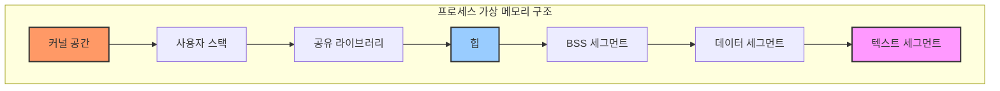

각 세그먼트의 특성:

1. 텍스트 세그먼트 (코드 영역)
   - 실행 가능한 기계어 코드 저장
   - 읽기 전용으로 설정되어 우발적인 수정 방지
   - 공유 가능하여 여러 프로세스가 같은 프로그램 코드 공유 가능

2. 데이터 세그먼트
   - 초기화된 전역 변수와 정적 변수 저장
   - 프로그램 시작 시 해당 값으로 초기화
   - 읽기/쓰기 가능

3. BSS (Block Started by Symbol) 세그먼트
   - 초기화되지 않은 전역 변수와 정적 변수 저장
   - 프로그램 시작 시 0으로 자동 초기화
   - 실행 파일에서 실제 공간을 차지하지 않음

4. 힙 영역
   - 동적 메모리 할당을 위한 영역
   - malloc(), new 등으로 할당
   - 낮은 주소에서 높은 주소 방향으로 증가
   - 메모리 누수와 단편화 관리 필요

5. 공유 라이브러리 영역
   - 동적 라이브러리(.so, .dll 등) 매핑
   - 여러 프로세스가 공유하여 메모리 효율성 증가
   - 위치 독립적 코드(PIC) 사용

6. 스택 영역
   - 함수 호출 정보, 지역 변수 저장
   - LIFO(Last In First Out) 구조
   - 높은 주소에서 낮은 주소 방향으로 증가
   - 스택 오버플로우 주의 필요

### 2. 프로세스 제어 블록(PCB)의 상세 구조

프로세스 제어 블록은 운영체제가 프로세스를 관리하기 위한 모든 정보를 담고 있는 자료구조입니다.

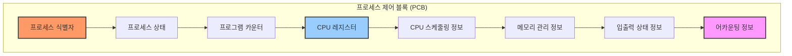

PCB의 주요 구성 요소:

1. 프로세스 식별 정보
   - Process ID (PID)
   - Parent Process ID (PPID)
   - User ID (UID)
   - Group ID (GID)

2. 프로세서 상태 정보
   - 범용 레지스터 값
   - 프로그램 카운터 (PC)
   - 프로그램 상태 워드 (PSW)
   - 스택 포인터 (SP)

3. 프로세스 제어 정보
   - 프로세스 상태
   - 스케줄링 우선순위
   - 스케줄링 관련 정보
   - 이벤트 대기 정보

4. 메모리 관리 정보
   - 베이스 레지스터 값
   - 한계 레지스터 값
   - 페이지 테이블 정보
   - 세그먼트 테이블 정보

### 3. 프로세스 상태 전이의 상세 분석

프로세스의 상태 변화는 특정 이벤트나 스케줄러의 결정에 의해 발생합니다.

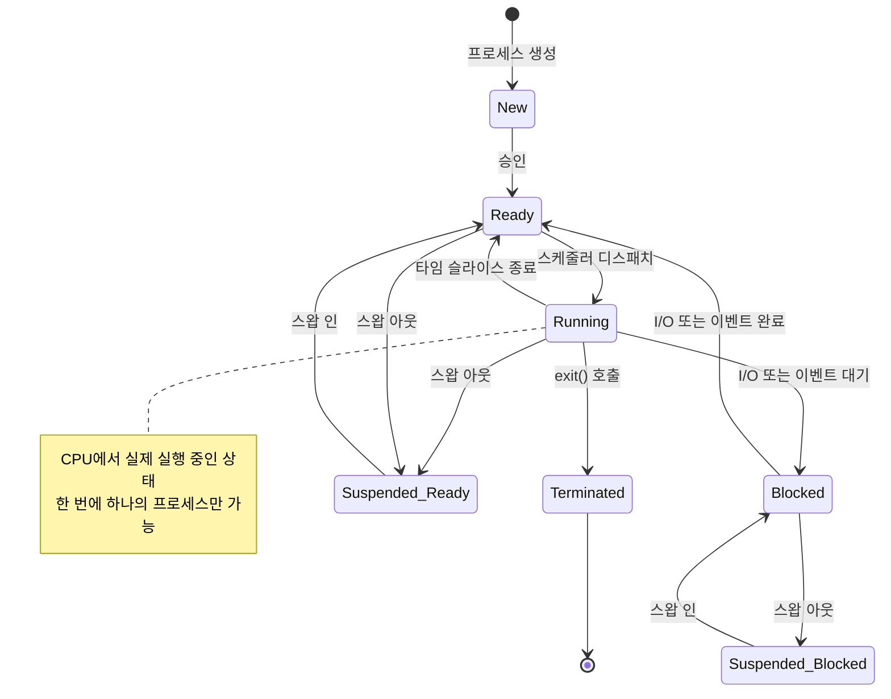

각 상태의 특징:

1. New (생성)
   - 프로세스가 생성된 초기 상태
   - 메모리 할당 및 PCB 생성
   - 초기화 작업 수행

2. Ready (준비)
   - CPU 할당을 기다리는 상태
   - 실행에 필요한 모든 자원을 보유
   - Ready 큐에서 대기

3. Running (실행)
   - CPU를 할당받아 실행 중인 상태
   - 정해진 타임 퀀텀 동안 실행
   - 인터럽트나 시스템 콜 발생 가능

4. Blocked (대기)
   - I/O 완료나 이벤트 발생 대기
   - CPU를 할당받더라도 실행 불가
   - 각각의 대기 큐에서 대기

5. Suspended (중지)
   - 메모리에서 디스크로 스왑 아웃된 상태
   - 메모리 부족 시 발생
   - Ready 또는 Blocked 상태에서 전이

## B. 스레드의 구현과 관리

### 1. 스레드의 상세 구조

스레드는 프로세스 내의 실행 단위로, 독립적인 실행 흐름을 가집니다.

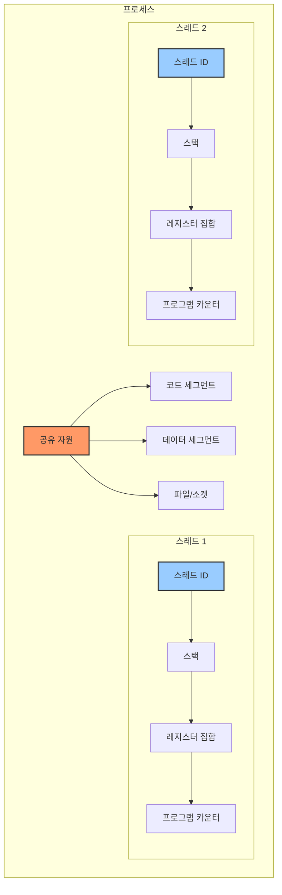

스레드별 독립 자원:
1. 스레드 ID
2. 프로그램 카운터
3. 레지스터 집합
4. 스택
5. 스레드 우선순위
6. 신호 마스크

프로세스 내 공유 자원:
1. 코드 세그먼트
2. 데이터 세그먼트
3. 힙 영역
4. 파일 디스크립터
5. 신호 핸들러
6. 프로세스 관련 정보

### 2. 스레드 구현 모델

#### 2.1 사용자 수준 스레드 (User Level Threads, ULT)

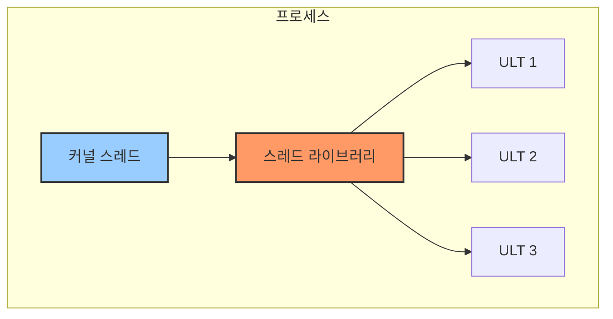

특징:
- 커널의 지원 없이 사용자 공간에서 구현
- 스레드 전환이 빠름
- 한 스레드가 블록되면 전체 프로세스가 블록
- 멀티프로세서 활용 불가

#### 2.2 커널 수준 스레드 (Kernel Level Threads, KLT)

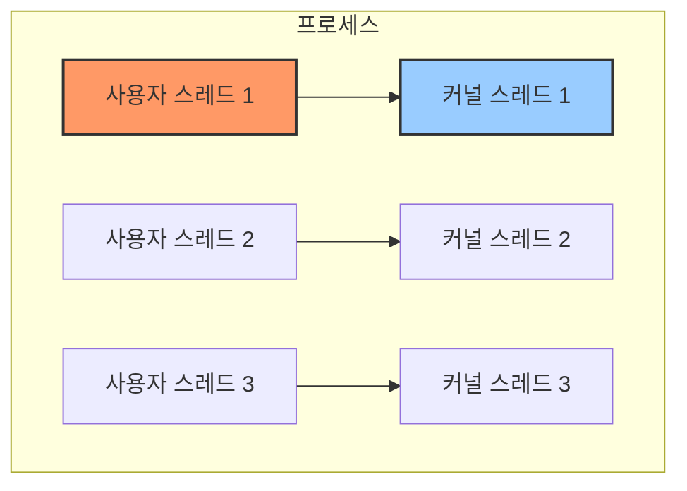

특징:
- 커널이 직접 스레드 관리
- 하나의 스레드가 블록되어도 다른 스레드 실행 가능
- 멀티프로세서 활용 가능
- 문맥 교환 오버헤드가 큼

#### 2.3 혼합형 스레드 (N:M 스레딩 모델)

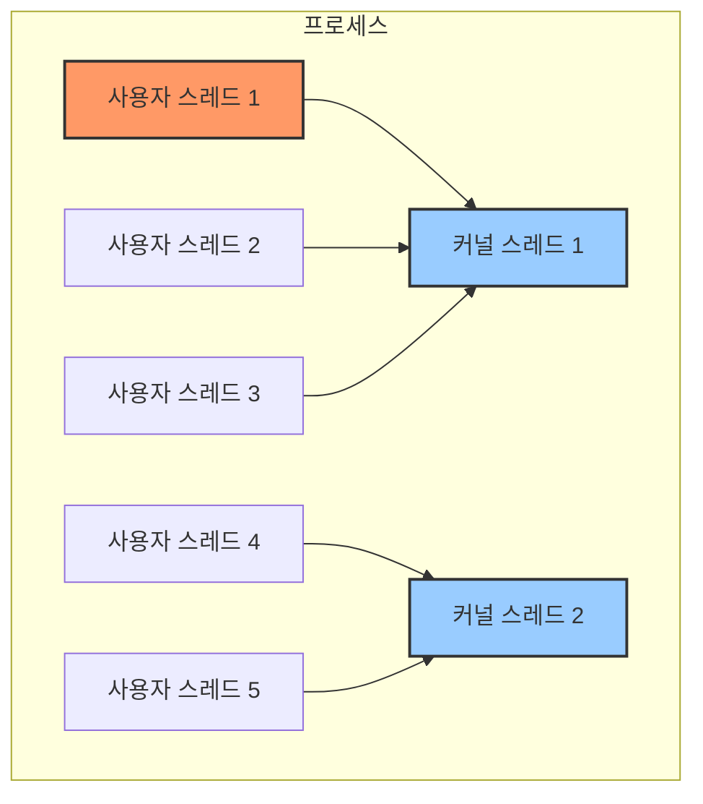

특징:
- 사용자 수준과 커널 수준 스레드 조합
- 유연한 스레드 관리 가능
- 구현이 복잡
- 스케줄링 결정이 두 단계로 발생

### 3. POSIX 스레드 (Pthreads) 구현 예제

```c
#include <pthread.h>
#include <stdio.h>
#include <stdlib.h>

#define NUM_THREADS 5

// 스레드가 실행할 함수
void *thread_function(void *arg) {
    int thread_id = *(int*)arg;
    printf("스레드 %d 시작\n", thread_id);
    
    // 스레드별 작업 수행
    for(int i = 0; i < 5; i++) {
        printf("스레드 %d: 카운트 %d\n", thread_id, i);
        sleep(1);
    }
    
    printf("스레드 %d 종료\n", thread_id);
    pthread_exit(NULL);
}

int main() {
    pthread_t threads[NUM_THREADS];
    int thread_args[NUM_THREADS];
    int result;
    
    // 스레드 생성
    for(int i = 0; i < NUM_THREADS; i++) {
        thread_args[i] = i;
        result = pthread_create(&threads[i], NULL, thread_function, &thread_args[i]);
        if (result) {
            printf("스레드 생성 실패: %d\n", result);
            exit(-1);
        }
    }
    
    // 스레드 종료 대기
    for(int i = 0; i < NUM_THREADS; i++) {
        pthread_join(threads[i], NULL);
    }
    
    printf("모든 스레드 종료\n");
    return 0;
}
```

### 4. 스레드 동기화 메커니즘

```mermaid
graph TD
    subgraph "동기화 기법"
        A[뮤텍스] --> E[기본 동기화]
        B[세마포어] --> E
        C[조건변수] --> F[고급 동기화]
        D[모니터] --> F
        
        subgraph "세부 구현"
            G[스핀락]
            H[읽기-쓰기 락]
            I[배리어]
        end
        
        E --> G & H
        F --> H & I
        
        style A fill:#f96,stroke:#333,stroke-width:2px
        style B fill:#9cf,stroke:#333,stroke-width:2px
        style C fill:#f9f,stroke:#333,stroke-width:2px
        style D fill:#9cf,stroke:#333,stroke-width:2px
    end

### 4.1 뮤텍스 (Mutual Exclusion)

```mermaid
sequenceDiagram
    participant T1 as Thread 1
    participant M as Mutex
    participant T2 as Thread 2
    
    T1->>M: lock()
    Note right of M: Critical Section 진입
    T2->>M: lock() (대기)
    Note right of M: Thread 2 블록
    T1->>M: unlock()
    M->>T2: lock 획득
    Note right of M: Thread 2 진입
    T2->>M: unlock()
```

뮤텍스 구현 예제:
```c
pthread_mutex_t mutex = PTHREAD_MUTEX_INITIALIZER;

void* thread_function(void* arg) {
    pthread_mutex_lock(&mutex);
    // 임계 영역 코드
    pthread_mutex_unlock(&mutex);
    return NULL;
}
```

### 4.2 세마포어 (Semaphore)

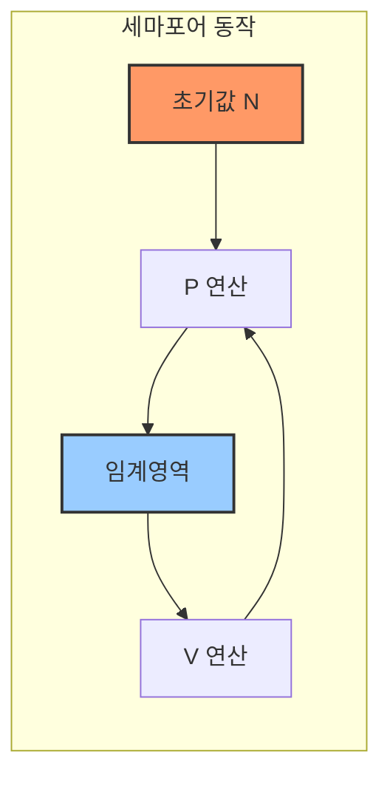

세마포어 구현 예제:
```c
#include <semaphore.h>

sem_t semaphore;

void* thread_function(void* arg) {
    sem_wait(&semaphore);  // P 연산
    // 임계 영역 코드
    sem_post(&semaphore);  // V 연산
    return NULL;
}

int main() {
    sem_init(&semaphore, 0, 1);  // 이진 세마포어 초기화
    // 스레드 생성 및 실행
    sem_destroy(&semaphore);
    return 0;
}
```

### 4.3 조건 변수 (Condition Variables)

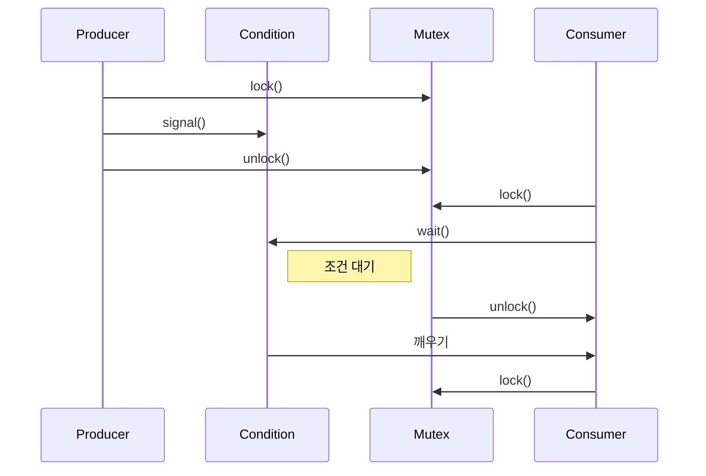

조건 변수 구현 예제:
```c
pthread_mutex_t mutex = PTHREAD_MUTEX_INITIALIZER;
pthread_cond_t cond = PTHREAD_COND_INITIALIZER;
int ready = 0;

void* producer(void* arg) {
    pthread_mutex_lock(&mutex);
    ready = 1;
    pthread_cond_signal(&cond);
    pthread_mutex_unlock(&mutex);
    return NULL;
}

void* consumer(void* arg) {
    pthread_mutex_lock(&mutex);
    while (!ready)
        pthread_cond_wait(&cond, &mutex);
    // 데이터 처리
    pthread_mutex_unlock(&mutex);
    return NULL;
}
```

### 4.4 모니터 (Monitor)

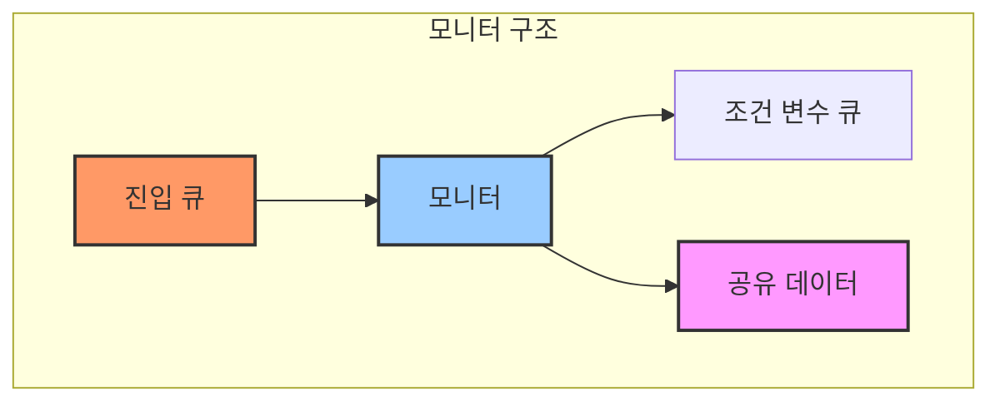

### 4.5 읽기-쓰기 락 (Read-Write Locks)

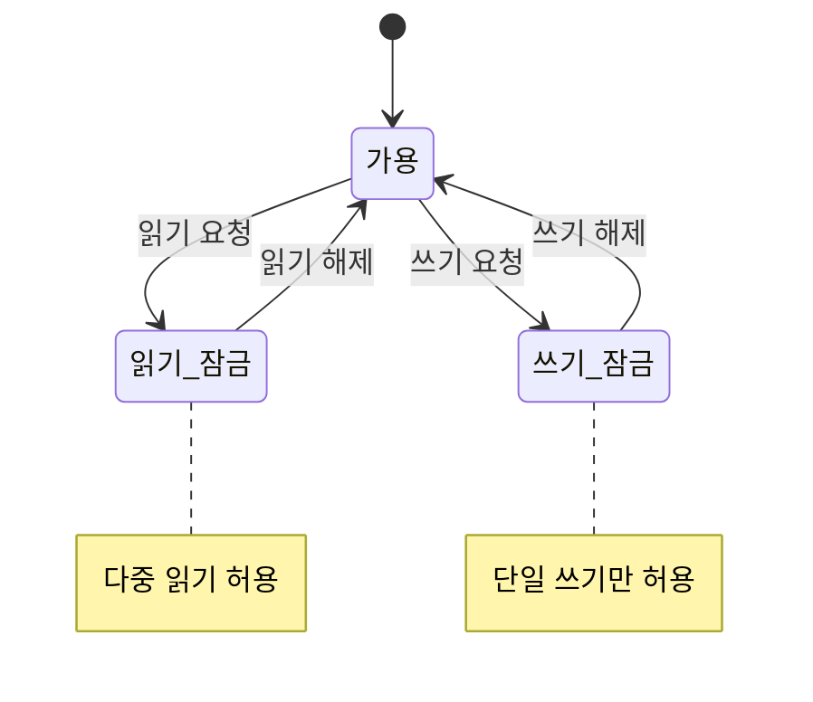

읽기-쓰기 락 구현 예제:
```c
pthread_rwlock_t rwlock = PTHREAD_RWLOCK_INITIALIZER;

void* reader(void* arg) {
    pthread_rwlock_rdlock(&rwlock);
    // 읽기 작업
    pthread_rwlock_unlock(&rwlock);
    return NULL;
}

void* writer(void* arg) {
    pthread_rwlock_wrlock(&rwlock);
    // 쓰기 작업
    pthread_rwlock_unlock(&rwlock);
    return NULL;
}
```

### 4.6 동기화 메커니즘의 활용 사례

#### 생산자-소비자 문제 (Producer-Consumer Problem)

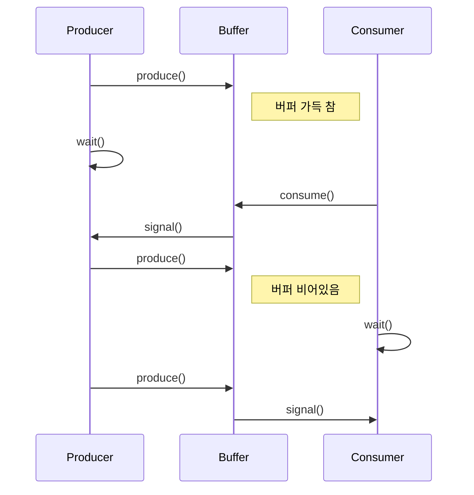

구현 예제:
```c
#define BUFFER_SIZE 5

pthread_mutex_t mutex = PTHREAD_MUTEX_INITIALIZER;
pthread_cond_t full = PTHREAD_COND_INITIALIZER;
pthread_cond_t empty = PTHREAD_COND_INITIALIZER;
int buffer[BUFFER_SIZE];
int count = 0;

void* producer(void* arg) {
    int item;
    while (1) {
        item = produce_item();  // 아이템 생성
        
        pthread_mutex_lock(&mutex);
        while (count == BUFFER_SIZE)
            pthread_cond_wait(&empty, &mutex);
            
        buffer[count++] = item;
        
        pthread_cond_signal(&full);
        pthread_mutex_unlock(&mutex);
    }
    return NULL;
}

void* consumer(void* arg) {
    int item;
    while (1) {
        pthread_mutex_lock(&mutex);
        while (count == 0)
            pthread_cond_wait(&full, &mutex);
            
        item = buffer[--count];
        
        pthread_cond_signal(&empty);
        pthread_mutex_unlock(&mutex);
        
        consume_item(item);  // 아이템 소비
    }
    return NULL;
}
```

#### 철학자 식사 문제 (Dining Philosophers Problem)

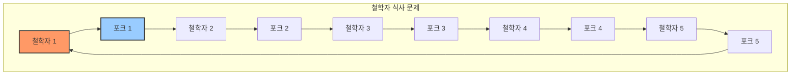

구현 예제:
```c
#define N 5
#define LEFT (i + N - 1) % N
#define RIGHT (i + 1) % N
#define THINKING 0
#define HUNGRY 1
#define EATING 2

pthread_mutex_t mutex = PTHREAD_MUTEX_INITIALIZER;
pthread_cond_t cond[N];
int state[N];

void test(int i) {
    if (state[i] == HUNGRY && 
        state[LEFT] != EATING && 
        state[RIGHT] != EATING) {
        state[i] = EATING;
        pthread_cond_signal(&cond[i]);
    }
}

void take_forks(int i) {
    pthread_mutex_lock(&mutex);
    state[i] = HUNGRY;
    test(i);
    while (state[i] != EATING)
        pthread_cond_wait(&cond[i], &mutex);
    pthread_mutex_unlock(&mutex);
}

void put_forks(int i) {
    pthread_mutex_lock(&mutex);
    state[i] = THINKING;
    test(LEFT);
    test(RIGHT);
    pthread_mutex_unlock(&mutex);
}

void* philosopher(void* arg) {
    int i = *(int*)arg;
    while (1) {
        think();            // 생각하기
        take_forks(i);      // 포크 집기
        eat();              // 식사하기
        put_forks(i);       // 포크 내려놓기
    }
    return NULL;
}
```

### 4.7 동기화 성능 고려사항

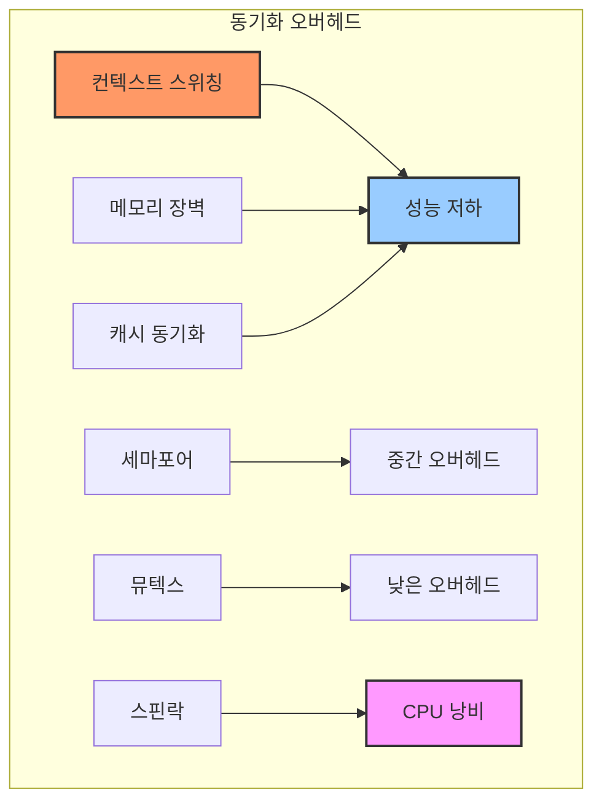

#### 성능 최적화 전략:

1. 락의 범위 최소화
```c
// 나쁜 예
pthread_mutex_lock(&mutex);
compute_data();        // 시간이 오래 걸리는 연산
update_shared_data();
pthread_mutex_unlock(&mutex);

// 좋은 예
compute_data();        // 락 없이 수행
pthread_mutex_lock(&mutex);
update_shared_data();
pthread_mutex_unlock(&mutex);
```

2. 락 분할 (Lock Splitting)
```c
// 단일 락 사용
pthread_mutex_t global_mutex;

// 분할된 락 사용
pthread_mutex_t data1_mutex;
pthread_mutex_t data2_mutex;
```

3. 읽기-쓰기 락 활용
```c
pthread_rwlock_t rwlock = PTHREAD_RWLOCK_INITIALIZER;

// 읽기 작업이 많은 경우 효율적
void* reader(void* arg) {
    pthread_rwlock_rdlock(&rwlock);
    // 다수의 동시 읽기 가능
    pthread_rwlock_unlock(&rwlock);
    return NULL;
}
```

### 4.8 교착상태 (Deadlock) 방지

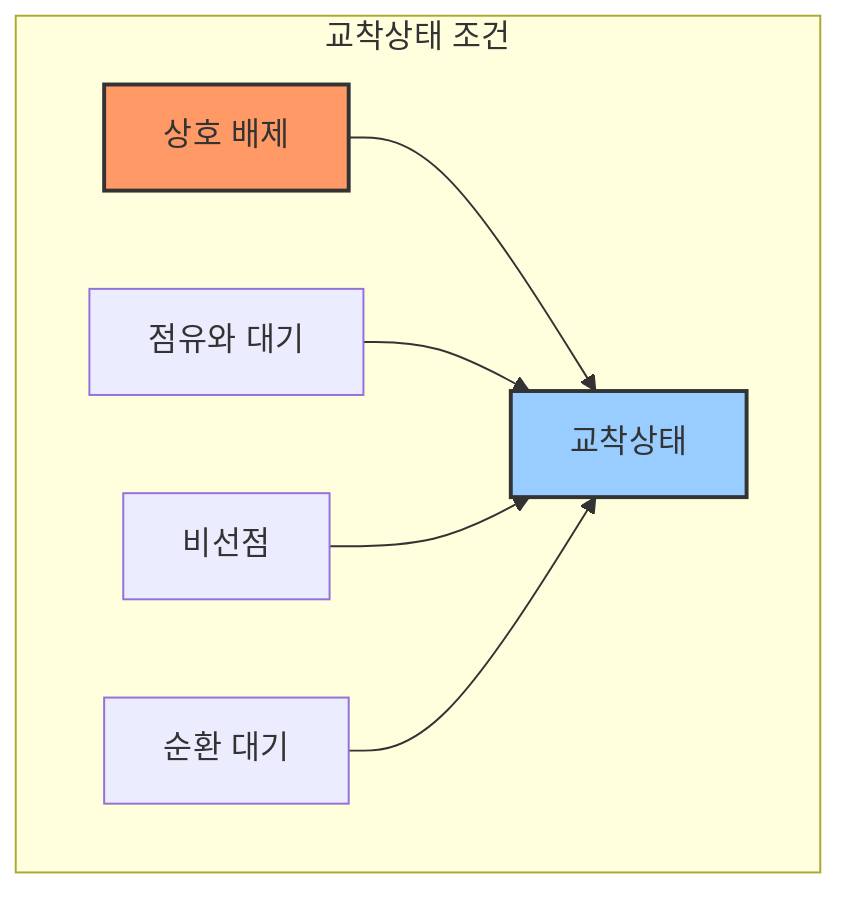

교착상태 방지 예제:
```c
// 잠재적 교착상태
void thread1() {
    pthread_mutex_lock(&mutex1);
    pthread_mutex_lock(&mutex2);
    // 작업 수행
    pthread_mutex_unlock(&mutex2);
    pthread_mutex_unlock(&mutex1);
}

void thread2() {
    pthread_mutex_lock(&mutex2);
    pthread_mutex_lock(&mutex1);
    // 작업 수행
    pthread_mutex_unlock(&mutex1);
    pthread_mutex_unlock(&mutex2);
}

// 교착상태 방지
void thread1() {
    pthread_mutex_lock(&mutex1);
    if (pthread_mutex_trylock(&mutex2) != 0) {
        pthread_mutex_unlock(&mutex1);
        // 재시도 또는 다른 작업 수행
        return;
    }
    // 작업 수행
    pthread_mutex_unlock(&mutex2);
    pthread_mutex_unlock(&mutex1);
}
```

### 4.9 고급 동기화 패턴

#### 배리어 (Barrier)

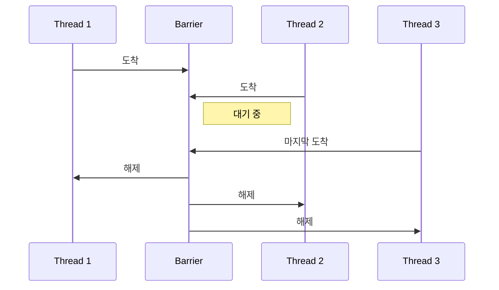

배리어 구현 예제:
```c
pthread_barrier_t barrier;

void* thread_function(void* arg) {
    // Phase 1 작업
    pthread_barrier_wait(&barrier);
    // Phase 2 작업
    return NULL;
}

int main() {
    pthread_barrier_init(&barrier, NULL, NUM_THREADS);
    // 스레드 생성 및 실행
    pthread_barrier_destroy(&barrier);
    return 0;
}
```# 프로세스와 스레드의 심화 이해

## A. 프로세스의 구조와 관리

### 1. 프로세스의 메모리 구조와 세그먼트

프로세스의 메모리 공간은 여러 세그먼트로 구분되며, 각각 고유한 특성과 용도를 가집니다.


각 세그먼트의 특성:

1. 텍스트 세그먼트 (코드 영역)
   - 실행 가능한 기계어 코드 저장
   - 읽기 전용으로 설정되어 우발적인 수정 방지
   - 공유 가능하여 여러 프로세스가 같은 프로그램 코드 공유 가능

2. 데이터 세그먼트
   - 초기화된 전역 변수와 정적 변수 저장
   - 프로그램 시작 시 해당 값으로 초기화
   - 읽기/쓰기 가능

3. BSS (Block Started by Symbol) 세그먼트
   - 초기화되지 않은 전역 변수와 정적 변수 저장
   - 프로그램 시작 시 0으로 자동 초기화
   - 실행 파일에서 실제 공간을 차지하지 않음

4. 힙 영역
   - 동적 메모리 할당을 위한 영역
   - malloc(), new 등으로 할당
   - 낮은 주소에서 높은 주소 방향으로 증가
   - 메모리 누수와 단편화 관리 필요

5. 공유 라이브러리 영역
   - 동적 라이브러리(.so, .dll 등) 매핑
   - 여러 프로세스가 공유하여 메모리 효율성 증가
   - 위치 독립적 코드(PIC) 사용

6. 스택 영역
   - 함수 호출 정보, 지역 변수 저장
   - LIFO(Last In First Out) 구조
   - 높은 주소에서 낮은 주소 방향으로 증가
   - 스택 오버플로우 주의 필요


읽기-쓰기 락 구현 예제:
```c
pthread_rwlock_t rwlock = PTHREAD_RWLOCK_INITIALIZER;

void* reader(void* arg) {
    pthread_rwlock_rdlock(&rwlock);
    // 읽기 작업
    pthread_rwlock_unlock(&rwlock);
    return NULL;
}

void* writer(void* arg) {
    pthread_rwlock_wrlock(&rwlock);
    // 쓰기 작업
    pthread_rwlock_unlock(&rwlock);
    return NULL;
}
```

## C. 현대적 동기화 패턴과 응용

### 1. 비동기 프로그래밍과 동기화

현대 애플리케이션에서는 비동기 프로그래밍이 광범위하게 사용되며, 이에 따른 새로운 동기화 패턴이 등장했습니다.

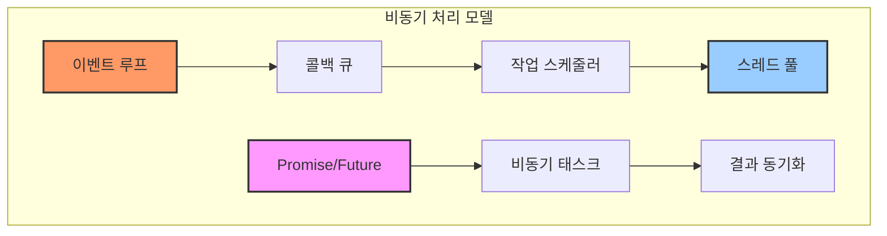

Future/Promise 패턴 구현 예제:
```c
#include <future>
#include <thread>

std::future<int> async_task() {
    std::promise<int> promise;
    std::future<int> future = promise.get_future();
    
    std::thread([promise = std::move(promise)]() mutable {
        // 비동기 작업 수행
        int result = compute_value();
        promise.set_value(result);
    }).detach();
    
    return future;
}

int main() {
    auto future = async_task();
    // 다른 작업 수행
    int result = future.get();  // 결과 대기
    return 0;
}
```

### 2. 락프리(Lock-Free) 프로그래밍

```mermaid
graph TD
    subgraph "락프리 자료구조"
        A[원자적 연산] --> B[CAS]
        B --> C[락프리 큐]
        B --> D[락프리 스택]
        
        E[메모리 순서] --> F[메모리 배리어]
        F --> G[ABA 문제]
        
        style A fill:#f96,stroke:#333,stroke-width:2px
        style B fill:#9cf,stroke:#333,stroke-width:2px
        style G fill:#f9f,stroke:#333,stroke-width:2px
    end
```

락프리 큐 구현 예제:
```c
template<typename T>
class LockFreeQueue {
    struct Node {
        T data;
        std::atomic<Node*> next;
    };
    
    std::atomic<Node*> head;
    std::atomic<Node*> tail;
    
public:
    void enqueue(T value) {
        Node* new_node = new Node{value, nullptr};
        
        while (true) {
            Node* last = tail.load();
            Node* next = last->next.load();
            
            if (last == tail.load()) {
                if (next == nullptr) {
                    if (last->next.compare_exchange_weak(next, new_node)) {
                        tail.compare_exchange_weak(last, new_node);
                        return;
                    }
                } else {
                    tail.compare_exchange_weak(last, next);
                }
            }
        }
    }
};
```

### 3. 메모리 순서와 배리어

```mermaid
sequenceDiagram
    participant CPU1
    participant Memory
    participant CPU2
    
    CPU1->>Memory: Store A
    CPU1->>Memory: Memory Barrier
    CPU1->>Memory: Store B
    
    CPU2->>Memory: Load B
    CPU2->>Memory: Memory Barrier
    CPU2->>Memory: Load A
    
    Note over Memory: 메모리 순서 보장
```

메모리 순서 제어 예제:
```c
std::atomic<bool> ready{false};
std::atomic<int> data{0};

void producer() {
    data.store(42, std::memory_order_release);
    ready.store(true, std::memory_order_release);
}

void consumer() {
    while (!ready.load(std::memory_order_acquire)) {
        std::this_thread::yield();
    }
    assert(data.load(std::memory_order_acquire) == 42);
}
```

### 4. 하이브리드 동기화 기법

현대적인 애플리케이션에서는 여러 동기화 기법을 조합하여 사용합니다.

```mermaid
graph TD
    subgraph "하이브리드 동기화"
        A[세밀한 락킹] --> D[성능 최적화]
        B[락프리 알고리즘] --> D
        C[메모리 배리어] --> D
        
        E[읽기 최적화] --> F[RCU]
        F --> G[성능 향상]
        
        style A fill:#f96,stroke:#333,stroke-width:2px
        style D fill:#9cf,stroke:#333,stroke-width:2px
        style G fill:#f9f,stroke:#333,stroke-width:2px
    end
```

RCU (Read-Copy-Update) 패턴 예제:
```c
struct Data {
    int value;
    std::atomic<Data*> next;
};

std::atomic<Data*> head;

void reader() {
    rcu_read_lock();
    Data* current = head.load();
    // 데이터 읽기
    rcu_read_unlock();
}

void writer(int new_value) {
    Data* old_head = head.load();
    Data* new_head = new Data{new_value, old_head};
    
    // 새 노드로 교체
    head.store(new_head);
    
    // 그레이스 주기 대기
    synchronize_rcu();
    
    // 이전 노드 삭제
    delete old_head;
}
```

### 5. 분산 시스템에서의 동기화

현대의 분산 시스템에서는 네트워크를 통한 동기화가 중요합니다.

```mermaid
graph TD
    subgraph "분산 동기화"
        A[분산 락] --> D[일관성 보장]
        B[합의 알고리즘] --> D
        C[벡터 클럭] --> D
        
        E[Zookeeper] --> F[분산 조정]
        F --> G[서비스 디스커버리]
        
        style A fill:#f96,stroke:#333,stroke-width:2px
        style D fill:#9cf,stroke:#333,stroke-width:2px
        style G fill:#f9f,stroke:#333,stroke-width:2px
    end
```

분산 락 구현 예제:
```c
class DistributedLock {
    ZooKeeper* zk;
    std::string lock_path;
    
public:
    bool acquire() {
        try {
            // 임시 노드 생성
            std::string path = zk->create(
                lock_path + "/lock-",
                "",
                ZOO_EPHEMERAL | ZOO_SEQUENCE
            );
            
            // 가장 작은 시퀀스 번호 확인
            std::vector<std::string> children = zk->getChildren(lock_path);
            std::sort(children.begin(), children.end());
            
            return path == lock_path + "/" + children[0];
        } catch (ZooKeeperException& e) {
            return false;
        }
    }
    
    void release() {
        zk->remove(lock_path);
    }
};
```

### 6. 최신 동기화 트렌드

#### 6.1 트랜잭셔널 메모리

```mermaid
graph TD
    subgraph "트랜잭셔널 메모리"
        A[하드웨어 지원] --> D[원자성 보장]
        B[소프트웨어 구현] --> D
        C[하이브리드 방식] --> D
        
        E[충돌 감지] --> F[롤백]
        F --> G[재시도]
        
        style A fill:#f96,stroke:#333,stroke-width:2px
        style D fill:#9cf,stroke:#333,stroke-width:2px
        style G fill:#f9f,stroke:#333,stroke-width:2px
    end
```

트랜잭셔널 메모리 예제:
```c
#include <atomic>
#include <transaction>

template<typename T>
class TransactionalQueue {
    struct Node {
        T data;
        std::atomic<Node*> next;
    };
    
    std::atomic<Node*> head;
    
public:
    void enqueue(T value) {
        atomic_transaction {
            Node* new_node = new Node{value, head.load()};
            head.store(new_node);
        }
    }
    
    bool dequeue(T& value) {
        atomic_transaction {
            Node* first = head.load();
            if (!first) return false;
            
            value = first->data;
            head.store(first->next);
            delete first;
            return true;
        }
    }
};
```

#### 6.2 동시성 패턴

```mermaid
graph TD
    subgraph "현대적 동시성 패턴"
        A[액터 모델] --> D[메시지 패싱]
        B[코루틴] --> E[비동기 처리]
        C[채널] --> F[통신]
        
        style A fill:#f96,stroke:#333,stroke-width:2px
        style D fill:#9cf,stroke:#333,stroke-width:2px
        style F fill:#f9f,stroke:#333,stroke-width:2px
    end
```

코루틴을 활용한 동기화 예제:
```c
#include <coroutine>
#include <future>

template<typename T>
struct Task {
    struct promise_type {
        T result;
        Task get_return_object() { return Task{this}; }
        std::suspend_never initial_suspend() { return {}; }
        std::suspend_never final_suspend() noexcept { return {}; }
        void return_value(T value) { result = value; }
        void unhandled_exception() { std::terminate(); }
    };
    
    T get_result() { return p->result; }
    
private:
    Task(promise_type* p) : p(p) {}
    promise_type* p;
};

Task<int> async_compute() {
    // 비동기 계산
    co_return 42;
}
```### 4.6 동기화 메커니즘의 활용 사례

#### 생산자-소비자 문제 (Producer-Consumer Problem)

```mermaid
sequenceDiagram
    participant P as Producer
    participant B as Buffer
    participant C as Consumer
    
    P->>B: produce()
    Note right of B: 버퍼 가득 참
    P->>P: wait()
    C->>B: consume()
    B->>P: signal()
    P->>B: produce()
    Note right of B: 버퍼 비어있음
    C->>C: wait()
    P->>B: produce()
    B->>C: signal()
```

구현 예제:
```c
#define BUFFER_SIZE 5

pthread_mutex_t mutex = PTHREAD_MUTEX_INITIALIZER;
pthread_cond_t full = PTHREAD_COND_INITIALIZER;
pthread_cond_t empty = PTHREAD_COND_INITIALIZER;
int buffer[BUFFER_SIZE];
int count = 0;

void* producer(void* arg) {
    int item;
    while (1) {
        item = produce_item();  // 아이템 생성
        
        pthread_mutex_lock(&mutex);
        while (count == BUFFER_SIZE)
            pthread_cond_wait(&empty, &mutex);
            
        buffer[count++] = item;
        
        pthread_cond_signal(&full);
        pthread_mutex_unlock(&mutex);
    }
    return NULL;
}

void* consumer(void* arg) {
    int item;
    while (1) {
        pthread_mutex_lock(&mutex);
        while (count == 0)
            pthread_cond_wait(&full, &mutex);
            
        item = buffer[--count];
        
        pthread_cond_signal(&empty);
        pthread_mutex_unlock(&mutex);
        
        consume_item(item);  // 아이템 소비
    }
    return NULL;
}
```

#### 철학자 식사 문제 (Dining Philosophers Problem)

```mermaid
graph TD
    subgraph "철학자 식사 문제"
        P1[철학자 1] --> F1[포크 1]
        P2[철학자 2] --> F2[포크 2]
        P3[철학자 3] --> F3[포크 3]
        P4[철학자 4] --> F4[포크 4]
        P5[철학자 5] --> F5[포크 5]
        
        F1 --> P2
        F2 --> P3
        F3 --> P4
        F4 --> P5
        F5 --> P1
        
        style P1 fill:#f96,stroke:#333,stroke-width:2px
        style F1 fill:#9cf,stroke:#333,stroke-width:2px
    end
```

구현 예제:
```c
#define N 5
#define LEFT (i + N - 1) % N
#define RIGHT (i + 1) % N
#define THINKING 0
#define HUNGRY 1
#define EATING 2

pthread_mutex_t mutex = PTHREAD_MUTEX_INITIALIZER;
pthread_cond_t cond[N];
int state[N];

void test(int i) {
    if (state[i] == HUNGRY && 
        state[LEFT] != EATING && 
        state[RIGHT] != EATING) {
        state[i] = EATING;
        pthread_cond_signal(&cond[i]);
    }
}

void take_forks(int i) {
    pthread_mutex_lock(&mutex);
    state[i] = HUNGRY;
    test(i);
    while (state[i] != EATING)
        pthread_cond_wait(&cond[i], &mutex);
    pthread_mutex_unlock(&mutex);
}

void put_forks(int i) {
    pthread_mutex_lock(&mutex);
    state[i] = THINKING;
    test(LEFT);
    test(RIGHT);
    pthread_mutex_unlock(&mutex);
}

void* philosopher(void* arg) {
    int i = *(int*)arg;
    while (1) {
        think();            // 생각하기
        take_forks(i);      // 포크 집기
        eat();              // 식사하기
        put_forks(i);       // 포크 내려놓기
    }
    return NULL;
}
```


## D. 동기화 사례 연구 및 최적화 전략

### 1. 대규모 시스템에서의 동기화 전략

대규모 시스템에서는 동기화로 인한 성능 저하를 최소화하면서도 데이터 일관성을 보장해야 합니다.

```mermaid
graph TD
    subgraph "계층적 동기화 전략"
        A[글로벌 락] --> B[도메인 락]
        B --> C[객체 락]
        C --> D[필드 락]
        
        E[동시성 수준] --> F[성능]
        F --> G[오버헤드]
        
        style A fill:#f96,stroke:#333,stroke-width:2px
        style D fill:#9cf,stroke:#333,stroke-width:2px
        style G fill:#f9f,stroke:#333,stroke-width:2px
    end
```

고성능 캐시 시스템 구현 예제:
```c
template<typename K, typename V>
class ConcurrentCache {
private:
    struct Bucket {
        std::shared_mutex mutex;
        std::unordered_map<K, V> data;
    };
    
    std::vector<Bucket> buckets;
    size_t bucket_count;
    
    Bucket& get_bucket(const K& key) {
        size_t hash = std::hash<K>{}(key);
        return buckets[hash % bucket_count];
    }

public:
    ConcurrentCache(size_t num_buckets = 16) 
        : bucket_count(num_buckets), buckets(num_buckets) {}
    
    void put(const K& key, const V& value) {
        Bucket& bucket = get_bucket(key);
        std::unique_lock lock(bucket.mutex);
        bucket.data[key] = value;
    }
    
    std::optional<V> get(const K& key) {
        Bucket& bucket = get_bucket(key);
        std::shared_lock lock(bucket.mutex);
        auto it = bucket.data.find(key);
        if (it != bucket.data.end()) {
            return it->second;
        }
        return std::nullopt;
    }
};
```

### 2. 실시간 시스템에서의 동기화

실시간 시스템에서는 동기화로 인한 지연이 치명적일 수 있으므로, 특별한 전략이 필요합니다.

```mermaid
sequenceDiagram
    participant HT as 고우선순위 태스크
    participant S as 스케줄러
    participant LT as 저우선순위 태스크
    
    HT->>S: 우선순위 상속 요청
    S->>LT: 우선순위 상승
    Note over LT: 임계 영역 처리
    LT->>S: 락 해제
    S->>LT: 원래 우선순위 복원
```

우선순위 상속 뮤텍스 구현:
```c
class PriorityInheritanceMutex {
private:
    std::atomic<bool> locked{false};
    std::atomic<int> owner_priority{-1};
    std::atomic<pthread_t> owner{0};
    std::queue<pthread_t> waiters;
    
public:
    void lock() {
        pthread_t current = pthread_self();
        int current_priority = get_thread_priority(current);
        
        while (true) {
            if (!locked.exchange(true)) {
                owner = current;
                owner_priority = current_priority;
                break;
            }
            
            // 우선순위 상속 처리
            if (current_priority > owner_priority) {
                set_thread_priority(owner, current_priority);
                owner_priority = current_priority;
            }
            
            waiters.push(current);
            pthread_yield();
        }
    }
    
    void unlock() {
        owner = 0;
        owner_priority = -1;
        locked = false;
        
        if (!waiters.empty()) {
            pthread_t next = waiters.front();
            waiters.pop();
            set_thread_priority(next, get_thread_priority(next));
        }
    }
};
```

### 3. 마이크로서비스 환경에서의 동기화

마이크로서비스 아키텍처에서는 분산 동기화가 필수적입니다.

```mermaid
graph TD
    subgraph "마이크로서비스 동기화"
        A[서비스 A] --> D[분산 락 서비스]
        B[서비스 B] --> D
        C[서비스 C] --> D
        
        D --> E[Consensus]
        E --> F[상태 복제]
        
        style A fill:#f96,stroke:#333,stroke-width:2px
        style D fill:#9cf,stroke:#333,stroke-width:2px
        style F fill:#f9f,stroke:#333,stroke-width:2px
    end
```

분산 락 서비스 구현:
```c
class DistributedLockService {
private:
    std::shared_ptr<ConsensusService> consensus;
    std::map<std::string, LockInfo> locks;
    
public:
    bool acquireLock(const std::string& resource, 
                    const std::string& owner,
                    int64_t timeout_ms) {
        // 분산 합의를 통한 락 획득
        LockRequest request{
            .resource = resource,
            .owner = owner,
            .timestamp = getCurrentTimestamp(),
            .timeout = timeout_ms
        };
        
        return consensus->propose(
            createLockProposal(request)
        ).get();
    }
    
    bool releaseLock(const std::string& resource,
                     const std::string& owner) {
        // 락 해제 요청
        ReleaseRequest request{
            .resource = resource,
            .owner = owner
        };
        
        return consensus->propose(
            createReleaseProposal(request)
        ).get();
    }
    
    // 락 상태 감시
    void monitor() {
        for (auto& [resource, info] : locks) {
            if (info.isExpired()) {
                handleExpiredLock(resource);
            }
        }
    }
};
```

### 4. 동기화 성능 모니터링 및 디버깅

동기화 관련 문제를 식별하고 해결하기 위한 모니터링 시스템이 필요합니다.

```mermaid
graph TD
    subgraph "성능 모니터링"
        A[락 경합 탐지] --> D[성능 분석]
        B[데드락 감지] --> D
        C[병목 지점 식별] --> D
        
        E[프로파일링] --> F[최적화]
        F --> G[검증]
        
        style A fill:#f96,stroke:#333,stroke-width:2px
        style D fill:#9cf,stroke:#333,stroke-width:2px
        style G fill:#f9f,stroke:#333,stroke-width:2px
    end
```

락 프로파일러 구현:
```c
class LockProfiler {
private:
    struct LockStats {
        std::atomic<uint64_t> contention_count{0};
        std::atomic<uint64_t> wait_time_us{0};
        std::atomic<uint64_t> hold_time_us{0};
    };
    
    std::unordered_map<void*, LockStats> lock_stats;
    
public:
    void recordContention(void* lock_addr, 
                         uint64_t wait_time_us) {
        auto& stats = lock_stats[lock_addr];
        stats.contention_count++;
        stats.wait_time_us += wait_time_us;
    }
    
    void recordHoldTime(void* lock_addr,
                       uint64_t hold_time_us) {
        lock_stats[lock_addr].hold_time_us += hold_time_us;
    }
    
    std::vector<LockHotspot> getHotspots() {
        std::vector<LockHotspot> hotspots;
        for (const auto& [addr, stats] : lock_stats) {
            if (stats.contention_count > THRESHOLD) {
                hotspots.push_back({
                    .address = addr,
                    .contention = stats.contention_count,
                    .avg_wait = static_cast<double>(stats.wait_time_us) /
                               stats.contention_count
                });
            }
        }
        return hotspots;
    }
};
```

### 5. 최신 하드웨어 기능 활용

현대 프로세서의 하드웨어 동기화 기능을 효과적으로 활용하는 것이 중요합니다.

```mermaid
graph TD
    subgraph "하드웨어 동기화 기능"
        A[원자적 명령어] --> D[HW 트랜잭션]
        B[메모리 배리어] --> D
        C[캐시 일관성] --> D
        
        E[성능 최적화] --> F[리소스 활용]
        
        style A fill:#f96,stroke:#333,stroke-width:2px
        style D fill:#9cf,stroke:#333,stroke-width:2px
        style F fill:#f9f,stroke:#333,stroke-width:2px
    end
```

하드웨어 트랜잭션 메모리 활용 예제:
```c
template<typename T>
class HTMQueue {
private:
    static constexpr int MAX_RETRIES = 3;
    struct Node {
        T data;
        Node* next;
    };
    std::atomic<Node*> head{nullptr};
    
public:
    bool enqueue(const T& value) {
        for (int retry = 0; retry < MAX_RETRIES; ++retry) {
            if (htm_begin() == HTM_SUCCESS) {
                Node* new_node = new Node{value, head.load()};
                head.store(new_node);
                htm_commit();
                return true;
            }
        }
        
        // HTM 실패 시 폴백 경로
        std::lock_guard<std::mutex> lock(fallback_mutex);
        Node* new_node = new Node{value, head.load()};
        head.store(new_node);
        return true;
    }
};
```

이러한 실제 사례와 최적화 전략을 통해 효율적인 동기화 메커니즘을 구현할 수 있습니다. 각 상황에 맞는 적절한 동기화 기법을 선택하고, 성능과 안정성을 모두 고려한 설계가 중요합니다.## C. 현대적 동기화 패턴과 응용


### 6. 최신 동기화 트렌드

#### 6.1 트랜잭셔널 메모리

```mermaid
graph TD
    subgraph "트랜잭셔널 메모리"
        A[하드웨어 지원] --> D[원자성 보장]
        B[소프트웨어 구현] --> D
        C[하이브리드 방식] --> D
        
        E[충돌 감지] --> F[롤백]
        F --> G[재시도]
        
        style A fill:#f96,stroke:#333,stroke-width:2px
        style D fill:#9cf,stroke:#333,stroke-width:2px
        style G fill:#f9f,stroke:#333,stroke-width:2px
    end
```

트랜잭셔널 메모리 예제:
```c
#include <atomic>
#include <transaction>

template<typename T>
class TransactionalQueue {
    struct Node {
        T data;
        std::atomic<Node*> next;
    };
    
    std::atomic<Node*> head;
    
public:
    void enqueue(T value) {
        atomic_transaction {
            Node* new_node = new Node{value, head.load()};
            head.store(new_node);
        }
    }
    
    bool dequeue(T& value) {
        atomic_transaction {
            Node* first = head.load();
            if (!first) return false;
            
            value = first->data;
            head.store(first->next);
            delete first;
            return true;
        }
    }
};
```

#### 6.2 동시성 패턴

```mermaid
graph TD
    subgraph "현대적 동시성 패턴"
        A[액터 모델] --> D[메시지 패싱]
        B[코루틴] --> E[비동기 처리]
        C[채널] --> F[통신]
        
        style A fill:#f96,stroke:#333,stroke-width:2px
        style D fill:#9cf,stroke:#333,stroke-width:2px
        style F fill:#f9f,stroke:#333,stroke-width:2px
    end
```

코루틴을 활용한 동기화 예제:
```c
#include <coroutine>
#include <future>

template<typename T>
struct Task {
    struct promise_type {
        T result;
        Task get_return_object() { return Task{this}; }
        std::suspend_never initial_suspend() { return {}; }
        std::suspend_never final_suspend() noexcept { return {}; }
        void return_value(T value) { result = value; }
        void unhandled_exception() { std::terminate(); }
    };
    
    T get_result() { return p->result; }
    
private:
    Task(promise_type* p) : p(p) {}
    promise_type* p;
};

Task<int> async_compute() {
    // 비동기 계산
    co_return 42;
}
```### 4.6 동기화 메커니즘의 활용 사례

#### 생산자-소비자 문제 (Producer-Consumer Problem)

```mermaid
sequenceDiagram
    participant P as Producer
    participant B as Buffer
    participant C as Consumer
    
    P->>B: produce()
    Note right of B: 버퍼 가득 참
    P->>P: wait()
    C->>B: consume()
    B->>P: signal()
    P->>B: produce()
    Note right of B: 버퍼 비어있음
    C->>C: wait()
    P->>B: produce()
    B->>C: signal()
```

구현 예제:
```c
#define BUFFER_SIZE 5

pthread_mutex_t mutex = PTHREAD_MUTEX_INITIALIZER;
pthread_cond_t full = PTHREAD_COND_INITIALIZER;
pthread_cond_t empty = PTHREAD_COND_INITIALIZER;
int buffer[BUFFER_SIZE];
int count = 0;

void* producer(void* arg) {
    int item;
    while (1) {
        item = produce_item();  // 아이템 생성
        
        pthread_mutex_lock(&mutex);
        while (count == BUFFER_SIZE)
            pthread_cond_wait(&empty, &mutex);
            
        buffer[count++] = item;
        
        pthread_cond_signal(&full);
        pthread_mutex_unlock(&mutex);
    }
    return NULL;
}

void* consumer(void* arg) {
    int item;
    while (1) {
        pthread_mutex_lock(&mutex);
        while (count == 0)
            pthread_cond_wait(&full, &mutex);
            
        item = buffer[--count];
        
        pthread_cond_signal(&empty);
        pthread_mutex_unlock(&mutex);
        
        consume_item(item);  // 아이템 소비
    }
    return NULL;
}
```

#### 철학자 식사 문제 (Dining Philosophers Problem)

```mermaid
graph TD
    subgraph "철학자 식사 문제"
        P1[철학자 1] --> F1[포크 1]
        P2[철학자 2] --> F2[포크 2]
        P3[철학자 3] --> F3[포크 3]
        P4[철학자 4] --> F4[포크 4]
        P5[철학자 5] --> F5[포크 5]
        
        F1 --> P2
        F2 --> P3
        F3 --> P4
        F4 --> P5
        F5 --> P1
        
        style P1 fill:#f96,stroke:#333,stroke-width:2px
        style F1 fill:#9cf,stroke:#333,stroke-width:2px
    end
```

구현 예제:
```c
#define N 5
#define LEFT (i + N - 1) % N
#define RIGHT (i + 1) % N
#define THINKING 0
#define HUNGRY 1
#define EATING 2

pthread_mutex_t mutex = PTHREAD_MUTEX_INITIALIZER;
pthread_cond_t cond[N];
int state[N];

void test(int i) {
    if (state[i] == HUNGRY && 
        state[LEFT] != EATING && 
        state[RIGHT] != EATING) {
        state[i] = EATING;
        pthread_cond_signal(&cond[i]);
    }
}

void take_forks(int i) {
    pthread_mutex_lock(&mutex);
    state[i] = HUNGRY;
    test(i);
    while (state[i] != EATING)
        pthread_cond_wait(&cond[i], &mutex);
    pthread_mutex_unlock(&mutex);
}

void put_forks(int i) {
    pthread_mutex_lock(&mutex);
    state[i] = THINKING;
    test(LEFT);
    test(RIGHT);
    pthread_mutex_unlock(&mutex);
}

void* philosopher(void* arg) {
    int i = *(int*)arg;
    while (1) {
        think();            // 생각하기
        take_forks(i);      // 포크 집기
        eat();              // 식사하기
        put_forks(i);       // 포크 내려놓기
    }
    return NULL;
}
```

## E. 동기화 메커니즘의 미래 전망과 발전 방향

### 1. 새로운 하드웨어 아키텍처와 동기화

현대 컴퓨터 아키텍처의 발전은 동기화 메커니즘에 새로운 가능성을 제시하고 있습니다.

```mermaid
graph TD
    subgraph "차세대 하드웨어 동기화"
        A[양자 컴퓨팅] --> D[새로운 동기화 모델]
        B[뉴로모픽 칩] --> D
        C[광학 컴퓨팅] --> D
        
        E[메모리 중심 컴퓨팅] --> F[데이터 일관성]
        F --> G[성능 최적화]
        
        style A fill:#f96,stroke:#333,stroke-width:2px
        style D fill:#9cf,stroke:#333,stroke-width:2px
        style G fill:#f9f,stroke:#333,stroke-width:2px
    end
```

차세대 메모리 시스템을 위한 동기화 예제:
```c
template<typename T>
class PersistentSynchronization {
private:
    struct alignas(CACHE_LINE_SIZE) Node {
        T data;
        std::atomic<Node*> next;
        PersistenceBarrier barrier;
    };
    
    std::atomic<Node*> head;
    
public:
    void persist_and_sync(const T& value) {
        auto* node = new Node{value, nullptr};
        
        // 영속성 보장을 위한 배리어
        node->barrier.before_persist();
        
        // 원자적 업데이트와 영속성 보장
        Node* old_head = head.load();
        do {
            node->next = old_head;
            node->barrier.persist();
        } while (!head.compare_exchange_weak(old_head, node));
        
        node->barrier.after_persist();
    }
};
```

### 2. AI/ML 시스템에서의 동기화 최적화

AI와 머신러닝 시스템의 특수한 요구사항에 맞춘 동기화 전략이 필요합니다.

```mermaid
graph TD
    subgraph "AI 시스템 동기화"
        A[모델 파라미터 동기화] --> D[분산 학습]
        B[그래디언트 집계] --> D
        C[배치 처리] --> D
        
        E[동기/비동기 학습] --> F[수렴성]
        F --> G[정확도]
        
        style A fill:#f96,stroke:#333,stroke-width:2px
        style D fill:#9cf,stroke:#333,stroke-width:2px
        style G fill:#f9f,stroke:#333,stroke-width:2px
    end
```

분산 학습을 위한 파라미터 서버 구현:
```c
template<typename T>
class ParameterServer {
private:
    struct Parameter {
        T value;
        std::atomic<int> version;
        std::shared_mutex mutex;
    };
    
    std::unordered_map<std::string, Parameter> parameters;
    
public:
    void update_parameter(const std::string& key, 
                         const T& gradient,
                         float learning_rate) {
        auto& param = parameters[key];
        std::unique_lock lock(param.mutex);
        
        // 파라미터 업데이트
        param.value -= learning_rate * gradient;
        param.version++;
        
        // 비동기 브로드캐스트
        broadcast_update(key, param.value, param.version);
    }
    
    T get_parameter(const std::string& key, int& version) {
        auto& param = parameters[key];
        std::shared_lock lock(param.mutex);
        version = param.version;
        return param.value;
    }
};
```

### 3. 양자 컴퓨팅 시대의 동기화

양자 컴퓨팅은 기존의 동기화 패러다임에 새로운 도전과 기회를 제시합니다.

```mermaid
graph TD
    subgraph "양자 동기화"
        A[양자 얽힘] --> D[상태 일관성]
        B[중첩 상태] --> D
        C[양자 오류 정정] --> D
        
        E[고전-양자 인터페이스] --> F[하이브리드 시스템]
        
        style A fill:#f96,stroke:#333,stroke-width:2px
        style D fill:#9cf,stroke:#333,stroke-width:2px
        style F fill:#f9f,stroke:#333,stroke-width:2px
    end
```

하이브리드 양자-고전 동기화 시스템:
```c
class QuantumClassicalSync {
private:
    struct QuantumState {
        std::vector<complex> amplitudes;
        std::atomic<bool> collapsed;
        std::shared_mutex access_mutex;
    };
    
    std::unordered_map<size_t, QuantumState> states;
    
public:
    void update_quantum_state(size_t qubit_id,
                            const std::vector<complex>& new_state) {
        auto& state = states[qubit_id];
        std::unique_lock lock(state.access_mutex);
        
        if (!state.collapsed) {
            state.amplitudes = new_state;
            // 양자 상태 업데이트 후 고전 시스템에 통지
            notify_classical_system(qubit_id);
        }
    }
    
    std::vector<complex> measure_state(size_t qubit_id) {
        auto& state = states[qubit_id];
        std::shared_lock lock(state.access_mutex);
        
        if (!state.collapsed) {
            // 측정 시 상태 붕괴
            collapse_state(state);
        }
        return state.amplitudes;
    }
};
```

### 4. 자율 시스템에서의 동기화

자율 주행 차량이나 로봇과 같은 자율 시스템에서는 실시간성과 안정성이 매우 중요합니다.

```mermaid
graph TD
    subgraph "자율 시스템 동기화"
        A[센서 데이터 동기화] --> D[실시간 처리]
        B[행동 계획] --> D
        C[안전 시스템] --> D
        
        E[분산 제어] --> F[시스템 안정성]
        F --> G[장애 복구]
        
        style A fill:#f96,stroke:#333,stroke-width:2px
        style D fill:#9cf,stroke:#333,stroke-width:2px
        style G fill:#f9f,stroke:#333,stroke-width:2px
    end
```

실시간 센서 데이터 동기화 시스템:
```c
class RealTimeSensorSync {
private:
    struct SensorData {
        std::vector<float> measurements;
        std::chrono::time_point timestamp;
        int sequence_number;
    };
    
    std::priority_queue<SensorData> data_queue;
    std::mutex queue_mutex;
    std::condition_variable data_ready;
    
public:
    void add_sensor_data(const std::vector<float>& data,
                        int sequence_number) {
        std::lock_guard<std::mutex> lock(queue_mutex);
        data_queue.push({
            data,
            std::chrono::steady_clock::now(),
            sequence_number
        });
        data_ready.notify_one();
    }
    
    std::optional<SensorData> get_synchronized_data(
        std::chrono::milliseconds timeout) {
        std::unique_lock<std::mutex> lock(queue_mutex);
        
        if (data_ready.wait_for(lock, timeout,
            [this]() { return !data_queue.empty(); })) {
            auto data = data_queue.top();
            data_queue.pop();
            return data;
        }
        return std::nullopt;
    }
};
```

### 5. 미래 동기화 기술의 과제

앞으로의 동기화 메커니즘은 다음과 같은 과제들을 해결해야 합니다:

```mermaid
graph TD
    subgraph "미래 과제"
        A[에너지 효율성] --> D[지속가능성]
        B[확장성] --> D
        C[보안성] --> D
        
        E[신뢰성] --> F[검증]
        F --> G[표준화]
        
        style A fill:#f96,stroke:#333,stroke-width:2px
        style D fill:#9cf,stroke:#333,stroke-width:2px
        style G fill:#f9f,stroke:#333,stroke-width:2px
    end
```

에너지 효율적인 동기화 메커니즘 예제:
```c
template<typename T>
class EnergyEfficientSync {
private:
    struct State {
        T value;
        std::atomic<int> access_count{0};
        std::atomic<bool> power_save_mode{false};
    };
    
    std::unordered_map<std::string, State> states;
    
public:
    void update_state(const std::string& key,
                     const T& new_value) {
        auto& state = states[key];
        
        // 접근 빈도에 따른 동적 전력 관리
        if (state.access_count.load() < POWER_SAVE_THRESHOLD) {
            state.power_save_mode = true;
            // 저전력 모드에서의 동기화 처리
            handle_power_save_update(state, new_value);
        } else {
            state.power_save_mode = false;
            // 일반 모드에서의 동기화 처리
            handle_normal_update(state, new_value);
        }
        
        state.access_count++;
    }
    
private:
    void handle_power_save_update(State& state,
                                const T& new_value) {
        // 저전력 모드에서의 최적화된 동기화 로직
        if (state.power_save_mode) {
            std::this_thread::sleep_for(
                std::chrono::microseconds(POWER_SAVE_DELAY)
            );
        }
        state.value = new_value;
    }
};
```

### 6. 결론 및 전망

동기화 메커니즘은 계속해서 진화하고 있으며, 새로운 컴퓨팅 패러다임과 함께 더욱 중요해질 것입니다. 미래의 시스템은 더욱 복잡해지고 분산화될 것이므로, 효율적이고 안전한 동기화 메커니즘의 중요성은 더욱 커질 것입니다. 특히 다음과 같은 영역에서 새로운 발전이 예상됩니다:

1. 에너지 효율적인 동기화 메커니즘
2. AI/ML 시스템을 위한 특화된 동기화 전략
3. 양자 컴퓨팅을 고려한 하이브리드 동기화 방식
4. 자율 시스템을 위한 실시간 동기화 기술
5. 보안과 프라이버시를 고려한 동기화 프로토콜

이러한 발전은 소프트웨어 개발자들에게 새로운 도전과 기회를 제공할 것이며, 시스템의 안정성과 성능을 더욱 향상시킬 것입니다.