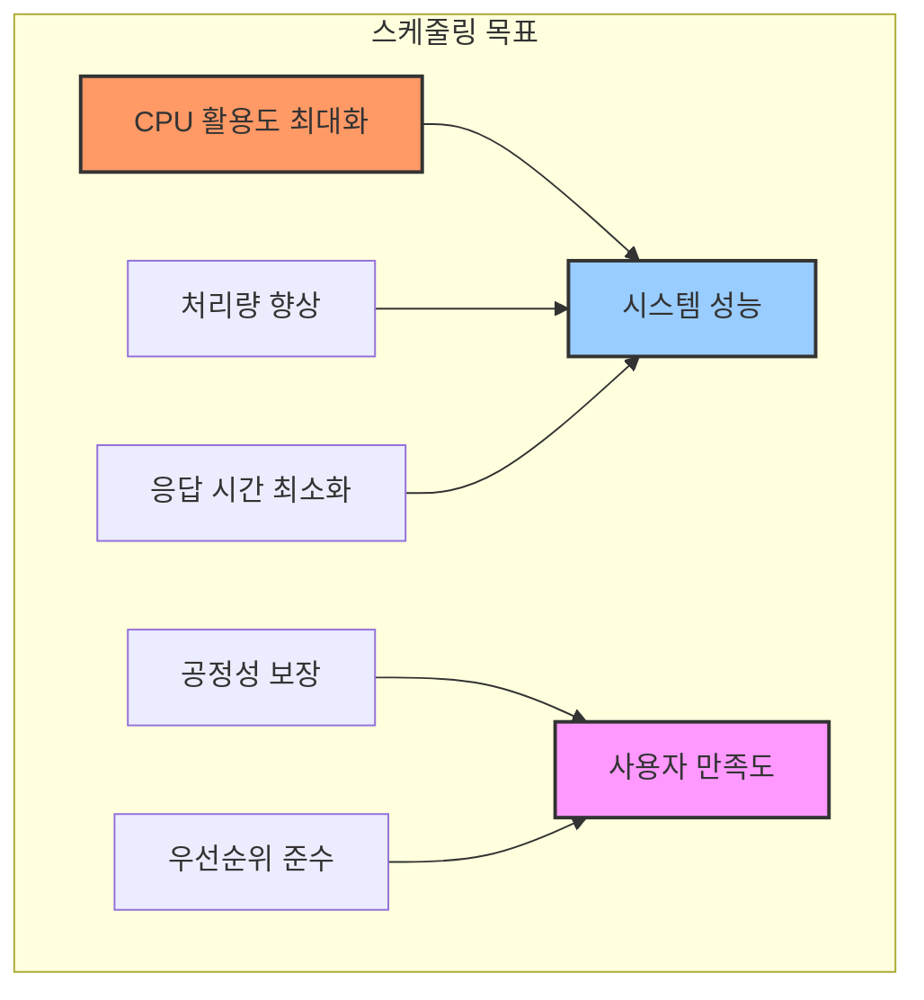
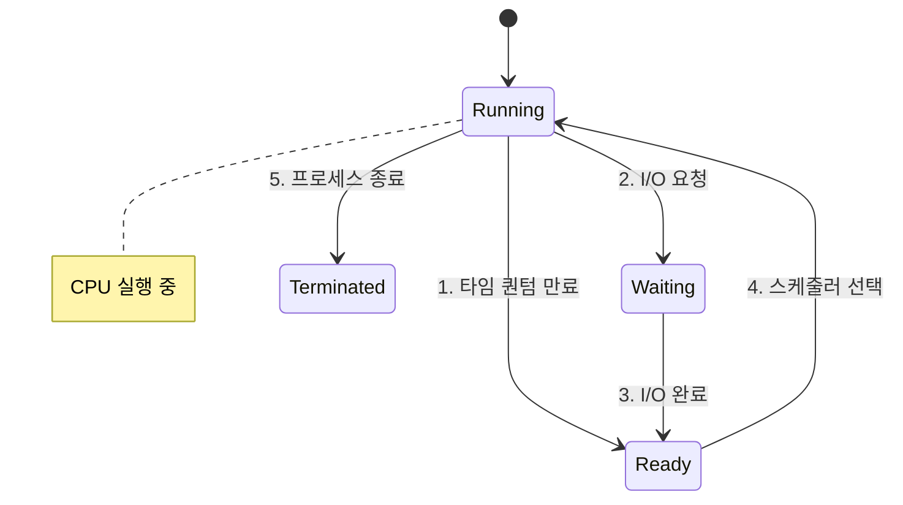
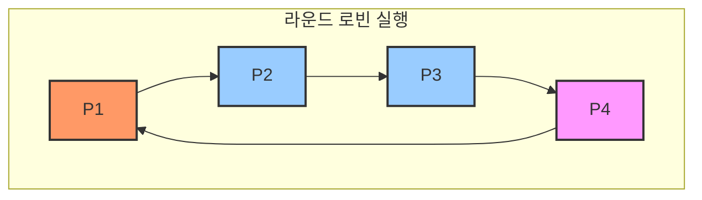
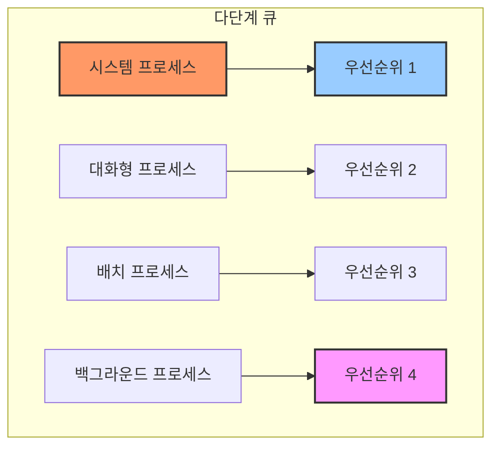
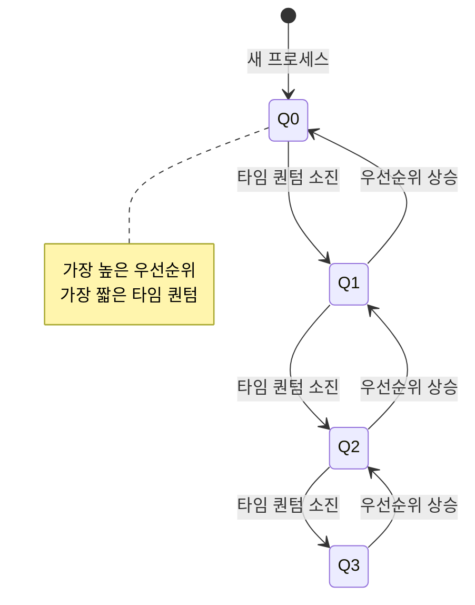
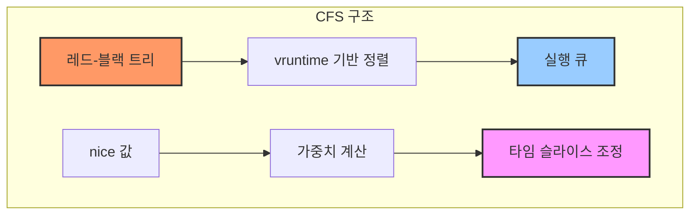
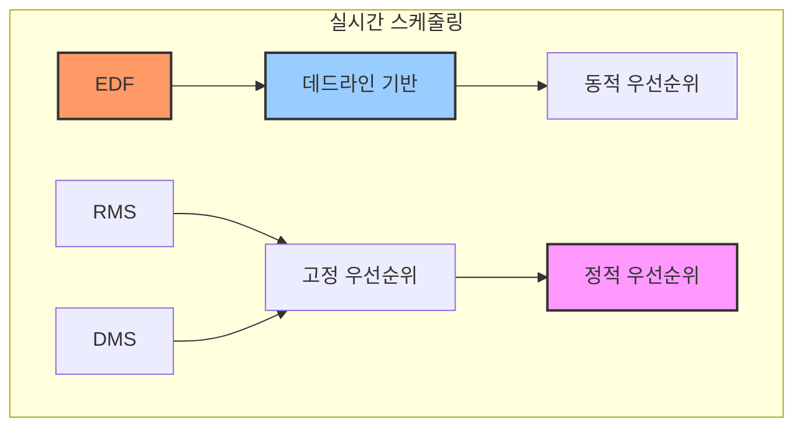
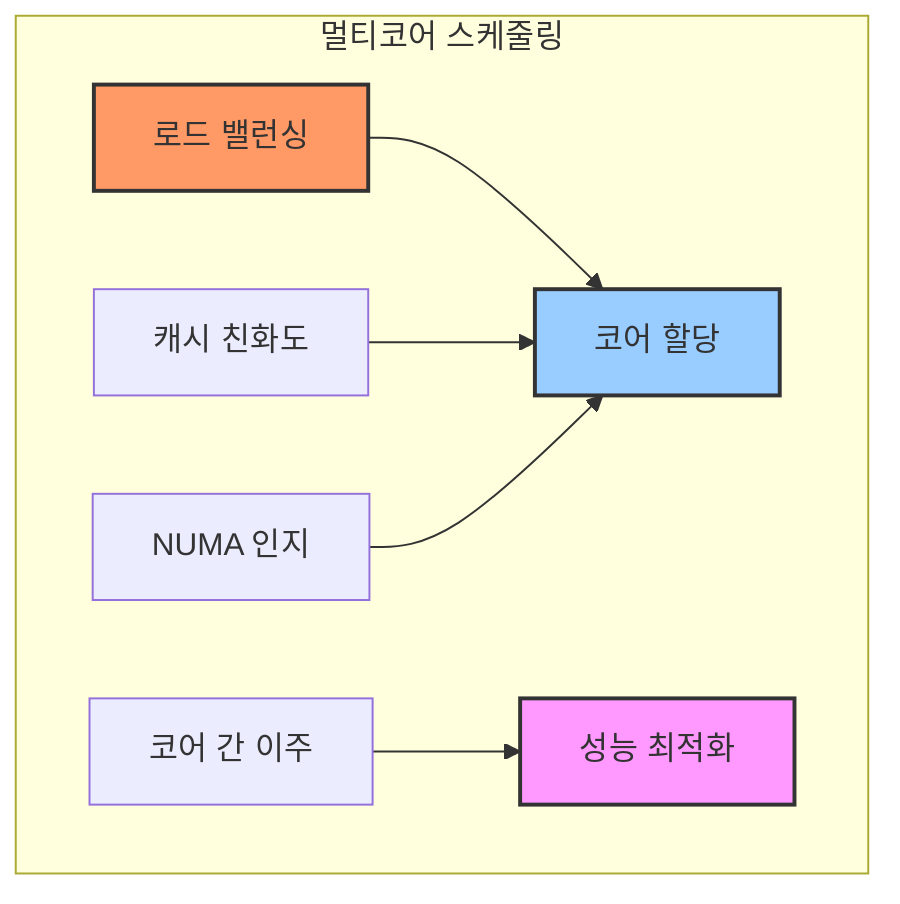

# CPU 스케줄링 (CPU Scheduling)

## A. CPU 스케줄링의 기본 개념

CPU 스케줄링은 운영체제가 프로세스들 간에 CPU 자원을 효율적으로 할당하는 메커니즘입니다. 시스템의 전반적인 성능과 사용자 경험에 직접적인 영향을 미치는 핵심적인 기능입니다.

### 1. 스케줄링의 목표

스케줄링은 다음과 같은 여러 목표를 달성하기 위해 수행됩니다:



### 2. 스케줄링이 발생하는 상황

프로세스 스케줄링은 다음과 같은 상황에서 발생합니다:



### 3. 스케줄링 기준

스케줄링 결정을 내릴 때 고려하는 주요 기준들입니다:

1. CPU 활용도 (CPU Utilization)
   - CPU가 유휴 상태에 있는 시간을 최소화
   - 가능한 한 CPU를 바쁘게 유지

2. 처리량 (Throughput)
   - 단위 시간당 완료되는 프로세스의 수
   - 시스템의 전체적인 작업 처리 능력 측정

3. 총처리 시간 (Turnaround Time)
   - 프로세스가 시작부터 종료까지 걸리는 총 시간
   - 대기 시간과 실행 시간의 합

4. 대기 시간 (Waiting Time)
   - 프로세스가 준비 큐에서 대기하는 시간의 합
   - 짧을수록 좋음

5. 응답 시간 (Response Time)
   - 요청 후 첫 응답이 출력되기까지 걸리는 시간
   - 대화형 시스템에서 특히 중요

## B. 기본 스케줄링 알고리즘

### 1. 선입선출 스케줄링 (FCFS: First-Come, First-Served)

가장 단순한 스케줄링 알고리즘으로, 먼저 도착한 프로세스를 먼저 처리합니다.

```mermaid
gantt
    title FCFS 스케줄링 예시
    dateFormat X
    axisFormat %s
    
    section 프로세스
    P1 :0, 5
    P2 :5, 3
    P3 :8, 4
```



구현 예제:
```c
struct Process {
    int id;
    int arrival_time;
    int burst_time;
    int completion_time;
    int waiting_time;
    int turnaround_time;
};

void fcfs_scheduling(Process processes[], int n) {
    // 도착 시간 순으로 정렬
    sort(processes, processes + n, 
         [](const Process& a, const Process& b) {
             return a.arrival_time < b.arrival_time;
         });
    
    int current_time = 0;
    
    for (int i = 0; i < n; i++) {
        if (current_time < processes[i].arrival_time) {
            current_time = processes[i].arrival_time;
        }
        
        processes[i].waiting_time = 
            current_time - processes[i].arrival_time;
            
        current_time += processes[i].burst_time;
        processes[i].completion_time = current_time;
        
        processes[i].turnaround_time = 
            processes[i].completion_time - 
            processes[i].arrival_time;
    }
}
```

### 2. 최단 작업 우선 스케줄링 (SJF: Shortest Job First)

실행 시간이 가장 짧은 프로세스를 우선적으로 처리하는 알고리즘입니다.

```mermaid
gantt
    title SJF 스케줄링 예시
    dateFormat X
    axisFormat %s
    
    section 프로세스
    P2 (2) :0, 2
    P4 (3) :2, 3
    P1 (4) :5, 4
    P3 (6) :9, 6
```



구현 예제:
```c
void sjf_scheduling(Process processes[], int n) {
    vector<Process> ready_queue;
    int current_time = 0;
    int completed = 0;
    
    while (completed < n) {
        // 현재 시간에 도착한 프로세스들을 레디 큐에 추가
        for (int i = 0; i < n; i++) {
            if (processes[i].arrival_time <= current_time &&
                !processes[i].completed) {
                ready_queue.push_back(processes[i]);
            }
        }
        
        if (ready_queue.empty()) {
            current_time++;
            continue;
        }
        
        // 가장 짧은 실행 시간을 가진 프로세스 선택
        auto shortest = min_element(
            ready_queue.begin(),
            ready_queue.end(),
            [](const Process& a, const Process& b) {
                return a.burst_time < b.burst_time;
            }
        );
        
        Process& current = *shortest;
        current.waiting_time = 
            current_time - current.arrival_time;
        current_time += current.burst_time;
        current.completion_time = current_time;
        current.turnaround_time = 
            current.completion_time - current.arrival_time;
        current.completed = true;
        
        completed++;
        ready_queue.erase(shortest);
    }
}
```

### 3. 라운드 로빈 스케줄링 (Round Robin)

각 프로세스에 동일한 시간 할당량(Time Quantum)을 부여하고 순환하며 실행하는 알고리즘입니다.



구현 예제:
```c
void round_robin_scheduling(Process processes[], 
                          int n, 
                          int time_quantum) {
    queue<Process*> ready_queue;
    int current_time = 0;
    int completed = 0;
    
    // 초기 프로세스들을 큐에 추가
    for (int i = 0; i < n; i++) {
        if (processes[i].arrival_time == 0) {
            ready_queue.push(&processes[i]);
        }
    }
    
    while (completed < n) {
        if (ready_queue.empty()) {
            current_time++;
            // 새로 도착한 프로세스 확인
            for (int i = 0; i < n; i++) {
                if (processes[i].arrival_time == current_time) {
                    ready_queue.push(&processes[i]);
                }
            }
            continue;
        }
        
        Process* current = ready_queue.front();
        ready_queue.pop();
        
        int execution_time = min(time_quantum, 
                               current->remaining_time);
        current->remaining_time -= execution_time;
        current_time += execution_time;
        
        // 새로 도착한 프로세스들 확인
        for (int i = 0; i < n; i++) {
            if (processes[i].arrival_time > current_time - execution_time &&
                processes[i].arrival_time <= current_time) {
                ready_queue.push(&processes[i]);
            }
        }
        
        if (current->remaining_time > 0) {
            ready_queue.push(current);
        } else {
            current->completion_time = current_time;
            current->turnaround_time = 
                current->completion_time - current->arrival_time;
            current->waiting_time = 
                current->turnaround_time - current->burst_time;
            completed++;
        }
    }
}
```

## C. 고급 스케줄링 알고리즘

### 1. 다단계 큐 스케줄링 (Multilevel Queue)

프로세스들을 여러 종류의 큐로 분류하여 각각 다른 스케줄링 알고리즘을 적용합니다.



구현 예제:
```c
class MultilevelQueue {
private:
    vector<queue<Process*>> queues;
    vector<int> priorities;
    vector<int> time_quantums;
    
public:
    MultilevelQueue(int num_levels) 
        : queues(num_levels),
          priorities(num_levels),
          time_quantums(num_levels) {}
    
    void add_process(Process* process, int level) {
        if (level >= 0 && level < queues.size()) {
            queues[level].push(process);
        }
    }
    
    Process* get_next_process() {
        // 높은 우선순위 큐부터 검사
        for (int i = 0; i < queues.size(); i++) {
            if (!queues[i].empty()) {
                Process* process = queues[i].front();
                queues[i].pop();
                return process;
            }
        }
        return nullptr;
    }
    
    void schedule() {
        int current_time = 0;
        
        while (true) {
            Process* current = get_next_process();
            if (!current) break;
            
            int level = current->priority_level;
            int quantum = time_quantums[level];
            
            // 프로세스 실행
            int execution_time = 
                min(quantum, current->remaining_time);
            current->remaining_time -= execution_time;
            current_time += execution_time;
            
            // 남은 시간이 있으면 다음 레벨 큐로 이동
            if (current->remaining_time > 0) {
                int next_level = min(level + 1, 
                                   (int)queues.size() - 1);
                add_process(current, next_level);
            }
        }
    }
};
```

### 2. 다단계 피드백 큐 스케줄링 (Multilevel Feedback Queue)

프로세스의 동작 특성에 따라 큐 간 이동이 가능한 유연한 스케줄링 알고리즘입니다. 각 큐는 서로 다른 우선순위와 시간 할당량을 가지며, 프로세스의 실행 특성에 따라 동적으로 큐를 이동할 수 있습니다.



구현 예제:
```c
class MultilevelFeedbackQueue {
private:
    struct QueueLevel {
        queue<Process*> processes;
        int time_quantum;
        int priority;
    };
    
    vector<QueueLevel> levels;
    int aging_threshold;
    
public:
    MultilevelFeedbackQueue(int num_levels, 
                          int base_quantum,
                          int aging_threshold)
        : levels(num_levels), 
          aging_threshold(aging_threshold) {
        // 각 레벨별 타임 퀀텀 설정 (2의 거듭제곱)
        for (int i = 0; i < num_levels; i++) {
            levels[i].time_quantum = base_quantum * (1 << i);
            levels[i].priority = num_levels - i;
        }
    }
    
    void add_process(Process* process) {
        // 새로운 프로세스는 항상 최상위 큐에 배치
        levels[0].processes.push(process);
        process->current_level = 0;
        process->wait_time = 0;
    }
    
    void schedule() {
        while (true) {
            bool found_process = false;
            
            // 상위 큐부터 차례로 프로세스 탐색
            for (int i = 0; i < levels.size(); i++) {
                auto& level = levels[i];
                
                if (!level.processes.empty()) {
                    Process* current = level.processes.front();
                    level.processes.pop();
                    found_process = true;
                    
                    // 프로세스 실행
                    int executed_time = execute_process(
                        current, 
                        level.time_quantum
                    );
                    
                    if (current->remaining_time > 0) {
                        // 타임 퀀텀을 모두 사용한 경우
                        if (executed_time >= level.time_quantum) {
                            demote_process(current);
                        } else {
                            // I/O나 다른 이벤트로 인한 중단
                            promote_process(current);
                        }
                    }
                    
                    // 에이징 처리
                    handle_aging();
                    break;
                }
            }
            
            if (!found_process) break;
        }
    }
    
private:
    int execute_process(Process* process, int quantum) {
        int execution_time = min(
            process->remaining_time, 
            quantum
        );
        
        process->remaining_time -= execution_time;
        process->wait_time = 0;  // 실행했으므로 대기 시간 초기화
        
        return execution_time;
    }
    
    void promote_process(Process* process) {
        // 상위 큐로 이동 (우선순위 상승)
        int new_level = max(0, process->current_level - 1);
        process->current_level = new_level;
        levels[new_level].processes.push(process);
    }
    
    void demote_process(Process* process) {
        // 하위 큐로 이동 (우선순위 감소)
        int new_level = min(
            (int)levels.size() - 1, 
            process->current_level + 1
        );
        process->current_level = new_level;
        levels[new_level].processes.push(process);
    }
    
    void handle_aging() {
        // 모든 큐의 프로세스들의 대기 시간 증가
        for (auto& level : levels) {
            queue<Process*> temp = level.processes;
            while (!temp.empty()) {
                Process* process = temp.front();
                temp.pop();
                
                process->wait_time++;
                
                // 에이징 임계값을 초과한 경우 상위 큐로 이동
                if (process->wait_time >= aging_threshold) {
                    promote_process(process);
                    process->wait_time = 0;
                } else {
                    level.processes.push(process);
                }
            }
        }
    }
};
```

이 구현의 주요 특징:

1. 우선순위 관리
   - 각 레벨은 서로 다른 우선순위와 시간 할당량을 가짐
   - 상위 큐일수록 높은 우선순위와 짧은 시간 할당량
   - 하위 큐로 갈수록 긴 시간 할당량 부여

2. 동적 큐 이동
   - 프로세스가 시간 할당량을 모두 사용하면 하위 큐로 이동
   - I/O 바운드 프로세스는 상위 큐로 이동 가능
   - 에이징을 통한 기아 상태 방지

3. 에이징 처리
   - 오래 대기한 프로세스의 우선순위를 점진적으로 상승
   - 임계값 이상 대기한 프로세스는 상위 큐로 이동
   - 공정성 보장을 위한 메커니즘

4. 효율적인 실행 관리
   - 상위 큐에 있는 프로세스 우선 실행
   - 시간 할당량은 레벨이 낮아질수록 기하급수적으로 증가
   - 실행 이력에 따른 동적 우선순위 조정

## D. 현대 운영체제의 스케줄러

### 1. 리눅스 CFS (Completely Fair Scheduler)

CFS는 프로세스들 간의 CPU 시간을 공정하게 분배하는 것을 목표로 하는 리눅스의 기본 스케줄러입니다.



CFS 스케줄러 구현 예제:
```c
class CFScheduler {
private:
    struct rb_root tasks_timeline;  // 레드-블랙 트리
    unsigned long min_granularity;  // 최소 실행 단위
    
    // 가중치 테이블 (nice 값에 따른 가중치)
    static const int prio_to_weight[40] = {
        /* -20 */ 88761, 71755, 56483, 46273, 36291,
        /* -15 */ 29154, 23254, 18705, 14949, 11916,
        /* -10 */ 9548,  7620,  6100,  4904,  3906,
        /*  -5 */ 3121,  2501,  1991,  1586,  1277,
        /*   0 */ 1024,  820,   655,   526,   423,
        /*   5 */ 335,   272,   215,   172,   137,
        /*  10 */ 110,   87,    70,    56,    45,
        /*  15 */ 36,    29,    23,    18,    15
    };
    
public:
    CFScheduler(unsigned long granularity) 
        : min_granularity(granularity) {
        tasks_timeline = RB_ROOT;
    }
    
    void enqueue_task(struct task_struct* task) {
        // vruntime 계산
        unsigned long weight = get_task_weight(task);
        task->vruntime += min_granularity * (1024 / weight);
        
        // 레드-블랙 트리에 삽입
        rb_insert(&tasks_timeline, task);
    }
    
    struct task_struct* pick_next_task() {
        // 가장 작은 vruntime을 가진 태스크 선택
        struct rb_node* leftmost = rb_first(&tasks_timeline);
        if (!leftmost)
            return NULL;
            
        return rb_entry(leftmost, struct task_struct, node);
    }
    
    void task_tick(struct task_struct* curr) {
        unsigned long delta_exec;
        unsigned long weight;
        
        // 실행 시간 업데이트
        delta_exec = get_task_delta_exec(curr);
        curr->sum_exec_runtime += delta_exec;
        
        // vruntime 업데이트
        weight = get_task_weight(curr);
        curr->vruntime += delta_exec * (1024 / weight);
        
        // 필요한 경우 재스케줄링
        if (need_resched(curr))
            set_tsk_need_resched(curr);
    }
    
private:
    unsigned long get_task_weight(struct task_struct* task) {
        int nice = task_nice(task);
        return prio_to_weight[nice + 20];
    }
    
    bool need_resched(struct task_struct* task) {
        // 타임 슬라이스 소진 여부 확인
        return task->vruntime > get_min_vruntime() + sched_latency();
    }
    
    unsigned long sched_latency() {
        // 스케줄링 지연시간 계산
        return min_granularity * num_active_tasks();
    }
};
```

### 2. 실시간 스케줄링 (Real-time Scheduling)

실시간 시스템에서는 작업의 데드라인을 보장하는 것이 중요합니다.



EDF(Earliest Deadline First) 스케줄러 구현:
```c
class EDFScheduler {
private:
    struct Task {
        int id;
        chrono::milliseconds period;
        chrono::milliseconds deadline;
        chrono::milliseconds execution_time;
        chrono::steady_clock::time_point next_deadline;
        bool is_periodic;
    };
    
    priority_queue<Task*, vector<Task*>, CompareDeadline> ready_queue;
    vector<Task*> periodic_tasks;
    
public:
    void add_task(Task* task) {
        if (task->is_periodic) {
            task->next_deadline = 
                chrono::steady_clock::now() + task->period;
            periodic_tasks.push_back(task);
        }
        ready_queue.push(task);
    }
    
    void schedule() {
        while (!ready_queue.empty()) {
            auto current_time = chrono::steady_clock::now();
            Task* task = ready_queue.top();
            
            if (task->next_deadline <= current_time) {
                // 데드라인 미스
                handle_deadline_miss(task);
                continue;
            }
            
            // 태스크 실행
            execute_task(task);
            ready_queue.pop();
            
            // 주기적 태스크 재스케줄링
            if (task->is_periodic) {
                task->next_deadline += task->period;
                ready_queue.push(task);
            }
            
            // 새로운 주기적 태스크 확인
            check_periodic_tasks(current_time);
        }
    }
    
private:
    struct CompareDeadline {
        bool operator()(const Task* a, const Task* b) {
            return a->next_deadline > b->next_deadline;
        }
    };
    
    void execute_task(Task* task) {
        // 태스크 실행 시뮬레이션
        this_thread::sleep_for(task->execution_time);
    }
    
    void handle_deadline_miss(Task* task) {
        ready_queue.pop();
        // 데드라인 미스 처리 로직
        cout << "Deadline miss for task " << task->id << endl;
    }
    
    void check_periodic_tasks(
        chrono::steady_clock::time_point current_time) {
        for (auto task : periodic_tasks) {
            if (task->next_deadline <= current_time) {
                task->next_deadline += task->period;
                ready_queue.push(task);
            }
        }
    }
};
```

### 3. 멀티코어 스케줄링

현대의 멀티코어 시스템에서는 코어 간의 부하 분산과 캐시 친화성을 고려한 스케줄링이 필요합니다.



멀티코어 스케줄러 구현:
```c
class MultiCoreScheduler {
private:
    struct Core {
        vector<Process*> run_queue;
        int load;
        int cache_domain;
        int numa_node;
    };
    
    vector<Core> cores;
    int load_imbalance_threshold;
    
public:
    MultiCoreScheduler(int num_cores, 
                      int threshold)
        : cores(num_cores),
          load_imbalance_threshold(threshold) {
        // 코어 정보 초기화
        for (int i = 0; i < num_cores; i++) {
            cores[i].load = 0;
            cores[i].cache_domain = i / 4;  // 4코어당 캐시 도메인
            cores[i].numa_node = i / 8;     // 8코어당 NUMA 노드
        }
    }
    
    void schedule_process(Process* process) {
        // 최적의 코어 선택
        int target_core = select_best_core(process);
        
        // 프로세스 할당
        cores[target_core].run_queue.push_back(process);
        cores[target_core].load += process->weight;
        
        // 필요시 로드 밸런싱 수행
        if (check_load_imbalance())
            balance_load();
    }
    
private:
    int select_best_core(Process* process) {
        int best_core = 0;
        int min_load = INT_MAX;
        
        for (int i = 0; i < cores.size(); i++) {
            // 로드, 캐시 친화도, NUMA 거리를 고려한 점수 계산
            int score = calculate_core_score(i, process);
            
            if (score < min_load) {
                min_load = score;
                best_core = i;
            }
        }
        
        return best_core;
    }
    
    int calculate_core_score(int core_id, Process* process) {
        int score = cores[core_id].load;
        
        // 캐시 친화도 고려
        if (process->last_core != -1) {
            int cache_penalty = 
                (cores[core_id].cache_domain != 
                 cores[process->last_core].cache_domain) 
                ? 100 : 0;
            score += cache_penalty;
        }
        
        // NUMA 거리 고려
        if (process->numa_node != -1) {
            int numa_penalty = 
                abs(cores[core_id].numa_node - 
                    process->numa_node) * 200;
            score += numa_penalty;
        }
        
        return score;
    }
    
    bool check_load_imbalance() {
        int max_load = 0;
        int min_load = INT_MAX;
        
        for (const auto& core : cores) {
            max_load = max(max_load, core.load);
            min_load = min(min_load, core.load);
        }
        
        return (max_load - min_load) > load_imbalance_threshold;
    }
    
    void balance_load() {
        // 가장 부하가 높은 코어에서 가장 낮은 코어로
        // 프로세스 이주
        for (int i = 0; i < cores.size(); i++) {
            for (int j = 0; j < cores.size(); j++) {
                if (cores[i].load - cores[j].load > 
                    load_imbalance_threshold) {
                    migrate_process(i, j);
                }
            }
        }
    }
    
    void migrate_process(int from_core, int to_core) {
        // 가장 적합한 프로세스 선택 및 이주
        auto& queue = cores[from_core].run_queue;
        if (queue.empty()) return;
        
        // 이주할 프로세스 선택
        auto it = min_element(queue.begin(), queue.end(),
            [](const Process* a, const Process* b) {
                return a->weight < b->weight;
            });
            
        Process* process = *it;
        queue.erase(it);
        
        // 새로운 코어에 할당
        cores[to_core].run_queue.push_back(process);
        cores[from_core].load -= process->weight;
        cores[to_core].load += process->weight;
        
        process->last_core = to_core;
    }
};
```

This implementation demonstrates key features of modern multicore scheduling:

1. 로드 밸런싱
   - 코어 간 부하 분산
   - 동적 프로세스 이주
   - 임계값 기반 밸런싱 결정

2. 캐시 친화도
   - 캐시 도메인 고려
   - 프로세스의 이전 실행 코어 추적
   - 불필요한 캐시 미스 최소화

3. NUMA 인지
   - NUMA 노드 거리 계산
   - 메모리 접근 지연 최소화
   - 로컬 메모리 접근 선호

4. 확장성
   - 다양한 코어 구성 지원
   - 유연한 정책 설정
   - 성능 모니터링 및 조정

이러한 멀티코어 스케줄링 기법들은 현대 시스템의 성능과 효율성을 크게 향상시킵니다.