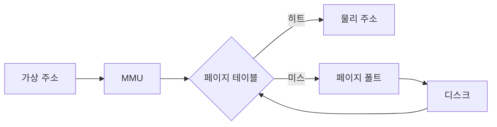
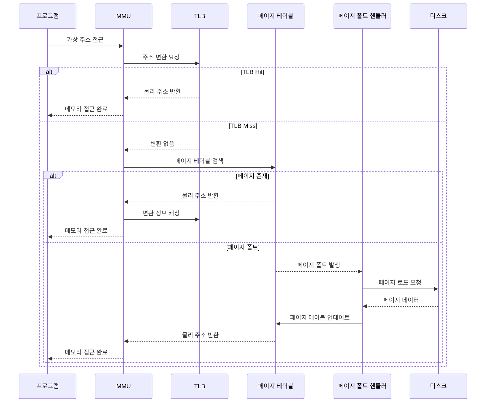
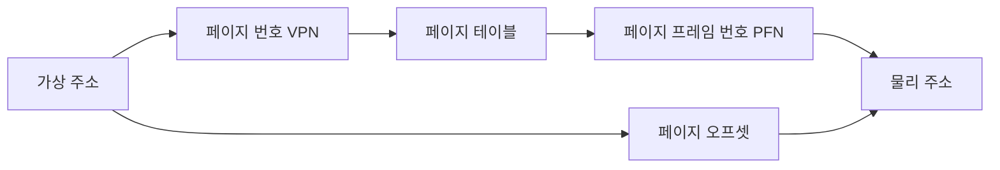
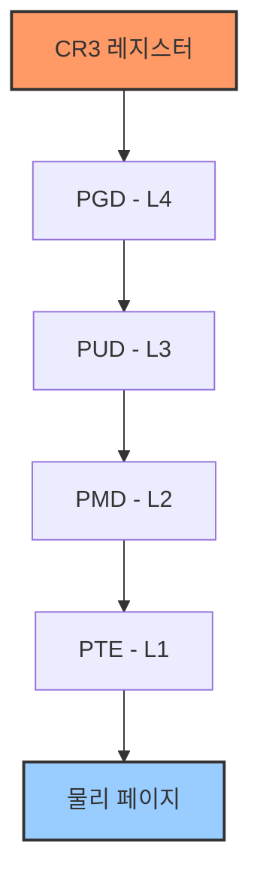
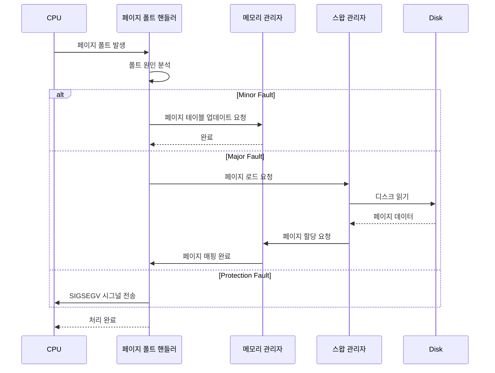
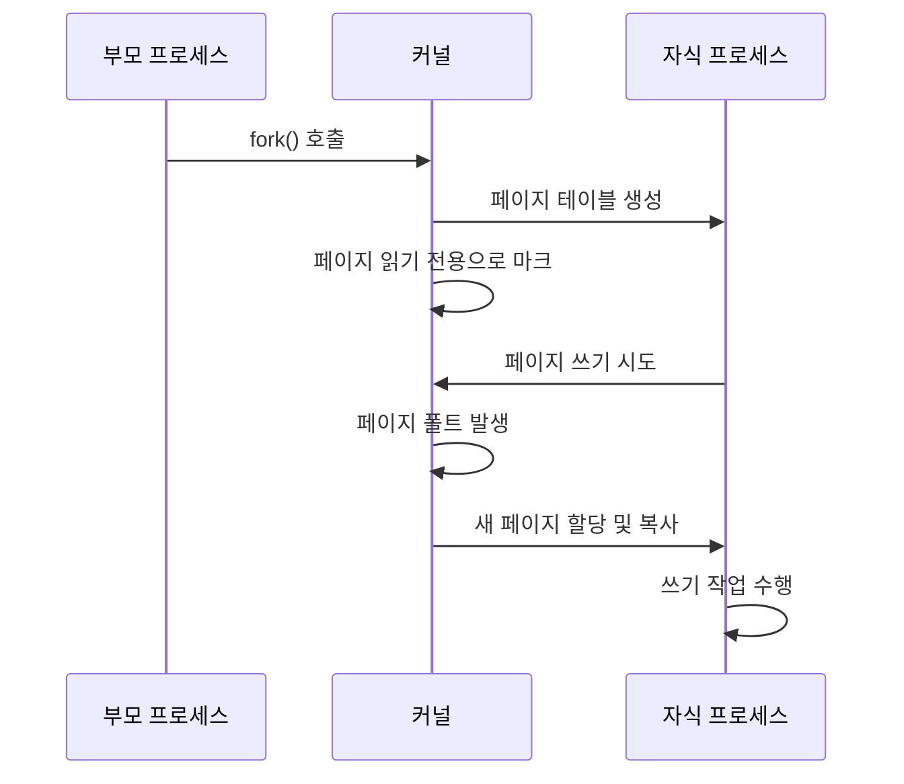

# A. 가상 메모리의 기본 개념

## 1. 가상 메모리의 정의와 필요성

가상 메모리는 물리적 메모리 자원을 추상화하여 프로세스에게 연속적이고 독립적인 메모리 공간을 제공하는 메모리 관리 기법입니다. 이는 현대 운영체제의 핵심 기능 중 하나로, 다음과 같은 중요한 이점을 제공합니다:

### 1.1 메모리 추상화의 이점

1. **더 큰 주소 공간**
   - 프로세스는 실제 물리적 메모리 크기보다 큰 주소 공간을 사용 가능
   - 32비트 시스템에서 4GB, 64비트 시스템에서 수십 TB의 주소 공간 제공
   - 프로그래머가 물리적 메모리 제약을 신경 쓰지 않고 개발 가능

2. **메모리 보호**
   - 각 프로세스는 독립된 주소 공간을 가짐
   - 다른 프로세스의 메모리에 직접 접근 불가능
   - 시스템의 안정성과 보안성 향상

3. **메모리 공유**
   - 동일한 물리적 메모리를 여러 프로세스가 공유 가능
   - 공유 라이브러리 등을 효율적으로 관리
   - 메모리 사용의 효율성 증가

4. **메모리 관리 유연성**
   - 물리적 메모리 위치에 독립적인 프로그램 실행
   - 메모리 재배치와 조각모음 용이
   - 효율적인 메모리 자원 활용

## 2. 주소 변환의 기본 원리

가상 메모리 시스템에서는 프로그램이 사용하는 가상 주소를 물리적 주소로 변환하는 과정이 필요합니다.

### 2.1 주소 변환 과정



1. **가상 주소 구성**
   - 페이지 번호(VPN: Virtual Page Number)
   - 페이지 오프셋(Offset)

2. **물리 주소 구성**
   - 페이지 프레임 번호(PFN: Page Frame Number)
   - 페이지 오프셋(Offset)

3. **주소 변환 수식**
   ```c
   물리주소 = (페이지테이블[VPN] * 페이지크기) + 오프셋
   ```

### 2.2 페이지 테이블 기본 구조

페이지 테이블은 가상 페이지 번호와 물리 페이지 번호 간의 매핑을 저장하는 자료구조입니다.

```c
struct page_table_entry {
    unsigned long pfn : 52;     // 물리 페이지 프레임 번호
    unsigned int present : 1;   // 페이지가 메모리에 있는지 여부
    unsigned int writable : 1;  // 쓰기 가능 여부
    unsigned int user : 1;      // 사용자 모드 접근 가능 여부
    unsigned int dirty : 1;     // 페이지 내용이 변경되었는지 여부
    unsigned int accessed : 1;  // 최근 접근 여부
    unsigned int cache_disabled : 1; // 캐시 사용 여부
    unsigned int reserved : 6;  // 예약된 비트들
};
```

## 3. 가상 메모리 시스템의 주요 구성 요소

가상 메모리 시스템은 하드웨어와 소프트웨어 컴포넌트들의 복잡한 상호작용으로 구현됩니다.

### 3.1 하드웨어 구성 요소

1. **MMU (Memory Management Unit)**
   - 가상 주소를 물리 주소로 변환
   - 페이지 테이블 워크(Page Table Walk) 수행
   - 접근 권한 검사

2. **TLB (Translation Lookaside Buffer)**
   - 최근 주소 변환 결과를 캐싱
   - 주소 변환 속도 향상
   - 하드웨어로 구현된 캐시

3. **페이지 테이블 베이스 레지스터**
   - 현재 프로세스의 페이지 테이블 위치 저장
   - CR3 레지스터(x86 아키텍처)

### 3.2 소프트웨어 구성 요소

1. **페이지 폴트 핸들러**
   ```c
   void page_fault_handler(unsigned long fault_address,
                          unsigned long error_code) {
       struct vm_area_struct *vma;
       struct mm_struct *mm = current->mm;
       
       // 해당 주소가 유효한 VMA에 속하는지 확인
       vma = find_vma(mm, fault_address);
       if (!vma || fault_address < vma->vm_start)
           goto bad_area;
           
       // 접근 권한 검사
       if (!(vma->vm_flags & error_code_to_flags(error_code)))
           goto bad_area;
           
       // 페이지 할당 및 매핑
       handle_mm_fault(mm, vma, fault_address, error_code);
       return;
       
   bad_area:
       do_exit(SIGSEGV);
   }
   ```

2. **메모리 관리자**
   - 물리적 메모리 할당 및 해제
   - 페이지 교체 정책 구현
   - 메모리 매핑 관리

3. **스왑 관리자**
   - 디스크와 메모리 간의 페이지 이동 관리
   - 스왑 공간 할당 및 해제
   - 페이지 입출력 관리

## 4. 가상 메모리의 작동 예시

실제 프로그램 실행 중 가상 메모리 시스템의 작동을 살펴보겠습니다.

### 4.1 프로그램 실행 시나리오



### 4.2 성능 고려사항

1. **TLB 히트율 최적화**
   - 지역성(Locality) 활용
   - 적절한 페이지 크기 선택
   - TLB 항목 개수 고려

2. **페이지 폴트 최소화**
   - 미리 가져오기(Prefetching) 활용
   - 작업 세트(Working Set) 크기 고려
   - 메모리 접근 패턴 최적화

3. **메모리 계층 구조 활용**
   - 캐시 친화적 메모리 접근
   - 페이지 정렬 최적화
   - NUMA 아키텍처 고려

이러한 기본 개념을 바탕으로, 다음 섹션에서는 페이징 시스템의 구체적인 구현과 최적화 방법에 대해 살펴보겠습니다.

---

# B. 페이징 시스템 구조

## 1. 페이징의 기본 구조와 동작 원리

페이징은 가상 메모리를 구현하는 가장 일반적인 방식으로, 메모리를 고정 크기의 블록으로 나누어 관리합니다. 이를 통해 메모리의 효율적인 관리와 보호가 가능해집니다.

### 1.1 페이지와 페이지 프레임

가상 메모리와 물리 메모리는 각각 페이지와 페이지 프레임이라는 동일한 크기의 블록으로 나뉩니다.

```c
// 페이지 구조체 정의
struct page {
    unsigned long flags;           // 페이지 상태 플래그
    atomic_t _refcount;           // 참조 카운트
    struct address_space *mapping; // 매핑 정보
    pgoff_t index;                // 페이지 인덱스
    void *virtual;                // 가상 주소 매핑
    struct list_head lru;         // LRU 리스트 연결
    struct page_pool *pool;       // 메모리 풀 정보
    
    // 페이지 상태에 따른 추가 데이터
    union {
        struct {
            unsigned long private;     // 개인 데이터
            struct address_space *swap;// 스왑 정보
        };
        struct {
            unsigned int slub_frozen;  // SLUB 할당자 상태
            atomic_t slub_freelist;    // 프리리스트 카운트
        };
    };
};
```

페이지 크기는 시스템에 따라 다르며, 일반적으로 다음과 같은 크기가 사용됩니다:
- x86: 4KB (기본), 2MB, 1GB (대형 페이지)
- ARM: 4KB, 16KB, 64KB
- POWER: 4KB, 64KB

### 1.2 주소 변환 메커니즘

가상 주소는 다음과 같은 구성 요소로 나뉩니다:



주소 변환을 위한 비트 조작 연산:

```c
// 페이지 크기와 관련된 상수 정의
#define PAGE_SHIFT      12  // 4KB 페이지 크기
#define PAGE_SIZE       (1UL << PAGE_SHIFT)
#define PAGE_MASK       (~(PAGE_SIZE-1))

// 가상 주소를 페이지 번호와 오프셋으로 분리
static inline unsigned long get_vpn(unsigned long addr) {
    return addr >> PAGE_SHIFT;
}

static inline unsigned long get_offset(unsigned long addr) {
    return addr & ~PAGE_MASK;
}

// 페이지 프레임 번호와 오프셋으로 물리 주소 생성
static inline unsigned long make_physical_address(unsigned long pfn, 
                                                unsigned long offset) {
    return (pfn << PAGE_SHIFT) | offset;
}
```

## 2. 다단계 페이지 테이블

현대 시스템에서는 메모리 사용의 효율성을 위해 다단계 페이지 테이블을 사용합니다.

### 2.1 x86-64의 4단계 페이지 테이블 구조

x86-64 아키텍처는 4단계의 페이지 테이블을 사용하여 48비트 가상 주소를 변환합니다:



각 레벨의 페이지 테이블 구현:

```c
// 페이지 테이블 엔트리 구조체
typedef struct {
    unsigned long pte;
} pte_t;

typedef struct {
    unsigned long pmd;
} pmd_t;

typedef struct {
    unsigned long pud;
} pud_t;

typedef struct {
    unsigned long pgd;
} pgd_t;

// 페이지 테이블 디렉토리 구조체
struct mm_struct {
    pgd_t *pgd;                  // 페이지 글로벌 디렉토리
    atomic_t mm_users;           // 사용자 수
    atomic_t mm_count;           // 참조 카운트
    unsigned long total_vm;      // 전체 페이지 수
    unsigned long data_vm;       // 데이터 영역 페이지 수
    unsigned long stack_vm;      // 스택 영역 페이지 수
    spinlock_t page_table_lock;  // 페이지 테이블 잠금
    struct list_head mmlist;     // mm_struct 리스트
    unsigned long start_code;    // 코드 영역 시작 주소
    unsigned long end_code;      // 코드 영역 끝 주소
    unsigned long start_data;    // 데이터 영역 시작 주소
    unsigned long end_data;      // 데이터 영역 끝 주소
    unsigned long start_brk;     // 힙 영역 시작 주소
    unsigned long brk;           // 힙 영역 현재 끝 주소
    unsigned long start_stack;   // 스택 시작 주소
    unsigned long arg_start;     // 인자 영역 시작 주소
    unsigned long arg_end;       // 인자 영역 끝 주소
    unsigned long env_start;     // 환경 변수 영역 시작 주소
    unsigned long env_end;       // 환경 변수 영역 끝 주소
};
```

### 2.2 페이지 테이블 조작

페이지 테이블의 생성과 관리를 위한 주요 함수들:

```c
// 새로운 페이지 테이블 생성
pgd_t *pgd_alloc(struct mm_struct *mm) {
    pgd_t *pgd;
    
    pgd = (pgd_t *)__get_free_page(GFP_KERNEL | __GFP_ZERO);
    if (!pgd)
        return NULL;
        
    // 커널 페이지 테이블 복사
    memcpy(pgd + KERNEL_PGD_BOUNDARY,
           init_mm.pgd + KERNEL_PGD_BOUNDARY,
           (PTRS_PER_PGD - KERNEL_PGD_BOUNDARY) * sizeof(pgd_t));
           
    return pgd;
}

// 페이지 테이블 엔트리 설정
static inline void set_pte(pte_t *ptep, pte_t pte) {
    *ptep = pte;
    
    if (pte_present(pte)) {
        // MMU에 새로운 매핑 알림
        flush_tlb_page(vma, address);
    }
}

// 페이지 테이블 워크 함수
static inline pte_t *walk_page_table(pgd_t *pgd, unsigned long address) {
    pud_t *pud;
    pmd_t *pmd;
    pte_t *pte;
    
    // PGD 레벨
    if (pgd_none(*pgd))
        return NULL;
    pud = pud_offset(pgd, address);
    
    // PUD 레벨
    if (pud_none(*pud))
        return NULL;
    pmd = pmd_offset(pud, address);
    
    // PMD 레벨
    if (pmd_none(*pmd))
        return NULL;
    pte = pte_offset_kernel(pmd, address);
    
    // PTE 레벨
    if (!pte_present(*pte))
        return NULL;
        
    return pte;
}
```

## 3. TLB (Translation Lookaside Buffer) 관리

TLB는 최근 사용된 페이지 테이블 엔트리를 캐싱하여 주소 변환 성능을 향상시킵니다.

### 3.1 TLB 구조와 동작


TLB 엔트리 구조:

```c
struct tlb_entry {
    unsigned long virtual_page_number;  // 가상 페이지 번호
    unsigned long physical_frame_number;// 물리 프레임 번호
    bool valid;                        // 유효성 비트
    bool dirty;                        // 수정 비트
    bool user;                         // 사용자 접근 비트
    bool write;                        // 쓰기 가능 비트
    unsigned int asid;                 // 주소 공간 식별자
};

// TLB 조작 함수
void flush_tlb_page(struct vm_area_struct *vma, unsigned long addr) {
    // 현재 CPU의 TLB 엔트리 무효화
    __flush_tlb_single(addr);
    
    // 다른 CPU의 TLB도 무효화 (SMP 시스템)
    if (cpus_have_const_cap(X86_FEATURE_PTI))
        __flush_tlb_one_user(addr);
}

// TLB 전체 플러시
void flush_tlb_all(void) {
    // CR3 레지스터를 다시 로드하여 TLB 전체 무효화
    write_cr3(read_cr3());
}
```

### 3.2 TLB 최적화 기법

1. **ASID (Address Space Identifier) 사용**
   ```c
   struct mm_struct {
       // ... 기존 필드들 ...
       atomic64_t asid;          // 주소 공간 식별자
       unsigned short asid_bits;  // ASID 비트 수
   };
   
   // ASID 할당
   void alloc_asid(struct mm_struct *mm) {
       atomic64_t *asid_ptr = &mm->asid;
       unsigned long old_asid = atomic64_read(asid_ptr);
       unsigned long new_asid;
       
       do {
           new_asid = generate_random_asid();
       } while (asid_in_use(new_asid));
       
       atomic64_set(asid_ptr, new_asid);
   }
   ```

2. **대형 페이지 지원**
   ```c
   bool try_to_promote_page(struct page *page) {
       unsigned long addr = page_address(page);
       struct vm_area_struct *vma = find_vma(current->mm, addr);
       
       if (!vma || !can_use_huge_page(vma, addr))
           return false;
           
       // 대형 페이지로 변환
       return promote_to_huge_page(page, vma);
   }
   ```

이러한 페이징 시스템의 구조는 메모리 관리의 효율성과 보안성을 높이는 데 중요한 역할을 합니다. 다음 섹션에서는 페이지 폴트 처리와 관련된 내용을 살펴보겠습니다.

---

# C. 페이지 폴트 처리

## 1. 페이지 폴트의 기본 개념

페이지 폴트는 프로세스가 접근하려는 가상 주소의 페이지가 물리 메모리에 없을 때 발생하는 예외 상황입니다. 운영체제는 이를 감지하고 적절히 처리하여 프로그램의 정상적인 실행을 보장합니다.

### 1.1 페이지 폴트의 종류

페이지 폴트는 발생 원인에 따라 다음과 같이 분류됩니다:

```c
// 페이지 폴트 에러 코드 정의
#define PF_PROT     0x1     // 보호 위반
#define PF_WRITE    0x2     // 쓰기 접근에 의한 폴트
#define PF_USER     0x4     // 사용자 모드에서 발생
#define PF_RSVD     0x8     // 예약된 비트 사용
#define PF_INSTR    0x10    // 명령어 fetch에 의한 폴트

struct fault_info {
    int error_code;         // 에러 코드
    const char *name;       // 폴트 유형 이름
    unsigned long address;  // 폴트 발생 주소
    struct task_struct *tsk;// 폴트 발생 태스크
};
```

1. Minor Fault (경미한 폴트)
   - 페이지가 물리 메모리에 있지만 페이지 테이블에 매핑되지 않은 경우
   - 디스크 접근 없이 페이지 테이블 업데이트만으로 해결

2. Major Fault (주요 폴트)
   - 페이지가 디스크에 있어 물리 메모리로 로드해야 하는 경우
   - 디스크 I/O가 필요하여 처리 시간이 더 오래 걸림

3. Protection Fault (보호 위반 폴트)
   - 접근 권한 위반으로 인한 폴트
   - 일반적으로 프로그램 오류를 의미

## 2. 페이지 폴트 핸들러 구현

페이지 폴트가 발생하면 CPU는 페이지 폴트 핸들러를 호출합니다. 이 핸들러는 폴트의 원인을 분석하고 적절한 조치를 취합니다.

### 2.1 페이지 폴트 처리 과정



### 2.2 페이지 폴트 핸들러 구현

```c
void __do_page_fault(struct pt_regs *regs, unsigned long error_code,
                     unsigned long address)
{
    struct vm_area_struct *vma;
    struct task_struct *tsk;
    struct mm_struct *mm;
    int fault, major = 0;
    unsigned int flags = FAULT_FLAG_DEFAULT;

    tsk = current;
    mm = tsk->mm;

    // 사용자 모드에서 발생한 폴트인지 확인
    if (error_code & PF_USER)
        flags |= FAULT_FLAG_USER;

    // 쓰기 접근에 의한 폴트인지 확인
    if (error_code & PF_WRITE)
        flags |= FAULT_FLAG_WRITE;

    // 해당 주소의 VMA(Virtual Memory Area) 찾기
    vma = find_vma(mm, address);
    if (!vma) {
        // 유효하지 않은 메모리 접근
        bad_area(regs, error_code, address);
        return;
    }

    // VMA 범위 확인
    if (vma->vm_start <= address)
        goto good_area;
    if (!(vma->vm_flags & VM_GROWSDOWN)) {
        bad_area(regs, error_code, address);
        return;
    }

good_area:
    // 접근 권한 확인
    if (check_access_rights(vma, flags) < 0) {
        bad_area_access_error(regs, error_code, address);
        return;
    }

    // 실제 페이지 폴트 처리
    fault = handle_mm_fault(vma, address, flags);

    // 처리 결과에 따른 후속 작업
    if (fault & VM_FAULT_MAJOR)
        major = 1;
    
    if (fault & VM_FAULT_ERROR) {
        if (fault & VM_FAULT_OOM)
            handle_out_of_memory();
        else if (fault & VM_FAULT_SIGBUS)
            do_sigbus(regs, address);
        else if (fault & VM_FAULT_SIGSEGV)
            bad_area_nosemaphore(regs, error_code, address);
    }

    // 페이지 폴트 통계 업데이트
    if (major)
        tsk->maj_flt++;
    else
        tsk->min_flt++;
}
```

### 2.3 메모리 할당 및 스왑

페이지 폴트 처리 과정에서 필요한 메모리 할당과 스왑 관리:

```c
struct page *alloc_and_map_page(struct vm_area_struct *vma,
                               unsigned long address,
                               unsigned int flags)
{
    struct page *page;
    int ret;

    // 새 페이지 할당
    page = alloc_page(GFP_HIGHUSER_MOVABLE);
    if (!page)
        return NULL;

    // 스왑된 페이지인 경우 디스크에서 로드
    if (flags & FAULT_FLAG_SWAP) {
        ret = swap_in_page(vma, address, page);
        if (ret) {
            __free_page(page);
            return NULL;
        }
    }

    // 페이지 매핑
    ret = map_page_into_vma(vma, page, address);
    if (ret) {
        __free_page(page);
        return NULL;
    }

    return page;
}
```

## 3. 최적화 기법

### 3.1 선반입(Prefetching)

페이지 폴트의 빈도를 줄이기 위한 선반입 메커니즘:

```c
struct prefetch_context {
    unsigned long next_addr;    // 다음 예상 주소
    unsigned int window_size;   // 선반입 윈도우 크기
    unsigned int max_pages;     // 최대 선반입 페이지 수
    struct vm_area_struct *vma; // 대상 VMA
};

void prefetch_pages(struct prefetch_context *ctx)
{
    unsigned long addr;
    int nr_pages = 0;

    for (addr = ctx->next_addr;
         addr < ctx->next_addr + (ctx->window_size * PAGE_SIZE);
         addr += PAGE_SIZE) {
        
        if (nr_pages >= ctx->max_pages)
            break;

        // 이미 존재하는 페이지는 건너뛰기
        if (page_exists(ctx->vma, addr))
            continue;

        // 비동기적으로 페이지 로드 시작
        async_prefetch_page(ctx->vma, addr);
        nr_pages++;
    }
}
```

### 3.2 페이지 클러스터링

연관된 페이지들을 함께 처리하여 효율성을 높이는 기법:

```c
struct page_cluster {
    unsigned long base_addr;   // 기준 주소
    unsigned int size;        // 클러스터 크기
    struct page **pages;      // 페이지 배열
    bool contiguous;          // 연속성 여부
};

int handle_page_cluster(struct vm_area_struct *vma,
                       struct page_cluster *cluster)
{
    int i, ret;
    unsigned long addr;

    // 연속된 페이지인 경우 대형 페이지 사용 시도
    if (cluster->contiguous && cluster->size >= HUGE_PAGE_SIZE) {
        ret = try_allocate_huge_page(vma, cluster);
        if (ret == 0)
            return 0;
    }

    // 일반 페이지로 할당
    for (i = 0; i < cluster->size; i++) {
        addr = cluster->base_addr + (i * PAGE_SIZE);
        ret = handle_single_page(vma, addr);
        if (ret)
            goto cleanup;
    }

    return 0;

cleanup:
    // 실패 시 이미 할당된 페이지 정리
    while (--i >= 0) {
        addr = cluster->base_addr + (i * PAGE_SIZE);
        unmap_and_free_page(vma, addr);
    }
    return ret;
}
```

## 4. 성능 모니터링과 디버깅

### 4.1 페이지 폴트 통계

시스템의 페이지 폴트 동작을 모니터링하기 위한 통계 수집:

```c
struct fault_stats {
    atomic64_t minor_faults;    // 경미한 폴트 수
    atomic64_t major_faults;    // 주요 폴트 수
    atomic64_t protection_faults;// 보호 위반 폴트 수
    
    // 시간 관련 통계
    struct {
        u64 min_handling_time;  // 최소 처리 시간
        u64 max_handling_time;  // 최대 처리 시간
        u64 total_handling_time;// 총 처리 시간
        u64 nr_samples;         // 샘플 수
    } timing;
    
    // 위치 관련 통계
    struct {
        unsigned long *fault_addresses; // 폴트 주소 배열
        unsigned int addr_index;        // 현재 인덱스
        unsigned int addr_max;          // 최대 저장 개수
        spinlock_t addr_lock;           // 동기화 락
    } locations;
};

void update_fault_stats(struct fault_stats *stats,
                       int fault_type,
                       u64 handling_time,
                       unsigned long address)
{
    // 폴트 타입별 카운터 업데이트
    switch (fault_type) {
        case FAULT_TYPE_MINOR:
            atomic64_inc(&stats->minor_faults);
            break;
        case FAULT_TYPE_MAJOR:
            atomic64_inc(&stats->major_faults);
            break;
        case FAULT_TYPE_PROTECTION:
            atomic64_inc(&stats->protection_faults);
            break;
    }

    // 시간 통계 업데이트
    spin_lock(&stats->timing_lock);
    stats->timing.min_handling_time = 
        min(stats->timing.min_handling_time, handling_time);
    stats->timing.max_handling_time = 
        max(stats->timing.max_handling_time, handling_time);
    stats->timing.total_handling_time += handling_time;
    stats->timing.nr_samples++;
    spin_unlock(&stats->timing_lock);

    // 주소 기록
    spin_lock(&stats->locations.addr_lock);
    if (stats->locations.addr_index < stats->locations.addr_max) {
        stats->locations.fault_addresses[stats->locations.addr_index++] = 
            address;
    }
    spin_unlock(&stats->locations.addr_lock);
}
```

### 4.2 디버깅 도구

페이지 폴트 관련 문제를 디버깅하기 위한 도구:

```c
struct fault_debugger {
    // 트레이스 설정
    struct {
        bool trace_enabled;          // 트레이스 활성화 여부
        unsigned int trace_depth;    // 콜스택 트레이스 깊이
        struct trace_buffer *buffer; // 트레이스 버퍼
    } trace;
    
    // 브레이크포인트 설정
    struct {
        unsigned long break_address; // 중단점 주소
        bool break_on_write;        // 쓰기 접근 시 중단
        bool break_on_exec;         // 실행 접근 시 중단
    } breakpoint;
    
    // 로깅 설정
    struct {
        int log_level;              // 로깅 레벨
        char *log_buffer;           // 로그 버퍼
        size_t buffer_size;         // 버퍼 크기
        struct mutex log_lock;      // 로깅 동기화
    } logging;
};

void debug_page_fault(struct fault_debugger *debugger,
                     struct pt_regs *regs,
                     unsigned long error_code,
                     unsigned long address)
{
    if (!debugger->trace.trace_enabled)
        return;

    // 스택 트레이스 수집
    struct stack_trace trace = {
        .max_entries = debugger->trace.trace_depth,
        .entries = kmalloc_array(debugger->trace.trace_depth,
                                sizeof(unsigned long),
                                GFP_KERNEL),
        .nr_entries = 0,
        .skip = 0
    };

    save_stack_trace(&trace);

    // 로그 기록
    mutex_lock(&debugger->logging.log_lock);
    
    snprintf(debugger->logging.log_buffer,
             debugger->logging.buffer_size,
             "Page Fault at %016lx, error_code: %lx\n"
             "CPU: %d PID: %d Comm: %s\n",
             address, error_code,
             smp_processor_id(), current->pid, current->comm);

    // 스택 트레이스 로깅
    for (int i = 0; i < trace.nr_entries; i++) {
        char sym[KSYM_SYMBOL_LEN];
        sprint_symbol(sym, trace.entries[i]);
        strlcat(debugger->logging.log_buffer, sym,
                debugger->logging.buffer_size);
        strlcat(debugger->logging.log_buffer, "\n",
                debugger->logging.buffer_size);
    }

    mutex_unlock(&debugger->logging.log_lock);

    // 브레이크포인트 처리
    if (address == debugger->breakpoint.break_address) {
        if ((error_code & PF_WRITE && debugger->breakpoint.break_on_write) ||
            (error_code & PF_INSTR && debugger->breakpoint.break_on_exec)) {
            // 디버거에 제어권 전달
            debug_break_point(regs);
        }
    }

    kfree(trace.entries);
}

// 디버거 초기화 함수
struct fault_debugger *init_fault_debugger(void)
{
    struct fault_debugger *debugger;
    
    debugger = kzalloc(sizeof(*debugger), GFP_KERNEL);
    if (!debugger)
        return NULL;

    // 트레이스 설정
    debugger->trace.trace_enabled = true;
    debugger->trace.trace_depth = DEFAULT_TRACE_DEPTH;
    debugger->trace.buffer = create_trace_buffer();

    // 로깅 설정
    debugger->logging.log_level = DEFAULT_LOG_LEVEL;
    debugger->logging.buffer_size = PAGE_SIZE;
    debugger->logging.log_buffer = kmalloc(PAGE_SIZE, GFP_KERNEL);
    mutex_init(&debugger->logging.log_lock);

    return debugger;
}

// 디버그 정보 출력 함수
void print_debug_info(struct fault_debugger *debugger)
{
    struct vm_area_struct *vma;
    struct mm_struct *mm = current->mm;
    unsigned long address = debugger->breakpoint.break_address;

    printk(KERN_DEBUG "=== Page Fault Debug Information ===\n");

    // VMA 정보 출력
    vma = find_vma(mm, address);
    if (vma) {
        printk(KERN_DEBUG "VMA: %016lx - %016lx flags: %lx\n",
               vma->vm_start, vma->vm_end, vma->vm_flags);
    } else {
        printk(KERN_DEBUG "No VMA found for address %016lx\n", address);
    }

    // 페이지 테이블 정보 출력
    pgd_t *pgd = pgd_offset(mm, address);
    if (pgd_present(*pgd)) {
        p4d_t *p4d = p4d_offset(pgd, address);
        if (p4d_present(*p4d)) {
            pud_t *pud = pud_offset(p4d, address);
            if (pud_present(*pud)) {
                pmd_t *pmd = pmd_offset(pud, address);
                if (pmd_present(*pmd)) {
                    pte_t *pte = pte_offset_kernel(pmd, address);
                    printk(KERN_DEBUG "PTE: %016lx\n", pte_val(*pte));
                }
            }
        }
    }

    // 최근 폴트 이력 출력
    print_fault_history(debugger);
}

// 폴트 이력 출력
void print_fault_history(struct fault_debugger *debugger)
{
    int i;
    spin_lock(&debugger->locations.addr_lock);
    
    printk(KERN_DEBUG "=== Recent Page Fault History ===\n");
    for (i = 0; i < debugger->locations.addr_index; i++) {
        unsigned long addr = debugger->locations.fault_addresses[i];
        printk(KERN_DEBUG "[%d] Address: %016lx\n", i, addr);
    }
    
    spin_unlock(&debugger->locations.addr_lock);
}
```

### 4.3 성능 분석 도구

페이지 폴트로 인한 성능 영향을 분석하기 위한 도구:

```c
struct fault_analyzer {
    // 성능 측정
    struct {
        u64 *latency_samples;      // 지연 시간 샘플
        unsigned int sample_count;  // 샘플 수
        unsigned int max_samples;   // 최대 샘플 수
        spinlock_t sample_lock;     // 샘플 동기화
    } perf;
    
    // 핫스팟 분석
    struct {
        struct rb_root hotspots;    // 핫스팟 트리
        unsigned int threshold;     // 핫스팟 임계값
        spinlock_t hotspot_lock;    // 핫스팟 동기화
    } hotspot;
    
    // 통계 분석
    struct {
        u64 total_faults;          // 전체 폴트 수
        u64 total_latency;         // 전체 지연 시간
        u64 min_latency;           // 최소 지연 시간
        u64 max_latency;           // 최대 지연 시간
        struct mutex stat_lock;     // 통계 동기화
    } stats;
};

// 성능 분석 함수
void analyze_fault_performance(struct fault_analyzer *analyzer,
                             unsigned long address,
                             u64 latency)
{
    spin_lock(&analyzer->perf.sample_lock);
    
    // 지연 시간 샘플 저장
    if (analyzer->perf.sample_count < analyzer->perf.max_samples) {
        analyzer->perf.latency_samples[analyzer->perf.sample_count++] = 
            latency;
    }
    
    spin_unlock(&analyzer->perf.sample_lock);

    // 핫스팟 업데이트
    update_hotspot(analyzer, address);

    // 통계 업데이트
    mutex_lock(&analyzer->stats.stat_lock);
    analyzer->stats.total_faults++;
    analyzer->stats.total_latency += latency;
    analyzer->stats.min_latency = min(analyzer->stats.min_latency, latency);
    analyzer->stats.max_latency = max(analyzer->stats.max_latency, latency);
    mutex_unlock(&analyzer->stats.stat_lock);
}

// 분석 보고서 생성
void generate_fault_report(struct fault_analyzer *analyzer,
                         char *buffer,
                         size_t buffer_size)
{
    mutex_lock(&analyzer->stats.stat_lock);
    
    snprintf(buffer, buffer_size,
             "Page Fault Analysis Report\n"
             "-------------------------\n"
             "Total Faults: %llu\n"
             "Average Latency: %llu ns\n"
             "Min Latency: %llu ns\n"
             "Max Latency: %llu ns\n"
             "\nHotspots:\n",
             analyzer->stats.total_faults,
             analyzer->stats.total_latency / analyzer->stats.total_faults,
             analyzer->stats.min_latency,
             analyzer->stats.max_latency);

    // 핫스팟 정보 추가
    print_hotspots(analyzer, buffer, buffer_size);
    
    mutex_unlock(&analyzer->stats.stat_lock);
}
```

이러한 디버깅 및 성능 분석 도구들은 페이지 폴트 처리 과정에서 발생하는 문제를 진단하고 최적화하는 데 도움을 줍니다. 특히 대규모 시스템에서 메모리 관리 성능을 튜닝할 때 유용하게 활용될 수 있습니다.

---

# D. 메모리 보호와 공유

## 1. 메모리 보호 메커니즘

운영체제는 각 프로세스의 메모리 영역을 보호하고 접근을 제어하여 시스템의 안정성과 보안을 보장합니다. 이를 위해 다양한 하드웨어 및 소프트웨어 메커니즘을 활용합니다.

### 1.1 페이지 수준 보호

페이지 테이블 엔트리(PTE)에서 제공하는 보호 비트를 통해 페이지별 접근 권한을 제어합니다:

```c
struct page_protection {
    unsigned long flags;
    // 기본 보호 비트
    #define _PAGE_PRESENT   0x001    // 페이지가 메모리에 존재
    #define _PAGE_RW       0x002    // 읽기/쓰기 가능
    #define _PAGE_USER     0x004    // 사용자 모드 접근 가능
    #define _PAGE_PWT      0x008    // 페이지 수준 캐시 정책
    #define _PAGE_PCD      0x010    // 캐시 비활성화
    #define _PAGE_ACCESSED 0x020    // 접근 여부 추적
    #define _PAGE_DIRTY    0x040    // 수정 여부 추적
    #define _PAGE_NX       0x8000000000000000UL // 실행 금지
};

// 페이지 보호 설정 함수
int set_page_protection(struct vm_area_struct *vma,
                       unsigned long addr,
                       unsigned long prot)
{
    pgd_t *pgd;
    p4d_t *p4d;
    pud_t *pud;
    pmd_t *pmd;
    pte_t *pte;
    struct mm_struct *mm = vma->vm_mm;
    unsigned long flags = _PAGE_PRESENT;

    // 보호 플래그 설정
    if (prot & PROT_WRITE)
        flags |= _PAGE_RW;
    if (prot & PROT_USER)
        flags |= _PAGE_USER;
    if (!(prot & PROT_EXEC))
        flags |= _PAGE_NX;

    // 페이지 테이블 워크
    pgd = pgd_offset(mm, addr);
    if (!pgd_present(*pgd))
        return -EFAULT;

    p4d = p4d_offset(pgd, addr);
    if (!p4d_present(*p4d))
        return -EFAULT;

    pud = pud_offset(p4d, addr);
    if (!pud_present(*pud))
        return -EFAULT;

    pmd = pmd_offset(pud, addr);
    if (!pmd_present(*pmd))
        return -EFAULT;

    pte = pte_offset_kernel(pmd, addr);
    if (!pte_present(*pte))
        return -EFAULT;

    // PTE 업데이트
    set_pte(pte, pfn_pte(pte_pfn(*pte), __pgprot(flags)));
    flush_tlb_page(vma, addr);

    return 0;
}
```

### 1.2 메모리 영역 보호

프로세스의 가상 메모리 영역(VMA)별로 보호 속성을 관리합니다:

```c
struct vma_protection {
    struct vm_area_struct *vma;
    unsigned long vm_flags;    // VMA 플래그
    struct {
        unsigned int may_exec : 1;   // 실행 가능
        unsigned int may_write : 1;  // 쓰기 가능
        unsigned int may_read : 1;   // 읽기 가능
        unsigned int may_share : 1;  // 공유 가능
        unsigned int locked : 1;     // 메모리 잠금
        unsigned int iomap : 1;      // I/O 매핑
    } permissions;
    struct mutex lock;         // 동기화 락
};

// VMA 보호 설정 함수
int protect_vma_range(struct vma_protection *prot,
                     unsigned long start,
                     unsigned long end,
                     unsigned long newflags)
{
    struct vm_area_struct *vma = prot->vma;
    int error = 0;

    mutex_lock(&prot->lock);

    // 범위 검증
    if (start >= end || start < vma->vm_start || end > vma->vm_end) {
        error = -EINVAL;
        goto out;
    }

    // 권한 변경이 필요한 경우 VMA 분할
    if (start > vma->vm_start) {
        error = split_vma(vma->vm_mm, vma, start, 1);
        if (error)
            goto out;
    }

    if (end < vma->vm_end) {
        error = split_vma(vma->vm_mm, vma, end, 0);
        if (error)
            goto out;
    }

    // 새로운 보호 설정 적용
    vma->vm_flags = newflags;
    vma->vm_page_prot = pgprot_modify(vma->vm_page_prot, newflags);

    // 페이지 테이블 업데이트
    update_page_protection(vma, start, end);

out:
    mutex_unlock(&prot->lock);
    return error;
}
```

## 2. 메모리 공유 메커니즘

### 2.1 Copy-on-Write (COW) 구현

프로세스 fork 시 메모리를 효율적으로 공유하기 위한 COW 메커니즘:



COW 구현 코드:

```c
struct cow_manager {
    struct mm_struct *mm;      // 메모리 관리자
    atomic_t shared_pages;     // 공유 페이지 수
    struct list_head cow_vmas; // COW VMA 리스트
    spinlock_t cow_lock;       // COW 동기화
};

int handle_cow_fault(struct vm_area_struct *vma,
                    unsigned long address,
                    pte_t *page_table)
{
    struct page *old_page, *new_page;
    pte_t entry;
    spinlock_t *ptl;

    // 원본 페이지 획득
    old_page = vm_normal_page(vma, address, *page_table);
    if (!old_page)
        return VM_FAULT_OOM;

    // 새 페이지 할당
    new_page = alloc_page_vma(GFP_HIGHUSER_MOVABLE, vma, address);
    if (!new_page)
        return VM_FAULT_OOM;

    // 페이지 내용 복사
    copy_user_highpage(new_page, old_page, address, vma);

    // 페이지 테이블 업데이트
    entry = mk_pte(new_page, vma->vm_page_prot);
    entry = pte_mkwrite(entry);

    ptl = pte_lockptr(vma->vm_mm, page_table);
    spin_lock(ptl);
    set_pte_at(vma->vm_mm, address, page_table, entry);
    spin_unlock(ptl);

    // 페이지 참조 카운트 조정
    page_add_new_anon_rmap(new_page, vma, address);
    page_remove_rmap(old_page);

    return VM_FAULT_WRITE;
}
```

### 2.2 공유 메모리 구현

프로세스 간 메모리 공유를 위한 시스템:

```c
struct shared_memory {
    key_t key;                  // 공유 메모리 키
    size_t size;               // 공유 영역 크기
    struct list_head attachments; // 연결된 프로세스 목록
    atomic_t ref_count;        // 참조 카운트
    struct mutex shm_lock;     // 동기화 락
    
    // 접근 제어
    struct {
        uid_t uid;             // 소유자 ID
        gid_t gid;             // 그룹 ID
        mode_t mode;           // 접근 모드
    } security;
};

// 공유 메모리 생성
struct shared_memory *create_shared_memory(key_t key,
                                         size_t size,
                                         int flags)
{
    struct shared_memory *shm;
    int error = 0;

    shm = kzalloc(sizeof(*shm), GFP_KERNEL);
    if (!shm)
        return ERR_PTR(-ENOMEM);

    // 기본 초기화
    shm->key = key;
    shm->size = ALIGN(size, PAGE_SIZE);
    INIT_LIST_HEAD(&shm->attachments);
    atomic_set(&shm->ref_count, 1);
    mutex_init(&shm->shm_lock);

    // 보안 설정
    shm->security.uid = current_uid();
    shm->security.gid = current_gid();
    shm->security.mode = flags & 0777;

    // 페이지 할당
    error = allocate_shm_pages(shm);
    if (error) {
        kfree(shm);
        return ERR_PTR(error);
    }

    return shm;
}

// 공유 메모리 연결
int attach_shared_memory(struct shared_memory *shm,
                        struct task_struct *task,
                        unsigned long addr,
                        int flags)
{
    struct vm_area_struct *vma;
    int error;

    // 권한 검사
    if (!can_access_shm(shm, task))
        return -EACCES;

    mutex_lock(&shm->shm_lock);

    // VMA 생성
    vma = kmalloc(sizeof(*vma), GFP_KERNEL);
    if (!vma) {
        error = -ENOMEM;
        goto out_unlock;
    }

    // VMA 설정
    vma->vm_start = addr;
    vma->vm_end = addr + shm->size;
    vma->vm_flags = VM_SHARED | VM_READ;
    if (flags & SHM_WRITE)
        vma->vm_flags |= VM_WRITE;

    // 페이지 테이블 매핑
    error = map_shared_pages(shm, vma);
    if (error) {
        kfree(vma);
        goto out_unlock;
    }

    // 연결 리스트에 추가
    list_add(&vma->shm_list, &shm->attachments);
    atomic_inc(&shm->ref_count);

out_unlock:
    mutex_unlock(&shm->shm_lock);
    return error;
}
```

## 3. 고급 메모리 보호 기법

### 3.1 ASLR (Address Space Layout Randomization)

메모리 레이아웃을 무작위화하여 보안을 강화하는 기법:

```c
struct aslr_config {
    unsigned long stack_offset;    // 스택 오프셋
    unsigned long mmap_offset;     // mmap 영역 오프셋
    unsigned long exec_offset;     // 실행 파일 오프셋
    
    struct {
        unsigned int enabled : 1;      // ASLR 활성화 여부
        unsigned int full_randomize : 1;// 전체 무작위화
        unsigned int stack_limit : 1;   // 스택 제한 사용
    } flags;
};

unsigned long randomize_stack_top(unsigned long stack_top)
{
    unsigned long random_stack;
    
    if (current->flags & PF_RANDOMIZE) {
        random_stack = (get_random_long() & STACK_RND_MASK) << PAGE_SHIFT;
        stack_top -= random_stack;
    }
    
    return PAGE_ALIGN(stack_top);
}
```

### 3.2 격리 도메인 (Isolation Domains)

보안 요구사항이 높은 프로세스를 위한 메모리 격리:

```c
struct isolation_domain {
    unsigned long id;              // 도메인 ID
    struct mm_struct *mm;         // 메모리 관리자
    struct list_head members;     // 도메인 멤버
    
    // 격리 정책
    struct {
        unsigned int no_exec : 1;  // 실행 금지
        unsigned int no_share : 1; // 공유 금지
        unsigned int no_write : 1; // 쓰기 금지
    } policy;
    
    // 보안 컨텍스트
    struct {
        u32 security_level;       // 보안 레벨
        void *security_context;   // 보안 컨텍스트
    } security;
    
    struct mutex domain_lock;     // 도메인 락
};

int create_isolation_domain(struct task_struct *task,
                          unsigned int flags)
{
    struct isolation_domain *domain;
    int error;

    domain = kzalloc(sizeof(*domain), GFP_KERNEL);
    if (!domain)
        return -ENOMEM;

    // 도메인 초기화
    domain->id = get_random_u64();
    domain->mm = task->mm;
    INIT_LIST_HEAD(&domain->members);
    mutex_init(&domain->domain_lock);

    // 정책 설정
    if (flags & ISOL_NO_EXEC)
        domain->policy.no_exec = 1;
    if (flags & ISOL_NO_SHARE)
        domain->policy.no_share = 1;
    if (flags & ISOL_NO_WRITE)
        domain->policy.no_write = 1;

    // 보안 컨텍스트 초기화
    error = init_security_context(domain);
    if (error)
        goto out_free;

    // 초기 멤버 추가
    error = add_domain_member(domain, task);
    if (error)
        goto out_security;

    // 도메인 정책 적용
    error = apply_domain_policy(domain);
    if (error)
        goto out_member;

    return 0;

out_member:
    remove_domain_member(domain, task);
out_security:
    cleanup_security_context(domain);
out_free:
    kfree(domain);
    return error;
}

// 도메인 멤버 관리
int add_domain_member(struct isolation_domain *domain,
                     struct task_struct *task)
{
    struct domain_member *member;
    int error;

    member = kzalloc(sizeof(*member), GFP_KERNEL);
    if (!member)
        return -ENOMEM;

    member->task = task;
    member->join_time = ktime_get_real();

    mutex_lock(&domain->domain_lock);

    // 멤버 추가 가능 여부 검사
    if (!can_join_domain(domain, task)) {
        error = -EPERM;
        goto out_unlock;
    }

    // 메모리 매핑 조정
    error = adjust_memory_mappings(domain, task);
    if (error)
        goto out_unlock;

    // 리스트에 추가
    list_add(&member->node, &domain->members);
    task->isolation_domain = domain;

    mutex_unlock(&domain->domain_lock);
    return 0;

out_unlock:
    mutex_unlock(&domain->domain_lock);
    kfree(member);
    return error;
}

// 도메인 정책 적용
int apply_domain_policy(struct isolation_domain *domain)
{
    struct domain_member *member;
    int error;

    mutex_lock(&domain->domain_lock);

    // 모든 멤버에 대해 정책 적용
    list_for_each_entry(member, &domain->members, node) {
        // 실행 권한 제어
        if (domain->policy.no_exec) {
            error = disable_exec_mappings(member->task);
            if (error)
                goto out_unlock;
        }

        // 공유 메모리 제어
        if (domain->policy.no_share) {
            error = disable_shared_mappings(member->task);
            if (error)
                goto out_unlock;
        }

        // 쓰기 권한 제어
        if (domain->policy.no_write) {
            error = make_mappings_readonly(member->task);
            if (error)
                goto out_unlock;
        }
    }

    mutex_unlock(&domain->domain_lock);
    return 0;

out_unlock:
    mutex_unlock(&domain->domain_lock);
    return error;
}

// 메모리 매핑 조정
static int adjust_memory_mappings(struct isolation_domain *domain,
                                struct task_struct *task)
{
    struct vm_area_struct *vma;
    unsigned long flags;

    // 모든 VMA 순회
    for (vma = task->mm->mmap; vma; vma = vma->vm_next) {
        flags = vma->vm_flags;

        // 정책에 따른 플래그 조정
        if (domain->policy.no_exec)
            flags &= ~VM_EXEC;
        if (domain->policy.no_share)
            flags &= ~VM_SHARED;
        if (domain->policy.no_write)
            flags &= ~VM_WRITE;

        // 변경된 플래그 적용
        if (flags != vma->vm_flags) {
            int error = change_protection(vma, flags);
            if (error)
                return error;
        }
    }

    return 0;
}

// 보안 컨텍스트 관리
struct security_context {
    u32 level;                 // 보안 레벨
    struct crypto_shash *hash; // 무결성 검사
    void *audit_data;         // 감사 데이터
    struct mutex ctx_lock;     // 컨텍스트 락
};

static int init_security_context(struct isolation_domain *domain)
{
    struct security_context *ctx;

    ctx = kzalloc(sizeof(*ctx), GFP_KERNEL);
    if (!ctx)
        return -ENOMEM;

    // 보안 레벨 설정
    ctx->level = determine_security_level(domain);
    
    // 무결성 검사 초기화
    ctx->hash = crypto_alloc_shash("sha256", 0, 0);
    if (IS_ERR(ctx->hash)) {
        kfree(ctx);
        return PTR_ERR(ctx->hash);
    }

    // 감사 시스템 설정
    if (init_audit_context(ctx) < 0) {
        crypto_free_shash(ctx->hash);
        kfree(ctx);
        return -EINVAL;
    }

    mutex_init(&ctx->ctx_lock);
    domain->security.security_context = ctx;
    domain->security.security_level = ctx->level;

    return 0;
}

// 도메인 모니터링
void monitor_domain_activity(struct isolation_domain *domain)
{
    struct domain_member *member;
    unsigned long flags;

    spin_lock_irqsave(&domain->domain_lock, flags);

    list_for_each_entry(member, &domain->members, node) {
        // 메모리 접근 패턴 모니터링
        check_memory_access_patterns(member);
        
        // 정책 위반 검사
        if (detect_policy_violations(member)) {
            handle_violation(domain, member);
        }
        
        // 리소스 사용량 추적
        update_resource_usage(member);
    }

    spin_unlock_irqrestore(&domain->domain_lock, flags);
}

// 위반 처리
static void handle_violation(struct isolation_domain *domain,
                           struct domain_member *member)
{
    struct security_context *ctx = domain->security.security_context;

    mutex_lock(&ctx->ctx_lock);

    // 감사 로그 생성
    generate_audit_log(ctx, member, "policy_violation");

    // 위반 대응 조치
    switch (domain->security.security_level) {
        case SECURITY_LEVEL_HIGH:
            // 즉시 프로세스 종료
            force_sig(SIGKILL, member->task);
            break;
            
        case SECURITY_LEVEL_MEDIUM:
            // 격리 강화
            increase_isolation(member);
            break;
            
        case SECURITY_LEVEL_LOW:
            // 경고만 발생
            warn_policy_violation(member);
            break;
    }

    mutex_unlock(&ctx->ctx_lock);
}
```

### 3.3 메모리 무결성 검사

격리된 도메인의 메모리 무결성을 보장하기 위한 검사 메커니즘:

```c
struct integrity_checker {
    // 해시 컨텍스트
    struct {
        struct crypto_shash *tfm;  // 변환 핸들
        u8 *digest;                // 해시 다이제스트
        size_t digest_size;        // 다이제스트 크기
    } hash;
    
    // 검사 범위
    struct {
        unsigned long start;       // 시작 주소
        unsigned long end;         // 끝 주소
        unsigned long granularity; // 검사 단위
    } range;
    
    // 무결성 정책
    struct {
        unsigned int check_interval;  // 검사 주기
        bool continuous_monitoring;   // 연속 모니터링
        void (*violation_handler)(void *data); // 위반 처리기
    } policy;
};

int setup_integrity_checker(struct integrity_checker *checker,
                          struct isolation_domain *domain)
{
    int ret;

    // 해시 변환 설정
    checker->hash.tfm = crypto_alloc_shash("sha256", 0, 0);
    if (IS_ERR(checker->hash.tfm))
        return PTR_ERR(checker->hash.tfm);

    checker->hash.digest_size = crypto_shash_digestsize(checker->hash.tfm);
    checker->hash.digest = kmalloc(checker->hash.digest_size, GFP_KERNEL);
    if (!checker->hash.digest) {
        ret = -ENOMEM;
        goto free_tfm;
    }

    // 검사 범위 설정
    checker->range.start = domain->mm->start_code;
    checker->range.end = domain->mm->end_code;
    checker->range.granularity = PAGE_SIZE;

    // 초기 해시값 계산
    ret = calculate_initial_hash(checker);
    if (ret < 0)
        goto free_digest;

    return 0;

free_digest:
    kfree(checker->hash.digest);
free_tfm:
    crypto_free_shash(checker->hash.tfm);
    return ret;
}
```

이러한 격리 도메인과 무결성 검사 메커니즘을 통해 높은 수준의 메모리 보호와 보안을 구현할 수 있습니다. 각 도메인은 독립적인 정책과 보안 컨텍스트를 가지며, 지속적인 모니터링을 통해 정책 위반을 감지하고 대응할 수 있습니다.

---