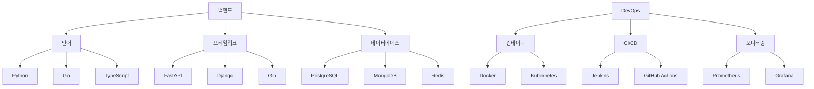
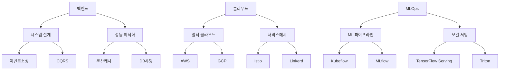

# 🚀 백엔드/클라우드/MLOps 통합 학습 로드맵 2024

## 📋 목차
1. [현재까지의 학습 현황](#현재까지의-학습-현황)
2. [추가 학습 계획](#추가-학습-계획)
3. [단계별 성장 전략](#단계별-성장-전략)
4. [기술 스택 로드맵](#기술-스택-로드맵)

---

## 📊 현재까지의 학습 현황

### 💻 핵심 역량 현황

#### 1. 컴퓨터 과학 기초
##### 자료구조
- ✅ **기본 자료구조**
  - 배열, 연결 리스트, 스택, 큐, 우선순위 큐, 힙 구현 및 활용
  - 해시 테이블 충돌 해결 전략 이해 및 구현
  - Trie, Radix 트리 구조 이해 및 구현

- ✅ **고급 자료구조**
  - 세그먼트 트리, 펜윅 트리 구현
  - Red-Black 트리, AVL 트리 이해
  - B-tree, B+ tree 데이터베이스 활용 관점 이해
  - Union-Find (Disjoint Set) 최적화 기법 구현

##### 알고리즘
- ✅ **정렬 & 탐색**
  - 기본 정렬(선택, 삽입, 버블, 퀵, 병합, 힙)
  - 고급 정렬(기수, 셸, Timsort)
  - 문자열 검색(KMP, 라빈-카프, 보이어-무어)

- ✅ **그래프 알고리즘**
  - 최단경로(다익스트라, 벨만-포드, 플로이드-워셜)
  - 최소 신장 트리(크루스칼, 프림)
  - 네트워크 플로우 기초

#### 2. 백엔드 개발
##### 언어 숙련도
- ✅ **Python**
  - FastAPI, Django 웹 프레임워크 활용
  - 비동기 프로그래밍(asyncio, aiohttp)
  - SQLAlchemy ORM 심화 활용

- ✅ **Go**
  - 고루틴과 채널을 활용한 동시성 프로그래밍
  - Gin, Echo 웹 프레임워크 활용
  - GORM을 통한 데이터베이스 조작

- ✅ **JavaScript/TypeScript**
  - Node.js 기반 백엔드 개발
  - Express.js, NestJS 프레임워크 활용
  - TypeORM, Prisma ORM 활용

##### 데이터베이스
- ✅ **관계형 데이터베이스**
  - MySQL, PostgreSQL 운영
  - 인덱스 최적화, 쿼리 튜닝
  - 트랜잭션 격리 수준 이해

- ✅ **NoSQL**
  - MongoDB 스키마 설계
  - Redis 캐싱 전략
  - Elasticsearch 검색 엔진 활용

#### 3. 클라우드 & DevOps
- ✅ **컨테이너화**
  - Docker 이미지 최적화
  - Docker Compose를 통한 개발 환경 구성
  - Dockerfile 멀티 스테이지 빌드

- ✅ **CI/CD**
  - Jenkins 파이프라인 구성
  - GitHub Actions 워크플로우 설계
  - ArgoCD를 통한 GitOps 구현

---

## 📈 추가 학습 계획

### 🎯 우선순위 1: 백엔드 심화
#### 시스템 설계
- 📝 **분산 시스템 패턴**
  - Event Sourcing, CQRS 패턴 실제 구현
  - 분산 트랜잭션 처리 전략
  - 데이터 일관성 모델 (강한 일관성 vs 최종 일관성)

- 📝 **마이크로서비스 아키텍처**
  - 서비스 분리 전략
  - API Gateway 패턴
  - 서비스 간 통신 (gRPC, 메시지 큐)

#### 성능 최적화
- 📝 **데이터베이스 최적화**
  - 파티셔닝 전략
  - 샤딩 구현
  - 인덱스 최적화 고급 기법

### 🎯 우선순위 2: 클라우드 네이티브
#### 쿠버네티스 심화
- 📝 **운영 자동화**
  - CustomResourceDefinition (CRD) 개발
  - Operator 패턴 구현
  - HPA/VPA를 통한 자동 스케일링

#### 클라우드 아키텍처
- 📝 **멀티/하이브리드 클라우드**
  - 클라우드 간 데이터 동기화
  - 트래픽 라우팅 전략
  - 재해 복구 (DR) 구성

### 🎯 우선순위 3: MLOps 기초
- 📝 **ML 파이프라인 기초**
  - 모델 학습 자동화
  - 모델 서빙 아키텍처
  - 모델 모니터링 구축

---

## 🎯 단계별 성장 전략

### 1️⃣ 1단계: 백엔드 전문성 강화 (1-2년)
- 대규모 트래픽 처리 시스템 설계/운영 경험
- 분산 시스템 설계 패턴 실무 적용
- 데이터 파이프라인 구축 경험

### 2️⃣ 2단계: 클라우드 네이티브 전환 (2-3년)
- 쿠버네티스 기반 마이크로서비스 운영
- 클라우드 네이티브 아키텍처 설계
- SRE 프랙티스 도입

### 3️⃣ 3단계: MLOps 도입 (4-5년)
- ML 모델 서빙 파이프라인 구축
- 모델 학습/배포 자동화
- ML 시스템 모니터링 구축

---

## 🛠 기술 스택 로드맵

### 현재 보유 기술

### 목표 기술 스택 (3년 후)
