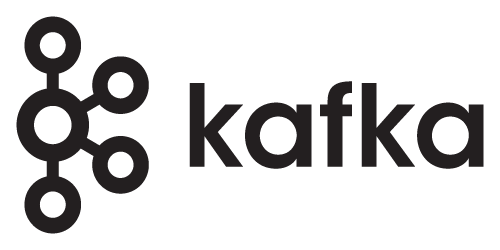

# 🚀 백엔드/클라우드/MLOps 통합 학습 로드맵 2025

## 📋 목차
1. [현재까지의 학습 현황](#현재까지의-학습-현황)
2. [추가 학습 계획](#추가-학습-계획)
3. [단계별 성장 전략](#단계별-성장-전략)
4. [기술 스택 로드맵](#기술-스택-로드맵)

---

## 📊 현재까지의 학습 현황

### 1. 컴퓨터 과학 기초
#### 자료구조
- **기본 자료구조:**  
  - **배열, 연결 리스트, 스택, 큐, 우선순위 큐, 힙:**  
    구현 및 활용, 투 포인터, 슬라이딩 윈도우, 누적 합 등 기법 학습
  - **해시 테이블:**  
    충돌 해결 전략, 키-값 자료 관리, 응용 사례 (예: 캐싱)
  - **Trie & Radix 트리:**  
    문자열 검색 및 효율적 데이터 관리

- **고급 및 특수 자료구조:**  
  - **트리:**  
    이진 트리, 이진 탐색 트리(BST), 균형 트리(AVL, Red-Black)  
    → 트리 순회, 삽입/삭제 연산, 실무 활용 (파일 시스템, 데이터베이스 인덱스)
  - **그래프:**  
    DFS, BFS, 위상 정렬, 사이클 탐지, 최단 경로, 최소 신장 트리  
  - **유니온 파인드, 스킵 리스트, 블룸 필터, 접미사 배열/트리**  
  - **데이터베이스 및 분산 시스템용 고급 자료구조:**  
    - 디스크 기반: LSM Tree, B* Tree, ISAM, Fractal Tree, HOT  
    - 메모리 최적화: T-Tree, Adaptive Radix Tree (ART), Bw-Tree, FAST, CSB+ Tree  
    - 분산 시스템: Skip Graph, Chord DHT, Merkle Tree, Vector Clock Trees  
    - 특수/혼합 구조(아직 구현 안됨): R-Tree, M-Tree, UB-Tree, GiST, SP-GiST, Buffer Tree, FD-Tree, LA-Tree, COLA

#### 알고리즘
- **정렬 & 탐색:**  
  - **정렬 알고리즘:**  
    기본 정렬(버블, 선택, 삽입, 퀵, 병합, 힙)  
    고급 정렬(기수, 셸, Timsort, 하이브리드 정렬(Introsort, Quick-Merge))  
  - **탐색 알고리즘:**  
    순차 탐색, 이진 탐색, 해시 탐색, 문자열 검색 (KMP, Rabin-Karp, Boyer-Moore, Z 알고리즘, Aho-Corasick, 하이브리드 검색)
    
- **재귀 알고리즘:**  
  일반 재귀, 꼬리 재귀, 직접/간접 재귀, 순수 재귀  
  → 각 유형별 구현 예제와 최적화 기법 학습

- **그래프 알고리즘:**  
  기본 탐색(DFS, BFS, 위상 정렬)  
  최단 경로(Dijkstra, Bellman-Ford, Floyd-Warshall, A* 알고리즘)  
  최소 신장 트리(Kruskal, Prim)  
  강하게 연결된 성분, 네트워크 플로우, 이분 매칭 등

- **동적 계획법 (DP):**  
  기초 문제 (배낭, 최장 공통 부분 수열, 최장 증가 부분 수열, 최대 부분 배열, 편집 거리, 행렬 체인 곱셈, 최장 팰린드롬)  
  고급 기법: Divide and Conquer Optimization, Knuth Optimization, Bitmask DP, DP on Trees, Convex Hull Trick

- **분할 정복:**  
  정렬 알고리즘(Merge Sort, Quick Sort)  
  수치 계산: Karatsuba Multiplication, Strassen's Matrix Multiplication  
  FFT, Closest Pair, QuickSelect, Maximum Subarray Problem

### 2. 백엔드 개발
- **언어 및 프레임워크:**  
  - **Go:** 고루틴, 채널, Gin/Echo/go-micro, GORM  
  - **JavaScript/TypeScript:** Node.js, Express.js, NestJS, TypeORM, Prisma, Mikro-ORM
  - **Java:** Spring Boot, Hibernate, JPA etc...
- **프로젝트 경험:**  
  REST API, gRPC, 마이크로서비스 아키텍처, 실시간 데이터 처리, 동시성 프로그래밍

### 3. 데이터베이스
- **관계형 DB:**  
  MySQL, PostgreSQL 운영, 인덱스 최적화, 쿼리 튜닝, 트랜잭션 격리
- **NoSQL:**  
  MongoDB, Redis 캐싱, Elasticsearch 활용
- **고급 자료구조 활용:**  
  B-Tree 계열, LSM Tree 등 실무 응용

### 4. 클라우드 & DevOps
- **컨테이너화:**  
  Docker, Docker Compose, 멀티 스테이지 빌드
- **CI/CD:**  
  Jenkins, GitHub Actions, ArgoCD (GitOps)
- **클라우드 네이티브:**  
  Kubernetes, 클라우드 인프라 설계, Prometheus, Grafana
- **서비스 메시:**
  Istio, Linkerd

### 5. 프로그래밍 언어

#### **주요 언어**
- **Go**  
  - **목표:** 백엔드 서비스 및 마이크로서비스, 고루틴과 채널을 활용한 동시성 프로그래밍, 실시간 데이터 처리 및 서비스 구현  
  - **관련 프레임워크/도구:** Gin, Echo, GORM 등  
  - **이유:** Go는 간결한 문법과 뛰어난 동시성 지원으로 대규모 트래픽 처리와 백엔드 시스템 구축에 최적화되어 있으며, 클라우드 네이티브 환경에서 강력한 성능을 발휘함.

#### **서브 언어**
- **Elixir**  
  - **목표:** 실시간 시스템 및 분산 시스템 구현, BEAM VM의 높은 동시성과 장애 격리 기능 활용  
  - **특징:** Elixir는 함수형 프로그래밍과 OTP(Actor Model) 기반의 설계로, 채팅 시스템이나 실시간 데이터 스트림과 같은 응용 분야에 적합함.
  
- **C/C++**  
  - **목표:** 저수준 시스템 프로그래밍 및 극한의 성능 최적화, 실시간 데이터 처리에 필수적인 부분에 활용  
  - **특징:** 메모리 제어와 최적화를 통해 최고 수준의 성능을 낼 수 있으나, 구현 난이도는 상대적으로 높음.

### 6. 네트워크
- **기본 개념:**  
  OSI 모델, TCP/IP, 라우팅, 스위칭
- **실무 적용:**  
  네트워크 보안, 부하 분산, CDN, API 게이트웨이
- **도구:**  
  Wireshark, tcpdump 등

### 7. 운영체제
- **기본 및 심화:**  
  프로세스, 스레드, 메모리 관리, 파일 시스템, 인터럽트  
  멀티스레딩, 동시성 제어, 스케줄링, 커널 구조 분석
- **실습:**  
  리눅스 명령어, 쉘 스크립트, 시스템 내부 구조 분석

### 8. 보안
- **기본 개념:**  
  암호화, 해시, 인증, 인가, 네트워크 보안  
- **실무 적용:**  
  웹 보안 (SQL Injection, XSS, CSRF), 시스템 보안, 암호화 라이브러리 활용
- **도구:**  
  보안 스캐닝, 취약점 분석 도구

### 9. 시스템 디자인
- **핵심 원칙:**  
  확장성, 가용성, 일관성, 유지보수성, 성능 최적화
- **설계 및 구조:**  
  마이크로서비스 아키텍처, API Gateway, 캐싱 전략, DB 샤딩/복제
- **실무 사례:**  
  대규모 트래픽 처리, 클라우드 기반 분산 시스템, 실시간 데이터 스트리밍
- **관련 기술:**  
  AWS, GCP, Azure, Docker, Kubernetes

### 10. 암호화

백엔드·클라우드·실시간 시스템 엔지니어에게 필수적인 **암호화 기법 및 보안** 전반을 다루는 영역으로, **대칭/비대칭 암호화**, **해시 함수**, **TLS/SSL**, **키 관리** 등의 주제에 대한 심층 학습을 목표로 합니다. 암호화는 데이터의 기밀성·무결성·인증을 보장해 현대 애플리케이션 및 인프라의 보안을 강화하는 핵심 기술.

- **대칭 암호화**  
  - AES, DES, 3DES, ChaCha20 등의 알고리즘을 이용해 데이터를 빠르고 효율적으로 보호합니다.  
  - 키 길이, 암호화 모드(CBC, GCM 등), 패딩 방식 등에 따라 보안 강도와 성능이 달라집니다.

- **비대칭 암호화**  
  - RSA, ECC 등 공개키 기반 알고리즘을 사용해 안전한 키 교환, 디지털 서명 등을 구현합니다.  
  - 키 관리와 서명 검증 과정을 통해 신뢰성 있는 통신 및 데이터 보호를 보장합니다.

- **해시 함수 및 MAC**  
  - SHA 계열, HMAC 등을 활용해 데이터 변경 여부를 빠르게 감지하고 무결성을 보장합니다.  
  - 메시지 인증 코드(MAC)는 전송 과정에서 발생할 수 있는 위·변조를 방지합니다.

- **TLS/SSL**  
  - HTTPS 등 보안 통신 프로토콜을 구성하는 핵심 요소로, 인증서와 공개키를 통한 안전한 통신 채널을 제공합니다.  
  - 서버/클라이언트 간 상호 인증, 세션 키 교환, 암호화된 전송 등의 과정을 체계적으로 이해해야 합니다.

- **키 관리**  
  - 안전한 키 생성·저장·순환은 암호화 시스템 전반의 신뢰도를 좌우합니다.  
  - HSM(하드웨어 보안 모듈) 또는 클라우드 KMS(Key Management Service)를 활용해 키를 중앙 집중적으로 관리함으로써 보안 위험을 낮출 수 있습니다.

- **모범 사례**  
  - 최신 표준(예: AES-256, TLS 1.3)을 적용하고, 보안 취약점(예: 짧은 키 길이, 불량 난수) 등을 지속적으로 모니터링해야 합니다.  
  - 접근 제어, 감사 로그, 정책 문서화 등을 통해 체계적인 보안 운영이 가능해집니다.

- **실무 적용**  
  - **백엔드 개발자**: 애플리케이션에서 민감 데이터(예: 비밀번호, 개인정보) 암호화, 사용자 인증·인가 로직 강화.  
  - **클라우드 엔지니어/DevOps**: TLS 설정·인증서 자동 배포, CI/CD 파이프라인에 암호화 검증 프로세스 포함, 안전한 키 보관 및 회전 전략.  
  - **실시간 시스템 엔지니어**: 낮은 지연 시간과 높은 처리량을 유지하면서 안전한 데이터 전송을 위해 대칭/비대칭 혼합(하이브리드) 암호화 방식 활용.

- **향후 발전 방향**  
  - **포스트 양자 암호화**: 양자 컴퓨팅 시대에도 안전한 알고리즘 연구 및 적용.  
  - **DevSecOps**: CI/CD 파이프라인에 암호화 검증과 키 관리를 자동화해 지속적인 보안 개선.

---

## 📈 추가 학습 계획

### 🎯 우선순위 1: 백엔드 심화 및 시스템 설계
- **분산 시스템 패턴:**  
  Event Sourcing, CQRS, 분산 트랜잭션, 데이터 일관성 모델
- **마이크로서비스 아키텍처:**  
  서비스 분리, API Gateway, gRPC, 메시지 큐
- **데이터베이스 최적화:**  
  파티셔닝, 샤딩, 고급 인덱스 최적화

### 🎯 우선순위 2: 클라우드 네이티브 & DevOps 심화
- **쿠버네티스 심화:**  
  CRD 개발, Operator 패턴, 자동 스케일링 (HPA/VPA)
- **멀티/하이브리드 클라우드:**  
  데이터 동기화, 트래픽 라우팅, 재해 복구 (DR)
- **클라우드 아키텍처:**  
  인프라 최적화, SRE 도입

### 🎯 우선순위 3: 실시간 시스템 도입 및 고도화
- **실시간 데이터 처리:**  
  스트리밍 아키텍처, 메시징 시스템 최적화, 이벤트 처리 패턴
- **실시간 시스템 설계:**  
  고가용성, 장애 격리, 부하 분산 및 실시간 모니터링 구축
- **실시간 애플리케이션 개발:**  
  채팅 시스템, 실시간 데이터 스트림, IoT 및 실시간 알림 시스템 구축

---

## 🎯 단계별 성장 전략

### 1️⃣ 1단계: 백엔드 전문성 강화 (1-2년)
- 대규모 트래픽 처리 시스템 설계 및 운영
- 분산 시스템 및 데이터 파이프라인 구축
- 실전 프로젝트를 통한 역량 강화

### 2️⃣ 2단계: 클라우드 네이티브 전환 (2-3년)
- 쿠버네티스 기반 마이크로서비스 운영
- 클라우드 네이티브 아키텍처 설계 및 구현
- SRE 및 DevOps 문화 도입

### 3️⃣ 3단계: 실시간 시스템 도입 및 고도화 (4-5년)
- 실시간 데이터 처리 및 이벤트 기반 시스템 구축
- 실시간 애플리케이션 개발 및 운영 최적화
- 고가용성 및 장애 격리 전략, 실시간 모니터링 및 자동 복구 시스템 구현

---

## 🛠 기술 스택 로드맵

- ### Languages and Frameworks

  <code></code>
  <code></code>
  <code></code>
  <code></code>

- ### Database

  <code></code>
  <code></code>
  <code></code>
  <code></code>
  <code></code>
  <code></code>

- ### Message Queue
  <code></code>
  <code></code>
  <code></code>

- ### Cloud & DevOps

- #### Container & Orchestration
  <code></code>
  <code></code>

- #### CI/CD
  <code></code>
  <code></code>
  <code></code>

---

*Last updated: 2025/02/25*