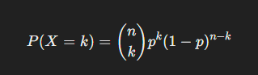
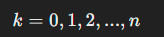
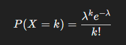
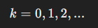
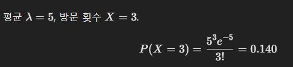
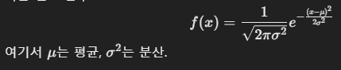
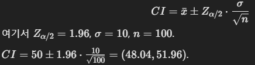
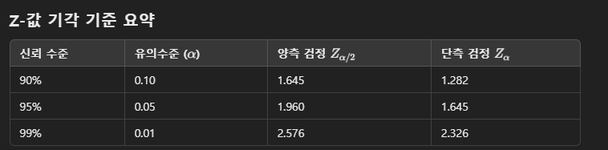

# 8강 이산형 확률 분포

1. 확률과 확률 변수
    * 확률 변수: 특정 사건이 일어날 확률을 수치화한 변수.
        * 이산형 확률 변수: 취할 수 있는 값이 유한.
        * 연속형 확률 변수: 취할 수 있는 값이 무한.

2. 이항 분포 (Binomial Distribution)
    * 베르누이 시행: 두 가지 경우에만 가능한 사건 (`success`와 `fail`).
    * 성공 확률: `𝑃(𝑠) = 𝑝`, 실패 확률: `𝑃(𝑓) = 1 − 𝑝`.
    * n번의 독립적인 베르누이 시행에서 성공 횟수 X는 이항 분포를 따름.
        * 확률 질량 함수:
        
        

3. 포아송 분포 (Poisson Distribution)
    * 특정 단위 내 사건 발생 횟수를 나타내는 분포
    * 평균 𝜆를 기반으로 확률 계산.
        * 확률 질량 함수:
        
        

4. 연습 문제와 풀이
    1. 이항 분포
        * 10개의 동전을 던질 때, 앞면이 나오는 횟수를 X라고 하자. X는 B(n = 10, p = 0.5)를 따른다.
        * P(X = 3)와 P(X <= 3)를 계산하시오.

        * 풀이:
            
            ```r
            # 이항 분포 계산
            n <- 10
            p <- 0.5
            x <- 3

            # P(X = 3)
            px_eq_3 <- dbinom(x, size = n, prob = p)
            cat("P(X = 3):", px_eq_3, "\n")

            # P(X <= 3)
            px_le_3 <- pbinom(x, size = n, prob = p)
            cat("P(X <= 3):", px_le_3, "\n")
            ```

    2. 포아송 분포
        * 한 시간 동안 카페에 평균 5명이 방문한다고 할 때, 한 시간 동안 3명이 방문할 확률을 구하시오.

        * 풀이:
            
            ```r
            # 포아송 분포 계산
            lambda <- 5
            k <- 3

            # P(X = 3)
            px_eq_3 <- dpois(k, lambda = lambda)
            cat("P(X = 3):", px_eq_3, "\n")
            ```

# 9강 연속형 확률 분포

1. 정규 분포 (Normal Distribution)
    * 자연 현상에서 흔히 나타나는 분포로, 종 모양의 곡선 형태이며 평균을 중심으로 대칭 구조를 가짐.
    * 확률 밀도 함수:
        
    
    * 68-95-99.7 법칙:
        * 데이터의 약 68%가 평균 +- 1 표준편차 범위에 있음.
        * 약 95%는 평균 +-2 표준편차, 99.7%는 평균 +-3 표준변차에 분포.

2. 표준 정규 분포 (Standard Normal Distribution)
    * 평균 `μ = 0`, 표준편차 `σ = 1`인 정규 분포.
    * 일반 정규 분포를 표준 정규 분포로 변환:
        - `Z = (X - μ) / σ`
        - Z는 원래 데이터가 평균으로부터 몇 배의 표준편차만큼 떨어져 있는지 나타냄.

3. 연습 문제와 풀이
    1. 정규 분포의 확률 계산
        * 평균이 70, 표준편차가 10인 시험 점수에서 X가 80 이상일 확률을 구하시오.
        `P(X >= 80).`

        * 풀이:
            - Z변환을 통해 `Z = (X - μ) / σ = (80 - 70) / 10 = 1.`
            - `P(X >= 80) = P(Z >= 1) = 1 - P(X <= 1)`

            ```r
            # 정규 분포 확률 계산
            mu <- 70
            sigma <- 10
            x <- 80

            # P(X ≥ 80)
            z <- (x - mu) / sigma
            p_ge_80 <- 1 - pnorm(z)
            cat("P(X ≥ 80):", p_ge_80, "\n")
            ```

    2. 68-95-99.7 법칙 검증
        * 평균 50, 표준편차 5인 정규 분포에서 X가 (45, 55)범위에 있을 확률을 계산하시오.

        * 풀이:
            - Z 변환: `Z1 = (45 - 50) / 5 = -1`, `Z2 = (55 - 50) / 5 = 1`
            - `P(45 <= X <= 55) = P(-1 <= Z <= 1) = P(Z <= 1) - P(Z <= -1)`

            ```r
            # 68-95-99.7 법칙 범위 계산
            mu <- 50
            sigma <- 5
            x1 <- 45
            x2 <- 55

            # Z 변환
            z1 <- (x1 - mu) / sigma
            z2 <- (x2 - mu) / sigma

            # P(45 ≤ X ≤ 55)
            p_range <- pnorm(z2) - pnorm(z1)
            cat("P(45 ≤ X ≤ 55):", p_range, "\n")
            ```

    3. 표준 정규 분포의 활용
        * 평균이 60, 표준편차가 8인 시험 점수에서 두 학생의 점수가 각각 72점과 50점일 때, 누가 더 잘했는지 비교하시오.

        * 풀이:
            - 학생 1의 Z 값: `Z1 = (72 - 60) / 8 = 1.5`
            - 학생 2의 Z 값: `Z2 = (50 - 60) / 8 = -1.25`
            - Z 값이 높은 학생이 상대적으로 더 잘했음.

            ```r
            # 두 학생의 Z 값 계산
            mu <- 60
            sigma <- 8
            score1 <- 72
            score2 <- 50

            z1 <- (score1 - mu) / sigma
            z2 <- (score2 - mu) / sigma

            cat("Student 1 Z-score:", z1, "\n")
            cat("Student 2 Z-score:", z2, "\n")
            if (z1 > z2) {
            cat("Student 1 performed better.\n")
            } else {
            cat("Student 2 performed better.\n")
            }
            ```

# 10강 표본과 추론

1. 통계적 추론 (Statistical Inference)
    * 모집단에 대해 표본 데이터를 바탕으로 추론하는 과정.
    * 모집단: 관심의 대상 전체.
    * 표본: 모집단의 일부를 대표로 추출.

2. 표본 분포 (Sampling Distribution)
    * 표본 통계량(평균, 분산 등)의 분포.
    * 중심극한정리: 표본 크기가 충분히 크면, 표본 평균의 분포는 모집단 분포와 관계없이 정규 분포에 가까워짐.

3. 추정 (Estimation)
    * 점추정: 단일 값으로 모수를 측정.
        - 예: 표본 평균, 표본 분산.

    * 구간추청: 모수가 포함될 구간을 확률적으로 제시.
        - 예: 신뢰구간(Confidence Interval)

4. 신뢰구간 (Confidence Interval)
    * 모수가 포함될 것으로 예상되는 구간.
    * 신뢰수준 95%라면, 반복 샘플링 시 95% 구간에 모수가 포함.

5. 연습 문제와 풀이
    1. 점추정
        * 100개의 샘플 데이터를 통해 평균이 50, 표준편차가 10으로 계산되었다. 모집단 평균을 점추정하시오.

        * 풀이:
            - 점추정: 표본 평균 x- = 50.
            ```r
            # 점추정 계산
            sample_mean <- 50
            cat("점추정(표본 평균):", sample_mean, "\n")
            ```

    2. 신뢰구간 구하기
        * 표본 크기 100, 평균 50, 표준편차 10일 때, 95% 신뢰구간을 구하시오.

        * 풀이:
            - 95% 신뢰구간 공식:
            
            ```r
            # 신뢰구간 계산
            n <- 100
            mean <- 50
            std_dev <- 10
            z <- 1.96 # 95% 신뢰수준

            margin_of_error <- z * (std_dev / sqrt(n))
            lower_bound <- mean - margin_of_error
            upper_bound <- mean + margin_of_error

            cat("95% 신뢰구간:", lower_bound, "to", upper_bound, "\n")
            ```

    3. 중심 극한 정리
        * 모집단이 정규 분포를 따르지 않더라도, 표본 크기 n = 30일 때, 표본 평균 분포가 정규 분포에 가까워지는지 확인.

        * 풀이:
            - 모집단은 임의의 분포(예: 균등 분포)로 설정하고, n = 30으로 샘플링
            - 표본 평균 분포를 히스토그램으로 시각화.
            ```r
            # 중심극한정리 시뮬레이션
            set.seed(123)
            population <- runif(10000, min = 0, max = 100) # 균등분포 모집단
            n <- 30 # 표본 크기
            sample_means <- replicate(1000, mean(sample(population, n, replace = TRUE)))

            # 히스토그램으로 표본 평균 분포 확인
            hist(sample_means, breaks = 30, main = "표본 평균 분포", xlab = "평균값")
            ```

# 11강: 가설 검정

1. 가설 검정 (Hypothesis Testing)
    * 모집단의 속성에 대한 주장을 검증하는 통계적 방법.
    * 귀무가설 (H_0): 차이가 없거나 변화가 없다는 주장.
    * 대립가설 (H_1): 차이가 있거나 변화가 있다는 주장.
    * H_0을 기각할 만한 충분한 근거가 있을 때 H_1을 채택.

2. 가설 검정의 오류
    * 제1종 오류 (α): 실제로 H_0이 참인데 잘못 기각.
    * 제2종 오류 (β): 실제로 H_1이 참인데 H_1을 기각하지 않음.

3. 검정 방법
    * 기각역 방법: 검정 통계량이 미리 정한 기각역에 포함되는 H_0를 기각.
    * p-값 방법: p-값이 유의수준 α보다 작으면 H_0를 기각.

4. 단측 및 양측 검정
    * 단측 검정: 특정 방향의 차이만 검정.
    * 양측 검정: 양방향의 차이를 검정.

5. Z-검정과 t-검정
    * 모집단의 표준편차를 아는 경우 Z-검정
    * 모집단의 표준편차를 모르는 경우, 표본 크기에 따라 t-검정을 사용.

6. 연습 문제와 풀이
    1. Z-검정
        * 한 제품의 평균 무게가 500g이라고 주장한다. 표본 30개의 평균이 490g이고, 표준편차가 20g일 때,
        평균 무게가 500g과 다른지 검정하시오. (유의수준 `α = 0.05`, 양측 검정)

        * 풀이:
            - 귀무가설 H_0: `μ = 500.`
            - 대립가설 H_1: `μ != 500.`
            - 검정 통계량:
                `Z = (X_ - μ) / (σ/ sqrt(n)) = (490 - 500) / (20/ sqrt(30)) ≈ -2.74`
            - 기각 기준: `|Z| > 1.96(95% 신뢰 수준).`
            ```r
            # Z-검정 계산
            mu <- 500
            sample_mean <- 490
            std_dev <- 20
            n <- 30
            alpha <- 0.05

            z <- (sample_mean - mu) / (std_dev / sqrt(n))
            critical_value <- qnorm(1 - alpha / 2)

            cat("검정 통계량(Z):", z, "\n")
            cat("기각 기준(Z > ±):", critical_value, "\n")

            if (abs(z) > critical_value) {
            cat("귀무가설 기각: 평균이 500g과 다르다.\n")
            } else {
            cat("귀무가설 채택: 평균이 500g과 다르지 않다.\n")
            }
            ```

    2. t-검정
        * 모집단의 표준편차를 모르는 경우, 평균 시험 점수가 75점이라고 주장한다. 표본 25개의 평균이 70점, 표준편차가 8점일 때, 시험 점수가 75점과 다른지 검정하시오.
        (유의수준 `α=0.05`, 양측검정)

        * 풀이:
            - 귀무가설: H_0: 𝜇 = 75.
            - 대립가설: H_1: 𝜇 != 75.
            - 검정 통계량:
                `t = (X_ - 𝜇) / (s / sqrt(n)) = (70 - 75) / (8 / sqrt(25)) = -3.125`
            - 기각 기준: `|t| > 2.064`(유의수준 0.05, 자유도 24)
            ```r
            # t-검정 계산
            mu <- 75
            sample_mean <- 70
            std_dev <- 8
            n <- 25
            alpha <- 0.05

            t <- (sample_mean - mu) / (std_dev / sqrt(n))
            critical_value <- qt(1 - alpha / 2, df = n - 1)

            cat("검정 통계량(t):", t, "\n")
            cat("기각 기준(t > ±):", critical_value, "\n")

            if (abs(t) > critical_value) {
            cat("귀무가설 기각: 평균이 75점과 다르다.\n")
            } else {
            cat("귀무가설 채택: 평균이 75점과 다르지 않다.\n")
            }
            ```

    3. p-값 계산
        * 위 문제에서 p-값을 계산하여 결과를 검증하시오.

        * 풀이:
            - t = -3.125, 자유도 24.
            - p-값: `P = 2 x P(T <= -3.125) = 2 x pt(-3.125, df = 24)`

            ```r
            # p-값 계산
            p_value <- 2 * pt(t, df = n - 1)
            cat("p-값:", p_value, "\n")

            if (p_value < alpha) {
            cat("귀무가설 기각: 평균이 75점과 다르다.\n")
            } else {
            cat("귀무가설 채택: 평균이 75점과 다르지 않다.\n")
            }
            ```

    