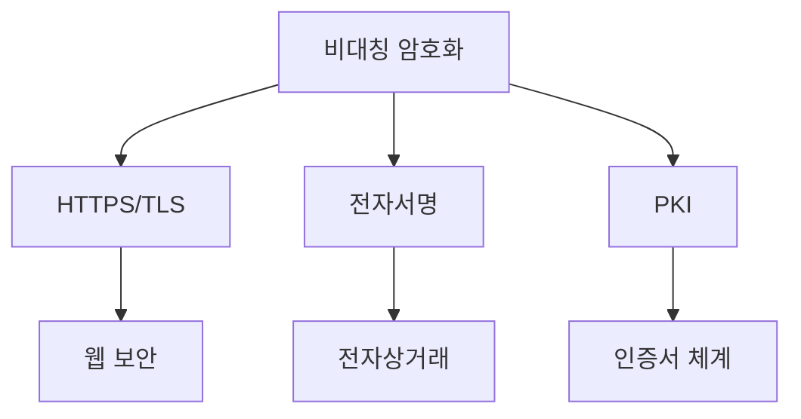

# 1. 들어가기 (Introduction)

비대칭 암호화는 현대 정보 보안의 핵심 기술이며, 인터넷 시대의 안전한 통신과 전자 상거래를 가능하게 하는 기반이 됩니다. 본 문서는 비대칭 암호화의 기본 개념부터 실제 구현과 운영까지, 개발자와 보안 전문가들이 반드시 알아야 할 내용을 체계적으로 다룹니다.

## 1.1 문서의 목적과 중요성

### 비대칭 암호화의 필요성 🎯

현대 디지털 환경에서 비대칭 암호화가 필요한 이유는 다음과 같습니다:

1. **안전한 키 교환**
   - 대칭 암호화의 한계 극복
   - 사전 접촉 없는 안전한 통신 설정
   - 확장 가능한 키 관리 체계 구축

2. **디지털 신원 증명**
   - 전자 서명을 통한 본인 인증
   - 문서의 진위 여부 검증
   - 부인 방지 기능 제공

3. **데이터 무결성 보장**
   - 메시지 변조 탐지
   - 소프트웨어 패키지 검증
   - 보안 업데이트 인증

### 현대 보안에서의 역할 🛡️

비대칭 암호화는 다음과 같은 현대 보안 인프라의 근간을 이룹니다:



주요 응용 분야:
- 웹 보안 (HTTPS)
- 이메일 보안 (S/MIME, PGP)
- 코드 서명
- 블록체인과 암호화폐
- IoT 디바이스 인증

### 주요 사용 사례 💡

실제 환경에서의 적용 예시:

```go
// RSA 키 쌍 생성 예시
package main

import (
    "crypto/rand"
    "crypto/rsa"
    "crypto/x509"
    "encoding/pem"
    "os"
)

func generateKeyPair(bits int) error {
    // 개인키 생성
    privateKey, err := rsa.GenerateKey(rand.Reader, bits)
    if err != nil {
        return err
    }

    // 개인키를 PEM 형식으로 저장
    privateKeyBytes := x509.MarshalPKCS1PrivateKey(privateKey)
    privateKeyPEM := pem.EncodeToMemory(&pem.Block{
        Type:  "RSA PRIVATE KEY",
        Bytes: privateKeyBytes,
    })

    // 공개키 추출 및 저장
    publicKey := &privateKey.PublicKey
    publicKeyBytes, err := x509.MarshalPKIXPublicKey(publicKey)
    if err != nil {
        return err
    }
    publicKeyPEM := pem.EncodeToMemory(&pem.Block{
        Type:  "RSA PUBLIC KEY",
        Bytes: publicKeyBytes,
    })

    // 파일로 저장
    err = os.WriteFile("private.pem", privateKeyPEM, 0600)
    if err != nil {
        return err
    }
    return os.WriteFile("public.pem", publicKeyPEM, 0644)
}
```

## 1.2 적용 범위

본 문서는 다음과 같은 범위의 주제를 다룹니다:

### 기본 개념 학습 📚

1. **수학적 기초**
   - 정수론과 모듈러 연산
   - 타원곡선 이론
   - 암호학적 기본 원리

2. **알고리즘 이해**
   - RSA 알고리즘
   - ECC (타원곡선 암호화)
   - 디지털 서명 알고리즘

### 실제 구현 및 운영 ⚙️

구현 시 고려해야 할 주요 사항:

1. **알고리즘 선택**
   - 용도에 따른 적절한 알고리즘 선정
   - 키 길이 결정
   - 성능과 보안성 균형

2. **키 관리**
   - 안전한 키 생성
   - 키 저장소 관리
   - 키 수명주기 관리

3. **운영 관리**
   - 성능 모니터링
   - 보안 감사
   - 인시던트 대응

### 보안 고려사항 🔒

1. **위협 모델**
   - 알려진 공격 유형
   - 대응 방안
   - 리스크 평가

2. **구현 보안**
   - 안전한 난수 생성
   - 메모리 보안
   - 부채널 공격 방지

### 성능 최적화 전략 🚀

시스템 최적화를 위한 주요 전략:

```go
// 병렬 처리를 통한 성능 최적화 예시
func parallelEncrypt(messages [][]byte, publicKey *rsa.PublicKey) [][]byte {
    results := make([][]byte, len(messages))
    var wg sync.WaitGroup
    
    for i, msg := range messages {
        wg.Add(1)
        go func(index int, message []byte) {
            defer wg.Done()
            // 실제 암호화 작업
            encrypted, err := rsa.EncryptPKCS1v15(
                rand.Reader,
                publicKey,
                message,
            )
            if err == nil {
                results[index] = encrypted
            }
        }(i, msg)
    }
    
    wg.Wait()
    return results
}
```

## 1.3 사전 지식

본 문서를 효과적으로 학습하기 위해 필요한 기초 지식:

### 수학적 기초 🔢

1. **정수론**
   - 모듈러 연산
   - 소수와 인수분해
   - 유한체

2. **타원곡선**
   - 곡선의 수학적 정의
   - 점 연산
   - 이산로그 문제

### 기본 암호화 개념 🔐

필수 암호화 개념:
- 대칭/비대칭 암호화의 차이
- 해시 함수의 이해
- 난수 생성의 중요성
- 암호학적 원시 함수

### 보안 프로토콜의 이해 📡

주요 보안 프로토콜:
- TLS/SSL
- SSH
- PGP
- X.509 인증서

## 학습 순서 및 접근 방법

본 문서의 내용을 효과적으로 학습하기 위한 권장 순서:

1. **기초 개념 확립**
   - 수학적 기반 이해
   - 기본 암호화 원리 학습
   - 용어와 개념 숙지

2. **알고리즘 학습**
   - RSA 알고리즘 이해
   - ECC 기초 학습
   - 디지털 서명 매커니즘

3. **실무 적용**
   - 구현 사례 연구
   - 보안 고려사항 검토
   - 성능 최적화 기법

4. **고급 주제**
   - 최신 암호화 동향
   - 양자 내성 암호
   - 신기술 통합

## 대상 독자

본 문서는 다음과 같은 독자를 대상으로 합니다:

### 개발자 👨‍💻
- 백엔드 개발자
- 보안 엔지니어
- 시스템 아키텍트

### 보안 전문가 🔍
- 보안 감사자
- 보안 컨설턴트
- 침투 테스터

### 시스템 관리자 ⚙️
- 인프라 엔지니어
- DevOps 엔지니어
- 클라우드 아키텍트

## 문서 사용 방법

효과적인 학습을 위한 권장 사항:

1. **단계적 학습**
   - 기초부터 차근차근 학습
   - 실습 예제 직접 수행
   - 개념 이해 후 실무 적용

2. **참고 자료 활용**
   - 공식 문서 참조
   - 추가 학습 자료 활용
   - 커뮤니티 참여

3. **실무 적용**
   - 테스트 환경에서 실습
   - 점진적 도입
   - 지속적인 개선

---

# 2. 비대칭 암호화의 기초

## 2.1 비대칭 암호화의 개념

비대칭 암호화는 현대 암호학의 혁신적인 발전을 대표하는 기술입니다. 1976년 Whitfield Diffie와 Martin Hellman이 처음 제안한 이 개념은, 기존 대칭 암호화의 한계를 극복하고 안전한 키 교환 문제를 해결했습니다.

### 2.1.1 공개키와 개인키의 이해

비대칭 암호화의 핵심은 수학적으로 연관된 두 개의 키를 사용한다는 점입니다:

1. **공개키 (Public Key)**
   - 누구나 접근 가능한 공개 정보
   - 메시지 암호화에 사용
   - 디지털 서명 검증에 활용
   - 인증서에 포함되어 배포 가능

2. **개인키 (Private Key)**
   - 절대 공개되지 않아야 함
   - 암호화된 메시지 복호화에 사용
   - 디지털 서명 생성에 활용
   - 안전한 저장소에 보관 필수

```go
// 공개키/개인키 쌍 생성 예시
import (
    "crypto/rsa"
    "crypto/rand"
)

func generateKeyPair(bits int) (*rsa.PrivateKey, *rsa.PublicKey, error) {
    // 개인키 생성 (공개키 포함)
    privateKey, err := rsa.GenerateKey(rand.Reader, bits)
    if err != nil {
        return nil, nil, err
    }
    
    // 공개키 추출
    publicKey := &privateKey.PublicKey
    
    return privateKey, publicKey, nil
}
```

### 2.1.2 대칭 암호화와의 차이점

두 암호화 방식의 주요 차이점을 이해하는 것이 중요합니다:

| 특성 | 대칭 암호화 | 비대칭 암호화 |
|------|------------|--------------|
| 키 개수 | 단일 키 | 키 쌍 (공개키/개인키) |
| 속도 | 빠름 | 상대적으로 느림 |
| 키 길이 | 128-256비트 | 2048-4096비트 |
| 키 관리 | 복잡함 | 상대적으로 단순 |
| 주요 용도 | 대용량 데이터 암호화 | 키 교환, 인증, 서명 |

### 2.1.3 작동 원리와 수학적 기반

비대칭 암호화의 보안성은 수학적 난제에 기반합니다:

1. **RSA의 경우**
   - 큰 수의 인수분해 문제
   - 모듈러 연산의 특성 활용
   - 오일러 함수와 페르마의 소정리 응용

2. **ECC의 경우**
   - 타원곡선 상의 이산로그 문제
   - 점 곱셈 연산의 비가역성
   - 유한체 상의 수학적 특성

## 2.2 주요 특징

### 2.2.1 보안성과 신뢰성

비대칭 암호화의 보안성은 다음 요소들에 의해 보장됩니다:

1. **수학적 안전성**
   - 계산적으로 어려운 문제에 기반
   - 현재 기술로 해결 불가능한 시간 복잡도
   - 양자 컴퓨팅에 대한 고려 필요

2. **키 관리의 안전성**
   ```go
   // 안전한 키 저장 예시
   func storePrivateKey(key *rsa.PrivateKey, filename string) error {
       // PEM 형식으로 인코딩
       keyBytes := x509.MarshalPKCS1PrivateKey(key)
       block := &pem.Block{
           Type:  "RSA PRIVATE KEY",
           Bytes: keyBytes,
       }
       
       // 암호화된 형태로 저장
       return ioutil.WriteFile(filename, pem.EncodeToMemory(block), 0600)
   }
   ```

3. **프로토콜 안전성**
   - 적절한 패딩 사용
   - 안전한 난수 생성
   - 최신 보안 권장사항 준수

### 2.2.2 키 관리의 용이성

효율적인 키 관리를 위한 주요 고려사항:

1. **키 생성**
   - 충분한 엔트로피 확보
   - 안전한 난수 생성기 사용
   - 적절한 키 길이 선택

2. **키 배포**
   - 공개키 인증서 활용
   - 신뢰할 수 있는 채널 사용
   - 키 유효성 검증

3. **키 저장**
   - 안전한 저장소 사용
   - 접근 제어 구현
   - 정기적인 백업

### 2.2.3 성능과 리소스 요구사항

비대칭 암호화 구현 시 성능 고려사항:

1. **처리 속도**
   - CPU 집약적 연산
   - 하드웨어 가속 활용
   - 배치 처리 최적화

2. **메모리 사용**
   - 큰 키 크기로 인한 메모리 부담
   - 효율적인 메모리 관리 필요
   - 리소스 모니터링 중요

```go
// 성능 최적화 예시
func optimizedEncryption(publicKey *rsa.PublicKey, messages [][]byte) [][]byte {
    results := make([][]byte, len(messages))
    var wg sync.WaitGroup
    
    // 작업자 풀 생성
    workers := runtime.NumCPU()
    queue := make(chan int, len(messages))
    
    // 병렬 처리
    for i := 0; i < workers; i++ {
        wg.Add(1)
        go func() {
            defer wg.Done()
            for idx := range queue {
                encrypted, err := rsa.EncryptPKCS1v15(
                    rand.Reader,
                    publicKey,
                    messages[idx],
                )
                if err == nil {
                    results[idx] = encrypted
                }
            }
        }()
    }
    
    // 작업 분배
    for i := range messages {
        queue <- i
    }
    close(queue)
    wg.Wait()
    
    return results
}
```

## 2.3 기반 수학 이론

### 2.3.1 정수론과 모듈러 연산

비대칭 암호화의 수학적 기초:

1. **모듈러 연산**
    - 합동 관계: $a \equiv b \pmod{n}$ 는 $n$이 $a-b$를 나눈다는 의미
    - 모듈러 역원: $a \cdot a^{-1} \equiv 1 \pmod{n}$
    - 오일러 함수 $\phi(n)$: $n$과 서로소인 양의 정수의 개수
    - 페르마의 소정리: 소수 $p$에 대해 $a^{p-1} \equiv 1 \pmod{p}$
    - 중국인의 나머지 정리(연립 항등식 해결):
    $$
        \begin{align*}
        x &\equiv a_1 \pmod{m_1} \\
        x &\equiv a_2 \pmod{m_2} \\
        &\vdots \\
        x &\equiv a_n \pmod{m_n}
        \end{align*}
    $$
    - 여기서 $m_1, m_2, \ldots, m_n$은 서로소이고, 해는 다음과 같이 주어짐:
    $$x \equiv \sum_{i=1}^n a_i M_i y_i \pmod{M}$$
    - 단, $M = m_1 m_2 \cdots m_n$이고, $M_i = M/m_i$이며,
    $y_i$는 $M_i y_i \equiv 1 \pmod{m_i}$를 만족하는 값

2. **소수 이론**
   - 소수 판별
   - 소인수분해
   - 소수 생성

```go
// 소수 판별 예시
func isPrime(n int) bool {
    if n <= 1 {
        return false
    }
    if n <= 3 {
        return true
    }
    if n%2 == 0 || n%3 == 0 {
        return false
    }
    
    for i := 5; i*i <= n; i += 6 {
        if n%i == 0 || n%(i+2) == 0 {
            return false
        }
    }
    return true
}
```

### 2.3.2 타원곡선 수학

ECC의 수학적 기반:

1. **타원곡선의 정의**
   - 바이어스트라스 방정식: $y^2 = x^3 + ax + b$
   - 판별식: $\Delta = -16(4a^3 + 27b^2)$
   - 점의 덧셈 연산:
     - $P_1(x_1,y_1)$와 $P_2(x_2,y_2)$에 대해
     - 기울기 $s = \frac{y_2-y_1}{x_2-x_1}$ (두 점이 다른 경우)
     - 기울기 $s = \frac{3x_1^2 + a}{2y_1}$ (두 점이 같은 경우)
     - 새로운 점 $P_3(x_3,y_3)$:
       $x_3 = s^2 - x_1 - x_2$
       $y_3 = s(x_1 - x_3) - y_1$
   - 무한원점 $\mathcal{O}$ (군의 항등원)

2. **유한체 상의 연산**
   - 체의 특성: 소수 $p$에 대한 유한체 $\mathbb{F}_p$
   - 스칼라 곱셈: $k$ 횟수만큼의 점 덧셈 $kP = P + P + \cdots + P$
   - 이산로그 문제: $Q = kP$일 때 $k$ 찾기
   - 타원곡선 이산로그 문제(ECDLP):
     주어진 점 $P$와 $Q = kP$에 대해 $k$ 찾기가 어려움
   - 점 압축: $(x,y)$ 좌표에서 $x$와 $y$의 부호만 저장
     $y^2 \equiv x^3 + ax + b \pmod{p}$

### 2.3.3 암호학적 안전성

보안 강도는 수학적 문제의 어려움에 기반합니다:

1. **RSA 보안성**
   - 인수분해 문제: $n = p \cdot q$ 에서 $p$, $q$ 찾기
   - 공개키: $(n,e)$, 개인키: $d$
   - 암호화: $c = m^e \bmod n$
   - 복호화: $m = c^d \bmod n$
   - $ed \equiv 1 \pmod{\phi(n)}$ 관계 성립

2. **ECC 보안성**
   - 점 곱셈의 일방향성: $Q = kP$
   - $k$의 비트 길이가 안전성 결정
   - 권장 비트 길이: $\geq 256$ bits

보안 강도 평가 기준:

1. **계산적 복잡도**
   - 최선의 알려진 공격 알고리즘
   - 필요한 계산 자원
   - 실현 가능한 공격 시간

2. **권장 키 길이**
   - 용도별 최소 키 길이
   - 미래 보안성 고려
   - 정기적인 갱신 계획

## 응용 및 실제 구현

### 구현 시 고려사항

1. **라이브러리 선택**
   - 검증된 암호화 라이브러리 사용
   - 최신 버전 유지
   - 보안 업데이트 관리

2. **오류 처리**
   ```go
   // 안전한 오류 처리 예시
   func secureEncrypt(publicKey *rsa.PublicKey, message []byte) ([]byte, error) {
       if len(message) > maxMessageLength {
           return nil, errors.New("메시지가 너무 깁니다")
       }
       
       encrypted, err := rsa.EncryptPKCS1v15(rand.Reader, publicKey, message)
       if err != nil {
           // 구체적인 오류 정보 노출 방지
           return nil, errors.New("암호화 작업 실패")
       }
       
       return encrypted, nil
   }
   ```

3. **보안 모니터링**
   - 작업 로깅
   - 이상 징후 탐지
   - 감사 추적 유지

## 마무리

비대칭 암호화의 기초를 이해하는 것은 현대 보안 시스템을 구축하고 운영하는데 필수적입니다. 이어지는 장에서는 RSA와 ECC 같은 구체적인 알고리즘과 그 구현에 대해 자세히 다루겠습니다.

### 다음 학습 주제
- RSA 알고리즘 상세 분석
- ECC 구현과 응용
- 디지털 서명 프로토콜
- 키 교환 메커니즘

---

# 3. RSA (Rivest-Shamir-Adleman)

RSA는 1977년 Ron Rivest, Adi Shamir, Leonard Adleman이 개발한 최초의 실용적인 공개키 암호 시스템입니다. 큰 수의 인수분해 문제의 어려움에 기반하여 설계되었으며, 현재까지도 가장 널리 사용되는 비대칭 암호화 알고리즘입니다.

## 3.1 RSA 알고리즘 이해

### 3.1.1 기본 원리와 수학적 배경

RSA의 안전성은 다음과 같은 수학적 원리에 기반합니다:

1. **소인수분해의 어려움**
   - 두 큰 소수의 곱 $n = p \cdot q$에서 $p$와 $q$를 찾는 것이 어려움
   - $n$이 커질수록 인수분해는 기하급수적으로 어려워짐
   - 현재 알려진 최선의 알고리즘도 준지수 시간 필요

2. **오일러 함수와 모듈러 연산**
   - 오일러 함수 $\phi(n) = (p-1)(q-1)$
   - $\phi(n)$을 알면 개인키를 계산할 수 있음
   - 모듈러 연산의 특성: $(m^e)^d \equiv m \pmod{n}$

3. **페르마의 소정리 응용**
   - 소수 $p$에 대해 $a^{p-1} \equiv 1 \pmod{p}$
   - RSA에서 메시지 복구의 수학적 기반
   - $ed \equiv 1 \pmod{\phi(n)}$ 관계 활용

### 3.1.2 키 생성 과정

RSA 키 생성은 다음 단계로 이루어집니다:

1. **소수 생성**
   ```go
   func generateLargePrime(bits int) (*big.Int, error) {
       for {
           // 지정된 비트 수의 소수 후보 생성
           n, err := rand.Prime(rand.Reader, bits)
           if err != nil {
               return nil, err
           }
           
           // 추가 검증
           if n.ProbablyPrime(20) {
               return n, nil
           }
       }
   }
   ```

2. **공개키와 개인키 계산**
   - $n = p \cdot q$ 계산
   - $\phi(n) = (p-1)(q-1)$ 계산
   - 공개 지수 $e$ 선택 (일반적으로 65537)
   - 개인 지수 $d$ 계산: $d \cdot e \equiv 1 \pmod{\phi(n)}$

```go
func generateRSAKey(bits int) (*rsa.PrivateKey, error) {
    // 두 소수 생성
    p, err := generateLargePrime(bits / 2)
    if err != nil {
        return nil, err
    }
    q, err := generateLargePrime(bits / 2)
    if err != nil {
        return nil, err
    }
    
    // n과 φ(n) 계산
    n := new(big.Int).Mul(p, q)
    phi := new(big.Int).Mul(
        new(big.Int).Sub(p, big.NewInt(1)),
        new(big.Int).Sub(q, big.NewInt(1)),
    )
    
    // 공개 지수 e 설정
    e := big.NewInt(65537)
    
    // 개인 지수 d 계산
    d := new(big.Int).ModInverse(e, phi)
    
    return &rsa.PrivateKey{
        PublicKey: rsa.PublicKey{N: n, E: 65537},
        D: d,
        Primes: []*big.Int{p, q},
    }, nil
}
```

### 3.1.3 암호화/복호화 과정

RSA 연산의 핵심 수식:

1. **암호화**
   - 평문 $m$에 대해: $c = m^e \bmod n$
   - 공개키 $(n,e)$ 사용

2. **복호화**
   - 암호문 $c$에 대해: $m = c^d \bmod n$
   - 개인키 $d$ 사용

```go
func RSAEncrypt(publicKey *rsa.PublicKey, message []byte) ([]byte, error) {
    // PKCS#1 v1.5 패딩 사용
    return rsa.EncryptPKCS1v15(rand.Reader, publicKey, message)
}

func RSADecrypt(privateKey *rsa.PrivateKey, ciphertext []byte) ([]byte, error) {
    return rsa.DecryptPKCS1v15(rand.Reader, privateKey, ciphertext)
}
```

## 3.2 RSA 구현

### 3.2.1 안전한 구현을 위한 고려사항

1. **적절한 키 길이 선택**
   - 2024년 기준 최소 2048비트 권장
   - 장기 보안은 4096비트 고려
   - 키 길이와 성능 간의 트레이드오프

2. **패딩 schemes**
   - PKCS#1 v1.5: 레거시 시스템
   - OAEP (Optimal Asymmetric Encryption Padding):
     $EM = maskedSeed || maskedDB$
     여기서 $DB = lHash || PS || 01 || M$

3. **난수 생성**
   ```go
   func generateRandomBytes(size int) ([]byte, error) {
       buf := make([]byte, size)
       _, err := rand.Read(buf)
       if err != nil {
           return nil, err
       }
       return buf, nil
   }
   ```

### 3.2.2 실제 구현 예시

메시지 서명과 검증 구현:

```go
// RSA 서명 생성
func SignMessage(privateKey *rsa.PrivateKey, message []byte) ([]byte, error) {
    // SHA-256 해시 계산
    hashed := sha256.Sum256(message)
    
    // PSS 패딩을 사용한 서명
    signature, err := rsa.SignPSS(
        rand.Reader,
        privateKey,
        crypto.SHA256,
        hashed[:],
        nil,
    )
    return signature, err
}

// RSA 서명 검증
func VerifySignature(
    publicKey *rsa.PublicKey,
    message []byte,
    signature []byte,
) error {
    hashed := sha256.Sum256(message)
    return rsa.VerifyPSS(
        publicKey,
        crypto.SHA256,
        hashed[:],
        signature,
        nil,
    )
}
```

## 3.3 RSA 최적화

### 3.3.1 중국인의 나머지 정리(CRT) 활용

CRT를 이용한 RSA 복호화 최적화:

$m_p = c^d \bmod p$
$m_q = c^d \bmod q$

최종 메시지 복원:
$m = (((m_p - m_q) \cdot q_{inv} \bmod p) \cdot q + m_q)$

여기서 $q_{inv}$는 $q$의 $p$에 대한 모듈러 역원

```go
func DecryptCRT(privateKey *rsa.PrivateKey, ciphertext []byte) []byte {
    c := new(big.Int).SetBytes(ciphertext)
    p := privateKey.Primes[0]
    q := privateKey.Primes[1]
    
    // dp = d mod (p-1)
    dp := new(big.Int).Mod(privateKey.D, new(big.Int).Sub(p, big.NewInt(1)))
    // dq = d mod (q-1)
    dq := new(big.Int).Mod(privateKey.D, new(big.Int).Sub(q, big.NewInt(1)))
    
    // mp = c^dp mod p
    mp := new(big.Int).Exp(c, dp, p)
    // mq = c^dq mod q
    mq := new(big.Int).Exp(c, dq, q)
    
    // h = qinv * (mp - mq) mod p
    h := new(big.Int).Sub(mp, mq)
    h.Mul(h, privateKey.Precomputed.Qinv)
    h.Mod(h, p)
    
    // m = h * q + mq
    m := new(big.Int).Mul(h, q)
    m.Add(m, mq)
    
    return m.Bytes()
}
```

### 3.3.2 멀티프라임 RSA

세 개 이상의 소수를 사용하는 변형:

$n = p_1 \cdot p_2 \cdot p_3 \cdot ... \cdot p_k$

$\phi(n) = (p_1-1)(p_2-1)(p_3-1)...(p_k-1)$

장점과 주의사항:
- CRT를 통한 더 빠른 복호화
- 소수 개수 증가에 따른 보안성 감소
- 일반적으로 3-4개 소수 사용 권장

### 3.3.3 하드웨어 가속

1. **전용 암호화 칩**
   - TPM (Trusted Platform Module)
   - HSM (Hardware Security Module)
   - 암호화 가속 명령어 세트

2. **병렬 처리**
   ```go
   func ParallelRSAEncrypt(
       publicKey *rsa.PublicKey,
       messages [][]byte,
   ) [][]byte {
       results := make([][]byte, len(messages))
       var wg sync.WaitGroup
       
       workers := runtime.NumCPU()
       for i := 0; i < workers; i++ {
           wg.Add(1)
           go func(start int) {
               defer wg.Done()
               for j := start; j < len(messages); j += workers {
                   encrypted, _ := RSAEncrypt(publicKey, messages[j])
                   results[j] = encrypted
               }
           }(i)
       }
       
       wg.Wait()
       return results
   }
   ```

## 3.4 RSA 보안 고려사항

### 3.4.1 알려진 공격과 대응

1. **선택 암호문 공격 (CCA)**
   - PKCS#1 v1.5 패딩의 취약점
   - OAEP 패딩 사용 권장
   - 패딩 오라클 공격 주의

2. **타이밍 공격**
   - 일정 시간 연산 구현
   - 블라인딩 기법 사용
   - 하드웨어 레벨 보호

3. **공통 모듈러스 공격**
   - 서로 다른 사용자간 $n$ 공유 금지
   - 독립적인 키 쌍 생성
   - 안전한 소수 생성 검증

### 3.4.2 안전한 구현 지침

1. **키 관리**
   - 안전한 키 저장소 사용
   - 정기적인 키 갱신
   - 백업 및 복구 절차

2. **오류 처리**
   ```go
   func SafeRSADecrypt(
       privateKey *rsa.PrivateKey,
       ciphertext []byte,
   ) ([]byte, error) {
       if len(ciphertext) != privateKey.Size() {
           return nil, errors.New("잘못된 암호문 크기")
       }
       
       plaintext, err := RSADecrypt(privateKey, ciphertext)
       if err != nil {
           // 구체적인 오류 정보 노출 방지
           return nil, errors.New("복호화 실패")
       }
       
       return plaintext, nil
   }
   ```

## 마무리

RSA는 수학적으로 증명된 안전성과 실용성을 겸비한 알고리즘입니다. 하지만 올바른 구현과 운영을 위해서는 많은 보안 고려사항들을 숙지하고 적용해야 합니다.

### 추가 학습 주제
- 양자 내성 암호화로의 전환 준비
- RSA 기반 프로토콜 분석
- 하이브리드 암호화 시스템 설계
- 성능 최적화 기법 연구

---

# 4. ECC (Elliptic Curve Cryptography)

타원곡선 암호화(ECC)는 현대 암호학의 핵심 기술로, RSA에 비해 짧은 키 길이로도 동등한 보안 수준을 제공할 수 있는 효율적인 암호화 방식입니다. 본 문서에서는 ECC의 수학적 기초부터 실제 구현까지 상세히 다룹니다.

## 4.1 타원곡선 암호화 기초

### 4.1.1 타원곡선의 수학적 이해

타원곡선은 다음과 같은 바이어스트라스 방정식으로 정의됩니다:

$y^2 = x^3 + ax + b$

여기서 $a$와 $b$는 곡선의 특성을 결정하는 매개변수입니다. 암호화에 사용되는 타원곡선은 다음 조건을 만족해야 합니다:

1. **비특이성 조건**
   - 판별식 $\Delta = -16(4a^3 + 27b^2) \neq 0$
   - 중복되는 근이 없어야 함

2. **유한체 상의 정의**
   - 소수 $p$에 대한 유한체 $\mathbb{F}_p$ 위에서 정의
   - 모든 연산은 모듈로 $p$로 수행
   - 방정식: $y^2 \equiv x^3 + ax + b \pmod{p}$

### 4.1.2 점 연산의 기하학적 의미

타원곡선 상의 기본 연산들은 다음과 같이 정의됩니다:

1. **점 덧셈**
   두 점 $P_1(x_1,y_1)$와 $P_2(x_2,y_2)$의 덧셈:
   ```
   절차:
   1. 두 점을 지나는 직선 계산
   2. 직선과 곡선의 세 번째 교점 찾기
   3. x축에 대해 대칭이동
   ```

   수식으로는:
   $\lambda = \frac{y_2-y_1}{x_2-x_1}$ (두 점이 다른 경우)
   $\lambda = \frac{3x_1^2 + a}{2y_1}$ (두 점이 같은 경우)

   $x_3 = \lambda^2 - x_1 - x_2$
   $y_3 = \lambda(x_1 - x_3) - y_1$

2. **점 배수**
   한 점 $P$를 $k$번 더하는 연산: $Q = kP$
   이는 ECC의 핵심 단방향 함수입니다.

```go
// 타원곡선 점 구조체
type ECPoint struct {
    X, Y *big.Int
    Curve *elliptic.Curve
}

// 점 덧셈 구현
func (p *ECPoint) Add(q *ECPoint) *ECPoint {
    if p.IsInfinity() {
        return q
    }
    if q.IsInfinity() {
        return p
    }

    // x1 ≠ x2 인 경우의 덧셈
    if p.X.Cmp(q.X) != 0 {
        slope := new(big.Int).Sub(q.Y, p.Y)
        temp := new(big.Int).Sub(q.X, p.X)
        slope.Mul(slope, new(big.Int).ModInverse(temp, p.Curve.P))
        
        x3 := new(big.Int).Mul(slope, slope)
        x3.Sub(x3, p.X)
        x3.Sub(x3, q.X)
        x3.Mod(x3, p.Curve.P)
        
        y3 := new(big.Int).Sub(p.X, x3)
        y3.Mul(y3, slope)
        y3.Sub(y3, p.Y)
        y3.Mod(y3, p.Curve.P)
        
        return &ECPoint{X: x3, Y: y3, Curve: p.Curve}
    }
    
    // 점의 배가(Doubling)
    if p.X.Cmp(q.X) == 0 && p.Y.Cmp(q.Y) == 0 {
        slope := new(big.Int).Mul(p.X, p.X)
        slope.Mul(slope, big.NewInt(3))
        slope.Add(slope, p.Curve.A)
        temp := new(big.Int).Mul(p.Y, big.NewInt(2))
        slope.Mul(slope, new(big.Int).ModInverse(temp, p.Curve.P))
        
        x3 := new(big.Int).Mul(slope, slope)
        x3.Sub(x3, new(big.Int).Mul(p.X, big.NewInt(2)))
        x3.Mod(x3, p.Curve.P)
        
        y3 := new(big.Int).Sub(p.X, x3)
        y3.Mul(y3, slope)
        y3.Sub(y3, p.Y)
        y3.Mod(y3, p.Curve.P)
        
        return &ECPoint{X: x3, Y: y3, Curve: p.Curve}
    }
    
    return &ECPoint{X: big.NewInt(0), Y: big.NewInt(0), Curve: p.Curve}
}
```

### 4.1.3 주요 연산과 특성

1. **스칼라 곱셈**
   점 $P$를 $k$번 더하는 연산은 다음과 같이 효율적으로 구현할 수 있습니다:

```go
// 이중과 덧셈 알고리즘을 사용한 스칼라 곱셈
func (p *ECPoint) ScalarMult(k *big.Int) *ECPoint {
    result := &ECPoint{X: big.NewInt(0), Y: big.NewInt(0), Curve: p.Curve}
    temp := p
    
    // k의 비트를 순회하며 계산
    for i := k.BitLen() - 1; i >= 0; i-- {
        result = result.Add(result)  // 이중
        if k.Bit(i) == 1 {
            result = result.Add(temp)  // 덧셈
        }
    }
    
    return result
}
```

## 4.2 ECC 구현

### 4.2.1 키 쌍 생성

ECC 키 쌍 생성 과정:

1. 도메인 매개변수 선택:
   - 타원곡선 $E: y^2 = x^3 + ax + b$
   - 유한체의 위수 $p$
   - 기저점 $G$와 그 위수 $n$

2. 개인키/공개키 생성:
   - 개인키 $d$: $[1, n-1]$ 범위의 무작위 정수
   - 공개키 $Q = dG$

```go
func GenerateKeyPair(curve elliptic.Curve) (*PrivateKey, *PublicKey) {
    // 개인키 생성
    privateKey, err := ecdsa.GenerateKey(curve, rand.Reader)
    if err != nil {
        panic(err)
    }
    
    // 공개키 추출
    publicKey := &privateKey.PublicKey
    
    return privateKey, publicKey
}
```

### 4.2.2 ECDH (Elliptic Curve Diffie-Hellman)

ECDH는 키 교환 프로토콜의 ECC 버전입니다:

1. **Alice의 과정**:
   - 개인키 $d_A$ 선택
   - 공개키 $Q_A = d_A G$ 계산
   - 공유 비밀 $S = d_A Q_B$ 계산

2. **Bob의 과정**:
   - 개인키 $d_B$ 선택
   - 공개키 $Q_B = d_B G$ 계산
   - 공유 비밀 $S = d_B Q_A$ 계산

결과적으로 $S = d_A d_B G$가 공유 비밀이 됩니다.

```go
func GenerateSharedSecret(privateKey *ecdsa.PrivateKey, peerPublicKey *ecdsa.PublicKey) []byte {
    x, _ := curve25519.X25519(privateKey.D.Bytes(), peerPublicKey.X.Bytes())
    return x
}
```

### 4.2.3 ECDSA (Elliptic Curve Digital Signature Algorithm)

ECDSA는 디지털 서명을 위한 ECC 기반 알고리즘입니다:

1. **서명 생성**:
   - 임시 키 $k$ 생성
   - $r = (kG)_x \bmod n$
   - $s = k^{-1}(H(m) + dr) \bmod n$
   여기서 $H(m)$은 메시지의 해시값

2. **서명 검증**:
   - $w = s^{-1} \bmod n$
   - $u_1 = H(m)w \bmod n$
   - $u_2 = rw \bmod n$
   - $(x,y) = u_1G + u_2Q$
   - 검증: $r \equiv x \pmod{n}$

```go
func SignMessage(privateKey *ecdsa.PrivateKey, message []byte) ([]byte, error) {
    // 메시지 해시 계산
    hash := sha256.Sum256(message)
    
    // ECDSA 서명 생성
    r, s, err := ecdsa.Sign(rand.Reader, privateKey, hash[:])
    if err != nil {
        return nil, err
    }
    
    // 서명 직렬화
    signature := append(r.Bytes(), s.Bytes()...)
    return signature, nil
}
```

## 4.3 ECC vs RSA

### 4.3.1 성능 비교

다음은 ECC와 RSA의 주요 성능 지표 비교입니다:

| 보안 수준 | ECC 키 길이 | RSA 키 길이 | 상대적 성능 |
|----------|------------|------------|------------|
| 128비트 | 256 | 3072 | ECC 약 10배 빠름 |
| 192비트 | 384 | 7680 | ECC 약 15배 빠름 |
| 256비트 | 512 | 15360 | ECC 약 20배 빠름 |

### 4.3.2 보안성 비교

ECC의 보안 강도는 타원곡선 이산로그 문제(ECDLP)의 어려움에 기반합니다:

$Q = kP$ 에서 $k$를 찾는 문제

최선의 알려진 공격 알고리즘의 복잡도:
- ECC: $O(\sqrt{n})$ (Pollard's rho)
- RSA: $O(e^{(\frac{64}{9}\log n)^{\frac{1}{3}}(\log \log n)^{\frac{2}{3}}})$ (GNFS)

### 4.3.3 사용 사례별 선택 기준

1. **모바일/IoT 환경**
   - 제한된 리소스
   - 짧은 키 길이 선호
   - ECC 권장

2. **웹 서버 환경**
   - 충분한 컴퓨팅 파워
   - 레거시 시스템 호환성
   - RSA/ECC 혼용 가능

3. **암호화 통신**
   - 빠른 키 교환 필요
   - 낮은 대역폭 사용
   - ECDH 권장

## 4.4 안전한 구현과 운영

### 4.4.1 보안 매개변수 선택

안전한 ECC 구현을 위한 고려사항:

1. **표준 곡선 선택**
   - NIST P-256 (secp256r1)
   - Curve25519
   - brainpoolP256r1

2. **도메인 매개변수 검증**
   - 곡선 판별식 확인
   - 기저점 위수 검증
   - MOV 조건 확인

### 4.4.2 구현 시 주의사항

1. **무작위성 보장**
   ```go
   func generateSecureRandom(bits int) (*big.Int, error) {
       bytes := make([]byte, (bits+7)/8)
       if _, err := rand.Read(bytes); err != nil {
           return nil, err
       }
       return new(big.Int).SetBytes(bytes), nil
   }
   ```

2. **부채널 공격 방지**
   - 상수 시간 구현
   - 메모리 패턴 보호
   - 타이밍 공격 방지

3. **예외 처리**
   - 무한원점 검사
   - 곡선 상의 점 검증
   - 키 유효성 검사

## 마무리

ECC는 현대 암호화 시스템의 핵심 요소로서, RSA보다 짧은 키 길이로 동등한 보안성을 제공하는 효율적인 암호화 방식입니다. 수학적 우아함과 실용성을 겸비한 ECC는 특히 모바일과 IoT 환경에서 그 가치를 발휘하고 있습니다.

### 주요 이점 정리

1. **효율성**
   - 짧은 키 길이
   - 빠른 연산 속도
   - 낮은 대역폭 사용
   - 적은 메모리 요구량

2. **보안성**
   - 양자 컴퓨터에 대한 상대적 강점
   - ECDLP의 수학적 어려움
   - 다양한 표준 곡선 옵션

3. **유연성**
   - 다양한 응용 프로토콜 지원
   - 기존 시스템과의 통합 용이
   - 확장 가능한 구현

### 향후 발전 방향

1. **포스트 양자 암호화 대비**
   - 양자 내성 곡선 연구
   - 하이브리드 시스템 설계
   - 전환 전략 수립

2. **표준화 동향**
   - 새로운 표준 곡선 개발
   - 보안 요구사항 강화
   - 상호운용성 개선

3. **응용 분야 확대**
   - 블록체인/암호화폐
   - 영지식 증명
   - 동형 암호화 통합

### 실무 적용 시 고려사항

1. **구현 보안**
   ```go
   // 안전한 ECC 구현을 위한 체크리스트
   type ECCSecurityCheck struct {
       // 곡선 매개변수 검증
       ValidateCurveParameters func() error
       
       // 점 검증
       ValidatePoint func(p *ECPoint) error
       
       // 키 유효성 검사
       ValidatePrivateKey func(d *big.Int) error
       
       // 상수 시간 구현 확인
       ConstantTimeOperations func() bool
   }
   ```

2. **성능 최적화**
   - 효율적인 점 연산 구현
   - 메모리 사용 최적화
   - 병렬 처리 활용

3. **운영 관리**
   - 키 수명주기 관리
   - 보안 감사 체계
   - 인시던트 대응 계획

### 학습 및 참고 자료

1. **표준 문서**
   - SEC (Standards for Efficient Cryptography)
   - NIST SP 800-56A
   - ANSI X9.62/X9.63

2. **구현 가이드**
   - SafeCurves (https://safecurves.cr.yp.to)
   - BSI TR-03111
   - FIPS 186-4

3. **연구 자료**
   - 최신 암호해독 동향
   - 성능 최적화 기법
   - 보안 취약점 분석

---

# 5. 디지털 서명

### 실무 적용 시 체크리스트

1. **알고리즘 선택**
   ```go
   type SignatureAlgorithmCheck struct {
       // 보안 요구사항 검증
       SecurityLevel func() int
       
       // 성능 요구사항 검증
       PerformanceCheck func() bool
       
       // 규제 준수 여부 확인
       ComplianceCheck func() error
       
       // 상호운용성 검증
       InteroperabilityTest func() error
   }
   ```

2. **구현 보안**
   - 안전한 키 생성 및 관리
   - 적절한 해시 함수 선택
   - 상수 시간 구현 확인
   - 메모리 보안 고려

3. **운영 관리**
   - 키 수명주기 관리
   - 인증서 관리
   - 감사 로그 유지
   - 비상 계획 수립

### 참고 자료 및 표준

1. **국제 표준**
   - FIPS 186-4 (디지털 서명 표준)
   - X.509 (공개키 인증서 표준)
   - RFC 3279 (알고리즘 식별자)

2. **구현 가이드**
   - NIST SP 800-57 (키 관리 지침)
   - ETSI TS 119 312 (암호화 알고리즘 지침)
   - BSI TR-03111 (타원곡선 암호화 지침)

3. **보안 권고사항**
   - 최소 키 길이 권장사항
   - 알고리즘 수명 예측
   - 양자 내성 전환 계획

디지털 서명은 전자 거래와 통신의 신뢰성을 보장하는 핵심 기술로서, 그 중요성은 앞으로도 계속 증가할 것으로 예상됩니다. 따라서 실무자들은 최신 보안 동향을 파악하고, 안전하고 효율적인 구현을 위해 지속적인 학습과 개선이 필요합니다.

다음 장에서는 키 교환 프로토콜에 대해 자세히 살펴보겠습니다. 서명

디지털 서명은 전자 문서의 진정성, 무결성, 부인방지를 보장하는 핵심 기술입니다. 본 문서에서는 디지털 서명의 기본 원리부터 실제 구현까지 상세히 설명합니다.

## 5.1 디지털 서명의 기초

### 5.1.1 서명의 목적과 중요성

디지털 서명은 다음과 같은 핵심 보안 속성을 제공합니다:

1. **인증(Authentication)**
   - 서명자의 신원 확인
   - 문서 출처 검증
   - 권한 확인

2. **무결성(Integrity)**
   - 문서 변조 감지
   - 데이터 일관성 검증
   - 전송 오류 확인

3. **부인방지(Non-repudiation)**
   - 서명 행위 증명
   - 법적 구속력 제공
   - 책임 소재 명확화

### 5.1.2 수학적 기반

디지털 서명의 수학적 원리는 다음과 같습니다:

1. **RSA 기반 서명**
   서명 생성 과정:
   $s = m^d \bmod n$
   여기서 $m$은 메시지 해시, $d$는 개인키, $n$은 모듈러스

   서명 검증:
   $m \equiv s^e \pmod{n}$
   여기서 $e$는 공개키

2. **ECDSA**
   서명 생성 과정:
   - 임시 키 $k$ 선택
   - $r = (kG)_x \bmod n$
   - $s = k^{-1}(H(m) + dr) \bmod n$

   서명 검증:
   - $u_1 = s^{-1}H(m) \bmod n$
   - $u_2 = s^{-1}r \bmod n$
   - $(x,y) = u_1G + u_2Q$
   - 확인: $r \equiv x \pmod{n}$

### 5.1.3 서명 프로세스

```go
// 디지털 서명 생성 프로세스
func CreateDigitalSignature(message []byte, privateKey interface{}) ([]byte, error) {
    // 메시지 해시 계산
    hash := sha256.Sum256(message)
    
    switch key := privateKey.(type) {
    case *rsa.PrivateKey:
        // RSA 서명
        signature, err := rsa.SignPKCS1v15(
            rand.Reader,
            key,
            crypto.SHA256,
            hash[:],
        )
        return signature, err
        
    case *ecdsa.PrivateKey:
        // ECDSA 서명
        r, s, err := ecdsa.Sign(rand.Reader, key, hash[:])
        if err != nil {
            return nil, err
        }
        
        // ASN.1 인코딩
        signature, err := asn1.Marshal(struct {
            R, S *big.Int
        }{r, s})
        return signature, err
    }
    
    return nil, errors.New("지원하지 않는 키 타입")
}
```

## 5.2 서명 알고리즘

### 5.2.1 RSA 기반 서명

RSA 디지털 서명의 세부 구현:

```go
func RSASign(privateKey *rsa.PrivateKey, message []byte) ([]byte, error) {
    // PKCS #1 v1.5 패딩 사용
    hashed := sha256.Sum256(message)
    
    signature, err := rsa.SignPKCS1v15(
        rand.Reader,
        privateKey,
        crypto.SHA256,
        hashed[:],
    )
    
    if err != nil {
        return nil, fmt.Errorf("서명 생성 실패: %v", err)
    }
    
    return signature, nil
}

func RSAVerify(
    publicKey *rsa.PublicKey,
    message []byte,
    signature []byte,
) error {
    hashed := sha256.Sum256(message)
    
    return rsa.VerifyPKCS1v15(
        publicKey,
        crypto.SHA256,
        hashed[:],
        signature,
    )
}
```

RSA 서명의 수학적 특성:

1. **서명 생성**
   $s = (H(m))^d \bmod n$
   여기서 $H(m)$은 메시지 해시값

2. **서명 검증**
   $(s^e \bmod n) \stackrel{?}{=} H(m)$

### 5.2.2 DSA (Digital Signature Algorithm)

DSA의 핵심 매개변수:
- 소수 $p$, $q$ (여기서 $q$는 $p-1$의 소인수)
- 생성원 $g$
- 개인키 $x$
- 공개키 $y = g^x \bmod p$

서명 과정:
1. 임시 키 $k$ 생성
2. $r = (g^k \bmod p) \bmod q$
3. $s = k^{-1}(H(m) + xr) \bmod q$

검증 과정:
1. $w = s^{-1} \bmod q$
2. $u_1 = H(m)w \bmod q$
3. $u_2 = rw \bmod q$
4. $v = (g^{u_1}y^{u_2} \bmod p) \bmod q$
5. 확인: $v = r$

### 5.2.3 ECDSA 상세 구현

```go
type ECDSASignature struct {
    R, S *big.Int
}

func ECDSASign(
    privateKey *ecdsa.PrivateKey,
    message []byte,
) (*ECDSASignature, error) {
    // 메시지 해시
    hash := sha256.Sum256(message)
    
    // 서명 생성
    r, s, err := ecdsa.Sign(rand.Reader, privateKey, hash[:])
    if err != nil {
        return nil, err
    }
    
    return &ECDSASignature{R: r, S: s}, nil
}

func (sig *ECDSASignature) Verify(
    publicKey *ecdsa.PublicKey,
    message []byte,
) bool {
    hash := sha256.Sum256(message)
    return ecdsa.Verify(publicKey, hash[:], sig.R, sig.S)
}
```

### 5.2.4 EdDSA (Edwards-curve Digital Signature Algorithm)

EdDSA의 특징:
- 타원곡선 $E: -x^2 + y^2 = 1 + dx^2y^2$
- 결정적 서명 생성
- 내장된 키 생성
- 더 빠른 연산 속도

```go
func Ed25519Sign(privateKey ed25519.PrivateKey, message []byte) []byte {
    return ed25519.Sign(privateKey, message)
}

func Ed25519Verify(
    publicKey ed25519.PublicKey,
    message, signature []byte,
) bool {
    return ed25519.Verify(publicKey, message, signature)
}
```

## 5.3 서명 구현과 응용

### 5.3.1 문서 서명

전자 문서 서명 시스템 구현:

```go
type DocumentSigner struct {
    privateKey interface{}
    algorithm  string
    metadata   map[string]string
}

func (ds *DocumentSigner) SignDocument(doc []byte) (*SignedDocument, error) {
    // 문서 해시 계산
    hash := sha256.Sum256(doc)
    
    // 타임스탬프 생성
    timestamp := time.Now().UTC()
    
    // 서명 생성
    signature, err := CreateDigitalSignature(hash[:], ds.privateKey)
    if err != nil {
        return nil, err
    }
    
    return &SignedDocument{
        Document:    doc,
        Signature:   signature,
        Algorithm:   ds.algorithm,
        Timestamp:   timestamp,
        Metadata:    ds.metadata,
    }, nil
}
```

### 5.3.2 코드 서명

실행 파일과 패키지의 무결성 보장:

```go
type CodeSignature struct {
    Digest    []byte
    Signature []byte
    CertChain [][]byte
    Timestamp time.Time
}

func SignExecutable(
    file string,
    privateKey *ecdsa.PrivateKey,
    cert *x509.Certificate,
) (*CodeSignature, error) {
    // 파일 해시 계산
    digest, err := calculateFileDigest(file)
    if err != nil {
        return nil, err
    }
    
    // 서명 생성
    signature, err := ECDSASign(privateKey, digest)
    if err != nil {
        return nil, err
    }
    
    return &CodeSignature{
        Digest:    digest,
        Signature: signature.Serialize(),
        CertChain: [][]byte{cert.Raw},
        Timestamp: time.Now().UTC(),
    }, nil
}
```

### 5.3.3 인증서 서명

X.509 인증서 서명 구현:

```go
func SignCertificate(
    template *x509.Certificate,
    parent *x509.Certificate,
    publicKey interface{},
    privateKey interface{},
) (*x509.Certificate, error) {
    certBytes, err := x509.CreateCertificate(
        rand.Reader,
        template,
        parent,
        publicKey,
        privateKey,
    )
    if err != nil {
        return nil, err
    }
    
    return x509.ParseCertificate(certBytes)
}
```

### 5.3.4 타임스탬프

신뢰할 수 있는 타임스탬프 서비스:

```go
type TimeStampAuthority struct {
    privateKey *ecdsa.PrivateKey
    cert       *x509.Certificate
}

func (tsa *TimeStampAuthority) CreateTimestamp(data []byte) (*TimeStampToken, error) {
    // 데이터 해시
    hash := sha256.Sum256(data)
    
    // 타임스탬프 토큰 생성
    token := &TimeStampToken{
        Hash:      hash[:],
        Timestamp: time.Now().UTC(),
    }
    
    // 토큰 서명
    signature, err := ECDSASign(tsa.privateKey, token.Serialize())
    if err != nil {
        return nil, err
    }
    
    token.Signature = signature
    return token, nil
}
```

## 5.4 보안 고려사항

### 5.4.1 키 관리

안전한 키 관리를 위한 지침:

1. **키 생성**
   - 충분한 엔트로피 확보
   - 안전한 난수 생성기 사용
   - 적절한 키 길이 선택

2. **키 보관**
   - HSM 활용
   - 접근 제어 구현
   - 백업 및 복구 절차

3. **키 갱신**
   - 정기적인 키 교체
   - 키 수명주기 관리
   - 폐기 절차 수립

### 5.4.2 알고리즘 선택

알고리즘 선택 시 고려사항:

1. **보안 강도**
   - RSA: 최소 3072비트
   - ECDSA: 최소 256비트
   - EdDSA: Ed25519 (256비트)

2. **성능 요구사항**
   - 서명 생성 속도
   - 검증 속도
   - 저장 공간

3. **표준 준수**
   - FIPS 186-4
   - ETSI 표준
   - 국가별 규제

### 5.4.3 구현 보안

안전한 구현을 위한 지침:

```go
// 상수 시간 비교 구현
func ConstantTimeCompare(a, b []byte) bool {
    if len(a) != len(b) {
        return false
    }
    
    var result byte
    for i := 0; i < len(a); i++ {
        result |= a[i] ^ b[i]
    }
    return result == 0
}

// 안전한 해시 함수 선택
func SecureHash(data []byte) []byte {
    hash := sha256.New()
    hash.Write(data)
    return hash.Sum(nil)
}
```

## 마무리

디지털 서명은 현대 전자 거래와 통신의 핵심 보안 기술입니다. 올바른 구현과 운영을 위해서는 다음 사항들을 지속적으로 고려해야 합니다:

1. 적절한 알고리즘과 키 길이 선택
2. 안전한 키 관리 체계 구축
3. 정기적인 보안 감사 실시
4. 최신 보안 동향 모니터링

### 향후 발전 방향

1. **양자 내성 서명**
   - 격자 기반 서명
   - 다변수 서명
   - 해시 기반 서명

2. **새로운 응용 분야**
   - 블록체인 서명
   - IoT 디바이스 인증
   - 영지식 증명 통합

3. **표준화 동향**
   - NIST 표준화
   - 국제 표준 발전
   - 상호운용성 개선

기술은 계속해서 발전하고 있으며, 특히 양자 컴퓨터 시대를 대비한 새로운 서명 알고리즘의 개발이 활발히 진행되고 있습니다. 실무자들은 이러한 발전 동향을 주시하면서, 보안 요구사항과 성능 요구사항의 균형을 맞추어 적절한 서명 알고리즘을 선택하고 구현해야 합니다.

---

# 6. 키 교환 프로토콜

키 교환 프로토콜은 안전하지 않은 통신 채널을 통해 두 당사자가 공유 비밀키를 안전하게 설정할 수 있게 하는 핵심 암호화 기술입니다. 본 문서에서는 다양한 키 교환 프로토콜의 원리와 구현 방법을 상세히 설명합니다.

## 6.1 Diffie-Hellman 키 교환

### 6.1.1 기본 원리

Diffie-Hellman 키 교환은 이산로그 문제의 어려움에 기반한 최초의 공개키 프로토콜입니다. 그 작동 원리는 다음과 같습니다:

1. **초기 매개변수**
   - 소수 $p$ (모듈러스)
   - 생성원 $g$ (원시근)
   이 값들은 공개됩니다.

2. **키 교환 과정**
   Alice와 Bob의 키 교환:
   - Alice: 비밀값 $a$ 선택, $A = g^a \bmod p$ 계산
   - Bob: 비밀값 $b$ 선택, $B = g^b \bmod p$ 계산
   - 공유 비밀: $K = g^{ab} \bmod p$

```go
type DHExchange struct {
    P *big.Int // 모듈러스
    G *big.Int // 생성원
}

func NewDHExchange(bits int) (*DHExchange, error) {
    // 안전한 소수 생성
    p, err := rand.Prime(rand.Reader, bits)
    if err != nil {
        return nil, err
    }
    
    // 생성원 찾기
    g := findGenerator(p)
    
    return &DHExchange{
        P: p,
        G: g,
    }, nil
}

func (dh *DHExchange) GenerateKeyPair() (*big.Int, *big.Int, error) {
    // 개인키 생성
    privateKey, err := rand.Int(rand.Reader, dh.P)
    if err != nil {
        return nil, nil, err
    }
    
    // 공개키 계산
    publicKey := new(big.Int).Exp(dh.G, privateKey, dh.P)
    
    return privateKey, publicKey, nil
}

func (dh *DHExchange) ComputeSharedSecret(
    privateKey, peerPublicKey *big.Int,
) *big.Int {
    return new(big.Int).Exp(peerPublicKey, privateKey, dh.P)
}
```

### 6.1.2 구현 방법

안전한 DH 구현을 위한 고려사항:

1. **매개변수 선택**
   - 충분한 키 길이 (최소 2048비트)
   - 안전한 소수 사용
   - 적절한 생성원 선택

2. **유효성 검증**
   ```go
   func validateDHParameters(p, g *big.Int) error {
       // 소수 검증
       if !p.ProbablyPrime(20) {
           return errors.New("p는 소수여야 함")
       }
       
       // 생성원 검증
       if g.Cmp(big.NewInt(1)) <= 0 || g.Cmp(p) >= 0 {
           return errors.New("부적절한 생성원")
       }
       
       return nil
   }
   ```

3. **중간자 공격 방지**
   - 공개키 인증 필요
   - 세션 바인딩
   - 프로토콜 상태 관리

### 6.1.3 보안 고려사항

DH 프로토콜의 보안 강도는 다음 요소들에 의해 결정됩니다:

1. **이산로그 문제의 어려움**
   $g^x \bmod p$ 에서 $x$를 찾는 문제의 복잡도:
   $O(e^{(\frac{64}{9}\log p)^{\frac{1}{3}}(\log \log p)^{\frac{2}{3}}})$

2. **소수 선택**
   안전한 소수 $p = 2q + 1$ (여기서 $q$도 소수)

## 6.2 키 교환 프로토콜의 진화

### 6.2.1 기본 DH에서 ECDH로

타원곡선 Diffie-Hellman (ECDH)은 DH의 타원곡선 버전입니다:

1. **ECDH 동작 원리**
   - 합의된 타원곡선 $E$와 기저점 $G$
   - Alice: 비밀값 $a$, 공개키 $A = aG$
   - Bob: 비밀값 $b$, 공개키 $B = bG$
   - 공유 비밀: $K = abG$

```go
func GenerateECDHKeyPair(curve elliptic.Curve) (*ecdsa.PrivateKey, error) {
    return ecdsa.GenerateKey(curve, rand.Reader)
}

func ComputeECDHSharedSecret(
    privateKey *ecdsa.PrivateKey,
    peerPublicKey *ecdsa.PublicKey,
) []byte {
    x, _ := curve25519.X25519(
        privateKey.D.Bytes(),
        peerPublicKey.X.Bytes(),
    )
    return x
}
```

### 6.2.2 Perfect Forward Secrecy

PFS는 과거 통신의 기밀성을 보장하는 속성입니다:

1. **세션키 생성**
   ```go
   type SessionKeyGenerator struct {
       curve elliptic.Curve
   }

   func (skg *SessionKeyGenerator) GenerateSessionKey() ([]byte, error) {
       // 임시 키 쌍 생성
       ephemeralKey, err := ecdsa.GenerateKey(skg.curve, rand.Reader)
       if err != nil {
           return nil, err
       }
       
       // 세션키 유도
       return deriveSessionKey(ephemeralKey)
   }
   ```

2. **키 갱신 정책**
   - 정기적인 키 교체
   - 세션별 새로운 키 사용
   - 이전 키의 안전한 폐기

### 6.2.3 양자 내성 키 교환

양자 컴퓨터 위협에 대비한 새로운 프로토콜:

1. **격자 기반 키 교환**
   - NTRU
   - LWE (Learning With Errors)
   - Ring-LWE

2. **초동형 암호화 기반**
   - BGV 스키마
   - FHE 기반 프로토콜

## 6.3 실제 응용

### 6.3.1 TLS/SSL에서의 키 교환

TLS 1.3의 키 교환 과정:

```go
type TLSKeyExchange struct {
    curve          elliptic.Curve
    privateKey     *ecdsa.PrivateKey
    peerPublicKey  *ecdsa.PublicKey
    sessionKeys    map[string][]byte
}

func (tke *TLSKeyExchange) HandleClientHello(
    clientRandom []byte,
    supportedGroups []uint16,
) (*ServerHello, error) {
    // 적절한 타원곡선 선택
    selectedCurve := selectCurve(supportedGroups)
    
    // 임시 키 쌍 생성
    ephemeralKey, err := ecdsa.GenerateKey(selectedCurve, rand.Reader)
    if err != nil {
        return nil, err
    }
    
    // 서버 hello 구성
    return &ServerHello{
        ServerRandom:    generateRandom(),
        SelectedCipher:  selectCipherSuite(),
        ServerKeyShare: ephemeralKey.PublicKey,
    }, nil
}
```

### 6.3.2 SSH 키 교환

SSH 프로토콜의 키 교환 구현:

```go
type SSHKeyExchange struct {
    hostKey     ssh.Signer
    sessionID   []byte
    algorithms  []string
}

func (ske *SSHKeyExchange) NegotiateKeys(
    clientKexInit []byte,
) (*ssh.KexResult, error) {
    // 알고리즘 협상
    kexAlgo := negotiateAlgorithm(ske.algorithms, clientKexInit)
    
    // DH 또는 ECDH 키 교환 수행
    sharedSecret, err := performKeyExchange(kexAlgo)
    if err != nil {
        return nil, err
    }
    
    // 세션 키 유도
    return deriveSSHKeys(sharedSecret, ske.sessionID)
}
```

### 6.3.3 메시징 앱의 키 교환

Signal 프로토콜 스타일의 키 교환:

```go
type SignalProtocol struct {
    identityKey    *ecdsa.PrivateKey
    signedPreKey   *ecdsa.PrivateKey
    oneTimePreKeys map[string]*ecdsa.PrivateKey
}

func (sp *SignalProtocol) InitiateSession(
    recipientIdentity *ecdsa.PublicKey,
) (*SessionKeys, error) {
    // X3DH 키 교환 수행
    ephemeralKey, err := GenerateECDHKeyPair(curve25519.P256())
    if err != nil {
        return nil, err
    }
    
    // 키 번들 구성
    bundle := &KeyBundle{
        IdentityKey:     &sp.identityKey.PublicKey,
        SignedPreKey:    &sp.signedPreKey.PublicKey,
        EphemeralKey:    &ephemeralKey.PublicKey,
    }
    
    // 세션 키 설정
    return establishSession(bundle, recipientIdentity)
}
```

### 6.3.4 IoT 디바이스 키 교환

리소스 제약적인 환경을 위한 경량 키 교환:

```go
type LightweightKeyExchange struct {
    psk        []byte    // Pre-Shared Key
    deviceID   string
    sequence   uint32
}

func (lke *LightweightKeyExchange) GenerateSessionKey() ([]byte, error) {
    // 타임스탬프 기반 논스 생성
    nonce := generateNonce(time.Now())
    
    // HMAC 기반 키 유도
    return hkdf.New(
        sha256.New,
        lke.psk,
        nonce,
        []byte(lke.deviceID),
    ).Expand(nil, 32)
}
```

## 6.4 구현 모범 사례

### 6.4.1 안전한 매개변수 선택

키 교환 구현 시 권장되는 매개변수:

1. **타원곡선 선택**
   - P-256 (secp256r1)
   - Curve25519
   - brainpoolP256r1

2. **DH 매개변수**
   - 소수 크기: 최소 2048비트
   - 안전한 소수 사용
   - 검증된 생성원

### 6.4.2 오류 처리

안전한 오류 처리 구현:

```go
func handleKeyExchangeError(err error) error {
    switch err := err.(type) {
    case *ValidationError:
        // 매개변수 검증 실패
        logSecurityEvent("키 교환 매개변수 검증 실패", err)
        return ErrInvalidParameters
        
    case *ProtocolError:
        // 프로토콜 오류
        logSecurityEvent("키 교환 프로토콜 오류", err)
        return ErrProtocolFailure
        
    default:
        // 일반적인 오류
        logSecurityEvent("키 교환 실패", err)
        return ErrKeyExchangeFailed
    }
}
```

### 6.4.3 성능 최적화

리소스 효율적인 구현:

```go
type KeyExchangeOptimizer struct {
    precomputedTables map[string][]Point
    cache            *lru.Cache
}

func (keo *KeyExchangeOptimizer) PrecomputePoints(
    curve elliptic.Curve,
) error {
    // 윈도우 방식의 스칼라 곱셈 테이블 계산
    basePoint := curve.Params().Gx
    windowSize := 4
    
    for i := 0; i < (1 << windowSize); i++ {
        point := multiplyPoint(basePoint, big.NewInt(int64(i)))
        keo.precomputedTables[string(i)] = point
    }
    
    return nil
}
```

## 마무리

키 교환 프로토콜은 현대 암호화 시스템의 핵심 요소로서, 안전한 통신 채널 설정의 기반이 됩니다. 올바른 구현과 운영을 위해서는 다음 사항들을 고려해야 합니다:

1. 적절한 알고리즘과 매개변수 선택
2. 안전한 구현과 오류 처리
3. 성능 최적화와 리소스 관리
4. 양자 컴퓨팅 시대 대비

---

# 7. 인증서와 PKI

공개키 기반구조(Public Key Infrastructure, PKI)는 디지털 인증서의 생성, 관리, 배포, 사용, 저장 및 폐기를 포함하는 종합적인 체계입니다. 본 문서에서는 PKI의 구성 요소와 운영 방식, 그리고 실제 구현 방법을 상세히 설명합니다.

## 7.1 PKI 기초

### 7.1.1 X.509 인증서 구조

X.509 인증서는 공개키 인증서의 표준 형식으로, 다음과 같은 구조를 가집니다:

```
Certificate
|-- Version
|-- Serial Number
|-- Signature Algorithm
|-- Issuer
|-- Validity Period
|   |-- Not Before
|   `-- Not After
|-- Subject
|-- Subject Public Key Info
|   |-- Algorithm
|   `-- Subject Public Key
|-- Extensions
`-- Certificate Signature
```

수학적으로 인증서 서명은 다음과 같이 표현됩니다:

$Signature = Sign_{CA_{private}}(Hash(TBS))$

여기서 $TBS$ (To Be Signed)는 서명될 인증서 본문이며, $Hash$는 해시 함수, $Sign_{CA_{private}}$는 CA의 개인키로 서명하는 함수입니다.

```go
// X.509 인증서 생성
func CreateCertificate(
    template *x509.Certificate,
    parent *x509.Certificate,
    publicKey interface{},
    privateKey interface{},
) ([]byte, error) {
    // 인증서 생성
    certDER, err := x509.CreateCertificate(
        rand.Reader,
        template,
        parent,
        publicKey,
        privateKey,
    )
    if err != nil {
        return nil, fmt.Errorf("인증서 생성 실패: %v", err)
    }
    
    return certDER, nil
}

// PEM 형식으로 인코딩
func EncodeCertificatePEM(certDER []byte) []byte {
    return pem.EncodeToMemory(&pem.Block{
        Type:  "CERTIFICATE",
        Bytes: certDER,
    })
}
```

### 7.1.2 인증기관(CA)의 역할

CA는 PKI의 신뢰 앵커로서 다음과 같은 책임을 가집니다:

1. **인증서 발급**
   - 신원 확인
   - 키 쌍 검증
   - 인증서 서명

2. **인증서 관리**
   - 유효성 검사
   - 상태 추적
   - 폐기 관리

```go
type CertificateAuthority struct {
    RootCert    *x509.Certificate
    PrivateKey  *rsa.PrivateKey
    SerialCount *big.Int
    CRLList     map[string]time.Time
}

func (ca *CertificateAuthority) IssueCertificate(
    csr *x509.CertificateRequest,
    validity time.Duration,
) (*x509.Certificate, error) {
    // CSR 검증
    if err := csr.CheckSignature(); err != nil {
        return nil, fmt.Errorf("CSR 서명 검증 실패: %v", err)
    }
    
    // 시리얼 번호 생성
    serialNumber := new(big.Int).Add(ca.SerialCount, big.NewInt(1))
    
    // 인증서 템플릿 생성
    template := &x509.Certificate{
        SerialNumber: serialNumber,
        Subject:      csr.Subject,
        NotBefore:    time.Now(),
        NotAfter:     time.Now().Add(validity),
        KeyUsage:     x509.KeyUsageDigitalSignature | x509.KeyUsageKeyEncipherment,
        ExtKeyUsage:  []x509.ExtKeyUsage{x509.ExtKeyUsageServerAuth},
    }
    
    // 인증서 생성 및 서명
    certDER, err := CreateCertificate(
        template,
        ca.RootCert,
        csr.PublicKey,
        ca.PrivateKey,
    )
    if err != nil {
        return nil, err
    }
    
    return x509.ParseCertificate(certDER)
}
```

### 7.1.3 인증서 체인

인증서 체인은 루트 CA로부터 최종 엔티티 인증서까지의 신뢰 경로를 형성합니다:

$Root \rightarrow Intermediate_1 \rightarrow ... \rightarrow Intermediate_n \rightarrow EndEntity$

```go
func VerifyCertificateChain(
    cert *x509.Certificate,
    intermediates []*x509.Certificate,
    roots *x509.CertPool,
) error {
    // 인증서 체인 구성
    opts := x509.VerifyOptions{
        Roots:         roots,
        Intermediates: x509.NewCertPool(),
    }
    
    // 중간 인증서 추가
    for _, intermediate := range intermediates {
        opts.Intermediates.AddCert(intermediate)
    }
    
    // 체인 검증
    chains, err := cert.Verify(opts)
    if err != nil {
        return fmt.Errorf("인증서 체인 검증 실패: %v", err)
    }
    
    return nil
}
```

## 7.2 인증서 관리

### 7.2.1 인증서 발급 프로세스

인증서 발급은 다음 단계로 진행됩니다:

1. **CSR (Certificate Signing Request) 생성**
   ```go
   func GenerateCSR(
       privateKey *rsa.PrivateKey,
       subject pkix.Name,
   ) ([]byte, error) {
       template := &x509.CertificateRequest{
           Subject:            subject,
           SignatureAlgorithm: x509.SHA256WithRSA,
       }
       
       csrDER, err := x509.CreateCertificateRequest(
           rand.Reader,
           template,
           privateKey,
       )
       if err != nil {
           return nil, err
       }
       
       return pem.EncodeToMemory(&pem.Block{
           Type:  "CERTIFICATE REQUEST",
           Bytes: csrDER,
       }), nil
   }
   ```

2. **인증서 발급**
   - CSR 검증
   - 정책 확인
   - 인증서 생성

3. **인증서 배포**
   - 안전한 전달
   - 설치 확인
   - 백업 저장

### 7.2.2 인증서 수명주기 관리

인증서의 수명주기는 다음과 같은 단계로 구성됩니다:

1. **발급 (Issuance)**
   - 신원 확인
   - 키 쌍 생성
   - 인증서 서명

2. **운영 (Operation)**
   - 상태 모니터링
   - 갱신 계획
   - 사용 감사

3. **폐기 (Revocation)**
   - 폐기 사유 확인
   - CRL 업데이트
   - OCSP 응답 갱신

```go
type CertificateLifecycleManager struct {
    CA           *CertificateAuthority
    CRLUpdater   *CRLManager
    OCSPServer   *OCSPResponder
    Database     *CertificateDB
}

func (clm *CertificateLifecycleManager) RevokeCertificate(
    serialNumber *big.Int,
    reason int,
) error {
    // 인증서 상태 업데이트
    if err := clm.Database.MarkAsRevoked(serialNumber, reason); err != nil {
        return err
    }
    
    // CRL 업데이트
    if err := clm.CRLUpdater.UpdateCRL(); err != nil {
        return err
    }
    
    // OCSP 상태 업데이트
    if err := clm.OCSPServer.UpdateStatus(serialNumber, reason); err != nil {
        return err
    }
    
    return nil
}
```

### 7.2.3 CRL과 OCSP

인증서 상태 검증 메커니즘:

1. **CRL (Certificate Revocation List)**
   수학적 표현:
   $CRL_{signature} = Sign_{CA_{private}}(Hash(RevocationList))$

   ```go
   type CRLManager struct {
       CA          *CertificateAuthority
       RevokedCerts map[string]*RevokedCert
   }

   func (cm *CRLManager) GenerateCRL() ([]byte, error) {
       template := &x509.RevocationList{
           Number:     big.NewInt(time.Now().Unix()),
           ThisUpdate: time.Now(),
           NextUpdate: time.Now().Add(24 * time.Hour),
       }
       
       for _, cert := range cm.RevokedCerts {
           template.RevokedCertificates = append(
               template.RevokedCertificates,
               cert.ToCRLEntry(),
           )
       }
       
       return x509.CreateRevocationList(
           rand.Reader,
           template,
           cm.CA.RootCert,
           cm.CA.PrivateKey,
       )
   }
   ```

2. **OCSP (Online Certificate Status Protocol)**
   ```go
   type OCSPResponder struct {
       CA      *CertificateAuthority
       Cache   *OCSPResponseCache
   }

   func (or *OCSPResponder) HandleRequest(
       req *ocsp.Request,
   ) (*ocsp.Response, error) {
       // 캐시된 응답 확인
       if response := or.Cache.Get(req.SerialNumber); response != nil {
           return response, nil
       }
       
       // 인증서 상태 조회
       status, err := or.CheckCertStatus(req.SerialNumber)
       if err != nil {
           return nil, err
       }
       
       // OCSP 응답 생성
       template := &ocsp.Response{
           Status:       status,
           ThisUpdate:   time.Now(),
           NextUpdate:   time.Now().Add(time.Hour),
           SerialNumber: req.SerialNumber,
       }
       
       return ocsp.CreateResponse(
           or.CA.RootCert,
           or.CA.RootCert,
           template,
           or.CA.PrivateKey,
       )
   }
   ```

## 7.3 웹 PKI

### 7.3.1 SSL/TLS 인증서

웹 서버 인증서의 구성과 검증:

```go
type WebServerCertificate struct {
    Certificate  *x509.Certificate
    PrivateKey   *rsa.PrivateKey
    Intermediates []*x509.Certificate
}

func (wsc *WebServerCertificate) ValidateForTLS() error {
    // 키 사용도 확인
    if wsc.Certificate.KeyUsage&x509.KeyUsageKeyEncipherment == 0 {
        return errors.New("키 사용도가 TLS에 적합하지 않음")
    }
    
    // 확장 키 사용도 확인
    hasServerAuth := false
    for _, usage := range wsc.Certificate.ExtKeyUsage {
        if usage == x509.ExtKeyUsageServerAuth {
            hasServerAuth = true
            break
        }
    }
    if !hasServerAuth {
        return errors.New("서버 인증 사용도가 없음")
    }
    
    // 유효기간 확인
    now := time.Now()
    if now.Before(wsc.Certificate.NotBefore) || 
       now.After(wsc.Certificate.NotAfter) {
        return errors.New("인증서가 유효하지 않은 기간")
    }
    
    return nil
}
```

### 7.3.2 Let's Encrypt

자동화된 인증서 발급 프로세스:

```go
type ACMEClient struct {
    Account     *ACMEAccount
    Directory   *ACMEDirectory
    Challenges  map[string]*Challenge
}

func (ac *ACMEClient) ObtainCertificate(
    domains []string,
) (*x509.Certificate, error) {
    // 주문 생성
    order, err := ac.CreateOrder(domains)
    if err != nil {
        return nil, err
    }
    
    // 도메인 검증
    for _, authzURL := range order.Authorizations {
        if err := ac.ValidateDomain(authzURL); err != nil {
            return nil, err
        }
    }
    
    // CSR 생성 및 제출
    csr, err := ac.GenerateCSR(domains)
    if err != nil {
        return nil, err
    }
    
    // 인증서 발급 완료
    return ac.FinalizeCertificate(order.Finalize, csr)
}
```

### 7.3.3 브라우저 신뢰 저장소

브라우저의 인증서 검증 프로세스:

```go
type CertificateVerifier struct {
    TrustStore  *x509.CertPool
    CRLChecker  *CRLChecker
    OCSPChecker *OCSPChecker
}

func (cv *CertificateVerifier) VerifyServerCertificate(
    chains [][]*x509.Certificate,
    serverName string,
) error {
    for _, chain := range chains {
        // 체인 검증
        if err := cv.VerifyChain(chain); err != nil {
            continue
        }
        
        // 호스트명 검증
        if err := cv.VerifyHostname(chain[0], serverName); err != nil {
            continue
        }
        
        // 인증서 상태 검증
        if err := cv.CheckRevocationStatus(chain); err != nil {
            continue
        }
        
        // 모든 검증 통과
        return nil
    }
    
    return errors.New("유효한 인증서 체인을 찾을 수 없음")
}

func (cv *CertificateVerifier) VerifyChain(
    chain []*x509.Certificate,
) error {
    opts := x509.VerifyOptions{
        Roots:         cv.TrustStore,
        Intermediates: x509.NewCertPool(),
        CurrentTime:   time.Now(),
    }
    
    // 중간 인증서 추가
    for i := 1; i < len(chain); i++ {
        opts.Intermediates.AddCert(chain[i])
    }
    
    _, err := chain[0].Verify(opts)
    return err
}
```

### 7.3.4 HSTS와 DANE

1. **HSTS (HTTP Strict Transport Security)**
   웹사이트의 HTTPS 강제 적용:

```go
type HSTSManager struct {
    MaxAge     int64
    Subdomains bool
    Preload    bool
}

func (hm *HSTSManager) GenerateHeader() string {
    header := fmt.Sprintf("max-age=%d", hm.MaxAge)
    
    if hm.Subdomains {
        header += "; includeSubDomains"
    }
    
    if hm.Preload {
        header += "; preload"
    }
    
    return header
}
```

2. **DANE (DNS-based Authentication of Named Entities)**
   DNS를 통한 인증서 검증:

```go
type DANEVerifier struct {
    DNSSECResolver *DNSSECResolver
}

func (dv *DANEVerifier) VerifyTLSA(
    domain string,
    cert *x509.Certificate,
) error {
    // TLSA 레코드 조회
    tlsaRecords, err := dv.DNSSECResolver.QueryTLSA(
        fmt.Sprintf("_%d._tcp.%s", 443, domain),
    )
    if err != nil {
        return err
    }
    
    // 인증서 해시 계산
    certHash := sha256.Sum256(cert.Raw)
    
    // TLSA 레코드와 비교
    for _, record := range tlsaRecords {
        if record.MatchesCertificate(certHash[:]) {
            return nil
        }
    }
    
    return errors.New("일치하는 TLSA 레코드 없음")
}
```

## 7.4 보안 고려사항

### 7.4.1 키 관리

안전한 키 관리 구현:

```go
type KeyManager struct {
    HSM         *HSMInterface
    KeyStore    *SecureKeyStore
    AccessLog   *AuditLogger
}

func (km *KeyManager) GenerateKeyPair(
    keyType string,
    keySize int,
) (interface{}, interface{}, error) {
    // HSM에서 키 생성
    privateKey, publicKey, err := km.HSM.GenerateKeyPair(keyType, keySize)
    if err != nil {
        return nil, nil, err
    }
    
    // 키 저장
    if err := km.KeyStore.StoreKey(privateKey); err != nil {
        return nil, nil, err
    }
    
    // 감사 로그 기록
    km.AccessLog.LogKeyGeneration(keyType, keySize)
    
    return privateKey, publicKey, nil
}
```

### 7.4.2 인증서 정책

인증서 정책 구현 및 적용:

```go
type CertificatePolicy struct {
    MinKeySize        int
    MaxValidityPeriod time.Duration
    AllowedKeyUsages  []x509.KeyUsage
    RequiredExtensions []string
}

func (cp *CertificatePolicy) ValidateCSR(
    csr *x509.CertificateRequest,
) error {
    // 키 크기 검증
    if keySize := GetKeySize(csr.PublicKey); keySize < cp.MinKeySize {
        return fmt.Errorf(
            "키 크기가 너무 작음: %d < %d",
            keySize,
            cp.MinKeySize,
        )
    }
    
    // 기타 정책 검증
    return cp.validateExtensions(csr)
}
```

### 7.4.3 감사와 모니터링

PKI 시스템 모니터링:

```go
type PKIMonitor struct {
    MetricsCollector *MetricsCollector
    AlertSystem     *AlertManager
    AuditLogger     *AuditLogger
}

func (pm *PKIMonitor) MonitorCertificateOperations() {
    // 메트릭 수집
    metrics := pm.MetricsCollector.CollectMetrics()
    
    // 임계값 확인
    if metrics.FailedIssuanceRate > 0.05 {
        pm.AlertSystem.SendAlert(
            "높은 인증서 발급 실패율",
            metrics.FailedIssuanceRate,
        )
    }
    
    // 감사 로그 분석
    pm.AuditLogger.AnalyzeLogs()
}
```

## 마무리

PKI는 현대 인터넷 보안의 근간을 이루는 핵심 인프라입니다. 안전하고 효율적인 PKI 구현을 위해서는 다음 사항들을 고려해야 합니다:

1. **보안성**
   - 강력한 암호화 알고리즘 사용
   - 안전한 키 관리
   - 철저한 인증서 정책

2. **확장성**
   - 효율적인 인증서 관리
   - 자동화된 운영
   - 분산 시스템 지원

3. **신뢰성**
   - 감사 및 모니터링
   - 재해 복구 계획
   - 보안 사고 대응

### 향후 발전 방향

1. **자동화**
   - 자동화된 인증서 관리
   - DevOps 통합
   - 자동 갱신 시스템

2. **새로운 기술**
   - 양자 내성 암호화
   - 블록체인 통합
   - 제로 트러스트 아키텍처

3. **표준화**
   - 국제 표준 발전
   - 상호운용성 개선
   - 규제 준수 강화

PKI 시스템은 지속적으로 발전하고 있으며, 특히 자동화와 새로운 보안 위협에 대한 대응이 중요한 과제로 대두되고 있습니다. 실무자들은 이러한 변화에 대응하면서 안전하고 효율적인 PKI 운영을 위해 지속적인 학습과 개선이 필요합니다.

---

# 8. 보안 고려사항

암호화 시스템의 안전성은 알고리즘 자체의 보안성뿐만 아니라 구현과 운영 방식에 크게 의존합니다. 본 문서에서는 암호화 시스템 구현과 운영에 있어 고려해야 할 주요 보안 사항들을 상세히 다룹니다.

## 8.1 알고리즘 선택

안전한 암호화 시스템 구축을 위한 첫 단계는 적절한 알고리즘의 선택입니다.

### 8.1.1 용도별 적합한 알고리즘

각 사용 사례별 권장 알고리즘과 설정:

1. **데이터 암호화**
   - 대칭키: AES-256 (GCM 모드)
   - 비대칭키: RSA-3072 또는 ECC P-256
   - 해시: SHA-256 이상

수학적 보안 강도는 다음과 같이 표현됩니다:

$SecurityStrength_{bits} = \min(KeySize, BlockSize, HashSize)$

```go
type AlgorithmSelector struct {
    SecurityLevel int
    Performance  bool
    Compliance   map[string]bool
}

func (as *AlgorithmSelector) SelectEncryptionAlgorithm() Algorithm {
    if as.SecurityLevel >= 256 {
        if as.Performance {
            return Algorithm{
                Type:      "AES",
                KeySize:   256,
                Mode:      "GCM",
                IVSize:    96,
                TagSize:   128,
            }
        }
        return Algorithm{
            Type:    "ChaCha20",
            KeySize: 256,
            Nonce:   96,
        }
    }
    return DefaultAlgorithm()
}
```

### 8.1.2 키 길이 선택

키 길이는 보안 수준과 직접적인 관련이 있습니다:

$WorkFactor_{classical} = 2^{SecurityLevel}$
$WorkFactor_{quantum} = 2^{SecurityLevel/2}$ (Grover's Algorithm)

```go
func CalculateKeySize(
    securityLevel int,
    algorithmType string,
    quantumResistant bool,
) int {
    switch algorithmType {
    case "RSA":
        // RSA는 더 긴 키가 필요
        return securityLevel * 4
    case "ECC":
        // ECC는 더 짧은 키로 동등한 보안성 제공
        return securityLevel * 2
    case "AES":
        if quantumResistant {
            // 양자 컴퓨터 대비
            return securityLevel * 2
        }
        return securityLevel
    default:
        return securityLevel
    }
}
```

### 8.1.3 보안 레벨 결정

시스템의 보안 레벨은 다음 요소들을 고려하여 결정됩니다:

1. **위협 모델 분석**
   ```go
   type ThreatModel struct {
       AttackerCapabilities struct {
           ComputationalPower float64  // MIPS
           TimeLimit         time.Duration
           Budget           float64    // USD
       }
       AssetValue          float64    // USD
       RiskTolerance       float64    // 0-1
   }

   func (tm *ThreatModel) RequiredSecurityLevel() int {
       // 위협 수준에 따른 필요 보안 강도 계산
       securityBits := math.Ceil(
           math.Log2(
               tm.AttackerCapabilities.ComputationalPower *
               tm.AttackerCapabilities.TimeLimit.Hours() *
               tm.AttackerCapabilities.Budget /
               tm.AssetValue,
           ),
       )
       return int(securityBits)
   }
   ```

2. **규제 요구사항**
   - FIPS 140-2/3
   - PCI DSS
   - GDPR

## 8.2 구현 보안

### 8.2.1 안전한 난수 생성

암호학적으로 안전한 난수 생성은 필수적입니다:

```go
type SecureRandomGenerator struct {
    EntropySource io.Reader
    StateSize     int
}

func (srg *SecureRandomGenerator) GenerateKey(size int) ([]byte, error) {
    // 충분한 엔트로피 확인
    entropyAvailable, err := checkEntropyAvailable(srg.EntropySource)
    if err != nil || !entropyAvailable {
        return nil, errors.New("충분한 엔트로피 없음")
    }
    
    key := make([]byte, size)
    _, err = io.ReadFull(srg.EntropySource, key)
    if err != nil {
        return nil, fmt.Errorf("키 생성 실패: %v", err)
    }
    
    return key, nil
}
```

### 8.2.2 부채널 공격 방지

부채널 공격에 대한 대응:

1. **타이밍 공격 방지**
   ```go
   func ConstantTimeCompare(a, b []byte) bool {
       if len(a) != len(b) {
           return false
       }
       
       var result byte
       for i := 0; i < len(a); i++ {
           result |= a[i] ^ b[i]
       }
       return result == 0
   }
   ```

2. **캐시 공격 방지**
   ```go
   type SecureCache struct {
       data map[string][]byte
       mu   sync.RWMutex
   }

   func (sc *SecureCache) Get(key string) ([]byte, bool) {
       sc.mu.RLock()
       defer sc.mu.RUnlock()
       
       // 모든 키에 대해 동일한 시간 소요
       result := make([]byte, 0)
       found := false
       
       for k, v := range sc.data {
           if ConstantTimeCompare([]byte(k), []byte(key)) {
               result = make([]byte, len(v))
               copy(result, v)
               found = true
           }
       }
       
       return result, found
   }
   ```

### 8.2.3 메모리 보안

민감한 데이터의 안전한 메모리 관리:

```go
type SecureMemory struct {
    data   []byte
    locked bool
}

func NewSecureMemory(size int) (*SecureMemory, error) {
    // 메모리 페이지 잠금
    data := make([]byte, size)
    if err := mlock(data); err != nil {
        return nil, err
    }
    
    return &SecureMemory{
        data:   data,
        locked: true,
    }, nil
}

func (sm *SecureMemory) Clear() {
    if sm.locked {
        // 메모리 제로화
        for i := range sm.data {
            sm.data[i] = 0
        }
        // 메모리 잠금 해제
        munlock(sm.data)
        sm.locked = false
    }
}
```

## 8.3 운영 보안

### 8.3.1 키 관리 정책

안전한 키 관리를 위한 정책:

```go
type KeyManagementPolicy struct {
    RotationPeriod    time.Duration
    BackupStrategy    BackupConfig
    AccessControl     AccessPolicy
}

func (kmp *KeyManagementPolicy) EnforceRotation(key *CryptoKey) error {
    if time.Since(key.CreationTime) > kmp.RotationPeriod {
        // 키 교체 필요
        newKey, err := GenerateNewKey(key.Algorithm, key.Size)
        if err != nil {
            return err
        }
        
        // 데이터 재암호화
        if err := ReencryptData(key, newKey); err != nil {
            return err
        }
        
        // 이전 키 안전하게 폐기
        return SecurelyDestroyKey(key)
    }
    return nil
}
```

### 8.3.2 감사와 모니터링

보안 감사 구현:

```go
type SecurityAuditor struct {
    Logger    *log.Logger
    Alerts    *AlertSystem
    Metrics   *MetricsCollector
}

func (sa *SecurityAuditor) AuditCryptoOperation(
    operation string,
    params map[string]interface{},
) {
    // 작업 로깅
    logEntry := SecurityLogEntry{
        Timestamp:  time.Now(),
        Operation: operation,
        Params:    params,
        UserID:    getCurrentUser(),
        SourceIP:  getSourceIP(),
    }
    
    sa.Logger.Log(logEntry)
    
    // 이상 징후 탐지
    if sa.detectAnomaly(logEntry) {
        sa.Alerts.SendAlert(
            "의심스러운 암호화 작업 감지",
            logEntry,
        )
    }
    
    // 메트릭 수집
    sa.Metrics.RecordOperation(operation)
}
```

### 8.3.3 인시던트 대응

보안 사고 대응 계획:

```go
type IncidentResponse struct {
    Timeline     []IncidentEvent
    Severity     int
    Status       string
    Responders   []Responder
}

func (ir *IncidentResponse) HandleKeyCompromise(key *CryptoKey) error {
    // 1. 즉시 키 비활성화
    if err := DisableKey(key); err != nil {
        return err
    }
    
    // 2. 영향 평가
    affectedData := AssessCompromiseScope(key)
    
    // 3. 새 키 생성
    newKey, err := GenerateNewKey(key.Algorithm, key.Size)
    if err != nil {
        return err
    }
    
    // 4. 데이터 재암호화
    for _, data := range affectedData {
        if err := ReencryptData(data, newKey); err != nil {
            ir.LogFailure(data, err)
        }
    }
    
    // 5. 사고 보고
    return ir.ReportIncident(key, affectedData)
}
```

## 8.4 규제 준수

### 8.4.1 주요 규제 요구사항

다양한 규제 표준의 암호화 요구사항:

```go
type ComplianceChecker struct {
    Standards map[string]ComplianceStandard
}

func (cc *ComplianceChecker) ValidateEncryption(
    algorithm Algorithm,
    keySize int,
    usage string,
) []ComplianceIssue {
    var issues []ComplianceIssue
    
    for name, standard := range cc.Standards {
        if !standard.ValidateAlgorithm(algorithm) {
            issues = append(issues, ComplianceIssue{
                Standard: name,
                Message:  "알고리즘 미준수",
            })
        }
        
        if !standard.ValidateKeySize(keySize) {
            issues = append(issues, ComplianceIssue{
                Standard: name,
                Message:  "키 길이 미준수",
            })
        }
    }
    
    return issues
}
```

### 8.4.2 감사 추적

규제 준수를 위한 감사 추적 구현:

```go
type AuditTrail struct {
    Storage    AuditStorage
    Retention  time.Duration
    Encryption *EncryptionConfig
}

func (at *AuditTrail) RecordEvent(event AuditEvent) error {
    // 이벤트 무결성 보장
    event.Hash = calculateEventHash(event)
    
    // 이벤트 암호화
    encryptedEvent, err := at.Encryption.EncryptEvent(event)
    if err != nil {
        return err
    }
    
    // 저장소에 기록
    return at.Storage.Store(encryptedEvent)
}
```

## 마무리

암호화 시스템의 보안은 지속적인 관리와 개선이 필요한 과정입니다. 다음 사항들을 항상 고려해야 합니다:

1. 알고리즘과 키 길이의 적절한 선택
2. 안전한 구현과 운영 방안
3. 지속적인 모니터링과 감사
4. 신속한 인시던트 대응

### 향후 고려사항

1. **양자 컴퓨팅 대비**
   - 양자 내성 알고리즘 도입
   - 하이브리드 암호화 시스템
   - 마이그레이션 계획

2. **새로운 위협 대응**
   - AI 기반 공격 대비
   - 제로데이 취약점 대응
   - 지속적인 보안 평가

3. **규제 변화 대응**
   - 새로운 규제 준수
   - 국제 표준 적용
   - 문서화와 증거 관리

암호화 시스템의 보안은 기술적 측면뿐만 아니라 운영적, 관리적 측면에서도 종합적인 접근이 필요합니다. 지속적인 위협 평가와 대응 체계 개선을 통해 시스템의 안전성을 유지해야 합니다.

---

# 9. 성능과 최적화

암호화 시스템의 성능은 전체 애플리케이션의 응답성과 처리량에 직접적인 영향을 미칩니다. 본 문서에서는 암호화 작업의 성능 최적화 방법과 구현 전략을 상세히 설명합니다.

## 9.1 하드웨어 가속

### 9.1.1 암호화 전용 칩

현대 프로세서의 암호화 가속 기능을 활용한 최적화:

1. **AES-NI (Advanced Encryption Standard New Instructions)**
   Intel/AMD CPU의 AES 전용 명령어 활용:

   ```go
   type AESAccelerator struct {
       HasAESNI bool
       Fallback AESImplementation
   }

   func (aa *AESAccelerator) Encrypt(data []byte) ([]byte, error) {
       if aa.HasAESNI {
           // AES-NI 사용
           return aa.encryptWithAESNI(data)
       }
       // 소프트웨어 구현 사용
       return aa.Fallback.Encrypt(data)
   }
   ```

   성능 비교:
   $Throughput_{AES-NI} \approx k \cdot Throughput_{Software}$
   여기서 $k$는 일반적으로 3-10 범위의 값

2. **SIMD (Single Instruction Multiple Data)**
   병렬 데이터 처리를 위한 SIMD 명령어 활용:

   ```go
   func ProcessBlocksSIMD(blocks []byte, key []byte) {
       // AVX2 명령어를 사용한 병렬 처리
       for i := 0; i < len(blocks); i += 32 {
           // 256비트(32바이트) 단위로 처리
           block := blocks[i:i+32]
           processBlockAVX2(block, key)
       }
   }
   ```

### 9.1.2 GPU 활용

대규모 병렬 처리를 위한 GPU 활용:

```go
type GPUAccelerator struct {
    Device      *cuda.Device
    BlockSize   int
    ThreadCount int
}

func (ga *GPUAccelerator) BatchEncrypt(
    plaintexts [][]byte,
) ([][]byte, error) {
    // 데이터를 GPU 메모리로 전송
    deviceData := ga.allocateAndTransfer(plaintexts)
    
    // 커널 실행 구성
    config := &cuda.LaunchConfig{
        BlockCount:  (len(plaintexts) + ga.BlockSize - 1) / ga.BlockSize,
        ThreadCount: ga.ThreadCount,
    }
    
    // 병렬 암호화 실행
    err := ga.encryptKernel.Launch(
        config,
        deviceData.input,
        deviceData.output,
        len(plaintexts),
    )
    if err != nil {
        return nil, err
    }
    
    // 결과 회수
    return ga.retrieveResults(deviceData.output)
}
```

처리량 분석:
$Throughput_{GPU} = N_{cores} \cdot Clock_{GPU} \cdot Instructions_{per\_cycle}$

### 9.1.3 SIMD 명령어

SIMD를 활용한 병렬 처리 최적화:

```go
type SIMDProcessor struct {
    VectorSize int
    Alignment  int
}

func (sp *SIMDProcessor) ProcessVectors(data []byte) {
    aligned := sp.alignData(data)
    
    // 벡터 단위 처리
    for i := 0; i < len(aligned); i += sp.VectorSize {
        vector := aligned[i:i+sp.VectorSize]
        sp.processVector(vector)
    }
}
```

## 9.2 소프트웨어 최적화

### 9.2.1 알고리즘 최적화

1. **연산 최적화**
   모듈러 지수 연산의 최적화:

   ```go
   func ModularExp(base, exponent, modulus *big.Int) *big.Int {
       result := big.NewInt(1)
       base.Mod(base, modulus)
       
       // 윈도우 방식 구현
       windowSize := 4
       precomputedValues := precomputeValues(base, modulus, windowSize)
       
       for i := exponent.BitLen() - 1; i >= 0; i-- {
           result.Mul(result, result)
           result.Mod(result, modulus)
           
           if exponent.Bit(i) == 1 {
               result.Mul(result, base)
               result.Mod(result, modulus)
           }
       }
       
       return result
   }
   ```

   시간 복잡도:
   $T(n) = O(\log n \cdot \frac{n}{\text{windowSize}})$

2. **메모리-시간 트레이드오프**
   ```go
   type PrecomputationTable struct {
       Values    map[string][]byte
       BlockSize int
   }

   func (pt *PrecomputationTable) Initialize(key []byte) {
       // 자주 사용되는 값 미리 계산
       for i := 0; i < 256; i++ {
           pt.Values[string(i)] = computeRoundKey(key, i)
       }
   }
   ```

### 9.2.2 병렬 처리

멀티스레드 처리 구현:

```go
type ParallelProcessor struct {
    Workers    int
    ChunkSize  int
    BufferPool sync.Pool
}

func (pp *ParallelProcessor) ProcessData(data []byte) error {
    chunks := pp.splitIntoChunks(data)
    results := make(chan Result, len(chunks))
    
    // 작업 분배
    for i := 0; i < pp.Workers; i++ {
        go func(worker int) {
            for chunk := range chunks {
                result := pp.processChunk(chunk)
                results <- result
            }
        }(i)
    }
    
    // 결과 수집
    return pp.collectResults(results)
}
```

처리량 분석:
$Throughput_{parallel} = \min(N_{cores}, \frac{DataSize}{ChunkSize}) \cdot Throughput_{single}$

### 9.2.3 캐시 활용

효율적인 캐시 사용:

```go
type CryptoCache struct {
    cache    *lru.Cache
    hitCount uint64
    missCount uint64
}

func (cc *CryptoCache) Get(key []byte) ([]byte, error) {
    // 캐시 조회
    if value, ok := cc.cache.Get(string(key)); ok {
        atomic.AddUint64(&cc.hitCount, 1)
        return value.([]byte), nil
    }
    
    atomic.AddUint64(&cc.missCount, 1)
    
    // 캐시 미스 시 계산
    value := cc.compute(key)
    cc.cache.Add(string(key), value)
    
    return value, nil
}
```

캐시 효율성:
$CacheEfficiency = \frac{CacheHits}{CacheHits + CacheMisses}$

## 9.3 확장성 고려

### 9.3.1 부하 분산

로드 밸런싱 구현:

```go
type LoadBalancer struct {
    Workers     []*CryptoWorker
    Strategy    BalancingStrategy
    Monitoring  *PerformanceMonitor
}

func (lb *LoadBalancer) Process(request *CryptoRequest) (*CryptoResponse, error) {
    // 워커 선택
    worker := lb.Strategy.SelectWorker(lb.Workers)
    
    // 요청 처리
    response, err := worker.Process(request)
    
    // 성능 모니터링
    lb.Monitoring.RecordMetrics(worker, request, response)
    
    return response, err
}
```

### 9.3.2 키 캐싱

효율적인 키 관리:

```go
type KeyCache struct {
    activeKeys  map[string]*CachedKey
    mu          sync.RWMutex
    maxAge      time.Duration
}

func (kc *KeyCache) GetKey(id string) (*CachedKey, error) {
    kc.mu.RLock()
    defer kc.mu.RUnlock()
    
    if key, exists := kc.activeKeys[id]; exists {
        if !key.IsExpired() {
            return key, nil
        }
    }
    
    // 키 갱신
    return kc.refreshKey(id)
}
```

### 9.3.3 세션 관리

암호화 세션 관리:

```go
type SessionManager struct {
    sessions     map[string]*CryptoSession
    cleanupInterval time.Duration
}

func (sm *SessionManager) InitSession(id string) *CryptoSession {
    session := &CryptoSession{
        ID:        id,
        Created:   time.Now(),
        KeyMaterial: generateSessionKey(),
    }
    
    sm.sessions[id] = session
    return session
}
```

## 9.4 성능 측정과 모니터링

### 9.4.1 성능 메트릭

주요 성능 지표 측정:

```go
type PerformanceMetrics struct {
    OperationsPerSecond float64
    AverageLatency     time.Duration
    P95Latency         time.Duration
    P99Latency         time.Duration
    MemoryUsage        uint64
    CPUUtilization     float64
}

func (pm *PerformanceMetrics) Record(operation *CryptoOperation) {
    // 지표 수집
    duration := operation.EndTime.Sub(operation.StartTime)
    
    // 이동 평균 계산
    pm.AverageLatency = calculateMovingAverage(
        pm.AverageLatency,
        duration,
    )
    
    // 처리량 업데이트
    atomic.AddUint64(
        &pm.OperationCount,
        1,
    )
}
```

### 9.4.2 성능 분석

성능 데이터 분석:

```go
type PerformanceAnalyzer struct {
    Metrics    *PerformanceMetrics
    Thresholds map[string]float64
}

func (pa *PerformanceAnalyzer) Analyze() *AnalysisReport {
    report := &AnalysisReport{
        Timestamp: time.Now(),
        Metrics:   pa.Metrics,
    }
    
    // 병목 지점 식별
    if pa.Metrics.CPUUtilization > pa.Thresholds["cpu"] {
        report.Bottlenecks = append(
            report.Bottlenecks,
            "CPU Bound",
        )
    }
    
    return report
}
```

## 마무리

암호화 시스템의 성능 최적화는 보안성을 유지하면서 수행되어야 하며, 다음 사항들을 고려해야 합니다:

1. 하드웨어 가속 활용
2. 효율적인 소프트웨어 구현
3. 적절한 캐싱과 병렬 처리
4. 지속적인 성능 모니터링

### 성능 최적화 체크리스트

1. 하드웨어 가속 기능 확인
2. 병렬 처리 가능성 검토
3. 메모리 사용량 최적화
4. 캐시 효율성 분석
5. 부하 분산 전략 수립

### 향후 고려사항

1. 새로운 하드웨어 가속 기술 적용
2. 분산 시스템 최적화
3. 클라우드 환경 최적화
4. 실시간 성능 모니터링 강화

성능 최적화는 지속적인 과정이며, 시스템의 요구사항과 사용 패턴의 변화에 따라 계속해서 개선되어야 합니다.

---

# 10. 미래 전망과 발전 방향

암호화 기술은 계속해서 진화하고 있으며, 새로운 위협과 기술의 발전에 따라 적응하고 있습니다. 본 문서에서는 암호화 기술의 미래 전망과 주요 발전 방향을 살펴보고, 이에 대한 준비 방안을 논의합니다.

## 10.1 양자 컴퓨팅 대비

### 10.1.1 양자 컴퓨터의 영향

현재 암호화 시스템에 대한 양자 컴퓨터의 위협을 수학적으로 분석할 수 있습니다:

1. **Shor의 알고리즘 영향**
   RSA의 경우, 기존 최적 알고리즘과 양자 알고리즘의 복잡도 비교:

   기존: $O(e^{(\frac{64}{9}\log n)^{\frac{1}{3}}(\log \log n)^{\frac{2}{3}}})$
   양자: $O((\log n)^2(\log \log n))$

```go
type QuantumSecurityAnalyzer struct {
    KeySize        int
    Algorithm      string
    QuantumBits    int
}

func (qsa *QuantumSecurityAnalyzer) AnalyzeQuantumResistance() SecurityLevel {
    switch qsa.Algorithm {
    case "RSA":
        // RSA 키의 양자 보안성 분석
        quantumStrength := qsa.calculateQuantumStrength()
        return &SecurityAnalysis{
            ClassicalBits: qsa.KeySize,
            QuantumBits: quantumStrength,
            Recommendation: qsa.getRecommendation(),
        }
    case "ECC":
        // ECC의 양자 보안성 분석
        return qsa.analyzeECCQuantumSecurity()
    }
    return nil
}
```

### 10.1.2 포스트 퀀텀 암호화

양자 내성 암호화 구현:

```go
type PostQuantumCrypto struct {
    Lattice    *LatticeBasedScheme
    MultiVar   *MultiVariateScheme
    Hash       *HashBasedSignature
}

func (pq *PostQuantumCrypto) GenerateKeys() (*PQKeys, error) {
    // 격자 기반 키 생성
    latticeKeys, err := pq.Lattice.GenerateKeyPair()
    if err != nil {
        return nil, err
    }
    
    // 해시 기반 서명키 생성
    signatureKeys, err := pq.Hash.GenerateSigningKeys()
    if err != nil {
        return nil, err
    }
    
    return &PQKeys{
        EncryptionKeys: latticeKeys,
        SignatureKeys:  signatureKeys,
    }, nil
}
```

주요 격자 기반 암호화 매개변수:

$q$: 모듈러스
$n$: 격자 차원
$\sigma$: 가우시안 분포의 표준편차

보안 강도: $\lambda = \log_2(\text{최적 공격 복잡도})$

### 10.1.3 전환 전략

양자 내성 암호화로의 전환 계획:

```go
type QuantumTransitionPlan struct {
    Phases        []TransitionPhase
    Timeline      time.Duration
    RiskAnalysis  *RiskAssessment
}

func (qtp *QuantumTransitionPlan) ImplementHybridScheme() error {
    // 하이브리드 암호화 시스템 구현
    hybridSystem := &HybridCryptoSystem{
        Classical: &ClassicalCrypto{
            RSA:  NewRSA(4096),
            ECC:  NewECC(256),
        },
        Quantum: &PostQuantumCrypto{
            Lattice: NewLatticeScheme(),
            Hash:    NewHashSignature(),
        },
    }
    
    return hybridSystem.Initialize()
}
```

## 10.2 신기술 통합

### 10.2.1 블록체인 응용

블록체인 기술과 암호화의 통합:

```go
type BlockchainCrypto struct {
    Chain      *Blockchain
    ZKProofs   *ZeroKnowledgeProofs
    HashFunc   hash.Hash
}

func (bc *BlockchainCrypto) CreateConfidentialTransaction(
    sender, receiver []byte,
    amount *big.Int,
) (*Transaction, error) {
    // 영지식 증명 생성
    proof, err := bc.ZKProofs.ProveTransaction(
        sender,
        receiver,
        amount,
    )
    if err != nil {
        return nil, err
    }
    
    // 트랜잭션 생성 및 서명
    tx := &Transaction{
        Proof:     proof,
        Timestamp: time.Now(),
        Hash:      bc.calculateTransactionHash(),
    }
    
    return tx, nil
}
```

### 10.2.2 영지식 증명

영지식 증명 프로토콜 구현:

```go
type ZKProofSystem struct {
    Setup      *ZKSetup
    Prover     *ZKProver
    Verifier   *ZKVerifier
}

func (zk *ZKProofSystem) GenerateProof(
    secret []byte,
    publicInfo []byte,
) (*ZKProof, error) {
    // 증명 생성
    commitment := zk.Prover.Commit(secret)
    challenge := zk.Verifier.GenerateChallenge(commitment, publicInfo)
    response := zk.Prover.Respond(challenge, secret)
    
    return &ZKProof{
        Commitment: commitment,
        Challenge:  challenge,
        Response:   response,
    }, nil
}
```

수학적 기반:
$Completeness: Pr[\text{Verify}(x, \pi) = 1 | x \in L] = 1$
$Soundness: Pr[\text{Verify}(x, \pi) = 1 | x \notin L] \leq \epsilon$

### 10.2.3 동형 암호화

완전 동형 암호화 구현:

```go
type HomomorphicEncryption struct {
    PublicKey  *HEPublicKey
    SecretKey  *HESecretKey
    Params     *HEParameters
}

func (he *HomomorphicEncryption) Evaluate(
    circuit *Circuit,
    ciphertexts []*HECiphertext,
) (*HECiphertext, error) {
    // 암호문 상태에서 연산 수행
    result := ciphertexts[0]
    
    for _, gate := range circuit.Gates {
        switch gate.Type {
        case ADD:
            result = he.Add(result, ciphertexts[gate.Input])
        case MULT:
            result = he.Multiply(result, ciphertexts[gate.Input])
        case ROTATE:
            result = he.Rotate(result, gate.Rotation)
        }
        
        // 노이즈 관리
        if he.NoiseLevel(result) > he.Params.NoiseThreshold {
            result = he.Refresh(result)
        }
    }
    
    return result, nil
}
```

## 10.3 표준화와 규제

### 10.3.1 암호화 표준

새로운 암호화 표준의 개발:

```go
type CryptoStandard struct {
    Version     string
    Algorithms  map[string]Algorithm
    Parameters  map[string]Parameter
    Compliance  map[string]Requirement
}

func (cs *CryptoStandard) ValidateImplementation(
    implementation *CryptoSystem,
) (*ValidationReport, error) {
    report := &ValidationReport{
        StandardVersion: cs.Version,
        Timestamp:      time.Now(),
    }
    
    // 알고리즘 검증
    for name, algo := range cs.Algorithms {
        if err := algo.Validate(implementation); err != nil {
            report.AddFailure(name, err)
        }
    }
    
    return report, nil
}
```

### 10.3.2 컴플라이언스

규제 준수 관리 시스템:

```go
type ComplianceManager struct {
    Standards   map[string]*Standard
    Auditor     *ComplianceAuditor
    Reporter    *ComplianceReporter
}

func (cm *ComplianceManager) EnsureCompliance(
    system *CryptoSystem,
) (*ComplianceStatus, error) {
    // 규제 요구사항 검증
    status := &ComplianceStatus{
        Timestamp: time.Now(),
        System:    system.ID,
    }
    
    for _, standard := range cm.Standards {
        result := standard.Validate(system)
        status.AddResult(standard.Name, result)
    }
    
    // 감사 로그 생성
    cm.Auditor.LogCompliance(status)
    
    return status, nil
}
```

### 10.3.3 상호운용성

다양한 시스템 간의 상호운용성 보장:

```go
type InteroperabilityLayer struct {
    Protocols     map[string]Protocol
    Converters    map[string]FormatConverter
    Validators    map[string]DataValidator
}

func (il *InteroperabilityLayer) ConvertFormat(
    data []byte,
    sourceFormat,
    targetFormat string,
) ([]byte, error) {
    // 데이터 형식 변환
    converter := il.Converters[sourceFormat+"_to_"+targetFormat]
    if converter == nil {
        return nil, fmt.Errorf("지원하지 않는 변환: %s -> %s",
            sourceFormat, targetFormat)
    }
    
    return converter.Convert(data)
}
```

## 마무리

암호화 기술은 빠르게 발전하고 있으며, 다음과 같은 주요 트렌드를 주목해야 합니다:

1. 양자 컴퓨팅 위협에 대한 대비
2. 새로운 암호화 기술의 통합
3. 표준화와 규제 준수
4. 상호운용성 확보

### 준비 사항

1. **기술적 준비**
   - 양자 내성 알고리즘 연구
   - 하이브리드 시스템 구축
   - 성능 최적화 연구

2. **운영적 준비**
   - 위험 평가 및 대응 계획
   - 마이그레이션 전략 수립
   - 인력 교육 및 훈련

3. **규제 대응**
   - 새로운 표준 모니터링
   - 컴플라이언스 체계 구축
   - 감사 체계 강화

암호화 기술의 미래는 양자 컴퓨팅, 블록체인, 영지식 증명 등 새로운 기술의 발전과 함께 계속해서 진화할 것입니다. 이러한 변화에 대비하여 지속적인 연구와 준비가 필요합니다.