# 0. 들어가기 (Introduction)

## 0.1 문서의 목적 및 중요성

대칭 암호화는 현대 정보 보안의 근간을 이루는 핵심 기술입니다. 본 문서는 대칭 암호화의 기본 개념부터 실제 구현과 운영에 이르기까지, 개발자와 보안 전문가들이 알아야 할 모든 내용을 체계적으로 다룹니다. 특히 실무에서 자주 마주치는 문제들과 그 해결 방안에 중점을 두어, 이론과 실무를 효과적으로 연결하고자 합니다.

**목적**:
- 대칭 암호화의 기본 원리와 주요 알고리즘의 동작 방식을 명확히 이해합니다.
- 실제 시스템에서 안전하게 대칭 암호화를 구현하고 운영하는 방법을 습득합니다.
- 성능과 보안성을 모두 고려한 최적의 암호화 전략을 수립할 수 있도록 합니다.

**중요성**:
- 데이터 기밀성 보장: 대칭 암호화는 민감한 데이터를 보호하는 가장 기본적이고 효율적인 방법입니다.
- 법규 준수: GDPR, HIPAA 등 각종 규제는 강력한 데이터 암호화를 요구합니다.
- 시스템 보안: 저장 데이터(Data at Rest)와 전송 데이터(Data in Transit)의 보안을 위해 필수적입니다.

## 0.2 적용 범위

본 문서는 다음과 같은 범위의 대칭 암호화 주제를 다룹니다:

**기본 개념과 이론**:
- 암호화와 복호화의 기본 원리
- 대칭키의 특성과 관리 방법
- 블록 암호화와 스트림 암호화의 차이점
- 운영 모드의 특징과 선택 기준

**주요 알고리즘**:
- DES와 그 발전형인 3DES
- 현대의 표준인 AES
- 기타 중요 알고리즘(Blowfish, Twofish, ChaCha20 등)

**실무 적용**:
- 파일 시스템 암호화
- 데이터베이스 필드 암호화
- 네트워크 통신 암호화
- 클라우드 환경에서의 암호화

## 0.3 주요 도전 과제

대칭 암호화 구현과 운영 시 다음과 같은 도전 과제들이 존재합니다:

**보안성 관련**:
- 안전한 키 생성과 관리
- 키 분배 문제 해결
- 암호화 구현의 취약점 예방
- 부채널 공격 대응

**성능 관련**:
- 대용량 데이터 처리 시의 성능 최적화
- 실시간 시스템에서의 지연 시간 최소화
- 리소스 사용량 관리
- 확장성 있는 시스템 설계

**운영 관련**:
- 키 교체(rotation) 정책 수립과 실행
- 백업과 복구 전략
- 감사와 모니터링
- 장애 대응 계획

## 0.4 학습 로드맵

본 문서의 내용을 효과적으로 학습하기 위한 권장 순서입니다:

1. **기초 개념 학습**:
   - 암호화의 기본 원리
   - 대칭 암호화의 특징
   - 주요 용어와 개념

2. **알고리즘 이해**:
   - 각 알고리즘의 특징과 동작 방식
   - 장단점 비교
   - 적절한 알고리즘 선택 기준

3. **운영 모드 학습**:
   - 각 운영 모드의 특징
   - 사용 사례와 주의사항
   - 성능과 보안성 비교

4. **실무 적용**:
   - 구현 모범 사례
   - 성능 최적화 기법
   - 문제 해결과 디버깅

5. **고급 주제**:
   - 키 관리 전략
   - 보안 감사와 모니터링
   - 장애 대응과 복구

## 0.5 대상 독자

본 문서는 다음과 같은 독자층을 위해 작성되었습니다:

**초급 개발자**:
- 암호화의 기본 개념을 학습하고자 하는 개발자
- 보안 관련 업무를 시작하는 신입 엔지니어
- 암호화 구현을 처음 접하는 프로그래머

**중급 개발자**:
- 실무에서 암호화를 적용하는 백엔드 개발자
- 보안 시스템을 설계하는 아키텍트
- DevSecOps 엔지니어

**고급 개발자**:
- 보안 시스템을 최적화하는 시니어 엔지니어
- 암호화 시스템을 설계하는 보안 전문가
- 대규모 시스템의 보안을 책임지는 리드 엔지니어

## 0.6 문서 사용 방법

본 문서를 최대한 활용하기 위한 권장 사항입니다:

**학습 방법**:
- 순차적인 학습을 권장하나, 필요한 부분만 선택적으로 참조할 수 있습니다.
- 예제 코드를 직접 실행하고 수정해보며 실습하세요.
- 제공된 참조 자료를 통해 추가 학습을 진행하세요.

**실무 적용**:
- 프로젝트의 요구사항에 맞는 부분을 선택적으로 적용하세요.
- 제시된 모범 사례를 기반으로 자체 정책을 수립하세요.
- 문제 해결 가이드를 참조하여 장애에 대응하세요.

---

# 1. 대칭 암호화 기초 🔐

## 1.1 암호화란 무엇인가? 🤔

암호화는 우리의 소중한 정보를 안전하게 보호하는 기술입니다. 마치 귀중품을 금고에 넣고 자물쇠로 잠그는 것처럼, 데이터를 알아볼 수 없는 형태로 변환하여 보호합니다.

### 1.1.1 암호화의 정의와 필요성 📚

> "암호화는 정보를 보호하기 위해 원본 데이터(평문)를 알아볼 수 없는 형태(암호문)로 변환하는 과정입니다."

**암호화가 필요한 이유:**
- 🔒 개인정보 보호
- 💳 금융 거래 보안
- 📱 통신 보안
- 📂 기업 기밀 보호

### 1.1.2 핵심 용어 이해하기 📖

| 용어 | 설명 | 예시 |
|------|------|------|
| 평문(Plaintext) | 암호화되기 전의 원본 데이터 | "안녕하세요" |
| 암호문(Ciphertext) | 암호화된 후의 데이터 | "x8f2#k9$p" |
| 암호화 키(Key) | 암호화와 복호화에 사용되는 비밀값 | "key123" |
| 암호화(Encryption) | 평문을 암호문으로 변환하는 과정 | Plain → Cipher |
| 복호화(Decryption) | 암호문을 평문으로 복원하는 과정 | Cipher → Plain |

### 1.1.3 암호화/복호화 과정 🔄


## 1.2 대칭 암호화의 개념 💡

### 1.2.1 대칭 암호화란? 🎯

대칭 암호화는 **하나의 비밀 키**로 암호화와 복호화를 모두 수행하는 방식입니다. 마치 하나의 열쇠로 문을 잠그고 여는 것과 같은 원리입니다.

#### 특징:
- ⚡ 빠른 처리 속도
- 🔑 단순한 키 구조
- 📦 대용량 데이터 처리에 적합
- 🤝 키 공유 필요

### 1.2.2 대칭 암호화의 장단점 ⚖️

**장점 👍**
- 암호화/복호화 속도가 매우 빠름
- 구현이 상대적으로 단순
- 적은 컴퓨팅 자원 사용
- 대용량 데이터 처리에 효율적

**단점 👎**
- 키 공유의 어려움
- 많은 사용자간 키 관리의 복잡성
- 키가 노출되면 모든 데이터가 위험
- 완벽한 전방 기밀성 미보장

### 1.2.3 비대칭 암호화와의 차이점 🔄

```
┌─────────────────┬─────────────────┬─────────────────┐
│     구분        │   대칭 암호화   │  비대칭 암호화  │
├─────────────────┼─────────────────┼─────────────────┤
│ 키의 종류      │ 단일 키         │ 공개키/개인키   │
│ 처리 속도      │ 매우 빠름       │ 상대적으로 느림 │
│ 키 길이        │ 128-256비트     │ 2048-4096비트   │
│ 키 배포        │ 어려움          │ 용이함          │
│ 주요 용도      │ 데이터 암호화   │ 키 교환, 서명   │
└─────────────────┴─────────────────┴─────────────────┘
```

## 1.3 대칭 암호화의 동작 원리 ⚙️

### 1.3.1 치환과 전치 🔄

암호화의 기본 원리는 두 가지 방식의 조합입니다:

1. **치환(Substitution)** 📝
   - 원본 문자를 다른 문자로 대체
   - 예: a→b, b→c, c→d...

2. **전치(Transposition)** 🔀
   - 문자의 위치를 변경
   - 예: HELLO → LEHOL

### 1.3.2 블록 암호화와 스트림 암호화 📦

#### 블록 암호화
- 일정 크기의 블록 단위로 처리
- 대표적인 블록 크기: 64비트, 128비트
- 패딩(Padding) 필요

```
원본 데이터: [블록1][블록2][블록3]...
           ↓     ↓     ↓
암호화 결과: [암호1][암호2][암호3]...
```

#### 스트림 암호화
- 데이터를 비트/바이트 단위로 연속 처리
- 실시간 처리에 적합
- 패딩 불필요

### 1.3.3 패딩의 이해 📏

패딩은 블록 암호화에서 마지막 블록의 크기를 맞추기 위해 사용됩니다.

**주요 패딩 방식:**
1. PKCS7 패딩
2. Zero 패딩
3. ANSI X.923
4. ISO 10126

예시 (PKCS7, 블록 크기 8바이트):
```
데이터: [HELLO] (5바이트)
패딩 후: [HELLO333] (8바이트)
```

### 1.3.4 초기화 벡터(IV) 🎲

- 암호화 시작 시 사용되는 랜덤 값
- 같은 평문이라도 다른 암호문 생성
- 보안성 강화에 중요한 역할

**IV 사용 시 주의사항:**
- 🎯 매 암호화마다 새로운 IV 사용
- 🔒 IV는 예측 불가능해야 함
- 📢 IV는 암호문과 함께 전송 가능
- ⚠️ IV 재사용 금지

## 1.4 보안 고려사항 🛡️

### 1.4.1 키 관리의 중요성

- 🔑 강력한 키 생성
- 📦 안전한 키 저장
- 🔄 정기적인 키 교체
- 🆘 비상 시 키 복구 계획

### 1.4.2 일반적인 실수와 예방책

❌ **하지 말아야 할 것:**
- 약한 키 사용
- 키 재사용
- 안전하지 않은 키 저장
- IV 재사용

✅ **해야 할 것:**
- 암호학적으로 안전한 난수 생성기 사용
- 키 관리 시스템(KMS) 활용
- 정기적인 보안 감사
- 암호화 구현 검증

## 마무리 🎯

대칭 암호화는 현대 암호화의 기초가 되는 중요한 개념입니다. 이어지는 장에서는 실제 알고리즘들과 그 구현 방법에 대해 자세히 알아보겠습니다.

### 다음 학습 주제 미리보기 📚
- AES 알고리즘 상세 분석
- 운영 모드별 특징과 활용
- 실제 구현 사례와 모범 사례

---

# 2. 주요 대칭 암호화 알고리즘 🔐

## 2.1 DES (Data Encryption Standard) 📜

### 2.1.1 DES의 역사와 배경 🏛️

DES는 1977년 미국 국립표준기술연구소(NIST)에 의해 최초의 현대적 대칭 암호화 표준으로 채택되었습니다. IBM이 개발한 이 알고리즘은 오랫동안 전 세계 금융 거래의 보안을 책임져왔습니다.

> "DES는 현대 암호학의 시작점이자, 과학적 암호화의 새로운 장을 열었습니다."

**개발 과정의 주요 이정표:**
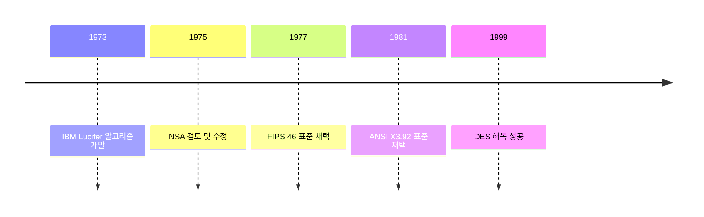

### 2.1.2 알고리즘 구조와 동작 방식 ⚙️

DES는 페이스텔(Feistel) 구조를 기반으로 하며, 64비트 블록 크기와 56비트 키 길이를 사용합니다.

#### 암호화 과정 단계 🔄

```
┌────────────────────────────────┐
│  초기 순열 (Initial Permutation) │
│             ↓                  │
│     16라운드 페이스텔 구조      │
│             ↓                  │
│  최종 순열 (Final Permutation)  │
└────────────────────────────────┘
```

각 라운드의 주요 연산:
1. 확장 순열 (E-box)
2. 키와의 XOR 연산
3. S-box 치환
4. P-box 순열

### 2.1.3 DES의 한계와 취약점 ⚠️

시간이 지남에 따라 DES의 여러 한계점이 드러났습니다:

| 한계점 | 설명 | 영향 |
|--------|------|------|
| 키 길이 부족 | 56비트 키는 현대 컴퓨팅 파워로 해독 가능 | 전수조사 공격에 취약 |
| 블록 크기 제한 | 64비트 블록은 대용량 데이터에 비효율적 | 처리 속도 저하 |
| 대칭성 문제 | 보완키 존재 | 키 공간 축소 |

## 2.2 3DES (Triple DES) 🔒

### 2.2.1 3DES의 등장 배경 📈

DES의 취약점을 보완하기 위해 개발된 3DES는 세 번의 DES 암호화를 수행합니다.

```
평문 → DES(K1) → DES(K2) → DES(K3) → 암호문
```

### 2.2.2 키 옵션과 보안 강도 🔑

3DES는 세 가지 키 옵션을 제공합니다:

1. **3-KEY 옵션** 💪
   - 서로 다른 세 개의 키 사용
   - 실효 키 길이: 168비트
   - 최고 수준의 보안성

2. **2-KEY 옵션** 👍
   - 두 개의 키 사용 (K1 = K3)
   - 실효 키 길이: 112비트
   - 중간 수준의 보안성

3. **1-KEY 옵션** (사용 비권장) ⚠️
   - 동일한 키 반복 사용
   - 실효 키 길이: 56비트
   - DES와 동일한 보안 수준

## 2.3 AES (Advanced Encryption Standard) 🌟

### 2.3.1 AES의 개발 배경과 표준화 과정 📚

AES는 2001년 NIST에 의해 새로운 표준으로 선정된 Rijndael 알고리즘입니다.

**선정 과정:**
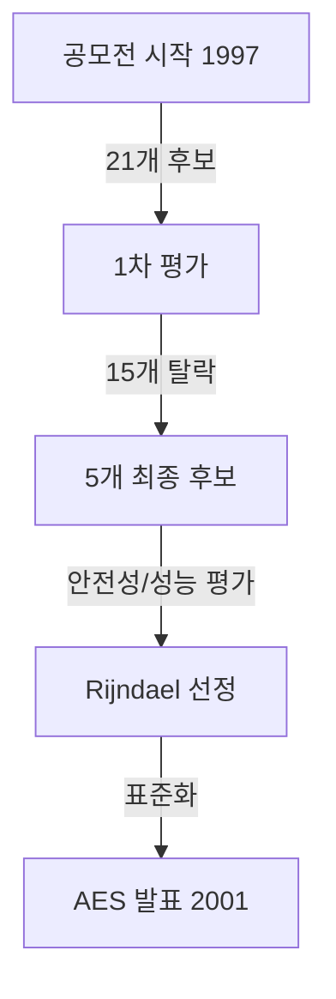

### 2.3.2 AES의 내부 구조 🏗️

AES는 SPN(Substitution-Permutation Network) 구조를 사용하며, 세 가지 키 길이를 지원합니다:

| 키 길이 | 라운드 수 | 보안 강도 |
|---------|-----------|-----------|
| 128비트 | 10라운드 | 높음 |
| 192비트 | 12라운드 | 매우 높음 |
| 256비트 | 14라운드 | 최고 수준 |

#### 각 라운드의 변환 단계 🔄

1. **SubBytes** (바이트 치환)
   ```
   ┌─────┐
   │ S-Box│
   └─────┘
   ```

2. **ShiftRows** (행 이동)
   ```
   ← ← ← 
   ← ← 
   ← 
   ```

3. **MixColumns** (열 혼합)
   ```
   ┌──────────┐
   │ GF(2⁸) × │
   └──────────┘
   ```

4. **AddRoundKey** (라운드 키 더하기)
   ```
   ⊕ (XOR)
   ```

### 2.3.3 하드웨어 가속과 최적화 🚀

현대 프로세서는 AES 전용 명령어를 제공합니다:

- **AES-NI** (Intel/AMD)
  - 암호화/복호화 속도 대폭 향상
  - 부채널 공격 방지
  - 전력 효율성 개선

```c
// AES-NI 사용 예시
__m128i AES_encrypt(__m128i input, __m128i key) {
    return _mm_aesenc_si128(input, key);
}
```

## 2.4 기타 주요 알고리즘 🔍

### 2.4.1 Blowfish와 Twofish 🐡

Blowfish는 Bruce Schneier가 개발한 무료 알고리즘으로, 32-448비트의 가변 키 길이를 지원합니다.

**특징:**
- 빠른 초기화
- 메모리 효율적
- 키 의존적 S-box

Twofish는 Blowfish의 후속 버전으로, AES 공모전 최종 후보였습니다.

### 2.4.2 ChaCha20 🌊

Google이 선호하는 스트림 암호로, 모바일 환경에서 특히 효율적입니다.

**장점:**
- 소프트웨어 구현 효율성
- 병렬 처리 용이
- 높은 보안성

### 2.4.3 ARIA와 SEED 🇰🇷

한국의 국가 표준 블록 암호 알고리즘입니다.

**ARIA:**
- 국가정보원과 학계 공동 개발
- AES와 유사한 구조
- 128/192/256비트 키 지원

**SEED:**
- KISA 개발
- 128비트 블록 크기
- 전자 상거래에서 널리 사용

## 알고리즘 선택 가이드 📋

### 사용 목적별 권장 알고리즘

| 용도 | 권장 알고리즘 | 비고 |
|------|---------------|------|
| 일반 데이터 암호화 | AES-256 | 산업 표준 |
| 모바일/IoT | ChaCha20 | 저전력 효율적 |
| 레거시 시스템 | 3DES | 하위 호환성 |
| 국내 금융권 | SEED | 국내 표준 |

## 마무리 🎯

각 알고리즘은 고유한 특징과 장단점을 가지고 있습니다. 현대의 일반적인 용도에는 AES가 최선의 선택이지만, 특수한 요구사항이 있는 경우 다른 알고리즘도 고려할 수 있습니다.

### 다음 학습 주제 미리보기 📚
- 운영 모드 상세 분석
- 구현 시 고려사항
- 성능 최적화 기법

---

# 3. 운영 모드와 구현 방식 🔄

## 3.1 블록 암호 운영 모드의 이해 📚

블록 암호 운영 모드는 블록 암호 알고리즘을 사용하여 한 블록 이상의 데이터를 안전하게 암호화하는 방법을 정의합니다. 각 모드는 고유한 특성과 보안 속성을 가지고 있어, 사용 사례에 따라 적절한 선택이 필요합니다.

### 3.1.1 ECB (Electronic Codebook) 모드 📖

가장 단순한 운영 모드로, 각 블록을 독립적으로 암호화합니다.

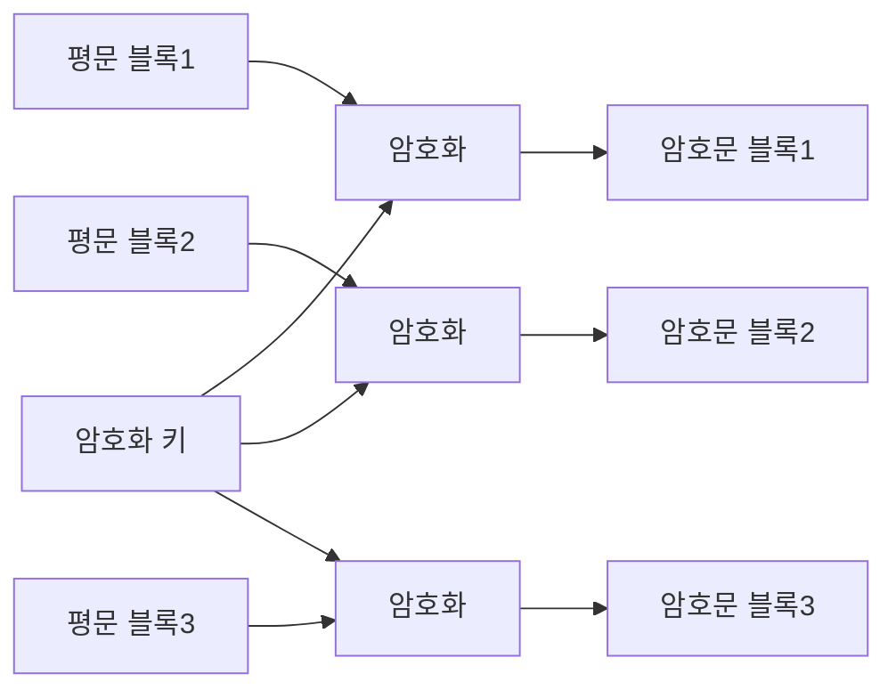

**장점:**
- 구현이 단순
- 병렬 처리 가능
- 오류 전파 없음

**단점:**
- 패턴이 그대로 노출됨
- 재생 공격에 취약
- 데이터 패턴 분석이 용이

### 3.1.2 CBC (Cipher Block Chaining) 모드 🔗

각 블록의 암호화에 이전 블록의 암호문을 사용합니다.

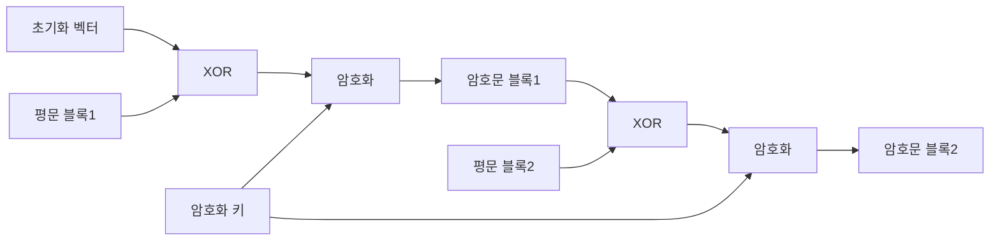

**특징과 고려사항:**
1. 초기화 벡터(IV) 필요
2. 순차적 처리 필요
3. 오류 전파 제한적
4. 높은 보안성

### 3.1.3 CFB (Cipher Feedback) 모드 📤

스트림 암호처럼 동작하는 블록 암호 모드입니다.

```
┌────────────────────────────┐
│          CFB 구조          │
├────────────────────────────┤
│  IV → 암호화 → ⊕ → 암호문  │
│       ↑        ↑          │
│       │        │          │
│       키       평문        │
└────────────────────────────┘
```

**주요 특성:**
- 자기 동기화 가능
- 실시간 처리에 적합
- 비트/바이트 단위 처리 가능

### 3.1.4 OFB (Output Feedback) 모드 🔄

키 스트림을 미리 생성하여 사용하는 모드입니다.

**작동 원리:**
```python
# OFB 모드 의사 코드
def OFB_encrypt(plaintext, key, iv):
    keystream = generate_keystream(key, iv, len(plaintext))
    return xor(plaintext, keystream)
```

### 3.1.5 CTR (Counter) 모드 🔢

카운터 값을 암호화하여 키 스트림을 생성합니다.

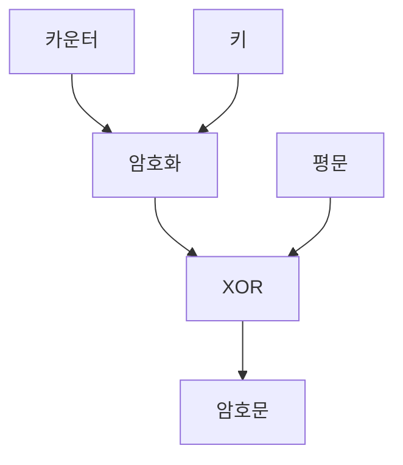

**장점:**
- 완벽한 병렬 처리
- 랜덤 접근 가능
- 전처리 가능

### 3.1.6 GCM (Galois/Counter Mode) 🛡️

인증된 암호화를 제공하는 고급 운영 모드입니다.

**제공하는 보안 속성:**
- 기밀성
- 무결성
- 인증
- 재전송 방지

## 3.2 각 모드별 특징 비교 📊

### 3.2.1 보안성 비교

| 운영 모드 | 기밀성 | 무결성 | 인증 | 재전송 방지 |
|-----------|--------|--------|------|-------------|
| ECB | ⚠️ 낮음 | ❌ | ❌ | ❌ |
| CBC | ✅ 높음 | ⚠️ 제한적 | ❌ | ⚠️ 제한적 |
| CFB | ✅ 높음 | ⚠️ 제한적 | ❌ | ⚠️ 제한적 |
| OFB | ✅ 높음 | ❌ | ❌ | ❌ |
| CTR | ✅ 높음 | ❌ | ❌ | ❌ |
| GCM | ✅ 매우 높음 | ✅ | ✅ | ✅ |

### 3.2.2 성능 특성

**처리 속도 비교:**
```
속도: CTR > ECB > OFB > CBC > CFB > GCM
```

**병렬 처리 가능성:**
- 완벽한 병렬: ECB, CTR, GCM
- 복호화만 병렬: CBC
- 제한적 병렬: CFB, OFB

## 3.3 구현 시 고려사항 ⚙️

### 3.3.1 키 생성과 관리 🔑

**안전한 키 생성:**
```python
# 암호학적으로 안전한 키 생성 예시
from cryptography.hazmat.primitives.kdf.pbkdf2 import PBKDF2HMAC
from cryptography.hazmat.primitives import hashes
from cryptography.hazmat.backends import default_backend
import os

def generate_key():
    salt = os.urandom(16)
    kdf = PBKDF2HMAC(
        algorithm=hashes.SHA256(),
        length=32,
        salt=salt,
        iterations=100000,
        backend=default_backend()
    )
    key = kdf.derive(b"password")
    return key, salt
```

### 3.3.2 IV 처리 🎲

**IV 생성 모범 사례:**
1. 충분한 길이 (최소 블록 크기)
2. 무작위성 보장
3. 재사용 방지
4. 안전한 전달 방식

### 3.3.3 패딩 방식 📏

**PKCS7 패딩 구현:**
```python
def pkcs7_pad(data, block_size):
    padding_length = block_size - (len(data) % block_size)
    padding = bytes([padding_length] * padding_length)
    return data + padding
```

## 3.4 실제 구현 예시 💻

### 3.4.1 AES-GCM 구현 예시

```python
from cryptography.hazmat.primitives.ciphers.aead import AESGCM
import os

def encrypt_file_gcm(key, plaintext):
    nonce = os.urandom(12)
    aad = b"additional authenticated data"
    
    aesgcm = AESGCM(key)
    ciphertext = aesgcm.encrypt(nonce, plaintext, aad)
    
    return nonce, ciphertext, aad
```

### 3.4.2 오류 처리 예시

```python
try:
    decrypted = cipher.decrypt(nonce, ciphertext, aad)
except InvalidTag:
    logging.error("무결성 검증 실패")
except Exception as e:
    logging.error(f"복호화 중 오류 발생: {e}")
```

## 3.5 모드 선택 가이드 📋

### 3.5.1 사용 사례별 권장 모드

| 사용 사례 | 권장 모드 | 이유 |
|-----------|-----------|------|
| 일반 파일 암호화 | GCM | 무결성 보장 |
| 데이터베이스 필드 | CBC | 보편적 지원 |
| 스트리밍 데이터 | CTR | 빠른 처리 |
| 실시간 통신 | GCM | 인증 제공 |

### 3.5.2 구현 체크리스트 ✅

1. 키 관리
   - [ ] 안전한 키 생성
   - [ ] 적절한 키 길이
   - [ ] 키 저장소 보안

2. IV/논스 처리
   - [ ] 무작위 생성
   - [ ] 재사용 방지
   - [ ] 안전한 전달

3. 예외 처리
   - [ ] 무결성 검증
   - [ ] 오류 복구
   - [ ] 로깅

## 마무리 🎯

운영 모드의 선택은 시스템의 보안성과 성능에 직접적인 영향을 미칩니다. 현대의 애플리케이션에서는 GCM과 같은 인증된 암호화 모드의 사용을 권장하며, 특수한 요구사항이 있는 경우 다른 모드들도 고려할 수 있습니다.

### 다음 학습 주제 📚
- 키 관리 심화
- 성능 최적화
- 보안 감사

---

# 4. 실제 적용 사례와 모범 사례 💡

## 4.1 파일 암호화 구현 📁

파일 시스템에서의 암호화는 중요한 데이터를 보호하는 가장 기본적인 방법입니다. 다음은 안전하고 효율적인 파일 암호화 구현 방법을 설명합니다.

### 4.1.1 전체 파일 암호화 시스템 🔐

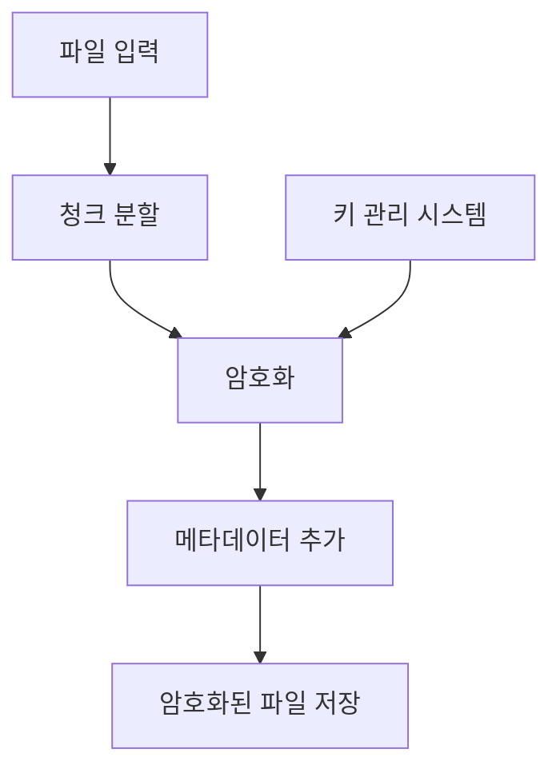

**구현 예시 (Python):**
```python
from cryptography.fernet import Fernet
import os

class SecureFileEncryption:
    def __init__(self):
        self.key = Fernet.generate_key()
        self.cipher_suite = Fernet(self.key)
        
    def encrypt_file(self, file_path):
        chunk_size = 64 * 1024  # 64KB 청크
        
        with open(file_path, 'rb') as file:
            with open(file_path + '.encrypted', 'wb') as encrypted_file:
                while True:
                    chunk = file.read(chunk_size)
                    if not chunk:
                        break
                    encrypted_chunk = self.cipher_suite.encrypt(chunk)
                    encrypted_file.write(encrypted_chunk)

    def decrypt_file(self, encrypted_file_path):
        # 복호화 로직 구현
        pass
```

### 4.1.2 스트리밍 데이터 처리 📊

대용량 파일이나 실시간 스트리밍 데이터를 처리할 때는 다음과 같은 방식을 사용합니다:

```python
def encrypt_stream(stream, key, chunk_size=8192):
    cipher = AES.new(key, AES.MODE_CTR)
    
    for chunk in iter(lambda: stream.read(chunk_size), b''):
        encrypted_chunk = cipher.encrypt(chunk)
        yield encrypted_chunk
```

## 4.2 데이터베이스 암호화 💾

### 4.2.1 컬럼 레벨 암호화

민감한 데이터가 포함된 특정 컬럼만 암호화하는 방식입니다.

```sql
-- 암호화된 컬럼을 가진 테이블 생성 예시
CREATE TABLE customers (
    id SERIAL PRIMARY KEY,
    name VARCHAR(100),
    email VARCHAR(255),
    encrypted_ssn BYTEA,  -- 암호화된 주민번호
    encrypted_card BYTEA  -- 암호화된 카드 정보
);
```

**구현 예시 (Python with SQLAlchemy):**
```python
from sqlalchemy import Column, Integer, String, LargeBinary
from sqlalchemy.ext.declarative import declarative_base

Base = declarative_base()

class Customer(Base):
    __tablename__ = 'customers'
    
    id = Column(Integer, primary_key=True)
    name = Column(String)
    email = Column(String)
    encrypted_ssn = Column(LargeBinary)
    encrypted_card = Column(LargeBinary)
    
    def encrypt_sensitive_data(self, encryption_key):
        cipher = AES.new(encryption_key, AES.MODE_GCM)
        self.encrypted_ssn = cipher.encrypt(self.ssn.encode())
        self.encrypted_card = cipher.encrypt(self.card_number.encode())
```

### 4.2.2 검색 가능한 암호화 구현 🔍

```python
def searchable_encrypt(plaintext, key):
    """검색 가능한 암호화 구현"""
    # 1. 원본 데이터 암호화
    encrypted_data = encrypt(plaintext, key)
    
    # 2. 검색 인덱스 생성
    search_index = create_search_index(plaintext)
    
    return encrypted_data, search_index
```

## 4.3 통신 데이터 암호화 🌐

### 4.3.1 소켓 통신 암호화

```python
class SecureSocket:
    def __init__(self, host, port):
        self.socket = socket.socket(socket.AF_INET, socket.SOCK_STREAM)
        self.cipher = AES.new(key, AES.MODE_GCM)
        
    def secure_send(self, data):
        """암호화된 데이터 전송"""
        nonce = self.cipher.nonce
        encrypted_data = self.cipher.encrypt(data)
        self.socket.send(nonce + encrypted_data)
```

### 4.3.2 실시간 데이터 스트림 처리 🔄

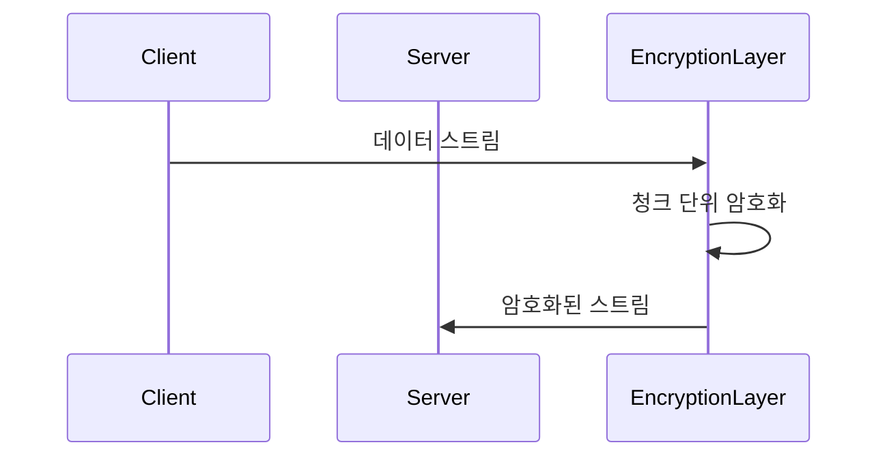

## 4.4 클라우드 환경에서의 암호화 ☁️

### 4.4.1 AWS KMS 활용 예시

```python
import boto3

class CloudEncryption:
    def __init__(self):
        self.kms = boto3.client('kms')
        
    def encrypt_data(self, data, key_id):
        response = self.kms.encrypt(
            KeyId=key_id,
            Plaintext=data
        )
        return response['CiphertextBlob']
```

### 4.4.2 멀티 테넌트 환경 고려사항

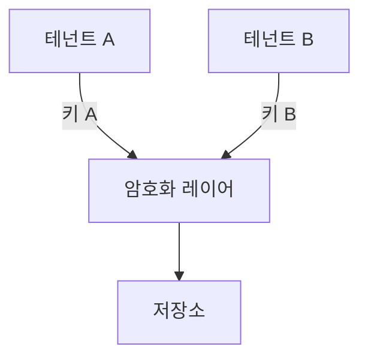

## 4.5 모범 사례 및 권장 사항 ✨

### 4.5.1 키 관리 모범 사례

1. **키 생성**
```python
def generate_secure_key():
    """암호학적으로 안전한 키 생성"""
    key = os.urandom(32)  # 256비트 키
    key_id = str(uuid.uuid4())
    return key_id, key
```

2. **키 순환 정책**
```python
class KeyRotation:
    def __init__(self):
        self.rotation_period = timedelta(days=90)
        
    def should_rotate(self, key_creation_date):
        return datetime.now() - key_creation_date > self.rotation_period
```

### 4.5.2 오류 처리 및 복구 전략

```python
class SecureOperation:
    def handle_encryption_error(self, error):
        if isinstance(error, InvalidKey):
            self.log_security_event("잘못된 키 사용 시도")
            raise SecurityException("유효하지 않은 키")
        elif isinstance(error, PaddingError):
            self.log_security_event("패딩 오류 발생")
            raise SecurityException("암호화 처리 오류")
```

### 4.5.3 보안 감사 및 모니터링 📊

```python
class SecurityAudit:
    def log_encryption_event(self, event_type, details):
        log_entry = {
            'timestamp': datetime.now().isoformat(),
            'event_type': event_type,
            'details': details,
            'source_ip': self.get_source_ip(),
            'user_id': self.get_current_user()
        }
        self.audit_logger.info(json.dumps(log_entry))
```

## 4.6 성능 최적화 🚀

### 4.6.1 병렬 처리 구현

```python
from concurrent.futures import ThreadPoolExecutor

def parallel_encrypt(data_chunks, key):
    with ThreadPoolExecutor(max_workers=4) as executor:
        encrypted_chunks = list(executor.map(
            lambda chunk: encrypt_chunk(chunk, key),
            data_chunks
        ))
    return encrypted_chunks
```

### 4.6.2 캐시 활용 전략

```python
from functools import lru_cache

@lru_cache(maxsize=1000)
def get_encryption_key(key_id):
    """자주 사용되는 키의 캐시 처리"""
    return key_storage.get_key(key_id)
```

## 마무리 🎯

실제 환경에서 암호화를 구현할 때는 다음 사항을 항상 고려해야 합니다:

1. 보안성과 성능의 균형
2. 키 관리의 중요성
3. 오류 처리와 복구 계획
4. 감사와 모니터링의 필요성

### 체크리스트 ✅

- [ ] 암호화 알고리즘 선택
- [ ] 키 관리 정책 수립
- [ ] 오류 처리 구현
- [ ] 로깅 시스템 구축
- [ ] 성능 최적화 적용
- [ ] 보안 감사 계획 수립

---

# 5. 보안 고려사항과 모범 사례 🛡️

## 5.1 알고리즘 선택 기준 🎯

암호화 알고리즘 선택은 시스템의 전반적인 보안성을 결정짓는 중요한 요소입니다. 다음은 상황별 최적의 알고리즘을 선택하기 위한 체계적인 접근 방법을 설명합니다.

### 5.1.1 보안 요구사항 분석 📋

보안 요구사항은 다음과 같은 관점에서 분석되어야 합니다:

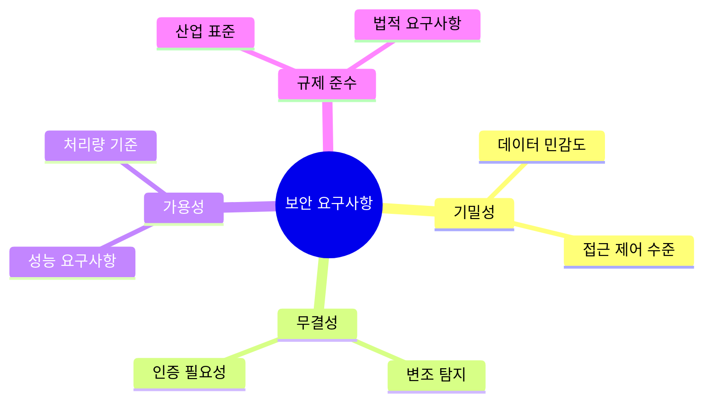

### 5.1.2 성능 요구사항 고려 ⚡

시스템의 성능 요구사항을 평가하는 주요 지표:

```python
class PerformanceMetrics:
    def __init__(self):
        self.metrics = {
            'throughput': {
                'min': '100MB/s',
                'target': '500MB/s',
                'max_latency': '50ms'
            },
            'resource_usage': {
                'cpu_max': '80%',
                'memory_max': '2GB',
                'storage_iops': '1000'
            }
        }
```

### 5.1.3 규제 및 컴플라이언스 📜

주요 규제 요구사항과 대응 방안:

| 규제 | 요구사항 | 권장 알고리즘 |
|------|----------|--------------|
| GDPR | 강력한 암호화 | AES-256-GCM |
| PCI DSS | 카드 데이터 보호 | 3DES/AES |
| HIPAA | 의료정보 보호 | AES-256 |
| CCPA | 개인정보 보호 | AES/ChaCha20 |

## 5.2 키 관리 전략 🔑

### 5.2.1 키 생성 모범 사례 🎲

안전한 키 생성을 위한 구현 예시:

```python
from cryptography.hazmat.primitives.kdf.pbkdf2 import PBKDF2HMAC
from cryptography.hazmat.primitives import hashes
import os

class KeyGenerator:
    def generate_key(self, purpose):
        """암호학적으로 안전한 키 생성"""
        salt = os.urandom(16)
        kdf = PBKDF2HMAC(
            algorithm=hashes.SHA256(),
            length=32,
            salt=salt,
            iterations=480000,
        )
        
        key = {
            'id': str(uuid.uuid4()),
            'created_at': datetime.now(),
            'purpose': purpose,
            'value': base64.b64encode(kdf.derive(os.urandom(32))),
            'salt': base64.b64encode(salt)
        }
        
        self._audit_key_creation(key['id'])
        return key
```

### 5.2.2 키 저장과 전송 🔒

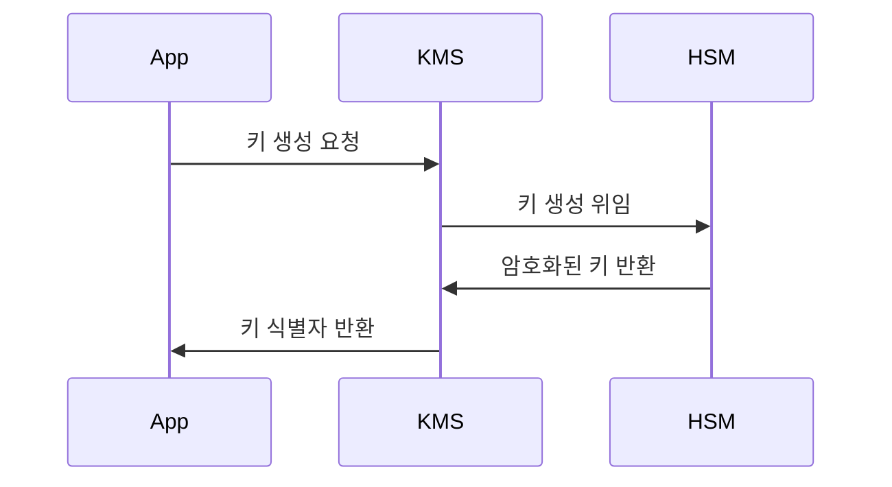

### 5.2.3 키 교체(Rotation) 정책 🔄

```python
class KeyRotationPolicy:
    def __init__(self):
        self.rotation_intervals = {
            'data_encryption_key': timedelta(days=90),
            'master_key': timedelta(days=365),
            'signing_key': timedelta(days=180)
        }
    
    def schedule_rotation(self, key_type, creation_date):
        interval = self.rotation_intervals[key_type]
        return creation_date + interval
```

## 5.3 공통적인 취약점과 대응 ⚔️

### 5.3.1 키 노출 방지 🛡️

키 보호를 위한 보안 계층 구현:

```python
class KeyProtection:
    def __init__(self):
        self.access_control = AccessControl()
        self.encryption_at_rest = EncryptionAtRest()
        self.audit_logger = AuditLogger()
    
    def secure_key_access(self, key_id, user_context):
        """다중 보안 계층을 통한 키 접근 제어"""
        if not self.access_control.validate_access(user_context):
            self.audit_logger.log_unauthorized_access(key_id)
            raise SecurityException("Unauthorized key access")
            
        return self.encryption_at_rest.decrypt_key(key_id)
```

### 5.3.2 부채널 공격 대응 🕵️

시간 기반 부채널 공격 방지를 위한 구현:

```python
def constant_time_compare(val1, val2):
    """상수 시간 비교 구현"""
    if len(val1) != len(val2):
        return False
    
    result = 0
    for x, y in zip(val1, val2):
        result |= x ^ y
    return result == 0
```

### 5.3.3 구현 상의 실수 예방 🐛

보안 코드 리뷰 체크리스트:

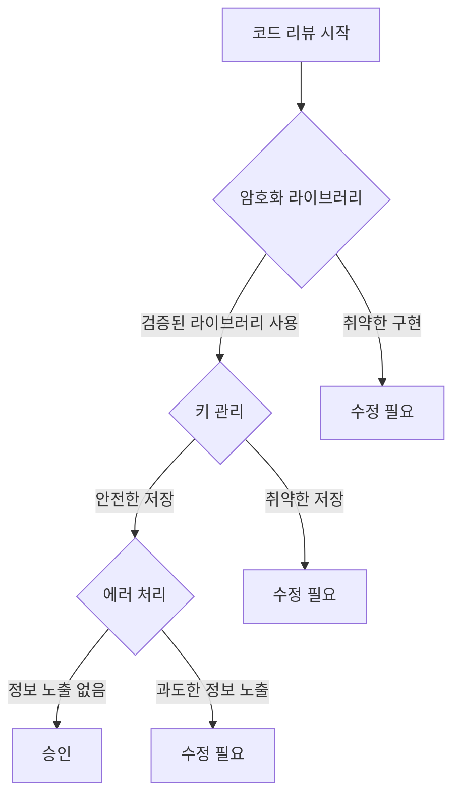

## 5.4 암호화 구현 검증 ✅

### 5.4.1 테스트 전략 🧪

```python
class CryptoTestSuite:
    def test_encryption_correctness(self):
        """암호화/복호화 정확성 검증"""
        test_data = self.generate_test_vectors()
        for vector in test_data:
            encrypted = self.crypto_service.encrypt(vector.plaintext)
            decrypted = self.crypto_service.decrypt(encrypted)
            assert vector.plaintext == decrypted
    
    def test_key_rotation(self):
        """키 교체 프로세스 검증"""
        old_key = self.key_service.current_key
        self.key_service.rotate_keys()
        new_key = self.key_service.current_key
        assert old_key != new_key
```

### 5.4.2 보안 감사 📊

자동화된 보안 감사 구현:

```python
class SecurityAudit:
    def __init__(self):
        self.alerts = AlertSystem()
        self.metrics = MetricsCollector()
    
    def audit_crypto_operations(self):
        """암호화 작업 감사"""
        metrics = self.metrics.collect_crypto_metrics()
        
        if metrics.failed_operations > threshold:
            self.alerts.send_alert(
                level="HIGH",
                message="비정상적인 암호화 작업 실패 감지"
            )
```

## 5.5 위기 대응 계획 🚨

### 5.5.1 키 노출 대응 절차


### 5.5.2 복구 절차 📋

1. 즉각적인 키 비활성화
2. 영향 범위 평가
3. 새로운 키로 데이터 재암호화
4. 시스템 복구 및 검증
5. 사후 분석 및 개선

## 마무리 및 권장사항 💫

암호화 시스템의 안전한 운영을 위한 핵심 권장사항:

1. 정기적인 보안 감사 실시
2. 자동화된 모니터링 구축
3. 지속적인 교육과 훈련
4. 최신 보안 동향 파악
5. 사고 대응 계획 수립

### 향후 고려사항 🔮

1. 양자 내성 암호화 준비
2. 제로 트러스트 아키텍처 도입
3. 자동화된 키 관리 고도화
4. AI 기반 보안 위협 탐지

---

# 6. 성능 최적화와 문제 해결 🚀

## 6.1 성능 최적화 기법 ⚡

암호화 작업은 시스템 리소스를 많이 사용하는 작업입니다. 효율적인 구현을 통해 최적의 성능을 달성하는 방법을 살펴보겠습니다.

### 6.1.1 하드웨어 가속 활용 💻

현대 프로세서는 암호화 작업을 위한 특별한 명령어 세트를 제공합니다. 이를 활용하면 성능을 크게 향상시킬 수 있습니다.

```python
from cryptography.hazmat.primitives.ciphers import Cipher, algorithms, modes
from cryptography.hazmat.backends.openssl.backend import backend

class OptimizedAESEncryption:
    def __init__(self):
        self.backend = backend  # OpenSSL 백엔드는 자동으로 AES-NI 활용
        
    def create_cipher(self, key):
        """하드웨어 가속을 활용하는 AES 암호화 구현"""
        if self.check_aesni_support():
            return Cipher(
                algorithms.AES(key),
                modes.GCM(),
                backend=self.backend
            )
        else:
            return self.create_fallback_cipher(key)
            
    def check_aesni_support(self):
        """AES-NI 지원 여부 확인"""
        try:
            import cpuinfo
            features = cpuinfo.get_cpu_info()['flags']
            return 'aes' in features
        except ImportError:
            return False
```

성능 측정 결과 예시:

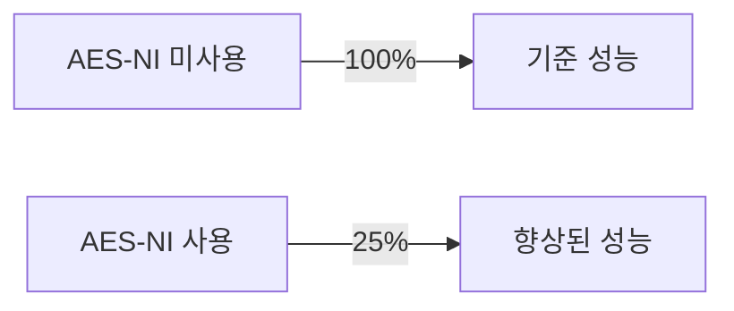

### 6.1.2 병렬 처리 구현 🔄

대용량 데이터 처리 시 병렬화를 통한 성능 최적화:

```python
from concurrent.futures import ThreadPoolExecutor
import multiprocessing

class ParallelEncryption:
    def __init__(self):
        self.num_cores = multiprocessing.cpu_count()
        
    def parallel_encrypt(self, data_chunks):
        """청크 단위 병렬 암호화 처리"""
        with ThreadPoolExecutor(max_workers=self.num_cores) as executor:
            encrypted_chunks = list(executor.map(
                self.encrypt_chunk,
                data_chunks
            ))
        return self.merge_chunks(encrypted_chunks)
    
    def optimize_chunk_size(self, total_size):
        """최적의 청크 크기 계산"""
        base_chunk = 64 * 1024  # 64KB
        return min(base_chunk * self.num_cores, total_size // self.num_cores)
```

### 6.1.3 메모리 사용 최적화 💾

메모리 효율적인 암호화 처리를 위한 스트리밍 구현:

```python
class MemoryEfficientEncryption:
    def __init__(self, chunk_size=8192):
        self.chunk_size = chunk_size
    
    def encrypt_stream(self, input_stream, output_stream):
        """스트리밍 방식의 암호화 구현"""
        cipher = self.create_cipher()
        
        while True:
            chunk = input_stream.read(self.chunk_size)
            if not chunk:
                break
                
            encrypted_chunk = cipher.update(chunk)
            output_stream.write(encrypted_chunk)
            
        output_stream.write(cipher.finalize())
```

## 6.2 성능 모니터링 및 프로파일링 📊

### 6.2.1 성능 메트릭 수집

```python
class CryptoPerformanceMonitor:
    def __init__(self):
        self.metrics = {
            'encryption_time': [],
            'memory_usage': [],
            'cpu_usage': [],
            'throughput': []
        }
    
    def measure_operation(self, operation_func):
        """암호화 작업의 성능 측정"""
        start_time = time.time()
        start_memory = self.get_memory_usage()
        
        result = operation_func()
        
        end_time = time.time()
        end_memory = self.get_memory_usage()
        
        self.metrics['encryption_time'].append(end_time - start_time)
        self.metrics['memory_usage'].append(end_memory - start_memory)
        
        return result
```

### 6.2.2 성능 병목 식별

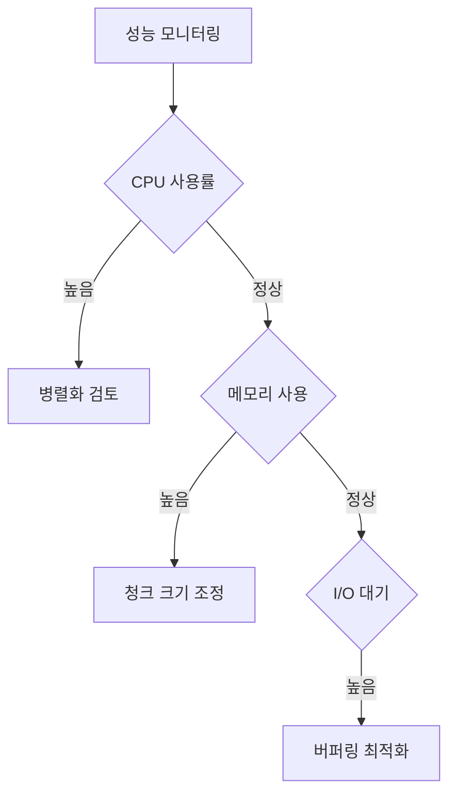

## 6.3 일반적인 문제와 해결 방안 🔧

### 6.3.1 메모리 누수 방지

```python
class ResourceManager:
    def __init__(self):
        self._resources = weakref.WeakSet()
        
    def register_resource(self, resource):
        """리소스 사용 추적"""
        self._resources.add(resource)
        
    def cleanup(self):
        """사용하지 않는 리소스 정리"""
        for resource in self._resources:
            if not resource.is_active():
                resource.release()
```

### 6.3.2 오류 처리와 복구

```python
class RobustEncryption:
    def encrypt_with_retry(self, data, max_retries=3):
        """재시도 로직이 포함된 암호화 구현"""
        for attempt in range(max_retries):
            try:
                return self.encrypt(data)
            except MemoryError:
                self.clear_cache()
                continue
            except CipherError as e:
                if self.is_recoverable(e):
                    self.reset_cipher()
                    continue
                raise
```

## 6.4 성능 튜닝 가이드 🎯

### 6.4.1 시스템 구성에 따른 최적화

```python
class SystemOptimizer:
    def optimize_for_system(self):
        """시스템 특성에 따른 최적화 설정"""
        config = {
            'chunk_size': self.calculate_optimal_chunk_size(),
            'parallel_threads': self.get_optimal_thread_count(),
            'buffer_size': self.get_optimal_buffer_size()
        }
        return config
        
    def calculate_optimal_chunk_size(self):
        """시스템 메모리에 따른 청크 크기 계산"""
        available_memory = psutil.virtual_memory().available
        return min(available_memory // 10, 1024 * 1024)  # 최대 1MB
```

### 6.4.2 워크로드별 최적화 전략

대용량 파일 암호화:
```python
class LargeFileProcessor:
    def process_large_file(self, file_path):
        chunk_size = self.optimize_chunk_size()
        with ThreadPoolExecutor() as executor:
            with open(file_path, 'rb') as f:
                chunks = iter(lambda: f.read(chunk_size), b'')
                futures = [executor.submit(self.process_chunk, c) 
                          for c in chunks]
                results = [f.result() for f in futures]
```

## 6.5 문제 해결 체크리스트 ✅

### 6.5.1 성능 문제 진단

1. CPU 사용률 모니터링
2. 메모리 사용량 추적
3. I/O 병목 확인
4. 네트워크 지연 측정
5. 시스템 로그 분석

### 6.5.2 최적화 적용 단계

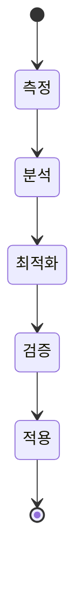

## 마무리 🎯

성능 최적화는 지속적인 모니터링과 개선이 필요한 과정입니다. 다음 사항을 항상 고려하세요:

1. 정기적인 성능 측정
2. 시스템 리소스 모니터링
3. 사용 패턴 분석
4. 최적화 효과 검증

### 추가 고려사항 💡

1. 클라우드 환경에서의 최적화
2. 마이크로서비스 아키텍처 고려
3. 컨테이너화된 환경 지원
4. 확장성 있는 설계

---

# 7. 실습 및 예제 코드 (Go) 💻

## 7.1 기본 구현 예제 🔰

### 7.1.1 AES 암호화/복호화 기본 구현

먼저 AES 암호화의 기본적인 구현을 살펴보겠습니다.

```go
package main

import (
    "crypto/aes"
    "crypto/cipher"
    "crypto/rand"
    "encoding/base64"
    "fmt"
    "io"
)

// CryptoService는 암호화 관련 기능을 제공하는 서비스 구조체입니다.
type CryptoService struct {
    key []byte
}

// NewCryptoService는 새로운 CryptoService 인스턴스를 생성합니다.
func NewCryptoService(key []byte) (*CryptoService, error) {
    if len(key) != 32 {
        return nil, fmt.Errorf("키는 32바이트여야 합니다")
    }
    return &CryptoService{key: key}, nil
}

// Encrypt는 평문을 AES-GCM으로 암호화합니다.
func (s *CryptoService) Encrypt(plaintext []byte) ([]byte, error) {
    block, err := aes.NewCipher(s.key)
    if err != nil {
        return nil, fmt.Errorf("cipher 생성 실패: %v", err)
    }

    gcm, err := cipher.NewGCM(block)
    if err != nil {
        return nil, fmt.Errorf("GCM 모드 초기화 실패: %v", err)
    }

    nonce := make([]byte, gcm.NonceSize())
    if _, err := io.ReadFull(rand.Reader, nonce); err != nil {
        return nil, fmt.Errorf("nonce 생성 실패: %v", err)
    }

    ciphertext := gcm.Seal(nonce, nonce, plaintext, nil)
    return ciphertext, nil
}

// Decrypt는 암호문을 AES-GCM으로 복호화합니다.
func (s *CryptoService) Decrypt(ciphertext []byte) ([]byte, error) {
    block, err := aes.NewCipher(s.key)
    if err != nil {
        return nil, fmt.Errorf("cipher 생성 실패: %v", err)
    }

    gcm, err := cipher.NewGCM(block)
    if err != nil {
        return nil, fmt.Errorf("GCM 모드 초기화 실패: %v", err)
    }

    nonceSize := gcm.NonceSize()
    if len(ciphertext) < nonceSize {
        return nil, fmt.Errorf("암호문이 너무 짧습니다")
    }

    nonce, ciphertext := ciphertext[:nonceSize], ciphertext[nonceSize:]
    plaintext, err := gcm.Open(nil, nonce, ciphertext, nil)
    if err != nil {
        return nil, fmt.Errorf("복호화 실패: %v", err)
    }

    return plaintext, nil
}
```

### 7.1.2 파일 암호화 구현

대용량 파일을 효율적으로 암호화하는 예제입니다.

```go
package main

import (
    "bufio"
    "crypto/aes"
    "crypto/cipher"
    "crypto/rand"
    "fmt"
    "io"
    "os"
)

// FileEncryptor는 파일 암호화를 담당하는 구조체입니다.
type FileEncryptor struct {
    key     []byte
    bufSize int
}

// NewFileEncryptor는 새로운 FileEncryptor 인스턴스를 생성합니다.
func NewFileEncryptor(key []byte) *FileEncryptor {
    return &FileEncryptor{
        key:     key,
        bufSize: 4096, // 4KB 버퍼
    }
}

// EncryptFile은 파일을 암호화합니다.
func (fe *FileEncryptor) EncryptFile(inputPath, outputPath string) error {
    input, err := os.Open(inputPath)
    if err != nil {
        return fmt.Errorf("입력 파일 열기 실패: %v", err)
    }
    defer input.Close()

    output, err := os.Create(outputPath)
    if err != nil {
        return fmt.Errorf("출력 파일 생성 실패: %v", err)
    }
    defer output.Close()

    block, err := aes.NewCipher(fe.key)
    if err != nil {
        return fmt.Errorf("cipher 생성 실패: %v", err)
    }

    // GCM 모드 설정
    gcm, err := cipher.NewGCM(block)
    if err != nil {
        return fmt.Errorf("GCM 모드 초기화 실패: %v", err)
    }

    // Nonce 생성 및 쓰기
    nonce := make([]byte, gcm.NonceSize())
    if _, err := io.ReadFull(rand.Reader, nonce); err != nil {
        return fmt.Errorf("nonce 생성 실패: %v", err)
    }
    if _, err := output.Write(nonce); err != nil {
        return fmt.Errorf("nonce 쓰기 실패: %v", err)
    }

    // 버퍼를 사용한 암호화
    reader := bufio.NewReader(input)
    writer := bufio.NewWriter(output)
    buf := make([]byte, fe.bufSize)

    for {
        n, err := reader.Read(buf)
        if err == io.EOF {
            break
        }
        if err != nil {
            return fmt.Errorf("읽기 실패: %v", err)
        }

        encrypted := gcm.Seal(nil, nonce, buf[:n], nil)
        if _, err := writer.Write(encrypted); err != nil {
            return fmt.Errorf("쓰기 실패: %v", err)
        }
    }

    return writer.Flush()
}
```

## 7.2 실전 응용 예제 🚀

### 7.2.1 데이터베이스 필드 암호화

민감한 데이터베이스 필드를 암호화하는 예제입니다.

```go
package main

import (
    "database/sql"
    "encoding/base64"
    "time"
)

// EncryptedField는 암호화된 필드를 표현하는 구조체입니다.
type EncryptedField struct {
    Data      []byte
    UpdatedAt time.Time
}

// UserData는 사용자 데이터를 표현하는 구조체입니다.
type UserData struct {
    ID         int64
    Email      string
    SSN        EncryptedField
    CreditCard EncryptedField
}

// DatabaseEncryption은 데이터베이스 암호화를 담당하는 구조체입니다.
type DatabaseEncryption struct {
    crypto *CryptoService
    db     *sql.DB
}

func (de *DatabaseEncryption) SaveUser(user *UserData) error {
    // SSN 암호화
    encryptedSSN, err := de.crypto.Encrypt([]byte(user.SSN.Data))
    if err != nil {
        return fmt.Errorf("SSN 암호화 실패: %v", err)
    }

    // 신용카드 정보 암호화
    encryptedCC, err := de.crypto.Encrypt([]byte(user.CreditCard.Data))
    if err != nil {
        return fmt.Errorf("신용카드 정보 암호화 실패: %v", err)
    }

    // 데이터베이스에 저장
    query := `
        INSERT INTO users (email, encrypted_ssn, encrypted_cc, updated_at)
        VALUES (?, ?, ?, ?)
    `
    _, err = de.db.Exec(query,
        user.Email,
        base64.StdEncoding.EncodeToString(encryptedSSN),
        base64.StdEncoding.EncodeToString(encryptedCC),
        time.Now(),
    )
    
    return err
}
```

### 7.2.2 실시간 스트림 암호화

네트워크 스트림을 실시간으로 암호화하는 예제입니다.

```go
package main

import (
    "crypto/aes"
    "crypto/cipher"
    "io"
    "net"
)

// StreamEncryptor는 스트림 암호화를 담당하는 구조체입니다.
type StreamEncryptor struct {
    key  []byte
    conn net.Conn
}

// NewStreamEncryptor는 새로운 StreamEncryptor 인스턴스를 생성합니다.
func NewStreamEncryptor(key []byte, conn net.Conn) *StreamEncryptor {
    return &StreamEncryptor{
        key:  key,
        conn: conn,
    }
}

// EncryptStream은 데이터 스트림을 암호화합니다.
func (se *StreamEncryptor) EncryptStream(reader io.Reader) error {
    block, err := aes.NewCipher(se.key)
    if err != nil {
        return fmt.Errorf("cipher 생성 실패: %v", err)
    }

    gcm, err := cipher.NewGCM(block)
    if err != nil {
        return fmt.Errorf("GCM 모드 초기화 실패: %v", err)
    }

    nonce := make([]byte, gcm.NonceSize())
    if _, err := io.ReadFull(rand.Reader, nonce); err != nil {
        return fmt.Errorf("nonce 생성 실패: %v", err)
    }

    // Nonce 전송
    if _, err := se.conn.Write(nonce); err != nil {
        return fmt.Errorf("nonce 전송 실패: %v", err)
    }

    // 스트림 암호화 및 전송
    buf := make([]byte, 1024)
    for {
        n, err := reader.Read(buf)
        if err == io.EOF {
            break
        }
        if err != nil {
            return fmt.Errorf("읽기 실패: %v", err)
        }

        encrypted := gcm.Seal(nil, nonce, buf[:n], nil)
        if _, err := se.conn.Write(encrypted); err != nil {
            return fmt.Errorf("암호화된 데이터 전송 실패: %v", err)
        }
    }

    return nil
}
```

## 7.3 성능 테스트와 벤치마킹 📊

### 7.3.1 암호화 성능 벤치마크

```go
package main

import (
    "testing"
    "crypto/rand"
)

func BenchmarkEncryption(b *testing.B) {
    // 테스트 데이터 준비
    key := make([]byte, 32)
    if _, err := rand.Read(key); err != nil {
        b.Fatal(err)
    }

    data := make([]byte, 1024*1024) // 1MB
    if _, err := rand.Read(data); err != nil {
        b.Fatal(err)
    }

    crypto, err := NewCryptoService(key)
    if err != nil {
        b.Fatal(err)
    }

    b.ResetTimer()
    for i := 0; i < b.N; i++ {
        if _, err := crypto.Encrypt(data); err != nil {
            b.Fatal(err)
        }
    }
}
```

### 7.3.2 파일 처리 성능 테스트

```go
package main

import (
    "os"
    "testing"
)

func TestFileEncryptionPerformance(t *testing.T) {
    // 테스트 파일 생성
    testFile := "test.dat"
    f, err := os.Create(testFile)
    if err != nil {
        t.Fatal(err)
    }
    defer os.Remove(testFile)

    // 100MB 테스트 데이터 생성
    data := make([]byte, 100*1024*1024)
    if _, err := rand.Read(data); err != nil {
        t.Fatal(err)
    }

    if _, err := f.Write(data); err != nil {
        t.Fatal(err)
    }
    f.Close()

    // 암호화 테스트
    key := make([]byte, 32)
    if _, err := rand.Read(key); err != nil {
        t.Fatal(err)
    }

    encryptor := NewFileEncryptor(key)
    
    start := time.Now()
    err = encryptor.EncryptFile(testFile, testFile+".encrypted")
    if err != nil {
        t.Fatal(err)
    }
    
    t.Logf("암호화 소요 시간: %v", time.Since(start))
}
```

## 마무리 🎯

이상의 예제 코드들은 실제 프로덕션 환경에서 활용할 수 있는 기본적인 구현을 보여줍니다. 실제 사용 시에는 다음 사항들을 추가로 고려해야 합니다:

1. 에러 처리 강화
2. 로깅 추가
3. 메모리 사용량 최적화
4. 동시성 처리
5. 키 관리 시스템 연동

### 추가 학습 자료 📚

- Go 암호화 패키지 문서
- 보안 코딩 가이드라인
- 성능 최적화 기법
- 테스트 방법론

---

# 8. 참고 자료 및 학습 리소스 📚

## 8.1 공식 문서 및 표준 📋

### 8.1.1 암호화 표준 문서
- **NIST 암호화 표준**
  - [NIST SP 800-38A: 블록 암호 운영 모드](https://csrc.nist.gov/publications/detail/sp/800-38a/final)
  - [NIST SP 800-57: 키 관리 지침](https://csrc.nist.gov/publications/detail/sp/800-57-part-1/rev-5/final)
  - [FIPS 197: AES 표준](https://csrc.nist.gov/publications/detail/fips/197/final)

### 8.1.2 프로그래밍 언어별 암호화 라이브러리 문서 🔐
- **Go 언어**
  - [crypto 패키지 공식 문서](https://golang.org/pkg/crypto/)
  - [crypto/aes 패키지](https://golang.org/pkg/crypto/aes/)
  - [crypto/cipher 패키지](https://golang.org/pkg/crypto/cipher/)

- **Java 언어**
  - [javax.crypto 패키지](https://docs.oracle.com/javase/8/docs/api/javax/crypto/package-summary.html)
  - [Java Security Standard Algorithm Names](https://docs.oracle.com/javase/8/docs/technotes/guides/security/StandardNames.html)

- **Python 언어**
  - [PyCrypto 문서](https://www.dlitz.net/software/pycrypto/)
  - [cryptography 라이브러리](https://cryptography.io/en/latest/)

## 8.2 보안 도구 및 유틸리티 🛠️

### 8.2.1 암호화 도구
- **OpenSSL**
  - [OpenSSL 공식 사이트](https://www.openssl.org/)
  - [OpenSSL 명령어 가이드](https://www.openssl.org/docs/manmaster/man1/)

- **GnuPG (GPG)**
  - [GnuPG 공식 사이트](https://gnupg.org/)
  - [GPG 사용 가이드](https://www.gnupg.org/documentation/guides.html)

### 8.2.2 키 관리 시스템 🔑
- **HashiCorp Vault**
  - [Vault 공식 문서](https://www.vaultproject.io/docs)
  - [암호화 키 관리 가이드](https://www.vaultproject.io/docs/secrets/transit)

- **AWS KMS**
  - [AWS KMS 개발자 가이드](https://docs.aws.amazon.com/kms/latest/developerguide/)
  - [AWS 암호화 SDK](https://docs.aws.amazon.com/encryption-sdk/latest/developer-guide/)

## 8.3 서적 및 학술 자료 📖

### 8.3.1 추천 도서
- **"실용 암호학"** (Bruce Schneier)
  - 현대 암호학의 기초와 실제 응용을 다룬 고전
  - ISBN: 978-0471223573

- **"암호학과 네트워크 보안"** (William Stallings)
  - 네트워크 보안과 암호화의 기본 원리를 상세히 설명
  - ISBN: 978-0134444284

- **"The Code Book"** (Simon Singh)
  - 암호학의 역사와 발전 과정을 흥미롭게 서술
  - ISBN: 978-0385495325

### 8.3.2 학술 논문 및 연구 자료 📑
- **암호학 분야 주요 학회**
  - [CRYPTO](https://www.iacr.org/conferences/crypto/)
  - [EUROCRYPT](https://www.iacr.org/conferences/eurocrypt/)
  - [ASIACRYPT](https://www.iacr.org/conferences/asiacrypt/)

## 8.4 온라인 학습 리소스 💻

### 8.4.1 온라인 강좌
- **Coursera**
  - [암호학 I - Stanford University](https://www.coursera.org/learn/crypto)
  - [암호학 II - Stanford University](https://www.coursera.org/learn/crypto2)

- **Udemy**
  - [실용적인 암호학과 네트워크 보안](https://www.udemy.com/course/practical-cryptography-for-developers/)
  - [현대 암호학 마스터하기](https://www.udemy.com/course/modern-cryptography/)

### 8.4.2 블로그 및 튜토리얼 ✍️
- **보안 전문가 블로그**
  - [Matthew Green의 암호학 블로그](https://blog.cryptographyengineering.com/)
  - [Schneier on Security](https://www.schneier.com/)

- **개발자 커뮤니티**
  - [Stack Overflow - Cryptography](https://stackoverflow.com/questions/tagged/cryptography)
  - [Cryptography Stack Exchange](https://crypto.stackexchange.com/)

## 8.5 보안 커뮤니티 및 포럼 👥

### 8.5.1 전문가 커뮤니티
- **IACR (International Association for Cryptologic Research)**
  - [IACR 공식 사이트](https://www.iacr.org/)
  - [암호학 ePrint 아카이브](https://eprint.iacr.org/)

- **보안 컨퍼런스**
  - [Black Hat](https://www.blackhat.com/)
  - [DEF CON](https://www.defcon.org/)
  - [RSA Conference](https://www.rsaconference.com/)

### 8.5.2 개발자 포럼 💭
- **GitHub 보안 커뮤니티**
  - [GitHub Security Lab](https://securitylab.github.com/)
  - [Security Tools Repository](https://github.com/topics/security-tools)

## 8.6 실습 및 학습 도구 🎓

### 8.6.1 온라인 실습 환경
- **Cryptopals Crypto Challenges**
  - [Cryptopals 문제 모음](https://cryptopals.com/)
  - 실제 암호화 구현의 취약점을 배우는 실습

- **CryptoHack**
  - [CryptoHack 플랫폼](https://cryptohack.org/)
  - 대화형 암호학 학습 플랫폼

### 8.6.2 시뮬레이션 도구 🔬
- **CrypTool**
  - [CrypTool 포털](https://www.cryptool.org/)
  - 암호화 알고리즘의 시각적 학습 도구

## 8.7 뉴스 및 업데이트 🗞️

### 8.7.1 보안 뉴스 사이트
- [The Hacker News](https://thehackernews.com/)
- [Krebs on Security](https://krebsonsecurity.com/)
- [Dark Reading](https://www.darkreading.com/)

### 8.7.2 보안 권고 및 취약점 데이터베이스
- [CVE 데이터베이스](https://cve.mitre.org/)
- [NVD (National Vulnerability Database)](https://nvd.nist.gov/)

---

이러한 참고 자료들을 통해 암호화에 대한 이론적 지식부터 실무 적용까지 폭넓게 학습할 수 있습니다. 각자의 수준과 목적에 맞는 자료를 선택하여 활용하시기 바랍니다. 특히 실무에서는 최신 보안 동향을 주기적으로 확인하고, 관련 커뮤니티에 참여하여 지속적인 학습을 하는 것이 중요합니다.