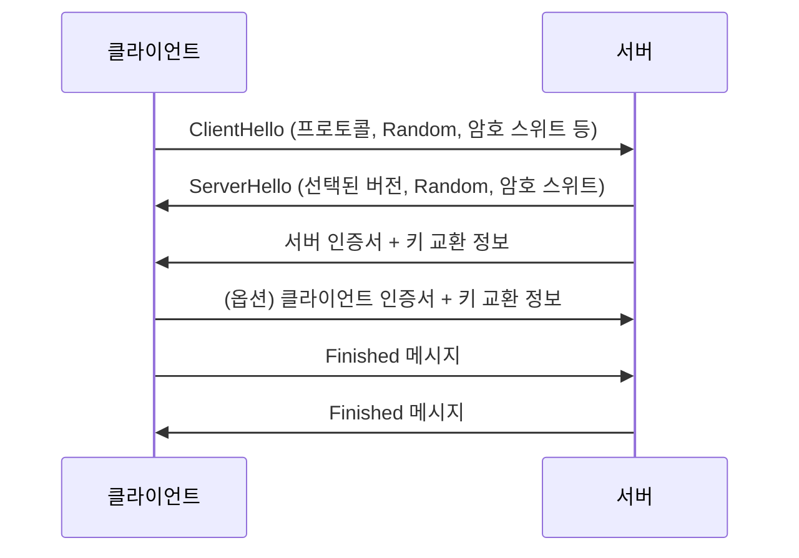

# 1. 들어가기 (Introduction)

안녕하세요! 👋  
이 문서는 **TLS/SSL 프로토콜**에 대해 초보자도 쉽게 이해할 수 있도록 자세히 설명하는 가이드입니다. TLS와 SSL은 인터넷 상에서 안전하게 데이터를 전송하기 위한 **암호화 프로토콜**로, 여러분의 웹 브라우저와 웹 서버 간의 보안 통신을 보장해 줍니다. 🚀

---

## 📚 문서의 목적

- **TLS/SSL의 기본 개념 이해**  
  - TLS와 SSL이 무엇인지, 왜 필요한지, 그리고 어떻게 동작하는지를 상세히 설명합니다.
  
- **인증서 관리와 전송 중 암호화**  
  - X.509 인증서의 구성, 인증 기관(CA)의 역할, 인증서 발급 및 갱신 방법을 알아봅니다.
  - 데이터 전송 중 암호화 기법과 안전한 통신 방법을 다룹니다.
  
- **보안 모범 사례와 운영 전략**  
  - 안전한 TLS/SSL 설정을 위한 권장 구성 및 실제 운영 환경에서 적용할 수 있는 전략들을 제시합니다.

---

## 🎯 대상 독자

이 문서는 다음과 같은 분들을 위해 작성되었습니다:

- **초급 개발자 및 보안 입문자**:  
  TLS/SSL의 기본 원리와 구성 요소에 대해 처음 배우는 분들
  
- **웹 개발자 및 시스템 관리자**:  
  안전한 통신 환경을 구축하고, 인증서 관리를 효율적으로 운영하고자 하는 분들
  
- **보안 전문가**:  
  최신 TLS/SSL 동향과 모범 사례를 통해 보다 안전한 시스템을 설계하고자 하는 분들

---

## 🛠️ TLS/SSL이란 무엇인가요?

TLS(Transport Layer Security)와 SSL(Secure Sockets Layer)은 **데이터 암호화**, **인증**, **무결성**을 보장하는 프로토콜입니다.  
- **암호화**: 데이터를 읽을 수 없도록 변환하여 도청을 방지합니다. 🔒  
- **인증**: 서버와 클라이언트가 서로의 신원을 확인할 수 있게 도와줍니다. 🛡️  
- **무결성**: 전송 중 데이터가 변조되지 않았음을 보장합니다. ✅

> **비유**:  
> TLS/SSL은 마치 안전한 택배 서비스와 같습니다. 택배 상자(데이터)는 견고한 자물쇠(암호화)로 잠기고, 송신자와 수신자만이 열 수 있도록 인증서(신원 확인)가 부착됩니다. 📦🔑

---

## 🗺️ 문서 구성 및 학습 로드맵

이 문서는 다음과 같은 주요 섹션으로 구성됩니다:

- **TLS/SSL 프로토콜 개요**: TLS와 SSL의 기본 개념, 역사, 필요성에 대해 알아봅니다.
- **TLS/SSL 동작 원리**: 핸드셰이크 과정, 데이터 전송 단계, 세션 재개 및 종료 과정을 자세히 설명합니다.
- **인증서 관리**: X.509 인증서의 구조, CA의 역할, 인증서 발급 및 갱신, 폐기 방법에 대해 다룹니다.
- **전송 중 암호화**: TLS/SSL을 통한 안전한 데이터 전송 방법과 암호 스위트에 대해 설명합니다.
- **보안 고려사항 및 모범 사례**: 안전한 설정, 취약점 대응, 추가 보안 확장 기능 등을 소개합니다.
- **운영 및 모니터링**: TLS/SSL 연결의 모니터링, 로그 관리, 자동 갱신 등의 운영 전략을 다룹니다.
- **미래 전망과 발전 방향**: TLS 1.3 및 포스트 양자 암호화 등 최신 동향을 전망합니다.
- **실습 및 구현 예제**: Go 언어를 활용한 간단한 TLS/SSL 서버/클라이언트 구현 예제와 인증서 관리 코드를 제공합니다.

---

## 🚀 TLS/SSL의 중요성

인터넷 상에서 데이터를 안전하게 주고받기 위해서는 TLS/SSL 프로토콜이 필수입니다.  
예를 들어, 여러분이 웹사이트에 접속할 때 브라우저의 주소창에 자물쇠 아이콘이 보이는 이유는 바로 TLS/SSL 덕분입니다.  
- **개인정보 보호**: 온라인 뱅킹, 전자상거래 등에서 사용자 정보를 안전하게 보호합니다.
- **데이터 무결성**: 전송 중 데이터가 변조되거나 위조되지 않도록 보장합니다.
- **신뢰성 구축**: 사용자는 웹사이트의 신뢰성을 확인할 수 있습니다.

---

## 📖 간단한 예시: Go 언어를 활용한 HTTPS 서버 (개념적 예제)

아래는 TLS/SSL을 사용하는 간단한 HTTPS 서버의 예시 코드입니다. 이 코드는 기본적인 TLS 설정을 통해 안전한 통신을 구현하는 방법을 보여줍니다.

```go
package main

import (
    "fmt"
    "log"
    "net/http"
)

func helloHandler(w http.ResponseWriter, r *http.Request) {
    fmt.Fprintf(w, "안녕하세요, 안전한 TLS/SSL 통신입니다! 😊")
}

func main() {
    http.HandleFunc("/", helloHandler)
    // 서버의 인증서와 개인 키 파일을 지정합니다.
    log.Println("HTTPS 서버가 포트 8443에서 실행 중입니다...")
    err := http.ListenAndServeTLS(":8443", "server.crt", "server.key", nil)
    if err != nil {
        log.Fatal("서버 실행 오류:", err)
    }
}
```

> **참고:**  
> 위 예제 코드를 실행하기 위해서는 인증서(`server.crt`)와 개인 키(`server.key`)가 필요합니다.  
> 인증서 발급 및 생성 방법은 이후 섹션에서 자세히 다룹니다.

---

## 🎉 마무리

TLS/SSL은 안전한 인터넷 통신을 위한 필수 기술입니다.  
이 문서를 통해 여러분은 TLS/SSL의 기본 개념, 동작 원리, 인증서 관리, 전송 중 암호화, 그리고 운영 전략까지 폭넓게 학습하게 될 것입니다.  
초보자도 이해하기 쉽도록 자세하고 친절하게 설명할 예정이니, 차근차근 따라오세요! 😊🔐

---

# 2. TLS/SSL 프로토콜 개요 (Overview of TLS/SSL)

TLS와 SSL은 안전한 인터넷 통신을 위한 핵심 프로토콜입니다. 이 섹션에서는 초보자도 쉽게 이해할 수 있도록 TLS와 SSL의 개념, 역사, 그리고 주요 기능에 대해 자세히 설명합니다. 😊🔒

---

## 📜 TLS와 SSL의 정의

- **SSL (Secure Sockets Layer)**  
  - 1990년대 초반에 넷스케이프(Netscape)에서 개발된 최초의 보안 통신 프로토콜입니다.
  - 웹 브라우저와 서버 간의 암호화된 연결을 제공하여, 데이터를 안전하게 전송할 수 있도록 돕습니다.
  - 시간이 지나면서 여러 보안 취약점이 발견되어, 최신 버전에서는 더 이상 사용되지 않습니다.

- **TLS (Transport Layer Security)**  
  - SSL의 후속 프로토콜로, 보다 향상된 보안성을 제공합니다.
  - TLS 1.0부터 시작하여 현재 TLS 1.2와 TLS 1.3이 널리 사용되고 있습니다.
  - SSL과 비교했을 때, 암호화 알고리즘과 핸드셰이크 과정이 개선되어 더 안전하고 효율적인 통신을 보장합니다.

> **비유:**  
> TLS/SSL은 마치 **안전한 통신용 비밀 편지**와 같습니다. 편지를 보낼 때 봉투에 자물쇠를 채워서 누군가가 몰래 열어보지 못하도록 하는 것처럼, TLS/SSL은 데이터를 암호화하여 전송 중 누군가가 내용을 엿볼 수 없게 합니다. 📬🔑

---

## 🕰️ 역사 및 발전 배경

- **초기 SSL 버전**:  
  - SSL 1.0: 내부 테스트용으로 개발되었으나 공개되지 않음  
  - SSL 2.0: 첫 공개 버전으로 보안 취약점이 발견되어 빠르게 대체됨  
  - SSL 3.0: 개선된 보안을 제공했으나, 이후 POODLE과 같은 공격 기법으로 취약점이 드러남

- **TLS의 등장**:  
  - TLS 1.0: SSL 3.0의 개선판으로, 보다 강력한 암호화와 인증을 제공  
  - TLS 1.1/1.2: 보안 강화와 성능 개선이 추가됨  
  - TLS 1.3: 최신 표준으로, 핸드셰이크 과정이 단순해지고 보안성이 대폭 향상됨

> **역사적 발전**:  
> 초기 SSL은 인터넷 보안의 혁명적인 시작점이었으나, 계속되는 연구와 공격 기법의 발전으로 TLS로 진화하며 오늘날의 안전한 통신 환경을 구축하는 데 큰 역할을 하고 있습니다. ⏳➡️🚀

---

## 🔧 주요 기능 및 구성 요소

### 1. 암호화 (Encryption)
- **목적:**  
  전송 중 데이터가 도청되거나 변조되지 않도록, 데이터를 암호화하여 보호합니다.
- **대칭 암호화:**  
  TLS/SSL 핸드셰이크 후 생성된 세션 키를 사용하여 데이터를 빠르게 암호화합니다. (예: AES, ChaCha20)

### 2. 인증 (Authentication)
- **목적:**  
  서버와 클라이언트가 서로의 신원을 확인하여, 신뢰할 수 있는 통신을 보장합니다.
- **디지털 인증서:**  
  X.509 인증서를 통해 서버(및 경우에 따라 클라이언트)의 신원을 확인합니다.
- **CA (인증 기관):**  
  신뢰할 수 있는 제3자가 인증서를 발급하여, 각 당사자의 신뢰성을 보증합니다.

### 3. 무결성 (Integrity)
- **목적:**  
  전송 중 데이터가 변경되었는지 확인합니다.
- **MAC/HMAC:**  
  메시지 인증 코드를 사용하여 데이터의 무결성을 검증합니다.

---

## 📖 TLS/SSL의 동작 과정 개요

1. **핸드셰이크 과정 (Handshake Process)**  
   - **암호 스위트 협상:**  
     클라이언트와 서버가 사용할 암호화 알고리즘과 키 교환 방식을 협상합니다.
   - **서버 인증:**  
     서버는 인증서를 클라이언트에 전송하여 자신의 신원을 증명합니다.
   - **세션 키 생성:**  
     비대칭 암호화(예: RSA, DH, ECDHE)를 사용해 안전하게 세션 키를 교환합니다.
   - **연결 보안 확정:**  
     모든 협상이 완료되면, 대칭 키를 사용하여 안전하게 데이터를 전송합니다.

2. **데이터 전송 (Data Transfer)**  
   - 암호화된 채널을 통해 데이터가 전송되며, MAC를 사용해 데이터의 무결성이 검증됩니다.

3. **연결 종료 (Connection Termination)**  
   - 안전하게 세션을 종료하고, 모든 관련 키와 세션 정보를 폐기합니다.

> **핸드셰이크 과정 그림:**  
> ```mermaid
> sequenceDiagram
>     participant C as 클라이언트
>     participant S as 서버
>     C->>S: ClientHello (암호 스위트, 버전 등 전송)
>     S->>C: ServerHello + 인증서 전송
>     C->>S: 키 교환 메시지 전송
>     S->>C: 세션 키 생성 및 확인
>     C->>S: 암호화된 데이터 전송 시작
> ```
> 
> 위 과정은 TLS/SSL 통신의 전반적인 흐름을 보여주며, 실제 구현에서는 더 많은 상세 과정과 보안 검증이 포함됩니다.

---

## 🎉 마무리

TLS/SSL 프로토콜은 인터넷 상의 안전한 데이터 전송을 위한 필수 기술입니다.  
- **암호화, 인증, 무결성**을 통해 데이터가 안전하게 전송되고 있음을 보장합니다.
- **핸드셰이크 과정**을 통해 안전한 세션 키가 생성되며, 이를 바탕으로 대칭 암호화를 수행합니다.
- **디지털 인증서**와 **인증 기관(CA)**를 통해 신뢰할 수 있는 통신 환경을 구축합니다.

이 섹션을 통해 TLS/SSL의 기본 개념과 구성 요소, 그리고 동작 과정을 이해할 수 있기를 바랍니다.  
다음 섹션에서는 TLS/SSL의 동작 원리와 구체적인 과정에 대해 더 자세히 알아보겠습니다.  

---

# 3. TLS/SSL 동작 원리

TLS/SSL 프로토콜은 안전한 통신을 위해 **핸드셰이크 과정**, **데이터 전송 단계**, 그리고 **세션 재개 및 종료**로 구성되어 있습니다. 이 섹션에서는 각 단계가 어떻게 이루어지는지 초보자도 이해하기 쉽게 자세하게 설명하겠습니다. 😊🔒

---

## 3.1 핸드셰이크 과정 (Handshake Process) 🚀

핸드셰이크는 클라이언트와 서버가 안전한 통신 채널을 설정하기 위한 첫 번째 단계입니다. 이 과정에서 양측은 서로의 신원을 확인하고, **세션 키**를 안전하게 교환합니다.

### 주요 단계

1. **ClientHello**  
   - **클라이언트**는 TLS/SSL 연결을 시작하기 위해 `ClientHello` 메시지를 보냅니다.  
   - 메시지 내용:  
     - 프로토콜 버전 (예: TLS 1.2, TLS 1.3)  
     - 임의의 값 (Client Random)  
     - 지원하는 암호 스위트 목록  
     - 압축 방법 등  
   - **이모티콘:** 👩‍💻 → 서버에게 "안녕하세요! 저는 이런 방식으로 연결할 수 있어요!"라고 알림

2. **ServerHello**  
   - **서버**는 클라이언트의 제안 중 하나를 선택하여 `ServerHello` 메시지로 응답합니다.  
   - 메시지 내용:  
     - 선택된 프로토콜 버전  
     - Server Random (임의의 값)  
     - 선택된 암호 스위트  
   - **이모티콘:** 👨‍💻 "좋아요, 이 암호 스위트를 사용해서 연결하죠!"

3. **서버 인증 및 키 교환**  
   - **서버**는 자신의 **X.509 인증서**를 클라이언트에게 전송하여 신원을 증명합니다.  
   - 필요 시, 서버는 **키 교환** 메시지를 보내 비대칭 암호화를 이용해 **프리마스터 시크릿(Pre-master Secret)**을 생성합니다.  
   - **예:** RSA 방식 또는 ECDHE(타원곡선 Diffie-Hellman) 방식 사용  
   - **이모티콘:** 🛡️ "제 인증서를 확인하세요! 그리고 안전한 키를 교환할게요."

4. **클라이언트 인증 및 키 교환** (옵션)  
   - 일부 경우 클라이언트도 자신의 인증서를 서버에 제공할 수 있습니다.  
   - 클라이언트는 서버의 인증서를 검증한 후, 자신의 키 교환 메시지를 전송하여 프리마스터 시크릿을 공유합니다.
   - **이모티콘:** 👤 "저도 제 인증서를 보낼게요!"

5. **세션 키 생성**  
   - 클라이언트와 서버는 각자의 Client Random, Server Random, 그리고 프리마스터 시크릿을 조합하여 **마스터 시크릿**을 생성합니다.
   - 마스터 시크릿을 기반으로 대칭 암호화에 사용할 **세션 키**가 파생됩니다.
   - **이모티콘:** 🔑 "이제 우리 둘만의 비밀 키가 만들어졌어요!"

6. **Finished 메시지 교환**  
   - 양측은 모든 협상이 완료되었음을 확인하기 위해 `Finished` 메시지를 교환합니다.  
   - 이 메시지는 지금까지의 핸드셰이크 내용을 해시한 값으로, 상대방이 같은 과정을 거쳤음을 증명합니다.
   - **이모티콘:** 🎉 "연결 준비 완료! 안전하게 통신합시다."

### 핸드셰이크 순서도



---

## 3.2 데이터 전송 단계 (Data Transfer) 📡

핸드셰이크 과정이 완료되면, 양측은 안전한 통신 채널을 통해 실제 데이터를 전송합니다.

### 주요 내용

- **대칭키 암호화**  
  - 핸드셰이크 과정에서 생성된 세션 키를 사용하여 데이터를 암호화합니다.  
  - **장점:** 빠른 암호화 및 복호화 속도  
  - **예:** AES, ChaCha20 등 사용

- **무결성 검증**  
  - 각 데이터 패킷에는 MAC(HMAC 등)을 첨부하여, 데이터가 전송 중 변경되지 않았음을 확인합니다.
  
- **압축** (옵션)  
  - 일부 경우 데이터 압축이 수행되어 전송 효율을 높이기도 합니다.

### 데이터 전송 예시

데이터 전송 단계에서는 이미 설정된 세션 키를 사용하므로, 실시간 암호화와 무결성 검증이 이루어집니다.  
- **이모티콘:** 📤 "이제 안전하게 데이터를 주고받아요!" 📥

---

## 3.3 세션 재개 및 종료 (Session Resumption and Termination) 🔄❌

### 세션 재개 (Session Resumption)

- **목적:**  
  한 번 설정된 TLS/SSL 연결의 세션 정보를 재사용하여, 핸드셰이크 과정을 생략하고 빠르게 연결을 재개할 수 있습니다.
  
- **방법:**  
  - **세션 ID 방식:** 클라이언트가 이전에 받은 세션 ID를 서버에 보내어, 서버가 해당 세션 키를 재사용하는 방식  
  - **세션 티켓 방식:** 서버가 암호화된 세션 정보를 클라이언트에게 저장하게 하고, 재연결 시 이를 복원하는 방식
  
- **장점:**  
  - 핸드셰이크 과정의 시간을 대폭 단축  
  - 서버 자원 절약

> **이모티콘:** 🔄 "이미 만들어진 비밀 키를 재사용해 빠르게 연결해요!"

### 세션 종료 (Connection Termination)

- **안전한 종료 절차:**  
  - 양측은 TLS/SSL 연결을 종료할 때, 안전하게 세션을 종료하는 절차를 밟습니다.
  - 세션 종료 메시지를 교환하고, 사용한 세션 키 및 임시 데이터를 폐기합니다.
  
- **종료 후 관리:**  
  - 종료된 세션 정보는 일정 기간 보관되며, 이후 폐기됩니다.

> **이모티콘:** ❌ "안전하게 연결을 종료하고, 모든 비밀 정보를 깨끗이 없애요!"

---

## 🎉 마무리

TLS/SSL 동작 원리는 크게 **핸드셰이크**, **데이터 전송**, 그리고 **세션 재개 및 종료**의 세 단계로 나뉩니다.  
- **핸드셰이크 과정**에서는 안전한 세션 키를 교환하며,  
- **데이터 전송 단계**에서는 대칭 암호화를 통해 빠르고 안전하게 데이터를 주고받고,  
- **세션 재개**를 통해 기존 연결을 빠르게 복원하며,  
- **세션 종료**를 통해 사용된 키와 정보를 안전하게 폐기합니다.

이 과정을 통해 TLS/SSL은 인터넷 상에서 데이터를 안전하게 보호하며, 사용자와 서버 간의 신뢰할 수 있는 통신을 가능하게 합니다.  
초보자도 이 내용을 통해 TLS/SSL의 전반적인 동작 원리를 이해하고, 실제 구현 시 어떤 요소들이 중요한지 파악할 수 있을 것입니다. 😊🔒🚀

---

# 4. 인증서 관리

TLS/SSL 보안의 핵심 중 하나인 **인증서 관리**는 안전한 통신을 보장하기 위해 필수적인 요소입니다. 이 섹션에서는 초보자도 쉽게 이해할 수 있도록 X.509 인증서의 구조, 인증 기관(CA)의 역할, 인증서 발급 및 갱신, 그리고 폐기 방법에 대해 자세히 설명합니다. 😊🔐

---

## 4.1 X.509 인증서의 구조

X.509 인증서는 디지털 인증서를 위한 국제 표준입니다. 인증서에는 여러 중요한 정보들이 포함되어 있으며, 이를 통해 서버나 클라이언트의 신원을 확인할 수 있습니다.

### 주요 구성 요소

- **버전 (Version)**  
  - 인증서의 버전을 나타냅니다. 현재는 주로 v3가 사용됩니다.
  
- **시리얼 번호 (Serial Number)**  
  - 인증서를 고유하게 식별할 수 있는 번호입니다.
  
- **서명 알고리즘 (Signature Algorithm)**  
  - 인증서에 사용된 서명 알고리즘 (예: SHA-256 with RSA)을 명시합니다.
  
- **발급자 (Issuer)**  
  - 인증서를 발급한 인증 기관(CA)의 정보입니다.  
  - 예: "Let's Encrypt", "VeriSign" 등
  
- **유효 기간 (Validity Period)**  
  - 인증서의 시작 및 종료 날짜가 포함되어 있습니다.  
  - Not Before: 인증서가 유효하기 시작하는 시각  
  - Not After: 인증서가 만료되는 시각
  
- **주체 (Subject)**  
  - 인증서의 소유자 정보를 담고 있습니다.  
  - 예: 도메인 이름, 조직명, 국가 등
  
- **주체 공개키 (Subject Public Key Info)**  
  - 소유자의 공개키와 관련 알고리즘 정보가 포함됩니다.
  
- **확장 필드 (Extensions)**  
  - 인증서의 사용 용도, 제한 사항, 정책 정보 등을 포함합니다.  
  - 예: 키 사용도(Key Usage), 확장 키 사용도(Extended Key Usage) 등
  
- **인증서 서명 (Certificate Signature)**  
  - 발급 기관의 개인키로 생성된 디지털 서명입니다.  
  - 이 서명을 통해 인증서의 진위와 무결성을 확인할 수 있습니다.

> **비유:**  
> X.509 인증서는 마치 **디지털 신분증**과 같습니다. 신분증에는 이름, 사진, 발급 기관, 유효 기간 등 다양한 정보가 담겨 있어, 누가 누구인지를 확인하는 데 사용됩니다. 🎫✅

---

## 4.2 인증 기관(CA)의 역할

**인증 기관(Certificate Authority, CA)**는 신뢰할 수 있는 제3자로, 인증서를 발급하고 관리하는 역할을 합니다.

### 주요 역할

- **인증서 발급**:  
  - 사용자나 서버의 신원을 확인한 후, 해당 정보를 기반으로 X.509 인증서를 발급합니다.
  
- **신뢰 체계 구축**:  
  - CA가 발급한 인증서는 브라우저나 운영 체제에 미리 등록된 신뢰 목록에 포함되어 있어, 연결 시 자동으로 신뢰를 부여합니다.
  
- **인증서 관리**:  
  - 인증서의 갱신, 폐기(CRL, OCSP 등)를 통해 지속적으로 신뢰성을 유지합니다.
  
- **정책 준수**:  
  - 국제 및 국내 보안 표준에 맞는 인증서 발급 정책을 수립하고 준수합니다.

> **비유:**  
> CA는 마치 **공식 신분증 발급 기관**과 같습니다. 정부나 공공기관에서 발급한 신분증은 누구나 그 진위를 확인할 수 있듯이, CA가 발급한 인증서는 신뢰할 수 있습니다. 🏛️🔏

---

## 4.3 인증서 발급 및 갱신

### 4.3.1 인증서 발급 과정

인증서 발급 과정은 보통 다음 단계로 진행됩니다:

1. **CSR (Certificate Signing Request) 생성**  
   - 사용자는 자신의 공개키와 필요한 정보를 포함한 CSR을 생성합니다.
   - CSR은 나중에 CA에 제출되어 인증서를 발급받는 데 사용됩니다.

2. **CSR 제출 및 검증**  
   - CA는 제출된 CSR의 정보를 확인하고, 사용자의 신원을 검증합니다.
   - 검증 과정에는 도메인 소유권 확인, 조직 확인 등이 포함될 수 있습니다.

3. **인증서 발급**  
   - 검증이 완료되면, CA는 X.509 인증서를 발급하여 사용자에게 전달합니다.
   - 발급된 인증서는 디지털 서명으로 보호되며, 이를 통해 신뢰성을 보장받습니다.

### 4.3.2 인증서 갱신

- **갱신 필요성:**  
  - 인증서는 유효 기간이 정해져 있기 때문에, 만료 전에 갱신해야 합니다.
  
- **갱신 과정:**  
  - 기존 인증서를 갱신하기 위해 새로운 CSR을 제출하거나, 기존 인증서를 기반으로 자동 갱신하는 방법을 사용합니다.
  - 갱신 과정에서도 CA의 신원 검증이 이루어지며, 갱신된 인증서는 새로운 유효 기간을 갖습니다.

---

## 4.4 인증서 폐기 (Revocation)

인증서가 더 이상 안전하지 않거나 사용되지 않을 때는 폐기(Revoke)해야 합니다.

### 주요 폐기 방법

- **CRL (Certificate Revocation List)**  
  - CA가 주기적으로 업데이트하는 폐기된 인증서 목록입니다.
  - 클라이언트는 인증서를 사용하기 전에 CRL을 확인하여 해당 인증서가 폐기되었는지 확인할 수 있습니다.

- **OCSP (Online Certificate Status Protocol)**  
  - 실시간으로 인증서의 상태를 확인할 수 있는 프로토콜입니다.
  - 클라이언트가 CA에 인증서 상태를 질의하여, 인증서의 유효성을 검증합니다.

> **비유:**  
> 인증서 폐기는 마치 **신분증 분실 신고**와 같습니다. 분실된 신분증은 더 이상 사용할 수 없도록 폐기되고, 새로운 신분증을 발급받아야 하듯이, 인증서도 만료되거나 문제가 발생하면 폐기되어야 합니다. 🚫🆔

---

## 4.5 Go 언어로 X.509 인증서 생성 예제

아래는 Go 언어를 사용해 간단한 **자체 서명(Self-Signed) X.509 인증서**를 생성하는 예제입니다. 이 예제는 인증서의 기본 구조와 발급 과정을 이해하는 데 도움을 줍니다.

```go
package main

import (
    "crypto/rand"
    "crypto/rsa"
    "crypto/x509"
    "crypto/x509/pkix"
    "encoding/pem"
    "fmt"
    "math/big"
    "os"
    "time"
)

func main() {
    // RSA 개인키 생성 (2048비트)
    priv, err := rsa.GenerateKey(rand.Reader, 2048)
    if err != nil {
        fmt.Println("개인키 생성 오류:", err)
        return
    }

    // 인증서 템플릿 생성
    template := x509.Certificate{
        SerialNumber: big.NewInt(1),
        Subject: pkix.Name{
            Organization: []string{"Example Co"},
            Country:      []string{"KR"},
        },
        NotBefore: time.Now(),
        NotAfter:  time.Now().Add(365 * 24 * time.Hour), // 1년 유효
        KeyUsage:  x509.KeyUsageDigitalSignature | x509.KeyUsageKeyEncipherment,
        ExtKeyUsage: []x509.ExtKeyUsage{
            x509.ExtKeyUsageServerAuth,
            x509.ExtKeyUsageClientAuth,
        },
        BasicConstraintsValid: true,
    }

    // 자체 서명 인증서 생성 (부모와 대상이 동일)
    certDER, err := x509.CreateCertificate(rand.Reader, &template, &template, &priv.PublicKey, priv)
    if err != nil {
        fmt.Println("인증서 생성 오류:", err)
        return
    }

    // 인증서를 PEM 형식으로 저장
    certOut, err := os.Create("cert.pem")
    if err != nil {
        fmt.Println("인증서 파일 생성 오류:", err)
        return
    }
    defer certOut.Close()
    pem.Encode(certOut, &pem.Block{Type: "CERTIFICATE", Bytes: certDER})
    fmt.Println("인증서(cert.pem) 생성 완료")

    // 개인키를 PEM 형식으로 저장
    keyOut, err := os.Create("key.pem")
    if err != nil {
        fmt.Println("개인키 파일 생성 오류:", err)
        return
    }
    defer keyOut.Close()
    pem.Encode(keyOut, &pem.Block{Type: "RSA PRIVATE KEY", Bytes: x509.MarshalPKCS1PrivateKey(priv)})
    fmt.Println("개인키(key.pem) 생성 완료")
}
```

> **실행 방법:**  
> 위 코드를 파일(예: `generate_cert.go`)로 저장한 후, 터미널에서 `go run generate_cert.go`를 실행하세요.  
> 그러면 `cert.pem`과 `key.pem` 파일이 생성되며, 이는 자체 서명 인증서와 개인키를 포함합니다.

---

## 🎉 마무리

인증서 관리는 TLS/SSL 보안의 근간을 이루는 중요한 부분입니다.  
- **X.509 인증서**는 신원 확인과 무결성 보장을 위해 다양한 정보를 담고 있으며,  
- **인증 기관(CA)**는 이러한 인증서를 발급하고 신뢰 체계를 구축합니다.
- 또한, **인증서 발급, 갱신, 폐기** 과정을 통해 시스템의 보안을 지속적으로 유지해야 합니다.

이 섹션을 통해 인증서 관리의 기본 개념과 실제 구현 방법을 이해하고, 여러분의 시스템에 어떻게 적용할 수 있는지 감을 잡으시길 바랍니다.  

---

# 5. 전송 중 암호화

인터넷 상에서 데이터를 주고받을 때, 중간에 누군가가 데이터를 가로채거나 변조하는 것을 막기 위해 **전송 중 암호화**가 매우 중요합니다. TLS/SSL 프로토콜은 이러한 보안을 제공하며, 실제로 안전한 통신 채널을 구축하는 데 핵심 역할을 합니다. 이 섹션에서는 전송 중 암호화의 개념, 사용되는 암호 스위트, 그리고 실제 적용 예제에 대해 초보자도 이해하기 쉽게 자세히 설명합니다. 😊🔒

---

## 📡 전송 중 암호화란?

전송 중 암호화(In-Transit Encryption)는 데이터를 전송하는 동안 **암호화**를 적용하여, 데이터가 도청되거나 변조되는 것을 방지하는 기술입니다. TLS/SSL 프로토콜은 이를 위해 다음과 같은 방법을 사용합니다:

- **대칭키 암호화**:  
  핸드셰이크 과정에서 안전하게 교환된 세션 키를 사용하여 데이터를 암호화합니다.  
  - 예: AES, ChaCha20  
  - **장점**: 빠른 연산 속도와 낮은 처리 비용

- **데이터 무결성 검증**:  
  전송된 데이터가 변조되었는지 확인하기 위해 MAC 또는 HMAC 같은 메시지 인증 코드를 함께 사용합니다.

- **인증**:  
  디지털 인증서를 통해 서버(및 경우에 따라 클라이언트)의 신원을 확인하여, 신뢰할 수 있는 통신을 보장합니다.

> **비유:**  
> 전송 중 암호화는 마치 **비밀 메시지를 안전한 봉투에 담아 보내는 것**과 같습니다. 봉투는 견고하게 봉인되어 중간에 열리지 않으며, 도착지에서만 내용을 확인할 수 있게 해줍니다. 📬🔑

---

## 🔧 암호 스위트 (Cipher Suite)

TLS/SSL 연결에서 사용되는 암호 스위트는 여러 암호화 알고리즘의 조합을 의미합니다. 각 암호 스위트는 다음 요소로 구성됩니다:

- **키 교환 알고리즘**:  
  세션 키를 안전하게 교환하는 방법  
  - 예: RSA, Diffie-Hellman(DH), ECDHE (타원곡선 Diffie-Hellman)

- **대칭키 암호화 알고리즘**:  
  실제 데이터 암호화를 위한 알고리즘  
  - 예: AES (GCM, CBC 모드), ChaCha20

- **해시 알고리즘 (MAC)**:  
  데이터 무결성을 확인하기 위한 알고리즘  
  - 예: SHA-256, SHA-384

> **예시 암호 스위트:**  
> TLS_ECDHE_RSA_WITH_AES_128_GCM_SHA256  
> - ECDHE: 키 교환  
> - RSA: 인증서 서명  
> - AES_128_GCM: 대칭 암호화  
> - SHA256: 메시지 인증 코드

---

## 💻 TLS/SSL 전송 중 암호화 동작 과정

1. **핸드셰이크 완료 후**  
   - 클라이언트와 서버는 안전하게 세션 키를 교환하고, 이 키를 사용하여 데이터를 암호화합니다.
   - 이후의 모든 데이터는 대칭 암호화 알고리즘(예: AES, ChaCha20)을 사용하여 암호화됩니다.

2. **암호화 및 무결성 보호**  
   - 각 데이터 패킷은 암호화될 때, MAC 또는 HMAC 값도 함께 생성되어 데이터의 무결성을 보장합니다.
   - 수신 측에서는 동일한 세션 키로 복호화한 후, MAC 값을 비교하여 데이터가 변경되지 않았음을 확인합니다.

3. **데이터 전송**  
   - 암호화된 데이터는 네트워크를 통해 전송되며, 중간에 가로채더라도 내용은 노출되지 않습니다.
   - TLS/SSL은 전송 중에 추가적인 압축이나 재전송 방지 기능도 제공할 수 있습니다.

---

## 🔎 Go 언어 예제: 안전한 HTTPS 클라이언트

아래 예제는 Go 언어를 사용해 HTTPS 클라이언트를 구현하는 간단한 코드입니다. 이 클라이언트는 TLS를 사용하여 서버와 안전하게 통신합니다.

```go
package main

import (
    "crypto/tls"
    "fmt"
    "io/ioutil"
    "log"
    "net/http"
)

func main() {
    // TLS 설정: 기본 설정을 사용하나, 필요한 경우 사용자 정의 가능
    tlsConfig := &tls.Config{
        MinVersion: tls.VersionTLS12, // TLS 1.2 이상 사용
    }
    transport := &http.Transport{
        TLSClientConfig: tlsConfig,
    }
    client := &http.Client{
        Transport: transport,
    }

    // HTTPS 요청 보내기
    resp, err := client.Get("https://www.example.com")
    if err != nil {
        log.Fatalf("HTTPS 요청 실패: %v", err)
    }
    defer resp.Body.Close()

    // 응답 본문 읽기
    body, err := ioutil.ReadAll(resp.Body)
    if err != nil {
        log.Fatalf("응답 읽기 실패: %v", err)
    }
    fmt.Println("서버 응답:", string(body))
}
```

> **설명:**  
> 위 코드는 TLS 설정을 통해 HTTPS 클라이언트를 생성하고, 서버로부터 안전하게 데이터를 받아오는 예제입니다.  
> TLS 설정에서 최소 TLS 버전을 TLS 1.2 이상으로 지정하여, 최신 보안 기준을 준수하도록 구성했습니다.

---

## 🎉 마무리

전송 중 암호화는 인터넷 상의 데이터 보안을 위해 필수적인 요소입니다.  
- **암호 스위트**를 통해 다양한 암호화 알고리즘이 조합되어 안전한 통신을 제공하며,  
- **대칭키 암호화**와 **MAC**를 사용해 데이터의 기밀성과 무결성을 보장합니다.
- 실제 구현에서는 TLS/SSL 핸드셰이크를 통해 안전하게 세션 키를 교환한 후, 이 키로 데이터를 암호화합니다.

이 섹션을 통해 TLS/SSL을 통한 안전한 데이터 전송 방법과 암호 스위트의 역할을 이해할 수 있기를 바랍니다.  

---

# 6. 보안 고려사항 및 모범 사례

TLS/SSL을 안전하게 사용하기 위해서는 올바른 설정과 취약점에 대한 신속한 대응, 그리고 추가적인 보안 확장 기능을 적용하는 것이 매우 중요합니다. 이 섹션에서는 초보자도 쉽게 이해할 수 있도록 TLS/SSL 보안 설정의 모범 사례와 취약점 대응 방안, 그리고 추가 보안 확장 기능에 대해 자세히 설명합니다. 😊🔒

---

## 6.1 안전한 TLS/SSL 설정

안전한 통신을 위해서는 서버와 클라이언트 모두 올바른 TLS/SSL 설정을 사용해야 합니다. 다음은 안전한 설정을 위한 주요 고려 사항입니다:

- **최소 TLS 버전 설정**:  
  - TLS 1.2 이상(가능하면 TLS 1.3)을 사용하여 구버전의 취약점을 방지합니다.  
  - ❗️ 예: SSL 3.0, TLS 1.0, TLS 1.1은 사용하지 않습니다.

- **안전한 암호 스위트 선택**:  
  - 강력한 암호화 알고리즘(예: AES-GCM, ChaCha20, ECDHE)을 사용하고, 약한 알고리즘은 비활성화합니다.  
  - 권장 암호 스위트 예: `TLS_ECDHE_RSA_WITH_AES_128_GCM_SHA256`

- **완벽한 전방 비밀성 (Perfect Forward Secrecy, PFS)**:  
  - ECDHE나 DHE를 사용하여 세션 키가 노출되더라도 과거 통신은 보호되도록 합니다.

- **인증서 설정 강화**:  
  - 인증서의 유효 기간을 적절하게 관리하고, 정기적으로 갱신합니다.  
  - 자체 서명 인증서 대신 신뢰할 수 있는 CA에서 발급받은 인증서를 사용합니다.

> **모범 사례:**  
> - TLS 1.3 사용  
> - 강력한 암호 스위트 적용  
> - PFS 활성화  
> - 인증서 유효성 및 폐기 관리 강화

---

## 6.2 취약점 대응 및 업데이트

TLS/SSL 환경에서는 시간이 지남에 따라 새로운 취약점이 발견될 수 있으므로, 주기적인 점검과 업데이트가 필요합니다.

- **취약점 모니터링**:  
  - POODLE, BEAST, Heartbleed, DROWN 등 과거의 취약점 사례를 참고하고, 서버 설정을 정기적으로 점검합니다.
  - 외부 도구(예: Qualys SSL Labs)를 활용해 서버의 보안 상태를 평가합니다.

- **업데이트 및 패치**:  
  - 서버 소프트웨어, 라이브러리, 운영 체제 등을 최신 버전으로 유지하여 알려진 취약점을 신속히 수정합니다.
  - 암호 스위트 목록을 주기적으로 검토하여, 안전하지 않은 알고리즘은 제거합니다.

- **보안 정책 수립**:  
  - 보안 사고 발생 시 대응 프로세스를 미리 수립하고, 관련 로그 및 모니터링 시스템을 구축합니다.

> **모범 사례:**  
> - 정기적인 보안 점검 및 취약점 스캔  
> - 최신 보안 패치 적용  
> - 보안 사고 대응 및 복구 계획 마련

---

## 6.3 추가 보안 확장 기능

TLS/SSL 환경의 보안을 한층 강화하기 위해 다양한 추가 보안 확장 기능들을 적용할 수 있습니다.

- **HSTS (HTTP Strict Transport Security)**:  
  - 웹사이트가 HTTPS를 강제로 사용하도록 브라우저에 지시하여, 프로토콜 다운그레이드 공격을 방지합니다.
  - HTTP 헤더에 `Strict-Transport-Security` 값을 설정합니다.

- **OCSP Stapling**:  
  - 서버가 자신의 인증서 상태를 미리 OCSP 응답과 함께 클라이언트에게 전달하여, 인증서 폐기 여부를 실시간으로 확인할 수 있게 합니다.
  - 이는 네트워크 지연 시간을 줄이고, 클라이언트의 부담을 경감시킵니다.

- **Certificate Pinning**:  
  - 특정 인증서를 미리 지정해 두어, 해당 인증서만 신뢰하도록 설정하는 방식입니다.  
  - 클라이언트 측에서 피싱이나 중간자 공격을 방지할 수 있습니다.

- **Secure Renegotiation**:  
  - TLS 재협상 과정에서 발생할 수 있는 공격을 방지하기 위한 기능입니다.

> **모범 사례:**  
> - 웹 서버 설정 시 HSTS와 OCSP Stapling을 활성화  
> - 필요에 따라 인증서 핀닝을 적용하여 추가 보안 강화

---

## 6.4 Go 언어 예제: 안전한 TLS 서버 설정

아래 예제는 Go 언어를 사용하여 안전한 TLS 서버를 구성하는 방법을 보여줍니다. 이 예제에서는 최소 TLS 버전을 TLS 1.2로 설정하고, 안전한 암호 스위트를 적용하는 방법을 확인할 수 있습니다.

```go
package main

import (
    "crypto/tls"
    "fmt"
    "log"
    "net/http"
)

func helloHandler(w http.ResponseWriter, r *http.Request) {
    fmt.Fprintf(w, "안녕하세요, 안전한 TLS 통신입니다! 😊")
}

func main() {
    // TLS 설정: 최소 TLS 1.2 이상, 안전한 암호 스위트 사용
    tlsConfig := &tls.Config{
        MinVersion: tls.VersionTLS12,
        CipherSuites: []uint16{
            tls.TLS_ECDHE_RSA_WITH_AES_128_GCM_SHA256,
            tls.TLS_ECDHE_RSA_WITH_AES_256_GCM_SHA384,
            // 추가 안전한 암호 스위트 필요 시 추가
        },
    }

    server := &http.Server{
        Addr:      ":8443",
        Handler:   http.HandlerFunc(helloHandler),
        TLSConfig: tlsConfig,
    }

    log.Println("안전한 TLS 서버가 포트 8443에서 실행 중입니다... 🔒")
    if err := server.ListenAndServeTLS("server.crt", "server.key"); err != nil {
        log.Fatal("서버 실행 오류:", err)
    }
}
```

> **설명:**  
> 위 코드는 안전한 TLS 서버를 구성하는 예제입니다.  
> - `MinVersion: tls.VersionTLS12`로 설정하여 TLS 1.2 이상만 허용합니다.  
> - 안전한 암호 스위트를 명시하여, 취약한 암호화 알고리즘 사용을 방지합니다.

---

## 🎉 마무리

TLS/SSL 보안 환경을 안전하게 운영하기 위해서는 다음과 같은 사항들을 반드시 고려해야 합니다:

- **안전한 설정**:  
  최신 프로토콜(TLS 1.2 이상)과 강력한 암호 스위트를 사용합니다.
- **취약점 대응**:  
  정기적인 보안 점검과 패치, 취약점 모니터링을 통해 보안 위협에 신속하게 대응합니다.
- **추가 보안 확장 기능**:  
  HSTS, OCSP Stapling, 인증서 핀닝 등 추가 보안 기능을 통해 보안을 강화합니다.

이러한 모범 사례들을 잘 준수하면, TLS/SSL을 통해 안전하고 신뢰할 수 있는 통신 환경을 구축할 수 있습니다.  
초보자도 이 내용을 참고하여, 자신의 시스템에 안전한 TLS/SSL 설정을 적용해 보세요! 😊🔐🚀

---

# 7. 운영 및 모니터링

TLS/SSL 연결을 안전하게 유지하고 문제를 사전에 감지하기 위해서는 효과적인 **운영 및 모니터링** 전략이 필수입니다. 이 섹션에서는 TLS/SSL 연결의 상태를 실시간으로 감시하는 방법, 로그 관리 전략, 그리고 인증서 자동 갱신 등의 운영 전략에 대해 초보자도 쉽게 이해할 수 있도록 자세히 설명합니다. 😊🔍

---

## 7.1 TLS/SSL 연결 모니터링

### 왜 모니터링이 필요한가요?  
- **안정성 확보**:  
  TLS/SSL 연결의 상태를 지속적으로 확인하면, 연결 문제나 성능 저하를 빠르게 감지할 수 있습니다.  
- **보안 사고 예방**:  
  인증서 만료, 암호 스위트 취약점, 핸드셰이크 실패 등의 이상 징후를 조기에 발견해 대응할 수 있습니다.  
- **규제 준수 및 감사**:  
  보안 로그와 모니터링 데이터는 보안 감사를 위한 중요한 증거 자료로 활용됩니다.  

### 모니터링 대상 항목  
- **연결 상태 및 핸드셰이크 성공률**:  
  성공적으로 연결된 TLS/SSL 세션의 수와 실패한 세션의 비율  
- **세션 키 교환 시간**:  
  핸드셰이크 과정에서 소요된 시간  
- **인증서 만료일 및 갱신 상태**:  
  인증서 유효 기간 및 만료 경고  
- **암호 스위트 사용 현황**:  
  사용 중인 암호 스위트의 종류와 보안 수준  
- **로그 및 오류 메시지**:  
  TLS 오류, 경고 메시지, 재협상 시도 등

> **이모티콘:**  
> 👀🔒 "실시간 모니터링을 통해 시스템의 건강 상태를 항상 체크하세요!"

---

## 7.2 로그 관리

### 왜 로그 관리가 중요한가요?  
- **문제 진단**:  
  TLS/SSL 연결 중 발생한 오류나 경고 메시지를 통해 문제의 원인을 파악할 수 있습니다.  
- **보안 감사**:  
  정기적인 로그 분석은 보안 사고를 사전에 예방하고, 발생 시 신속한 대응을 가능하게 합니다.  
- **규제 준수**:  
  로그는 보안 정책 준수 및 외부 감사 시 중요한 자료로 활용됩니다.

### 로그 관리 전략  
- **중앙 집중식 로깅**:  
  여러 서버에서 발생하는 로그를 중앙 로그 서버(예: ELK Stack, Splunk 등)로 집계합니다.  
- **구조화된 로그 형식 사용**:  
  JSON 등의 구조화된 형식을 사용해 로그를 남기면, 검색 및 분석이 용이해집니다.  
- **실시간 알림 시스템**:  
  특정 오류나 비정상 패턴이 감지되면 즉시 알림을 보내는 시스템을 구축합니다.

### Go 언어 예제: 간단한 TLS 서버 로깅

아래 코드는 TLS 서버에서 각 연결 요청에 대해 로그를 남기는 예제입니다.

```go
package main

import (
    "crypto/tls"
    "fmt"
    "log"
    "net/http"
)

func helloHandler(w http.ResponseWriter, r *http.Request) {
    // 연결 요청 로그 남기기
    log.Printf("새로운 TLS 연결 요청: %s %s from %s\n", r.Method, r.URL, r.RemoteAddr)
    fmt.Fprintf(w, "안녕하세요, 안전한 TLS 서버입니다! 😊")
}

func main() {
    // TLS 설정: 최소 TLS 1.2 이상 사용
    tlsConfig := &tls.Config{
        MinVersion: tls.VersionTLS12,
    }
    server := &http.Server{
        Addr:      ":8443",
        Handler:   http.HandlerFunc(helloHandler),
        TLSConfig: tlsConfig,
    }

    log.Println("안전한 TLS 서버가 포트 8443에서 실행 중입니다... 🔒")
    if err := server.ListenAndServeTLS("server.crt", "server.key"); err != nil {
        log.Fatalf("서버 실행 오류: %v", err)
    }
}
```

> **설명:**  
> 이 예제는 TLS 연결이 생성될 때마다 클라이언트의 요청 정보를 로그로 남깁니다.  
> 이를 통해 운영 중 발생할 수 있는 문제나 보안 이벤트를 추적할 수 있습니다.

---

## 7.3 인증서 자동 갱신

### 왜 인증서 갱신이 중요한가요?  
- **인증서 만료 방지**:  
  만료된 인증서는 연결 실패로 이어지므로, 자동 갱신을 통해 항상 최신 인증서를 유지하는 것이 중요합니다.
- **운영 효율성**:  
  수동 갱신은 실수가 발생할 수 있으므로, 자동화된 시스템을 구축하면 운영 부담을 크게 줄일 수 있습니다.

### 자동 갱신 방법  
- **ACME 프로토콜 활용**:  
  Let's Encrypt와 같은 무료 인증서 발급 기관은 ACME 프로토콜을 통해 인증서 자동 갱신을 지원합니다.
- **자동 갱신 스크립트**:  
  Certbot, acme.sh 등의 도구를 사용해 인증서 갱신을 자동화할 수 있습니다.
- **통합 모니터링**:  
  인증서 갱신 상태를 모니터링하고, 만료 임박 시 알림을 받을 수 있도록 구성합니다.

> **이모티콘:**  
> 🔄 "자동 갱신을 통해 인증서 관리 스트레스를 줄이세요!"

---

## 7.4 운영 자동화

### 운영 자동화 전략  
- **자동 스케일링**:  
  TLS/SSL 연결이 급증할 때, 서버를 자동으로 확장해 처리량을 유지합니다.
- **정기적 보안 감사**:  
  운영 중 발생하는 로그와 지표를 분석해, 보안 취약점을 사전에 파악합니다.
- **모니터링 도구 활용**:  
  Prometheus, Grafana 등의 도구를 통해 TLS/SSL 관련 메트릭을 실시간으로 시각화하고 모니터링합니다.

---

## 🎉 마무리

효과적인 운영 및 모니터링 전략은 TLS/SSL 연결의 안전성과 성능을 보장하는 데 필수적입니다.  
- **실시간 모니터링**과 **중앙 집중식 로그 관리**를 통해, 발생 가능한 문제를 신속히 파악하고 대응할 수 있습니다.  
- **인증서 자동 갱신** 시스템을 구축하면, 만료로 인한 연결 실패를 미연에 방지할 수 있습니다.
- **운영 자동화** 도구를 활용하여 전체 시스템의 보안과 안정성을 지속적으로 관리할 수 있습니다.

초보자도 이 섹션을 통해 TLS/SSL 운영 전략을 이해하고, 실제 환경에 적용할 수 있는 방법을 배울 수 있기를 바랍니다.  

---

# 8. 미래 전망과 발전 방향

인터넷 보안은 끊임없이 변화하고 발전하는 분야입니다. TLS/SSL 프로토콜도 최신 동향과 기술 발전에 맞춰 지속적으로 개선되고 있으며, 특히 **TLS 1.3**과 **포스트 양자 암호화**(Post-Quantum Cryptography, PQC)는 앞으로 보안의 미래를 좌우할 중요한 기술로 주목받고 있습니다. 이 섹션에서는 초보자도 쉽게 이해할 수 있도록 TLS/SSL의 미래 전망과 발전 방향에 대해 자세히 알아보겠습니다. 🚀🔮

---

## 8.1 TLS 1.3의 발전

### ✨ TLS 1.3의 주요 특징
- **간소화된 핸드셰이크**:  
  TLS 1.3은 기존 버전에 비해 핸드셰이크 과정을 대폭 단순화하여, 연결 설정 시간이 훨씬 빨라졌습니다.  
  - 초기 핸드셰이크 단계에서 불필요한 메시지 교환을 줄이고, 재협상 과정을 제거했습니다.
  
- **강화된 보안성**:  
  불필요하거나 취약한 암호 스위트와 알고리즘을 제거하여, 보안성이 크게 향상되었습니다.  
  - 기본적으로 PFS(Perfect Forward Secrecy)를 지원하여, 세션 키가 노출되더라도 과거 통신은 안전하게 보호됩니다.
  
- **개선된 성능**:  
  핸드셰이크 간소화와 최신 암호화 기술 적용으로 응답 시간이 단축되고, 서버 리소스 사용 효율이 개선되었습니다.

> **이모티콘:**  
> 🚀 "TLS 1.3은 더 빠르고 안전한 인터넷 통신의 미래를 열어줍니다!"

---

## 8.2 포스트 양자 암호화 (Post-Quantum Cryptography)

### 🔐 왜 포스트 양자 암호화가 필요한가요?
- **양자 컴퓨팅의 위협**:  
  양자 컴퓨터는 Shor의 알고리즘과 Grover의 알고리즘을 통해 기존의 RSA, ECC 및 일부 해시 함수의 보안을 위협할 수 있습니다.  
  - 미래에는 양자 컴퓨터가 현실화되면서, 기존 암호화 방식은 더 이상 안전하지 않을 수 있습니다.
  
- **미래 대비**:  
  포스트 양자 암호화는 양자 컴퓨터에 대응할 수 있도록 설계된 새로운 암호 알고리즘을 의미합니다.  
  - 격자 기반, 다변수, 해시 기반, 코드 기반 등의 다양한 접근 방식이 연구되고 있습니다.

### 🔧 포스트 양자 암호화의 적용 방안
- **혼합 (Hybrid) 암호화**:  
  기존의 TLS/SSL 프로토콜과 포스트 양자 암호화를 혼합하여 사용하는 방법입니다.  
  - 예를 들어, 기존의 RSA/ECDHE와 포스트 양자 알고리즘을 함께 사용하여, 양쪽의 장점을 모두 취할 수 있습니다.
  
- **표준화 노력**:  
  NIST와 같은 국제 기구에서는 포스트 양자 암호화 알고리즘의 표준화를 위해 연구를 진행 중입니다.
  - 앞으로 몇 년 내에 안전한 포스트 양자 암호화 표준이 확정될 것으로 기대됩니다.

> **이모티콘:**  
> 🔮 "미래의 양자 컴퓨팅 시대에도 안전한 통신을 위해 포스트 양자 암호화는 필수입니다!"

### 개념적 예시 (Go 언어 스텁 코드)

아래 코드는 포스트 양자 암호화 알고리즘의 개념을 이해하기 위한 간단한 스텁 코드입니다. 실제 구현은 복잡한 수학적 기법과 고도화된 라이브러리가 필요하지만, 이 예시는 개념을 쉽게 설명하기 위한 것입니다.

```go
package main

import (
    "fmt"
)

// postQuantumEncrypt는 포스트 양자 암호화 방식으로 데이터를 암호화하는 개념적 함수입니다.
// 실제 구현은 격자 기반, 다변수, 해시 기반 등의 고급 알고리즘을 사용해야 합니다.
func postQuantumEncrypt(plaintext, key []byte) []byte {
    // 이 함수는 단순히 입력 데이터를 그대로 반환하는 예제입니다.
    // 실제로는 복잡한 암호화 과정을 거쳐 암호문을 생성합니다.
    return plaintext // 개념 증명용 스텁 코드
}

func main() {
    plaintext := []byte("Hello, Post-Quantum World! 🚀")
    key := []byte("examplepostquantumkey") // 예시 키 (실제 키 관리 필요)
    
    encrypted := postQuantumEncrypt(plaintext, key)
    fmt.Printf("포스트 양자 암호화 결과 (개념적 예시): %x\n", encrypted)
}
```

> **주의:**  
> 위 코드는 포스트 양자 암호화의 개념을 이해하기 위한 단순 예제일 뿐, 실제 보안 시스템에 적용하기 위해서는 표준화된 포스트 양자 암호화 알고리즘을 사용해야 합니다.

---

## 8.3 인공지능 및 자동화와의 융합

- **AI 기반 보안 모니터링**:  
  머신러닝과 인공지능을 활용하여 TLS/SSL 연결의 이상 징후를 실시간으로 탐지하고, 자동으로 대응하는 시스템이 개발되고 있습니다.
  
- **자동 암호화 알고리즘 선택**:  
  인공지능이 시스템 환경과 보안 요구사항을 분석하여, 가장 적합한 암호화 알고리즘과 암호 스위트를 자동으로 추천하거나 적용할 수 있는 미래형 보안 시스템이 등장할 전망입니다.

> **이모티콘:**  
> 🤖 "AI와 자동화 기술의 발전은 보안 운영의 미래를 한층 더 스마트하게 만들어 줄 것입니다!"

---

## 8.4 종합 전망

- **TLS 1.3**:  
  - 빠르고 간소화된 핸드셰이크, 향상된 보안성, 그리고 효율적인 성능을 제공하며, 앞으로도 웹 보안의 표준으로 자리 잡을 것입니다.
  
- **포스트 양자 암호화**:  
  - 양자 컴퓨팅의 위협에 대응하기 위한 필수 기술로, 혼합 암호화 기법이나 순수 포스트 양자 암호화 방식이 앞으로 점차 적용될 것입니다.
  
- **융합 기술**:  
  - AI, 자동화, 그리고 클라우드 환경과의 융합을 통해 TLS/SSL 및 인증서 관리의 효율성과 보안성이 더욱 강화될 전망입니다.

> **미래 메시지:**  
> "미래의 보안 환경은 빠르게 변화하고 있습니다. TLS 1.3과 포스트 양자 암호화, 그리고 인공지능 기반 보안 솔루션을 통해 안전하고 효율적인 통신 환경을 구축하는 것이 앞으로의 핵심 과제가 될 것입니다." 🚀🔒

---

## 🎉 마무리

이 섹션에서는 TLS/SSL의 최신 동향과 미래 발전 방향에 대해 알아보았습니다.  
- **TLS 1.3**은 이미 안전하고 효율적인 통신 환경을 제공하며, 앞으로도 계속 발전할 것입니다.  
- **포스트 양자 암호화**는 양자 컴퓨팅 시대에 대비한 필수 기술로, 혼합 암호화 기법과 표준화된 알고리즘이 점차 적용될 것으로 예상됩니다.  
- 또한, **AI와 자동화**를 통한 보안 모니터링 및 운영 전략이 미래 보안 시스템의 중요한 부분을 차지할 것입니다.

초보자도 이 내용을 통해 미래 보안 기술의 방향성과 핵심 요소들을 이해할 수 있기를 바랍니다.  

---

# 9. 실습 및 구현 예제

이번 섹션에서는 Go 언어를 활용하여 TLS/SSL 환경에서 동작하는 **간단한 서버와 클라이언트**를 구현해보고, 인증서 관리와 관련된 기본 코드를 살펴보겠습니다. 초보자도 쉽게 따라할 수 있도록 단계별로 자세하게 설명드릴게요! 😊💻

---

## 9.1 TLS/SSL 서버 구현 예제

TLS/SSL 서버는 안전한 통신 채널을 제공하기 위해 **인증서**와 **개인키**를 사용합니다. 아래 예제는 HTTPS 서버를 설정하여, 클라이언트의 요청을 처리하는 간단한 TLS 서버 구현 코드입니다.

### 예제 코드: 간단한 TLS 서버 (Go)

```go
package main

import (
    "crypto/tls"
    "fmt"
    "log"
    "net/http"
)

// helloHandler는 클라이언트의 요청에 대해 간단한 응답을 보냅니다.
func helloHandler(w http.ResponseWriter, r *http.Request) {
    fmt.Fprintf(w, "안녕하세요! 안전한 TLS 서버에 오신 것을 환영합니다. 😊")
}

func main() {
    // TLS 설정: 최소 TLS 1.2 이상 사용
    tlsConfig := &tls.Config{
        MinVersion: tls.VersionTLS12,
    }

    // HTTP 핸들러 설정
    mux := http.NewServeMux()
    mux.HandleFunc("/", helloHandler)

    // 서버 설정: 주소, 핸들러, TLS 설정
    server := &http.Server{
        Addr:      ":8443",
        Handler:   mux,
        TLSConfig: tlsConfig,
    }

    log.Println("안전한 TLS 서버가 포트 8443에서 실행 중입니다... 🔒")
    
    // 서버 실행: 인증서와 개인키 파일 경로를 지정합니다.
    err := server.ListenAndServeTLS("server.crt", "server.key")
    if err != nil {
        log.Fatalf("서버 실행 오류: %v", err)
    }
}
```

> **설명:**  
> - 위 코드는 `server.crt`와 `server.key` 파일을 사용하여 HTTPS 서버를 실행합니다.  
> - TLS 설정에서 최소 TLS 버전을 TLS 1.2로 지정하여 보안을 강화합니다.  
> - 클라이언트가 접속하면 "안녕하세요! 안전한 TLS 서버에 오신 것을 환영합니다. 😊"라는 메시지를 응답합니다.

---

## 9.2 TLS/SSL 클라이언트 구현 예제

이제 TLS/SSL 서버에 접속하여 안전하게 데이터를 요청하는 **클라이언트** 예제를 살펴보겠습니다.

### 예제 코드: 간단한 TLS 클라이언트 (Go)

```go
package main

import (
    "crypto/tls"
    "fmt"
    "io/ioutil"
    "log"
    "net/http"
)

func main() {
    // TLS 클라이언트 설정: 서버의 인증서를 검증하기 위한 설정 (필요에 따라 사용자 정의 가능)
    tlsConfig := &tls.Config{
        InsecureSkipVerify: false, // true로 설정하면 인증서 검증을 건너뛰지만, 보안상 위험합니다.
        MinVersion:         tls.VersionTLS12,
    }

    // HTTP 클라이언트 생성 시 TLS 설정 적용
    transport := &http.Transport{
        TLSClientConfig: tlsConfig,
    }
    client := &http.Client{
        Transport: transport,
    }

    // TLS 서버에 GET 요청 보내기
    resp, err := client.Get("https://localhost:8443")
    if err != nil {
        log.Fatalf("HTTPS 요청 실패: %v", err)
    }
    defer resp.Body.Close()

    // 응답 본문 읽기
    body, err := ioutil.ReadAll(resp.Body)
    if err != nil {
        log.Fatalf("응답 읽기 실패: %v", err)
    }
    fmt.Println("서버 응답:", string(body))
}
```

> **설명:**  
> - 이 클라이언트 코드는 TLS 설정을 통해 안전하게 서버와 통신합니다.  
> - `InsecureSkipVerify` 옵션은 기본적으로 `false`로 설정하여, 서버의 인증서를 반드시 검증합니다.  
> - 클라이언트는 `https://localhost:8443`에 GET 요청을 보내고, 서버로부터 받은 응답을 출력합니다.

---

## 9.3 인증서 관리 및 자동 생성 예제

TLS/SSL 통신을 위해서는 인증서와 개인키가 필요합니다. 개발 및 테스트 환경에서는 **자체 서명(Self-Signed) 인증서**를 생성하여 사용할 수 있습니다.

### 예제 코드: 자체 서명 인증서 생성 (Go)

```go
package main

import (
    "crypto/rand"
    "crypto/rsa"
    "crypto/x509"
    "crypto/x509/pkix"
    "encoding/pem"
    "fmt"
    "math/big"
    "os"
    "time"
)

func main() {
    // 2048비트 RSA 개인키 생성
    priv, err := rsa.GenerateKey(rand.Reader, 2048)
    if err != nil {
        fmt.Println("개인키 생성 오류:", err)
        return
    }

    // 인증서 템플릿 생성
    template := x509.Certificate{
        SerialNumber: big.NewInt(1),
        Subject: pkix.Name{
            Organization: []string{"Example Co"},
            Country:      []string{"KR"},
        },
        NotBefore:             time.Now(),
        NotAfter:              time.Now().Add(365 * 24 * time.Hour), // 1년 유효
        KeyUsage:              x509.KeyUsageDigitalSignature | x509.KeyUsageKeyEncipherment,
        ExtKeyUsage:           []x509.ExtKeyUsage{x509.ExtKeyUsageServerAuth, x509.ExtKeyUsageClientAuth},
        BasicConstraintsValid: true,
    }

    // 자체 서명 인증서 생성 (부모와 대상이 동일)
    certDER, err := x509.CreateCertificate(rand.Reader, &template, &template, &priv.PublicKey, priv)
    if err != nil {
        fmt.Println("인증서 생성 오류:", err)
        return
    }

    // 인증서를 PEM 형식으로 저장
    certOut, err := os.Create("server.crt")
    if err != nil {
        fmt.Println("인증서 파일 생성 오류:", err)
        return
    }
    defer certOut.Close()
    pem.Encode(certOut, &pem.Block{Type: "CERTIFICATE", Bytes: certDER})
    fmt.Println("인증서(server.crt) 생성 완료")

    // 개인키를 PEM 형식으로 저장
    keyOut, err := os.Create("server.key")
    if err != nil {
        fmt.Println("개인키 파일 생성 오류:", err)
        return
    }
    defer keyOut.Close()
    pem.Encode(keyOut, &pem.Block{Type: "RSA PRIVATE KEY", Bytes: x509.MarshalPKCS1PrivateKey(priv)})
    fmt.Println("개인키(server.key) 생성 완료")
}
```

> **설명:**  
> - 이 코드는 RSA 개인키를 생성하고, 자체 서명 인증서를 만들어 `server.crt`와 `server.key` 파일로 저장합니다.  
> - 생성된 인증서를 TLS 서버에 적용하여 안전한 통신을 할 수 있습니다.  
> - 테스트 및 개발 환경에서 유용하게 활용할 수 있습니다.

---

## 🎉 마무리

이번 섹션에서는 TLS/SSL 환경에서의 **서버 및 클라이언트 구현**과 **인증서 관리**에 대해 실습 예제를 통해 배워보았습니다.

- **TLS 서버 구현 예제**:  
  안전한 TLS 설정과 함께 HTTPS 서버를 실행하는 방법을 익혔습니다.
  
- **TLS 클라이언트 구현 예제**:  
  TLS 설정을 통해 안전하게 서버에 연결하고 데이터를 가져오는 방법을 배웠습니다.
  
- **자체 서명 인증서 생성 예제**:  
  Go 언어를 사용해 테스트용 인증서를 생성하는 방법을 살펴보았습니다.

이 예제들을 직접 실행해 보면서 TLS/SSL의 실제 동작 방식을 체험해 보세요.  