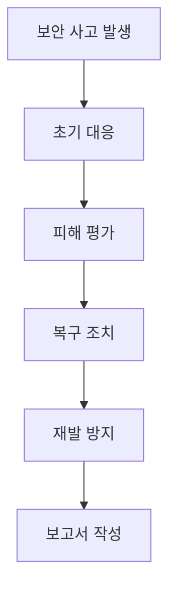

# Jenkins 보안 및 권한 관리 모범 사례

> **목표:**  
> - Jenkins 보안의 중요성과 기본 원칙을 이해한다.
> - 사용자 인증과 권한 관리 시스템을 효과적으로 구성한다.
> - 주요 보안 위협과 대응 방안을 학습한다.
> - 실무에서 적용할 수 있는 보안 모범 사례를 습득한다.

---

## 1. Jenkins 보안의 기본 원칙

보안은 Jenkins 운영에서 가장 중요한 요소 중 하나입니다. CI/CD 파이프라인은 소스 코드, 배포 자격 증명, 환경 설정 등 중요한 정보를 다루기 때문에 철저한 보안 관리가 필요합니다.

핵심 보안 원칙:
- 최소 권한 원칙 적용
- 깊이 있는 방어 전략 구현
- 정기적인 보안 감사 수행
- 보안 업데이트 적시 적용
- 모든 접근에 대한 로깅과 모니터링

---

## 2. 사용자 인증 시스템 구성

### 2.1 인증 방식 설정

Jenkins에서 지원하는 주요 인증 방식:

```yaml
보안 영역(Security Realm) 옵션:
1. Jenkins 자체 데이터베이스
   - 기본적인 사용자/비밀번호 관리
   - 소규모 팀에 적합

2. LDAP 연동
   - 기업 디렉토리 서비스 활용
   - 중앙집중식 사용자 관리
   
3. OAuth 2.0
   - GitHub, Google 등과 연동
   - SSO(Single Sign-On) 지원

4. Active Directory
   - Windows 도메인 통합
   - 기업 환경에 적합
```

### 2.2 강력한 인증 정책 구현

```groovy
// security.groovy 설정 예시
jenkins.security.ApiTokenProperty.ADMIN_CAN_GENERATE_NEW_TOKENS = false
jenkins.security.ApiTokenProperty.TOKEN_EXPIRY_FOR_CREATED_BY_CLI = 120
jenkins.model.Jenkins.instance.setSecurityRealm(new HudsonPrivateSecurityRealm(true))
```

비밀번호 정책 설정:
```java
public class PasswordPolicy {
    public static final int MINIMUM_LENGTH = 12;
    public static final boolean REQUIRE_UPPERCASE = true;
    public static final boolean REQUIRE_LOWERCASE = true;
    public static final boolean REQUIRE_DIGITS = true;
    public static final boolean REQUIRE_SPECIAL = true;
    public static final int PASSWORD_EXPIRY_DAYS = 90;
}
```

---

## 3. 권한 관리 시스템

### 3.1 역할 기반 접근 제어(RBAC)

Jenkins에서 권한 관리를 위한 주요 역할 구성:

```yaml
관리자(Administrator):
  - 전체 시스템 구성 관리
  - 사용자 및 권한 관리
  - 플러그인 관리
  
개발자(Developer):
  - 자신의 프로젝트 Job 관리
  - 빌드 실행 및 로그 확인
  - 결과물 다운로드
  
운영자(Operator):
  - 빌드 상태 모니터링
  - 기본적인 문제 해결
  - 로그 확인
  
읽기 전용 사용자(Viewer):
  - Job 상태 확인
  - 로그 조회
```

### 3.2 프로젝트 기반 권한 설정

```groovy
// 프로젝트별 권한 설정 예시
def job = Jenkins.instance.getItem('MyProject')
def authStrategy = new ProjectMatrixAuthorizationStrategy()

// 개발팀 권한 설정
authStrategy.add(Job.BUILD, 'dev-team')
authStrategy.add(Job.READ, 'dev-team')

// QA팀 권한 설정
authStrategy.add(Job.READ, 'qa-team')
authStrategy.add(Job.WORKSPACE, 'qa-team')

job.setAuthorizationStrategy(authStrategy)
```

---

## 4. 중요 정보 보호

### 4.1 자격 증명 관리

Jenkins Credentials Plugin을 사용한 안전한 자격 증명 관리:

```groovy
// 파이프라인에서 자격 증명 사용 예시
pipeline {
    agent any
    environment {
        DATABASE_CREDS = credentials('database-credentials')
        AWS_CREDS = credentials('aws-credentials')
    }
    stages {
        stage('Deploy') {
            steps {
                withCredentials([
                    usernamePassword(
                        credentialsId: 'database-credentials',
                        usernameVariable: 'DB_USER',
                        passwordVariable: 'DB_PASS'
                    )
                ]) {
                    sh '''
                        # 자격 증명을 환경 변수로 안전하게 사용
                        echo "Connecting to database..."
                        # DB_USER와 DB_PASS는 스크립트 내에서만 사용 가능
                    '''
                }
            }
        }
    }
}
```

### 4.2 환경 변수 보호

민감한 정보를 환경 변수로 관리할 때의 보안 설정:

```properties
# jenkins.properties
JENKINS_HOME=/var/jenkins_home
JENKINS_JAVA_OPTIONS="-Djava.awt.headless=true -Djenkins.install.runSetupWizard=false"
JENKINS_ARGS="--httpPort=-1 --httpsPort=8443 --httpsKeyStore=/var/jenkins_home/keystore.jks"
```

---

## 5. 네트워크 보안

### 5.1 HTTPS 구성

HTTPS 설정을 위한 nginx 프록시 구성 예시:

```nginx
server {
    listen 443 ssl;
    server_name jenkins.example.com;

    ssl_certificate /etc/nginx/ssl/jenkins.crt;
    ssl_certificate_key /etc/nginx/ssl/jenkins.key;
    
    location / {
        proxy_pass http://localhost:8080;
        proxy_set_header Host $host;
        proxy_set_header X-Real-IP $remote_addr;
    }
}
```

### 5.2 방화벽 설정

기본적인 방화벽 규칙:

```bash
# Jenkins 서버 방화벽 설정
iptables -A INPUT -p tcp --dport 8080 -j DROP
iptables -A INPUT -p tcp --dport 8080 -s 10.0.0.0/8 -j ACCEPT
iptables -A INPUT -p tcp --dport 50000 -j DROP  # 에이전트 포트
```

---

## 6. 감사 및 모니터링

### 6.1 보안 감사 설정

감사 로그 설정:

```xml
<!-- audit-log.xml -->
<log4j:configuration debug="true">
    <appender name="FILE" class="org.apache.log4j.RollingFileAppender">
        <param name="File" value="${JENKINS_HOME}/logs/audit.log"/>
        <layout class="org.apache.log4j.PatternLayout">
            <param name="ConversionPattern" value="%d{yyyy-MM-dd HH:mm:ss} %-5p %c{1}:%L - %m%n"/>
        </layout>
    </appender>
</log4j:configuration>
```

### 6.2 모니터링 시스템 구축

Prometheus와 Grafana를 활용한 모니터링:

```yaml
# prometheus.yml
scrape_configs:
  - job_name: 'jenkins'
    metrics_path: '/prometheus'
    static_configs:
      - targets: ['jenkins:8080']
```

---

## 7. 실무 보안 체크리스트

### 7.1 일일 점검 사항

```yaml
1. 시스템 상태:
   - 로그인 시도 실패 기록 확인
   - 시스템 리소스 사용량 모니터링
   - 실행 중인 작업 검토

2. 접근 제어:
   - 사용자 계정 활성화 상태 확인
   - 권한 설정 검증
   - 임시 접근 권한 회수

3. 업데이트:
   - 보안 업데이트 적용 상태 확인
   - 플러그인 업데이트 확인
   - 백업 상태 확인
```

### 7.2 정기 점검 사항

```yaml
1. 분기별 점검:
   - 사용자 계정 전수 조사
   - 권한 설정 검토
   - 보안 정책 준수 여부 감사

2. 연간 점검:
   - 보안 정책 재검토
   - 재해 복구 계획 테스트
   - 보안 교육 실시
```

---

## 8. 보안 사고 대응 계획

### 8.1 사고 대응 절차



### 8.2 복구 절차

```yaml
1. 즉시 조치:
   - 해당 시스템 격리
   - 백업에서 복구
   - 임시 보안 강화

2. 후속 조치:
   - 원인 분석
   - 보안 정책 개선
   - 모니터링 강화
```

---

## 9. 참고 자료

- [Jenkins 보안 권장 사항](https://www.jenkins.io/doc/book/security/)
- [Jenkins 보안 어드바이저리](https://www.jenkins.io/security/advisories/)
- [OWASP Jenkins 보안 체크리스트](https://owasp.org/www-project-web-security-testing-guide/)
- [CIS Jenkins 보안 벤치마크](https://www.cisecurity.org/benchmark/jenkins)

---

## 마무리

Jenkins 시스템의 보안은 지속적인 관리와 주의가 필요한 중요한 영역입니다.
적절한 인증 시스템 구축, 권한 관리, 네트워크 보안 설정, 그리고 정기적인 모니터링을 통해
안전한 CI/CD 환경을 유지할 수 있습니다.
보안은 한 번의 설정으로 끝나는 것이 아니라, 지속적인 관리와 개선이 필요한 프로세스임을 항상 기억해야 합니다.