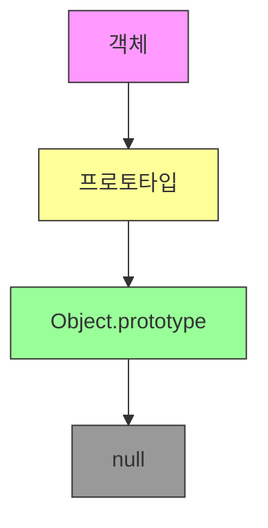
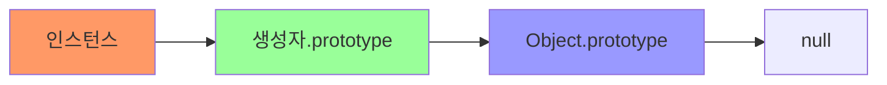

# JavaScript 프로토타입과 상속 🧬

## 목차
1. [프로토타입의 이해](#프로토타입의-이해)
2. [프로토타입 체인](#프로토타입-체인)
3. [상속 구현하기](#상속-구현하기)
4. [실전 프로토타입 패턴](#실전-프로토타입-패턴)
5. [실전 예제](#실전-예제)

## 프로토타입의 이해 🤔

프로토타입은 JavaScript에서 객체 간 상속을 구현하는 메커니즘입니다. 모든 JavaScript 객체는 다른 객체에 대한 참조인 프로토타입을 가지고 있습니다.



### 프로토타입의 기본 개념

```javascript
function Animal(name) {
    this.name = name;
}

Animal.prototype.speak = function() {
    return `${this.name} makes a sound.`;
};

const dog = new Animal("Rex");
console.log(dog.speak()); // "Rex makes a sound."
```

여기서 일어나는 일을 자세히 살펴보면:

1. `Animal` 함수의 prototype 객체에 `speak` 메서드를 추가
2. `new Animal()`로 인스턴스 생성
3. 인스턴스는 Animal.prototype을 상속받음

## 프로토타입 체인 ⛓️

프로토타입 체인은 객체의 속성이나 메서드를 찾는 경로입니다.



### 프로토타입 체인의 동작

```javascript
const arr = [1, 2, 3];

console.log(arr.__proto__ === Array.prototype);  // true
console.log(arr.__proto__.__proto__ === Object.prototype);  // true
console.log(arr.__proto__.__proto__.__proto__ === null);  // true
```

```javascript
function checkProperty(obj, prop) {
    let current = obj;
    while (current !== null) {
        if (current.hasOwnProperty(prop)) {
            return `Property ${prop} found in ${current.constructor.name}`;
        }
        current = Object.getPrototypeOf(current);
    }
    return `Property ${prop} not found in prototype chain`;
}

const dog = new Animal("Rex");
console.log(checkProperty(dog, 'speak'));  // "Property speak found in Animal"
console.log(checkProperty(dog, 'toString'));  // "Property toString found in Object"
```

## 상속 구현하기 🔄

JavaScript에서 상속을 구현하는 여러 가지 방법을 살펴보겠습니다.

### 프로토타입 체인을 이용한 상속

```javascript
function Animal(name) {
    this.name = name;
}

Animal.prototype.makeSound = function() {
    return "Some sound";
};

function Dog(name, breed) {
    Animal.call(this, name);  // 부모 생성자 호출
    this.breed = breed;
}

// 프로토타입 체인 설정
Dog.prototype = Object.create(Animal.prototype);
Dog.prototype.constructor = Dog;

// Dog 특화 메서드 추가
Dog.prototype.bark = function() {
    return "Woof!";
};
```

### 클래스를 이용한 상속 (ES6+)

```javascript
class Animal {
    constructor(name) {
        this.name = name;
    }

    makeSound() {
        return "Some sound";
    }
}

class Dog extends Animal {
    constructor(name, breed) {
        super(name);
        this.breed = breed;
    }

    bark() {
        return "Woof!";
    }
}
```

## 실전 프로토타입 패턴 🎯

### 1. 팩토리 패턴과 프로토타입

```javascript
const vehiclePrototype = {
    init(model) {
        this.model = model;
    },
    getModel() {
        return this.model;
    }
};

function createVehicle(model) {
    function F() {}
    F.prototype = vehiclePrototype;
    const f = new F();
    f.init(model);
    return f;
}

const car = createVehicle("Tesla Model S");
console.log(car.getModel());  // "Tesla Model S"
```

### 2. 믹스인 패턴

```javascript
const serverFeatures = {
    handleRequest() {
        return "Handling request...";
    },
    processData(data) {
        return `Processing ${data}...`;
    }
};

const loggingFeatures = {
    log(message) {
        console.log(`[${new Date().toISOString()}] ${message}`);
    },
    error(message) {
        console.error(`[ERROR] ${message}`);
    }
};

class Server {
    constructor(port) {
        this.port = port;
    }
}

// 믹스인 적용
Object.assign(Server.prototype, serverFeatures, loggingFeatures);

const server = new Server(3000);
server.log(server.handleRequest());  // 로깅과 요청 처리 기능 모두 사용 가능
```

## 실전 예제 💡

### 1. 데이터베이스 연결 관리자

```javascript
// 기본 연결 관리자 프로토타입
const DBConnectorPrototype = {
    connect() {
        this.log(`Connecting to ${this.url}...`);
        // 연결 로직
    },
    
    disconnect() {
        this.log("Disconnecting...");
        // 연결 해제 로직
    },
    
    query(sql) {
        this.log(`Executing query: ${sql}`);
        // 쿼리 실행 로직
    },
    
    log(message) {
        console.log(`[${this.type}] ${message}`);
    }
};

// 특정 데이터베이스 구현
function createPostgresConnector(url) {
    const connector = Object.create(DBConnectorPrototype);
    connector.type = "PostgreSQL";
    connector.url = url;
    
    // PostgreSQL 특화 메서드 추가
    connector.executeTransaction = function(queries) {
        this.log("Starting transaction...");
        // 트랜잭션 로직
        queries.forEach(query => this.query(query));
        this.log("Committing transaction...");
    };
    
    return connector;
}

function createMongoConnector(url) {
    const connector = Object.create(DBConnectorPrototype);
    connector.type = "MongoDB";
    connector.url = url;
    
    // MongoDB 특화 메서드 추가
    connector.aggregate = function(pipeline) {
        this.log("Executing aggregation...");
        // 집계 로직
    };
    
    return connector;
}

// 사용 예시
const postgresDB = createPostgresConnector("postgresql://localhost:5432/mydb");
postgresDB.connect();
postgresDB.executeTransaction([
    "INSERT INTO users (name) VALUES ('John')",
    "UPDATE users SET status = 'active'"
]);
postgresDB.disconnect();
```

### 2. HTTP 서버 미들웨어 시스템

```javascript
const MiddlewarePrototype = {
    use(middleware) {
        if (!this.middlewares) {
            this.middlewares = [];
        }
        this.middlewares.push(middleware);
    },
    
    executeMiddleware(req, res, index = 0) {
        if (!this.middlewares || index >= this.middlewares.length) {
            return Promise.resolve();
        }
        
        return Promise.resolve(
            this.middlewares[index](req, res, () => {
                return this.executeMiddleware(req, res, index + 1);
            })
        );
    }
};

class Server {
    constructor() {
        // 미들웨어 기능 상속
        Object.assign(this, Object.create(MiddlewarePrototype));
        this.middlewares = [];
    }
    
    async handleRequest(req, res) {
        try {
            await this.executeMiddleware(req, res);
        } catch (error) {
            res.statusCode = 500;
            res.end('Internal Server Error');
        }
    }
}

// 사용 예시
const server = new Server();

// 로깅 미들웨어
server.use(async (req, res, next) => {
    console.log(`${req.method} ${req.url}`);
    await next();
});

// 인증 미들웨어
server.use(async (req, res, next) => {
    if (!req.headers.authorization) {
        res.statusCode = 401;
        res.end('Unauthorized');
        return;
    }
    await next();
});

// 에러 처리 미들웨어
server.use(async (req, res, next) => {
    try {
        await next();
    } catch (error) {
        console.error('Error:', error);
        res.statusCode = 500;
        res.end('Something went wrong');
    }
});
```

## 연습 문제 ✏️

1. 다음과 같은 프로토타입 체인을 구현해보세요:
   Vehicle -> Car -> ElectricCar

```javascript
// 여기에 구현하세요
```

2. 다음 코드를 프로토타입 상속을 사용하여 리팩토링해보세요:

```javascript
function createUser(name, email) {
    return {
        name,
        email,
        sendEmail(subject, body) {
            console.log(`Sending email to ${this.email}...`);
        },
        save() {
            console.log('Saving user...');
        }
    };
}

function createAdmin(name, email, permissions) {
    return {
        name,
        email,
        permissions,
        sendEmail(subject, body) {
            console.log(`Sending email to ${this.email}...`);
        },
        save() {
            console.log('Saving admin...');
        },
        grant(permission) {
            this.permissions.push(permission);
        }
    };
}
```

<details>
<summary>정답 보기</summary>

1. 프로토타입 체인 구현:
```javascript
function Vehicle(name) {
    this.name = name;
}

Vehicle.prototype.start = function() {
    return `${this.name} is starting...`;
};

function Car(name, brand) {
    Vehicle.call(this, name);
    this.brand = brand;
}

Car.prototype = Object.create(Vehicle.prototype);
Car.prototype.constructor = Car;
Car.prototype.honk = function() {
    return "Beep!";
};

function ElectricCar(name, brand, batteryCapacity) {
    Car.call(this, name, brand);
    this.batteryCapacity = batteryCapacity;
}

ElectricCar.prototype = Object.create(Car.prototype);
ElectricCar.prototype.constructor = ElectricCar;
ElectricCar.prototype.charge = function() {
    return "Charging...";
};
```

2. 프로토타입 기반 리팩토링:
```javascript
const userPrototype = {
    sendEmail(subject, body) {
        console.log(`Sending email to ${this.email}...`);
    },
    save() {
        console.log('Saving user...');
    }
};

function createUser(name, email) {
    const user = Object.create(userPrototype);
    user.name = name;
    user.email = email;
    return user;
}

const adminPrototype = Object.create(userPrototype);
adminPrototype.grant = function(permission) {
    this.permissions.push(permission);
};

function createAdmin(name, email, permissions) {
    const admin = Object.create(adminPrototype);
    admin.name = name;
    admin.email = email;
    admin.permissions = permissions;
    return admin;
}
```
</details>

## 추가 학습 자료 📚

1. [MDN - Object prototypes](https://developer.mozilla.org/ko/docs/Learn/JavaScript/Objects/Object_prototypes)
2. [MDN - Inheritance and the prototype chain](https://developer.mozilla.org/ko/docs/Web/JavaScript/Inheritance_and_the_prototype_chain)

## 다음 학습 내용 예고 🔜

다음 장에서는 "클로저와 실행 컨텍스트"에 대해 배워볼 예정입니다. JavaScript의 스코프와 클로저의 동작 원리를 깊이 있게 살펴보겠습니다!