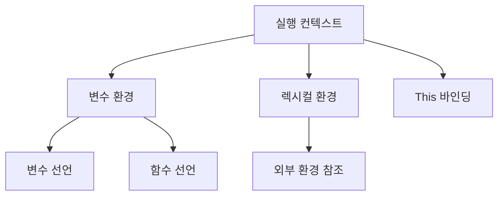
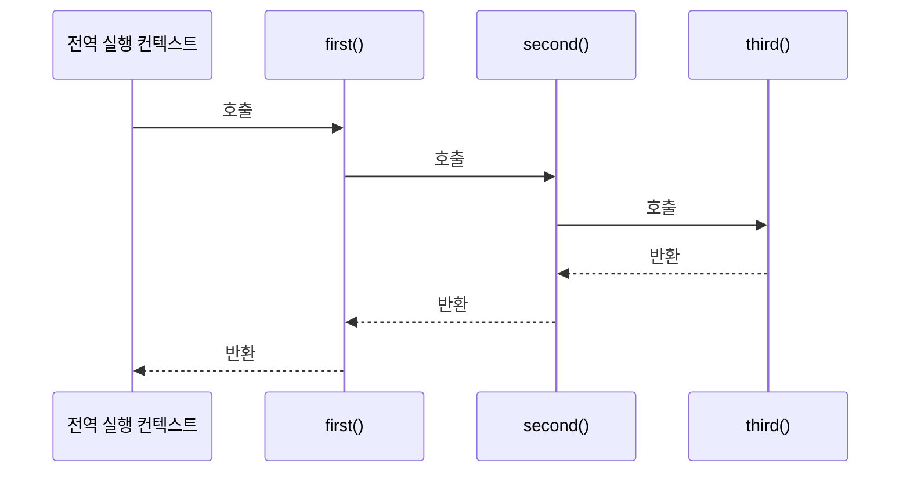
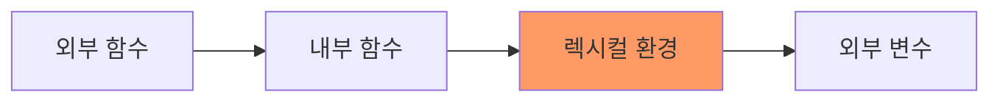

# JavaScript 클로저와 실행 컨텍스트 🔍

## 목차
1. [실행 컨텍스트의 이해](#실행-컨텍스트의-이해)
2. [클로저의 개념](#클로저의-개념)
3. [스코프와 스코프 체인](#스코프와-스코프-체인)
4. [실전 활용 패턴](#실전-활용-패턴)
5. [실전 예제](#실전-예제)

## 실행 컨텍스트의 이해 🎯

실행 컨텍스트는 JavaScript 코드가 실행되는 환경을 의미합니다. 코드가 실행될 때 생성되는 컨텍스트는 변수, 함수 선언, this 값 등의 정보를 포함합니다.



### 실행 컨텍스트의 종류

```javascript
// 1. 전역 실행 컨텍스트
let globalVariable = "전역 변수";

// 2. 함수 실행 컨텍스트
function exampleFunction() {
    let localVariable = "지역 변수";
    console.log(globalVariable); // 외부 환경 참조
}

// 3. eval 실행 컨텍스트 (권장하지 않음)
eval('let evalVariable = "eval 내부 변수";');
```

### 실행 컨텍스트 스택

```javascript
function first() {
    console.log('첫 번째 함수');
    second();
}

function second() {
    console.log('두 번째 함수');
    third();
}

function third() {
    console.log('세 번째 함수');
}

first(); // 실행 컨텍스트 스택이 쌓이는 순서 확인
```



## 클로저의 개념 🔒

클로저는 함수가 자신이 선언된 환경(렉시컬 환경)을 기억하고 있다가, 나중에 그 환경 밖에서 실행될 때도 해당 환경에 접근할 수 있는 특성을 말합니다.

### 클로저의 기본 예제

```javascript
function createCounter() {
    let count = 0;  // 클로저가 기억할 환경의 변수
    
    return {
        increment() {
            return ++count;
        },
        decrement() {
            return --count;
        },
        getCount() {
            return count;
        }
    };
}

const counter = createCounter();
console.log(counter.increment()); // 1
console.log(counter.increment()); // 2
console.log(counter.decrement()); // 1
```

### 클로저의 동작 원리



## 스코프와 스코프 체인 ⛓️

스코프는 변수와 함수의 접근성과 생존 기간을 제어합니다. 스코프 체인은 중첩된 스코프에서 변수를 찾는 방법을 정의합니다.

### 스코프의 종류

```javascript
const globalVar = "전역 변수";

function outerFunction() {
    const outerVar = "외부 함수 변수";
    
    function innerFunction() {
        const innerVar = "내부 함수 변수";
        console.log(globalVar);  // 접근 가능
        console.log(outerVar);   // 접근 가능
        console.log(innerVar);   // 접근 가능
    }
    
    innerFunction();
    // console.log(innerVar); // 오류: 접근 불가
}

outerFunction();
// console.log(outerVar); // 오류: 접근 불가
```

## 실전 활용 패턴 🎨

### 1. 모듈 패턴

프라이빗 변수와 메서드를 구현하는 패턴입니다.

```javascript
const DatabaseModule = (function() {
    // 프라이빗 변수
    let connection = null;
    const config = {
        host: 'localhost',
        port: 5432
    };
    
    // 프라이빗 함수
    function validateConnection() {
        if (!connection) {
            throw new Error('연결이 필요합니다.');
        }
    }
    
    // 퍼블릭 API
    return {
        connect() {
            connection = {/* 연결 객체 */};
            console.log('데이터베이스 연결됨');
        },
        
        query(sql) {
            validateConnection();
            console.log(`쿼리 실행: ${sql}`);
            // 쿼리 실행 로직
        },
        
        disconnect() {
            validateConnection();
            connection = null;
            console.log('연결 종료');
        }
    };
})();
```

### 2. 커링과 클로저

```javascript
function createLogger(prefix) {
    const getTimestamp = () => new Date().toISOString();
    
    return function(level) {
        return function(message) {
            console.log(`[${prefix}] [${level}] [${getTimestamp()}] ${message}`);
        };
    };
}

const logger = createLogger('App');
const errorLogger = logger('ERROR');
const infoLogger = logger('INFO');

errorLogger('오류가 발생했습니다.');
infoLogger('애플리케이션이 시작되었습니다.');
```

## 실전 예제 💡

### 1. 캐시 매니저 구현

```javascript
function createCacheManager() {
    const cache = new Map();
    const stats = {
        hits: 0,
        misses: 0
    };
    
    return {
        async get(key, fetchData) {
            if (cache.has(key)) {
                stats.hits++;
                return cache.get(key);
            }
            
            stats.misses++;
            const data = await fetchData();
            cache.set(key, data);
            return data;
        },
        
        set(key, value) {
            cache.set(key, value);
        },
        
        invalidate(key) {
            cache.delete(key);
        },
        
        getStats() {
            return {
                ...stats,
                hitRate: stats.hits / (stats.hits + stats.misses)
            };
        }
    };
}

// 사용 예시
async function example() {
    const cacheManager = createCacheManager();
    
    // 데이터 가져오기 (캐시 미스)
    const data1 = await cacheManager.get('key1', async () => {
        // 실제로는 API 호출이나 DB 쿼리가 될 수 있음
        return { id: 1, name: '데이터1' };
    });
    
    // 같은 키로 다시 요청 (캐시 히트)
    const data2 = await cacheManager.get('key1', async () => {
        return { id: 1, name: '데이터1' };
    });
    
    console.log(cacheManager.getStats());
}
```

### 2. 이벤트 관리 시스템

```javascript
function createEventManager() {
    const listeners = new Map();
    
    function ensureArray(key) {
        if (!listeners.has(key)) {
            listeners.set(key, []);
        }
        return listeners.get(key);
    }
    
    return {
        on(event, callback) {
            const callbacks = ensureArray(event);
            callbacks.push(callback);
            
            // 구독 취소 함수 반환
            return () => {
                const index = callbacks.indexOf(callback);
                if (index !== -1) {
                    callbacks.splice(index, 1);
                }
            };
        },
        
        emit(event, data) {
            const callbacks = listeners.get(event) || [];
            callbacks.forEach(callback => {
                try {
                    callback(data);
                } catch (error) {
                    console.error('이벤트 처리 중 오류:', error);
                }
            });
        },
        
        once(event, callback) {
            const unsubscribe = this.on(event, (...args) => {
                unsubscribe();
                callback(...args);
            });
            return unsubscribe;
        },
        
        listenerCount(event) {
            return (listeners.get(event) || []).length;
        }
    };
}

// 사용 예시
const eventManager = createEventManager();

// 이벤트 리스너 등록
const unsubscribe = eventManager.on('userLoggedIn', user => {
    console.log('사용자 로그인:', user);
});

// 일회성 이벤트 리스너
eventManager.once('appInit', () => {
    console.log('앱 초기화 완료');
});

// 이벤트 발생
eventManager.emit('userLoggedIn', { id: 1, name: '홍길동' });
eventManager.emit('appInit');

// 리스너 제거
unsubscribe();
```

## 연습 문제 ✏️

1. 다음 코드의 출력 결과를 예측해보세요:

```javascript
function createMultiplier(factor) {
    return function(number) {
        return number * factor;
    };
}

const double = createMultiplier(2);
const triple = createMultiplier(3);

console.log(double(5));
console.log(triple(5));
```

2. 프라이빗 변수를 사용하는 사용자 관리 모듈을 구현해보세요:

```javascript
// 여기에 구현하세요
// 요구사항:
// 1. 사용자 추가/수정/삭제 기능
// 2. 비밀번호는 외부에서 직접 접근 불가능
// 3. 사용자 검증 기능
```

<details>
<summary>정답 보기</summary>

1. 출력 결과:
```javascript
10  // double(5): 5 * 2
15  // triple(5): 5 * 3
```

2. 사용자 관리 모듈 구현:
```javascript
const UserManager = (function() {
    const users = new Map();
    
    function validatePassword(password) {
        return password.length >= 8;
    }
    
    return {
        addUser(username, password) {
            if (!validatePassword(password)) {
                throw new Error('비밀번호는 8자 이상이어야 합니다.');
            }
            users.set(username, { 
                username, 
                passwordHash: hashPassword(password) 
            });
        },
        
        authenticate(username, password) {
            const user = users.get(username);
            if (!user) return false;
            return verifyPassword(password, user.passwordHash);
        },
        
        removeUser(username) {
            users.delete(username);
        },
        
        getUserCount() {
            return users.size;
        }
    };
})();
```
</details>

## 추가 학습 자료 📚

1. [MDN - Closures](https://developer.mozilla.org/ko/docs/Web/JavaScript/Closures)
2. [MDN - Execution context](https://developer.mozilla.org/ko/docs/Web/JavaScript/Reference/Operators/this)

## 다음 학습 내용 예고 🔜

다음 장에서는 "고급 비동기 프로그래밍"에 대해 배워볼 예정입니다. 제너레이터, 이터레이터, async/await의 고급 활용법을 알아보겠습니다!