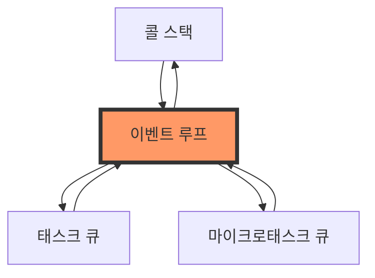
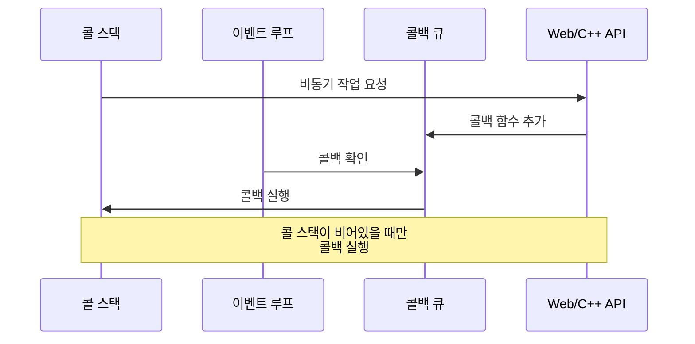
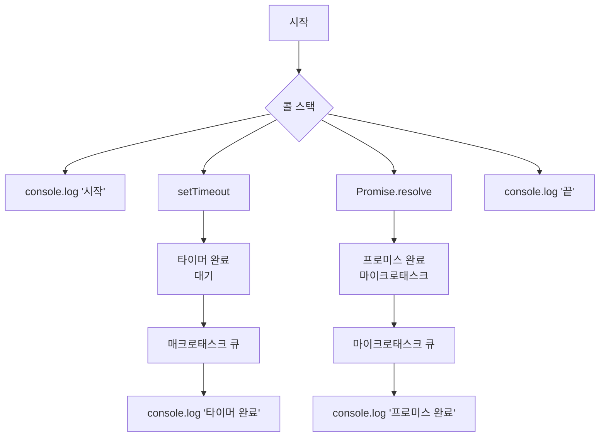

# JavaScript 이벤트 루프와 비동기 프로그래밍 심화 🔄

## 목차
1. [이벤트 루프의 이해](#이벤트-루프의-이해)
2. [비동기 실행의 내부 동작](#비동기-실행의-내부-동작)
3. [태스크 큐와 마이크로태스크 큐](#태스크-큐와-마이크로태스크-큐)
4. [비동기 패턴의 고급 활용](#비동기-패턴의-고급-활용)
5. [실전 예제](#실전-예제)

## 이벤트 루프의 이해 🎯

이벤트 루프는 JavaScript의 동시성 모델의 핵심입니다. 싱글 스레드 언어인 JavaScript가 어떻게 비동기 작업을 처리할 수 있는지를 설명하는 메커니즘입니다.



### 주요 구성 요소

1. **콜 스택 (Call Stack)**
   - JavaScript 코드가 실행되는 공간
   - 함수 호출을 순서대로 쌓고 실행

```javascript
function first() {
    console.log('1번');
    second();
}

function second() {
    console.log('2번');
}

first();
// 출력:
// 1번
// 2번
```

2. **Web API (브라우저) / C++ API (Node.js)**
   - setTimeout, fetch, 파일 읽기 등의 비동기 작업 처리
   - 콜 스택과 별개로 동작

3. **콜백 큐 (Callback Queue)**
   - 비동기 작업이 완료된 후 실행할 콜백 함수들이 대기

### 이벤트 루프의 동작 원리



## 비동기 실행의 내부 동작 ⚙️

JavaScript에서 비동기 코드가 실행되는 과정을 자세히 살펴보겠습니다.

### 실행 과정 예시

```javascript
console.log('시작');

setTimeout(() => {
    console.log('타이머 완료');
}, 0);

Promise.resolve().then(() => {
    console.log('프로미스 완료');
});

console.log('끝');

// 출력 순서:
// 시작
// 끝
// 프로미스 완료
// 타이머 완료
```

이 코드의 실행 과정을 다이어그램으로 표현하면:



## 태스크 큐와 마이크로태스크 큐 📋

JavaScript에는 두 가지 주요 큐가 있습니다:

### 1. 매크로태스크 큐 (Task Queue)
- setTimeout, setInterval
- setImmediate (Node.js)
- requestAnimationFrame (브라우저)
- I/O 작업
- UI 렌더링 (브라우저)

### 2. 마이크로태스크 큐 (Microtask Queue)
- Promise의 then/catch/finally 핸들러
- process.nextTick (Node.js)
- queueMicrotask()
- MutationObserver (브라우저)

```javascript
console.log('1');

setTimeout(() => {
    console.log('2');
}, 0);

Promise.resolve().then(() => {
    console.log('3');
}).then(() => {
    console.log('4');
});

console.log('5');

// 출력:
// 1
// 5
// 3
// 4
// 2
```

## 비동기 패턴의 고급 활용 🔨

### 1. 비동기 작업 제어하기

```javascript
class AsyncController {
    constructor() {
        this.queue = [];
        this.running = false;
        this.concurrency = 2; // 동시 실행 개수
    }

    async add(task) {
        this.queue.push(task);
        if (!this.running) {
            this.running = true;
            await this.process();
        }
    }

    async process() {
        while (this.queue.length > 0) {
            const batch = this.queue.splice(0, this.concurrency);
            const results = await Promise.all(
                batch.map(task => this.executeTask(task))
            );
            console.log('배치 처리 완료:', results);
        }
        this.running = false;
    }

    async executeTask(task) {
        try {
            return await task();
        } catch (error) {
            console.error('작업 실행 중 오류:', error);
            throw error;
        }
    }
}

// 사용 예시
const controller = new AsyncController();

controller.add(async () => {
    await sleep(1000);
    return '작업 1';
});

controller.add(async () => {
    await sleep(500);
    return '작업 2';
});
```

### 2. 진행 상태 모니터링

```javascript
class ProgressTracker {
    constructor() {
        this.total = 0;
        this.completed = 0;
        this.listeners = new Set();
    }

    addTask(count = 1) {
        this.total += count;
        this.notify();
    }

    completeTask(count = 1) {
        this.completed += count;
        this.notify();
    }

    onProgress(callback) {
        this.listeners.add(callback);
        return () => this.listeners.delete(callback);
    }

    notify() {
        const progress = {
            total: this.total,
            completed: this.completed,
            percentage: (this.completed / this.total) * 100
        };

        this.listeners.forEach(callback => callback(progress));
    }
}

// 사용 예시
const tracker = new ProgressTracker();

tracker.onProgress(progress => {
    console.log(`진행률: ${progress.percentage}%`);
});

async function processItems(items) {
    tracker.addTask(items.length);

    for (const item of items) {
        await processItem(item);
        tracker.completeTask();
    }
}
```

## 실전 예제 💡

### 1. 스마트 캐시 시스템

비동기 작업의 결과를 효율적으로 캐시하고 관리하는 시스템입니다.

```javascript
class SmartCache {
    constructor(options = {}) {
        this.cache = new Map();
        this.ttl = options.ttl || 5000; // 기본 5초
        this.pending = new Map();
    }

    async get(key, fetchData) {
        // 캐시 확인
        if (this.cache.has(key)) {
            const entry = this.cache.get(key);
            if (Date.now() < entry.expiry) {
                return entry.data;
            }
            this.cache.delete(key);
        }

        // 진행 중인 요청이 있다면 해당 Promise 반환
        if (this.pending.has(key)) {
            return this.pending.get(key);
        }

        // 새로운 데이터 가져오기
        const promise = (async () => {
            try {
                const data = await fetchData();
                this.cache.set(key, {
                    data,
                    expiry: Date.now() + this.ttl
                });
                return data;
            } finally {
                this.pending.delete(key);
            }
        })();

        this.pending.set(key, promise);
        return promise;
    }

    invalidate(key) {
        this.cache.delete(key);
    }

    clear() {
        this.cache.clear();
        this.pending.clear();
    }
}

// 사용 예시
const cache = new SmartCache({ ttl: 10000 });

async function fetchUserData(userId) {
    return cache.get(`user:${userId}`, async () => {
        const response = await fetch(`/api/users/${userId}`);
        return response.json();
    });
}
```

### 2. 작업 스케줄러

시간 간격을 두고 작업을 실행하는 스케줄러입니다.

```javascript
class TaskScheduler {
    constructor() {
        this.tasks = new Map();
    }

    schedule(name, interval, task) {
        if (this.tasks.has(name)) {
            this.cancel(name);
        }

        let lastRun = 0;
        let timeoutId = null;

        const runner = async () => {
            const now = Date.now();
            if (now - lastRun >= interval) {
                try {
                    await task();
                    lastRun = now;
                } catch (error) {
                    console.error(`작업 실행 중 오류 [${name}]:`, error);
                }
            }

            timeoutId = setTimeout(runner, 100);
        };

        timeoutId = setTimeout(runner, 0);
        this.tasks.set(name, timeoutId);

        return {
            cancel: () => this.cancel(name)
        };
    }

    cancel(name) {
        const timeoutId = this.tasks.get(name);
        if (timeoutId) {
            clearTimeout(timeoutId);
            this.tasks.delete(name);
        }
    }

    cancelAll() {
        for (const name of this.tasks.keys()) {
            this.cancel(name);
        }
    }
}

// 사용 예시
const scheduler = new TaskScheduler();

// 1분마다 실행되는 작업 예약
const task = scheduler.schedule('monitoring', 60000, async () => {
    const stats = await collectSystemStats();
    await sendToMonitoring(stats);
});

// 나중에 작업 취소
task.cancel();
```

## 연습 문제 ✏️

1. 다음 코드의 실행 결과를 예측해보세요:

```javascript
console.log('A');

setTimeout(() => console.log('B'), 0);

Promise.resolve().then(() => {
    console.log('C');
    setTimeout(() => console.log('D'), 0);
}).then(() => {
    console.log('E');
});

console.log('F');
```

2. 주어진 여러 Promise를 순차적으로 실행하는 함수를 구현해보세요:

```javascript
// 구현해야 할 함수
function executeSequentially(promises) {
    // 여기에 구현
}

// 테스트
const tasks = [
    () => new Promise(resolve => setTimeout(() => resolve(1), 100)),
    () => new Promise(resolve => setTimeout(() => resolve(2), 50)),
    () => new Promise(resolve => setTimeout(() => resolve(3), 80))
];
```

<details>
<summary>정답 보기</summary>

1. 실행 결과:
```
A
F
C
E
B
D
```

설명:
- 동기 코드 ('A', 'F') 가 먼저 실행됨
- Promise의 then 핸들러 ('C', 'E') 가 마이크로태스크로 실행됨
- setTimeout 콜백 ('B', 'D') 이 매크로태스크로 마지막에 실행됨

2. 순차 실행 구현:
```javascript
async function executeSequentially(promises) {
    const results = [];
    for (const promise of promises) {
        results.push(await promise());
    }
    return results;
}

// 또는 reduce 사용
async function executeSequentially(promises) {
    return promises.reduce(async (chain, promise) => {
        const results = await chain;
        const result = await promise();
        return [...results, result];
    }, Promise.resolve([]));
}
```
</details>

## 추가 학습 자료 📚

1. [자바스크립트 이벤트 루프 시각화](http://latentflip.com/loupe/)
2. [MDN - 동시성 모델과 이벤트 루프](https://developer.mozilla.org/ko/docs/Web/JavaScript/EventLoop)
3. [Node.js 이벤트 루프 문서](https://nodejs.org/ko/docs/guides/event-loop-timers-and-nexttick/)

## 다음 학습 내용 예고 🔜

다음 장에서는 "메모리 관리와 가비지 컬렉션"에 대해서 알아보겠습니다.