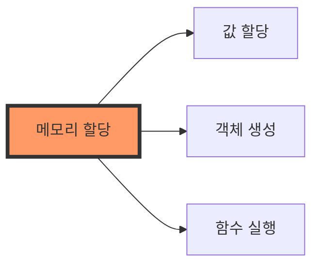
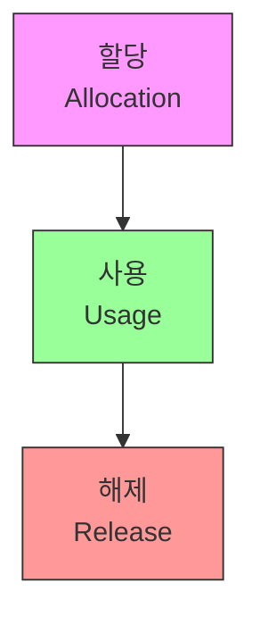
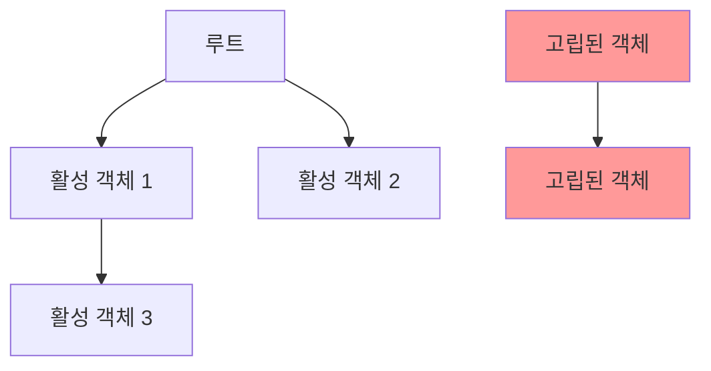

# JavaScript 메모리 관리와 가비지 컬렉션 🧹

## 목차
1. [메모리 관리 기초](#메모리-관리-기초)
2. [가비지 컬렉션의 동작 원리](#가비지-컬렉션의-동작-원리)
3. [메모리 누수의 이해와 방지](#메모리-누수의-이해와-방지)
4. [최적화 전략](#최적화-전략)
5. [실전 예제](#실전-예제)

## 메모리 관리 기초 💡

JavaScript의 메모리 관리는 자동으로 이루어지지만, 효율적인 프로그래밍을 위해서는 그 원리를 이해하는 것이 중요합니다.

### 메모리 할당의 기본



```javascript
// 1. 값 할당
let number = 123;                    // 숫자 메모리 할당
let text = "Hello, World!";          // 문자열 메모리 할당

// 2. 객체 생성
let user = {                         // 객체 메모리 할당
    name: "홍길동",
    age: 25
};

// 3. 배열 생성
let items = new Array(1000);         // 배열 메모리 할당
```

### 메모리 생명 주기



1. **할당(Allocation)**: 필요한 메모리를 시스템에서 할당받음
2. **사용(Usage)**: 할당된 메모리를 읽고 쓰는 작업
3. **해제(Release)**: 필요 없어진 메모리를 시스템에 반환

## 가비지 컬렉션의 동작 원리 🔄

JavaScript의 가비지 컬렉터는 더 이상 사용되지 않는 메모리를 자동으로 해제합니다.

### 표시하고-쓸기(Mark-and-Sweep) 알고리즘



```javascript
function demonstrateGC() {
    let obj1 = { data: "some data" };
    let obj2 = { data: "more data" };
    
    // obj1과 obj2를 연결
    obj1.next = obj2;
    obj2.prev = obj1;
    
    // obj1에 대한 참조 제거
    obj1 = null;
    
    // obj2에 대한 참조 제거
    obj2 = null;
    
    // 이제 두 객체 모두 가비지 컬렉션의 대상이 됨
}
```

### 가비지 컬렉션 과정

1. **표시(Mark)**: 루트(전역 객체, 현재 함수의 지역 변수 등)에서 시작하여 도달 가능한 모든 객체를 표시
2. **쓸기(Sweep)**: 표시되지 않은 객체들을 메모리에서 해제
3. **압축(Compact)**: 선택적으로 남은 객체들을 모아 메모리 단편화 방지

## 메모리 누수의 이해와 방지 🚰

메모리 누수는 더 이상 필요하지 않은 메모리가 해제되지 않고 남아있는 현상입니다.

### 주요 메모리 누수 패턴

1. **순환 참조**
```javascript
function createCircularReference() {
    let obj1 = {};
    let obj2 = {};
    
    obj1.ref = obj2;      // obj1은 obj2를 참조
    obj2.ref = obj1;      // obj2는 obj1을 참조
    
    return "함수 종료";    // 두 객체는 서로를 참조하여 메모리에 남음
}
```

2. **이벤트 리스너 미제거**
```javascript
function addHandlers() {
    const element = document.getElementById('button');
    
    element.addEventListener('click', () => {
        // 이벤트 핸들러
    });
    
    // element가 제거되어도 이벤트 리스너는 남아있음
}
```

3. **클로저의 부적절한 사용**
```javascript
function createLeak() {
    const largeData = new Array(1000000);
    
    return function() {
        // largeData의 일부만 사용
        return largeData[0];
    };
}

const leak = createLeak(); // largeData 전체가 메모리에 유지됨
```

### 메모리 누수 방지 방법

```javascript
class ResourceManager {
    constructor() {
        this.resources = new Map();
        this.listeners = new Set();
    }
    
    addResource(key, value) {
        this.resources.set(key, {
            value,
            timestamp: Date.now()
        });
    }
    
    removeResource(key) {
        if (this.resources.has(key)) {
            const resource = this.resources.get(key);
            // 리소스 정리
            resource.value = null;
            this.resources.delete(key);
        }
    }
    
    addEventListener(listener) {
        this.listeners.add(listener);
        // 리스너 제거 함수 반환
        return () => {
            this.listeners.delete(listener);
        };
    }
    
    cleanup() {
        const now = Date.now();
        for (const [key, resource] of this.resources) {
            if (now - resource.timestamp > 3600000) { // 1시간
                this.removeResource(key);
            }
        }
    }
}
```

## 최적화 전략 🎯

### 1. 객체 풀링

자주 생성되고 삭제되는 객체들을 재사용하는 패턴입니다.

```javascript
class ObjectPool {
    constructor(createFn, initialSize = 5) {
        this.createFn = createFn;
        this.pool = [];
        this.active = new Set();
        
        // 초기 객체들 생성
        for (let i = 0; i < initialSize; i++) {
            this.pool.push(this.createFn());
        }
    }
    
    acquire() {
        let obj = this.pool.pop() || this.createFn();
        this.active.add(obj);
        return obj;
    }
    
    release(obj) {
        if (this.active.delete(obj)) {
            // 객체 상태 초기화
            if (obj.reset) {
                obj.reset();
            }
            this.pool.push(obj);
        }
    }
    
    get size() {
        return {
            pool: this.pool.length,
            active: this.active.size
        };
    }
}

// 사용 예시
const bulletPool = new ObjectPool(() => ({
    x: 0,
    y: 0,
    active: false,
    reset() {
        this.x = 0;
        this.y = 0;
        this.active = false;
    }
}));
```

### 2. 메모리 사용량 모니터링

```javascript
class MemoryMonitor {
    constructor(warningThreshold = 80) { // 80%
        this.warningThreshold = warningThreshold;
        this.snapshots = [];
    }
    
    takeSnapshot() {
        if (typeof window !== 'undefined' && window.performance) {
            const memory = window.performance.memory;
            const usage = (memory.usedJSHeapSize / memory.jsHeapSizeLimit) * 100;
            
            this.snapshots.push({
                timestamp: Date.now(),
                usage: usage,
                used: memory.usedJSHeapSize,
                total: memory.jsHeapSizeLimit
            });
            
            if (usage > this.warningThreshold) {
                console.warn(`메모리 사용량 경고: ${usage.toFixed(2)}%`);
            }
            
            return usage;
        }
        return null;
    }
    
    getAverageUsage(minutes = 5) {
        const now = Date.now();
        const relevantSnapshots = this.snapshots.filter(
            s => (now - s.timestamp) <= minutes * 60 * 1000
        );
        
        if (relevantSnapshots.length === 0) return 0;
        
        const sum = relevantSnapshots.reduce((acc, s) => acc + s.usage, 0);
        return sum / relevantSnapshots.length;
    }
    
    cleanup() {
        const now = Date.now();
        this.snapshots = this.snapshots.filter(
            s => (now - s.timestamp) <= 24 * 60 * 60 * 1000 // 24시간
        );
    }
}
```

## 실전 예제 💡

### 1. 이미지 갤러리 최적화

대량의 이미지를 효율적으로 관리하는 예제입니다.

```javascript
class OptimizedGallery {
    constructor(containerElement, options = {}) {
        this.container = containerElement;
        this.options = {
            lazyLoad: true,
            preloadCount: 3,
            unloadCount: 10,
            ...options
        };
        
        this.images = new Map();
        this.loadQueue = [];
        this.visibleImages = new Set();
    }
    
    addImage(src) {
        if (!this.images.has(src)) {
            this.images.set(src, {
                element: null,
                loaded: false,
                visible: false
            });
            
            if (this.options.lazyLoad) {
                this.loadQueue.push(src);
                this.processQueue();
            } else {
                this.loadImage(src);
            }
        }
    }
    
    async loadImage(src) {
        const imageData = this.images.get(src);
        if (!imageData || imageData.loaded) return;
        
        try {
            const element = new Image();
            element.src = src;
            await new Promise((resolve, reject) => {
                element.onload = resolve;
                element.onerror = reject;
            });
            
            imageData.element = element;
            imageData.loaded = true;
            
            if (imageData.visible) {
                this.container.appendChild(element);
            }
        } catch (error) {
            console.error(`이미지 로드 실패: ${src}`, error);
            this.images.delete(src);
        }
    }
    
    setVisibility(src, visible) {
        const imageData = this.images.get(src);
        if (!imageData) return;
        
        imageData.visible = visible;
        
        if (visible) {
            this.visibleImages.add(src);
            if (imageData.loaded && imageData.element) {
                this.container.appendChild(imageData.element);
            }
        } else {
            this.visibleImages.delete(src);
            if (imageData.element) {
                this.container.removeChild(imageData.element);
            }
        }
        
        this.manageMemory();
    }
    
    manageMemory() {
        // 화면에서 멀어진 이미지 언로드
        const visibleArray = Array.from(this.visibleImages);
        const toUnload = visibleArray.slice(this.options.unloadCount);
        
        for (const src of toUnload) {
            const imageData = this.images.get(src);
            if (imageData && imageData.loaded) {
                imageData.element = null;
                imageData.loaded = false;
                this.loadQueue.push(src);
            }
        }
    }
    
    processQueue() {
        while (this.loadQueue.length > 0 && 
               this.visibleImages.size < this.options.preloadCount) {
            const src = this.loadQueue.shift();
            this.loadImage(src);
        }
    }
    
    destroy() {
        this.container.innerHTML = '';
        this.images.clear();
        this.loadQueue = [];
        this.visibleImages.clear();
    }
}
```

### 2. 캐시 메모리 관리자

메모리 사용량을 고려한 캐시 시스템입니다.

```javascript
class MemoryAwareCache {
    constructor(options = {}) {
        this.maxSize = options.maxSize || 100;
        this.maxMemory = options.maxMemory || 50 * 1024 * 1024; // 50MB
        this.ttl = options.ttl || 3600000; // 1시간
        
        this.cache = new Map();
        this.usage = new Map();
        this.totalMemory = 0;
    }
    
    estimateSize(value) {
        const str = JSON.stringify(value);
        return str.length * 2; // UTF-16 문자당 2바이트
    }
    
    set(key, value, ttl = this.ttl) {
        const size = this.estimateSize(value);
        
        // 메모리 제한 확인
        if (size > this.maxMemory) {
            throw new Error('값이 최대 메모리 제한을 초과합니다.');
        }
        
        // 공간 확보
        while (this.totalMemory + size > this.maxMemory || this.cache.size >= this.maxSize) {
            this.evictOldest();
        }
        
        // 캐시 저장
        this.cache.set(key, {
            value,
            expires: Date.now() + ttl,
            accessCount: 0
        });
        
        this.usage.set(key, size);
        this.totalMemory += size;
    }
    
    get(key) {
        const entry = this.cache.get(key);
        if (!entry) return null;
        
        // TTL 체크
        if (Date.now() > entry.expires) {
            this.delete(key);
            return null;
        }
        
        entry.accessCount++;
        return entry.value;
    }
    
    delete(key) {
        if (this.cache.has(key)) {
            const size = this.usage.get(key);
            this.totalMemory -= size;
            this.cache.delete(key);
            this.usage.delete(key);
        }
    }
    
    evictOldest() {
        let oldestKey = null;
        let oldestTime = Infinity;
        let leastAccessed = Infinity;
        
        for (const [key, entry] of this.cache.entries()) {
            if (entry.accessCount < leastAccessed || 
                (entry.accessCount === leastAccessed && entry.expires < oldestTime)) {
                oldestKey = key;
                oldestTime = entry.expires;
                leastAccessed = entry.accessCount;
            }
        }
        
        if (oldestKey) {
            this.delete(oldestKey);
        }
    }
    
    clear() {
        this.cache.clear();
        this.usage.clear();
        this.totalMemory = 0;
    }
    
    getStats() {
        return {
            size: this.cache.size,
            memoryUsage: this.totalMemory,
            memoryLimit: this.maxMemory,
            utilizationPercentage: (this.totalMemory / this.maxMemory) * 100
        };
    }
}

// 사용 예시
const cache = new MemoryAwareCache({
    maxSize: 1000,
    maxMemory: 5 * 1024 * 1024, // 5MB
    ttl: 60000 // 1분
});

cache.set('user:1', { id: 1, name: '홍길동', data: '큰 데이터...' });
const user = cache.get('user:1');
console.log('캐시 통계:', cache.getStats());
```

## 연습 문제 ✏️

1. 다음 코드에서 발생할 수 있는 메모리 누수를 찾고 수정해보세요:

```javascript
class DataManager {
    constructor() {
        this.cache = {};
        this.handlers = [];
    }
    
    addHandler(element, event, handler) {
        element.addEventListener(event, handler);
        this.handlers.push({ element, event, handler });
    }
    
    storeData(key, value) {
        this.cache[key] = value;
    }
}
```

2. 주어진 배열에서 중복된 객체를 제거하면서 메모리 사용을 최적화하는 함수를 작성해보세요:

```javascript
function optimizeArray(arr) {
    // 여기에 구현하세요
}

const array = [
    { id: 1, data: '큰 데이터...' },
    { id: 2, data: '큰 데이터...' },
    { id: 1, data: '큰 데이터...' }  // 중복
];
```

<details>
<summary>정답 보기</summary>

1. 메모리 누수 수정:
```javascript
class DataManager {
    constructor() {
        this.cache = new Map();
        this.handlers = new Set();
    }
    
    addHandler(element, event, handler) {
        const wrappedHandler = (...args) => handler(...args);
        element.addEventListener(event, wrappedHandler);
        this.handlers.add({ element, event, handler: wrappedHandler });
        
        // 핸들러 제거 함수 반환
        return () => {
            element.removeEventListener(event, wrappedHandler);
            this.handlers.delete({ element, event, handler: wrappedHandler });
        };
    }
    
    storeData(key, value, ttl = 3600000) {
        this.cache.set(key, {
            value,
            expires: Date.now() + ttl
        });
    }
    
    cleanup() {
        // 만료된 캐시 정리
        const now = Date.now();
        for (const [key, entry] of this.cache.entries()) {
            if (now > entry.expires) {
                this.cache.delete(key);
            }
        }
        
        // 메모리 해제
        this.handlers.forEach(({ element, event, handler }) => {
            if (!document.contains(element)) {
                element.removeEventListener(event, handler);
                this.handlers.delete({ element, event, handler });
            }
        });
    }
    
    destroy() {
        this.cache.clear();
        this.handlers.forEach(({ element, event, handler }) => {
            element.removeEventListener(event, handler);
        });
        this.handlers.clear();
    }
}
```

2. 배열 최적화:
```javascript
function optimizeArray(arr) {
    const seen = new Map();
    return arr.filter(item => {
        const key = item.id;
        if (seen.has(key)) {
            return false;
        }
        seen.set(key, true);
        return true;
    });
}
```
</details>

## 추가 학습 자료 📚

1. [MDN - 메모리 관리](https://developer.mozilla.org/ko/docs/Web/JavaScript/Memory_Management)
2. [V8 엔진의 가비지 컬렉션](https://v8.dev/blog/trash-talk)
3. [Node.js 메모리 누수 디버깅](https://github.com/node-inspector/node-inspector)

## 다음 학습 내용 예고 🔜

다음 장에서는 "스트림과 버퍼"에 대해 배워볼 예정입니다. Node.js에서 대용량 데이터를 효율적으로 처리하는 방법을 알아보겠습니다!