# Node.js 스트림과 버퍼 💫

## 목차
1. [버퍼의 이해](#버퍼의-이해)
2. [스트림의 기본 개념](#스트림의-기본-개념)
3. [스트림의 종류와 활용](#스트림의-종류와-활용)
4. [파이프라인과 체이닝](#파이프라인과-체이닝)
5. [실전 예제](#실전-예제)

## 버퍼의 이해 📦

버퍼(Buffer)는 Node.js에서 이진 데이터를 직접 다루기 위한 객체입니다. 메모리의 특정 영역을 나타내며, 파일 읽기/쓰기나 네트워크 통신에서 주로 사용됩니다.

### 버퍼 생성과 조작

```javascript
// 버퍼 생성 방법들
const buf1 = Buffer.alloc(10);                    // 10바이트 빈 버퍼
const buf2 = Buffer.from('Hello, 세상!');         // 문자열로부터 버퍼 생성
const buf3 = Buffer.from([1, 2, 3, 4, 5]);       // 숫자 배열로부터 버퍼 생성

// 버퍼 조작
console.log(buf2.toString());                     // 'Hello, 세상!'
console.log(buf2.length);                         // 버퍼의 바이트 길이
console.log(buf3.readInt8(0));                    // 첫 번째 바이트 읽기
```

### 버퍼 변환과 인코딩

```javascript
class BufferConverter {
    static textToBuffer(text, encoding = 'utf8') {
        return Buffer.from(text, encoding);
    }
    
    static bufferToText(buffer, encoding = 'utf8') {
        return buffer.toString(encoding);
    }
    
    static concatBuffers(buffers) {
        return Buffer.concat(buffers);
    }
    
    static copyBuffer(sourceBuffer, targetStart = 0) {
        const newBuffer = Buffer.alloc(sourceBuffer.length);
        sourceBuffer.copy(newBuffer, targetStart);
        return newBuffer;
    }
}

// 사용 예시
const originalText = "안녕하세요!";
const buffer = BufferConverter.textToBuffer(originalText);
const copiedBuffer = BufferConverter.copyBuffer(buffer);
console.log(BufferConverter.bufferToText(copiedBuffer));  // '안녕하세요!'
```

## 스트림의 기본 개념 🌊

스트림은 데이터를 작은 조각으로 나누어 처리하는 방식을 제공합니다. 대용량 데이터를 메모리 효율적으로 처리할 수 있습니다.

```mermaid
graph LR
    A[데이터 소스] --> B[Readable Stream]
    B --> C[Transform Stream]
    C --> D[Writable Stream]
    D --> E[데이터 목적지]
    style B fill:#f96
    style C fill:#9f9
    style D fill:#99f
```



### 스트림의 기본 특성

1. **청크(Chunk) 단위 처리**: 데이터를 작은 단위로 나누어 처리
2. **이벤트 기반**: 'data', 'end', 'error' 등의 이벤트 처리
3. **파이프라인 지원**: 여러 스트림을 연결하여 데이터 처리 파이프라인 구성
4. **백프레셔(Backpressure) 자동 처리**: 데이터 처리 속도 조절

```javascript
const fs = require('fs');

// 기본적인 스트림 사용
const readStream = fs.createReadStream('input.txt');
const writeStream = fs.createWriteStream('output.txt');

readStream.on('data', (chunk) => {
    console.log('데이터 청크 수신:', chunk.length, 'bytes');
});

readStream.on('end', () => {
    console.log('데이터 읽기 완료');
});

readStream.pipe(writeStream);
```

## 스트림의 종류와 활용 🔄

### 1. Readable 스트림

데이터를 읽기 위한 인터페이스를 제공합니다.

```javascript
const { Readable } = require('stream');

class NumberStream extends Readable {
    constructor(max) {
        super();
        this.max = max;
        this.current = 1;
    }
    
    _read() {
        if (this.current <= this.max) {
            const number = this.current++;
            // 숫자를 문자열로 변환하여 푸시
            this.push(number.toString());
        } else {
            this.push(null); // 스트림 종료
        }
    }
}

// 사용 예시
const numbers = new NumberStream(5);
numbers.on('data', (chunk) => {
    console.log('숫자:', chunk.toString());
});

numbers.on('end', () => {
    console.log('스트림 종료');
});
```

### 2. Writable 스트림

데이터를 쓰기 위한 인터페이스를 제공합니다.

```javascript
const { Writable } = require('stream');

class ConsoleLogger extends Writable {
    constructor(options) {
        super(options);
        this.total = 0;
    }
    
    _write(chunk, encoding, callback) {
        const data = chunk.toString();
        this.total += parseInt(data, 10);
        console.log(`받은 데이터: ${data}, 현재 합계: ${this.total}`);
        callback();
    }
    
    _final(callback) {
        console.log(`최종 합계: ${this.total}`);
        callback();
    }
}

// 사용 예시
const logger = new ConsoleLogger();
const numbers = new NumberStream(5);
numbers.pipe(logger);
```

### 3. Transform 스트림

데이터를 변환하는 양방향 스트림입니다.

```javascript
const { Transform } = require('stream');

class DataTransformer extends Transform {
    constructor(options = {}) {
        super(options);
    }
    
    _transform(chunk, encoding, callback) {
        try {
            const data = chunk.toString();
            const transformed = this.processData(data);
            this.push(transformed);
            callback();
        } catch (error) {
            callback(error);
        }
    }
    
    processData(data) {
        // 데이터 변환 로직
        return data.toUpperCase();
    }
}
```

## 파이프라인과 체이닝 ⛓️

여러 스트림을 연결하여 복잡한 데이터 처리 파이프라인을 구성할 수 있습니다.

```javascript
const { pipeline } = require('stream/promises');
const fs = require('fs');
const zlib = require('zlib');

async function compressFile(input, output) {
    try {
        await pipeline(
            fs.createReadStream(input),
            zlib.createGzip(),
            fs.createWriteStream(output)
        );
        console.log('파일 압축 완료');
    } catch (error) {
        console.error('파일 압축 실패:', error);
        throw error;
    }
}

// 고급 파이프라인 예시
class StreamProcessor {
    constructor() {
        this.transforms = [];
    }
    
    addTransform(transform) {
        this.transforms.push(transform);
        return this;
    }
    
    async process(inputStream, outputStream) {
        const streams = [inputStream, ...this.transforms, outputStream];
        
        try {
            await pipeline(streams);
            console.log('처리 완료');
        } catch (error) {
            console.error('처리 실패:', error);
            throw error;
        }
    }
}
```

## 실전 예제 💡

### 1. 대용량 로그 파일 분석기

로그 파일을 스트리밍 방식으로 읽어 실시간으로 분석합니다.

```javascript
class LogAnalyzer {
    constructor() {
        this.stats = {
            totalLines: 0,
            errorCount: 0,
            warningCount: 0,
            requestCount: 0
        };
    }
    
    createAnalysisStream() {
        return new Transform({
            objectMode: true,
            transform: (line, encoding, callback) => {
                this.analyzeLine(line.toString());
                callback();
            }
        });
    }
    
    analyzeLine(line) {
        this.stats.totalLines++;
        
        if (line.includes('ERROR')) {
            this.stats.errorCount++;
        } else if (line.includes('WARNING')) {
            this.stats.warningCount++;
        }
        
        if (line.includes('HTTP')) {
            this.stats.requestCount++;
        }
    }
    
    async analyzeFile(filePath) {
        const readStream = fs.createReadStream(filePath);
        const lineBreaker = require('readline').createInterface({
            input: readStream
        });
        
        const analysisStream = this.createAnalysisStream();
        
        await pipeline(
            lineBreaker,
            analysisStream
        );
        
        return this.stats;
    }
}

// 사용 예시
async function analyzeLogFile(filePath) {
    const analyzer = new LogAnalyzer();
    const stats = await analyzer.analyzeFile(filePath);
    console.log('분석 결과:', stats);
}
```

### 2. 실시간 데이터 변환 파이프라인

JSON 데이터를 CSV 형식으로 변환하는 스트리밍 파이프라인입니다.

```javascript
class JsonToCsvTransformer extends Transform {
    constructor(options = {}) {
        super({ ...options, objectMode: true });
        this.headers = options.headers || null;
        this.headersSent = false;
    }
    
    _transform(chunk, encoding, callback) {
        try {
            if (!this.headersSent) {
                this.headers = this.headers || Object.keys(chunk);
                this.push(this.headers.join(',') + '\n');
                this.headersSent = true;
            }
            
            const values = this.headers.map(header => {
                const value = chunk[header];
                return typeof value === 'string' && value.includes(',') 
                    ? `"${value}"` 
                    : value;
            });
            
            this.push(values.join(',') + '\n');
            callback();
        } catch (error) {
            callback(error);
        }
    }
}

class DataProcessor {
    static async processJSONtoCSV(inputPath, outputPath, options = {}) {
        const jsonParser = new Transform({
            objectMode: true,
            transform(chunk, encoding, callback) {
                try {
                    const data = JSON.parse(chunk);
                    callback(null, data);
                } catch (error) {
                    callback(error);
                }
            }
        });
        
        const csvTransformer = new JsonToCsvTransformer(options);
        
        await pipeline(
            fs.createReadStream(inputPath),
            jsonParser,
            csvTransformer,
            fs.createWriteStream(outputPath)
        );
    }
}
```

## 연습 문제 ✏️

1. 파일을 읽어서 모든 단어를 대문자로 변환하고, 결과를 새 파일에 저장하는 스트림 파이프라인을 구현해보세요.

2. 다음 Transform 스트림을 완성해보세요:

```javascript
// 숫자 데이터를 필터링하고 합계를 계산하는 스트림
class NumberSummer extends Transform {
    constructor(options = {}) {
        super(options);
        this.sum = 0;
    }
    
    _transform(chunk, encoding, callback) {
        // 여기에 구현하세요
    }
    
    _flush(callback) {
        // 여기에 구현하세요
    }
}
```

<details>
<summary>정답 보기</summary>

1. 파일 변환 파이프라인:
```javascript
const { pipeline } = require('stream/promises');
const fs = require('fs');
const { Transform } = require('stream');

async function convertToUpperCase(inputFile, outputFile) {
    const upperCaseTransform = new Transform({
        transform(chunk, encoding, callback) {
            callback(null, chunk.toString().toUpperCase());
        }
    });
    
    await pipeline(
        fs.createReadStream(inputFile),
        upperCaseTransform,
        fs.createWriteStream(outputFile)
    );
}
```

2. NumberSummer 구현:
```javascript
class NumberSummer extends Transform {
    constructor(options = {}) {
        super(options);
        this.sum = 0;
    }
    
    _transform(chunk, encoding, callback) {
        const number = parseFloat(chunk.toString());
        if (!isNaN(number)) {
            this.sum += number;
            this.push(`현재 합계: ${this.sum}\n`);
        }
        callback();
    }
    
    _flush(callback) {
        this.push(`최종 합계: ${this.sum}\n`);
        callback();
    }
}
```
</details>

## 추가 학습 자료 📚

1. [Node.js 공식 문서 - 스트림](https://nodejs.org/api/stream.html)
2. [Stream Handbook](https://github.com/substack/stream-handbook)
3. [Node.js 스트림 모범 사례](https://github.com/nodejs/node/blob/master/doc/api/stream.md)

## 다음 학습 내용 예고 🔜

다음 장에서는 "디자인 패턴"에 대해 배워볼 예정입니다