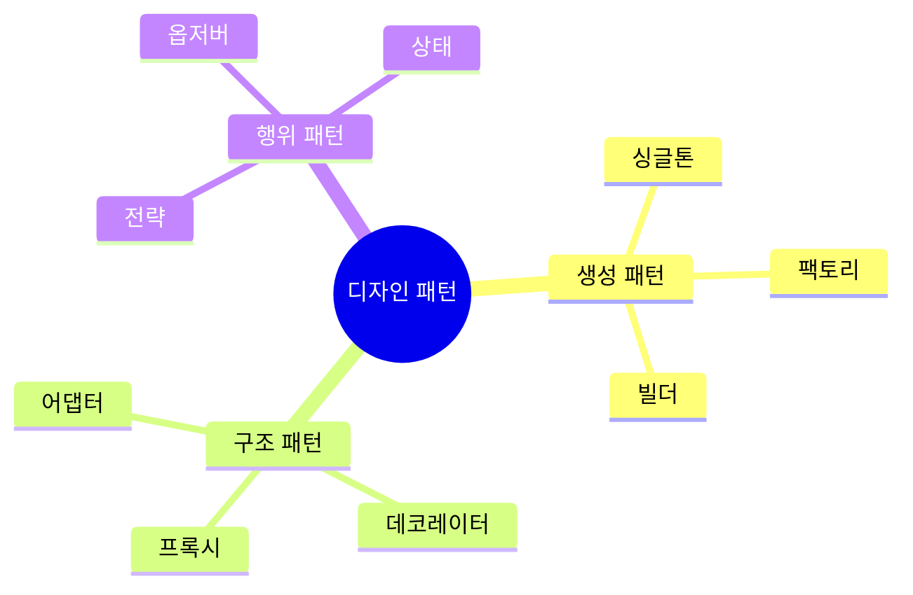

# JavaScript 디자인 패턴 🏗️

## 목차
1. [디자인 패턴의 이해](#디자인-패턴의-이해)
2. [생성 패턴](#생성-패턴)
3. [구조 패턴](#구조-패턴)
4. [행위 패턴](#행위-패턴)
5. [실전 예제](#실전-예제)

## 디자인 패턴의 이해 🎯

디자인 패턴은 소프트웨어 개발에서 자주 발생하는 문제들을 해결하기 위한 검증된 해결책입니다. 코드의 재사용성, 유지보수성, 확장성을 향상시키는데 도움을 줍니다.



## 생성 패턴 🏭

객체 생성 메커니즘을 다루는 패턴들입니다.

### 1. 싱글톤 패턴

애플리케이션 전체에서 하나의 인스턴스만 존재하도록 보장합니다.

```javascript
class DatabaseConnection {
    constructor() {
        if (DatabaseConnection.instance) {
            return DatabaseConnection.instance;
        }
        
        this.config = {
            host: 'localhost',
            port: 5432,
            username: 'admin'
        };
        
        this.connected = false;
        DatabaseConnection.instance = this;
    }
    
    connect() {
        if (this.connected) {
            return console.log('이미 연결되어 있습니다.');
        }
        
        // 데이터베이스 연결 로직
        console.log('데이터베이스 연결 중...');
        this.connected = true;
    }
    
    query(sql) {
        if (!this.connected) {
            throw new Error('데이터베이스 연결이 필요합니다.');
        }
        console.log(`쿼리 실행: ${sql}`);
    }
    
    static getInstance() {
        if (!DatabaseConnection.instance) {
            DatabaseConnection.instance = new DatabaseConnection();
        }
        return DatabaseConnection.instance;
    }
}

// 사용 예시
const db1 = DatabaseConnection.getInstance();
const db2 = DatabaseConnection.getInstance();
console.log(db1 === db2); // true
```

### 2. 팩토리 패턴

객체 생성 로직을 캡슐화하여 유연한 객체 생성을 가능하게 합니다.

```javascript
// 로깅 시스템 예시
class Logger {
    log(message) {
        throw new Error('추상 메서드는 구현해야 합니다.');
    }
}

class ConsoleLogger extends Logger {
    log(message) {
        console.log(`[콘솔] ${message}`);
    }
}

class FileLogger extends Logger {
    constructor(filePath) {
        super();
        this.filePath = filePath;
    }
    
    log(message) {
        console.log(`[파일/${this.filePath}] ${message}`);
        // 실제로는 파일에 쓰기
    }
}

class DatabaseLogger extends Logger {
    constructor(connection) {
        super();
        this.connection = connection;
    }
    
    log(message) {
        console.log(`[DB] ${message}`);
        // 실제로는 DB에 쓰기
    }
}

class LoggerFactory {
    static createLogger(type, options = {}) {
        switch (type) {
            case 'console':
                return new ConsoleLogger();
            case 'file':
                return new FileLogger(options.filePath);
            case 'database':
                return new DatabaseLogger(options.connection);
            default:
                throw new Error(`지원하지 않는 로거 타입: ${type}`);
        }
    }
}

// 사용 예시
const consoleLogger = LoggerFactory.createLogger('console');
const fileLogger = LoggerFactory.createLogger('file', { filePath: 'app.log' });
```

### 3. 빌더 패턴

복잡한 객체의 생성 과정을 단계별로 나누어 처리합니다.

```javascript
class QueryBuilder {
    constructor() {
        this.reset();
    }
    
    reset() {
        this.select = ['*'];
        this.fromTable = '';
        this.whereConditions = [];
        this.orderByFields = [];
        this.limitValue = null;
        return this;
    }
    
    select(fields) {
        this.select = Array.isArray(fields) ? fields : [fields];
        return this;
    }
    
    from(table) {
        this.fromTable = table;
        return this;
    }
    
    where(condition) {
        this.whereConditions.push(condition);
        return this;
    }
    
    orderBy(field, direction = 'ASC') {
        this.orderByFields.push(`${field} ${direction}`);
        return this;
    }
    
    limit(value) {
        this.limitValue = value;
        return this;
    }
    
    build() {
        if (!this.fromTable) {
            throw new Error('FROM 절이 필요합니다.');
        }
        
        let query = `SELECT ${this.select.join(', ')} FROM ${this.fromTable}`;
        
        if (this.whereConditions.length > 0) {
            query += ` WHERE ${this.whereConditions.join(' AND ')}`;
        }
        
        if (this.orderByFields.length > 0) {
            query += ` ORDER BY ${this.orderByFields.join(', ')}`;
        }
        
        if (this.limitValue !== null) {
            query += ` LIMIT ${this.limitValue}`;
        }
        
        return query;
    }
}

// 사용 예시
const query = new QueryBuilder()
    .select(['name', 'email'])
    .from('users')
    .where('age >= 18')
    .where('status = "active"')
    .orderBy('name')
    .limit(10)
    .build();

console.log(query);
// SELECT name, email FROM users WHERE age >= 18 AND status = "active" ORDER BY name ASC LIMIT 10
```

## 구조 패턴 🏗️

객체들을 더 큰 구조로 조합하는 방법을 다루는 패턴들입니다.

### 1. 어댑터 패턴

호환되지 않는 인터페이스들을 함께 동작하도록 만듭니다.

```javascript
// 기존 결제 시스템
class LegacyPaymentSystem {
    processPayment(amount) {
        return `기존 시스템: ${amount}원 결제 완료`;
    }
}

// 새로운 결제 인터페이스
class NewPaymentInterface {
    makePayment(payload) {
        const { amount, currency } = payload;
        return `신규 시스템: ${amount}${currency} 결제 완료`;
    }
}

// 어댑터
class PaymentSystemAdapter {
    constructor(newSystem) {
        this.newSystem = newSystem;
    }
    
    processPayment(amount) {
        return this.newSystem.makePayment({
            amount,
            currency: 'KRW'
        });
    }
}

// 사용 예시
const legacySystem = new LegacyPaymentSystem();
const newSystem = new PaymentSystemAdapter(new NewPaymentInterface());

// 동일한 인터페이스로 사용 가능
console.log(legacySystem.processPayment(1000));
console.log(newSystem.processPayment(1000));
```

### 2. 데코레이터 패턴

객체에 동적으로 새로운 책임을 추가합니다.

```javascript
// 기본 웹 요청 처리기
class WebRequest {
    constructor() {
        this.handlers = [];
    }
    
    addHandler(handler) {
        this.handlers.push(handler);
        return this;
    }
    
    async process(request) {
        let result = request;
        
        for (const handler of this.handlers) {
            result = await handler(result);
        }
        
        return result;
    }
}

// 데코레이터들
const loggingDecorator = (request) => {
    console.log(`요청 처리 중: ${JSON.stringify(request)}`);
    return request;
};

const authenticationDecorator = async (request) => {
    if (!request.token) {
        throw new Error('인증 토큰이 필요합니다.');
    }
    // 토큰 검증 로직
    return request;
};

const validationDecorator = (request) => {
    if (!request.body) {
        throw new Error('요청 본문이 필요합니다.');
    }
    return request;
};

// 사용 예시
const webRequest = new WebRequest()
    .addHandler(loggingDecorator)
    .addHandler(authenticationDecorator)
    .addHandler(validationDecorator);

// 요청 처리
webRequest.process({
    token: 'valid-token',
    body: { data: 'example' }
});
```

### 3. 프록시 패턴

다른 객체에 대한 접근을 제어합니다.

```javascript
// 실제 서비스
class ExpensiveAPI {
    constructor() {
        this.data = new Map();
    }
    
    async fetchData(key) {
        // 실제로는 외부 API 호출 등 비용이 많이 드는 작업
        await new Promise(resolve => setTimeout(resolve, 1000));
        return `데이터: ${key}`;
    }
}

// 프록시
class CachedAPIProxy {
    constructor(realAPI) {
        this.realAPI = realAPI;
        this.cache = new Map();
    }
    
    async fetchData(key) {
        if (this.cache.has(key)) {
            console.log('캐시에서 데이터 반환');
            return this.cache.get(key);
        }
        
        console.log('실제 API 호출');
        const data = await this.realAPI.fetchData(key);
        this.cache.set(key, data);
        return data;
    }
}

// 사용 예시
const api = new CachedAPIProxy(new ExpensiveAPI());

async function test() {
    console.log(await api.fetchData('key1')); // API 호출
    console.log(await api.fetchData('key1')); // 캐시에서 반환
}
```

## 행위 패턴 🔄

객체들이 상호작용하는 방식을 정의하는 패턴들입니다.

### 1. 옵저버 패턴

객체 간의 일대다 의존 관계를 정의합니다.

```javascript
class EventEmitter {
    constructor() {
        this.events = new Map();
    }
    
    on(eventName, callback) {
        if (!this.events.has(eventName)) {
            this.events.set(eventName, []);
        }
        
        const handlers = this.events.get(eventName);
        handlers.push(callback);
        
        return () => {
            const index = handlers.indexOf(callback);
            if (index !== -1) {
                handlers.splice(index, 1);
            }
        };
    }
    
    emit(eventName, data) {
        const handlers = this.events.get(eventName) || [];
        handlers.forEach(callback => {
            try {
                callback(data);
            } catch (error) {
                console.error('이벤트 핸들러 오류:', error);
            }
        });
    }
    
    once(eventName, callback) {
        const unsubscribe = this.on(eventName, (...args) => {
            unsubscribe();
            callback(...args);
        });
    }
}

// 사용 예시
class UserService extends EventEmitter {
    createUser(userData) {
        // 사용자 생성 로직
        this.emit('userCreated', userData);
    }
    
    updateUser(userId, userData) {
        // 사용자 수정 로직
        this.emit('userUpdated', { id: userId, ...userData });
    }
}

const userService = new UserService();

// 이벤트 리스너 등록
userService.on('userCreated', user => {
    console.log('새 사용자 생성됨:', user);
});

userService.on('userUpdated', user => {
    console.log('사용자 정보 수정됨:', user);
});
```

### 2. 전략 패턴

알고리즘의 군을 정의하고 각각을 캡슐화하여 교환해서 사용할 수 있게 합니다.

```javascript
// 결제 전략 인터페이스
class PaymentStrategy {
    async pay(amount) {
        throw new Error('pay 메서드를 구현해야 합니다.');
    }
}

// 구체적인 전략들
class CreditCardStrategy extends PaymentStrategy {
    constructor(cardNumber, cvv) {
        super();
        this.cardNumber = cardNumber;
        this.cvv = cvv;
    }
    
    async pay(amount) {
        console.log(`신용카드 결제: ${amount}원`);
        // 실제 결제 로직
        return true;
    }
}

class PayPalStrategy extends PaymentStrategy {
    constructor(email, password) {
        super();
        this.email = email;
        this.password = password;
    }
    
    async pay(amount) {
        console.log(`PayPal 결제: ${amount}원`);
        // 실제 결제 로직
        return true;
    }
}

// 결제 처리기
class PaymentProcessor {
    constructor(strategy) {
        this.strategy = strategy;
    }
    
    setStrategy(strategy) {
        this.strategy = strategy;
    }
    
    async processPayment(amount) {
        if (!this.strategy) {
            throw new Error('결제 전략이 설정되지 않았습니다.');
        }
        
        try {
            const result = await this.strategy.pay(amount);
            return {
                success: true,
                amount,
                timestamp: new Date(),
                result
            };
        } catch (error) {
            return {
                success: false,
                error: error.message
            };
        }
    }
}

// 사용 예시
const creditCardStrategy = new CreditCardStrategy('1234-5678-9012-3456', '123');
const paypalStrategy = new PayPalStrategy('user@example.com', 'password');

const processor = new PaymentProcessor(creditCardStrategy);

async function processOrder(amount) {
    let result = await processor.processPayment(amount);
    
    if (!result.success) {
        // 첫 번째 전략 실패시 다른 전략으로 시도
        processor.setStrategy(paypalStrategy);
        result = await processor.processPayment(amount);
    }
    
    return result;
}

### 3. 상태 패턴

객체의 내부 상태가 변경될 때 해당 객체의 행동이 변경되도록 합니다.

```javascript
// 주문 상태 인터페이스
class OrderState {
    constructor(order) {
        this.order = order;
    }
    
    proceedToNext() {
        throw new Error('proceedToNext 메서드를 구현해야 합니다.');
    }
    
    cancel() {
        throw new Error('cancel 메서드를 구현해야 합니다.');
    }
    
    getStatus() {
        throw new Error('getStatus 메서드를 구현해야 합니다.');
    }
}

// 구체적인 상태 클래스들
class PendingState extends OrderState {
    proceedToNext() {
        this.order.setState(new ProcessingState(this.order));
    }
    
    cancel() {
        this.order.setState(new CancelledState(this.order));
    }
    
    getStatus() {
        return '주문 대기중';
    }
}

class ProcessingState extends OrderState {
    proceedToNext() {
        this.order.setState(new ShippedState(this.order));
    }
    
    cancel() {
        throw new Error('처리중인 주문은 취소할 수 없습니다.');
    }
    
    getStatus() {
        return '주문 처리중';
    }
}

class ShippedState extends OrderState {
    proceedToNext() {
        this.order.setState(new DeliveredState(this.order));
    }
    
    cancel() {
        throw new Error('배송중인 주문은 취소할 수 없습니다.');
    }
    
    getStatus() {
        return '배송중';
    }
}

class DeliveredState extends OrderState {
    proceedToNext() {
        throw new Error('이미 배송이 완료되었습니다.');
    }
    
    cancel() {
        throw new Error('배송 완료된 주문은 취소할 수 없습니다.');
    }
    
    getStatus() {
        return '배송 완료';
    }
}

class CancelledState extends OrderState {
    proceedToNext() {
        throw new Error('취소된 주문은 진행할 수 없습니다.');
    }
    
    cancel() {
        throw new Error('이미 취소된 주문입니다.');
    }
    
    getStatus() {
        return '주문 취소됨';
    }
}

// 주문 클래스
class Order {
    constructor(orderNumber) {
        this.orderNumber = orderNumber;
        this.state = new PendingState(this);
        this.stateHistory = [{
            state: this.state.getStatus(),
            timestamp: new Date()
        }];
    }
    
    setState(state) {
        this.state = state;
        this.stateHistory.push({
            state: this.state.getStatus(),
            timestamp: new Date()
        });
    }
    
    proceedToNext() {
        this.state.proceedToNext();
    }
    
    cancel() {
        this.state.cancel();
    }
    
    getStatus() {
        return this.state.getStatus();
    }
    
    getHistory() {
        return this.stateHistory;
    }
}

// 사용 예시
const order = new Order('ORD-2024-001');
console.log(order.getStatus()); // "주문 대기중"

order.proceedToNext();
console.log(order.getStatus()); // "주문 처리중"

try {
    order.cancel(); // 에러: 처리중인 주문은 취소할 수 없습니다.
} catch (error) {
    console.error(error.message);
}

order.proceedToNext();
console.log(order.getStatus()); // "배송중"

console.log(order.getHistory()); // 전체 상태 변경 이력
```

## 실전 예제 💡

### 1. 로깅 시스템

여러 디자인 패턴을 조합하여 확장 가능한 로깅 시스템을 구현합니다.

```javascript
// 싱글톤 + 전략 + 데코레이터 패턴 조합
class Logger {
    constructor() {
        if (Logger.instance) {
            return Logger.instance;
        }
        
        this.strategies = new Map();
        this.decorators = [];
        Logger.instance = this;
    }
    
    addStrategy(name, strategy) {
        this.strategies.set(name, strategy);
    }
    
    addDecorator(decorator) {
        this.decorators.push(decorator);
    }
    
    async log(level, message, context = {}) {
        const logEntry = {
            level,
            message,
            timestamp: new Date(),
            context
        };
        
        // 데코레이터 적용
        let decoratedEntry = logEntry;
        for (const decorator of this.decorators) {
            decoratedEntry = await decorator(decoratedEntry);
        }
        
        // 모든 전략에 로그 전송
        const promises = Array.from(this.strategies.values())
            .map(strategy => strategy.log(decoratedEntry));
        
        await Promise.all(promises);
    }
    
    static getInstance() {
        if (!Logger.instance) {
            Logger.instance = new Logger();
        }
        return Logger.instance;
    }
}

// 로깅 전략
class ConsoleStrategy {
    async log(entry) {
        const { level, message, timestamp } = entry;
        console.log(`[${timestamp.toISOString()}] ${level}: ${message}`);
    }
}

class FileStrategy {
    constructor(filePath) {
        this.filePath = filePath;
    }
    
    async log(entry) {
        const { level, message, timestamp } = entry;
        const logLine = `[${timestamp.toISOString()}] ${level}: ${message}\n`;
        // 실제로는 파일에 쓰기
        console.log(`파일에 쓰기: ${this.filePath} - ${logLine}`);
    }
}

// 데코레이터
const addHostnameDecorator = async (entry) => {
    return {
        ...entry,
        context: {
            ...entry.context,
            hostname: 'server-1'
        }
    };
};

const addStackTraceDecorator = async (entry) => {
    if (entry.level === 'error') {
        return {
            ...entry,
            context: {
                ...entry.context,
                stack: new Error().stack
            }
        };
    }
    return entry;
};

// 사용 예시
const logger = Logger.getInstance();

logger.addStrategy('console', new ConsoleStrategy());
logger.addStrategy('file', new FileStrategy('/var/log/app.log'));

logger.addDecorator(addHostnameDecorator);
logger.addDecorator(addStackTraceDecorator);

// 로그 작성
logger.log('info', '애플리케이션 시작');
logger.log('error', '데이터베이스 연결 실패', { dbHost: 'localhost' });
```

### 2. API 요청 처리기

체인 패턴과 전략 패턴을 조합한 API 요청 처리 시스템입니다.

```javascript
class RequestHandler {
    constructor() {
        this.handlers = [];
    }
    
    use(handler) {
        this.handlers.push(handler);
        return this;
    }
    
    async process(request) {
        const context = {
            request,
            response: null
        };
        
        for (const handler of this.handlers) {
            try {
                await handler(context);
                if (context.response) {
                    break;
                }
            } catch (error) {
                context.response = {
                    status: 500,
                    body: {
                        error: error.message
                    }
                };
                break;
            }
        }
        
        return context.response;
    }
}

// 미들웨어 핸들러들
const authenticationHandler = async (context) => {
    const { request } = context;
    if (!request.headers.authorization) {
        context.response = {
            status: 401,
            body: {
                error: '인증이 필요합니다.'
            }
        };
        return;
    }
    // 토큰 검증 로직
    context.user = { id: 1, name: '사용자' };
};

const validationHandler = async (context) => {
    const { request } = context;
    if (!request.body) {
        context.response = {
            status: 400,
            body: {
                error: '요청 본문이 필요합니다.'
            }
        };
        return;
    }
};

const loggingHandler = async (context) => {
    const { request } = context;
    console.log(`[${new Date().toISOString()}] ${request.method} ${request.path}`);
};

// API 엔드포인트 핸들러
const userHandler = async (context) => {
    const { request, user } = context;
    if (request.path !== '/api/users') return;
    
    switch (request.method) {
        case 'GET':
            context.response = {
                status: 200,
                body: { user }
            };
            break;
        case 'POST':
            // 사용자 생성 로직
            context.response = {
                status: 201,
                body: { message: '사용자가 생성되었습니다.' }
            };
            break;
        default:
            context.response = {
                status: 405,
                body: { error: '지원하지 않는 메서드입니다.' }
            };
    }
};

// 사용 예시
const apiHandler = new RequestHandler()
    .use(loggingHandler)
    .use(authenticationHandler)
    .use(validationHandler)
    .use(userHandler);

// 요청 처리
async function handleRequest(request) {
    const response = await apiHandler.process(request);
    return response;
}

// 테스트
const request = {
    method: 'GET',
    path: '/api/users',
    headers: {
        authorization: 'Bearer token'
    },
    body: {}
};

handleRequest(request).then(response => {
    console.log('응답:', response);
});
```

## 연습 문제 ✏️

1. 다음 요구사항을 만족하는 파일 처리 시스템을 구현해보세요:
- 다양한 형식(JSON, CSV, XML)의 파일을 읽을 수 있어야 함
- 파일 처리 전/후에 로깅이 되어야 함
- 처리된 데이터는 캐시될 수 있어야 함

2. 온라인 쇼핑몰의 결제 시스템을 디자인 패턴을 활용하여 구현해보세요:
- 여러 결제 방법(신용카드, 계좌이체, 포인트) 지원
- 결제 과정의 각 단계마다 상태 변화 추적
- 결제 완료시 다양한 알림(이메일, SMS) 발송

<details>
<summary>정답 보기</summary>

1. 파일 처리 시스템:
```javascript
// 전략 패턴으로 파일 처리기 구현
class FileProcessor {
    constructor() {
        this.strategies = new Map();
        this.cache = new Map();
    }
    
    addStrategy(format, strategy) {
        this.strategies.set(format, strategy);
    }
    
    async processFile(format, filePath) {
        const strategy = this.strategies.get(format);
        if (!strategy) {
            throw new Error(`지원하지 않는 형식: ${format}`);
        }
        
        // 캐시 확인
        const cacheKey = `${format}:${filePath}`;
        if (this.cache.has(cacheKey)) {
            console.log('캐시된 데이터 반환');
            return this.cache.get(cacheKey);
        }
        
        console.log(`파일 처리 시작: ${filePath}`);
        const data = await strategy.process(filePath);
        
        this.cache.set(cacheKey, data);
        console.log('파일 처리 완료');
        
        return data;
    }
}
```

2. 결제 시스템:
```javascript
class PaymentSystem {
    constructor() {
        this.strategies = new Map();
        this.observers = new Set();
        this.currentState = null;
    }
    
    addPaymentStrategy(method, strategy) {
        this.strategies.set(method, strategy);
    }
    
    addObserver(observer) {
        this.observers.add(observer);
    }
    
    async processPayment(method, amount) {
        const strategy = this.strategies.get(method);
        if (!strategy) {
            throw new Error(`지원하지 않는 결제 방법: ${method}`);
        }
        
        this.changeState('processing');
        
        try {
            await strategy.pay(amount);
            this.changeState('completed');
            this.notifyObservers('결제 완료', { method, amount });
            return true;
        } catch (error) {
            this.changeState('failed');
            this.notifyObservers('결제 실패', { method, amount, error: error.message });
            throw error;
        }
    }
    
    changeState(state) {
        this.currentState = state;
        this.notifyObservers('상태 변경', { state });
    }
    
    notifyObservers(event, data) {
        this.observers.forEach(observer => {
            observer.update(event, data);
        });
    }
}

// 결제 전략 구현
class CreditCardPayment {
    async pay(amount) {
        console.log(`신용카드 결제 처리중: ${amount}원`);
        // 실제 결제 처리 로직
        return true;
    }
}

class BankTransferPayment {
    async pay(amount) {
        console.log(`계좌이체 처리중: ${amount}원`);
        // 실제 계좌이체 처리 로직
        return true;
    }
}

class PointPayment {
    constructor(userPoints) {
        this.userPoints = userPoints;
    }
    
    async pay(amount) {
        if (this.userPoints < amount) {
            throw new Error('포인트가 부족합니다');
        }
        console.log(`포인트 사용: ${amount}점`);
        this.userPoints -= amount;
        return true;
    }
}

// 옵저버 구현
class EmailNotifier {
    update(event, data) {
        switch (event) {
            case '결제 완료':
                console.log(`이메일 발송: ${data.amount}원 결제가 완료되었습니다`);
                break;
            case '결제 실패':
                console.log(`이메일 발송: 결제 실패 - ${data.error}`);
                break;
        }
    }
}

class SMSNotifier {
    update(event, data) {
        switch (event) {
            case '결제 완료':
                console.log(`SMS 발송: ${data.amount}원 결제가 완료되었습니다`);
                break;
            case '결제 실패':
                console.log(`SMS 발송: 결제 실패 - ${data.error}`);
                break;
        }
    }
}

// 사용 예시
async function runPaymentExample() {
    const paymentSystem = new PaymentSystem();
    
    // 결제 방법 등록
    paymentSystem.addPaymentStrategy('creditCard', new CreditCardPayment());
    paymentSystem.addPaymentStrategy('bankTransfer', new BankTransferPayment());
    paymentSystem.addPaymentStrategy('point', new PointPayment(10000));
    
    // 알림 설정
    paymentSystem.addObserver(new EmailNotifier());
    paymentSystem.addObserver(new SMSNotifier());
    
    try {
        // 신용카드 결제 시도
        await paymentSystem.processPayment('creditCard', 50000);
        
        // 포인트 결제 시도
        await paymentSystem.processPayment('point', 5000);
    } catch (error) {
        console.error('결제 처리 중 오류:', error.message);
    }
}
```
</details>

## 추가 학습 자료 📚

1. [GoF 디자인 패턴](https://www.gofpatterns.com/)
2. [JavaScript 디자인 패턴](https://addyosmani.com/resources/essentialjsdesignpatterns/book/)
3. [Node.js 디자인 패턴](https://github.com/nodejs/node/blob/master/doc/guides/nodejs-patterns.md)

## 다음 학습 내용 예고 🔜

다음 장에서는 "성능 최적화"에 대해 배워볼 예정입니다. 메모리 사용, 실행 속도, 리소스 관리 등 애플리케이션의 성능을 향상시키는 다양한 기법들을 알아보겠습니다!