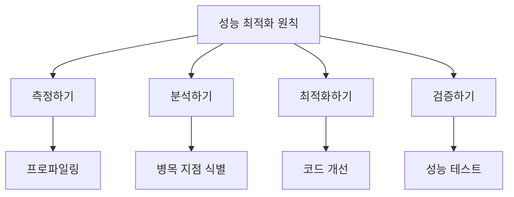

# JavaScript 성능 최적화 🚀

## 목차
1. [성능 최적화의 기본 원칙](#성능-최적화의-기본-원칙)
2. [메모리 최적화](#메모리-최적화)
3. [실행 속도 최적화](#실행-속도-최적화)
4. [비동기 작업 최적화](#비동기-작업-최적화)
5. [실전 예제](#실전-예제)

## 성능 최적화의 기본 원칙 📋

성능 최적화를 시작하기 전에 반드시 알아야 할 핵심 원칙들이 있습니다.



### 성능 측정 도구

```javascript
class PerformanceMonitor {
    constructor() {
        this.measurements = new Map();
        this.ongoing = new Map();
    }
    
    startMeasure(label) {
        this.ongoing.set(label, {
            startTime: performance.now(),
            startMemory: process.memoryUsage().heapUsed
        });
    }
    
    endMeasure(label) {
        const start = this.ongoing.get(label);
        if (!start) {
            throw new Error(`측정 '${label}'을 찾을 수 없습니다.`);
        }
        
        const endTime = performance.now();
        const endMemory = process.memoryUsage().heapUsed;
        
        const measurement = {
            duration: endTime - start.startTime,
            memoryDelta: endMemory - start.startMemory,
            timestamp: new Date()
        };
        
        if (!this.measurements.has(label)) {
            this.measurements.set(label, []);
        }
        
        this.measurements.get(label).push(measurement);
        this.ongoing.delete(label);
        
        return measurement;
    }
    
    getStats(label) {
        const measurements = this.measurements.get(label);
        if (!measurements || measurements.length === 0) {
            return null;
        }
        
        const durations = measurements.map(m => m.duration);
        const memoryDeltas = measurements.map(m => m.memoryDelta);
        
        return {
            count: measurements.length,
            averageDuration: durations.reduce((a, b) => a + b) / durations.length,
            minDuration: Math.min(...durations),
            maxDuration: Math.max(...durations),
            averageMemoryDelta: memoryDeltas.reduce((a, b) => a + b) / memoryDeltas.length,
            totalMemoryDelta: memoryDeltas.reduce((a, b) => a + b)
        };
    }
    
    clear() {
        this.measurements.clear();
        this.ongoing.clear();
    }
}
```

## 메모리 최적화 💾

### 메모리 누수 방지

```javascript
class MemoryOptimizer {
    constructor() {
        this.weakCache = new WeakMap();
        this.intervals = new Set();
    }
    
    // 대규모 데이터 처리를 위한 이터레이터 패턴
    *processLargeArray(array, batchSize = 1000) {
        for (let i = 0; i < array.length; i += batchSize) {
            yield array.slice(i, i + batchSize);
        }
    }
    
    // 캐시 최적화
    cacheData(key, value) {
        if (typeof key !== 'object') {
            throw new Error('WeakMap의 키는 객체여야 합니다.');
        }
        this.weakCache.set(key, {
            value,
            timestamp: Date.now()
        });
    }
    
    // 주기적인 작업 관리
    setOptimizedInterval(callback, interval) {
        const timer = setInterval(callback, interval);
        this.intervals.add(timer);
        
        // 클린업 함수 반환
        return () => {
            clearInterval(timer);
            this.intervals.delete(timer);
        };
    }
    
    // 리소스 정리
    cleanup() {
        for (const timer of this.intervals) {
            clearInterval(timer);
        }
        this.intervals.clear();
    }
}

// 메모리 효율적인 데이터 구조 예시
class CircularBuffer {
    constructor(size) {
        this.size = size;
        this.buffer = new Array(size);
        this.writeIndex = 0;
        this.readIndex = 0;
        this.length = 0;
    }
    
    write(data) {
        this.buffer[this.writeIndex] = data;
        this.writeIndex = (this.writeIndex + 1) % this.size;
        this.length = Math.min(this.length + 1, this.size);
    }
    
    read() {
        if (this.length === 0) return null;
        
        const data = this.buffer[this.readIndex];
        this.readIndex = (this.readIndex + 1) % this.size;
        this.length--;
        return data;
    }
    
    clear() {
        this.buffer = new Array(this.size);
        this.writeIndex = 0;
        this.readIndex = 0;
        this.length = 0;
    }
}
```

## 실행 속도 최적화 ⚡

### 코드 실행 최적화

```javascript
class CodeOptimizer {
    // 함수 메모이제이션
    static memoize(fn) {
        const cache = new Map();
        
        return (...args) => {
            const key = JSON.stringify(args);
            if (cache.has(key)) {
                return cache.get(key);
            }
            
            const result = fn(...args);
            cache.set(key, result);
            return result;
        };
    }
    
    // 배열 작업 최적화
    static optimizeArrayOperations(array) {
        return {
            // 빈번한 배열 수정 작업을 위한 최적화
            batchUpdate(updates) {
                const tempArray = [...array];
                updates.forEach(([index, value]) => {
                    tempArray[index] = value;
                });
                return tempArray;
            },
            
            // 필터링 최적화
            fastFilter(predicate) {
                const result = [];
                for (let i = 0; i < array.length; i++) {
                    if (predicate(array[i])) {
                        result.push(array[i]);
                    }
                }
                return result;
            },
            
            // 정렬 최적화
            fastSort(compareFunction) {
                const tempArray = [...array];
                return tempArray.sort(compareFunction);
            }
        };
    }
    
    // 루프 최적화
    static optimizeLoop(items, processor) {
        const length = items.length;
        const batchSize = 1000;
        let index = 0;
        
        return new Promise((resolve) => {
            function processNextBatch() {
                const end = Math.min(index + batchSize, length);
                
                while (index < end) {
                    processor(items[index]);
                    index++;
                }
                
                if (index < length) {
                    setTimeout(processNextBatch, 0);
                } else {
                    resolve();
                }
            }
            
            processNextBatch();
        });
    }
}

// 최적화된 데이터 처리 예시
class DataProcessor {
    constructor() {
        this.cache = new Map();
    }
    
    // 무거운 계산 함수
    @CodeOptimizer.memoize
    calculateComplexValue(input) {
        // 복잡한 계산 시뮬레이션
        let result = 0;
        for (let i = 0; i < input; i++) {
            result += Math.sqrt(i);
        }
        return result;
    }
    
    // 최적화된 배열 처리
    async processLargeDataSet(data) {
        const results = [];
        const optimizer = CodeOptimizer.optimizeArrayOperations(data);
        
        // 필터링 최적화
        const filteredData = optimizer.fastFilter(item => item > 0);
        
        // 배치 처리
        await CodeOptimizer.optimizeLoop(filteredData, (item) => {
            const processed = this.calculateComplexValue(item);
            results.push(processed);
        });
        
        return results;
    }
}
```

## 비동기 작업 최적화 🔄

### 병렬 처리와 동시성 제어

```javascript
class ConcurrencyManager {
    constructor(maxConcurrent = 5) {
        this.maxConcurrent = maxConcurrent;
        this.running = 0;
        this.queue = [];
    }
    
    async add(task) {
        if (this.running >= this.maxConcurrent) {
            // 대기 큐에 추가
            await new Promise(resolve => this.queue.push(resolve));
        }
        
        this.running++;
        
        try {
            return await task();
        } finally {
            this.running--;
            if (this.queue.length > 0) {
                // 대기 중인 작업 실행
                const next = this.queue.shift();
                next();
            }
        }
    }
    
    // 병렬 작업 실행
    async runParallel(tasks) {
        const results = [];
        const errors = [];
        
        await Promise.all(
            tasks.map(async (task, index) => {
                try {
                    const result = await this.add(task);
                    results[index] = result;
                } catch (error) {
                    errors[index] = error;
                }
            })
        );
        
        return { results, errors };
    }
}

// 비동기 작업 최적화 예시
class AsyncOptimizer {
    constructor() {
        this.concurrencyManager = new ConcurrencyManager();
    }
    
    // 비동기 작업 배치 처리
    async batchProcess(items, processor) {
        const batchSize = 100;
        const batches = [];
        
        for (let i = 0; i < items.length; i += batchSize) {
            const batch = items.slice(i, i + batchSize);
            batches.push(async () => {
                return await processor(batch);
            });
        }
        
        return await this.concurrencyManager.runParallel(batches);
    }
    
    // 재시도 로직이 포함된 비동기 작업
    async withRetry(operation, maxRetries = 3, delay = 1000) {
        let lastError;
        
        for (let i = 0; i < maxRetries; i++) {
            try {
                return await operation();
            } catch (error) {
                lastError = error;
                await new Promise(resolve => setTimeout(resolve, delay * Math.pow(2, i)));
            }
        }
        
        throw lastError;
    }
}
```

## 실전 예제 💡

### 1. 대용량 데이터 처리 시스템

```javascript
class BigDataProcessor {
    constructor() {
        this.optimizer = new CodeOptimizer();
        this.asyncOptimizer = new AsyncOptimizer();
        this.memoryOptimizer = new MemoryOptimizer();
    }
    
    async processLargeDataSet(data) {
        const performanceMonitor = new PerformanceMonitor();
        performanceMonitor.startMeasure('전체 처리');
        
        try {
            // 데이터를 청크로 분할
            const chunks = Array.from(
                this.memoryOptimizer.processLargeArray(data, 1000)
            );
            
            // 각 청크 병렬 처리
            const results = await this.asyncOptimizer.batchProcess(
                chunks,
                async (chunk) => {
                    performanceMonitor.startMeasure('청크 처리');
                    
                    // 각 청크에 대한 처리 로직
                    const processed = await this.processChunk(chunk);
                    
                    performanceMonitor.endMeasure('청크 처리');
                    return processed;
                }
            );
            
            const stats = performanceMonitor.endMeasure('전체 처리');
            console.log('처리 통계:', stats);
            
            return results;
        } catch (error) {
            console.error('데이터 처리 중 오류:', error);
            throw error;
        }
    }
    
    async processChunk(chunk) {
        const processedChunk = await this.concurrencyManager.add(async () => {
            // 데이터 유효성 검사
            const validData = chunk.filter(item => this.validateData(item));
            
            // 데이터 변환
            const transformedData = await Promise.all(
                validData.map(item => this.transformData(item))
            );
            
            // 데이터 집계
            const aggregated = this.aggregateData(transformedData);
            
            return aggregated;
        });
        
        return processedChunk;
    }
    
    validateData(item) {
        return item != null && typeof item === 'object';
    }
    
    async transformData(item) {
        // 무거운 데이터 변환 작업 시뮬레이션
        await new Promise(resolve => setTimeout(resolve, 10));
        return {
            ...item,
            processed: true,
            timestamp: Date.now()
        };
    }
    
    aggregateData(items) {
        return items.reduce((acc, item) => {
            // 집계 로직
            acc.count = (acc.count || 0) + 1;
            acc.sum = (acc.sum || 0) + (item.value || 0);
            return acc;
        }, {});
    }
}

// 사용 예시
async function processBigData() {
    const processor = new BigDataProcessor();
    const largeDataSet = Array.from(
        { length: 1000000 },
        (_, i) => ({ id: i, value: Math.random() * 100 })
    );
    
    try {
        console.log('대용량 데이터 처리 시작...');
        const results = await processor.processLargeDataSet(largeDataSet);
        console.log('처리 완료:', results);
    } catch (error) {
        console.error('처리 실패:', error);
    }
}
```

## 연습 문제 ✏️

1. 대용량 파일 처리기를 구현해보세요. 다음 요구사항을 만족해야 합니다:
   - 메모리 사용량을 제한하면서 대용량 파일을 처리할 수 있어야 함
   - 처리 진행률을 실시간으로 보고할 수 있어야 함
   - 오류가 발생해도 복구 가능해야 함

```javascript
class LargeFileProcessor {
    constructor(options = {}) {
        // 여기에 구현하세요
    }
    
    async processFile(filePath) {
        // 여기에 구현하세요
    }
    
    reportProgress(processed, total) {
        // 여기에 구현하세요
    }
}
```

2. 다음 코드를 성능 최적화해보세요:

```javascript
function processUserData(users) {
    const result = [];
    for (let i = 0; i < users.length; i++) {
        if (users[i].age >= 18) {
            const userData = {
                name: users[i].name,
                email: users[i].email,
                age: users[i].age
            };
            result.push(userData);
        }
    }
    return result;
}

// 테스트 데이터
const users = Array.from({ length: 1000000 }, (_, i) => ({
    id: i,
    name: `User ${i}`,
    email: `user${i}@example.com`,
    age: Math.floor(Math.random() * 80)
}));
```

<details>
<summary>정답 보기</summary>

1. 대용량 파일 처리기 구현:
```javascript
class LargeFileProcessor {
    constructor(options = {}) {
        this.chunkSize = options.chunkSize || 64 * 1024; // 64KB
        this.maxMemory = options.maxMemory || 1024 * 1024 * 100; // 100MB
        this.onProgress = options.onProgress || (() => {});
    }
    
    async processFile(filePath) {
        const fileStream = createReadStream(filePath);
        const fileSize = (await stat(filePath)).size;
        let processedBytes = 0;
        
        return new Promise((resolve, reject) => {
            const chunks = [];
            
            fileStream.on('data', chunk => {
                chunks.push(chunk);
                processedBytes += chunk.length;
                
                // 메모리 사용량 확인
                if (this.getTotalMemory(chunks) > this.maxMemory) {
                    this.processChunks(chunks);
                }
                
                this.onProgress(processedBytes, fileSize);
            });
            
            fileStream.on('end', () => {
                this.processChunks(chunks);
                resolve();
            });
            
            fileStream.on('error', reject);
        });
    }
    
    getTotalMemory(chunks) {
        return chunks.reduce((total, chunk) => total + chunk.length, 0);
    }
    
    processChunks(chunks) {
        // 청크 처리 로직
        while (chunks.length > 0) {
            const chunk = chunks.shift();
            // 실제 처리 로직
        }
    }
}
```

2. 성능 최적화된 코드:
```javascript
function processUserData(users) {
    // 배열 크기 미리 할당
    const estimatedSize = Math.floor(users.length * 0.6); // 60%가 성인이라 가정
    const result = new Array(estimatedSize);
    let resultIndex = 0;
    
    // 최적화된 루프
    const length = users.length;
    for (let i = 0; i < length; i++) {
        const user = users[i];
        if (user.age >= 18) {
            result[resultIndex++] = {
                name: user.name,
                email: user.email,
                age: user.age
            };
        }
    }
    
    // 실제 크기로 조정
    result.length = resultIndex;
    return result;
}

// 더 나은 최적화를 위한 병렬 처리 버전
async function processUserDataParallel(users) {
    const concurrency = navigator.hardwareConcurrency || 4;
    const chunkSize = Math.ceil(users.length / concurrency);
    
    const chunks = Array.from({ length: concurrency }, (_, i) => {
        const start = i * chunkSize;
        return users.slice(start, start + chunkSize);
    });
    
    const results = await Promise.all(
        chunks.map(chunk => {
            return new Promise(resolve => {
                const processed = processUserData(chunk);
                resolve(processed);
            });
        })
    );
    
    return results.flat();
}
```
</details>

## 추가 학습 자료 📚

1. [Node.js 성능 최적화 가이드](https://nodejs.org/en/docs/guides/dont-block-the-event-loop/)
2. [V8 엔진 최적화 기법](https://github.com/thlorenz/v8-perf)
3. [JavaScript 성능 측정 도구](https://developer.mozilla.org/ko/docs/Web/API/Performance)
4. [메모리 누수 디버깅 가이드](https://developer.chrome.com/docs/devtools/memory-problems/)

## 다음 학습 내용 예고 🔜

다음 장에서는 "보안 관련 개념"에 대해 배워볼 예정입니다. 웹 보안의 기본 원칙, 일반적인 보안 취약점과 그 대응 방안, 안전한 인증 및 권한 부여 구현 방법 등을 알아보겠습니다!