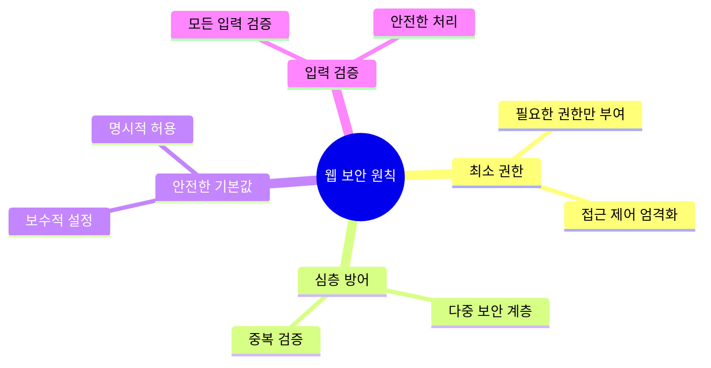

# JavaScript 보안 관련 개념 🔒

## 목차
1. [웹 보안의 기본 원칙](#웹-보안의-기본-원칙)
2. [일반적인 보안 취약점](#일반적인-보안-취약점)
3. [인증과 권한 부여](#인증과-권한-부여)
4. [데이터 보안](#데이터-보안)
5. [실전 예제](#실전-예제)

## 웹 보안의 기본 원칙 🛡️

웹 애플리케이션 보안의 핵심 원칙들을 살펴보겠습니다.



### 보안 체크리스트 구현

```javascript
class SecurityChecker {
    constructor() {
        this.checks = new Map();
        this.initializeChecks();
    }
    
    initializeChecks() {
        // HTTP 보안 헤더 검사
        this.addCheck('securityHeaders', (config) => {
            const requiredHeaders = {
                'Content-Security-Policy': 'default-src \'self\'',
                'X-Content-Type-Options': 'nosniff',
                'X-Frame-Options': 'DENY',
                'X-XSS-Protection': '1; mode=block',
                'Strict-Transport-Security': 'max-age=31536000; includeSubDomains'
            };
            
            const missingHeaders = Object.entries(requiredHeaders)
                .filter(([header, value]) => 
                    !config.headers[header] || 
                    config.headers[header] !== value
                );
            
            return {
                passed: missingHeaders.length === 0,
                issues: missingHeaders.map(([header]) => 
                    `Missing or incorrect security header: ${header}`
                )
            };
        });
        
        // CORS 설정 검사
        this.addCheck('corsConfig', (config) => {
            const corsConfig = config.cors || {};
            const issues = [];
            
            if (corsConfig.origin === '*') {
                issues.push('CORS allows all origins');
            }
            
            if (!corsConfig.methods || corsConfig.methods.includes('*')) {
                issues.push('CORS allows all methods');
            }
            
            return {
                passed: issues.length === 0,
                issues
            };
        });
        
        // 입력 검증 설정 검사
        this.addCheck('inputValidation', (config) => {
            const issues = [];
            
            if (!config.validateInput) {
                issues.push('Input validation is not enabled');
            }
            
            if (!config.sanitizeInput) {
                issues.push('Input sanitization is not enabled');
            }
            
            return {
                passed: issues.length === 0,
                issues
            };
        });
    }
    
    addCheck(name, checkFn) {
        this.checks.set(name, checkFn);
    }
    
    async runChecks(config) {
        const results = new Map();
        
        for (const [name, checkFn] of this.checks) {
            try {
                results.set(name, await checkFn(config));
            } catch (error) {
                results.set(name, {
                    passed: false,
                    issues: [`Check failed: ${error.message}`]
                });
            }
        }
        
        return results;
    }
}
```

## 일반적인 보안 취약점 🕷️

### 1. XSS(Cross-Site Scripting) 방지

```javascript
class XSSProtection {
    constructor() {
        this.escapedChars = {
            '&': '&amp;',
            '<': '&lt;',
            '>': '&gt;',
            '"': '&quot;',
            "'": '&#x27;',
            '/': '&#x2F;'
        };
    }
    
    escapeHTML(str) {
        return str.replace(/[&<>"'/]/g, char => this.escapedChars[char]);
    }
    
    sanitizeObject(obj) {
        const sanitized = {};
        
        for (const [key, value] of Object.entries(obj)) {
            if (typeof value === 'string') {
                sanitized[key] = this.escapeHTML(value);
            } else if (typeof value === 'object' && value !== null) {
                sanitized[key] = this.sanitizeObject(value);
            } else {
                sanitized[key] = value;
            }
        }
        
        return sanitized;
    }
    
    createSafeHTML(template, ...values) {
        return template.reduce((result, text, i) => {
            const value = values[i - 1];
            if (value === undefined) {
                return result + text;
            }
            return result + this.escapeHTML(String(value)) + text;
        });
    }
}
```

### 2. CSRF(Cross-Site Request Forgery) 방지

```javascript
class CSRFProtection {
    constructor(options = {}) {
        this.tokenLength = options.tokenLength || 32;
        this.cookieName = options.cookieName || 'csrf_token';
        this.headerName = options.headerName || 'X-CSRF-Token';
        this.tokenStore = new Map();
    }
    
    generateToken() {
        const buffer = new Uint8Array(this.tokenLength);
        crypto.getRandomValues(buffer);
        return Array.from(buffer)
            .map(byte => byte.toString(16).padStart(2, '0'))
            .join('');
    }
    
    createToken(userId) {
        const token = this.generateToken();
        this.tokenStore.set(userId, {
            token,
            createdAt: Date.now()
        });
        return token;
    }
    
    verifyToken(userId, token) {
        const storedData = this.tokenStore.get(userId);
        if (!storedData) {
            return false;
        }
        
        // 토큰 만료 확인 (1시간)
        if (Date.now() - storedData.createdAt > 3600000) {
            this.tokenStore.delete(userId);
            return false;
        }
        
        return storedData.token === token;
    }
    
    middleware() {
        return async (req, res, next) => {
            if (req.method === 'GET') {
                return next();
            }
            
            const token = req.headers[this.headerName.toLowerCase()];
            if (!token || !this.verifyToken(req.user.id, token)) {
                return res.status(403).json({
                    error: 'Invalid CSRF token'
                });
            }
            
            next();
        };
    }
}
```

### 3. SQL 인젝션 방지

```javascript
class SQLSanitizer {
    constructor() {
        this.patterns = {
            numeric: /^\d+$/,
            alphanumeric: /^[a-zA-Z0-9]+$/,
            email: /^[a-zA-Z0-9._%+-]+@[a-zA-Z0-9.-]+\.[a-zA-Z]{2,}$/
        };
    }
    
    sanitizeValue(value, type) {
        if (value === null || value === undefined) {
            return null;
        }
        
        switch (type) {
            case 'number':
                return this.patterns.numeric.test(value) ? Number(value) : null;
            
            case 'string':
                return typeof value === 'string' 
                    ? value.replace(/['"\\]/g, '\\$&') 
                    : null;
            
            case 'email':
                return this.patterns.email.test(value) ? value : null;
            
            default:
                throw new Error(`Unknown type: ${type}`);
        }
    }
    
    buildSafeQuery(template, params) {
        let query = template;
        const values = [];
        
        for (const [key, value] of Object.entries(params)) {
            const placeholder = `:${key}`;
            if (query.includes(placeholder)) {
                query = query.replace(
                    placeholder,
                    '?'
                );
                values.push(value);
            }
        }
        
        return { query, values };
    }
}
```

## 인증과 권한 부여 🔐

### 안전한 인증 시스템 구현

```javascript
class AuthenticationSystem {
    constructor(options = {}) {
        this.passwordHasher = new PasswordHasher(options.hashConfig);
        this.tokenManager = new TokenManager(options.tokenConfig);
        this.rateLimiter = new RateLimiter(options.rateLimit);
    }
    
    async registerUser(userData) {
        // 입력 검증
        this.validateUserData(userData);
        
        // 비밀번호 해시
        const hashedPassword = await this.passwordHasher.hash(userData.password);
        
        // 사용자 생성
        const user = await this.createUser({
            ...userData,
            password: hashedPassword
        });
        
        return user;
    }
    
    async authenticateUser(email, password) {
        // 레이트 리미팅 체크
        await this.rateLimiter.checkLimit(email);
        
        // 사용자 조회
        const user = await this.findUserByEmail(email);
        if (!user) {
            throw new Error('Invalid credentials');
        }
        
        // 비밀번호 검증
        const isValid = await this.passwordHasher.verify(
            password,
            user.password
        );
        
        if (!isValid) {
            await this.rateLimiter.recordFailedAttempt(email);
            throw new Error('Invalid credentials');
        }
        
        // 토큰 생성
        const token = this.tokenManager.createToken(user);
        
        return { user, token };
    }
    
    validateUserData(data) {
        const { email, password } = data;
        
        if (!email || !this.isValidEmail(email)) {
            throw new Error('Invalid email');
        }
        
        if (!password || !this.isStrongPassword(password)) {
            throw new Error('Password does not meet requirements');
        }
    }
    
    isValidEmail(email) {
        return /^[a-zA-Z0-9._%+-]+@[a-zA-Z0-9.-]+\.[a-zA-Z]{2,}$/.test(email);
    }
    
    isStrongPassword(password) {
        // 최소 8자, 대문자, 소문자, 숫자, 특수문자 포함
        return /^(?=.*[a-z])(?=.*[A-Z])(?=.*\d)(?=.*[@$!%*?&])[A-Za-z\d@$!%*?&]{8,}$/.test(password);
    }
}

class PasswordHasher {
    constructor(config = {}) {
        this.saltRounds = config.saltRounds || 12;
    }
    
    async hash(password) {
        return await bcrypt.hash(password, this.saltRounds);
    }
    
    async verify(password, hash) {
        return await bcrypt.compare(password, hash);
    }
}

class TokenManager {
    constructor(config = {}) {
        this.secret = config.secret || crypto.randomBytes(32).toString('hex');
        this.expiresIn = config.expiresIn || '1h';
    }
    
    createToken(user) {
        return jwt.sign(
            {
                id: user.id,
                email: user.email,
                role: user.role
            },
            this.secret,
            { expiresIn: this.expiresIn }
        );
    }
    
    verifyToken(token) {
        try {
            return jwt.verify(token, this.secret);
        } catch (error) {
            throw new Error('Invalid token');
        }
    }
}

class RateLimiter {
    constructor(config = {}) {
        this.maxAttempts = config.maxAttempts || 5;
        this.windowMs = config.windowMs || 15 * 60 * 1000; // 15분
        this.attempts = new Map();
    }
    
    async checkLimit(key) {
        const attempts = this.attempts.get(key) || [];
        const now = Date.now();
        
        // 시간 창 밖의 시도 제거
        const recentAttempts = attempts.filter(
            timestamp => now - timestamp < this.windowMs
        );
        
        if (recentAttempts.length >= this.maxAttempts) {
            throw new Error('Too many attempts');
        }
    }
    
    async recordFailedAttempt(key) {
        const attempts = this.attempts.get(key) || [];
        attempts.push(Date.now());
        this.attempts.set(key, attempts);
    }
}
```

## 데이터 보안 🔑

### 1. 데이터 암호화

```javascript
class DataEncryption {
    constructor(options = {}) {
        this.algorithm = options.algorithm || 'aes-256-gcm';
        this.keyLength = options.keyLength || 32;
        this.initKey();
    }
    
    initKey() {
        // 실제 구현에서는 안전한 키 저장소 사용
        this.key = crypto.randomBytes(this.keyLength);
    }
    
    async encrypt(data) {
        const iv = crypto.randomBytes(12);
        const cipher = crypto.createCipheriv(this.algorithm, this.key, iv);
        
        let encrypted = cipher.update(
            typeof data === 'string' ? data : JSON.stringify(data),
            'utf8',
            'hex'
        );
        encrypted += cipher.final('hex');
        
        const authTag = cipher.getAuthTag();
        
        return {
            encrypted,
            iv: iv.toString('hex'),
            authTag: authTag.toString('hex')
        };
    }
    
    async decrypt(encryptedData) {
        const decipher = crypto.createDecipheriv(
            this.algorithm,
            this.key,
            Buffer.from(encryptedData.iv, 'hex')
        );
        
        decipher.setAuthTag(Buffer.from(encryptedData.authTag, 'hex'));
        
        let decrypted = decipher.update(encryptedData.encrypted, 'hex', 'utf8');
        decrypted += decipher.final('utf8');
        
        try {
            return JSON.parse(decrypted);
        } catch {
            return decrypted;
        }
    }
}
```

### 2. 안전한 데이터 저장소

```javascript
class SecureStorage {
    constructor(options = {}) {
        this.encryption = new DataEncryption(options.encryption);
        this.storage = new Map();
        this.accessLog = new Map();
    }
    
    async store(key, data, metadata = {}) {
        const encryptedData = await this.encryption.encrypt(data);
        
        this.storage.set(key, {
            data: encryptedData,
            metadata: {
                ...metadata,
                createdAt: Date.now(),
                lastModified: Date.now()
            }
        });
        
        this.logAccess(key, 'store');
    }
    
    async retrieve(key) {
        const entry = this.storage.get(key);
        if (!entry) {
            throw new Error('Data not found');
        }
        
        const decryptedData = await this.encryption.decrypt(entry.data);
        this.logAccess(key, 'retrieve');
        
        return {
            data: decryptedData,
            metadata: entry.metadata
        };
    }
    
    logAccess(key, operation) {
        if (!this.accessLog.has(key)) {
            this.accessLog.set(key, []);
        }
        
        this.accessLog.get(key).push({
            operation,
            timestamp: Date.now()
        });
    }
    
    getAccessHistory(key) {
        return this.accessLog.get(key) || [];
    }
}
```

### 3. 데이터 무결성 검증

```javascript
class DataIntegrityVerifier {
    constructor() {
        this.hasher = crypto.createHash('sha256');
    }
    
    calculateHash(data) {
        const hash = crypto.createHash('sha256');
        hash.update(typeof data === 'string' ? data : JSON.stringify(data));
        return hash.digest('hex');
    }
    
    signData(data, privateKey) {
        const sign = crypto.createSign('RSA-SHA256');
        sign.update(typeof data === 'string' ? data : JSON.stringify(data));
        return sign.sign(privateKey, 'hex');
    }
    
    verifySignature(data, signature, publicKey) {
        const verify = crypto.createVerify('RSA-SHA256');
        verify.update(typeof data === 'string' ? data : JSON.stringify(data));
        return verify.verify(publicKey, signature, 'hex');
    }
}
```

## 실전 예제 💡

### 1. 보안 게시판 시스템

```javascript
class SecureBoardSystem {
    constructor() {
        this.auth = new AuthenticationSystem();
        this.xssProtection = new XSSProtection();
        this.csrfProtection = new CSRFProtection();
        this.storage = new SecureStorage();
        this.posts = new Map();
    }
    
    async createPost(user, postData) {
        // 사용자 인증 확인
        if (!user || !user.id) {
            throw new Error('Authentication required');
        }
        
        // XSS 방지
        const sanitizedData = this.xssProtection.sanitizeObject(postData);
        
        // CSRF 토큰 검증
        if (!this.csrfProtection.verifyToken(user.id, postData.csrfToken)) {
            throw new Error('Invalid CSRF token');
        }
        
        // 게시물 저장
        const post = {
            id: crypto.randomUUID(),
            author: user.id,
            content: sanitizedData.content,
            createdAt: Date.now()
        };
        
        // 암호화하여 저장
        await this.storage.store(`post:${post.id}`, post);
        this.posts.set(post.id, post);
        
        return post;
    }
    
    async getPost(user, postId) {
        const post = await this.storage.retrieve(`post:${postId}`);
        
        // 접근 권한 확인
        if (!this.checkReadPermission(user, post.data)) {
            throw new Error('Access denied');
        }
        
        return post.data;
    }
    
    checkReadPermission(user, post) {
        // 간단한 권한 체크 예시
        return user.id === post.author || user.role === 'admin';
    }
}
```

### 2. 안전한 파일 업로드 시스템

```javascript
class SecureFileUploader {
    constructor(options = {}) {
        this.allowedTypes = options.allowedTypes || ['image/jpeg', 'image/png', 'application/pdf'];
        this.maxSize = options.maxSize || 5 * 1024 * 1024; // 5MB
        this.storage = new SecureStorage();
        this.uploadPath = options.uploadPath || '/secure-uploads';
    }
    
    async validateFile(file) {
        if (!this.allowedTypes.includes(file.mimetype)) {
            throw new Error('Invalid file type');
        }
        
        if (file.size > this.maxSize) {
            throw new Error('File too large');
        }
        
        // 파일 시그니처 검사
        const isValidSignature = await this.checkFileSignature(file);
        if (!isValidSignature) {
            throw new Error('Invalid file signature');
        }
    }
    
    async checkFileSignature(file) {
        // 파일 시그니처 검사 로직
        const buffer = Buffer.from(file.buffer);
        const signatures = {
            'image/jpeg': [0xFF, 0xD8, 0xFF],
            'image/png': [0x89, 0x50, 0x4E, 0x47],
            'application/pdf': [0x25, 0x50, 0x44, 0x46]
        };
        
        const fileSignature = Array.from(buffer.slice(0, 4));
        const expectedSignature = signatures[file.mimetype];
        
        return expectedSignature.every((byte, i) => byte === fileSignature[i]);
    }
    
    async uploadFile(user, file) {
        await this.validateFile(file);
        
        // 파일 이름 난수화
        const filename = crypto.randomBytes(16).toString('hex') + path.extname(file.originalname);
        const filePath = path.join(this.uploadPath, filename);
        
        // 파일 암호화
        const encryptedData = await this.storage.store(`file:${filename}`, file.buffer);
        
        // 메타데이터 저장
        const metadata = {
            originalName: file.originalname,
            mimetype: file.mimetype,
            size: file.size,
            uploadedBy: user.id,
            uploadedAt: Date.now()
        };
        
        await this.storage.store(`file-meta:${filename}`, metadata);
        
        return {
            filename,
            metadata
        };
    }
    
    async downloadFile(user, filename) {
        const metadata = await this.storage.retrieve(`file-meta:${filename}`);
        
        // 접근 권한 확인
        if (!this.checkDownloadPermission(user, metadata.data)) {
            throw new Error('Access denied');
        }
        
        const fileData = await this.storage.retrieve(`file:${filename}`);
        return {
            data: fileData.data,
            metadata: metadata.data
        };
    }
    
    checkDownloadPermission(user, metadata) {
        return user.id === metadata.uploadedBy || user.role === 'admin';
    }
}
```

## 연습 문제 ✏️

1. 다음 코드에서 보안 취약점을 찾고 수정해보세요:

```javascript
function userLogin(email, password) {
    const query = `SELECT * FROM users WHERE email = '${email}' AND password = '${password}'`;
    return db.query(query);
}

function renderUserProfile(user) {
    return `
        <div class="profile">
            <h1>${user.name}</h1>
            <div>${user.bio}</div>
        </div>
    `;
}
```

2. 안전한 비밀번호 재설정 시스템을 구현해보세요:

```javascript
class PasswordResetSystem {
    // 여기에 구현하세요
}
```

<details>
<summary>정답 보기</summary>

1. 보안 취약점 수정:
```javascript
function userLogin(email, password) {
    // SQL 인젝션 방지
    const query = 'SELECT * FROM users WHERE email = ? AND password = ?';
    const hashedPassword = await bcrypt.hash(password, 10);
    return db.query(query, [email, hashedPassword]);
}

function renderUserProfile(user) {
    // XSS 방지
    const escapeHTML = (str) => {
        return str.replace(/[&<>"']/g, char => ({
            '&': '&amp;',
            '<': '&lt;',
            '>': '&gt;',
            '"': '&quot;',
            "'": '&#39;'
        })[char]);
    };
    
    return `
        <div class="profile">
            <h1>${escapeHTML(user.name)}</h1>
            <div>${escapeHTML(user.bio)}</div>
        </div>
    `;
}
```

2. 비밀번호 재설정 시스템:
```javascript
class PasswordResetSystem {
    constructor() {
        this.tokens = new Map();
        this.tokenExpiry = 3600000; // 1시간
    }
    
    async generateResetToken(email) {
        const token = crypto.randomBytes(32).toString('hex');
        const expires = Date.now() + this.tokenExpiry;
        
        this.tokens.set(token, {
            email,
            expires
        });
        
        // 이메일 발송 로직
        await this.sendResetEmail(email, token);
        
        return token;
    }
    
    async resetPassword(token, newPassword) {
        const tokenData = this.tokens.get(token);
        
        if (!tokenData || Date.now() > tokenData.expires) {
            throw new Error('Invalid or expired token');
        }
        
        // 비밀번호 유효성 검사
        if (!this.isStrongPassword(newPassword)) {
            throw new Error('Password does not meet requirements');
        }
        
        // 비밀번호 업데이트 로직
        const hashedPassword = await bcrypt.hash(newPassword, 10);
        await this.updateUserPassword(tokenData.email, hashedPassword);
        
        // 토큰 삭제
        this.tokens.delete(token);
    }
    
    isStrongPassword(password) {
        return /^(?=.*[a-z])(?=.*[A-Z])(?=.*\d)(?=.*[@$!%*?&])[A-Za-z\d@$!%*?&]{8,}$/.test(password);
    }
}
```
</details>

## 추가 학습 자료 📚

1. [OWASP Top 10](https://owasp.org/www-project-top-ten/)
2. [Node.js 보안 모범 사례](https://nodejs.org/en/docs/guides/security)
3. [웹 보안 체크리스트](https://www.owasp.org/index.php/Web_Application_Security_Testing_Cheat_Sheet)
4. [암호화 모범 사례](https://cheatsheetseries.owasp.org/cheatsheets/Cryptographic_Storage_Cheat_Sheet.html)

## 다음 학습 내용 예고 🔜

다음 장에서는 "테스팅"에 대해 배워볼 예정입니다. 단위 테스트, 통합 테스트, 보안 테스트 등 다양한 테스트 방법과 도구들을 알아보겠습니다!