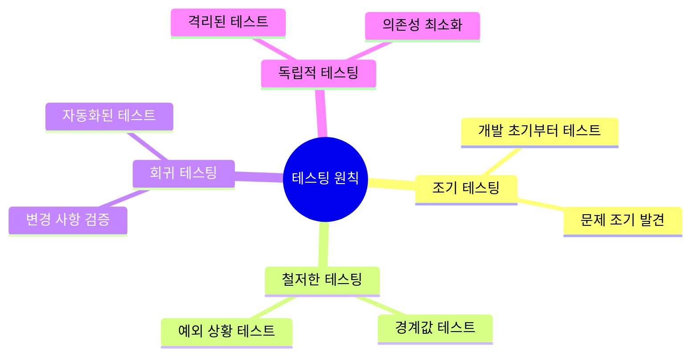

# JavaScript 테스팅 🧪

## 목차
1. [테스팅의 기본 원칙](#테스팅의-기본-원칙)
2. [단위 테스트](#단위-테스트)
3. [통합 테스트](#통합-테스트)
4. [성능 테스트](#성능-테스트)
5. [실전 예제](#실전-예제)

## 테스팅의 기본 원칙 📋

테스팅은 소프트웨어의 품질을 보장하는 핵심 활동입니다. 효과적인 테스트를 위해서는 다음과 같은 원칙들을 이해하고 적용해야 합니다.



### 테스트 설정 및 구성

```javascript
class TestFramework {
    constructor(options = {}) {
        this.beforeHooks = [];
        this.afterHooks = [];
        this.tests = new Map();
        this.results = new Map();
        this.timeout = options.timeout || 5000;
    }
    
    before(fn) {
        this.beforeHooks.push(fn);
    }
    
    after(fn) {
        this.afterHooks.push(fn);
    }
    
    addTest(name, testFn) {
        this.tests.set(name, testFn);
    }
    
    async runTest(name, testFn) {
        const result = {
            name,
            passed: false,
            error: null,
            duration: 0
        };
        
        try {
            // 전처리 훅 실행
            for (const hook of this.beforeHooks) {
                await hook();
            }
            
            // 테스트 실행
            const startTime = performance.now();
            await Promise.race([
                testFn(),
                new Promise((_, reject) => 
                    setTimeout(() => reject(new Error('Test timeout')), this.timeout)
                )
            ]);
            result.duration = performance.now() - startTime;
            result.passed = true;
            
            // 후처리 훅 실행
            for (const hook of this.afterHooks) {
                await hook();
            }
        } catch (error) {
            result.error = error;
        }
        
        this.results.set(name, result);
        return result;
    }
    
    async runAllTests() {
        const summary = {
            total: this.tests.size,
            passed: 0,
            failed: 0,
            duration: 0
        };
        
        for (const [name, testFn] of this.tests) {
            const result = await this.runTest(name, testFn);
            summary.duration += result.duration;
            if (result.passed) {
                summary.passed++;
            } else {
                summary.failed++;
            }
        }
        
        return summary;
    }
}
```

## 단위 테스트 🔍

개별 컴포넌트나 함수의 동작을 검증하는 단위 테스트는 가장 기본적이면서도 중요한 테스트입니다.

### 테스트 유틸리티

```javascript
class TestUtils {
    static expect(value) {
        return {
            toBe(expected) {
                if (value !== expected) {
                    throw new Error(`Expected ${expected} but got ${value}`);
                }
            },
            
            toEqual(expected) {
                const isEqual = JSON.stringify(value) === JSON.stringify(expected);
                if (!isEqual) {
                    throw new Error(
                        `Expected ${JSON.stringify(expected)} but got ${JSON.stringify(value)}`
                    );
                }
            },
            
            toMatch(pattern) {
                if (!pattern.test(value)) {
                    throw new Error(`Value ${value} does not match pattern ${pattern}`);
                }
            },
            
            toBeDefined() {
                if (value === undefined) {
                    throw new Error('Expected value to be defined');
                }
            },
            
            toBeNull() {
                if (value !== null) {
                    throw new Error(`Expected null but got ${value}`);
                }
            },
            
            toBeTruthy() {
                if (!value) {
                    throw new Error(`Expected truthy value but got ${value}`);
                }
            },
            
            toBeFalsy() {
                if (value) {
                    throw new Error(`Expected falsy value but got ${value}`);
                }
            }
        };
    }
    
    static mock(obj, methodName) {
        const original = obj[methodName];
        const calls = [];
        
        obj[methodName] = function(...args) {
            calls.push(args);
            return original.apply(this, args);
        };
        
        obj[methodName].mockRestore = function() {
            obj[methodName] = original;
        };
        
        obj[methodName].calls = calls;
        
        return obj[methodName];
    }
    
    static spy() {
        const calls = [];
        const fn = function(...args) {
            calls.push(args);
            return fn.returnValue;
        };
        
        fn.calls = calls;
        fn.returnValue = undefined;
        
        fn.mockReturnValue = function(value) {
            fn.returnValue = value;
            return fn;
        };
        
        return fn;
    }
}
```

### 단위 테스트 예제

```javascript
class Calculator {
    add(a, b) {
        return a + b;
    }
    
    subtract(a, b) {
        return a - b;
    }
    
    multiply(a, b) {
        return a * b;
    }
    
    divide(a, b) {
        if (b === 0) {
            throw new Error('Division by zero');
        }
        return a / b;
    }
}

// 테스트 작성
const calculatorTests = new TestFramework();
const calculator = new Calculator();

calculatorTests.addTest('should add two numbers correctly', () => {
    TestUtils.expect(calculator.add(2, 3)).toBe(5);
    TestUtils.expect(calculator.add(-1, 1)).toBe(0);
    TestUtils.expect(calculator.add(0, 0)).toBe(0);
});

calculatorTests.addTest('should subtract two numbers correctly', () => {
    TestUtils.expect(calculator.subtract(5, 3)).toBe(2);
    TestUtils.expect(calculator.subtract(1, 1)).toBe(0);
    TestUtils.expect(calculator.subtract(0, 5)).toBe(-5);
});

calculatorTests.addTest('should multiply two numbers correctly', () => {
    TestUtils.expect(calculator.multiply(2, 3)).toBe(6);
    TestUtils.expect(calculator.multiply(-2, 3)).toBe(-6);
    TestUtils.expect(calculator.multiply(0, 5)).toBe(0);
});

calculatorTests.addTest('should divide two numbers correctly', () => {
    TestUtils.expect(calculator.divide(6, 2)).toBe(3);
    TestUtils.expect(calculator.divide(5, 2)).toBe(2.5);
    TestUtils.expect(() => calculator.divide(4, 0)).toThrow('Division by zero');
});

// 테스트 실행
calculatorTests.runAllTests().then(summary => {
    console.log('테스트 결과:', summary);
});
```

## 통합 테스트 🔄

여러 컴포넌트가 함께 동작하는 것을 검증하는 통합 테스트는 시스템의 전체적인 동작을 확인하는 데 중요합니다.

### HTTP API 테스트

```javascript
class APITester {
    constructor(baseURL) {
        this.baseURL = baseURL;
        this.headers = new Map();
    }
    
    setHeader(name, value) {
        this.headers.set(name, value);
        return this;
    }
    
    async request(method, path, body = null) {
        const url = new URL(path, this.baseURL);
        const options = {
            method,
            headers: Object.fromEntries(this.headers)
        };
        
        if (body) {
            options.body = JSON.stringify(body);
            options.headers['Content-Type'] = 'application/json';
        }
        
        const response = await fetch(url, options);
        return {
            status: response.status,
            headers: response.headers,
            body: await response.json()
        };
    }
    
    async get(path) {
        return this.request('GET', path);
    }
    
    async post(path, body) {
        return this.request('POST', path, body);
    }
    
    async put(path, body) {
        return this.request('PUT', path, body);
    }
    
    async delete(path) {
        return this.request('DELETE', path);
    }
}

// 통합 테스트 예제
const apiTests = new TestFramework();
const api = new APITester('http://api.example.com');

apiTests.before(async () => {
    // 테스트 데이터 설정
    await api.post('/reset', { clear: true });
});

apiTests.addTest('should create and retrieve user', async () => {
    const userData = {
        name: '홍길동',
        email: 'hong@example.com'
    };
    
    // 사용자 생성
    const createResponse = await api.post('/users', userData);
    TestUtils.expect(createResponse.status).toBe(201);
    TestUtils.expect(createResponse.body.name).toBe(userData.name);
    
    // 생성된 사용자 조회
    const userId = createResponse.body.id;
    const getResponse = await api.get(`/users/${userId}`);
    TestUtils.expect(getResponse.status).toBe(200);
    TestUtils.expect(getResponse.body).toEqual({
        id: userId,
        ...userData
    });
});

apiTests.after(async () => {
    // 테스트 데이터 정리
    await api.post('/reset', { clear: true });
});
```

## 성능 테스트 ⚡

시스템의 성능을 측정하고 검증하는 성능 테스트는 애플리케이션의 확장성과 안정성을 보장합니다.

### 부하 테스트

```javascript
class LoadTester {
    constructor(options = {}) {
        this.concurrency = options.concurrency || 10;
        this.iterations = options.iterations || 100;
        this.results = [];
    }
    
    async run(testFn) {
        const startTime = performance.now();
        const batches = [];
        
        // 동시 실행 배치 생성
        for (let i = 0; i < this.iterations; i += this.concurrency) {
            const batchSize = Math.min(this.concurrency, this.iterations - i);
            const batch = Array.from({ length: batchSize }, () => testFn());
            batches.push(batch);
        }
        
        // 배치 실행
        for (const batch of batches) {
            const batchResults = await Promise.all(
                batch.map(async (promise) => {
                    const start = performance.now();
                    try {
                        await promise;
                        return {
                            success: true,
                            duration: performance.now() - start
                        };
                    } catch (error) {
                        return {
                            success: false,
                            error: error.message,
                            duration: performance.now() - start
                        };
                    }
                })
            );
            
            this.results.push(...batchResults);
        }
        
        const totalDuration = performance.now() - startTime;
        
        return this.calculateMetrics(totalDuration);
    }
    
    calculateMetrics(totalDuration) {
        const durations = this.results.map(r => r.duration);
        const successCount = this.results.filter(r => r.success).length;
        
        return {
            totalRequests: this.iterations,
            successfulRequests: successCount,
            failedRequests: this.iterations - successCount,
            totalDuration,
            requestsPerSecond: (this.iterations / totalDuration) * 1000,
            averageResponseTime: durations.reduce((a, b) => a + b) / durations.length,
            minResponseTime: Math.min(...durations),
            maxResponseTime: Math.max(...durations),
            percentiles: {
                p50: this.calculatePercentile(durations, 50),
                p90: this.calculatePercentile(durations, 90),
                p95: this.calculatePercentile(durations, 95),
                p99: this.calculatePercentile(durations, 99)
            }
        };
    }
    
    calculatePercentile(values, p) {
        const sorted = [...values].sort((a, b) => a - b);
        const index = Math.ceil((p / 100) * sorted.length) - 1;
        return sorted[index];
    }
}

// 성능 테스트 예제
const performanceTests = new TestFramework();
const api = new APITester('http://api.example.com');

performanceTests.addTest('API should handle high load', async () => {
    const loadTester = new LoadTester({
        concurrency: 20,
        iterations: 1000
    });
    
    const metrics = await loadTester.run(() => api.get('/users'));
    
    TestUtils.expect(metrics.successfulRequests).toBe(metrics.totalRequests);
    TestUtils.expect(metrics.requestsPerSecond).toBeGreaterThan(50);
    TestUtils.expect(metrics.percentiles.p95).toBeLessThan(200);
});
```

## 실전 예제 💡

### 1. 사용자 인증 시스템 테스트

```javascript
class AuthenticationTests {
    constructor() {
        this.framework = new TestFramework();
        this.authService = new AuthenticationService();
        this.setupTests();
    }
    
    setupTests() {
        // 단위 테스트
        this.framework.addTest('should register new user correctly', async () => {
            const userData = {
                email: 'test@example.com',
                password: 'Test1234!',
                name: '테스트 사용자'
            };
            
            const user = await this.authService.register(userData);
            TestUtils.expect(user.email).toBe(userData.email);
            TestUtils.expect(user.name).toBe(userData.name);
            TestUtils.expect(user.password).toBeUndefined(); // 비밀번호는 응답에 포함되지 않아야 함
        });
        
        this.framework.addTest('should fail with weak password', async () => {
            const userData = {
                email: 'test@example.com',
                password: 'weak',
                name: '테스트 사용자'
            };
            
            try {
                await this.authService.register(userData);
                throw new Error('Should have failed');
            } catch (error) {
                TestUtils.expect(error.message).toMatch(/password/i);
            }
        });
        
        this.framework.addTest('should login user correctly', async () => {
            const credentials = {
                email: 'test@example.com',
                password: 'Test1234!'
            };
            
            const result = await this.authService.login(credentials);
            TestUtils.expect(result.token).toBeDefined();
            TestUtils.expect(result.user.email).toBe(credentials.email);
        });
        
        this.framework.addTest('should fail with invalid credentials', async () => {
            const credentials = {
                email: 'test@example.com',
                password: 'wrong'
            };
            
            try {
                await this.authService.login(credentials);
                throw new Error('Should have failed');
            } catch (error) {
                TestUtils.expect(error.message).toMatch(/invalid/i);
            }
        });
        
        // 통합 테스트
        this.framework.addTest('should maintain session after login', async () => {
            const api = new APITester('http://localhost:3000');
            
            // 로그인
            const loginResponse = await api.post('/auth/login', {
                email: 'test@example.com',
                password: 'Test1234!'
            });
            
            TestUtils.expect(loginResponse.status).toBe(200);
            const token = loginResponse.body.token;
            
            // 토큰으로 보호된 리소스 접근
            api.setHeader('Authorization', `Bearer ${token}`);
            const profileResponse = await api.get('/auth/profile');
            
            TestUtils.expect(profileResponse.status).toBe(200);
            TestUtils.expect(profileResponse.body.email).toBe('test@example.com');
        });
    }
    
    async runTests() {
        return await this.framework.runAllTests();
    }
}
```

### 2. 데이터베이스 트랜잭션 테스트

```javascript
class DatabaseTests {
    constructor() {
        this.framework = new TestFramework();
        this.db = new DatabaseConnection();
        this.setupTests();
    }
    
    setupTests() {
        this.framework.before(async () => {
            await this.db.connect();
            await this.db.query('BEGIN');
        });
        
        this.framework.after(async () => {
            await this.db.query('ROLLBACK');
            await this.db.disconnect();
        });
        
        // 트랜잭션 테스트
        this.framework.addTest('should handle concurrent updates correctly', async () => {
            // 초기 데이터 생성
            const itemId = await this.db.query(`
                INSERT INTO items (name, stock)
                VALUES ('테스트 상품', 100)
                RETURNING id
            `);
            
            // 동시 업데이트 시뮬레이션
            const updates = [];
            for (let i = 0; i < 10; i++) {
                updates.push(
                    this.db.query(`
                        UPDATE items
                        SET stock = stock - 1
                        WHERE id = $1 AND stock > 0
                        RETURNING stock
                    `, [itemId])
                );
            }
            
            const results = await Promise.all(updates);
            const finalStock = results[results.length - 1][0].stock;
            
            TestUtils.expect(finalStock).toBe(90);
        });
        
        this.framework.addTest('should handle transaction rollback', async () => {
            try {
                await this.db.query('BEGIN');
                
                await this.db.query(`
                    INSERT INTO items (name, stock)
                    VALUES ('롤백 테스트 상품', 100)
                `);
                
                // 의도적 오류 발생
                await this.db.query(`
                    INSERT INTO items (name, stock)
                    VALUES (NULL, -1)
                `);
                
                await this.db.query('COMMIT');
            } catch (error) {
                await this.db.query('ROLLBACK');
                
                // 롤백 확인
                const result = await this.db.query(`
                    SELECT COUNT(*) as count
                    FROM items
                    WHERE name = '롤백 테스트 상품'
                `);
                
                TestUtils.expect(result[0].count).toBe(0);
            }
        });
    }
    
    async runTests() {
        return await this.framework.runAllTests();
    }
}
```

### 3. API 엔드포인트 성능 테스트

```javascript
class APIPerformanceTests {
    constructor() {
        this.framework = new TestFramework();
        this.loadTester = new LoadTester({
            concurrency: 50,
            iterations: 1000
        });
        this.setupTests();
    }
    
    setupTests() {
        this.framework.before(async () => {
            // 테스트 데이터 준비
            await this.setupTestData();
        });
        
        // 읽기 성능 테스트
        this.framework.addTest('GET /api/products should handle high load', async () => {
            const metrics = await this.loadTester.run(() => 
                fetch('http://localhost:3000/api/products')
            );
            
            TestUtils.expect(metrics.successfulRequests).toBe(metrics.totalRequests);
            TestUtils.expect(metrics.averageResponseTime).toBeLessThan(100);
            TestUtils.expect(metrics.percentiles.p95).toBeLessThan(200);
        });
        
        // 쓰기 성능 테스트
        this.framework.addTest('POST /api/orders should handle concurrent requests', async () => {
            const orderData = {
                productId: 1,
                quantity: 1
            };
            
            const metrics = await this.loadTester.run(() =>
                fetch('http://localhost:3000/api/orders', {
                    method: 'POST',
                    headers: {
                        'Content-Type': 'application/json'
                    },
                    body: JSON.stringify(orderData)
                })
            );
            
            TestUtils.expect(metrics.failedRequests).toBe(0);
            TestUtils.expect(metrics.percentiles.p99).toBeLessThan(500);
        });
    }
    
    async setupTestData() {
        const api = new APITester('http://localhost:3000');
        
        // 테스트용 제품 데이터 생성
        for (let i = 0; i < 100; i++) {
            await api.post('/api/products', {
                name: `테스트 상품 ${i}`,
                price: Math.floor(Math.random() * 10000) + 1000,
                stock: 1000
            });
        }
    }
    
    async runTests() {
        return await this.framework.runAllTests();
    }
}
```

## 연습 문제 ✏️

1. 다음 쇼핑몰 장바구니 기능에 대한 테스트 코드를 작성해보세요:

```javascript
class ShoppingCart {
    constructor() {
        this.items = new Map();
    }
    
    addItem(productId, quantity) {
        const currentQuantity = this.items.get(productId) || 0;
        this.items.set(productId, currentQuantity + quantity);
    }
    
    removeItem(productId) {
        this.items.delete(productId);
    }
    
    updateQuantity(productId, quantity) {
        if (quantity <= 0) {
            this.removeItem(productId);
        } else {
            this.items.set(productId, quantity);
        }
    }
    
    getTotal(products) {
        let total = 0;
        for (const [productId, quantity] of this.items) {
            const product = products.get(productId);
            if (product) {
                total += product.price * quantity;
            }
        }
        return total;
    }
}
```

2. REST API의 CRUD 작업에 대한 통합 테스트를 작성해보세요.

<details>
<summary>정답 보기</summary>

1. 장바구니 테스트:
```javascript
class CartTests {
    constructor() {
        this.framework = new TestFramework();
        this.setupTests();
    }
    
    setupTests() {
        let cart;
        let products;
        
        this.framework.before(() => {
            cart = new ShoppingCart();
            products = new Map([
                [1, { id: 1, name: '상품 1', price: 1000 }],
                [2, { id: 2, name: '상품 2', price: 2000 }]
            ]);
        });
        
        this.framework.addTest('should add items correctly', () => {
            cart.addItem(1, 2);
            TestUtils.expect(cart.items.get(1)).toBe(2);
            
            cart.addItem(1, 3);
            TestUtils.expect(cart.items.get(1)).toBe(5);
        });
        
        this.framework.addTest('should remove items correctly', () => {
            cart.addItem(1, 2);
            cart.removeItem(1);
            TestUtils.expect(cart.items.has(1)).toBeFalsy();
        });
        
        this.framework.addTest('should update quantity correctly', () => {
            cart.addItem(1, 2);
            cart.updateQuantity(1, 3);
            TestUtils.expect(cart.items.get(1)).toBe(3);
            
            cart.updateQuantity(1, 0);
            TestUtils.expect(cart.items.has(1)).toBeFalsy();
        });
        
        this.framework.addTest('should calculate total correctly', () => {
            cart.addItem(1, 2); // 2000원
            cart.addItem(2, 1); // 2000원
            TestUtils.expect(cart.getTotal(products)).toBe(4000);
        });
    }
}
```

2. REST API 통합 테스트:
```javascript
class APITests {
    constructor() {
        this.framework = new TestFramework();
        this.api = new APITester('http://localhost:3000/api');
        this.setupTests();
    }
    
    setupTests() {
        let createdId;
        
        this.framework.addTest('should perform CRUD operations', async () => {
            // CREATE
            const createResponse = await this.api.post('/items', {
                name: '테스트 아이템',
                price: 1000
            });
            TestUtils.expect(createResponse.status).toBe(201);
            createdId = createResponse.body.id;
            
            // READ
            const readResponse = await this.api.get(`/items/${createdId}`);
            TestUtils.expect(readResponse.status).toBe(200);
            TestUtils.expect(readResponse.body.name).toBe('테스트 아이템');
            
            // UPDATE
            const updateResponse = await this.api.put(`/items/${createdId}`, {
                name: '수정된 아이템',
                price: 2000
            });
            TestUtils.expect(updateResponse.status).toBe(200);
            TestUtils.expect(updateResponse.body.name).toBe('수정된 아이템');
            
            // DELETE
            const deleteResponse = await this.api.delete(`/items/${createdId}`);
            TestUtils.expect(deleteResponse.status).toBe(204);
            
            // Verify deletion
            const verifyResponse = await this.api.get(`/items/${createdId}`);
            TestUtils.expect(verifyResponse.status).toBe(404);
        });
    }
}
```
</details>

## 추가 학습 자료 📚

1. [Jest 공식 문서](https://jestjs.io/docs/getting-started)
2. [Mocha 테스팅 프레임워크](https://mochajs.org/)
3. [테스트 주도 개발(TDD) 가이드](https://www.agilealliance.org/glossary/tdd/)
4. [통합 테스트 모범 사례](https://martinfowler.com/articles/practical-test-pyramid.html)

## 다음 학습 내용 예고 🔜

다음 장에서는 "TypeScript 기초"에 대해 배워볼 예정입니다. JavaScript의 슈퍼셋인 TypeScript의 기본 문법과 타입 시스템, 그리고 실제 프로젝트에서의 활용 방법을 알아보겠습니다!