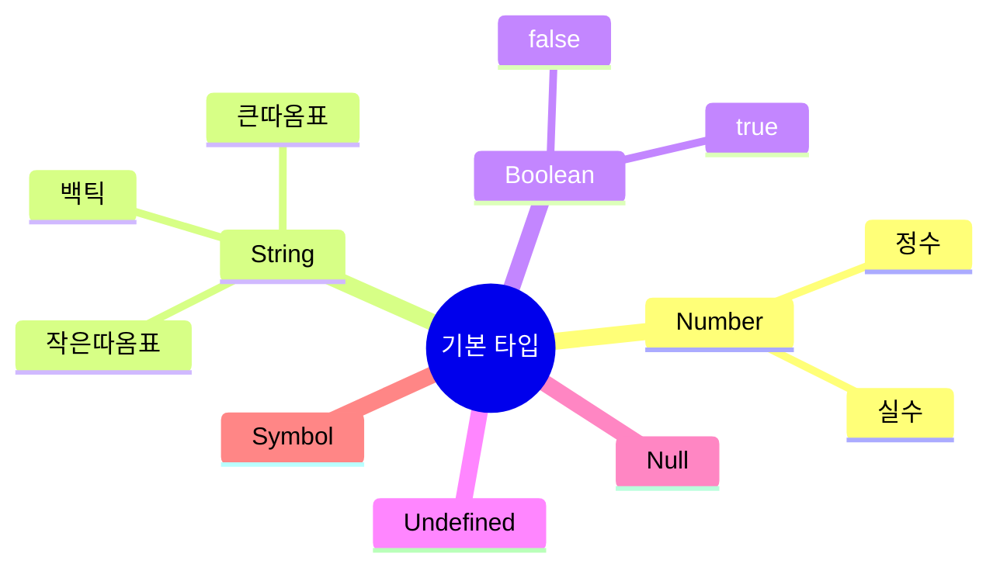

# JavaScript 변수와 데이터 타입 🎯

## 목차
1. [변수란?](#변수란)
2. [변수 선언 방법](#변수-선언-방법)
3. [데이터 타입](#데이터-타입)
4. [타입 변환](#타입-변환)
5. [변수 네이밍 규칙](#변수-네이밍-규칙)
6. [실전 예제](#실전-예제)

## 변수란? 🤔

변수는 데이터를 저장하는 '컴퓨터 메모리의 공간'입니다. 마치 다음과 같은 상자를 생각해보세요:


예를 들어, 우리가 책상 위에 있는 상자에 물건을 넣고 "내 필통"이라고 이름을 붙이는 것처럼, 컴퓨터의 메모리에 데이터를 저장하고 그 공간에 이름을 붙이는 것입니다.

## 변수 선언 방법 📝

JavaScript에서는 세 가지 방법으로 변수를 선언할 수 있습니다:

### 1. let
- 재할당 가능한 변수를 선언할 때 사용
- 블록 스코프를 가짐
```javascript
let age = 25;
age = 26; // 재할당 가능
```

### 2. const
- 상수(변하지 않는 값)를 선언할 때 사용
- 한 번 할당하면 값을 변경할 수 없음
```javascript
const PI = 3.14159;
// PI = 3.14; // ❌ 에러 발생!
```

### 3. var (❌ 권장하지 않음)
- 과거 버전과의 호환성을 위해 존재
- 함수 스코프를 가짐
- 현대 JavaScript에서는 사용을 권장하지 않음
```javascript
var oldVariable = "old way";
```

## 데이터 타입 📊

JavaScript의 데이터 타입은 크게 두 가지로 나눌 수 있습니다:

### 1. 기본 타입 (Primitive Types)



#### Number
```javascript
let integer = 42;        // 정수
let float = 3.14;       // 실수
let infinity = Infinity; // 무한대
let notANumber = NaN;   // 숫자가 아님
```

#### String
```javascript
let name = "Alice";             // 큰따옴표
let job = 'developer';          // 작은따옴표
let greeting = `Hello ${name}`; // 템플릿 리터럴
```

#### Boolean
```javascript
let isActive = true;
let isLoggedIn = false;
```

#### Undefined와 Null
```javascript
let undefinedVar;              // undefined
let nullVar = null;           // null
```

### 2. 참조 타입 (Reference Types)

- Object (객체)
- Array (배열)
- Function (함수)

```javascript
// 객체
const person = {
    name: "Alice",
    age: 25
};

// 배열
const fruits = ["사과", "바나나", "딸기"];

// 함수
function greet(name) {
    return `안녕하세요, ${name}님!`;
}
```

## 타입 변환 🔄

### 1. 암시적 변환
JavaScript가 자동으로 타입을 변환하는 경우:
```javascript
let result = "5" + 2;    // "52" (문자열)
let result2 = "5" - 2;   // 3 (숫자)
```

### 2. 명시적 변환
개발자가 직접 타입을 변환하는 경우:
```javascript
let num = Number("5");    // 문자열 -> 숫자
let str = String(5);      // 숫자 -> 문자열
let bool = Boolean(1);    // 숫자 -> 불리언
```

## 변수 네이밍 규칙 📌

1. 문자, 숫자, 언더스코어(_), 달러 기호($) 사용 가능
2. 숫자로 시작할 수 없음
3. 대소문자 구분
4. 예약어 사용 불가

```javascript
// 좋은 예
let userName = "Alice";
let userAge = 25;
let is_active = true;
let $price = 100;

// 나쁜 예 ❌
let 1user = "Bob";        // 숫자로 시작
let user-name = "Charlie"; // 하이픈 사용
let let = "test";         // 예약어 사용
```

## 실전 예제 💡

### 온라인 쇼핑몰 장바구니
```javascript
// 상품 정보
const DISCOUNT_RATE = 0.1;  // 상수로 할인율 설정
let productName = "노트북";
let price = 1200000;
let quantity = 2;

// 계산
let totalPrice = price * quantity;
let discountedPrice = totalPrice * (1 - DISCOUNT_RATE);

// 출력
console.log(`상품명: ${productName}`);
console.log(`수량: ${quantity}개`);
console.log(`총 가격: ${totalPrice}원`);
console.log(`할인 적용가: ${discountedPrice}원`);
```

### 🎯 연습문제

1. 다음 변수들의 타입은 무엇일까요?
```javascript
let a = "123";
let b = 123;
let c = true;
let d = [1, 2, 3];
```

2. 다음 코드의 결과는 무엇일까요?
```javascript
let x = "5" + 2;
let y = "5" - 2;
console.log(x, y);
```

<details>
<summary>정답 보기</summary>

1. 변수 타입:
   - a: string
   - b: number
   - c: boolean
   - d: object (array)

2. 코드 결과:
   - x: "52" (문자열)
   - y: 3 (숫자)
</details>

## 추가 학습 자료 📚

1. [MDN - JavaScript 변수](https://developer.mozilla.org/ko/docs/Learn/JavaScript/First_steps/Variables)
2. [MDN - JavaScript 데이터 타입](https://developer.mozilla.org/ko/docs/Web/JavaScript/Data_structures)

## 다음 학습 내용 예고 🔜

다음 장에서는 "연산자와 제어 흐름"에 대해 배워볼 예정입니다. 변수들을 활용하여 다양한 연산을 수행하고, 프로그램의 흐름을 제어하는 방법을 알아보겠습니다!