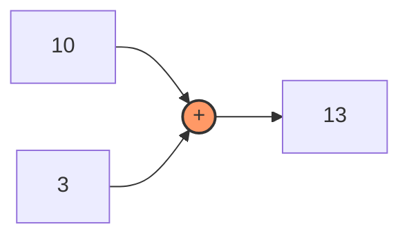
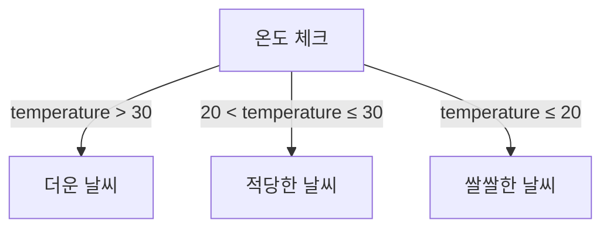

# JavaScript 연산자와 제어 흐름 🎮

## 목차
1. [연산자](#연산자)
2. [제어문](#제어문)
3. [실전 예제](#실전-예제)
4. [연습 문제](#연습-문제)

## 연산자 🔧

### 산술 연산자 (Arithmetic Operators)
수학적 계산을 수행하는 연산자입니다.

```javascript
// 기본 산술 연산자
let a = 10;
let b = 3;

console.log(a + b);  // 더하기: 13
console.log(a - b);  // 빼기: 7
console.log(a * b);  // 곱하기: 30
console.log(a / b);  // 나누기: 3.3333...
console.log(a % b);  // 나머지: 1
console.log(a ** b); // 거듭제곱: 1000
```



### 할당 연산자 (Assignment Operators)
변수에 값을 할당하는 연산자입니다.

```javascript
let x = 5;     // 기본 할당
x += 3;        // x = x + 3 (8)
x -= 2;        // x = x - 2 (6)
x *= 4;        // x = x * 4 (24)
x /= 3;        // x = x / 3 (8)
x %= 5;        // x = x % 5 (3)
```

### 비교 연산자 (Comparison Operators)
두 값을 비교하는 연산자입니다.

```javascript
// 값 비교
console.log(5 > 3);    // true
console.log(5 < 3);    // false
console.log(5 >= 5);   // true
console.log(5 <= 4);   // false

// 동등 비교
console.log(5 == "5");  // true (타입 변환 후 비교)
console.log(5 === "5"); // false (타입까지 엄격하게 비교)
console.log(5 != "6");  // true
console.log(5 !== "5"); // true
```

### 논리 연산자 (Logical Operators)
boolean 값을 다루는 연산자입니다.

```mermaid
graph TD
    A[AND 연산자 &&] --> B[모두 true일 때만 true]
    C[OR 연산자 ||] --> D[하나라도 true면 true]
    E[NOT 연산자 !] --> F[true를 false로, false를 true로]
```

```javascript
let isAdult = true;
let hasTicket = true;

// AND 연산자 (&&)
console.log(isAdult && hasTicket); // true (입장 가능!)

// OR 연산자 (||)
let hasGold = false;
let hasSilver = true;
console.log(hasGold || hasSilver); // true (멤버십 혜택 있음!)

// NOT 연산자 (!)
console.log(!isAdult); // false
```

## 제어문 🚦

### if 문
조건에 따라 다른 코드를 실행합니다.

```javascript
let temperature = 25;

if (temperature > 30) {
    console.log("더운 날씨입니다! 🌞");
} else if (temperature > 20) {
    console.log("적당한 날씨입니다! 😊");
} else {
    console.log("쌀쌀한 날씨입니다! 🌨️");
}
```

시각적으로 표현하면:



### switch 문
여러 가지 경우를 처리할 때 사용합니다.

```javascript
let day = "월요일";

switch (day) {
    case "월요일":
        console.log("월요병 조심하세요! 😫");
        break;
    case "금요일":
        console.log("불금! 🎉");
        break;
    case "토요일":
    case "일요일":
        console.log("주말! 😎");
        break;
    default:
        console.log("평일입니다. 화이팅! 💪");
}
```

### 반복문 (Loops)

#### for 문
횟수를 정해두고 반복할 때 사용합니다.

```javascript
// 5번 반복하기
for (let i = 0; i < 5; i++) {
    console.log(`${i + 1}번째 반복 🔄`);
}

// 배열의 모든 요소 출력하기
const fruits = ["사과", "바나나", "딸기"];
for (let fruit of fruits) {
    console.log(`${fruit} 맛있다! 🍎`);
}
```

#### while 문
조건이 참인 동안 계속 반복합니다.

```javascript
let energy = 3;
while (energy > 0) {
    console.log(`에너지가 ${energy}만큼 남았습니다! ⚡`);
    energy--;
}
console.log("에너지가 떨어졌습니다... 😴");
```

## 실전 예제 💡

### 간단한 게임 점수 계산기
```javascript
function calculateGameScore(hits, misses, bonus) {
    // 기본 점수 계산
    let score = (hits * 100) - (misses * 50);
    
    // 보너스 점수 추가
    if (bonus) {
        score *= 1.5;
    }
    
    // 등급 결정
    let grade;
    if (score >= 1000) {
        grade = "S";
    } else if (score >= 800) {
        grade = "A";
    } else if (score >= 600) {
        grade = "B";
    } else {
        grade = "C";
    }
    
    return {
        finalScore: score,
        grade: grade
    };
}

// 게임 결과 확인
const gameResult = calculateGameScore(12, 2, true);
console.log(`최종 점수: ${gameResult.finalScore}`);
console.log(`등급: ${gameResult.grade}`);
```

### 간단한 장바구니 시스템
```javascript
const cart = [
    { name: "노트북", price: 1000000, quantity: 1 },
    { name: "마우스", price: 50000, quantity: 2 },
    { name: "키보드", price: 150000, quantity: 1 }
];

function calculateTotal(items) {
    let total = 0;
    for (let item of items) {
        total += item.price * item.quantity;
    }
    
    // 할인 적용
    if (total > 1000000) {
        total *= 0.9; // 10% 할인
    }
    
    return total;
}

console.log(`총 결제 금액: ${calculateTotal(cart)}원`);
```

## 연습 문제 ✏️

1. 다음 코드의 출력 결과는 무엇일까요?
```javascript
let x = 10;
let y = "10";

console.log(x == y);
console.log(x === y);
console.log(x != y);
console.log(x !== y);
```

2. 1부터 10까지의 숫자 중 짝수만 출력하는 코드를 작성해보세요.

<details>
<summary>정답 보기</summary>

1. 비교 연산자 결과:
   - x == y: true (값만 비교)
   - x === y: false (타입까지 비교)
   - x != y: false (값만 비교)
   - x !== y: true (타입까지 비교)

2. 짝수 출력 코드:
```javascript
for (let i = 1; i <= 10; i++) {
    if (i % 2 === 0) {
        console.log(i);
    }
}
```
</details>

## 추가 학습 자료 📚

1. [MDN - JavaScript 연산자](https://developer.mozilla.org/ko/docs/Web/JavaScript/Guide/Expressions_and_Operators)
2. [MDN - JavaScript 제어 흐름](https://developer.mozilla.org/ko/docs/Web/JavaScript/Guide/Control_flow_and_error_handling)

## 다음 학습 내용 예고 🔜

다음 장에서는 "함수와 스코프"에 대해 배워볼 예정입니다. 코드를 재사용 가능한 블록으로 만들고, 변수의 유효 범위를 관리하는 방법을 알아보겠습니다!