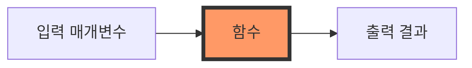
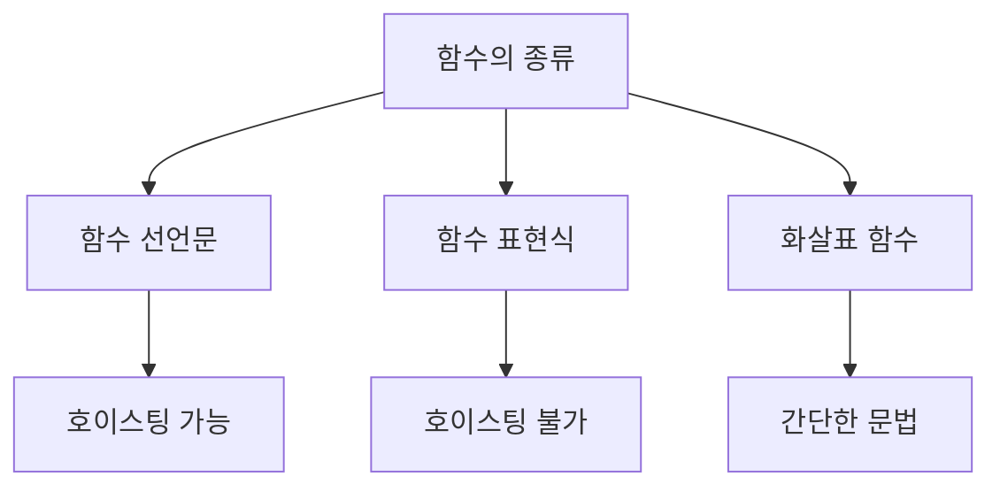
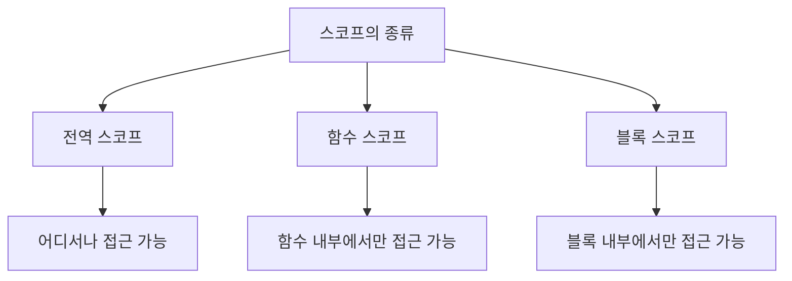

# JavaScript 함수와 스코프 🎯

## 목차
1. [함수란?](#함수란)
2. [함수의 종류](#함수의-종류)
3. [매개변수와 반환값](#매개변수와-반환값)
4. [스코프](#스코프)
5. [클로저](#클로저)
6. [실전 예제](#실전-예제)

## 함수란? 🤔

함수는 특정 작업을 수행하는 코드의 묶음입니다. 마치 커피 머신처럼, 원하는 재료(입력)를 넣으면 원하는 결과(출력)를 만들어냅니다.



### 함수의 기본 구조

```javascript
function 함수이름(매개변수1, 매개변수2) {
    // 함수 내부 코드
    return 결과값;
}
```

예시:
```javascript
function greet(name) {
    return `안녕하세요, ${name}님! 👋`;
}

console.log(greet("영희")); // "안녕하세요, 영희님! 👋"
```

## 함수의 종류 📝

### 1. 함수 선언문
가장 기본적인 함수 정의 방법입니다.

```javascript
function multiply(a, b) {
    return a * b;
}
```

### 2. 함수 표현식
함수를 변수에 할당하는 방식입니다.

```javascript
const add = function(a, b) {
    return a + b;
};
```

### 3. 화살표 함수 (Arrow Function)
ES6에서 도입된 더 간단한 함수 작성 방법입니다.

```javascript
const divide = (a, b) => a / b;

// 여러 줄인 경우
const calculate = (a, b) => {
    const result = a * b;
    return result * 2;
};
```



## 매개변수와 반환값 📥📤

### 매개변수 (Parameters)

1. 기본 매개변수
```javascript
function greeting(name = "손님") {
    return `안녕하세요, ${name}님!`;
}

console.log(greeting()); // "안녕하세요, 손님님!"
console.log(greeting("철수")); // "안녕하세요, 철수님!"
```

2. 나머지 매개변수
```javascript
function sum(...numbers) {
    return numbers.reduce((total, num) => total + num, 0);
}

console.log(sum(1, 2, 3, 4)); // 10
```

### 반환값 (Return)

함수는 `return` 문을 사용하여 값을 반환할 수 있습니다.

```javascript
function calculateArea(width, height) {
    const area = width * height;
    return area; // 결과값 반환
}

const roomArea = calculateArea(4, 5);
console.log(`방의 넓이는 ${roomArea}제곱미터입니다.`);
```

## 스코프 🎯

스코프는 변수의 유효 범위를 의미합니다.



### 1. 전역 스코프 (Global Scope)
```javascript
const globalVariable = "나는 전역 변수입니다";

function showGlobal() {
    console.log(globalVariable); // 접근 가능
}
```

### 2. 함수 스코프 (Function Scope)
```javascript
function showLocal() {
    const localVariable = "나는 지역 변수입니다";
    console.log(localVariable); // 접근 가능
}

// console.log(localVariable); // ❌ 에러! 접근 불가
```

### 3. 블록 스코프 (Block Scope)
```javascript
{
    let blockVariable = "블록 변수입니다";
    console.log(blockVariable); // 접근 가능
}

// console.log(blockVariable); // ❌ 에러! 접근 불가
```

## 클로저 🔒

클로저는 함수가 자신이 생성될 때의 환경을 기억하는 현상입니다.

```javascript
function createCounter() {
    let count = 0;  // 프라이빗 변수
    
    return {
        increase() {
            count++;
            return count;
        },
        decrease() {
            count--;
            return count;
        },
        getCount() {
            return count;
        }
    };
}

const counter = createCounter();
console.log(counter.increase()); // 1
console.log(counter.increase()); // 2
console.log(counter.decrease()); // 1
```

## 실전 예제 💡

### 1. 쇼핑몰 할인 계산기
```javascript
function calculateDiscount(price, memberType = "일반") {
    const discountRates = {
        "VIP": 0.2,      // 20% 할인
        "골드": 0.15,    // 15% 할인
        "실버": 0.1,     // 10% 할인
        "일반": 0.05     // 5% 할인
    };

    const discountRate = discountRates[memberType];
    const discountAmount = price * discountRate;
    const finalPrice = price - discountAmount;

    return {
        originalPrice: price,
        discountRate: discountRate * 100,
        discountAmount: discountAmount,
        finalPrice: finalPrice
    };
}

const result = calculateDiscount(100000, "VIP");
console.log(`
원래 가격: ${result.originalPrice}원
할인율: ${result.discountRate}%
할인금액: ${result.discountAmount}원
최종가격: ${result.finalPrice}원
`);
```

### 2. 투두리스트 관리자
```javascript
function createTodoManager() {
    const todos = [];

    return {
        add(task) {
            todos.push({ task, completed: false });
            return `할 일 "${task}"가 추가되었습니다.`;
        },
        complete(index) {
            if (todos[index]) {
                todos[index].completed = true;
                return `"${todos[index].task}"가 완료되었습니다.`;
            }
            return "해당 할 일을 찾을 수 없습니다.";
        },
        list() {
            return todos.map((todo, index) => 
                `${index + 1}. ${todo.task} ${todo.completed ? '✅' : '⬜'}`
            ).join('\n');
        }
    };
}

const todoManager = createTodoManager();
console.log(todoManager.add("JavaScript 공부하기"));
console.log(todoManager.add("운동하기"));
console.log(todoManager.list());
console.log(todoManager.complete(0));
console.log(todoManager.list());
```

## 연습 문제 ✏️

1. 다음 코드의 출력 결과는 무엇일까요?
```javascript
function outer() {
    let count = 0;
    
    function inner() {
        count++;
        return count;
    }
    
    return inner;
}

const counter1 = outer();
const counter2 = outer();

console.log(counter1());
console.log(counter1());
console.log(counter2());
```

2. 배열의 모든 요소를 더하는 함수를 화살표 함수로 작성해보세요.

<details>
<summary>정답 보기</summary>

1. 출력 결과:
   ```
   1
   2
   1
   ```
   각 counter는 독립적인 count 변수를 가집니다.

2. 배열 합계 함수:
   ```javascript
   const sumArray = (arr) => arr.reduce((sum, num) => sum + num, 0);
   ```
</details>

## 추가 학습 자료 📚

1. [MDN - 함수](https://developer.mozilla.org/ko/docs/Web/JavaScript/Guide/Functions)
2. [MDN - 스코프](https://developer.mozilla.org/ko/docs/Glossary/Scope)
3. [MDN - 클로저](https://developer.mozilla.org/ko/docs/Web/JavaScript/Closures)

## 다음 학습 내용 예고 🔜

다음 장에서는 "배열과 객체"에 대해 배워볼 예정입니다. JavaScript의 핵심 데이터 구조인 배열과 객체의 사용법과 다양한 메서드들을 알아보겠습니다!