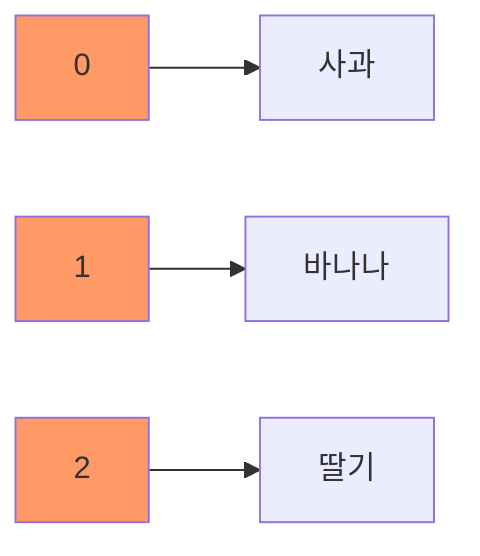
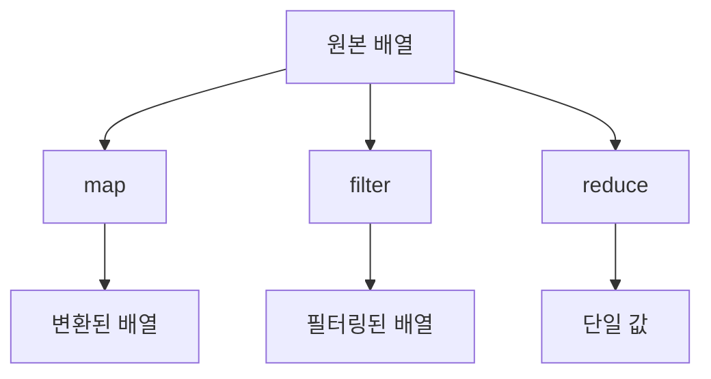

# JavaScript 배열과 객체 📦

## 목차
1. [배열 기초](#배열-기초)
2. [배열 메서드](#배열-메서드)
3. [객체 기초](#객체-기초)
4. [객체 메서드](#객체-메서드)
5. [실전 예제](#실전-예제)

## 배열 기초 📚

배열은 여러 데이터를 순서대로 저장하는 자료구조입니다. 마치 책장에 책을 순서대로 꽂아두는 것과 같습니다.



### 배열 생성

```javascript
// 빈 배열 생성
const emptyArray = [];

// 요소가 있는 배열 생성
const fruits = ["사과", "바나나", "딸기"];

// Array 생성자 사용
const numbers = new Array(1, 2, 3, 4, 5);
```

### 배열 접근과 수정

```javascript
const colors = ["빨강", "파랑", "노랑"];

// 배열 요소 접근
console.log(colors[0]); // "빨강"

// 배열 요소 수정
colors[1] = "초록";
console.log(colors); // ["빨강", "초록", "노랑"]

// 배열 길이
console.log(colors.length); // 3
```

## 배열 메서드 🛠️

### 기본 조작 메서드

```javascript
const tasks = ["업무 확인"];

// 끝에 추가
tasks.push("이메일 확인");

// 앞에 추가
tasks.unshift("회의 준비");

// 끝에서 제거
const lastTask = tasks.pop();

// 앞에서 제거
const firstTask = tasks.shift();

console.log(tasks); // 현재 작업 목록 출력
```

### 배열 탐색과 변환

```javascript
const numbers = [1, 2, 3, 4, 5];

// map: 각 요소를 변환
const doubled = numbers.map(num => num * 2);
console.log(doubled); // [2, 4, 6, 8, 10]

// filter: 조건에 맞는 요소만 선택
const evenNumbers = numbers.filter(num => num % 2 === 0);
console.log(evenNumbers); // [2, 4]

// reduce: 배열을 하나의 값으로 축소
const sum = numbers.reduce((acc, curr) => acc + curr, 0);
console.log(sum); // 15
```



## 객체 기초 🎯

객체는 관련된 데이터와 동작을 하나의 단위로 묶는 자료구조입니다. 마치 사원 카드처럼 관련 정보를 하나로 모아둡니다.

### 객체 생성

```javascript
// 객체 리터럴
const employee = {
    name: "김철수",
    age: 28,
    department: "개발팀",
    isFullTime: true
};

// 생성자 함수
function Person(name, age) {
    this.name = name;
    this.age = age;
}
const person = new Person("홍길동", 25);
```

### 객체 프로퍼티 접근

```javascript
// 점 표기법
console.log(employee.name); // "김철수"

// 대괄호 표기법
console.log(employee["department"]); // "개발팀"

// 프로퍼티 추가
employee.position = "주니어 개발자";

// 프로퍼티 삭제
delete employee.isFullTime;
```

## 객체 메서드 🔧

### Object 정적 메서드

```javascript
const user = {
    id: 1,
    name: "Alice",
    email: "alice@example.com"
};

// 객체의 키 목록
console.log(Object.keys(user));
// ["id", "name", "email"]

// 객체의 값 목록
console.log(Object.values(user));
// [1, "Alice", "alice@example.com"]

// 객체의 키-값 쌍 목록
console.log(Object.entries(user));
// [[" id", 1], ["name", "Alice"], ["email", "alice@example.com"]]
```

### 객체 메서드 정의

```javascript
const calculator = {
    result: 0,
    add(num) {
        this.result += num;
        return this;
    },
    subtract(num) {
        this.result -= num;
        return this;
    },
    getResult() {
        return this.result;
    }
};

console.log(
    calculator
        .add(5)
        .subtract(2)
        .getResult()
); // 3
```

## 실전 예제 💡

### 1. 학생 성적 관리 시스템

```javascript
class GradeManager {
    constructor() {
        this.students = [];
    }

    addStudent(name, scores) {
        this.students.push({
            name,
            scores,
            average: scores.reduce((sum, score) => sum + score, 0) / scores.length
        });
    }

    getTopStudent() {
        return this.students.reduce((top, current) => 
            current.average > top.average ? current : top
        );
    }

    getStudentsByScore(minimumAverage) {
        return this.students.filter(student => 
            student.average >= minimumAverage
        );
    }
}

const gradeManager = new GradeManager();
gradeManager.addStudent("김철수", [85, 90, 95]);
gradeManager.addStudent("이영희", [90, 95, 100]);
gradeManager.addStudent("박민수", [75, 80, 85]);

console.log("최고 성적 학생:", gradeManager.getTopStudent());
console.log("평균 90점 이상 학생:", gradeManager.getStudentsByScore(90));
```

### 2. 쇼핑 장바구니 관리

```javascript
class ShoppingCart {
    constructor() {
        this.items = new Map();
    }

    addItem(product, quantity = 1) {
        const currentQuantity = this.items.get(product.id) || 0;
        this.items.set(product.id, {
            ...product,
            quantity: currentQuantity + quantity
        });
    }

    removeItem(productId) {
        this.items.delete(productId);
    }

    updateQuantity(productId, quantity) {
        if (this.items.has(productId)) {
            const item = this.items.get(productId);
            this.items.set(productId, {
                ...item,
                quantity: quantity
            });
        }
    }

    getTotalPrice() {
        let total = 0;
        for (let item of this.items.values()) {
            total += item.price * item.quantity;
        }
        return total;
    }

    getItemCount() {
        return Array.from(this.items.values())
            .reduce((total, item) => total + item.quantity, 0);
    }
}

// 사용 예시
const cart = new ShoppingCart();

cart.addItem({
    id: 1,
    name: "노트북",
    price: 1200000
});

cart.addItem({
    id: 2,
    name: "마우스",
    price: 50000
}, 2);

console.log("총 상품 개수:", cart.getItemCount());
console.log("총 가격:", cart.getTotalPrice());
```

## 연습 문제 ✏️

1. 다음 배열을 활용하여 문제를 해결해보세요:
```javascript
const numbers = [1, 2, 3, 4, 5, 6, 7, 8, 9, 10];

// 1) 짝수만 필터링하고 각 숫자를 제곱한 후 모든 숫자의 평균을 구하세요.
// 2) 배열의 모든 숫자를 문자열로 변환하고 쉼표로 구분하여 하나의 문자열로 만드세요.
```

2. 다음 객체를 수정하는 코드를 작성해보세요:
```javascript
const company = {
    name: "Tech Corp",
    employees: [
        { id: 1, name: "Alice", department: "개발" },
        { id: 2, name: "Bob", department: "디자인" },
        { id: 3, name: "Charlie", department: "개발" }
    ]
};

// 1) 개발 부서의 직원 수를 구하세요.
// 2) 모든 직원의 이름을 배열로 추출하세요.
```

<details>
<summary>정답 보기</summary>

1. 배열 문제 해결:
```javascript
// 1) 짝수 필터링, 제곱, 평균
const result1 = numbers
    .filter(num => num % 2 === 0)
    .map(num => num ** 2)
    .reduce((acc, curr, _, arr) => acc + curr / arr.length, 0);

// 2) 문자열 변환
const result2 = numbers.join(",");
```

2. 객체 문제 해결:
```javascript
// 1) 개발 부서 직원 수
const devCount = company.employees
    .filter(emp => emp.department === "개발")
    .length;

// 2) 직원 이름 배열
const names = company.employees
    .map(emp => emp.name);
```
</details>

## 추가 학습 자료 📚

1. [MDN - 배열](https://developer.mozilla.org/ko/docs/Web/JavaScript/Reference/Global_Objects/Array)
2. [MDN - 객체](https://developer.mozilla.org/ko/docs/Web/JavaScript/Reference/Global_Objects/Object)

## 다음 학습 내용 예고 🔜

다음 장에서는 "오류 처리"에 대해 배워볼 예정입니다. JavaScript에서 발생할 수 있는 다양한 오류 상황을 처리하는 방법과 디버깅 기법을 알아보겠습니다!