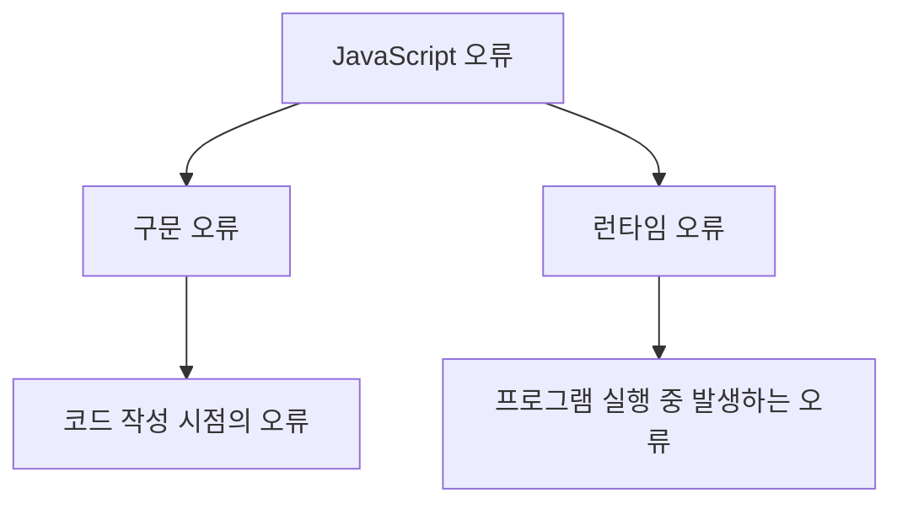

# JavaScript 오류 처리 🛠️

## 목차
1. [오류의 이해](#오류의-이해)
2. [오류 처리 방법](#오류-처리-방법)
3. [커스텀 오류](#커스텀-오류)
4. [비동기 오류 처리](#비동기-오류-처리)
5. [실전 예제](#실전-예제)

## 오류의 이해 🤔

JavaScript에서 발생하는 오류는 크게 두 가지로 나눌 수 있습니다:



### 주요 오류 유형

1. SyntaxError (구문 오류)
```javascript
// 잘못된 구문
if (true {  // 괄호 누락
    console.log("오류 발생");
}
```

2. ReferenceError (참조 오류)
```javascript
// 정의되지 않은 변수 사용
console.log(undefinedVariable);
```

3. TypeError (타입 오류)
```javascript
// 잘못된 타입의 메서드 호출
const str = null;
console.log(str.toUpperCase());
```

4. RangeError (범위 오류)
```javascript
// 유효하지 않은 범위의 값 사용
const arr = new Array(-1);
```

## 오류 처리 방법 🛡️

### try...catch 문

기본적인 오류 처리 구문입니다.

```javascript
try {
    // 오류가 발생할 수 있는 코드
    const result = riskyOperation();
} catch (error) {
    // 오류 처리 코드
    console.error("오류 발생:", error.message);
} finally {
    // 항상 실행되는 코드
    console.log("작업 완료");
}
```

### 오류 객체의 주요 속성

```javascript
try {
    throw new Error("치명적인 오류 발생!");
} catch (error) {
    console.log(error.name);     // "Error"
    console.log(error.message);  // "치명적인 오류 발생!"
    console.log(error.stack);    // 오류 발생 위치의 스택 트레이스
}
```

## 커스텀 오류 🎨

사용자 정의 오류를 만들어 특정 상황에 대한 오류 처리를 할 수 있습니다.

```javascript
class ValidationError extends Error {
    constructor(message) {
        super(message);
        this.name = "ValidationError";
    }
}

class DatabaseError extends Error {
    constructor(message) {
        super(message);
        this.name = "DatabaseError";
    }
}

// 사용 예시
function validateUser(user) {
    if (!user.name) {
        throw new ValidationError("사용자 이름은 필수입니다.");
    }
    if (!user.email) {
        throw new ValidationError("이메일은 필수입니다.");
    }
}
```

## 비동기 오류 처리 ⚡

### Promise 에러 처리

```javascript
fetchUserData()
    .then(user => {
        return processUser(user);
    })
    .catch(error => {
        if (error instanceof NetworkError) {
            console.error("네트워크 오류:", error.message);
        } else if (error instanceof ValidationError) {
            console.error("유효성 검사 오류:", error.message);
        } else {
            console.error("알 수 없는 오류:", error.message);
        }
    });
```

### async/await 에러 처리

```javascript
async function handleUserData() {
    try {
        const user = await fetchUserData();
        const processedUser = await processUser(user);
        return processedUser;
    } catch (error) {
        console.error("데이터 처리 중 오류 발생:", error.message);
        throw error; // 상위 호출자에게 오류 전파
    }
}
```

## 실전 예제 💡

### 1. 사용자 등록 시스템

```javascript
class UserRegistrationError extends Error {
    constructor(message, field) {
        super(message);
        this.name = "UserRegistrationError";
        this.field = field;
    }
}

async function registerUser(userData) {
    try {
        // 입력 데이터 검증
        validateUserData(userData);

        // 사용자 중복 확인
        const existingUser = await checkExistingUser(userData.email);
        if (existingUser) {
            throw new UserRegistrationError("이미 존재하는 이메일입니다.", "email");
        }

        // 데이터베이스에 사용자 저장
        const user = await saveUser(userData);
        
        // 환영 이메일 발송
        await sendWelcomeEmail(user);

        return user;
    } catch (error) {
        if (error instanceof UserRegistrationError) {
            // 특정 필드 관련 오류 처리
            handleFieldError(error);
        } else if (error instanceof DatabaseError) {
            // 데이터베이스 오류 처리
            handleDatabaseError(error);
        } else {
            // 기타 예상치 못한 오류 처리
            handleUnexpectedError(error);
        }
        throw error; // 오류를 상위로 전파
    }
}

// 사용 예시
try {
    const user = await registerUser({
        name: "홍길동",
        email: "hong@example.com",
        password: "secure123"
    });
    console.log("사용자 등록 성공:", user);
} catch (error) {
    console.error("사용자 등록 실패:", error.message);
}
```

### 2. API 요청 핸들러

```javascript
class APIError extends Error {
    constructor(message, status) {
        super(message);
        this.name = "APIError";
        this.status = status;
    }
}

async function apiRequestHandler(request) {
    const retryCount = 3;
    let lastError;

    for (let i = 0; i < retryCount; i++) {
        try {
            const response = await fetch(request.url, request.options);
            
            if (!response.ok) {
                throw new APIError(
                    `서버 응답 오류: ${response.status}`,
                    response.status
                );
            }

            const data = await response.json();
            return data;

        } catch (error) {
            lastError = error;
            
            if (error instanceof APIError && error.status === 404) {
                // 404 오류는 즉시 실패 처리
                break;
            }

            // 일시적인 오류인 경우 재시도
            if (i < retryCount - 1) {
                console.log(`재시도 중... (${i + 1}/${retryCount})`);
                await wait(1000 * Math.pow(2, i)); // 지수 백오프
                continue;
            }
        }
    }

    // 모든 재시도 실패
    throw lastError;
}
```

## 연습 문제 ✏️

1. 다음 코드의 문제점을 찾고 적절한 오류 처리를 추가해보세요:

```javascript
function divideNumbers(a, b) {
    return a / b;
}

function calculateAverage(numbers) {
    const sum = numbers.reduce((acc, curr) => acc + curr);
    return sum / numbers.length;
}
```

2. 비동기 함수의 오류 처리를 개선해보세요:

```javascript
async function fetchUserProfile(userId) {
    const response = await fetch(`/api/users/${userId}`);
    const data = await response.json();
    return data;
}
```

<details>
<summary>정답 보기</summary>

1. 숫자 처리 함수 개선:
```javascript
function divideNumbers(a, b) {
    if (typeof a !== 'number' || typeof b !== 'number') {
        throw new TypeError('입력값은 숫자여야 합니다.');
    }
    if (b === 0) {
        throw new Error('0으로 나눌 수 없습니다.');
    }
    return a / b;
}

function calculateAverage(numbers) {
    if (!Array.isArray(numbers)) {
        throw new TypeError('배열이 필요합니다.');
    }
    if (numbers.length === 0) {
        throw new Error('빈 배열의 평균을 계산할 수 없습니다.');
    }
    const sum = numbers.reduce((acc, curr) => {
        if (typeof curr !== 'number') {
            throw new TypeError('배열의 모든 요소는 숫자여야 합니다.');
        }
        return acc + curr;
    }, 0);
    return sum / numbers.length;
}
```

2. 비동기 함수 개선:
```javascript
async function fetchUserProfile(userId) {
    try {
        const response = await fetch(`/api/users/${userId}`);
        if (!response.ok) {
            throw new Error(`HTTP error! status: ${response.status}`);
        }
        const data = await response.json();
        return data;
    } catch (error) {
        if (error instanceof TypeError) {
            throw new Error('네트워크 오류가 발생했습니다.');
        }
        throw error;
    }
}
```
</details>

## 추가 학습 자료 📚

1. [MDN - 오류 처리](https://developer.mozilla.org/ko/docs/Web/JavaScript/Guide/Control_flow_and_error_handling)
2. [MDN - Error 객체](https://developer.mozilla.org/ko/docs/Web/JavaScript/Reference/Global_Objects/Error)

## 다음 학습 내용 예고 🔜

다음 장에서는 "비동기 프로그래밍 기초"에 대해 배워볼 예정입니다. Promise, async/await 등 JavaScript의 비동기 처리 방식과 실제 활용 방법을 알아보겠습니다!