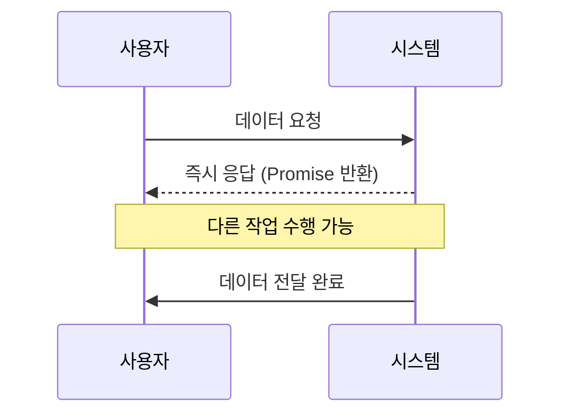
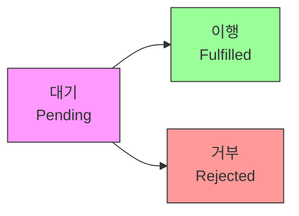

# JavaScript 비동기 프로그래밍 기초 ⚡

## 목차
1. [비동기 프로그래밍 이해](#비동기-프로그래밍-이해)
2. [콜백 함수](#콜백-함수)
3. [Promise](#promise)
4. [async/await](#asyncawait)
5. [실전 예제](#실전-예제)

## 비동기 프로그래밍 이해 🤔

비동기 프로그래밍은 작업이 완료되기를 기다리지 않고 다음 작업을 수행하는 프로그래밍 방식입니다. 마치 카페에서 커피를 주문하고, 커피가 완성되기를 기다리는 동안 다른 일을 하는 것과 같습니다.



### 동기 vs 비동기

```javascript
// 동기 처리
console.log("시작");
const result = database.query("SELECT * FROM users"); // 이 작업이 끝날 때까지 대기
console.log("완료");

// 비동기 처리
console.log("시작");
database.query("SELECT * FROM users").then(result => {
    console.log("데이터 도착");
});
console.log("다음 작업 진행"); // 데이터를 기다리지 않고 실행
```

## 콜백 함수 📞

콜백 함수는 비동기 작업이 완료된 후 실행되는 함수입니다.

```javascript
// 기본적인 콜백 사용
function fetchData(callback) {
    setTimeout(() => {
        const data = { id: 1, name: "홍길동" };
        callback(data);
    }, 1000);
}

fetchData(data => {
    console.log("데이터 도착:", data);
});
```

### 콜백 지옥 문제

콜백이 중첩되면 코드가 복잡해지는 "콜백 지옥"이 발생할 수 있습니다.

```javascript
fetchUserData(user => {
    fetchUserPosts(user.id, posts => {
        fetchPostComments(posts[0].id, comments => {
            fetchCommentAuthor(comments[0].id, author => {
                console.log("작성자:", author);
                // 콜백 지옥 발생!
            });
        });
    });
});
```

## Promise 🤝

Promise는 비동기 작업의 최종 완료(또는 실패)와 그 결과값을 나타내는 객체입니다.

```javascript
// Promise 생성
function fetchUser(id) {
    return new Promise((resolve, reject) => {
        setTimeout(() => {
            const user = { id: id, name: "홍길동" };
            if (user) {
                resolve(user);  // 성공 시
            } else {
                reject(new Error("사용자를 찾을 수 없습니다."));  // 실패 시
            }
        }, 1000);
    });
}

// Promise 사용
fetchUser(1)
    .then(user => {
        console.log("사용자:", user);
        return fetchUserPosts(user.id);
    })
    .then(posts => {
        console.log("게시물:", posts);
    })
    .catch(error => {
        console.error("오류 발생:", error);
    });
```

### Promise의 상태



### Promise.all과 Promise.race

```javascript
// 여러 Promise 동시 처리
Promise.all([
    fetchUser(1),
    fetchUser(2),
    fetchUser(3)
])
.then(users => {
    console.log("모든 사용자:", users);
})
.catch(error => {
    console.error("오류 발생:", error);
});

// 가장 빨리 완료되는 Promise 처리
Promise.race([
    fetchData('endpoint1'),
    fetchData('endpoint2')
])
.then(result => {
    console.log("가장 빠른 응답:", result);
});
```

## async/await ⚡

async/await는 Promise를 더 간단하고 직관적으로 사용할 수 있게 해주는 문법입니다.

```javascript
async function getUserData(userId) {
    try {
        const user = await fetchUser(userId);
        const posts = await fetchUserPosts(user.id);
        const comments = await fetchPostComments(posts[0].id);
        
        return {
            user,
            posts,
            comments
        };
    } catch (error) {
        console.error("데이터 조회 실패:", error);
        throw error;
    }
}

// 사용 예시
async function initialize() {
    try {
        const data = await getUserData(1);
        console.log("사용자 데이터:", data);
    } catch (error) {
        console.error("초기화 실패:", error);
    }
}
```

## 실전 예제 💡

### 1. 데이터 로딩 관리자

```javascript
class DataLoader {
    constructor() {
        this.cache = new Map();
    }

    async fetchWithCache(url, options = {}) {
        const cacheKey = `${url}-${JSON.stringify(options)}`;

        // 캐시 확인
        if (this.cache.has(cacheKey)) {
            console.log('캐시된 데이터 사용');
            return this.cache.get(cacheKey);
        }

        try {
            console.log('서버에서 데이터 가져오는 중...');
            const response = await fetch(url, options);
            
            if (!response.ok) {
                throw new Error(`HTTP 오류! 상태: ${response.status}`);
            }

            const data = await response.json();
            
            // 캐시 저장
            this.cache.set(cacheKey, data);
            
            return data;
        } catch (error) {
            console.error('데이터 로딩 실패:', error);
            throw error;
        }
    }

    clearCache() {
        this.cache.clear();
        console.log('캐시 초기화 완료');
    }
}

// 사용 예시
const loader = new DataLoader();

async function loadUserData() {
    try {
        const user = await loader.fetchWithCache('/api/user/1');
        const posts = await loader.fetchWithCache(`/api/user/${user.id}/posts`);
        return { user, posts };
    } catch (error) {
        console.error('사용자 데이터 로딩 실패:', error);
        throw error;
    }
}
```

### 2. 비동기 작업 큐

```javascript
class AsyncQueue {
    constructor() {
        this.queue = [];
        this.running = false;
    }

    async add(task) {
        return new Promise((resolve, reject) => {
            this.queue.push({
                task,
                resolve,
                reject
            });

            if (!this.running) {
                this.processQueue();
            }
        });
    }

    async processQueue() {
        if (this.running || this.queue.length === 0) {
            return;
        }

        this.running = true;

        while (this.queue.length > 0) {
            const { task, resolve, reject } = this.queue.shift();

            try {
                const result = await task();
                resolve(result);
            } catch (error) {
                reject(error);
            }
        }

        this.running = false;
    }
}

// 사용 예시
const queue = new AsyncQueue();

async function example() {
    try {
        // 작업 추가
        const result1 = await queue.add(async () => {
            await sleep(1000);
            return "작업 1 완료";
        });

        const result2 = await queue.add(async () => {
            await sleep(500);
            return "작업 2 완료";
        });

        console.log(result1, result2);
    } catch (error) {
        console.error("작업 실행 실패:", error);
    }
}
```

## 연습 문제 ✏️

1. 다음 코드를 Promise를 사용하여 개선해보세요:

```javascript
function loadUserData(userId, callback) {
    setTimeout(() => {
        const user = { id: userId, name: "User " + userId };
        callback(null, user);
    }, 1000);
}

function loadUserPosts(userId, callback) {
    setTimeout(() => {
        const posts = [
            { id: 1, title: "Post 1" },
            { id: 2, title: "Post 2" }
        ];
        callback(null, posts);
    }, 1000);
}
```

2. 다음 Promise 기반 코드를 async/await를 사용하여 재작성해보세요:

```javascript
function fetchUserProfile(userId) {
    return fetch(`/api/users/${userId}`)
        .then(response => response.json())
        .then(user => {
            return fetch(`/api/users/${user.id}/posts`);
        })
        .then(response => response.json())
        .then(posts => {
            return { user, posts };
        })
        .catch(error => {
            console.error('Error:', error);
            throw error;
        });
}
```

<details>
<summary>정답 보기</summary>

1. Promise 버전:
```javascript
function loadUserData(userId) {
    return new Promise((resolve) => {
        setTimeout(() => {
            const user = { id: userId, name: "User " + userId };
            resolve(user);
        }, 1000);
    });
}

function loadUserPosts(userId) {
    return new Promise((resolve) => {
        setTimeout(() => {
            const posts = [
                { id: 1, title: "Post 1" },
                { id: 2, title: "Post 2" }
            ];
            resolve(posts);
        }, 1000);
    });
}

// 사용 예시
loadUserData(1)
    .then(user => loadUserPosts(user.id))
    .then(posts => console.log(posts))
    .catch(error => console.error(error));
```

2. async/await 버전:
```javascript
async function fetchUserProfile(userId) {
    try {
        const userResponse = await fetch(`/api/users/${userId}`);
        const user = await userResponse.json();
        
        const postsResponse = await fetch(`/api/users/${user.id}/posts`);
        const posts = await postsResponse.json();
        
        return { user, posts };
    } catch (error) {
        console.error('Error:', error);
        throw error;
    }
}
```
</details>

## 추가 학습 자료 📚

1. [MDN - Promise](https://developer.mozilla.org/ko/docs/Web/JavaScript/Reference/Global_Objects/Promise)
2. [MDN - async function](https://developer.mozilla.org/ko/docs/Web/JavaScript/Reference/Statements/async_function)
3. [MDN - await](https://developer.mozilla.org/ko/docs/Web/JavaScript/Reference/Operators/await)

## 다음 학습 내용 예고 🔜

다음 장에서는 "모듈 시스템 기초"에 대해 배워볼 예정입니다. JavaScript의 모듈 시스템을 이해하고, 코드를 효율적으로 구조화하는 방법을 알아보겠습니다!