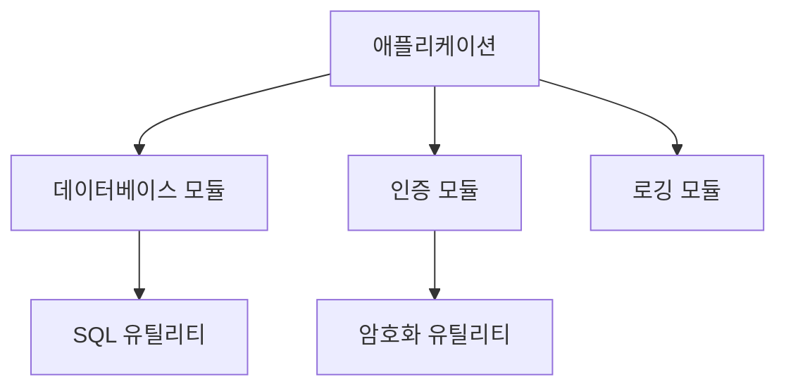

# JavaScript 모듈 시스템 기초 📦

## 목차
1. [모듈이란?](#모듈이란)
2. [CommonJS](#commonjs)
3. [ES Modules](#es-modules)
4. [모듈 패턴](#모듈-패턴)
5. [실전 예제](#실전-예제)

## 모듈이란? 🤔

모듈은 프로그램의 기능을 독립적인 단위로 분리한 것입니다. 마치 레고 블록처럼 필요한 기능들을 조립하여 프로그램을 만들 수 있습니다.



### 모듈의 장점

1. 코드 재사용성 향상
2. 의존성 관리 용이
3. 네임스페이스 충돌 방지
4. 코드 구조화 및 유지보수 편의성

## CommonJS 🔄

Node.js에서 기본적으로 사용하는 모듈 시스템입니다.

### 모듈 내보내기 (Export)

```javascript
// mathUtils.js
function add(a, b) {
    return a + b;
}

function subtract(a, b) {
    return a - b;
}

module.exports = {
    add,
    subtract
};

// 또는 개별 내보내기
exports.multiply = (a, b) => a * b;
```

### 모듈 가져오기 (Import)

```javascript
// app.js
const mathUtils = require('./mathUtils');
// 또는 구조 분해 할당 사용
const { add, subtract } = require('./mathUtils');

console.log(mathUtils.add(5, 3));      // 8
console.log(mathUtils.subtract(5, 3)); // 2
```

## ES Modules 🌟

최신 JavaScript의 표준 모듈 시스템입니다.

### 모듈 내보내기 (Export)

```javascript
// userService.js
export function createUser(userData) {
    // 사용자 생성 로직
    return { id: 1, ...userData };
}

export function validateUser(userData) {
    // 유효성 검사 로직
    return userData.email && userData.password;
}

// 기본 내보내기
export default class UserManager {
    // 사용자 관리 클래스
}
```

### 모듈 가져오기 (Import)

```javascript
// app.js
import UserManager, { createUser, validateUser } from './userService.js';
// 또는 전체 가져오기
import * as UserService from './userService.js';

const user = createUser({ name: "홍길동", email: "hong@example.com" });
```

## 모듈 패턴 🎨

### 단일 책임 원칙 적용

```javascript
// logger.js
export class Logger {
    constructor(module) {
        this.module = module;
    }

    log(message) {
        console.log(`[${this.module}] ${message}`);
    }

    error(message) {
        console.error(`[${this.module}] ERROR: ${message}`);
    }
}

// database.js
import { Logger } from './logger.js';

const logger = new Logger('Database');

export class Database {
    constructor(config) {
        this.config = config;
        this.logger = logger;
    }

    connect() {
        this.logger.log('Connecting to database...');
        // 데이터베이스 연결 로직
    }
}
```

### 의존성 주입 패턴

```javascript
// userRepository.js
export class UserRepository {
    constructor(database) {
        this.database = database;
    }

    async findUser(id) {
        return this.database.query('SELECT * FROM users WHERE id = ?', [id]);
    }
}

// userService.js
export class UserService {
    constructor(userRepository) {
        this.userRepository = userRepository;
    }

    async getUserDetails(id) {
        const user = await this.userRepository.findUser(id);
        // 추가 비즈니스 로직
        return user;
    }
}
```

## 실전 예제 💡

### 1. API 서버 모듈화

```javascript
// config/database.js
export const dbConfig = {
    host: process.env.DB_HOST || 'localhost',
    port: process.env.DB_PORT || 5432,
    username: process.env.DB_USER,
    password: process.env.DB_PASSWORD,
    database: process.env.DB_NAME
};

// utils/asyncHandler.js
export const asyncHandler = (fn) => (req, res, next) => {
    Promise.resolve(fn(req, res, next)).catch(next);
};

// middleware/auth.js
import jwt from 'jsonwebtoken';

export function authMiddleware(req, res, next) {
    const token = req.headers.authorization?.split(' ')[1];
    if (!token) {
        return res.status(401).json({ message: '인증이 필요합니다.' });
    }

    try {
        const decoded = jwt.verify(token, process.env.JWT_SECRET);
        req.user = decoded;
        next();
    } catch (error) {
        res.status(401).json({ message: '유효하지 않은 토큰입니다.' });
    }
}

// services/userService.js
import { UserRepository } from '../repositories/userRepository.js';
import { Logger } from '../utils/logger.js';

export class UserService {
    constructor() {
        this.userRepository = new UserRepository();
        this.logger = new Logger('UserService');
    }

    async createUser(userData) {
        this.logger.log('Creating new user...');
        
        try {
            const user = await this.userRepository.create(userData);
            return user;
        } catch (error) {
            this.logger.error(`Failed to create user: ${error.message}`);
            throw error;
        }
    }
}

// app.js
import express from 'express';
import { userRoutes } from './routes/userRoutes.js';
import { authMiddleware } from './middleware/auth.js';
import { errorHandler } from './middleware/errorHandler.js';

const app = express();

app.use('/api/users', authMiddleware, userRoutes);
app.use(errorHandler);
```

### 2. 데이터 처리 파이프라인

```javascript
// modules/dataProcessor.js
export class DataProcessor {
    static async processCSV(data) {
        // CSV 데이터 처리 로직
        return processedData;
    }

    static async validateData(data) {
        // 데이터 유효성 검사
        return validationResults;
    }

    static async transformData(data) {
        // 데이터 변환 로직
        return transformedData;
    }
}

// modules/fileHandler.js
import fs from 'fs/promises';

export class FileHandler {
    static async readFile(path) {
        return fs.readFile(path, 'utf-8');
    }

    static async writeFile(path, data) {
        return fs.writeFile(path, data, 'utf-8');
    }
}

// index.js
import { DataProcessor } from './modules/dataProcessor.js';
import { FileHandler } from './modules/fileHandler.js';

async function processPipeline(inputPath, outputPath) {
    try {
        const rawData = await FileHandler.readFile(inputPath);
        const processedData = await DataProcessor.processCSV(rawData);
        const validData = await DataProcessor.validateData(processedData);
        const transformedData = await DataProcessor.transformData(validData);
        await FileHandler.writeFile(outputPath, JSON.stringify(transformedData));
        
        return { success: true, message: '데이터 처리 완료' };
    } catch (error) {
        return { success: false, error: error.message };
    }
}
```

## 연습 문제 ✏️

1. 다음 코드를 모듈로 분리해보세요:

```javascript
// 분리 전
function calculateTax(amount) {
    return amount * 0.1;
}

function calculateTotal(amount) {
    const tax = calculateTax(amount);
    return amount + tax;
}

function formatCurrency(amount) {
    return `₩${amount.toLocaleString()}`;
}

// 주문 처리
const orderAmount = 10000;
const total = calculateTotal(orderAmount);
console.log(formatCurrency(total));
```

2. 다음 의존성 구조를 모듈로 설계해보세요:
- 데이터베이스 연결
- 사용자 저장소
- 사용자 서비스
- 인증 서비스

<details>
<summary>정답 보기</summary>

1. 모듈 분리:
```javascript
// utils/tax.js
export function calculateTax(amount) {
    return amount * 0.1;
}

// utils/currency.js
export function formatCurrency(amount) {
    return `₩${amount.toLocaleString()}`;
}

// services/orderService.js
import { calculateTax } from '../utils/tax.js';
import { formatCurrency } from '../utils/currency.js';

export function calculateTotal(amount) {
    const tax = calculateTax(amount);
    return amount + tax;
}

export function processOrder(amount) {
    const total = calculateTotal(amount);
    return formatCurrency(total);
}
```

2. 의존성 구조 설계:
```javascript
// config/database.js
export class Database {
    static async connect(config) {
        // 데이터베이스 연결 로직
    }
}

// repositories/userRepository.js
export class UserRepository {
    constructor(db) {
        this.db = db;
    }
    
    async findById(id) {
        // 사용자 조회 로직
    }
}

// services/userService.js
export class UserService {
    constructor(userRepository) {
        this.userRepository = userRepository;
    }
    
    async getUserDetails(id) {
        // 사용자 정보 조회 로직
    }
}

// services/authService.js
export class AuthService {
    constructor(userService) {
        this.userService = userService;
    }
    
    async authenticate(credentials) {
        // 인증 로직
    }
}
```
</details>

## 추가 학습 자료 📚

1. [Node.js 모듈 시스템](https://nodejs.org/api/modules.html)
2. [MDN - JavaScript 모듈](https://developer.mozilla.org/ko/docs/Web/JavaScript/Guide/Modules)
3. [ES Modules 소개](https://nodejs.org/api/esm.html)

## 다음 학습 내용 예고 🔜

이것으로 Basic 과정의 마지막 장을 마쳤습니다. 다음은 Advanced 과정으로, 프로토타입과 상속에 대해 배워볼 예정입니다!