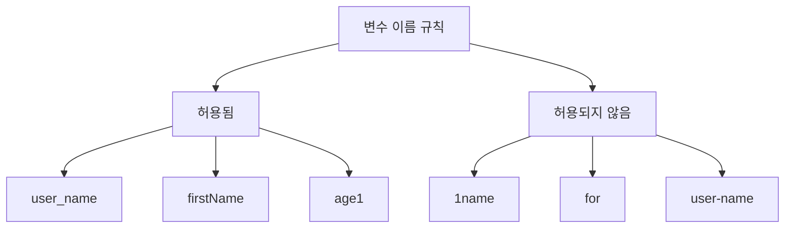
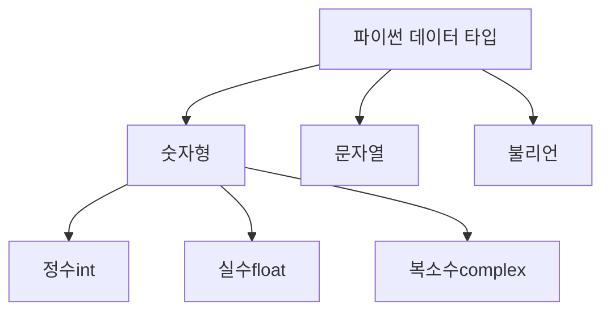

# Python 변수(Variables) 완벽 가이드 🐍

## 목차 📑
1. [변수란 무엇인가?](#변수란-무엇인가)
2. [변수 이름 규칙](#변수-이름-규칙)
3. [파이썬의 기본 데이터 타입](#파이썬의-기본-데이터-타입)
4. [변수 선언과 할당](#변수-선언과-할당)
5. [형변환](#형변환)
6. [실전 예제](#실전-예제)
7. [자주 하는 실수들](#자주-하는-실수들)
8. [연습 문제](#연습-문제)

## 변수란 무엇인가? 🤔

변수는 데이터를 저장하는 '상자'라고 생각하면 됩니다. 프로그램이 실행되는 동안 필요한 정보를 담아두는 공간이죠.


예를 들어, 다음과 같이 사용할 수 있습니다:
```python
나이 = 25
이름 = "김파이썬"
키 = 175.5
```

## 변수 이름 규칙 📝

### 좋은 변수 이름 짓기
1. 영문 소문자, 대문자, 숫자, 언더스코어(_) 사용 가능
2. 숫자로 시작할 수 없음
3. 파이썬 키워드는 사용할 수 없음
4. 의미 있는 이름 사용



### 올바른 예시 ✅
```python
user_name = "홍길동"
firstName = "길동"
age1 = 25
```

### 잘못된 예시 ❌
```python
1name = "홍길동"    # 숫자로 시작할 수 없음
for = 10           # 예약어는 사용할 수 없음
user-name = "홍길동" # 하이픈 사용 불가
```

## 파이썬의 기본 데이터 타입 📊

파이썬의 기본 데이터 타입을 알아봅시다:



### 숫자형 🔢
```python
정수 = 10          # int
실수 = 3.14        # float
복소수 = 3 + 4j    # complex
```

### 문자열 📝
```python
이름 = "홍길동"
주소 = '서울시 강남구'
여러줄_문자열 = """
여러 줄에 걸친
문자열을 작성할 수
있습니다.
"""
```

### 불리언 ⚖️
```python
참 = True
거짓 = False
```

## 변수 선언과 할당 🎯

파이썬에서는 변수를 선언하면서 동시에 값을 할당할 수 있습니다:

```python
# 기본적인 할당
나이 = 25

# 여러 변수에 동시 할당
x, y, z = 1, 2, 3

# 같은 값을 여러 변수에 할당
a = b = c = 0
```

## 형변환 🔄

다른 데이터 타입으로 변환이 필요할 때 사용합니다:

```python
# 문자열을 정수로
숫자_문자열 = "100"
숫자 = int(숫자_문자열)    # 100

# 정수를 문자열로
나이 = 25
나이_문자열 = str(나이)    # "25"

# 문자열을 실수로
파이 = float("3.14")     # 3.14
```

## 실전 예제 💡

실제로 자주 사용되는 예제를 통해 배워봅시다:

```python
# 사용자 정보 관리
이름 = "김파이썬"
나이 = 25
키 = 175.5
결혼여부 = False

# 정보 출력
print(f"""
사용자 정보
-----------
이름: {이름}
나이: {나이}세
키: {키}cm
결혼여부: {'기혼' if 결혼여부 else '미혼'}
""")
```

## 자주 하는 실수들 ⚠️

1. 변수를 선언하기 전에 사용하려고 할 때
```python
# 잘못된 예
print(age)  # NameError: name 'age' is not defined
age = 25
```

2. 부적절한 형변환
```python
# 잘못된 예
text = "Hello"
number = int(text)  # ValueError: invalid literal for int()
```

3. 예약어를 변수명으로 사용
```python
# 잘못된 예
if = 10  # SyntaxError: invalid syntax
```

## 연습 문제 📝

1. 다음 변수들을 선언하고 값을 할당해보세요:
   - 당신의 이름
   - 당신의 나이
   - 당신의 키
   - 당신의 취미

2. 두 수를 입력받아 더하는 프로그램을 작성해보세요:
```python
# 힌트
첫번째_수 = input("첫 번째 수를 입력하세요: ")
두번째_수 = input("두 번째 수를 입력하세요: ")
# 여기에 코드를 작성하세요
```

3. 원의 반지름을 입력받아 원의 넓이를 계산하는 프로그램을 작성해보세요:
```python
# 힌트
PI = 3.14159
반지름 = float(input("반지름을 입력하세요: "))
# 여기에 코드를 작성하세요
```

---
📌 **참고사항**
- 변수는 프로그램의 기초가 되는 중요한 개념입니다.
- 의미 있는 이름을 사용하면 코드의 가독성이 높아집니다.
- 적절한 주석을 달아두면 나중에 코드를 이해하기 쉽습니다.