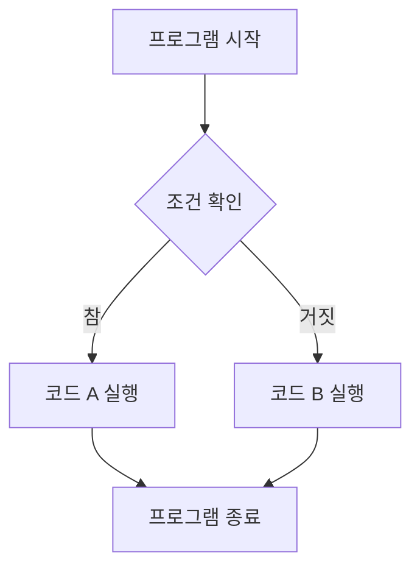
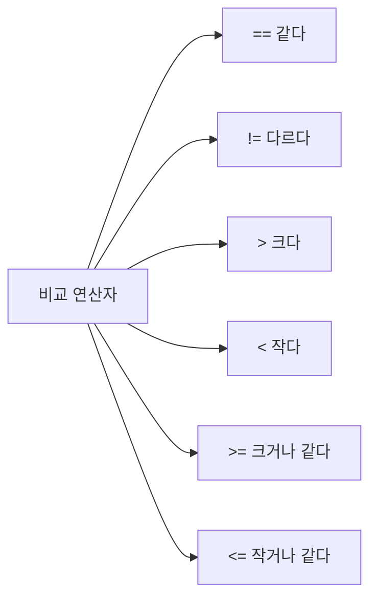

# Python 제어문(Control Flow) 완벽 가이드 🔄

## 목차 📑
1. [제어문이란?](#제어문이란)
2. [조건문 (if문)](#조건문-if문)
3. [반복문 (for문)](#반복문-for문)
4. [반복문 (while문)](#반복문-while문)
5. [제어문 보조 도구](#제어문-보조-도구)
6. [실전 예제](#실전-예제)
7. [자주 하는 실수](#자주-하는-실수)
8. [연습 문제](#연습-문제)

## 제어문이란? 🤔

프로그램의 실행 흐름을 제어하는 구문입니다. 마치 도로의 신호등처럼 프로그램의 진행 방향을 결정합니다.



## 조건문 (if문) 🚦

### 기본 구조
```python
if 조건:
    # 조건이 참일 때 실행할 코드
elif 다른_조건:
    # 다른 조건이 참일 때 실행할 코드
else:
    # 모든 조건이 거짓일 때 실행할 코드
```

### 실제 예시
```python
나이 = 18

if 나이 < 13:
    print("어린이입니다.")
elif 나이 < 20:
    print("청소년입니다.")
else:
    print("성인입니다.")
```

### 조건 연산자 🔍


### 논리 연산자
```python
# and: 두 조건이 모두 참일 때 참
if 나이 >= 20 and 키 >= 170:
    print("탑승 가능합니다.")

# or: 두 조건 중 하나라도 참이면 참
if 회원_등급 == "VIP" or 보유_포인트 >= 1000:
    print("할인 적용 가능합니다.")

# not: 조건의 결과를 반대로
if not 로그인_상태:
    print("로그인이 필요합니다.")
```

## 반복문 (for문) 🔄

### 기본 구조
```python
for 변수 in 반복가능한_객체:
    # 반복할 코드
```

### 다양한 반복문 예시
```python
# 범위 반복
for i in range(5):  # 0부터 4까지
    print(i)

# 리스트 반복
과일들 = ["사과", "바나나", "오렌지"]
for 과일 in 과일들:
    print(f"{과일}는 맛있습니다.")

# 문자열 반복
for 글자 in "Python":
    print(글자)

# enumerate 활용
for 인덱스, 과일 in enumerate(과일들):
    print(f"{인덱스+1}번째 과일: {과일}")
```

## 반복문 (while문) 🔁

### 기본 구조
```python
while 조건:
    # 조건이 참인 동안 반복할 코드
```

### 실제 예시
```python
# 카운트다운
숫자 = 5
while 숫자 > 0:
    print(f"{숫자}...")
    숫자 -= 1
print("발사!")

# 사용자 입력 반복
while True:
    답변 = input("계속하시겠습니까? (y/n): ")
    if 답변.lower() == 'n':
        break
```

## 제어문 보조 도구 🛠️

### break와 continue
```python
# break: 반복문 즉시 종료
for i in range(10):
    if i == 5:
        break
    print(i)  # 0, 1, 2, 3, 4 출력

# continue: 현재 반복을 건너뛰고 다음 반복으로
for i in range(5):
    if i == 2:
        continue
    print(i)  # 0, 1, 3, 4 출력
```

### pass 문
```python
# 아무것도 하지 않고 넘어갈 때 사용
if 조건:
    pass  # 나중에 구현할 예정
```

## 실전 예제 💡

### 학점 계산기
```python
점수 = 85

if 점수 >= 90:
    학점 = "A"
elif 점수 >= 80:
    학점 = "B"
elif 점수 >= 70:
    학점 = "C"
elif 점수 >= 60:
    학점 = "D"
else:
    학점 = "F"

print(f"당신의 학점은 {학점}입니다.")
```

### 구구단 출력
```python
# 이중 for문 활용
for i in range(2, 10):
    print(f"\n{i}단:")
    for j in range(1, 10):
        print(f"{i} x {j} = {i*j}")
```

## 자주 하는 실수 ⚠️

1. 들여쓰기 오류
```python
# 잘못된 예
if 조건:
print("들여쓰기가 없습니다.")  # IndentationError
```

2. 무한 루프
```python
# 잘못된 예
while True:
    print("멈출 수 없어요!")  # 종료 조건이 없음
```

3. 조건식 실수
```python
# 잘못된 예
if x = 10:  # SyntaxError: 할당(=)과 비교(==) 혼동
    print("x는 10입니다.")
```

## 연습 문제 📝

1. 숫자 맞히기 게임을 만들어보세요:
```python
import random

정답 = random.randint(1, 100)
# 여기에 코드를 작성하세요
```

2. 피보나치 수열을 출력하는 프로그램을 작성해보세요:
```python
def 피보나치(n):
    # 여기에 코드를 작성하세요
    pass
```

3. 입력받은 숫자의 팩토리얼을 계산하는 프로그램을 작성해보세요:
```python
def 팩토리얼(n):
    # 여기에 코드를 작성하세요
    pass
```

---
📌 **참고사항**
- 제어문은 프로그램의 논리를 구성하는 핵심 요소입니다.
- 들여쓰기를 정확하게 하는 것이 매우 중요합니다.
- 복잡한 조건은 여러 줄로 나누어 작성하면 가독성이 좋아집니다.