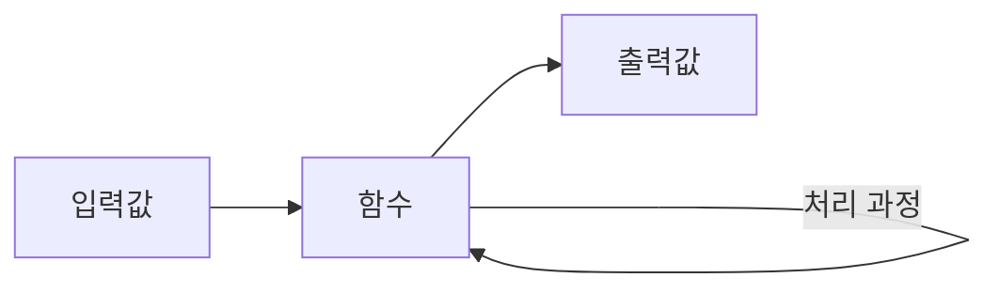
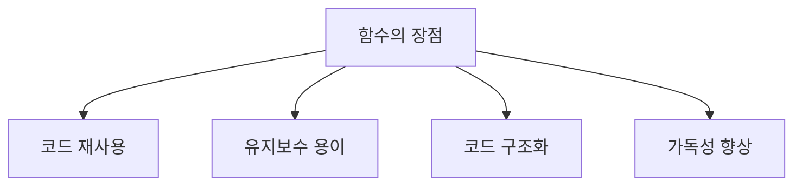
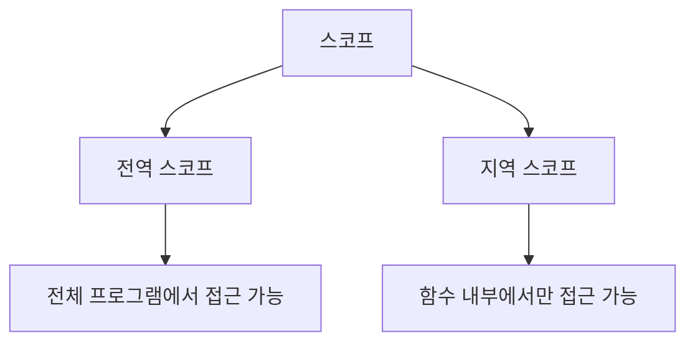

# Python 함수(Functions) 완벽 가이드 🎯

## 목차 📑
1. [함수란 무엇인가?](#함수란-무엇인가)
2. [함수의 기본 구조](#함수의-기본-구조)
3. [매개변수와 인자](#매개변수와-인자)
4. [반환값](#반환값)
5. [함수의 종류](#함수의-종류)
6. [스코프(Scope)](#스코프)
7. [실전 예제](#실전-예제)
8. [연습 문제](#연습-문제)

## 함수란 무엇인가? 🤔

함수는 특정 작업을 수행하는 코드 블록입니다. 마치 공장의 작업 라인처럼, 입력값을 받아 처리한 후 결과를 반환합니다.



### 함수를 사용하는 이유


## 함수의 기본 구조 📝

```python
def 함수이름(매개변수1, 매개변수2, ...):
    """
    함수에 대한 설명을 작성하는 문서화 문자열(docstring)
    """
    # 함수 본문
    # 실행할 코드
    return 반환값
```

### 기본 예시
```python
def 인사하기(이름):
    """
    입력받은 이름으로 인사를 하는 함수
    """
    return f"안녕하세요, {이름}님!"

# 함수 호출
메시지 = 인사하기("김파이썬")
print(메시지)  # 출력: 안녕하세요, 김파이썬님!
```

## 매개변수와 인자 📥

### 위치 매개변수
```python
def 더하기(a, b):
    return a + b

결과 = 더하기(3, 5)  # 8
```

### 기본값 매개변수
```python
def 인사말(이름, 인사="안녕하세요"):
    return f"{인사}, {이름}님!"

print(인사말("철수"))  # 안녕하세요, 철수님!
print(인사말("영희", "좋은 아침입니다"))  # 좋은 아침입니다, 영희님!
```

### 키워드 매개변수
```python
def 학생정보(이름, 나이, 학교):
    return f"{이름}은 {학교}에 다니는 {나이}살 학생입니다."

정보 = 학생정보(나이=17, 학교="파이썬고", 이름="민수")
```

### 가변 매개변수
```python
# *args: 여러 위치 인자를 튜플로 받음
def 합계(*숫자들):
    return sum(숫자들)

print(합계(1, 2, 3, 4, 5))  # 15

# **kwargs: 키워드 인자를 딕셔너리로 받음
def 개인정보(**정보):
    for 키, 값 in 정보.items():
        print(f"{키}: {값}")

개인정보(이름="철수", 나이=20, 직업="학생")
```

## 반환값 📤

### 단일값 반환
```python
def 제곱(숫자):
    return 숫자 ** 2
```

### 다중값 반환
```python
def 사칙연산(a, b):
    return a + b, a - b, a * b, a / b

합, 차, 곱, 나눔 = 사칙연산(10, 2)
```

### 반환값이 없는 함수
```python
def 출력하기(메시지):
    print(메시지)
    # return 없음 (None 반환)
```

## 함수의 종류 🔄

### 일반 함수
```python
def 일반함수():
    print("일반적인 함수입니다.")
```

### 람다 함수 (익명 함수)
```python
# 일반 함수
def 제곱(x):
    return x ** 2

# 같은 기능의 람다 함수
제곱 = lambda x: x ** 2
```

### 재귀 함수
```python
def 팩토리얼(n):
    if n <= 1:
        return 1
    return n * 팩토리얼(n - 1)
```

## 스코프(Scope) 🌍



### 전역 변수와 지역 변수
```python
전역변수 = "전역"

def 함수():
    지역변수 = "지역"
    print(전역변수)  # 전역 변수 접근 가능
    print(지역변수)  # 지역 변수 접근 가능

함수()
print(전역변수)  # 전역 변수 접근 가능
print(지역변수)  # Error: 지역 변수 접근 불가
```

### global 키워드
```python
카운터 = 0

def 카운트_증가():
    global 카운터
    카운터 += 1

카운트_증가()
print(카운터)  # 1
```

## 실전 예제 💡

### 온도 변환기
```python
def 섭씨to화씨(섭씨):
    return (섭씨 * 9/5) + 32

def 화씨to섭씨(화씨):
    return (화씨 - 32) * 5/9

# 사용 예시
온도_섭씨 = 25
온도_화씨 = 섭씨to화씨(온도_섭씨)
print(f"{온도_섭씨}°C는 {온도_화씨:.1f}°F입니다.")
```

### 계산기
```python
def 계산기(a, b, 연산='더하기'):
    연산_목록 = {
        '더하기': lambda x, y: x + y,
        '빼기': lambda x, y: x - y,
        '곱하기': lambda x, y: x * y,
        '나누기': lambda x, y: x / y if y != 0 else "0으로 나눌 수 없습니다"
    }
    return 연산_목록.get(연산, lambda x, y: "잘못된 연산")(a, b)
```

## 연습 문제 📝

1. 리스트에서 가장 큰 수를 찾는 함수를 작성해보세요:
```python
def 최대값_찾기(숫자들):
    # 여기에 코드를 작성하세요
    pass
```

2. 문자열이 팰린드롬인지 확인하는 함수를 작성해보세요:
```python
def 팰린드롬_확인(문자열):
    # 여기에 코드를 작성하세요
    pass
```

3. 피보나치 수열의 n번째 항을 반환하는 함수를 작성해보세요:
```python
def 피보나치(n):
    # 여기에 코드를 작성하세요
    pass
```

---
📌 **참고사항**
- 함수는 프로그램의 논리를 모듈화하는 핵심 도구입니다.
- 함수 이름은 그 기능을 명확히 설명하도록 작성합니다.
- 문서화 문자열(docstring)을 활용하여 함수의 사용법을 설명합니다.
- 하나의 함수는 하나의 특정 작업만 수행하도록 설계하는 것이 좋습니다.