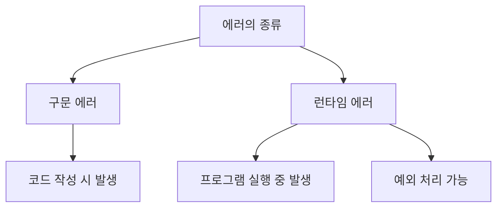
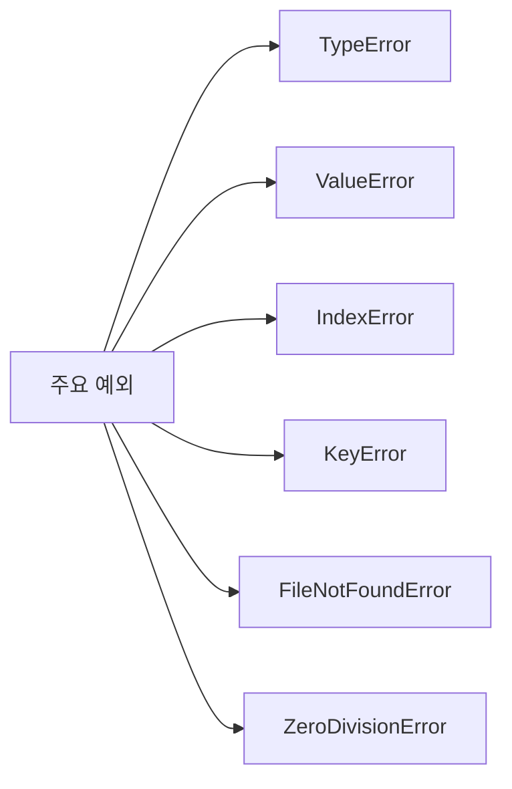

# Python 에러 핸들링(Error Handling) 완벽 가이드 🛡️

## 목차 📑
1. [에러와 예외란?](#에러와-예외란)
2. [기본적인 예외 처리](#기본적인-예외-처리)
3. [주요 내장 예외](#주요-내장-예외)
4. [사용자 정의 예외](#사용자-정의-예외)
5. [예외 처리 심화](#예외-처리-심화)
6. [모범 사례](#모범-사례)
7. [실전 예제](#실전-예제)
8. [디버깅 기법](#디버깅-기법)

## 에러와 예외란? 🤔



프로그램 실행 중 발생할 수 있는 예기치 않은 상황을 에러라고 합니다. Python에서는 이러한 에러를 체계적으로 관리하고 처리할 수 있는 방법을 제공합니다.

### 구문 에러와 런타임 에러의 차이

구문 에러는 코드 작성 단계에서 발생하는 문법적인 오류입니다. 반면, 런타임 에러는 프로그램 실행 중에 발생하는 오류로, 예외 처리를 통해 관리할 수 있습니다.

```python
# 구문 에러의 예시
if True print("Hello")  # SyntaxError: 콜론(:)이 없음

# 런타임 에러의 예시
numbers = [1, 2, 3]
print(numbers[5])  # IndexError: 존재하지 않는 인덱스 접근
```

## 기본적인 예외 처리 🛠️

### try-except 구문의 기본 구조

```python
try:
    # 예외가 발생할 수 있는 코드
    실행할_코드
except 예외종류:
    # 예외 발생 시 실행할 코드
    예외_처리_코드
```

### 실제 사용 예시

```python
def 안전한_나누기(a, b):
    try:
        결과 = a / b
        return 결과
    except ZeroDivisionError:
        return "0으로 나눌 수 없습니다."

print(안전한_나누기(10, 2))  # 5.0
print(안전한_나누기(10, 0))  # 0으로 나눌 수 없습니다.
```

## 주요 내장 예외 🎯



### 자주 발생하는 예외들과 그 처리 방법

```python
# TypeError 처리
try:
    숫자 = "123" + 456
except TypeError:
    print("문자열과 숫자는 더할 수 없습니다.")

# ValueError 처리
try:
    숫자 = int("abc")
except ValueError:
    print("올바른 숫자 형식이 아닙니다.")

# FileNotFoundError 처리
try:
    with open("존재하지_않는_파일.txt", "r") as f:
        내용 = f.read()
except FileNotFoundError:
    print("파일을 찾을 수 없습니다.")
```

## 사용자 정의 예외 🎨

사용자가 직접 예외 클래스를 정의하여 사용할 수 있습니다.

```python
class 나이초과에러(Exception):
    """나이가 제한을 초과할 때 발생하는 예외"""
    def __init__(self, 나이, 메시지="나이가 제한을 초과했습니다"):
        self.나이 = 나이
        self.메시지 = 메시지
        super().__init__(self.메시지)

def 나이확인(나이):
    if 나이 > 150:
        raise 나이초과에러(나이, f"{나이}세는 올바른 나이가 아닙니다")
    print(f"나이 {나이}세가 확인되었습니다")

try:
    나이확인(160)
except 나이초과에러 as e:
    print(f"에러: {e}")
```

## 예외 처리 심화 📚

### try-except-else-finally 구문

```python
try:
    # 예외가 발생할 수 있는 코드
    파일 = open("데이터.txt", "r")
except FileNotFoundError:
    # 예외 발생 시 실행
    print("파일이 없습니다")
else:
    # 예외가 발생하지 않았을 때 실행
    print("파일을 성공적으로 열었습니다")
finally:
    # 예외 발생 여부와 관계없이 항상 실행
    파일.close()
    print("파일을 닫았습니다")
```

### 다중 예외 처리

```python
def 데이터_처리():
    try:
        파일 = open("데이터.txt", "r")
        숫자 = int(파일.readline())
        결과 = 100 / 숫자
    except FileNotFoundError:
        print("파일을 찾을 수 없습니다")
    except ValueError:
        print("숫자를 변환할 수 없습니다")
    except ZeroDivisionError:
        print("0으로 나눌 수 없습니다")
    except Exception as e:
        print(f"예상치 못한 에러 발생: {e}")
```

## 모범 사례 💡

### 구체적인 예외 처리

```python
# 좋은 예시
try:
    데이터 = json.loads(문자열)
except json.JSONDecodeError:
    print("올바른 JSON 형식이 아닙니다")

# 피해야 할 예시
try:
    데이터 = json.loads(문자열)
except:  # 모든 예외를 무분별하게 잡지 않음
    print("에러 발생")
```

### 컨텍스트 관리자 활용

```python
# with 문을 사용한 파일 처리
with open("파일.txt", "r") as f:
    내용 = f.read()  # 자동으로 파일이 닫힘
```

## 실전 예제 🎯

### 데이터베이스 연결 예외 처리

```python
class 데이터베이스연결에러(Exception):
    pass

def 데이터베이스_연결():
    try:
        # 데이터베이스 연결 시도
        if not 연결_성공:
            raise 데이터베이스연결에러("데이터베이스 연결 실패")
        return 연결
    except 데이터베이스연결에러 as e:
        print(f"에러: {e}")
        # 재시도 로직 구현
    finally:
        # 연결 관련 리소스 정리
```

### 설정 파일 로딩

```python
import json

def 설정_로드(파일명):
    try:
        with open(파일명, "r", encoding="utf-8") as f:
            return json.load(f)
    except FileNotFoundError:
        print(f"{파일명}을 찾을 수 없습니다")
        return {}
    except json.JSONDecodeError:
        print("올바르지 않은 JSON 형식입니다")
        return {}
```

## 디버깅 기법 🔍

### print 디버깅

```python
def 복잡한_계산(x, y):
    print(f"입력값: x={x}, y={y}")  # 디버깅 출력
    try:
        결과 = (x + y) / (x - y)
        print(f"중간 결과: {결과}")  # 디버깅 출력
        return 결과
    except ZeroDivisionError:
        print("분모가 0이 되었습니다")  # 디버깅 출력
        return None
```

### logging 모듈 활용

```python
import logging

logging.basicConfig(level=logging.DEBUG)
logger = logging.getLogger(__name__)

def 중요한_함수():
    try:
        logger.debug("함수 시작")
        # 로직 수행
        logger.info("작업 완료")
    except Exception as e:
        logger.error(f"에러 발생: {e}")
```

---
📌 **참고사항**
- 예외 처리는 프로그램의 안정성을 높이는 핵심 요소입니다.
- 구체적인 예외를 처리하고, 광범위한 예외 처리는 피하세요.
- 사용자 정의 예외를 통해 비즈니스 로직에 맞는 예외 처리가 가능합니다.
- 디버깅 도구를 적절히 활용하여 문제 해결 능력을 향상시키세요.