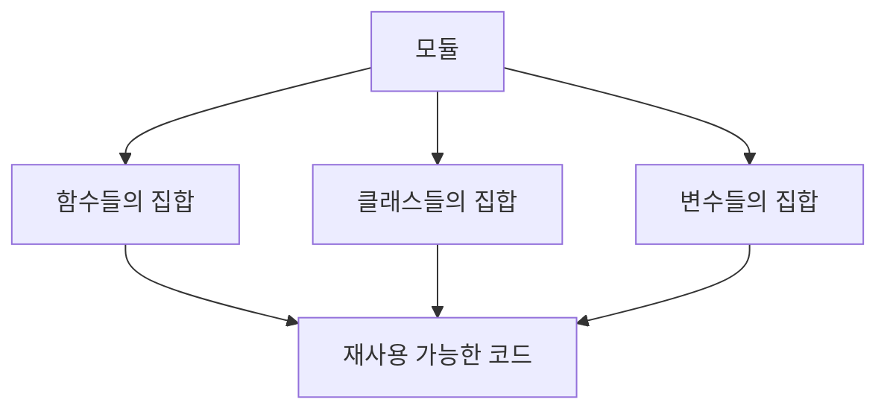
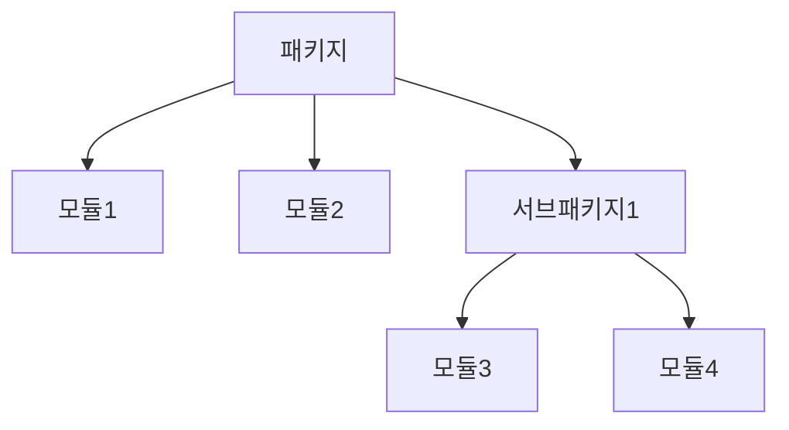
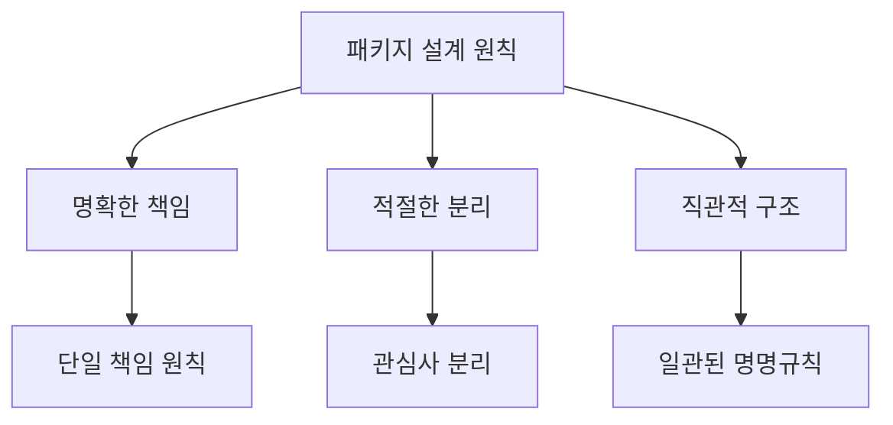

# Python 모듈과 패키지(Modules and Packages) 완벽 가이드 📦

## 목차 📑
1. [모듈이란?](#모듈이란)
2. [패키지란?](#패키지란)
3. [import 문의 이해](#import-문의-이해)
4. [가상환경](#가상환경)
5. [패키지 관리](#패키지-관리)
6. [모듈과 패키지 작성하기](#모듈과-패키지-작성하기)
7. [실전 예제](#실전-예제)
8. [모범 사례](#모범-사례)

## 모듈이란? 📝

모듈은 Python 코드를 담고 있는 파일입니다. 코드의 재사용과 구조화를 위한 기본 단위입니다.



### 모듈 생성 예시
```python
# 파일명: calculator.py

def 더하기(a, b):
    return a + b

def 빼기(a, b):
    return a - b

PI = 3.14159
```

### 모듈 사용 예시
```python
# 다른 파일에서 모듈 사용
import calculator

결과 = calculator.더하기(10, 20)
원의_넓이 = calculator.PI * 반지름 * 반지름
```

## 패키지란? 📦

패키지는 여러 모듈을 체계적으로 관리하는 디렉토리 구조입니다.



### 패키지 구조 예시
```
my_package/
│
├── __init__.py
├── module1.py
├── module2.py
│
└── subpackage/
    ├── __init__.py
    ├── module3.py
    └── module4.py
```

## import 문의 이해 🔄

### 다양한 import 방식
```python
# 모듈 전체 임포트
import math

# 특정 요소만 임포트
from math import sqrt, pi

# 별칭 사용
import numpy as np

# 모든 요소 임포트 (권장하지 않음)
from math import *
```

### 상대 경로 임포트
```python
# 현재 패키지에서 임포트
from . import module_name

# 상위 패키지에서 임포트
from .. import module_name

# 상위 패키지의 특정 모듈에서 임포트
from ..module_name import function_name
```

## 가상환경 🌐

가상환경은 프로젝트별로 독립적인 Python 환경을 제공합니다.

### 가상환경 생성 및 관리
```bash
# 가상환경 생성
python -m venv myenv

# 가상환경 활성화 (Windows)
myenv\Scripts\activate

# 가상환경 활성화 (Linux/Mac)
source myenv/bin/activate

# 가상환경 비활성화
deactivate
```

## 패키지 관리 📊

### pip를 이용한 패키지 관리
```bash
# 패키지 설치
pip install package_name

# 특정 버전 설치
pip install package_name==1.0.0

# 패키지 목록 확인
pip list

# 패키지 정보 확인
pip show package_name

# requirements.txt 생성
pip freeze > requirements.txt

# requirements.txt로 패키지 설치
pip install -r requirements.txt
```

## 모듈과 패키지 작성하기 ✍️

### 모듈 작성 예시
```python
# utils.py
"""
유틸리티 함수들을 모아둔 모듈
"""

def 파일_크기_변환(바이트):
    """바이트 크기를 사람이 읽기 쉬운 형태로 변환"""
    단위 = ['B', 'KB', 'MB', 'GB', 'TB']
    for 단위명 in 단위:
        if 바이트 < 1024:
            return f"{바이트:.2f}{단위명}"
        바이트 /= 1024
    return f"{바이트:.2f}{단위[-1]}"
```

### 패키지 작성 예시
```python
# __init__.py
"""
데이터 처리를 위한 패키지
"""

from .처리 import 데이터_정제
from .분석 import 통계_분석
from .시각화 import 그래프_생성

__all__ = ['데이터_정제', '통계_분석', '그래프_생성']
```

## 실전 예제 💡

### 데이터 처리 패키지 만들기
```
data_processor/
│
├── __init__.py
├── loader.py      # 데이터 로딩 관련 기능
├── cleaner.py     # 데이터 정제 관련 기능
├── analyzer.py    # 데이터 분석 관련 기능
│
└── utils/
    ├── __init__.py
    ├── validators.py  # 데이터 검증 기능
    └── converters.py  # 데이터 변환 기능
```

```python
# data_processor/loader.py
import pandas as pd

def csv_로드(파일경로):
    """CSV 파일을 DataFrame으로 로드"""
    return pd.read_csv(파일경로)

def excel_로드(파일경로):
    """Excel 파일을 DataFrame으로 로드"""
    return pd.read_excel(파일경로)
```

### 사용 예시
```python
from data_processor.loader import csv_로드
from data_processor.analyzer import 기술통계_분석

# 데이터 로드
데이터 = csv_로드("데이터.csv")

# 데이터 분석
통계 = 기술통계_분석(데이터)
```

## 모범 사례 🌟

### 패키지 구조 설계


### 모듈 설계 지침
1. 각 모듈은 하나의 명확한 목적을 가져야 합니다.
2. 모듈 이름은 그 내용을 명확히 나타내야 합니다.
3. 적절한 문서화(docstring)를 포함해야 합니다.
4. 순환 참조를 피해야 합니다.

### 임포트 관련 모범 사례
```python
# 권장되는 임포트 순서
# 1. 표준 라이브러리
import os
import sys

# 2. 서드파티 라이브러리
import numpy as np
import pandas as pd

# 3. 로컬 애플리케이션/라이브러리
from .utils import helper
from .config import settings
```

---
📌 **참고사항**
- 모듈과 패키지는 코드 재사용성과 유지보수성을 높이는 핵심 요소입니다.
- 가상환경을 사용하여 프로젝트별로 의존성을 관리하세요.
- 패키지 구조는 프로젝트의 규모와 목적에 맞게 설계해야 합니다.
- 명확한 이름과 구조를 통해 코드의 가독성을 높이세요.