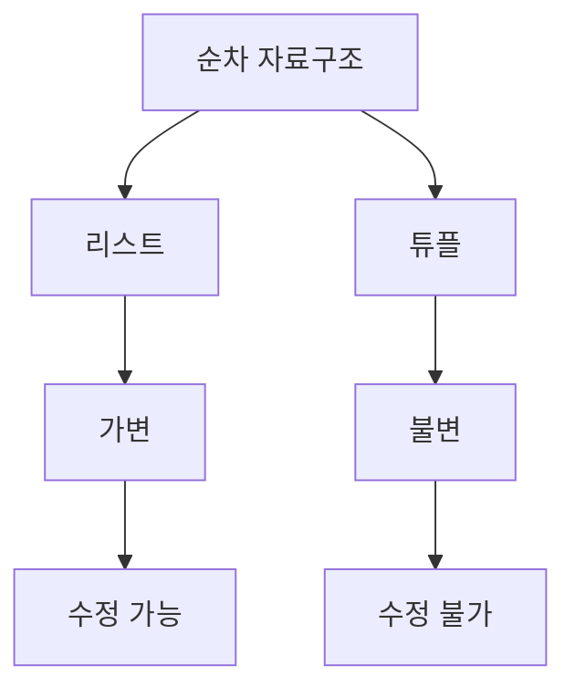

# Python 리스트와 튜플(Lists and Tuples) 완벽 가이드 📚

## 목차 📑
1. [리스트와 튜플 개요](#리스트와-튜플-개요)
2. [리스트 다루기](#리스트-다루기)
3. [튜플 다루기](#튜플-다루기)
4. [리스트와 튜플의 차이점](#리스트와-튜플의-차이점)
5. [고급 활용](#고급-활용)
6. [실전 예제](#실전-예제)
7. [성능과 최적화](#성능과-최적화)
8. [연습 문제](#연습-문제)

## 리스트와 튜플 개요 🎯



### 기본 특성
리스트와 튜플은 Python에서 가장 기본적인 데이터 구조입니다. 둘 다 여러 데이터를 순서대로 저장할 수 있지만, 중요한 차이점이 있습니다.

## 리스트 다루기 📝

### 리스트 생성
```python
# 빈 리스트 생성
빈_리스트 = []
리스트 = list()

# 값이 있는 리스트 생성
숫자 = [1, 2, 3, 4, 5]
문자열 = ["사과", "바나나", "오렌지"]
혼합 = [1, "파이썬", 3.14, True]
```

### 리스트 조작

```python
# 요소 추가
과일 = ["사과", "바나나"]
과일.append("오렌지")    # 끝에 추가
과일.insert(1, "키위")   # 특정 위치에 추가

# 요소 제거
과일.remove("바나나")    # 값으로 제거
삭제된_값 = 과일.pop()   # 마지막 요소 제거 및 반환
del 과일[0]             # 인덱스로 제거

# 리스트 수정
numbers = [1, 2, 3, 4, 5]
numbers[0] = 10        # 인덱스로 접근하여 수정
```

### 리스트 슬라이싱
```python
numbers = [0, 1, 2, 3, 4, 5, 6, 7, 8, 9]

처음_3개 = numbers[:3]     # [0, 1, 2]
중간_부분 = numbers[3:7]   # [3, 4, 5, 6]
마지막_3개 = numbers[-3:]  # [7, 8, 9]
간격_2 = numbers[::2]      # [0, 2, 4, 6, 8]
```

## 튜플 다루기 📌

### 튜플 생성
```python
# 빈 튜플 생성
빈_튜플 = ()
튜플 = tuple()

# 값이 있는 튜플 생성
좌표 = (3, 4)
RGB = (255, 128, 0)
단일_요소 = (42,)  # 쉼표 필수
```

### 튜플 활용
```python
# 튜플 언패킹
x, y = 좌표
r, g, b = RGB

# 튜플을 리스트로 변환
리스트 = list(좌표)

# 리스트를 튜플로 변환
새_튜플 = tuple(리스트)
```

## 리스트와 튜플의 차이점 🔄

```mermaid
graph LR
    A[데이터 구조 비교] --> B[리스트]
    A --> C[튜플]
    B --> D[가변성]
    B --> E[대괄호 []로 생성]
    C --> F[불변성]
    C --> G[괄호 ()로 생성]
```

### 주요 차이점
1. 가변성 vs 불변성
   ```python
   # 리스트는 수정 가능
   리스트 = [1, 2, 3]
   리스트[0] = 10  # 가능
   
   # 튜플은 수정 불가능
   튜플 = (1, 2, 3)
   튜플[0] = 10  # TypeError 발생
   ```

2. 메모리 사용과 성능
   ```python
   import sys
   
   리스트 = [1, 2, 3]
   튜플 = (1, 2, 3)
   
   print(f"리스트 크기: {sys.getsizeof(리스트)} 바이트")
   print(f"튜플 크기: {sys.getsizeof(튜플)} 바이트")
   ```

## 고급 활용 🚀

### 리스트 컴프리헨션
```python
# 기본 형태
제곱 = [x**2 for x in range(10)]

# 조건문 포함
짝수_제곱 = [x**2 for x in range(10) if x % 2 == 0]

# 중첩 반복문
좌표 = [(x, y) for x in range(3) for y in range(3)]
```

### 리스트와 튜플의 메서드
```python
# 리스트 메서드
numbers = [3, 1, 4, 1, 5, 9, 2, 6, 5, 3]
numbers.sort()         # 정렬
numbers.reverse()      # 순서 뒤집기
count = numbers.count(5)  # 특정 값 개수 세기
index = numbers.index(4)  # 특정 값의 인덱스 찾기

# 튜플 메서드
coords = (3, 1, 4, 1, 5, 9, 2, 6, 5, 3)
count = coords.count(5)   # 특정 값 개수 세기
index = coords.index(4)   # 특정 값의 인덱스 찾기
```

## 실전 예제 💡

### 학생 성적 관리 시스템
```python
# 학생 정보를 튜플로 저장 (변경되지 않는 정보)
학생1 = ("김철수", "20230001", "컴퓨터공학")
학생2 = ("이영희", "20230002", "전자공학")

# 성적을 리스트로 저장 (변경되는 정보)
성적1 = [95, 88, 92]
성적2 = [89, 91, 87]

# 학생 정보와 성적을 함께 처리
def 성적_평균_계산(학생, 성적):
    이름, 학번, 학과 = 학생
    평균 = sum(성적) / len(성적)
    return f"{이름}({학번}) - 평균: {평균:.1f}"

print(성적_평균_계산(학생1, 성적1))
```

### 좌표 처리 시스템
```python
def 거리_계산(point1, point2):
    """두 점 사이의 거리를 계산합니다."""
    x1, y1 = point1
    x2, y2 = point2
    return ((x2-x1)**2 + (y2-y1)**2)**0.5

# 여러 좌표를 리스트에 저장
좌표들 = [(0, 0), (3, 4), (6, 8)]

# 모든 좌표 쌍 사이의 거리 계산
for i in range(len(좌표들)-1):
    for j in range(i+1, len(좌표들)):
        거리 = 거리_계산(좌표들[i], 좌표들[j])
        print(f"좌표 {좌표들[i]}와 {좌표들[j]} 사이의 거리: {거리:.2f}")
```

## 성능과 최적화 ⚡

### 메모리 효율성
```python
# 대용량 데이터 처리 시 제너레이터 활용
def 큰_리스트_생성():
    return [i**2 for i in range(1000000)]  # 메모리 많이 사용

def 제너레이터_활용():
    return (i**2 for i in range(1000000))  # 메모리 효율적
```

### 연산 최적화
```python
import time

# 리스트 연산 최적화
def 효율적인_리스트_처리():
    # append 사용 (효율적)
    start = time.time()
    리스트1 = []
    for i in range(10000):
        리스트1.append(i)
    
    # + 연산자 사용 (비효율적)
    리스트2 = []
    for i in range(10000):
        리스트2 = 리스트2 + [i]
```

## 연습 문제 📝

1. 리스트 조작 기초
```python
def 리스트_처리(numbers):
    """
    주어진 숫자 리스트에 대해:
    1. 모든 숫자의 제곱값을 계산
    2. 짝수만 필터링
    3. 결과 리스트 정렬
    """
    # 여기에 코드를 작성하세요
    pass
```

2. 튜플 활용
```python
def 점수_분석(scores):
    """
    점수 튜플에서 최고점, 최저점, 평균을 반환
    """
    # 여기에 코드를 작성하세요
    pass
```

3. 리스트와 튜플 변환
```python
def 좌표_변환(points_list):
    """
    좌표 리스트를 받아서 각 좌표의 x, y값을 바꾼 튜플 리스트 반환
    예: [(1,2), (3,4)] -> [(2,1), (4,3)]
    """
    # 여기에 코드를 작성하세요
    pass
```

---
📌 **참고사항**
- 리스트는 변경 가능한 데이터를 다룰 때 사용합니다.
- 튜플은 변경되지 않는 데이터를 다룰 때 사용합니다.
- 리스트 컴프리헨션을 활용하면 코드를 간결하게 작성할 수 있습니다.
- 대용량 데이터를 다룰 때는 메모리 사용을 고려해야 합니다.