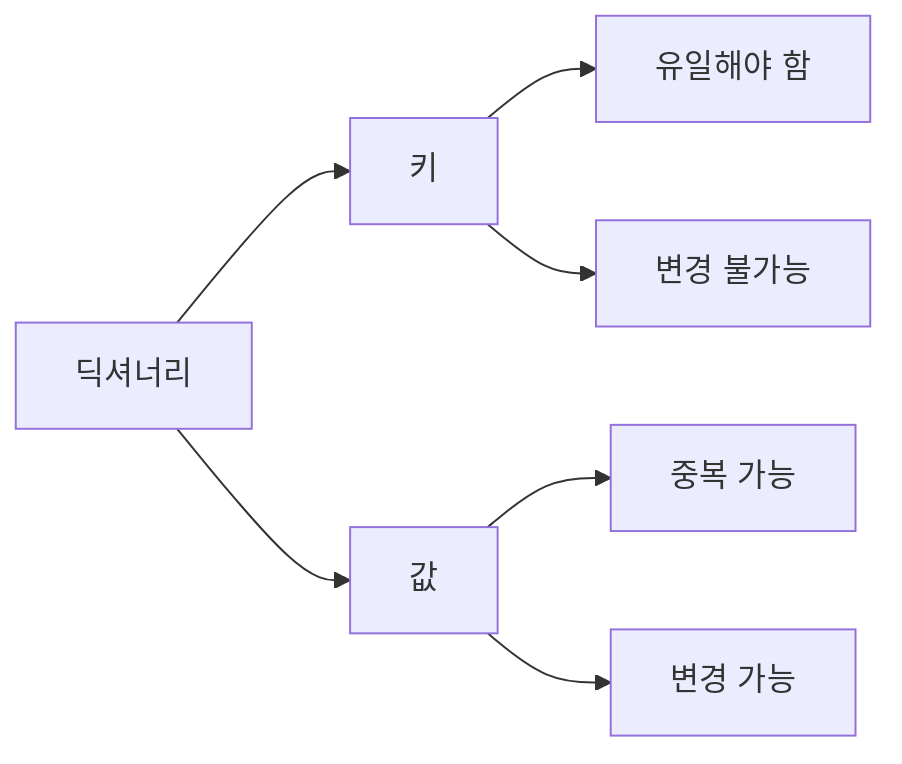
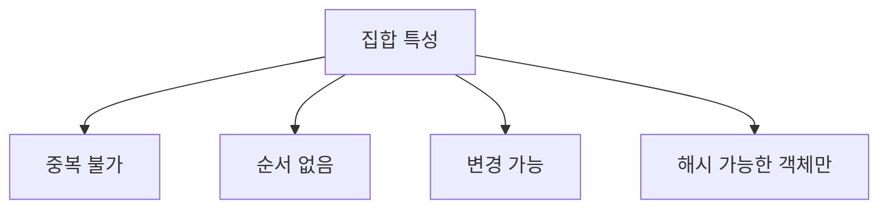
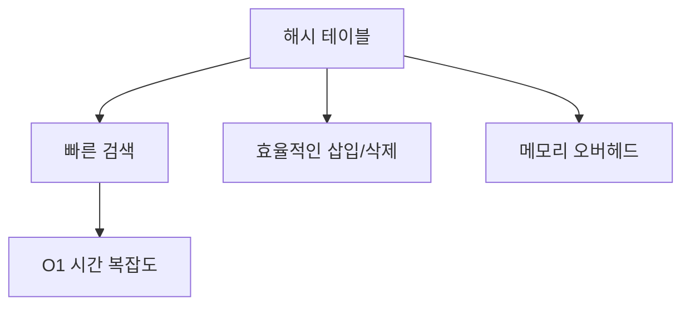

# Python 딕셔너리와 집합(Dictionaries and Sets) 완벽 가이드 📚

## 목차 📑
1. [딕셔너리 기초](#딕셔너리-기초)
2. [집합 기초](#집합-기초)
3. [고급 활용법](#고급-활용법)
4. [성능과 내부 구조](#성능과-내부-구조)
5. [실전 활용 예제](#실전-활용-예제)
6. [모범 사례](#모범-사례)
7. [자주 하는 실수](#자주-하는-실수)
8. [연습 문제](#연습-문제)

## 딕셔너리 기초 🗂️

딕셔너리는 키-값 쌍을 저장하는 자료구조입니다. 실생활의 사전처럼, 특정 키를 통해 값을 빠르게 찾을 수 있습니다.



### 딕셔너리 생성과 기본 조작
```python
# 딕셔너리 생성
학생 = {
    "이름": "김파이썬",
    "나이": 20,
    "전공": "컴퓨터공학"
}

# 값 접근
print(학생["이름"])  # 김파이썬

# 값 수정
학생["나이"] = 21

# 새로운 키-값 추가
학생["학년"] = 2

# 키-값 삭제
del 학생["전공"]

# 안전한 값 접근
전공 = 학생.get("전공", "미정")  # 키가 없을 때 기본값 반환
```

### 딕셔너리 메서드
```python
# 모든 키 가져오기
키들 = 학생.keys()

# 모든 값 가져오기
값들 = 학생.values()

# 모든 키-값 쌍 가져오기
아이템들 = 학생.items()

# 키-값 쌍 추가/수정
학생.update({"학번": "2023001", "나이": 22})
```

## 집합 기초 🎯

집합은 중복되지 않는 요소들의 모임입니다. 수학의 집합 개념과 동일하며, 순서가 없습니다.



### 집합 생성과 기본 조작
```python
# 집합 생성
과일 = {"사과", "바나나", "오렌지"}
숫자 = set([1, 2, 2, 3, 3, 4])  # 중복은 자동 제거됨

# 요소 추가
과일.add("키위")

# 요소 제거
과일.remove("바나나")  # 요소가 없으면 에러
과일.discard("멜론")   # 요소가 없어도 에러 없음

# 집합 연산
A = {1, 2, 3, 4}
B = {3, 4, 5, 6}

합집합 = A | B  # 또는 A.union(B)
교집합 = A & B  # 또는 A.intersection(B)
차집합 = A - B  # 또는 A.difference(B)
대칭차집합 = A ^ B  # 또는 A.symmetric_difference(B)
```

## 고급 활용법 🚀

### 딕셔너리 컴프리헨션
```python
# 제곱 딕셔너리 생성
제곱 = {x: x**2 for x in range(5)}
# 결과: {0: 0, 1: 1, 2: 4, 3: 9, 4: 16}

# 조건부 딕셔너리 생성
짝수_제곱 = {x: x**2 for x in range(10) if x % 2 == 0}
```

### 중첩 딕셔너리
```python
학교 = {
    "1학년": {
        "A반": {"학생수": 30, "담임": "김교사"},
        "B반": {"학생수": 28, "담임": "이교사"}
    },
    "2학년": {
        "A반": {"학생수": 32, "담임": "박교사"},
        "B반": {"학생수": 30, "담임": "최교사"}
    }
}

# 중첩 딕셔너리 접근
print(학교["1학년"]["A반"]["담임"])  # 김교사
```

### 집합 컴프리헨션
```python
# 짝수 집합 생성
짝수 = {x for x in range(10) if x % 2 == 0}

# 문자열에서 고유 문자 추출
문자열 = "Hello, World!"
고유문자 = {char.lower() for char in 문자열 if char.isalpha()}
```

## 성능과 내부 구조 ⚡



### 시간 복잡도 비교
```python
# 딕셔너리/집합 연산의 시간 복잡도
def 성능_테스트():
    큰_리스트 = list(range(1000000))
    큰_집합 = set(큰_리스트)
    큰_딕셔너리 = {x: x for x in 큰_리스트}
    
    # O(1) 검색
    값_존재 = 500000 in 큰_집합  # 매우 빠름
    값_찾기 = 큰_딕셔너리[500000]  # 매우 빠름
    
    # O(n) 검색
    리스트_검색 = 500000 in 큰_리스트  # 상대적으로 느림
```

## 실전 활용 예제 💡

### 단어 빈도 계산기
```python
def 단어_빈도_계산(텍스트):
    단어들 = 텍스트.lower().split()
    빈도 = {}
    
    for 단어 in 단어들:
        빈도[단어] = 빈도.get(단어, 0) + 1
    
    return 빈도

텍스트 = "파이썬 프로그래밍 파이썬 코딩 프로그래밍"
결과 = 단어_빈도_계산(텍스트)
print(결과)
```

### 학생 성적 관리 시스템
```python
class 성적관리:
    def __init__(self):
        self.성적_db = {}
        self.과목_집합 = set()
    
    def 성적_입력(self, 학번, 과목, 점수):
        if 학번 not in self.성적_db:
            self.성적_db[학번] = {}
        self.성적_db[학번][과목] = 점수
        self.과목_집합.add(과목)
    
    def 평균_계산(self, 학번):
        if 학번 in self.성적_db:
            점수들 = self.성적_db[학번].values()
            return sum(점수들) / len(점수들)
        return 0

# 사용 예시
성적_시스템 = 성적관리()
성적_시스템.성적_입력("2023001", "수학", 90)
성적_시스템.성적_입력("2023001", "영어", 85)
평균 = 성적_시스템.평균_계산("2023001")
```

## 모범 사례 🌟

### 딕셔너리 사용 시 주의사항
```python
# 기본값 처리
def 안전한_접근(딕셔너리, 키, 기본값=None):
    return 딕셔너리.get(키, 기본값)

# 중첩 딕셔너리 안전하게 접근
def 중첩_접근(딕셔너리, 키_경로, 기본값=None):
    현재 = 딕셔너리
    for 키 in 키_경로:
        if isinstance(현재, dict):
            현재 = 현재.get(키, 기본값)
        else:
            return 기본값
    return 현재
```

### 집합 활용 최적화
```python
def 효율적인_중복_제거(리스트):
    return list(set(리스트))  # 중복 제거 후 다시 리스트로

def 효율적인_멤버십_테스트(검색할_항목들, 데이터):
    데이터_집합 = set(데이터)  # 한 번만 집합으로 변환
    return [항목 in 데이터_집합 for 항목 in 검색할_항목들]
```

## 자주 하는 실수 ⚠️

### 딕셔너리 실수
```python
# 키 오류 처리 미흡
def 잘못된_방법():
    사전 = {"a": 1}
    값 = 사전["존재하지_않는_키"]  # KeyError 발생

def 올바른_방법():
    사전 = {"a": 1}
    값 = 사전.get("존재하지_않는_키", "기본값")
```

### 집합 실수
```python
# 변경 가능한 객체를 집합에 추가 시도
def 잘못된_집합_사용():
    리스트_집합 = {[1, 2], [3, 4]}  # TypeError 발생

def 올바른_집합_사용():
    튜플_집합 = {(1, 2), (3, 4)}  # 정상 작동
```

## 연습 문제 📝

1. 문자열에서 각 문자의 빈도수를 계산하는 함수를 작성하세요:
```python
def 문자_빈도_계산(문자열):
    """
    주어진 문자열에서 각 문자의 등장 횟수를 계산하여 딕셔너리로 반환
    대소문자를 구분하지 않음
    """
    # 여기에 코드를 작성하세요
    pass
```

2. 두 리스트에서 중복되는 요소만 추출하는 함수를 작성하세요:
```python
def 중복_요소_찾기(리스트1, 리스트2):
    """
    두 리스트에서 중복되는 요소를 리스트로 반환
    반환되는 리스트는 중복 없이 정렬되어 있어야 함
    """
    # 여기에 코드를 작성하세요
    pass
```

3. 학생들의 성적을 관리하는 클래스를 작성하세요:
```python
class 성적관리시스템:
    """
    학생들의 과목별 성적을 관리하는 시스템
    - 성적 입력/수정/삭제
    - 학생별 평균 성적 계산
    - 과목별 평균 성적 계산
    기능 구현
    """
    # 여기에 코드를 작성하세요
    pass
```

---
📌 **참고사항**
- 딕셔너리는 키-값 쌍을 저장할 때 사용합니다.
- 집합은 중복 없는 요소들을 다룰 때 사용합니다.
- 해시 테이블을 기반으로 하므로 검색이 매우 빠릅니다.
- 적절한 자료구조 선택이 프로그램의 성능을 좌우할 수 있습니다.