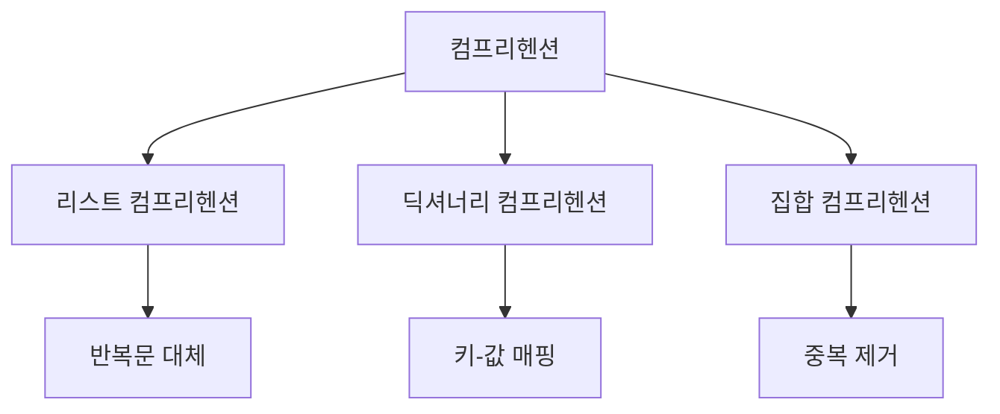

# Python 컴프리헨션(Comprehensions) 완벽 가이드 🎯

## 목차 📑
1. [컴프리헨션이란?](#컴프리헨션이란)
2. [리스트 컴프리헨션](#리스트-컴프리헨션)
3. [딕셔너리 컴프리헨션](#딕셔너리-컴프리헨션)
4. [집합 컴프리헨션](#집합-컴프리헨션)
5. [성능과 가독성](#성능과-가독성)
6. [실전 활용](#실전-활용)
7. [모범 사례](#모범-사례)
8. [연습 문제](#연습-문제)

## 컴프리헨션이란? 🤔

컴프리헨션은 기존 시퀀스로부터 새로운 시퀀스를 생성하는 Python의 강력한 기능입니다. 간결하고 가독성 있는 코드를 작성할 수 있게 해줍니다.



### 기본 구조
```python
# 기본 문법
[표현식 for 항목 in 반복가능객체 if 조건식]
```

## 리스트 컴프리헨션 📝

### 기본 사용법
```python
# 기존의 for 루프
숫자들 = []
for i in range(10):
    숫자들.append(i * 2)

# 리스트 컴프리헨션 사용
숫자들 = [i * 2 for i in range(10)]

# 조건 추가
짝수들 = [i for i in range(10) if i % 2 == 0]
```

### 중첩 반복문
```python
# 기존의 중첩 for 루프
좌표들 = []
for x in range(3):
    for y in range(3):
        좌표들.append((x, y))

# 리스트 컴프리헨션 사용
좌표들 = [(x, y) for x in range(3) for y in range(3)]

# 조건부 중첩
행렬 = [[1, 2, 3], [4, 5, 6], [7, 8, 9]]
평탄화 = [요소 for 행 in 행렬 for 요소 in 행]
```

## 딕셔너리 컴프리헨션 🗂️

### 기본 사용법
```python
# 기존의 for 루프
제곱_딕셔너리 = {}
for i in range(5):
    제곱_딕셔너리[i] = i ** 2

# 딕셔너리 컴프리헨션 사용
제곱_딕셔너리 = {i: i ** 2 for i in range(5)}

# 조건 추가
짝수_제곱 = {i: i ** 2 for i in range(10) if i % 2 == 0}
```

### 키-값 변환
```python
# 기존 딕셔너리의 키-값 변환
점수 = {'철수': 85, '영희': 92, '민수': 78}
합격자 = {이름: '합격' if 점수 >= 80 else '불합격' 
          for 이름, 점수 in 점수.items()}
```

## 집합 컴프리헨션 🎯

### 기본 사용법
```python
# 기존의 for 루프
고유_숫자 = set()
for i in range(10):
    고유_숫자.add(i * 2)

# 집합 컴프리헨션 사용
고유_숫자 = {i * 2 for i in range(10)}

# 문자열에서 고유 문자 추출
문자열 = "Hello, World!"
고유_문자 = {char.lower() for char in 문자열 if char.isalpha()}
```

## 성능과 가독성 ⚡

### 성능 비교
```python
import time

def 성능_테스트(n):
    # for 루프 방식
    시작 = time.time()
    결과1 = []
    for i in range(n):
        if i % 2 == 0:
            결과1.append(i ** 2)
    루프_시간 = time.time() - 시작

    # 컴프리헨션 방식
    시작 = time.time()
    결과2 = [i ** 2 for i in range(n) if i % 2 == 0]
    컴프리헨션_시간 = time.time() - 시작

    return 루프_시간, 컴프리헨션_시간

# 테스트 실행
루프_시간, 컴프리헨션_시간 = 성능_테스트(1000000)
print(f"for 루프 시간: {루프_시간:.4f}초")
print(f"컴프리헨션 시간: {컴프리헨션_시간:.4f}초")
```

### 가독성 고려사항
```python
# 너무 복잡한 컴프리헨션 (피해야 할 예)
복잡한_예 = [[i * j for j in range(i)] for i in range(5) if i % 2 == 0]

# 더 나은 방법
def 행렬_생성(n):
    결과 = []
    for i in range(n):
        if i % 2 == 0:
            행 = [i * j for j in range(i)]
            결과.append(행)
    return 결과
```

## 실전 활용 💡

### 데이터 처리
```python
# CSV 데이터 처리
데이터 = [
    "이름,나이,성별",
    "김철수,20,남",
    "이영희,25,여",
    "박민수,22,남"
]

# 헤더와 데이터 분리
헤더 = 데이터[0].split(',')
레코드 = [dict(zip(헤더, 행.split(','))) for 행 in 데이터[1:]]

# 나이 기준 필터링
성인 = [사람 for 사람 in 레코드 if int(사람['나이']) >= 20]
```

### 파일 처리
```python
import os

# 특정 확장자 파일 찾기
def 파일_찾기(디렉토리, 확장자):
    return [
        파일 
        for 파일 in os.listdir(디렉토리)
        if 파일.endswith(확장자)
    ]

# 파일 크기 매핑
def 파일_크기_매핑(디렉토리):
    return {
        파일: os.path.getsize(os.path.join(디렉토리, 파일))
        for 파일 in os.listdir(디렉토리)
        if os.path.isfile(os.path.join(디렉토리, 파일))
    }
```

## 모범 사례 🌟

### 가독성을 위한 지침
```python
# 1. 단순한 표현식 사용
좋은_예 = [x * 2 for x in range(10)]

# 2. 복잡한 조건은 함수로 분리
def 복잡한_조건(x):
    return x > 5 and x % 2 == 0 and x < 15

좋은_예 = [x for x in range(20) if 복잡한_조건(x)]

# 3. 중첩은 최소화
행렬 = [[1, 2, 3], [4, 5, 6], [7, 8, 9]]
좋은_예 = [
    요소 
    for 행 in 행렬 
    for 요소 in 행 
    if 요소 % 2 == 0
]
```

### 성능 최적화
```python
# 메모리 효율적인 사용
def 대용량_처리(n):
    # 한 번에 모든 데이터를 메모리에 올리지 않음
    return (x ** 2 for x in range(n))  # 제너레이터 표현식

# 필요한 만큼만 계산
결과 = list(x for x in 대용량_처리(1000000) if x < 100)
```

## 연습 문제 📝

1. 숫자 처리
```python
def 제곱_짝수_생성(n):
    """
    1부터 n까지의 숫자 중 짝수의 제곱을 리스트로 반환
    """
    # 여기에 코드를 작성하세요
    pass
```

2. 문자열 처리
```python
def 단어_길이_매핑(문장):
    """
    문장에서 각 단어의 길이를 매핑한 딕셔너리 반환
    """
    # 여기에 코드를 작성하세요
    pass
```

3. 중첩 데이터 처리
```python
def 성적_처리(학생_성적):
    """
    학생들의 성적 중 평균이 80점 이상인 학생의 
    이름과 평균 점수를 딕셔너리로 반환
    """
    # 여기에 코드를 작성하세요
    pass
```

---
📌 **참고사항**
- 컴프리헨션은 코드를 간결하게 만들어주는 강력한 도구입니다.
- 너무 복잡한 컴프리헨션은 가독성을 해칠 수 있습니다.
- 성능과 가독성의 균형을 고려하여 사용하세요.
- 대용량 데이터 처리 시에는 메모리 사용을 고려해야 합니다.