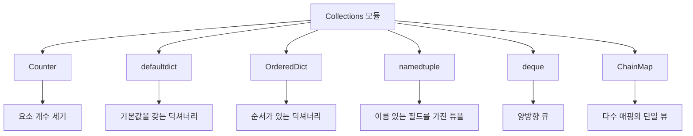

# Python Collections 모듈 완벽 가이드 📚

## 목차 📑
1. [Collections 모듈 소개](#collections-모듈-소개)
2. [Counter](#counter)
3. [defaultdict](#defaultdict)
4. [OrderedDict](#ordereddict)
5. [namedtuple](#namedtuple)
6. [deque](#deque)
7. [ChainMap](#chainmap)
8. [실전 활용](#실전-활용)

## Collections 모듈 소개 🌟

Collections 모듈은 파이썬의 내장 컨테이너 타입(dict, list, set, tuple)을 확장하는 특수 컨테이너 데이터타입을 제공합니다.



## Counter 🔢

Counter는 해시 가능한 객체를 세는 데 사용되는 딕셔너리의 하위 클래스입니다.

```python
from collections import Counter

# 기본 사용법
텍스트 = "Hello, Python Programming!"
문자_카운터 = Counter(텍스트.lower())
print(문자_카운터)  # Counter({'l': 2, 'o': 2, 'm': 2, 'g': 2, ...})

# 가장 흔한 요소 찾기
print(문자_카운터.most_common(3))  # 상위 3개 요소 출력

# 카운터 연산
카운터1 = Counter(['a', 'b', 'c', 'a'])
카운터2 = Counter(['b', 'b', 'c'])
print(카운터1 + 카운터2)  # 합집합
print(카운터1 - 카운터2)  # 차집합
```

## defaultdict 🗂️

defaultdict는 존재하지 않는 키에 접근할 때 자동으로 기본값을 생성하는 딕셔너리입니다.

```python
from collections import defaultdict

# 리스트를 기본값으로 사용
그룹화 = defaultdict(list)
데이터 = [("A", 1), ("B", 2), ("A", 3), ("B", 4)]

for 키, 값 in 데이터:
    그룹화[키].append(값)

print(그룹화)  # defaultdict(<class 'list'>, {'A': [1, 3], 'B': [2, 4]})

# int를 기본값으로 사용 (카운터 구현)
단어_수 = defaultdict(int)
텍스트 = "apple banana apple cherry banana"
for 단어 in 텍스트.split():
    단어_수[단어] += 1

print(단어_수)  # defaultdict(<class 'int'>, {'apple': 2, 'banana': 2, 'cherry': 1})
```

## OrderedDict 📝

Python 3.7 이후로는 일반 딕셔너리도 삽입 순서를 유지하지만, OrderedDict는 여전히 특별한 기능을 제공합니다.

```python
from collections import OrderedDict

# 기본 사용법
순서_딕셔너리 = OrderedDict()
순서_딕셔너리['a'] = 1
순서_딕셔너리['b'] = 2
순서_딕셔너리['c'] = 3

# 순서 비교
딕셔너리1 = OrderedDict({'a': 1, 'b': 2})
딕셔너리2 = OrderedDict({'b': 2, 'a': 1})
print(딕셔너리1 == 딕셔너리2)  # False (순서가 다름)
```

## namedtuple 🏷️

namedtuple은 이름이 있는 필드를 가진 튜플의 서브클래스를 만듭니다.

```python
from collections import namedtuple

# 학생 정보를 위한 namedtuple 정의
학생 = namedtuple('학생', ['이름', '나이', '학번'])

# 인스턴스 생성
학생1 = 학생('김파이썬', 20, '2023001')
print(학생1.이름)    # 김파이썬
print(학생1.나이)    # 20
print(학생1[2])     # 2023001

# 딕셔너리로 변환
학생_정보 = 학생1._asdict()
print(학생_정보)  # {'이름': '김파이썬', '나이': 20, '학번': '2023001'}
```

## deque 🔄

deque(double-ended queue)는 양쪽 끝에서 빠르게 추가/삭제가 가능한 컬렉션입니다.

```python
from collections import deque

# 기본 사용법
큐 = deque([1, 2, 3, 4, 5])
큐.append(6)        # 오른쪽 끝에 추가
큐.appendleft(0)    # 왼쪽 끝에 추가
print(큐)           # deque([0, 1, 2, 3, 4, 5, 6])

# 회전
큐.rotate(2)        # 오른쪽으로 2칸 회전
print(큐)           # deque([5, 6, 0, 1, 2, 3, 4])
큐.rotate(-2)       # 왼쪽으로 2칸 회전
print(큐)           # deque([0, 1, 2, 3, 4, 5, 6])
```

## ChainMap 🔗

ChainMap은 여러 딕셔너리나 매핑을 함께 검색할 수 있게 해주는 클래스입니다.

```python
from collections import ChainMap

# 기본 설정과 사용자 설정
기본설정 = {'색상': '파랑', '크기': '중간'}
사용자설정 = {'크기': '큼'}

# ChainMap 생성 (사용자설정이 우선)
설정 = ChainMap(사용자설정, 기본설정)
print(설정['크기'])   # '큼' (사용자설정)
print(설정['색상'])   # '파랑' (기본설정)

# 새로운 설정 추가
임시설정 = {'색상': '빨강', '투명도': 0.5}
새설정 = 설정.new_child(임시설정)
print(새설정['색상'])  # '빨강'
```

## 실전 활용 💡

### 로그 분석기
```python
from collections import Counter, defaultdict
from datetime import datetime

class 로그분석기:
    def __init__(self):
        self.요청_카운터 = Counter()
        self.시간별_요청 = defaultdict(int)
        self.사용자_접속기록 = defaultdict(list)

    def 로그_처리(self, 로그_라인):
        시간, 사용자, 요청 = self.로그_파싱(로그_라인)
        self.요청_카운터[요청] += 1
        self.시간별_요청[시간.hour] += 1
        self.사용자_접속기록[사용자].append(시간)

    def 통계_출력(self):
        print("가장 많은 요청:", self.요청_카운터.most_common(3))
        print("시간대별 요청:", dict(self.시간별_요청))
```

### 설정 관리자
```python
from collections import ChainMap, OrderedDict

class 설정관리자:
    def __init__(self):
        self.시스템_설정 = {
            'debug': False,
            'cache_size': 1000,
            'timeout': 30
        }
        self.사용자_설정 = {}
        self.임시_설정 = {}
        self.설정 = ChainMap(self.임시_설정, self.사용자_설정, self.시스템_설정)

    def 설정_업데이트(self, **kwargs):
        self.사용자_설정.update(kwargs)

    def 임시_설정_적용(self, **kwargs):
        self.임시_설정.update(kwargs)

    def 임시_설정_초기화(self):
        self.임시_설정.clear()
```

### 작업 큐
```python
from collections import deque
from datetime import datetime

class 작업큐:
    def __init__(self, 최대크기=100):
        self.작업목록 = deque(maxlen=최대크기)
        self.처리된_작업 = deque(maxlen=최대크기)

    def 작업_추가(self, 작업):
        self.작업목록.append((작업, datetime.now()))

    def 작업_처리(self):
        if self.작업목록:
            작업, 시간 = self.작업목록.popleft()
            # 작업 처리 로직
            self.처리된_작업.append((작업, 시간, datetime.now()))
            return 작업
        return None
```

## 모범 사례 🌟

### Counter 활용 최적화
```python
def 효율적인_단어_수_계산(텍스트):
    # 직접 딕셔너리 사용 대신 Counter 활용
    단어_수 = Counter(텍스트.split())
    return 단어_수.most_common()
```

### defaultdict 활용
```python
def 효율적인_그룹화(데이터_리스트, 키_함수):
    # 예외 처리 없이 깔끔한 그룹화
    결과 = defaultdict(list)
    for 항목 in 데이터_리스트:
        결과[키_함수(항목)].append(항목)
    return dict(결과)
```

### deque를 활용한 성능 최적화
```python
def 최근_항목_관리(최대_개수):
    # 리스트 대신 deque 사용으로 성능 향상
    return deque(maxlen=최대_개수)
```

---
📌 **참고사항**
- Collections 모듈은 데이터 구조를 더 효율적으로 다룰 수 있게 해줍니다.
- 각 컬렉션 타입의 특성을 이해하고 적절한 상황에 활용하세요.
- 성능이 중요한 경우 내장 타입 대신 특수화된 컬렉션을 사용하는 것이 좋습니다.
- 코드의 가독성과 유지보수성을 고려하여 적절한 컬렉션을 선택하세요.