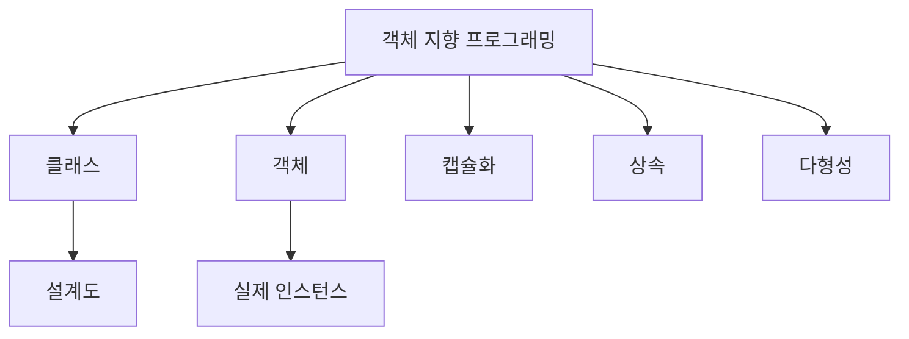

# Python 클래스와 객체(Classes and Objects) 완벽 가이드 🎯

## 목차 📑
1. [객체 지향 프로그래밍 개요](#객체-지향-프로그래밍-개요)
2. [클래스 정의와 객체 생성](#클래스-정의와-객체-생성)
3. [속성과 메서드](#속성과-메서드)
4. [생성자와 소멸자](#생성자와-소멸자)
5. [접근 제어](#접근-제어)
6. [클래스 메서드와 정적 메서드](#클래스-메서드와-정적-메서드)
7. [프로퍼티](#프로퍼티)
8. [실전 예제](#실전-예제)

## 객체 지향 프로그래밍 개요 🌟

객체 지향 프로그래밍(OOP)은 프로그램을 객체들의 모임으로 보는 프로그래밍 패러다임입니다.



## 클래스 정의와 객체 생성 📝

### 기본 클래스 정의
```python
class 학생:
    """
    학생 정보를 저장하고 관리하는 클래스
    """
    # 클래스 변수
    학교 = "파이썬 고등학교"
    
    # 초기화 메서드(생성자)
    def __init__(self, 이름, 학년):
        # 인스턴스 변수
        self.이름 = 이름
        self.학년 = 학년
        self.성적 = {}
    
    # 인스턴스 메서드
    def 성적_입력(self, 과목, 점수):
        self.성적[과목] = 점수
    
    def 정보_출력(self):
        return f"{self.학교} {self.학년}학년 {self.이름}"
```

### 객체 생성과 사용
```python
# 객체 생성
학생1 = 학생("김파이썬", 1)
학생2 = 학생("이자바", 2)

# 메서드 호출
학생1.성적_입력("수학", 95)
print(학생1.정보_출력())
```

## 속성과 메서드 🔧

### 인스턴스 변수와 클래스 변수
```python
class 자동차:
    # 클래스 변수
    제조사 = "현대"
    생산된_차량 = 0
    
    def __init__(self, 모델, 색상):
        # 인스턴스 변수
        self.모델 = 모델
        self.색상 = 색상
        자동차.생산된_차량 += 1
    
    @classmethod
    def 총_생산량(cls):
        return f"총 생산된 차량: {cls.생산된_차량}대"
```

### 메서드 종류
```python
class 계산기:
    def __init__(self):
        self.값 = 0
    
    # 인스턴스 메서드
    def 더하기(self, x):
        self.값 += x
        return self.값
    
    @classmethod
    def 버전_정보(cls):
        return "계산기 버전 1.0"
    
    @staticmethod
    def 도움말():
        return "이 계산기는 기본적인 계산 기능을 제공합니다."
```

## 생성자와 소멸자 🏗️

### 다양한 생성자 패턴
```python
class 사용자:
    def __init__(self, 이름, 나이=None, 이메일=None):
        self.이름 = 이름
        self.나이 = 나이
        self.이메일 = 이메일
    
    @classmethod
    def 이메일로_생성(cls, 이메일):
        이름 = 이메일.split('@')[0]
        return cls(이름=이름, 이메일=이메일)
    
    def __del__(self):
        print(f"{self.이름} 사용자 인스턴스가 제거됨")
```

## 접근 제어 🔒

### private과 protected 멤버
```python
class 은행계좌:
    def __init__(self, 계좌번호, 잔액):
        self._계좌번호 = 계좌번호  # protected
        self.__잔액 = 잔액      # private
    
    def 입금(self, 금액):
        if 금액 > 0:
            self.__잔액 += 금액
            return True
        return False
    
    def 잔액조회(self):
        return self.__잔액
```

## 클래스 메서드와 정적 메서드 ⚙️

### 메서드 데코레이터 활용
```python
class 날짜:
    def __init__(self, 년, 월, 일):
        self.년 = 년
        self.월 = 월
        self.일 = 일
    
    @classmethod
    def 오늘(cls):
        import datetime
        오늘 = datetime.date.today()
        return cls(오늘.year, 오늘.month, 오늘.day)
    
    @staticmethod
    def 윤년확인(년):
        return 년 % 4 == 0 and (년 % 100 != 0 or 년 % 400 == 0)
```

## 프로퍼티 📊

### getter와 setter 구현
```python
class 직사각형:
    def __init__(self, 가로, 세로):
        self._가로 = 가로
        self._세로 = 세로
    
    @property
    def 넓이(self):
        return self._가로 * self._세로
    
    @property
    def 가로(self):
        return self._가로
    
    @가로.setter
    def 가로(self, 값):
        if 값 > 0:
            self._가로 = 값
        else:
            raise ValueError("가로 길이는 양수여야 합니다")
```

## 실전 예제 💡

### 도서 관리 시스템
```python
class 도서:
    def __init__(self, 제목, 저자, ISBN):
        self.제목 = 제목
        self.저자 = 저자
        self.ISBN = ISBN
        self.대출중 = False

class 도서관:
    def __init__(self):
        self.도서목록 = {}
        self.회원목록 = {}
    
    def 도서_등록(self, 도서):
        self.도서목록[도서.ISBN] = 도서
    
    def 도서_대출(self, ISBN, 회원ID):
        if ISBN in self.도서목록:
            도서 = self.도서목록[ISBN]
            if not 도서.대출중:
                도서.대출중 = True
                return True
        return False
```

### 온라인 쇼핑몰 시스템
```python
class 상품:
    def __init__(self, 이름, 가격, 재고):
        self.이름 = 이름
        self.가격 = 가격
        self._재고 = 재고
    
    @property
    def 재고(self):
        return self._재고
    
    def 재고_감소(self, 수량):
        if self._재고 >= 수량:
            self._재고 -= 수량
            return True
        return False

class 장바구니:
    def __init__(self):
        self.아이템 = {}
    
    def 추가(self, 상품, 수량=1):
        if 상품.재고_감소(수량):
            if 상품.이름 in self.아이템:
                self.아이템[상품.이름] += 수량
            else:
                self.아이템[상품.이름] = 수량
            return True
        return False
    
    def 총액_계산(self):
        return sum(상품.가격 * 수량 
                  for 상품, 수량 in self.아이템.items())
```

### 데이터 검증이 포함된 사용자 클래스
```python
import re

class 사용자계정:
    def __init__(self, 사용자명, 이메일, 비밀번호):
        self.사용자명 = 사용자명
        self.이메일 = 이메일
        self._비밀번호 = None
        self.비밀번호 = 비밀번호  # setter를 통해 설정
    
    @property
    def 이메일(self):
        return self._이메일
    
    @이메일.setter
    def 이메일(self, 값):
        if not re.match(r"[^@]+@[^@]+\.[^@]+", 값):
            raise ValueError("올바른 이메일 형식이 아닙니다")
        self._이메일 = 값
    
    @property
    def 비밀번호(self):
        return self._비밀번호
    
    @비밀번호.setter
    def 비밀번호(self, 값):
        if len(값) < 8:
            raise ValueError("비밀번호는 최소 8자 이상이어야 합니다")
        if not re.search(r"[A-Z]", 값):
            raise ValueError("비밀번호는 최소 하나의 대문자를 포함해야 합니다")
        if not re.search(r"[0-9]", 값):
            raise ValueError("비밀번호는 최소 하나의 숫자를 포함해야 합니다")
        self._비밀번호 = 값
```

## 모범 사례와 주의사항 ✨

### 클래스 설계 원칙
1. 단일 책임 원칙을 따릅니다.
2. 인스턴스 변수는 생성자에서 모두 초기화합니다.
3. private 속성은 신중하게 사용합니다.
4. 메서드 이름은 행동을 나타내는 동사로 시작합니다.

### 일반적인 실수 피하기
```python
class 잘못된예:
    # 클래스 변수를 잘못 사용한 예
    목록 = []  # 모든 인스턴스가 공유
    
    def 추가(self, 항목):
        self.목록.append(항목)  # 클래스 변수를 수정

class 올바른예:
    def __init__(self):
        self.목록 = []  # 인스턴스 변수로 정의
    
    def 추가(self, 항목):
        self.목록.append(항목)
```

---
📌 **참고사항**
- 클래스는 관련된 데이터와 함수를 하나의 단위로 묶어줍니다.
- 인스턴스 변수와 클래스 변수의 차이를 이해하고 적절히 사용하세요.
- 접근 제어를 통해 데이터를 보호하고 캡슐화를 구현하세요.
- 프로퍼티를 활용하여 속성에 대한 접근을 제어하세요.
- 메서드의 종류(인스턴스, 클래스, 정적)를 상황에 맞게 선택하세요.