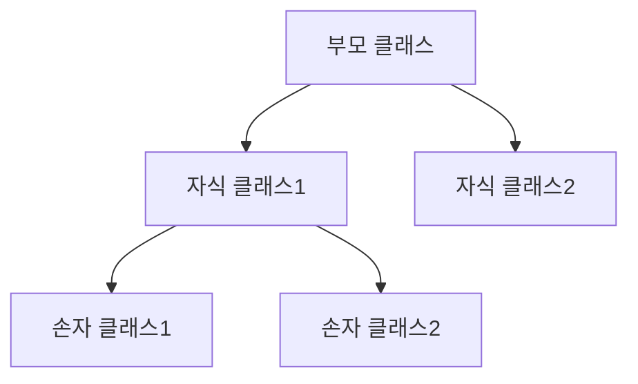

# Python 상속(Inheritance) 완벽 가이드 🌳

## 목차 📑
1. [상속의 개념](#상속의-개념)
2. [기본 상속](#기본-상속)
3. [메서드 오버라이딩](#메서드-오버라이딩)
4. [다중 상속](#다중-상속)
5. [추상 클래스](#추상-클래스)
6. [Mixin 클래스](#mixin-클래스)
7. [실전 예제](#실전-예제)
8. [모범 사례](#모범-사례)

## 상속의 개념 🌟

상속은 기존 클래스의 속성과 메서드를 새로운 클래스가 재사용할 수 있게 해주는 객체 지향 프로그래밍의 핵심 메커니즘입니다.



## 기본 상속 📝

### 단일 상속의 기본 형태
```python
class 동물:
    def __init__(self, 이름):
        self.이름 = 이름
    
    def 소리내기(self):
        pass
    
    def 정보출력(self):
        return f"이름: {self.이름}"

class 강아지(동물):
    def __init__(self, 이름, 품종):
        super().__init__(이름)
        self.품종 = 품종
    
    def 소리내기(self):
        return "멍멍!"
    
    def 정보출력(self):
        기본정보 = super().정보출력()
        return f"{기본정보}, 품종: {self.품종}"

# 사용 예시
댕댕이 = 강아지("멍멍이", "골든리트리버")
print(댕댕이.정보출력())  # 이름: 멍멍이, 품종: 골든리트리버
print(댕댕이.소리내기())  # 멍멍!
```

## 메서드 오버라이딩 🔄

### 부모 클래스 메서드 재정의
```python
class 계좌:
    def __init__(self, 계좌번호, 잔액=0):
        self.계좌번호 = 계좌번호
        self.잔액 = 잔액
    
    def 출금(self, 금액):
        if self.잔액 >= 금액:
            self.잔액 -= 금액
            return True
        return False

class 마이너스통장(계좌):
    def __init__(self, 계좌번호, 한도=-10000):
        super().__init__(계좌번호)
        self.한도 = 한도
    
    def 출금(self, 금액):
        if self.잔액 - 금액 >= self.한도:
            self.잔액 -= 금액
            return True
        return False
```

## 다중 상속 🔗

### 다중 상속과 MRO(Method Resolution Order)
```python
class 비행가능:
    def 비행(self):
        return "날 수 있습니다"

class 수영가능:
    def 수영(self):
        return "수영할 수 있습니다"

class 오리(동물, 비행가능, 수영가능):
    def __init__(self, 이름):
        super().__init__(이름)
    
    def 소리내기(self):
        return "꽥꽥!"

# MRO 확인
print(오리.mro())  # 메서드 해석 순서 출력
```

## 추상 클래스 📋

### 추상 메서드와 추상 클래스 정의
```python
from abc import ABC, abstractmethod

class 도형(ABC):
    @abstractmethod
    def 넓이(self):
        pass
    
    @abstractmethod
    def 둘레(self):
        pass

class 원(도형):
    def __init__(self, 반지름):
        self.반지름 = 반지름
    
    def 넓이(self):
        return 3.14 * self.반지름 ** 2
    
    def 둘레(self):
        return 2 * 3.14 * self.반지름
```

## Mixin 클래스 🧩

### 기능 조합을 위한 Mixin 활용
```python
class 직렬화Mixin:
    def to_json(self):
        import json
        return json.dumps(self.__dict__)
    
    def to_dict(self):
        return self.__dict__

class 로깅Mixin:
    def log(self, message):
        print(f"[LOG] {self.__class__.__name__}: {message}")

class 사용자(직렬화Mixin, 로깅Mixin):
    def __init__(self, 이름, 이메일):
        self.이름 = 이름
        self.이메일 = 이메일
        self.log(f"새로운 사용자 생성: {이름}")
```

## 실전 예제 💡

### 쇼핑몰 상품 시스템
```python
class 상품:
    def __init__(self, 이름, 가격):
        self.이름 = 이름
        self.가격 = 가격
    
    def 할인가격(self):
        return self.가격
    
    def 정보(self):
        return f"{self.이름} - {self.할인가격()}원"

class 할인상품(상품):
    def __init__(self, 이름, 가격, 할인율):
        super().__init__(이름, 가격)
        self.할인율 = 할인율
    
    def 할인가격(self):
        return int(self.가격 * (1 - self.할인율))

class 계절상품(할인상품):
    def __init__(self, 이름, 가격, 계절):
        super().__init__(이름, 가격, 0.2 if 계절 == "겨울" else 0.1)
        self.계절 = 계절
    
    def 정보(self):
        return f"{super().정보()} ({self.계절} 상품)"
```

### 데이터베이스 연결 시스템
```python
class DB연결(ABC):
    @abstractmethod
    def 연결(self):
        pass
    
    @abstractmethod
    def 쿼리실행(self, 쿼리):
        pass
    
    @abstractmethod
    def 연결종료(self):
        pass

class MySQL연결(DB연결):
    def __init__(self, 호스트, 사용자, 비밀번호):
        self.호스트 = 호스트
        self.사용자 = 사용자
        self.비밀번호 = 비밀번호
        self.연결객체 = None
    
    def 연결(self):
        # MySQL 연결 로직
        pass
    
    def 쿼리실행(self, 쿼리):
        if self.연결객체 is None:
            self.연결()
        # 쿼리 실행 로직
        pass
    
    def 연결종료(self):
        if self.연결객체:
            self.연결객체.close()
```

### 게임 캐릭터 시스템
```python
class 캐릭터(ABC):
    def __init__(self, 이름, 체력):
        self.이름 = 이름
        self.체력 = 체력
        self.레벨 = 1
    
    @abstractmethod
    def 공격(self):
        pass
    
    def 레벨업(self):
        self.레벨 += 1
        self.체력 += 50

class 마법사(캐릭터):
    def __init__(self, 이름):
        super().__init__(이름, 체력=100)
        self.마나 = 100
    
    def 공격(self):
        if self.마나 >= 20:
            self.마나 -= 20
            return f"{self.이름}의 마법 공격! (데미지: {self.레벨 * 15})"
        return f"{self.이름}의 마나가 부족합니다."

class 전사(캐릭터):
    def __init__(self, 이름):
        super().__init__(이름, 체력=150)
        self.분노 = 0
    
    def 공격(self):
        self.분노 += 10
        추가데미지 = self.분노 // 10
        return f"{self.이름}의 검 공격! (데미지: {self.레벨 * 10 + 추가데미지})"
```

## 모범 사례 ✨

### 상속 설계 원칙
1. IS-A 관계가 성립할 때만 상속을 사용합니다.
2. 공통 기능은 부모 클래스에 구현합니다.
3. 추상 클래스를 통해 인터페이스를 정의합니다.
4. Mixin을 통해 기능을 조합합니다.

### 상속 관련 주의사항
```python
# 잘못된 예: 과도한 상속 계층
class A:
    pass

class B(A):
    pass

class C(B):
    pass

class D(C):
    pass

# 좋은 예: 적절한 추상화와 조합
class 기본기능:
    pass

class 추가기능Mixin:
    pass

class 최종클래스(기본기능, 추가기능Mixin):
    pass
```

---
📌 **참고사항**
- 상속은 코드 재사용을 위한 강력한 도구입니다.
- 단일 상속을 우선적으로 고려하고, 다중 상속은 신중하게 사용하세요.
- 추상 클래스를 통해 공통 인터페이스를 정의하세요.
- Mixin을 활용하여 기능을 모듈화하고 재사용하세요.
- 깊은 상속 계층은 피하고, kompozition을 고려하세요.