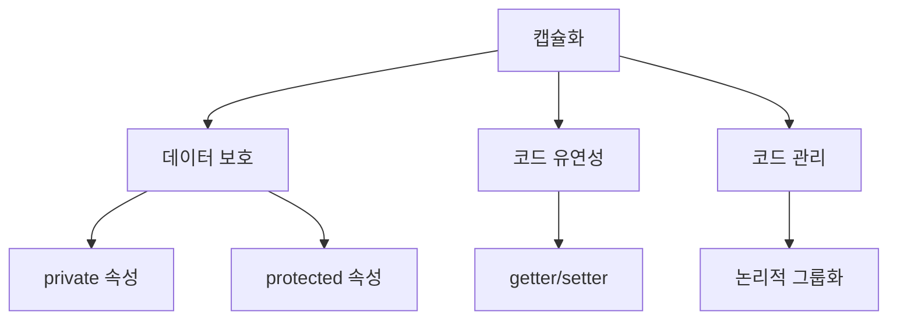

# Python 객체지향 프로그래밍: 캡슐화(Encapsulation) 🔒

## 목차
1. [캡슐화란?](#캡슐화란)
2. [접근 제어자의 이해](#접근-제어자의-이해)
3. [프로퍼티(Property) 활용](#프로퍼티-활용)
4. [실전 예제](#실전-예제)
5. [모범 사례와 권장사항](#모범-사례와-권장사항)

## 캡슐화란? 🎯

캡슐화는 객체지향 프로그래밍의 핵심 원칙 중 하나로, 데이터(속성)와 해당 데이터를 처리하는 메서드를 하나로 묶고, 외부로부터 접근을 제어하는 메커니즘입니다.

### 캡슐화의 주요 목적

1. **데이터 보호** 🛡️
   - 객체의 내부 데이터를 외부로부터 보호
   - 의도하지 않은 데이터 변경 방지

2. **코드 유연성** 🔄
   - 내부 구현 변경의 자유로움
   - 외부 코드에 영향을 주지 않는 수정 가능

3. **코드 관리** 📦
   - 관련된 데이터와 메서드를 논리적으로 그룹화
   - 코드의 복잡성 감소



## 접근 제어자의 이해 🔑

Python에서는 다음과 같은 명명 규칙으로 접근 제어를 구현합니다:

1. **Public 멤버**
   - 일반적인 이름 사용
   - 어디서나 접근 가능
   ```python
   class Person:
       def __init__(self):
           self.name = "홍길동"  # Public 속성
   ```

2. **Protected 멤버**
   - 언더스코어 한 개로 시작 (_)
   - 클래스 내부와 자식 클래스에서 접근
   ```python
   class Person:
       def __init__(self):
           self._age = 25  # Protected 속성
   ```

3. **Private 멤버**
   - 언더스코어 두 개로 시작 (__)
   - 해당 클래스 내부에서만 접근
   ```python
   class Person:
       def __init__(self):
           self.__address = "서울"  # Private 속성
   ```

## 프로퍼티(Property) 활용 ⚙️

프로퍼티를 사용하면 속성에 대한 접근을 제어하면서도 편리한 인터페이스를 제공할 수 있습니다.

```python
class Student:
    def __init__(self):
        self.__score = 0

    @property
    def score(self):
        return self.__score

    @score.setter
    def score(self, value):
        if 0 <= value <= 100:
            self.__score = value
        else:
            raise ValueError("점수는 0에서 100 사이여야 합니다.")
```

## 실전 예제 💡

은행 계좌 시스템을 통해 캡슐화의 실제 활용을 살펴보겠습니다:

```python
class BankAccount:
    def __init__(self, account_holder):
        self.__holder = account_holder    # Private
        self.__balance = 0                # Private
        self._account_type = "일반"       # Protected
        self.bank_name = "파이썬은행"     # Public

    @property
    def balance(self):
        return self.__balance

    def deposit(self, amount):
        if amount > 0:
            self.__balance += amount
            return f"{amount}원이 입금되었습니다."
        raise ValueError("양수 금액을 입력하세요.")

    def withdraw(self, amount):
        if 0 < amount <= self.__balance:
            self.__balance -= amount
            return f"{amount}원이 출금되었습니다."
        raise ValueError("잔액이 부족합니다.")
```

## 모범 사례와 권장사항 ✨

1. **최소 권한의 원칙**
   - 필요한 경우에만 public 접근 허용
   - 가능한 한 제한적인 접근 수준 사용

2. **프로퍼티 활용**
   - getter/setter 대신 프로퍼티 사용
   - 데이터 검증이 필요한 경우 적극 활용

3. **문서화**
   - 공개 인터페이스에 대한 명확한 문서화
   - 사용 방법과 제약사항 명시

4. **일관성 유지**
   - 비슷한 종류의 속성은 같은 접근 수준 유지
   - 명명 규칙의 일관성 유지

### 연습문제 🎯

다음 요구사항을 만족하는 `Person` 클래스를 구현해보세요:

1. 이름(name)은 public으로 설정
2. 나이(age)는 protected로 설정하고, 0살 미만이 되지 않도록 구현
3. 주민번호(ssn)는 private으로 설정하고, 마지막 6자리를 ******로 표시하는 메서드 구현

```python
class Person:
    def __init__(self, name, age, ssn):
        self.name = name            # Public
        self._age = age            # Protected
        self.__ssn = ssn          # Private

    @property
    def age(self):
        return self._age

    @age.setter
    def age(self, value):
        if value >= 0:
            self._age = value
        else:
            raise ValueError("나이는 0살 미만일 수 없습니다.")

    def get_masked_ssn(self):
        return self.__ssn[:-6] + "******"
```

이것으로 캡슐화에 대한 기본적인 내용을 모두 살펴보았습니다. 실제 프로그래밍에서 캡슐화를 적절히 활용하면 더 안전하고 유지보수가 쉬운 코드를 작성할 수 있습니다. 💪