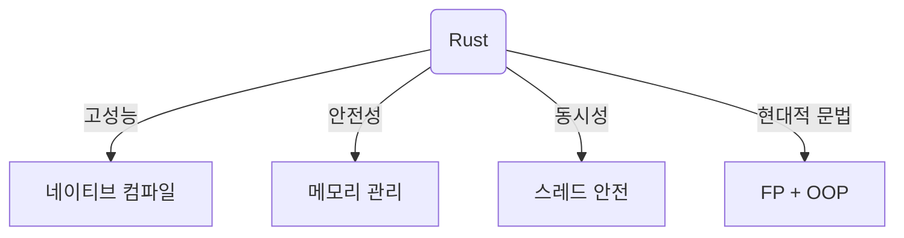

# 🦀 Rust 기본 문법 및 개요

## 📌 개요
Rust는 빠르고 안전하며 병렬성을 잘 지원하는 시스템 프로그래밍 언어입니다. 
이 장에서는 Rust의 기본적인 문법을 다루며, 처음 접하는 개발자도 쉽게 이해할 수 있도록 설명하겠습니다.

---

## 🎯 Rust란 무엇인가?

Rust는 **메모리 안전성**과 **고성능**을 동시에 제공하는 언어입니다. 

✅ **메모리 안전성 (Memory Safety)**
- C, C++처럼 직접 메모리를 관리하는 대신, **소유권(Ownership)** 개념을 도입하여 **런타임 비용 없이 메모리를 안전하게 관리**합니다.

✅ **고성능 (High Performance)**
- 네이티브 코드로 컴파일되며, **C/C++에 버금가는 성능**을 제공합니다.

✅ **동시성 (Concurrency)**
- Rust의 **스레드 안전성(thread safety) 보장**을 통해 안전한 병렬 프로그래밍이 가능합니다.

✅ **현대적인 문법 (Modern Syntax)**
- 함수형(FP)과 객체지향(OOP)의 장점을 결합한 깔끔한 문법을 제공합니다.

✅ **크로스플랫폼 지원**
- Windows, macOS, Linux 등 다양한 운영체제에서 실행할 수 있습니다.




---

## 🛠️ Rust 개발 환경 설정

### 1️⃣ Rust 설치하기
Rust는 공식적으로 **rustup**을 통해 설치할 수 있습니다.

📌 **Windows, macOS, Linux** 공통 설치 방법:
```sh
curl --proto '=https' --tlsv1.2 -sSf https://sh.rustup.rs | sh
```

📌 **설치 확인**
```sh
rustc --version  # Rust 컴파일러 버전 확인
cargo --version  # Cargo 패키지 매니저 버전 확인
```

> 📢 `rustc`는 Rust 컴파일러, `cargo`는 패키지 매니저입니다.

### 2️⃣ Hello, World! 실행하기
Rust에서는 `main.rs` 파일을 만들고 다음과 같이 코드를 작성할 수 있습니다.

```rust
fn main() {
    println!("Hello, Rust!");
}
```

📌 실행 방법:
```sh
rustc main.rs  # Rust 코드 컴파일
./main         # 실행
```

**더 쉬운 방법:** `cargo`를 사용하면 더 편리하게 실행할 수 있습니다.

```sh
cargo new hello_rust  # 새로운 프로젝트 생성
cd hello_rust
cargo run             # 실행
```

---

## 📝 Rust 기본 문법

### 🏷️ 변수 (Variables)
Rust의 변수는 기본적으로 **불변(immutable)** 입니다.

```rust
fn main() {
    let x = 5; // 기본적으로 불변
    println!("x의 값: {}", x);

    let mut y = 10; // 가변 변수
    y = 20;
    println!("y의 값: {}", y);
}
```

🔹 `let x = 5;` → `x`는 불변(immutable) 변수이며 값을 변경할 수 없음
🔹 `let mut y = 10;` → `mut` 키워드를 사용하면 가변(mutable) 변수 선언 가능

### 🏷️ 데이터 타입 (Data Types)
Rust는 정적 타입(static typing) 언어로, 컴파일러가 타입을 검사합니다.

#### 📌 기본 데이터 타입
| 타입 | 설명 |
|------|------------|
| `i32` | 32비트 정수 |
| `f64` | 64비트 실수 |
| `bool` | 불리언 (true/false) |
| `char` | 문자 (유니코드 지원) |
| `&str` | 문자열 (참조형) |

```rust
fn main() {
    let a: i32 = 10;
    let b: f64 = 3.14;
    let c: bool = true;
    let d: char = 'R';
    let e: &str = "Rust";

    println!("정수: {}, 실수: {}, 불리언: {}, 문자: {}, 문자열: {}", a, b, c, d, e);
}
```

### 🏷️ 함수 (Functions)

Rust에서는 `fn` 키워드를 사용하여 함수를 정의합니다.

```rust
fn add(x: i32, y: i32) -> i32 {
    x + y // 마지막 표현식은 세미콜론 없음
}

fn main() {
    let result = add(5, 10);
    println!("결과: {}", result);
}
```

🔹 `fn add(x: i32, y: i32) -> i32` → 정수를 입력받아 정수를 반환하는 함수
🔹 `x + y;` 가 아닌 `x + y` → Rust에서는 **마지막 표현식의 결과가 반환값**

### 🏷️ 제어문 (Control Flow)

#### 📌 if 조건문
```rust
fn main() {
    let num = 10;
    if num > 5 {
        println!("{}는 5보다 큽니다.", num);
    } else {
        println!("{}는 5보다 작거나 같습니다.", num);
    }
}
```

#### 📌 반복문 (Loop, while, for)
```rust
fn main() {
    for i in 1..=5 { // 1부터 5까지 반복
        println!("반복: {}", i);
    }
}
```

---

## 🎯 마무리

이 장에서는 Rust의 기본적인 문법을 배웠습니다. 
다음 장에서는 **메모리 관리 및 소유권(Ownership)** 개념을 자세히 살펴보겠습니다! 🚀
