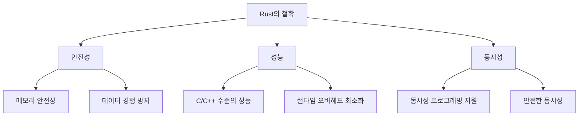

# 1. Getting Started

이 문서는 Rust를 처음 시작하는 분들을 위한 가이드입니다.  
Rust의 설치 방법, 기본 프로젝트 생성, 그리고 Rust의 철학과 특징을 다룹니다.

---

## 🛠️ Rust 설치

Rust는 `rustup`이라는 도구를 통해 쉽게 설치할 수 있습니다.  
`rustup`은 Rust의 버전 관리 및 도구 체인을 관리해주는 유틸리티입니다.

### 설치 명령어
터미널에서 다음 명령어를 실행하여 Rust를 설치합니다.

```bash
curl --proto '=https' --tlsv1.2 -sSf https://sh.rustup.rs | sh
```

### 설치 확인
설치가 완료되면 다음 명령어로 Rust가 정상적으로 설치되었는지 확인합니다.

```bash
rustc --version
```

출력 예시:
```
rustc 1.65.0 (897e37553 2022-11-02)
```

---

## 🚀 기본 프로젝트 생성

Rust 프로젝트는 `Cargo`를 통해 생성하고 관리합니다.  
`Cargo`는 Rust의 빌드 시스템이자 패키지 매니저입니다.

### 프로젝트 생성
다음 명령어로 새로운 Rust 프로젝트를 생성합니다.

```bash
cargo new my_project
```

이 명령어는 `my_project`라는 이름의 디렉토리를 생성하고, 기본적인 프로젝트 구조를 설정합니다.

### 프로젝트 구조
생성된 프로젝트의 구조는 다음과 같습니다.

```
my_project/
├── Cargo.toml
├── src/
│   └── main.rs
└── .git/
```

- **`Cargo.toml`**: 프로젝트의 메타데이터와 의존성을 정의합니다.
- **`src/main.rs`**: 프로젝트의 진입점(entry point)입니다.
- **`.git/`**: Git 저장소 초기화 (기본적으로 `cargo new`는 Git 저장소를 생성합니다).

### 프로젝트 실행
프로젝트 디렉토리로 이동한 후, 다음 명령어로 프로젝트를 실행합니다.

```bash
cd my_project
cargo run
```

출력 예시:
```
Hello, world!
```

---

## 🧠 Rust의 철학과 특징

Rust는 다음과 같은 핵심 철학을 가지고 있습니다:

1. **안전성 (Safety)**
   - 메모리 안전성을 보장합니다.
   - 데이터 경쟁(data race)을 방지합니다.

2. **성능 (Performance)**
   - C/C++와 유사한 수준의 성능을 제공합니다.
   - 런타임 오버헤드가 거의 없습니다.

3. **동시성 (Concurrency)**
   - 동시성 프로그래밍을 쉽고 안전하게 할 수 있도록 지원합니다.

### Rust의 특징 다이어그램



---

## 📂 Cargo.toml 파일 이해

`Cargo.toml`은 프로젝트의 메타데이터와 의존성을 정의하는 파일입니다.  
기본적으로 다음과 같은 내용을 포함합니다.

```toml
[package]
name = "my_project"
version = "0.1.0"
edition = "2021"

[dependencies]
```

- **`[package]`**: 프로젝트의 이름, 버전, Rust 에디션 등을 정의합니다.
- **`[dependencies]`**: 프로젝트에서 사용하는 외부 라이브러리(크레이트)를 정의합니다.

---

## 📝 기본 코드 이해

`src/main.rs` 파일에는 기본적으로 다음과 같은 코드가 작성되어 있습니다.

```rust
fn main() {
    println!("Hello, world!");
}
```

- **`fn main()`**: 프로그램의 진입점입니다.
- **`println!`**: 표준 출력에 텍스트를 출력하는 매크로입니다.

---

## 🎯 학습 목표

이 섹션을 마치면 다음과 같은 내용을 이해할 수 있습니다:

- Rust를 설치하고 환경을 설정하는 방법
- `Cargo`를 사용하여 기본 프로젝트를 생성하고 실행하는 방법
- Rust의 철학과 특징
- `Cargo.toml` 파일의 구조와 역할
- 기본적인 Rust 코드 작성 및 실행

---

## 📚 추가 자료

- [Rust 공식 설치 가이드](https://www.rust-lang.org/tools/install)
- [The Rust Programming Language - Chapter 1: Getting Started](https://doc.rust-lang.org/book/ch01-00-getting-started.html)

---

다음으로 [2. Syntax Basics](../2.%20Syntax%20Basics/)에서 Rust의 기본 문법을 학습해보세요! 🦀

---

이 문서는 Rust를 처음 시작하는 사람들이 쉽게 따라할 수 있도록 구성되었습니다. Mermaid 다이어그램을 통해 Rust의 철학과 특징을 시각적으로 표현하여 이해를 돕고 있습니다. 필요에 따라 추가적인 내용을 보완하거나 수정할 수 있습니다. 😊