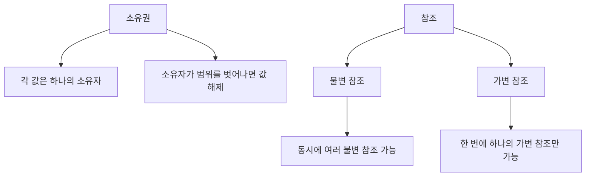

# 2. Syntax Basics

이 문서는 Rust의 기본 문법을 다룹니다.  
변수, 데이터 타입, 함수, 제어문 등 Rust 프로그래밍의 핵심 요소를 학습합니다.

---

## 📌 변수와 데이터 타입

Rust는 정적 타입 언어로, 모든 변수의 타입이 컴파일 시점에 결정됩니다.  
변수는 기본적으로 불변(immutable)이며, 가변(mutable)으로 선언하려면 `mut` 키워드를 사용합니다.

### 변수 선언
```rust
fn main() {
    let x = 5; // 불변 변수
    let mut y = 10; // 가변 변수
    y = 20; // 가변 변수는 값 변경 가능
    println!("x = {}, y = {}", x, y);
}
```

### 데이터 타입
Rust는 스칼라(Scalar)와 복합(Compound) 타입으로 나뉩니다.

#### 1. 스칼라 타입
- **정수형**: `i32`, `u32`, `i64`, `u64` 등
- **부동소수점**: `f32`, `f64`
- **불리언**: `bool`
- **문자**: `char`

#### 2. 복합 타입
- **튜플(Tuple)**: 고정된 길이의 다양한 타입을 저장
- **배열(Array)**: 고정된 길이의 동일한 타입을 저장

```rust
fn main() {
    let tup: (i32, f64, char) = (500, 6.4, 'A'); // 튜플
    let arr = [1, 2, 3, 4, 5]; // 배열
    println!("튜플: {:?}, 배열: {:?}", tup, arr);
}
```

---

## 📌 함수

Rust에서 함수는 `fn` 키워드로 정의합니다.  
함수의 매개변수와 반환 값은 타입을 명시해야 합니다.

### 함수 정의
```rust
fn add(a: i32, b: i32) -> i32 {
    a + b // 반환 값 (세미콜론 없음)
}

fn main() {
    let result = add(5, 10);
    println!("5 + 10 = {}", result);
}
```

### 표현식(Expression) vs 문장(Statement)
- **표현식**: 값을 반환 (예: `a + b`)
- **문장**: 값을 반환하지 않음 (예: `let x = 5;`)

---

## 📌 제어문

Rust는 조건문과 반복문을 통해 프로그램의 흐름을 제어합니다.

### 조건문 (`if`, `match`)
```rust
fn main() {
    let number = 7;

    if number < 5 {
        println!("5보다 작습니다.");
    } else {
        println!("5보다 크거나 같습니다.");
    }

    match number {
        1 => println!("One"),
        2 | 3 | 5 | 7 => println!("소수입니다."),
        _ => println!("기타 숫자"),
    }
}
```

### 반복문 (`loop`, `while`, `for`)
```rust
fn main() {
    // loop
    let mut count = 0;
    loop {
        count += 1;
        if count == 3 {
            break;
        }
    }

    // while
    while count < 5 {
        count += 1;
    }

    // for
    for i in 0..5 {
        println!("i = {}", i);
    }
}
```

---

## 📌 소유권(Ownership)과 참조(Borrowing)

Rust의 가장 독특한 기능 중 하나는 소유권 시스템입니다.  
이 시스템은 메모리 안전성을 보장하며, 가비지 컬렉터 없이도 메모리 누수를 방지합니다.

### 소유권 규칙
1. 각 값은 소유자(owner)가 있습니다.
2. 한 번에 하나의 소유자만 존재할 수 있습니다.
3. 소유자가 범위를 벗어나면 값은 메모리에서 해제됩니다.

### 참조(Borrowing)
참조를 통해 소유권을 이전하지 않고 값을 사용할 수 있습니다.

```rust
fn main() {
    let s1 = String::from("hello");
    let len = calculate_length(&s1); // 참조 전달
    println!("'{}'의 길이는 {}입니다.", s1, len);
}

fn calculate_length(s: &String) -> usize {
    s.len()
}
```

### 소유권과 참조 다이어그램



---

## 📌 슬라이스(Slice)

슬라이스는 컬렉션의 일부를 참조하는 데 사용됩니다.  
슬라이스는 참조이므로 소유권을 이전하지 않습니다.

```rust
fn main() {
    let s = String::from("hello world");
    let hello = &s[0..5]; // 슬라이스
    let world = &s[6..11];
    println!("{} {}", hello, world);
}
```

---

## 🎯 학습 목표

이 섹션을 마치면 다음과 같은 내용을 이해할 수 있습니다:

- 변수와 데이터 타입의 사용법
- 함수의 정의와 호출 방법
- 조건문과 반복문을 통한 프로그램 흐름 제어
- Rust의 소유권 및 참조 시스템
- 슬라이스를 통한 데이터 참조

---

## 📚 추가 자료

- [The Rust Programming Language - Chapter 3: Common Programming Concepts](https://doc.rust-lang.org/book/ch03-00-common-programming-concepts.html)
- [Rust by Example - Functions](https://doc.rust-lang.org/rust-by-example/fn.html)

---

다음으로 [3. Data Structures](../3.%20Data%20Structures/)에서 Rust의 데이터 구조를 학습해보세요! 🦀

---

이 문서는 Rust의 기본 문법을 체계적으로 설명하며, Mermaid 다이어그램을 통해 소유권과 참조 개념을 시각적으로 표현했습니다. 필요에 따라 추가적인 내용을 보완하거나 수정할 수 있습니다. 😊